# Polyglot Codebase Knowledge Graph

> Generated offline by **readmenator**. Supports C, C++, Python, Go, Rust, JS/TS, Java, C#, Shell, PHP, Dart, GDScript, Nim, ASM, Ruby, Swift, Kotlin, Scala, Lua, Elixir.
> No LLMs. No tokens. Pure static analysis. See more [here](https://github.com/grisuno/ReadMenator)

**Total Files Parsed:** 294 | **Total Symbols Extracted:** 563 | **Total Imports:** 668
 | **Resolved Imports:** 322

<!-- ranking_model: v1.0 | weights: {ppr:0.45,auth:0.2,test:0.15,doc:0.1,fresh:0.1} | alpha:0.85 | commit:4c8e0d2 | date:2026-07-18 -->


## Table of Contents

1. [Statistics Dashboard](#statistics-dashboard)
2. [Architectural Layers](#architectural-layers)
3. [Ranked Context](#ranked-context)
4. [God Nodes](#god-nodes)
5. [Community Analysis](#community-analysis)
6. [Surprising Connections](#surprising-connections)
7. [Suggested Questions](#suggested-questions)
8. [Hotspot Analysis](#hotspot-analysis)
9. [Dependency Cycles](#dependency-cycles)
10. [Change Impact Analysis](#change-impact-analysis)
11. [Architecture Violations](#architecture-violations)
12. [Suggested Linting Rules](#suggested-linting-rules)
13. [Orphans](#orphans)
14. [Query Recipes](#query-recipes)
15. [Structural Knowledge Map](#structural-knowledge-map)
16. [UML Class Diagram](#uml-class-diagram)
17. [Code Property Graph](#code-property-graph)
18. [Architecture Reference](#architecture-reference)
    - [JS (2 files)](#js-2-files)
    - [SH (11 files)](#sh-11-files)
    - [TS (196 files)](#ts-196-files)
    - [TSX (85 files)](#tsx-85-files)

---

## Statistics Dashboard

| Metric | Value |
|--------|-------|
| Total Files | 294 |
| Total Symbols | 563 |
| Total Imports | 668 |
| Call Edges | 7987 |
| Inheritance Edges | 20 |
| Languages | 4 |
| Avg Symbols/File | 1.9 |
| Avg Imports/File | 2.3 |
| Resolved Imports | 322 |

### Top Files by Import Count (Fan-Out)

| File | Imports | Symbols | Language |
|------|---------|---------|----------|
| `rag_service.ts` | 19 | 3 | ts |
| `map_service.ts` | 16 | 7 | ts |
| `zim_service.ts` | 15 | 1 | ts |
| `docker_service.ts` | 11 | 5 | ts |
| `system_service.ts` | 11 | 7 | ts |
| `ollama_controller.ts` | 10 | 1 | ts |
| `app.tsx` | 10 | 1 | tsx |
| `index.tsx` | 10 | 26 | tsx |
| `models.tsx` | 10 | 9 | tsx |
| `remote-explorer.tsx` | 10 | 13 | tsx |

---

## Architectural Layers

Auto-detected from path patterns, naming conventions, and imported frameworks.

| Layer | Files |
|-------|-------|
| presentation | 120 |
| utility | 67 |
| data_access | 35 |
| business_logic | 34 |
| infrastructure | 29 |
| testing | 9 |

### utility

- `ace.js` (js, 0 symbols)
- `adonisrc.ts` (ts, 0 symbols)
- `internal_server_error_exception.ts` (ts, 1 symbols)
- `check_update_job.ts` (ts, 1 symbols)
- `embed_file_job.ts` (ts, 6 symbols)
- `run_benchmark_job.ts` (ts, 1 symbols)
- `run_download_job.ts` (ts, 2 symbols)
- `run_extract_pmtiles_job.ts` (ts, 1 symbols)
- `downloads.ts` (ts, 7 symbols)
- `fs.ts` (ts, 15 symbols)
- `kb_ingest_decision.ts` (ts, 1 symbols)
- `kb_job_health.ts` (ts, 1 symbols)
- `kb_ratio_lookup.ts` (ts, 3 symbols)
- `kb_warning_decision.ts` (ts, 1 symbols)
- `misc.ts` (ts, 3 symbols)
- *... and 52 more*

### presentation

- `benchmark_controller.ts` (ts, 2 symbols)
- `chats_controller.ts` (ts, 1 symbols)
- `collection_updates_controller.ts` (ts, 1 symbols)
- `docs_controller.ts` (ts, 1 symbols)
- `downloads_controller.ts` (ts, 1 symbols)
- `easy_setup_controller.ts` (ts, 1 symbols)
- `home_controller.ts` (ts, 1 symbols)
- `maps_controller.ts` (ts, 1 symbols)
- `ollama_controller.ts` (ts, 1 symbols)
- `rag_controller.ts` (ts, 1 symbols)
- `settings_controller.ts` (ts, 1 symbols)
- `system_controller.ts` (ts, 1 symbols)
- `zim_controller.ts` (ts, 1 symbols)
- `handler.ts` (ts, 1 symbols)
- `zim_extraction_service.ts` (ts, 1 symbols)
- *... and 105 more*

### business_logic

- `check_service_updates_job.ts` (ts, 1 symbols)
- `download_model_job.ts` (ts, 1 symbols)
- `benchmark_result.ts` (ts, 1 symbols)
- `benchmark_setting.ts` (ts, 1 symbols)
- `chat_message.ts` (ts, 1 symbols)
- `chat_session.ts` (ts, 1 symbols)
- `collection_manifest.ts` (ts, 1 symbols)
- `custom_library_source.ts` (ts, 1 symbols)
- `installed_resource.ts` (ts, 1 symbols)
- `kb_ingest_state.ts` (ts, 1 symbols)
- `kb_ratio_registry.ts` (ts, 1 symbols)
- `kv_store.ts` (ts, 1 symbols)
- `map_marker.ts` (ts, 1 symbols)
- `service.ts` (ts, 1 symbols)
- `wikipedia_selection.ts` (ts, 1 symbols)
- *... and 19 more*

### infrastructure

- `compression_middleware.ts` (ts, 1 symbols)
- `container_bindings_middleware.ts` (ts, 3 symbols)
- `force_json_response_middleware.ts` (ts, 1 symbols)
- `maps_static_middleware.ts` (ts, 1 symbols)
- `settings.ts` (ts, 0 symbols)
- `work.ts` (ts, 1 symbols)
- `app.ts` (ts, 0 symbols)
- `bodyparser.ts` (ts, 0 symbols)
- `cors.ts` (ts, 0 symbols)
- `hash.ts` (ts, 0 symbols)
- `inertia.ts` (ts, 2 symbols)
- `logger.ts` (ts, 0 symbols)
- `queue.ts` (ts, 0 symbols)
- `session.ts` (ts, 0 symbols)
- `shield.ts` (ts, 0 symbols)
- *... and 14 more*

### data_access

- `database.ts` (ts, 0 symbols)
- `kv_store.ts` (ts, 0 symbols)
- `1751086751801_create_services_table.ts` (ts, 1 symbols)
- `1763499145832_update_services_table.ts` (ts, 1 symbols)
- `1764912210741_create_curated_collections_table.ts` (ts, 1 symbols)
- `1764912270123_create_curated_collection_resources_table.ts` (ts, 1 symbols)
- `1768170944482_update_services_add_installation_statuses_table.ts` (ts, 1 symbols)
- `1768453747522_update_services_add_icon.ts` (ts, 1 symbols)
- `1769097600001_create_benchmark_results_table.ts` (ts, 1 symbols)
- `1769097600002_create_benchmark_settings_table.ts` (ts, 1 symbols)
- `1769300000001_add_powered_by_and_display_order_to_services.ts` (ts, 1 symbols)
- `1769300000002_update_services_friendly_names.ts` (ts, 1 symbols)
- `1769324448000_add_builder_tag_to_benchmark_results.ts` (ts, 1 symbols)
- `1769400000001_create_installed_tiers_table.ts` (ts, 1 symbols)
- `1769400000002_create_kv_store_table.ts` (ts, 1 symbols)
- *... and 20 more*

### testing

- `cloud_metadata_url.spec.ts` (ts, 2 symbols)
- `global_map_banner.spec.ts` (ts, 0 symbols)
- `kb_file_grouping.spec.ts` (ts, 1 symbols)
- `kb_guardrail.spec.ts` (ts, 0 symbols)
- `kb_ingest_decision.spec.ts` (ts, 0 symbols)
- `kb_job_health.spec.ts` (ts, 0 symbols)
- `kb_ratio_lookup.spec.ts` (ts, 0 symbols)
- `kb_warning_decision.spec.ts` (ts, 0 symbols)
- `zim_filename.spec.ts` (ts, 0 symbols)

---

## Ranked Context

Files ranked by composite score for the current query context. The ranking combines Personalized PageRank (query relevance), global authority, test coverage, documentation coverage, and code freshness. Model: v1.0.

| Rank | File | Composite | PPR | Authority | Test | Doc |
|------|------|-----------|-----|-----------|------|-----|
| 1 | `queue_service.ts` | 0.1077 | 0.0118 | 0.0118 | 0.00 | 1.00 |
| 2 | `useInternetStatus.ts` | 0.1046 | 0.0071 | 0.0071 | 0.00 | 1.00 |
| 3 | `kb_job_health_display.ts` | 0.1037 | 0.0056 | 0.0056 | 0.00 | 1.00 |
| 4 | `useDiskDisplayData.ts` | 0.1035 | 0.0053 | 0.0053 | 0.00 | 1.00 |
| 5 | `kb_guardrail.ts` | 0.1029 | 0.0045 | 0.0045 | 0.00 | 1.00 |
| 6 | `app.tsx` | 0.1026 | 0.0040 | 0.0040 | 0.00 | 1.00 |
| 7 | `MarkdocRenderer.tsx` | 0.1026 | 0.0040 | 0.0040 | 0.00 | 1.00 |
| 8 | `KbPolicyPromptBanner.tsx` | 0.1026 | 0.0040 | 0.0040 | 0.00 | 1.00 |
| 9 | `map_static_provider.ts` | 0.1026 | 0.0040 | 0.0040 | 0.00 | 1.00 |
| 10 | `force_json_response_middleware.ts` | 0.1000 | 0.0000 | 0.0000 | 0.00 | 1.00 |

---

## God Nodes

Most architecturally central files ranked by combined import/export degree and symbol richness.

| File | Score | Connections | PageRank |
|------|-------|-------------|----------|
| `classNames.ts` | 40.1 | | 0.0000 |
| `update.tsx` | 32.9 | | 0.0000 |
| `NotificationContext.ts` | 24.1 | | 0.0000 |
| `docker_service.ts` | 22.5 | | 0.0000 |
| `settings_controller.ts` | 20.1 | | 0.0000 |
| `ModalContext.ts` | 20.1 | | 0.0000 |
| `system_service.ts` | 18.7 | | 0.0000 |
| `embed_file_job.ts` | 18.6 | | 0.0000 |
| `index.tsx` | 18.6 | | 0.0000 |
| `run_download_job.ts` | 18.2 | | 0.0000 |

---

## Community Analysis

Files grouped by import-based community detection. Cohesion measures how tightly connected each community is internally.

### admin/commands/benchmark (Cohesion: 0.58)

**8 files** in this community:

- `ace.js` (js, 0 symbols)
- `benchmark_controller.ts` (ts, 2 symbols)
- `settings.ts` (ts, 0 symbols)
- `results.ts` (ts, 1 symbols)
- `run.ts` (ts, 1 symbols)
- `submit.ts` (ts, 1 symbols)
- `service_seeder.ts` (ts, 1 symbols)
- `show.tsx` (tsx, 1 symbols)

### admin/app/services (Cohesion: 0.77)

**49 files** in this community:

- `chats_controller.ts` (ts, 1 symbols)
- `downloads_controller.ts` (ts, 1 symbols)
- `easy_setup_controller.ts` (ts, 1 symbols)
- `home_controller.ts` (ts, 1 symbols)
- `maps_controller.ts` (ts, 1 symbols)
- `ollama_controller.ts` (ts, 1 symbols)
- `rag_controller.ts` (ts, 1 symbols)
- `settings_controller.ts` (ts, 1 symbols)
- `system_controller.ts` (ts, 1 symbols)
- `check_service_updates_job.ts` (ts, 1 symbols)
- `check_update_job.ts` (ts, 1 symbols)
- `download_model_job.ts` (ts, 1 symbols)
- `embed_file_job.ts` (ts, 6 symbols)
- `run_benchmark_job.ts` (ts, 1 symbols)
- `run_download_job.ts` (ts, 2 symbols)
- `run_extract_pmtiles_job.ts` (ts, 1 symbols)
- `service.ts` (ts, 1 symbols)
- `benchmark_service.ts` (ts, 2 symbols)
- `chat_service.ts` (ts, 1 symbols)
- `collection_manifest_service.ts` (ts, 1 symbols)
- ... and 29 more files

### admin/app/controllers (Cohesion: 0.50)

**6 files** in this community:

- `collection_updates_controller.ts` (ts, 1 symbols)
- `zim_controller.ts` (ts, 1 symbols)
- `collection_update_service.ts` (ts, 1 symbols)
- `zim_service.ts` (ts, 1 symbols)
- `common.ts` (ts, 2 symbols)
- `curated_collections.ts` (ts, 0 symbols)

### admin/app/controllers (Cohesion: 0.50)

**2 files** in this community:

- `docs_controller.ts` (ts, 1 symbols)
- `docs_service.ts` (ts, 1 symbols)

### admin/app/middleware (Cohesion: 1.00)

**2 files** in this community:

- `container_bindings_middleware.ts` (ts, 3 symbols)
- `logger.ts` (ts, 0 symbols)

### admin/app/utils (Cohesion: 0.50)

**2 files** in this community:

- `downloads.ts` (ts, 7 symbols)
- `fs.ts` (ts, 15 symbols)

### admin/config (Cohesion: 1.00)

**2 files** in this community:

- `static.ts` (ts, 0 symbols)
- `map_static_provider.ts` (ts, 1 symbols)

### admin/config (Cohesion: 1.00)

**2 files** in this community:

- `vite.ts` (ts, 0 symbols)
- `vite.config.ts` (ts, 0 symbols)

### admin/inertia/components (Cohesion: 0.75)

**19 files** in this community:

- `map_regions.ts` (ts, 1 symbols)
- `Alert.tsx` (tsx, 7 symbols)
- `CountryPickerModal.tsx` (tsx, 5 symbols)
- `DynamicIcon.tsx` (tsx, 0 symbols)
- `HorizontalBarChart.tsx` (tsx, 5 symbols)
- `InstallActivityFeed.tsx` (tsx, 0 symbols)
- `StorageProjectionBar.tsx` (tsx, 6 symbols)
- `StyledModal.tsx` (tsx, 0 symbols)
- `StyledSidebar.tsx` (tsx, 3 symbols)
- `StyledTable.tsx` (tsx, 3 symbols)
- `WikipediaSelector.tsx` (tsx, 0 symbols)
- `ChatInterface.tsx` (tsx, 6 symbols)
- `ChatMessageBubble.tsx` (tsx, 1 symbols)
- `ChatSidebar.tsx` (tsx, 2 symbols)
- `Input.tsx` (tsx, 0 symbols)
- `CircularGauge.tsx` (tsx, 3 symbols)
- `InfoCard.tsx` (tsx, 2 symbols)
- `classNames.ts` (ts, 1 symbols)
- `icons.ts` (ts, 0 symbols)

### admin/inertia/hooks (Cohesion: 0.59)

**16 files** in this community:

- `service_names.ts` (ts, 0 symbols)
- `ActiveModelDownloads.tsx` (tsx, 5 symbols)
- `KnowledgeBaseModal.tsx` (tsx, 5 symbols)
- `ModalContext.ts` (ts, 1 symbols)
- `useDebounce.ts` (ts, 2 symbols)
- `useOllamaModelDownloads.ts` (ts, 1 symbols)
- `useServiceInstalledStatus.tsx` (tsx, 1 symbols)
- `AppLayout.tsx` (tsx, 1 symbols)
- `SettingsLayout.tsx` (tsx, 1 symbols)
- `kb_file_grouping.ts` (ts, 3 symbols)
- `benchmark.tsx` (tsx, 8 symbols)
- `models.tsx` (tsx, 9 symbols)
- `index.tsx` (tsx, 7 symbols)
- `remote-explorer.tsx` (tsx, 13 symbols)
- `ModalProvider.tsx` (tsx, 4 symbols)
- `docs.ts` (ts, 1 symbols)

### admin/inertia/app (Cohesion: 1.00)

**4 files** in this community:

- `app.tsx` (tsx, 1 symbols)
- `ThemeToggle.tsx` (tsx, 1 symbols)
- `useTheme.ts` (ts, 2 symbols)
- `ThemeProvider.tsx` (tsx, 2 symbols)

### admin/inertia/lib (Cohesion: 0.45)

**10 files** in this community:

- `ActiveDownloads.tsx` (tsx, 6 symbols)
- `KbPolicyPromptBanner.tsx` (tsx, 1 symbols)
- `NotificationContext.ts` (ts, 1 symbols)
- `useDownloads.ts` (ts, 2 symbols)
- `useErrorNotification.ts` (ts, 2 symbols)
- `api.ts` (ts, 1 symbols)
- `global_map_banner.ts` (ts, 1 symbols)
- `util.ts` (ts, 12 symbols)
- `maps.tsx` (tsx, 10 symbols)
- `NotificationProvider.tsx` (tsx, 5 symbols)

### admin/inertia/components (Cohesion: 1.00)

**3 files** in this community:

- `ActiveEmbedJobs.tsx` (tsx, 1 symbols)
- `useEmbedJobs.ts` (ts, 2 symbols)
- `kb_job_health_display.ts` (ts, 2 symbols)

### admin/inertia/components/markdoc (Cohesion: 1.00)

**6 files** in this community:

- `MarkdocRenderer.tsx` (tsx, 6 symbols)
- `Heading.tsx` (tsx, 1 symbols)
- `Image.tsx` (tsx, 1 symbols)
- `List.tsx` (tsx, 1 symbols)
- `ListItem.tsx` (tsx, 1 symbols)
- `Table.tsx` (tsx, 6 symbols)

### admin/inertia/hooks (Cohesion: 0.45)

**5 files** in this community:

- `TierSelectionModal.tsx` (tsx, 6 symbols)
- `useDiskDisplayData.ts` (ts, 2 symbols)
- `useSystemInfo.ts` (ts, 1 symbols)
- `kb_guardrail.ts` (ts, 1 symbols)
- `system.tsx` (tsx, 3 symbols)

### admin/inertia/components/chat (Cohesion: 0.38)

**6 files** in this community:

- `ChatModal.tsx` (tsx, 1 symbols)
- `index.tsx` (tsx, 1 symbols)
- `useSystemSetting.ts` (ts, 1 symbols)
- `useUpdateAvailable.ts` (ts, 1 symbols)
- `navigation.ts` (ts, 1 symbols)
- `home.tsx` (tsx, 2 symbols)

### admin/inertia/components/maps (Cohesion: 1.00)

**3 files** in this community:

- `MapComponent.tsx` (tsx, 1 symbols)
- `MarkerPanel.tsx` (tsx, 1 symbols)
- `useMapMarkers.ts` (ts, 1 symbols)

---

## Surprising Connections

Files in different communities connected through 3+ indirect hops.

- `downloads.ts` <-> `map_regions.ts` (10 hops, across 3 communities)
- `downloads.ts` <-> `icons.ts` (10 hops, across 3 communities)
- `collection_update_service.ts` <-> `map_regions.ts` (9 hops, across 4 communities)
- `collection_update_service.ts` <-> `icons.ts` (9 hops, across 4 communities)
- `docs_service.ts` <-> `useOllamaModelDownloads.ts` (9 hops, across 4 communities)

---

## Suggested Questions

Auto-generated exploration prompts based on graph structure:

- What does classNames.ts depend on, and what depends on it? (20 connections)
- What does update.tsx depend on, and what depends on it? (16 connections)
- What does NotificationContext.ts depend on, and what depends on it? (12 connections)
- How are the 8 files in 'admin/commands/benchmark' related to each other?
- Why are downloads.ts and map_regions.ts connected through 10 hops across 3 communities?

---

## Hotspot Analysis

Files ranked by combined complexity (symbol count) and centrality (connection count). High-scoring files are architecturally critical and may need refactoring attention.

| File | Complexity | Centrality | Combined | Symbols | Connections |
|------|-----------|------------|----------|---------|-------------|
| `queue_service.ts` | 0.038 | 0.037 | 0.038 | 1 | 18 |
| `useInternetStatus.ts` | 0.038 | 0.021 | 0.028 | 1 | 10 |
| `kb_job_health_display.ts` | 0.077 | 0.018 | 0.042 | 2 | 9 |
| `useDiskDisplayData.ts` | 0.077 | 0.084 | 0.081 | 2 | 41 |
| `kb_guardrail.ts` | 0.038 | 0.014 | 0.024 | 1 | 7 |
| `app.tsx` | 0.038 | 0.035 | 0.036 | 1 | 17 |
| `MarkdocRenderer.tsx` | 0.231 | 0.035 | 0.113 | 6 | 17 |
| `KbPolicyPromptBanner.tsx` | 0.038 | 0.059 | 0.051 | 1 | 29 |
| `map_static_provider.ts` | 0.038 | 0.021 | 0.028 | 1 | 10 |
| `force_json_response_middleware.ts` | 0.038 | 0.006 | 0.019 | 1 | 3 |
| `index.tsx` | 1.000 | 0.530 | 0.718 | 26 | 258 |
| `rag_service.ts` | 0.115 | 1.000 | 0.646 | 3 | 487 |
| `docker_service.ts` | 0.192 | 0.805 | 0.560 | 5 | 392 |
| `system_service.ts` | 0.269 | 0.534 | 0.428 | 7 | 260 |
| `remote-explorer.tsx` | 0.500 | 0.359 | 0.416 | 13 | 175 |

---

## Dependency Cycles

Circular dependencies detected in the resolved import graph. Cycles increase coupling and make refactoring harder.

| Cycle | Length | Files |
|-------|--------|-------|
| `run_download_job.ts -> zim_service.ts` | 2 | 2 |
| `run_download_job.ts -> map_service.ts` | 2 | 2 |
| `download_model_job.ts -> ollama_service.ts` | 2 | 2 |

---

## Change Impact Analysis

Files sorted by how many other files would be affected if they changed. High-impact files should be changed with caution.

| File | Direct Dependents | Transitive Dependents | Total Impact |
|------|------------------|----------------------|--------------|
| `NotificationContext.ts` | 12 | 34 | 46 |
| `useSystemSetting.ts` | 4 | 32 | 36 |
| `version.ts` | 4 | 30 | 34 |
| `update.tsx` | 13 | 19 | 32 |
| `broadcast.ts` | 8 | 23 | 31 |
| `classNames.ts` | 20 | 5 | 25 |
| `docker_service.ts` | 8 | 16 | 24 |
| `queue_service.ts` | 7 | 15 | 22 |
| `queue.ts` | 7 | 15 | 22 |
| `services.ts` | 8 | 14 | 22 |
| `common.ts` | 6 | 7 | 13 |
| `run_extract_pmtiles_job.ts` | 3 | 8 | 11 |
| `system_service.ts` | 8 | 3 | 11 |
| `curated_collections.ts` | 2 | 9 | 11 |
| `service_names.ts` | 9 | 2 | 11 |

---

## Architecture Violations

Violations of architectural layer rules detected in the import graph. **3 strict violations, 0 warnings.**

| Source | Source Layer | Target | Target Layer | Description | Severity |
|--------|-------------|--------|-------------|-------------|----------|
| `TierSelectionModal.tsx` | presentation | `useDiskDisplayData.ts` | data_access | presentation must not import data_access | strict |
| `index.tsx` | presentation | `useDiskDisplayData.ts` | data_access | presentation must not import data_access | strict |
| `system.tsx` | presentation | `useDiskDisplayData.ts` | data_access | presentation must not import data_access | strict |

---

## Suggested Linting Rules

Automatically suggested linting and security rules based on patterns detected in the codebase. These can be exported as Semgrep rules using the `--export-rules` flag.

| Rule ID | Severity | Description | Language | Matches |
|---------|----------|-------------|----------|---------|
| `RM001` | info | Large number of functions in ts: 153 total | ts | 153 |
| `RM002` | info | Large number of functions in tsx: 243 total | tsx | 243 |
| `RM003` | info | Large number of functions in sh: 67 total | sh | 67 |

---

## Orphans

Files with no documentation or low connectivity. These are candidates for documentation investment or cleanup.

- `ace.js` (0 symbols, no doc)
- `adonisrc.ts` (0 symbols, no doc)
- `chats_controller.ts` (1 symbols, no doc)
- `collection_updates_controller.ts` (1 symbols, no doc)
- `docs_controller.ts` (1 symbols, no doc)
- `downloads_controller.ts` (1 symbols, no doc)
- `easy_setup_controller.ts` (1 symbols, no doc)
- `home_controller.ts` (1 symbols, no doc)
- `maps_controller.ts` (1 symbols, no doc)
- `ollama_controller.ts` (1 symbols, no doc)
- `rag_controller.ts` (1 symbols, no doc)
- `settings_controller.ts` (1 symbols, no doc)
- `system_controller.ts` (1 symbols, no doc)
- `zim_controller.ts` (1 symbols, no doc)
- `handler.ts` (1 symbols, no doc)
- `internal_server_error_exception.ts` (1 symbols, no doc)
- `check_service_updates_job.ts` (1 symbols, no doc)
- `check_update_job.ts` (1 symbols, no doc)
- `download_model_job.ts` (1 symbols, no doc)
- `run_benchmark_job.ts` (1 symbols, no doc)
- *... and 221 more*

---

## Query Recipes

Example queries you can run against this knowledge base using the ranking engine:

```
# Find files most relevant to a concept
readmenator query "Where is the import resolver implemented?"

# Rank files by relevance to a topic
readmenator query "How does documentation generation work?"

# Explain why a file ranks highly
readmenator query "explain readmenator/_documentation.py"

# Trace dependency paths with ranked context
readmenator query "path from CLI to exporter"
```

The ranking model uses the following signals:

- **Personalized PageRank** (45% weight): query-specific relevance via seed propagation
- **Global Authority** (20% weight): structural importance via standard PageRank
- **Test Coverage** (15% weight): fraction of symbols referenced in test files
- **Doc Coverage** (10% weight): presence of docstrings and file-level docs
- **Freshness** (10% weight): recent modification activity

Results include score decomposition and justification paths for each ranked item.

---

## Structural Knowledge Map

> **Note:** The visual graph below has been intelligently pruned to the top 300 most relevant nodes to prevent rendering crashes. Full details of all files are documented in the Architecture Reference.

```mermaid
graph TD
    classDef mod fill:#1e1e1e,stroke:#ff6666,stroke-width:2px,color:#fff;
    classDef cls fill:#2d2d2d,stroke:#4ec9b0,stroke-width:2px,color:#fff;
    classDef fn fill:#333,stroke:#dcdcaa,stroke-width:1px,color:#dcdcaa;
    classDef ext fill:#111,stroke:#666,stroke-dasharray:5 5,color:#aaa;
    subgraph community_1 ["admin/app/services"]
    admin_app_services_rag_service_ts["rag_service.ts (ts)"]
    class admin_app_services_rag_service_ts mod;
    admin_app_services_rag_service_ts_progress["progress"]
    class admin_app_services_rag_service_ts_progress fn;
    admin_app_services_rag_service_ts --> admin_app_services_rag_service_ts_progress
    admin_app_services_rag_service_ts_RagService["RagService"]
    class admin_app_services_rag_service_ts_RagService cls;
    admin_app_services_rag_service_ts --> admin_app_services_rag_service_ts_RagService
    admin_app_services_rag_service_ts_if["if"]
    class admin_app_services_rag_service_ts_if cls;
    admin_app_services_rag_service_ts --> admin_app_services_rag_service_ts_if
    admin_app_services_docker_service_ts["docker_service.ts (ts)"]
    class admin_app_services_docker_service_ts mod;
    admin_app_services_docker_service_ts_used["used"]
    class admin_app_services_docker_service_ts_used fn;
    admin_app_services_docker_service_ts --> admin_app_services_docker_service_ts_used
    admin_app_services_docker_service_ts_is["is"]
    class admin_app_services_docker_service_ts_is fn;
    admin_app_services_docker_service_ts --> admin_app_services_docker_service_ts_is
    admin_app_services_docker_service_ts_marker["marker"]
    class admin_app_services_docker_service_ts_marker fn;
    admin_app_services_docker_service_ts --> admin_app_services_docker_service_ts_marker
    admin_app_services_docker_service_ts_gfx["gfx"]
    class admin_app_services_docker_service_ts_gfx fn;
    admin_app_services_docker_service_ts --> admin_app_services_docker_service_ts_gfx
    admin_app_services_docker_service_ts_DockerService["DockerService"]
    class admin_app_services_docker_service_ts_DockerService cls;
    admin_app_services_docker_service_ts --> admin_app_services_docker_service_ts_DockerService
    admin_inertia_pages_easy_setup_index_tsx["index.tsx (tsx)"]
    class admin_inertia_pages_easy_setup_index_tsx mod;
    admin_app_services_system_service_ts["system_service.ts (ts)"]
    class admin_app_services_system_service_ts mod;
    admin_app_services_map_service_ts["map_service.ts (ts)"]
    class admin_app_services_map_service_ts mod;
    admin_app_services_ollama_service_ts["ollama_service.ts (ts)"]
    class admin_app_services_ollama_service_ts mod;
    end
    subgraph community_11 ["admin/inertia/lib"]
    admin_inertia_lib_api_ts["api.ts (ts)"]
    class admin_inertia_lib_api_ts mod;
    end
    subgraph community_2 ["admin/app/controllers"]
    admin_app_services_zim_service_ts["zim_service.ts (ts)"]
    class admin_app_services_zim_service_ts mod;
    admin_app_services_benchmark_service_ts["benchmark_service.ts (ts)"]
    class admin_app_services_benchmark_service_ts mod;
    end
    subgraph community_9 ["admin/inertia/hooks"]
    admin_inertia_pages_settings_zim_remote_explorer_tsx["remote-explorer.tsx (tsx)"]
    class admin_inertia_pages_settings_zim_remote_explorer_tsx mod;
    admin_app_controllers_ollama_controller_ts["ollama_controller.ts (ts)"]
    class admin_app_controllers_ollama_controller_ts mod;
    admin_start_routes_ts["routes.ts (ts)"]
    class admin_start_routes_ts mod;
    admin_inertia_components_chat_KnowledgeBaseModal_tsx["KnowledgeBaseModal.tsx (tsx)"]
    class admin_inertia_components_chat_KnowledgeBaseModal_tsx mod;
    admin_app_controllers_maps_controller_ts["maps_controller.ts (ts)"]
    class admin_app_controllers_maps_controller_ts mod;
    admin_inertia_pages_settings_update_tsx["update.tsx (tsx)"]
    class admin_inertia_pages_settings_update_tsx mod;
    end
    subgraph community_15 ["admin/inertia/components/chat"]
    admin_inertia_components_chat_index_tsx["index.tsx (tsx)"]
    class admin_inertia_components_chat_index_tsx mod;
    admin_inertia_pages_settings_models_tsx["models.tsx (tsx)"]
    class admin_inertia_pages_settings_models_tsx mod;
    admin_app_jobs_embed_file_job_ts["embed_file_job.ts (ts)"]
    class admin_app_jobs_embed_file_job_ts mod;
    admin_inertia_pages_settings_benchmark_tsx["benchmark.tsx (tsx)"]
    class admin_inertia_pages_settings_benchmark_tsx mod;
    admin_app_services_collection_manifest_service_ts["collection_manifest_service.ts (ts)"]
    class admin_app_services_collection_manifest_service_ts mod;
    admin_app_services_download_service_ts["download_service.ts (ts)"]
    class admin_app_services_download_service_ts mod;
    admin_app_controllers_rag_controller_ts["rag_controller.ts (ts)"]
    class admin_app_controllers_rag_controller_ts mod;
    admin_app_services_zim_extraction_service_ts["zim_extraction_service.ts (ts)"]
    class admin_app_services_zim_extraction_service_ts mod;
    admin_app_validators_common_ts["common.ts (ts)"]
    class admin_app_validators_common_ts mod;
    admin_inertia_pages_settings_maps_tsx["maps.tsx (tsx)"]
    class admin_inertia_pages_settings_maps_tsx mod;
    admin_app_services_container_registry_service_ts["container_registry_service.ts (ts)"]
    class admin_app_services_container_registry_service_ts mod;
    end
    subgraph community_0 ["admin/commands/benchmark"]
    admin_app_controllers_benchmark_controller_ts["benchmark_controller.ts (ts)"]
    class admin_app_controllers_benchmark_controller_ts mod;
    admin_app_jobs_run_extract_pmtiles_job_ts["run_extract_pmtiles_job.ts (ts)"]
    class admin_app_jobs_run_extract_pmtiles_job_ts mod;
    admin_inertia_pages_settings_apps_tsx["apps.tsx (tsx)"]
    class admin_inertia_pages_settings_apps_tsx mod;
    end
    subgraph community_8 ["admin/inertia/components"]
    admin_inertia_components_CountryPickerModal_tsx["CountryPickerModal.tsx (tsx)"]
    class admin_inertia_components_CountryPickerModal_tsx mod;
    admin_app_jobs_run_download_job_ts["run_download_job.ts (ts)"]
    class admin_app_jobs_run_download_job_ts mod;
    admin_app_services_kiwix_library_service_ts["kiwix_library_service.ts (ts)"]
    class admin_app_services_kiwix_library_service_ts mod;
    admin_app_services_chat_service_ts["chat_service.ts (ts)"]
    class admin_app_services_chat_service_ts mod;
    admin_app_controllers_system_controller_ts["system_controller.ts (ts)"]
    class admin_app_controllers_system_controller_ts mod;
    admin_app_services_countries_service_ts["countries_service.ts (ts)"]
    class admin_app_services_countries_service_ts mod;
    end
    subgraph community_16 ["admin/inertia/components/maps"]
    admin_inertia_components_maps_MapComponent_tsx["MapComponent.tsx (tsx)"]
    class admin_inertia_components_maps_MapComponent_tsx mod;
    admin_app_controllers_chats_controller_ts["chats_controller.ts (ts)"]
    class admin_app_controllers_chats_controller_ts mod;
    admin_commands_queue_work_ts["work.ts (ts)"]
    class admin_commands_queue_work_ts mod;
    end
    subgraph community_5 ["admin/app/utils"]
    admin_app_utils_downloads_ts["downloads.ts (ts)"]
    class admin_app_utils_downloads_ts mod;
    admin_app_validators_curated_collections_ts["curated_collections.ts (ts)"]
    class admin_app_validators_curated_collections_ts mod;
    end
    subgraph community_14 ["admin/inertia/hooks"]
    admin_inertia_components_TierSelectionModal_tsx["TierSelectionModal.tsx (tsx)"]
    class admin_inertia_components_TierSelectionModal_tsx mod;
    admin_app_controllers_settings_controller_ts["settings_controller.ts (ts)"]
    class admin_app_controllers_settings_controller_ts mod;
    admin_app_jobs_download_model_job_ts["download_model_job.ts (ts)"]
    class admin_app_jobs_download_model_job_ts mod;
    admin_app_utils_fs_ts["fs.ts (ts)"]
    class admin_app_utils_fs_ts mod;
    admin_app_controllers_zim_controller_ts["zim_controller.ts (ts)"]
    class admin_app_controllers_zim_controller_ts mod;
    admin_inertia_components_ActiveDownloads_tsx["ActiveDownloads.tsx (tsx)"]
    class admin_inertia_components_ActiveDownloads_tsx mod;
    admin_commands_benchmark_submit_ts["submit.ts (ts)"]
    class admin_commands_benchmark_submit_ts mod;
    admin_inertia_pages_settings_system_tsx["system.tsx (tsx)"]
    class admin_inertia_pages_settings_system_tsx mod;
    admin_database_migrations_1769097600001_create_benchmark_results_table_ts["1769097600001_create_benchmark_results_table.ts (ts)"]
    class admin_database_migrations_1769097600001_create_benchmark_results_table_ts mod;
    admin_inertia_components_ActiveModelDownloads_tsx["ActiveModelDownloads.tsx (tsx)"]
    class admin_inertia_components_ActiveModelDownloads_tsx mod;
    admin_commands_benchmark_run_ts["run.ts (ts)"]
    class admin_commands_benchmark_run_ts mod;
    admin_inertia_components_chat_ChatInterface_tsx["ChatInterface.tsx (tsx)"]
    class admin_inertia_components_chat_ChatInterface_tsx mod;
    admin_app_jobs_check_service_updates_job_ts["check_service_updates_job.ts (ts)"]
    class admin_app_jobs_check_service_updates_job_ts mod;
    admin_tests_unit_kb_ratio_lookup_spec_ts["kb_ratio_lookup.spec.ts (ts)"]
    class admin_tests_unit_kb_ratio_lookup_spec_ts mod;
    admin_commands_benchmark_results_ts["results.ts (ts)"]
    class admin_commands_benchmark_results_ts mod;
    admin_inertia_pages_settings_zim_index_tsx["index.tsx (tsx)"]
    class admin_inertia_pages_settings_zim_index_tsx mod;
    admin_tests_unit_kb_guardrail_spec_ts["kb_guardrail.spec.ts (ts)"]
    class admin_tests_unit_kb_guardrail_spec_ts mod;
    admin_inertia_hooks_useDiskDisplayData_ts["useDiskDisplayData.ts (ts)"]
    class admin_inertia_hooks_useDiskDisplayData_ts mod;
    admin_tests_unit_kb_file_grouping_spec_ts["kb_file_grouping.spec.ts (ts)"]
    class admin_tests_unit_kb_file_grouping_spec_ts mod;
    end
    subgraph community_3 ["admin/app/controllers"]
    admin_app_services_docs_service_ts["docs_service.ts (ts)"]
    class admin_app_services_docs_service_ts mod;
    admin_app_services_collection_update_service_ts["collection_update_service.ts (ts)"]
    class admin_app_services_collection_update_service_ts mod;
    admin_inertia_hooks_useOllamaModelDownloads_ts["useOllamaModelDownloads.ts (ts)"]
    class admin_inertia_hooks_useOllamaModelDownloads_ts mod;
    admin_inertia_components_BuilderTagSelector_tsx["BuilderTagSelector.tsx (tsx)"]
    class admin_inertia_components_BuilderTagSelector_tsx mod;
    admin_providers_gpu_passthrough_remediation_provider_ts["gpu_passthrough_remediation_provider.ts (ts)"]
    class admin_providers_gpu_passthrough_remediation_provider_ts mod;
    admin_inertia_lib_util_ts["util.ts (ts)"]
    class admin_inertia_lib_util_ts mod;
    admin_database_migrations_1771000000002_pin_latest_service_images_ts["1771000000002_pin_latest_service_images.ts (ts)"]
    class admin_database_migrations_1771000000002_pin_latest_service_images_ts mod;
    admin_tests_unit_cloud_metadata_url_spec_ts["cloud_metadata_url.spec.ts (ts)"]
    class admin_tests_unit_cloud_metadata_url_spec_ts mod;
    admin_tests_unit_kb_ingest_decision_spec_ts["kb_ingest_decision.spec.ts (ts)"]
    class admin_tests_unit_kb_ingest_decision_spec_ts mod;
    admin_app_jobs_run_benchmark_job_ts["run_benchmark_job.ts (ts)"]
    class admin_app_jobs_run_benchmark_job_ts mod;
    admin_database_migrations_1776100000001_create_kb_ratio_registry_table_ts["1776100000001_create_kb_ratio_registry_table.ts (ts)"]
    class admin_database_migrations_1776100000001_create_kb_ratio_registry_table_ts mod;
    admin_inertia_components_StyledTable_tsx["StyledTable.tsx (tsx)"]
    class admin_inertia_components_StyledTable_tsx mod;
    admin_inertia_components_chat_KbPolicyPromptBanner_tsx["KbPolicyPromptBanner.tsx (tsx)"]
    class admin_inertia_components_chat_KbPolicyPromptBanner_tsx mod;
    admin_inertia_pages_home_tsx["home.tsx (tsx)"]
    class admin_inertia_pages_home_tsx mod;
    admin_app_models_kb_ingest_state_ts["kb_ingest_state.ts (ts)"]
    class admin_app_models_kb_ingest_state_ts mod;
    admin_database_migrations_1751086751801_create_services_table_ts["1751086751801_create_services_table.ts (ts)"]
    class admin_database_migrations_1751086751801_create_services_table_ts mod;
    admin_app_jobs_check_update_job_ts["check_update_job.ts (ts)"]
    class admin_app_jobs_check_update_job_ts mod;
    admin_app_models_benchmark_result_ts["benchmark_result.ts (ts)"]
    class admin_app_models_benchmark_result_ts mod;
    admin_adonisrc_ts["adonisrc.ts (ts)"]
    class admin_adonisrc_ts mod;
    admin_app_validators_ollama_ts["ollama.ts (ts)"]
    class admin_app_validators_ollama_ts mod;
    admin_inertia_components_chat_ChatSidebar_tsx["ChatSidebar.tsx (tsx)"]
    class admin_inertia_components_chat_ChatSidebar_tsx mod;
    admin_app_services_system_update_service_ts["system_update_service.ts (ts)"]
    class admin_app_services_system_update_service_ts mod;
    admin_inertia_components_UpdateServiceModal_tsx["UpdateServiceModal.tsx (tsx)"]
    class admin_inertia_components_UpdateServiceModal_tsx mod;
    admin_inertia_components_systeminfo_CircularGauge_tsx["CircularGauge.tsx (tsx)"]
    class admin_inertia_components_systeminfo_CircularGauge_tsx mod;
    admin_app_models_service_ts["service.ts (ts)"]
    class admin_app_models_service_ts mod;
    admin_database_migrations_1771200000001_create_map_markers_table_ts["1771200000001_create_map_markers_table.ts (ts)"]
    class admin_database_migrations_1771200000001_create_map_markers_table_ts mod;
    admin_providers_qdrant_restart_policy_provider_ts["qdrant_restart_policy_provider.ts (ts)"]
    class admin_providers_qdrant_restart_policy_provider_ts mod;
    admin_database_migrations_1775100000001_create_custom_library_sources_table_ts["1775100000001_create_custom_library_sources_table.ts (ts)"]
    class admin_database_migrations_1775100000001_create_custom_library_sources_table_ts mod;
    admin_tests_unit_kb_warning_decision_spec_ts["kb_warning_decision.spec.ts (ts)"]
    class admin_tests_unit_kb_warning_decision_spec_ts mod;
    admin_app_utils_version_ts["version.ts (ts)"]
    class admin_app_utils_version_ts mod;
    admin_inertia_components_DebugInfoModal_tsx["DebugInfoModal.tsx (tsx)"]
    class admin_inertia_components_DebugInfoModal_tsx mod;
    admin_database_migrations_1764912270123_create_curated_collection_resources_table_ts["1764912270123_create_curated_collection_resources_table.ts (ts)"]
    class admin_database_migrations_1764912270123_create_curated_collection_resources_table_ts mod;
    admin_database_migrations_1770849119787_create_create_installed_resources_table_ts["1770849119787_create_create_installed_resources_table.ts (ts)"]
    class admin_database_migrations_1770849119787_create_create_installed_resources_table_ts mod;
    admin_app_controllers_easy_setup_controller_ts["easy_setup_controller.ts (ts)"]
    class admin_app_controllers_easy_setup_controller_ts mod;
    admin_database_migrations_1776000000001_create_kb_ingest_state_table_ts["1776000000001_create_kb_ingest_state_table.ts (ts)"]
    class admin_database_migrations_1776000000001_create_kb_ingest_state_table_ts mod;
    admin_app_models_kb_ratio_registry_ts["kb_ratio_registry.ts (ts)"]
    class admin_app_models_kb_ratio_registry_ts mod;
    admin_start_env_ts["env.ts (ts)"]
    class admin_start_env_ts mod;
    admin_providers_kiwix_migration_provider_ts["kiwix_migration_provider.ts (ts)"]
    class admin_providers_kiwix_migration_provider_ts mod;
    admin_app_validators_zim_ts["zim.ts (ts)"]
    class admin_app_validators_zim_ts mod;
    admin_tests_unit_kb_job_health_spec_ts["kb_job_health.spec.ts (ts)"]
    class admin_tests_unit_kb_job_health_spec_ts mod;
    admin_inertia_components_Alert_tsx["Alert.tsx (tsx)"]
    class admin_inertia_components_Alert_tsx mod;
    admin_inertia_components_StyledSidebar_tsx["StyledSidebar.tsx (tsx)"]
    class admin_inertia_components_StyledSidebar_tsx mod;
    admin_database_migrations_1769700000001_create_zim_file_metadata_table_ts["1769700000001_create_zim_file_metadata_table.ts (ts)"]
    class admin_database_migrations_1769700000001_create_zim_file_metadata_table_ts mod;
    admin_inertia_hooks_useMapMarkers_ts["useMapMarkers.ts (ts)"]
    class admin_inertia_hooks_useMapMarkers_ts mod;
    admin_app_validators_chat_ts["chat.ts (ts)"]
    class admin_app_validators_chat_ts mod;
    admin_inertia_components_StorageProjectionBar_tsx["StorageProjectionBar.tsx (tsx)"]
    class admin_inertia_components_StorageProjectionBar_tsx mod;
    admin_inertia_providers_NotificationProvider_tsx["NotificationProvider.tsx (tsx)"]
    class admin_inertia_providers_NotificationProvider_tsx mod;
    admin_app_models_benchmark_setting_ts["benchmark_setting.ts (ts)"]
    class admin_app_models_benchmark_setting_ts mod;
    admin_database_migrations_1764912210741_create_curated_collections_table_ts["1764912210741_create_curated_collections_table.ts (ts)"]
    class admin_database_migrations_1764912210741_create_curated_collections_table_ts mod;
    admin_database_seeders_service_seeder_ts["service_seeder.ts (ts)"]
    class admin_database_seeders_service_seeder_ts mod;
    admin_tests_unit_zim_filename_spec_ts["zim_filename.spec.ts (ts)"]
    class admin_tests_unit_zim_filename_spec_ts mod;
    end
    subgraph community_13 ["admin/inertia/components/markdoc"]
    admin_inertia_components_MarkdocRenderer_tsx["MarkdocRenderer.tsx (tsx)"]
    class admin_inertia_components_MarkdocRenderer_tsx mod;
    admin_inertia_lib_kb_file_grouping_ts["kb_file_grouping.ts (ts)"]
    class admin_inertia_lib_kb_file_grouping_ts mod;
    end
    subgraph community_10 ["admin/inertia/app"]
    admin_inertia_app_app_tsx["app.tsx (tsx)"]
    class admin_inertia_app_app_tsx mod;
    end
    subgraph community_12 ["admin/inertia/components"]
    admin_inertia_components_ActiveEmbedJobs_tsx["ActiveEmbedJobs.tsx (tsx)"]
    class admin_inertia_components_ActiveEmbedJobs_tsx mod;
    admin_inertia_components_file_uploader_index_tsx["index.tsx (tsx)"]
    class admin_inertia_components_file_uploader_index_tsx mod;
    admin_inertia_components_StyledButton_tsx["StyledButton.tsx (tsx)"]
    class admin_inertia_components_StyledButton_tsx mod;
    admin_inertia_hooks_useTheme_ts["useTheme.ts (ts)"]
    class admin_inertia_hooks_useTheme_ts mod;
    admin_app_controllers_downloads_controller_ts["downloads_controller.ts (ts)"]
    class admin_app_controllers_downloads_controller_ts mod;
    admin_app_models_kv_store_ts["kv_store.ts (ts)"]
    class admin_app_models_kv_store_ts mod;
    admin_app_models_map_marker_ts["map_marker.ts (ts)"]
    class admin_app_models_map_marker_ts mod;
    admin_database_migrations_1769500000001_create_wikipedia_selection_table_ts["1769500000001_create_wikipedia_selection_table.ts (ts)"]
    class admin_database_migrations_1769500000001_create_wikipedia_selection_table_ts mod;
    admin_database_migrations_1769646798266_create_create_chat_messages_table_ts["1769646798266_create_create_chat_messages_table.ts (ts)"]
    class admin_database_migrations_1769646798266_create_create_chat_messages_table_ts mod;
    admin_providers_version_check_provider_ts["version_check_provider.ts (ts)"]
    class admin_providers_version_check_provider_ts mod;
    admin_inertia_components_CategoryCard_tsx["CategoryCard.tsx (tsx)"]
    class admin_inertia_components_CategoryCard_tsx mod;
    admin_inertia_components_DownloadURLModal_tsx["DownloadURLModal.tsx (tsx)"]
    class admin_inertia_components_DownloadURLModal_tsx mod;
    admin_inertia_components_maps_MarkerPanel_tsx["MarkerPanel.tsx (tsx)"]
    class admin_inertia_components_maps_MarkerPanel_tsx mod;
    admin_inertia_components_WikipediaSelector_tsx["WikipediaSelector.tsx (tsx)"]
    class admin_inertia_components_WikipediaSelector_tsx mod;
    admin_start_kernel_ts["kernel.ts (ts)"]
    class admin_start_kernel_ts mod;
    admin_app_utils_misc_ts["misc.ts (ts)"]
    class admin_app_utils_misc_ts mod;
    admin_util_files_ts["files.ts (ts)"]
    class admin_util_files_ts mod;
    admin_app_controllers_collection_updates_controller_ts["collection_updates_controller.ts (ts)"]
    class admin_app_controllers_collection_updates_controller_ts mod;
    admin_database_migrations_1771100000001_migrate_kiwix_to_library_mode_ts["1771100000001_migrate_kiwix_to_library_mode.ts (ts)"]
    class admin_database_migrations_1771100000001_migrate_kiwix_to_library_mode_ts mod;
    admin_inertia_hooks_useServiceInstallationActivity_ts["useServiceInstallationActivity.ts (ts)"]
    class admin_inertia_hooks_useServiceInstallationActivity_ts mod;
    admin_inertia_layouts_AppLayout_tsx["AppLayout.tsx (tsx)"]
    class admin_inertia_layouts_AppLayout_tsx mod;
    admin_app_validators_system_ts["system.ts (ts)"]
    class admin_app_validators_system_ts mod;
    admin_database_migrations_1769400000001_create_installed_tiers_table_ts["1769400000001_create_installed_tiers_table.ts (ts)"]
    class admin_database_migrations_1769400000001_create_installed_tiers_table_ts mod;
    admin_database_migrations_1771000000001_add_update_fields_to_services_ts["1771000000001_add_update_fields_to_services.ts (ts)"]
    class admin_database_migrations_1771000000001_add_update_fields_to_services_ts mod;
    admin_inertia_pages_maps_tsx["maps.tsx (tsx)"]
    class admin_inertia_pages_maps_tsx mod;
    admin_app_validators_rag_ts["rag.ts (ts)"]
    class admin_app_validators_rag_ts mod;
    admin_inertia_components_HorizontalBarChart_tsx["HorizontalBarChart.tsx (tsx)"]
    class admin_inertia_components_HorizontalBarChart_tsx mod;
    admin_inertia_providers_ModalProvider_tsx["ModalProvider.tsx (tsx)"]
    class admin_inertia_providers_ModalProvider_tsx mod;
    admin_app_utils_kb_ratio_lookup_ts["kb_ratio_lookup.ts (ts)"]
    class admin_app_utils_kb_ratio_lookup_ts mod;
    admin_app_controllers_home_controller_ts["home_controller.ts (ts)"]
    class admin_app_controllers_home_controller_ts mod;
    admin_database_migrations_1769097600002_create_benchmark_settings_table_ts["1769097600002_create_benchmark_settings_table.ts (ts)"]
    class admin_database_migrations_1769097600002_create_benchmark_settings_table_ts mod;
    admin_database_migrations_1769300000002_update_services_friendly_names_ts["1769300000002_update_services_friendly_names.ts (ts)"]
    class admin_database_migrations_1769300000002_update_services_friendly_names_ts mod;
    admin_database_migrations_1769400000002_create_kv_store_table_ts["1769400000002_create_kv_store_table.ts (ts)"]
    class admin_database_migrations_1769400000002_create_kv_store_table_ts mod;
    admin_database_migrations_1770273423670_drop_installed_tiers_table_ts["1770273423670_drop_installed_tiers_table.ts (ts)"]
    class admin_database_migrations_1770273423670_drop_installed_tiers_table_ts mod;
    admin_database_migrations_1770849108030_create_create_collection_manifests_table_ts["1770849108030_create_create_collection_manifests_table.ts (ts)"]
    class admin_database_migrations_1770849108030_create_create_collection_manifests_table_ts mod;
    admin_inertia_components_BouncingLogo_tsx["BouncingLogo.tsx (tsx)"]
    class admin_inertia_components_BouncingLogo_tsx mod;
    end
    subgraph community_4 ["admin/app/middleware"]
    admin_config_logger_ts["logger.ts (ts)"]
    class admin_config_logger_ts mod;
    admin_inertia_components_InstallActivityFeed_tsx["InstallActivityFeed.tsx (tsx)"]
    class admin_inertia_components_InstallActivityFeed_tsx mod;
    admin_app_controllers_docs_controller_ts["docs_controller.ts (ts)"]
    class admin_app_controllers_docs_controller_ts mod;
    admin_app_middleware_compression_middleware_ts["compression_middleware.ts (ts)"]
    class admin_app_middleware_compression_middleware_ts mod;
    admin_app_models_installed_resource_ts["installed_resource.ts (ts)"]
    class admin_app_models_installed_resource_ts mod;
    admin_app_services_queue_service_ts["queue_service.ts (ts)"]
    class admin_app_services_queue_service_ts mod;
    admin_database_migrations_1769300000001_add_powered_by_and_display_order_to_services_ts["1769300000001_add_powered_by_and_display_order_to_services.ts (ts)"]
    class admin_database_migrations_1769300000001_add_powered_by_and_display_order_to_services_ts mod;
    admin_database_migrations_1769646771604_create_create_chat_sessions_table_ts["1769646771604_create_create_chat_sessions_table.ts (ts)"]
    class admin_database_migrations_1769646771604_create_create_chat_sessions_table_ts mod;
    admin_config_inertia_ts["inertia.ts (ts)"]
    class admin_config_inertia_ts mod;
    admin_database_migrations_1763499145832_update_services_table_ts["1763499145832_update_services_table.ts (ts)"]
    class admin_database_migrations_1763499145832_update_services_table_ts mod;
    admin_inertia_components_chat_ChatMessageBubble_tsx["ChatMessageBubble.tsx (tsx)"]
    class admin_inertia_components_chat_ChatMessageBubble_tsx mod;
    admin_inertia_layouts_SettingsLayout_tsx["SettingsLayout.tsx (tsx)"]
    class admin_inertia_layouts_SettingsLayout_tsx mod;
    end
    subgraph community_6 ["admin/config"]
    admin_providers_map_static_provider_ts["map_static_provider.ts (ts)"]
    class admin_providers_map_static_provider_ts mod;
    admin_tests_unit_global_map_banner_spec_ts["global_map_banner.spec.ts (ts)"]
    class admin_tests_unit_global_map_banner_spec_ts mod;
    admin_inertia_hooks_useEmbedJobs_ts["useEmbedJobs.ts (ts)"]
    class admin_inertia_hooks_useEmbedJobs_ts mod;
    admin_app_models_chat_message_ts["chat_message.ts (ts)"]
    class admin_app_models_chat_message_ts mod;
    admin_app_models_wikipedia_selection_ts["wikipedia_selection.ts (ts)"]
    class admin_app_models_wikipedia_selection_ts mod;
    admin_inertia_components_Footer_tsx["Footer.tsx (tsx)"]
    class admin_inertia_components_Footer_tsx mod;
    admin_inertia_components_KbGuardrailModal_tsx["KbGuardrailModal.tsx (tsx)"]
    class admin_inertia_components_KbGuardrailModal_tsx mod;
    admin_config_database_ts["database.ts (ts)"]
    class admin_config_database_ts mod;
    admin_inertia_components_StyledModal_tsx["StyledModal.tsx (tsx)"]
    class admin_inertia_components_StyledModal_tsx mod;
    admin_app_middleware_container_bindings_middleware_ts["container_bindings_middleware.ts (ts)"]
    class admin_app_middleware_container_bindings_middleware_ts mod;
    admin_app_utils_zim_filename_ts["zim_filename.ts (ts)"]
    class admin_app_utils_zim_filename_ts mod;
    admin_inertia_components_systeminfo_InfoCard_tsx["InfoCard.tsx (tsx)"]
    class admin_inertia_components_systeminfo_InfoCard_tsx mod;
    admin_inertia_lib_collections_ts["collections.ts (ts)"]
    class admin_inertia_lib_collections_ts mod;
    admin_inertia_lib_kb_job_health_display_ts["kb_job_health_display.ts (ts)"]
    class admin_inertia_lib_kb_job_health_display_ts mod;
    admin_inertia_providers_ThemeProvider_tsx["ThemeProvider.tsx (tsx)"]
    class admin_inertia_providers_ThemeProvider_tsx mod;
    admin_app_models_chat_session_ts["chat_session.ts (ts)"]
    class admin_app_models_chat_session_ts mod;
    admin_app_models_collection_manifest_ts["collection_manifest.ts (ts)"]
    class admin_app_models_collection_manifest_ts mod;
    admin_app_models_custom_library_source_ts["custom_library_source.ts (ts)"]
    class admin_app_models_custom_library_source_ts mod;
    admin_database_migrations_1768170944482_update_services_add_installation_statuses_table_ts["1768170944482_update_services_add_installation_statuses_table.ts (ts)"]
    class admin_database_migrations_1768170944482_update_services_add_installation_statuses_table_ts mod;
    admin_inertia_components_InfoTooltip_tsx["InfoTooltip.tsx (tsx)"]
    class admin_inertia_components_InfoTooltip_tsx mod;
    admin_inertia_components_inputs_Input_tsx["Input.tsx (tsx)"]
    class admin_inertia_components_inputs_Input_tsx mod;
    end
    subgraph community_7 ["admin/config"]
    admin_vite_config_ts["vite.config.ts (ts)"]
    class admin_vite_config_ts mod;
    admin_inertia_hooks_useDebounce_ts["useDebounce.ts (ts)"]
    class admin_inertia_hooks_useDebounce_ts mod;
    admin_inertia_hooks_useDownloads_ts["useDownloads.ts (ts)"]
    class admin_inertia_hooks_useDownloads_ts mod;
    admin_app_exceptions_handler_ts["handler.ts (ts)"]
    class admin_app_exceptions_handler_ts mod;
    admin_app_utils_kb_warning_decision_ts["kb_warning_decision.ts (ts)"]
    class admin_app_utils_kb_warning_decision_ts mod;
    admin_constants_map_regions_ts["map_regions.ts (ts)"]
    class admin_constants_map_regions_ts mod;
    admin_database_migrations_1768453747522_update_services_add_icon_ts["1768453747522_update_services_add_icon.ts (ts)"]
    class admin_database_migrations_1768453747522_update_services_add_icon_ts mod;
    admin_database_migrations_1769324448000_add_builder_tag_to_benchmark_results_ts["1769324448000_add_builder_tag_to_benchmark_results.ts (ts)"]
    class admin_database_migrations_1769324448000_add_builder_tag_to_benchmark_results_ts mod;
    admin_inertia_components_chat_ChatModal_tsx["ChatModal.tsx (tsx)"]
    class admin_inertia_components_chat_ChatModal_tsx mod;
    admin_inertia_pages_easy_setup_complete_tsx["complete.tsx (tsx)"]
    class admin_inertia_pages_easy_setup_complete_tsx mod;
    admin_tests_bootstrap_ts["bootstrap.ts (ts)"]
    class admin_tests_bootstrap_ts mod;
    admin_database_migrations_1770269324176_add_unique_constraint_to_curated_collection_resources_table_ts["1770269324176_add_unique_constraint_to_curated_collection_resources_table.ts (ts)"]
    class admin_database_migrations_1770269324176_add_unique_constraint_to_curated_collection_resources_table_ts mod;
    admin_inertia_components_inputs_Switch_tsx["Switch.tsx (tsx)"]
    class admin_inertia_components_inputs_Switch_tsx mod;
    admin_inertia_hooks_useInternetStatus_ts["useInternetStatus.ts (ts)"]
    class admin_inertia_hooks_useInternetStatus_ts mod;
    admin_inertia_layouts_DocsLayout_tsx["DocsLayout.tsx (tsx)"]
    class admin_inertia_layouts_DocsLayout_tsx mod;
    admin_inertia_lib_kb_guardrail_ts["kb_guardrail.ts (ts)"]
    class admin_inertia_lib_kb_guardrail_ts mod;
    admin_inertia_pages_settings_legal_tsx["legal.tsx (tsx)"]
    class admin_inertia_pages_settings_legal_tsx mod;
    admin_inertia_components_CuratedCollectionCard_tsx["CuratedCollectionCard.tsx (tsx)"]
    class admin_inertia_components_CuratedCollectionCard_tsx mod;
    admin_app_utils_kb_ingest_decision_ts["kb_ingest_decision.ts (ts)"]
    class admin_app_utils_kb_ingest_decision_ts mod;
    admin_database_migrations_1770850092871_create_drop_legacy_curated_tables_table_ts["1770850092871_create_drop_legacy_curated_tables_table.ts (ts)"]
    class admin_database_migrations_1770850092871_create_drop_legacy_curated_tables_table_ts mod;
    admin_inertia_components_ThemeToggle_tsx["ThemeToggle.tsx (tsx)"]
    class admin_inertia_components_ThemeToggle_tsx mod;
    admin_inertia_hooks_useServiceInstalledStatus_tsx["useServiceInstalledStatus.tsx (tsx)"]
    class admin_inertia_hooks_useServiceInstalledStatus_tsx mod;
    admin_util_docs_ts["docs.ts (ts)"]
    class admin_util_docs_ts mod;
    admin_app_validators_settings_ts["settings.ts (ts)"]
    class admin_app_validators_settings_ts mod;
    admin_inertia_components_DynamicIcon_tsx["DynamicIcon.tsx (tsx)"]
    class admin_inertia_components_DynamicIcon_tsx mod;
    admin_inertia_hooks_useErrorNotification_ts["useErrorNotification.ts (ts)"]
    class admin_inertia_hooks_useErrorNotification_ts mod;
    admin_app_middleware_maps_static_middleware_ts["maps_static_middleware.ts (ts)"]
    class admin_app_middleware_maps_static_middleware_ts mod;
    admin_app_utils_kb_job_health_ts["kb_job_health.ts (ts)"]
    class admin_app_utils_kb_job_health_ts mod;
    admin_inertia_hooks_useSystemInfo_ts["useSystemInfo.ts (ts)"]
    class admin_inertia_hooks_useSystemInfo_ts mod;
    admin_inertia_hooks_useSystemSetting_ts["useSystemSetting.ts (ts)"]
    class admin_inertia_hooks_useSystemSetting_ts mod;
    admin_app_validators_benchmark_ts["benchmark.ts (ts)"]
    class admin_app_validators_benchmark_ts mod;
    admin_config_transmit_ts["transmit.ts (ts)"]
    class admin_config_transmit_ts mod;
    admin_inertia_components_markdoc_Table_tsx["Table.tsx (tsx)"]
    class admin_inertia_components_markdoc_Table_tsx mod;
    admin_util_zim_ts["zim.ts (ts)"]
    class admin_util_zim_ts mod;
    admin_app_middleware_force_json_response_middleware_ts["force_json_response_middleware.ts (ts)"]
    class admin_app_middleware_force_json_response_middleware_ts mod;
    admin_inertia_components_layout_BackToHomeHeader_tsx["BackToHomeHeader.tsx (tsx)"]
    class admin_inertia_components_layout_BackToHomeHeader_tsx mod;
    admin_inertia_components_maps_ScaleUnitToggle_tsx["ScaleUnitToggle.tsx (tsx)"]
    class admin_inertia_components_maps_ScaleUnitToggle_tsx mod;
    admin_inertia_hooks_useMapRegionFiles_ts["useMapRegionFiles.ts (ts)"]
    class admin_inertia_hooks_useMapRegionFiles_ts mod;
    admin_inertia_hooks_useUpdateAvailable_ts["useUpdateAvailable.ts (ts)"]
    class admin_inertia_hooks_useUpdateAvailable_ts mod;
    admin_inertia_lib_classNames_ts["classNames.ts (ts)"]
    class admin_inertia_lib_classNames_ts mod;
    admin_inertia_lib_global_map_banner_ts["global_map_banner.ts (ts)"]
    class admin_inertia_lib_global_map_banner_ts mod;
    admin_inertia_pages_settings_support_tsx["support.tsx (tsx)"]
    class admin_inertia_pages_settings_support_tsx mod;
    admin_config_app_ts["app.ts (ts)"]
    class admin_config_app_ts mod;
    admin_config_session_ts["session.ts (ts)"]
    class admin_config_session_ts mod;
    admin_constants_ollama_ts["ollama.ts (ts)"]
    class admin_constants_ollama_ts mod;
    admin_types_rag_ts["rag.ts (ts)"]
    class admin_types_rag_ts mod;
    admin_inertia_components_BouncingDots_tsx["BouncingDots.tsx (tsx)"]
    class admin_inertia_components_BouncingDots_tsx mod;
    admin_inertia_components_ProgressBar_tsx["ProgressBar.tsx (tsx)"]
    class admin_inertia_components_ProgressBar_tsx mod;
    admin_inertia_components_StyledSectionHeader_tsx["StyledSectionHeader.tsx (tsx)"]
    class admin_inertia_components_StyledSectionHeader_tsx mod;
    admin_inertia_components_chat_ChatAssistantAvatar_tsx["ChatAssistantAvatar.tsx (tsx)"]
    class admin_inertia_components_chat_ChatAssistantAvatar_tsx mod;
    admin_inertia_components_chat_ChatButton_tsx["ChatButton.tsx (tsx)"]
    class admin_inertia_components_chat_ChatButton_tsx mod;
    admin_inertia_components_maps_CoordinateOverlay_tsx["CoordinateOverlay.tsx (tsx)"]
    class admin_inertia_components_maps_CoordinateOverlay_tsx mod;
    admin_inertia_components_maps_MarkerPin_tsx["MarkerPin.tsx (tsx)"]
    class admin_inertia_components_maps_MarkerPin_tsx mod;
    admin_inertia_context_ModalContext_ts["ModalContext.ts (ts)"]
    class admin_inertia_context_ModalContext_ts mod;
    admin_inertia_context_NotificationContext_ts["NotificationContext.ts (ts)"]
    class admin_inertia_context_NotificationContext_ts mod;
    admin_inertia_lib_navigation_ts["navigation.ts (ts)"]
    class admin_inertia_lib_navigation_ts mod;
    admin_inertia_pages_chat_tsx["chat.tsx (tsx)"]
    class admin_inertia_pages_chat_tsx mod;
    admin_inertia_pages_docs_show_tsx["show.tsx (tsx)"]
    class admin_inertia_pages_docs_show_tsx mod;
    admin_ace_js["ace.js (js)"]
    class admin_ace_js mod;
    admin_app_validators_download_ts["download.ts (ts)"]
    class admin_app_validators_download_ts mod;
    admin_config_bodyparser_ts["bodyparser.ts (ts)"]
    class admin_config_bodyparser_ts mod;
    admin_config_cors_ts["cors.ts (ts)"]
    class admin_config_cors_ts mod;
    admin_config_hash_ts["hash.ts (ts)"]
    class admin_config_hash_ts mod;
    admin_config_queue_ts["queue.ts (ts)"]
    class admin_config_queue_ts mod;
    admin_config_shield_ts["shield.ts (ts)"]
    class admin_config_shield_ts mod;
    admin_config_static_ts["static.ts (ts)"]
    class admin_config_static_ts mod;
    admin_config_vite_ts["vite.ts (ts)"]
    class admin_config_vite_ts mod;
    admin_eslint_config_js["eslint.config.js (js)"]
    class admin_eslint_config_js mod;
    admin_inertia_components_LoadingSpinner_tsx["LoadingSpinner.tsx (tsx)"]
    class admin_inertia_components_LoadingSpinner_tsx mod;
    admin_types_benchmark_ts["benchmark.ts (ts)"]
    class admin_types_benchmark_ts mod;
    admin_types_zim_ts["zim.ts (ts)"]
    class admin_types_zim_ts mod;
    admin_app_exceptions_internal_server_error_exception_ts["internal_server_error_exception.ts (ts)"]
    class admin_app_exceptions_internal_server_error_exception_ts mod;
    admin_inertia_components_markdoc_Heading_tsx["Heading.tsx (tsx)"]
    class admin_inertia_components_markdoc_Heading_tsx mod;
    admin_inertia_components_markdoc_Image_tsx["Image.tsx (tsx)"]
    class admin_inertia_components_markdoc_Image_tsx mod;
    admin_inertia_components_markdoc_List_tsx["List.tsx (tsx)"]
    class admin_inertia_components_markdoc_List_tsx mod;
    admin_inertia_components_systeminfo_StatusCard_tsx["StatusCard.tsx (tsx)"]
    class admin_inertia_components_systeminfo_StatusCard_tsx mod;
    admin_inertia_layouts_MapsLayout_tsx["MapsLayout.tsx (tsx)"]
    class admin_inertia_layouts_MapsLayout_tsx mod;
    admin_inertia_pages_about_tsx["about.tsx (tsx)"]
    class admin_inertia_pages_about_tsx mod;
    admin_inertia_pages_errors_not_found_tsx["not_found.tsx (tsx)"]
    class admin_inertia_pages_errors_not_found_tsx mod;
    admin_inertia_pages_errors_server_error_tsx["server_error.tsx (tsx)"]
    class admin_inertia_pages_errors_server_error_tsx mod;
    admin_constants_kv_store_ts["kv_store.ts (ts)"]
    class admin_constants_kv_store_ts mod;
    admin_inertia_lib_icons_ts["icons.ts (ts)"]
    class admin_inertia_lib_icons_ts mod;
    admin_tailwind_config_ts["tailwind.config.ts (ts)"]
    class admin_tailwind_config_ts mod;
    admin_types_collections_ts["collections.ts (ts)"]
    class admin_types_collections_ts mod;
    admin_types_maps_ts["maps.ts (ts)"]
    class admin_types_maps_ts mod;
    admin_types_system_ts["system.ts (ts)"]
    class admin_types_system_ts mod;
    install_install_nomad_sh["install_nomad.sh (sh)"]
    class install_install_nomad_sh mod;
    install_run_updater_fixes_sh["run_updater_fixes.sh (sh)"]
    class install_run_updater_fixes_sh mod;
    install_migrate_disk_collector_sh["migrate-disk-collector.sh (sh)"]
    class install_migrate_disk_collector_sh mod;
    install_update_nomad_sh["update_nomad.sh (sh)"]
    class install_update_nomad_sh mod;
    install_uninstall_nomad_sh["uninstall_nomad.sh (sh)"]
    class install_uninstall_nomad_sh mod;
    install_sidecar_updater_update_watcher_sh["update-watcher.sh (sh)"]
    class install_sidecar_updater_update_watcher_sh mod;
    admin_inertia_components_markdoc_ListItem_tsx["ListItem.tsx (tsx)"]
    class admin_inertia_components_markdoc_ListItem_tsx mod;
    install_sidecar_disk_collector_collect_disk_info_sh["collect-disk-info.sh (sh)"]
    class install_sidecar_disk_collector_collect_disk_info_sh mod;
    admin_constants_broadcast_ts["broadcast.ts (ts)"]
    class admin_constants_broadcast_ts mod;
    admin_constants_kiwix_ts["kiwix.ts (ts)"]
    class admin_constants_kiwix_ts mod;
    admin_constants_misc_ts["misc.ts (ts)"]
    class admin_constants_misc_ts mod;
    admin_constants_service_names_ts["service_names.ts (ts)"]
    class admin_constants_service_names_ts mod;
    admin_constants_zim_extraction_ts["zim_extraction.ts (ts)"]
    class admin_constants_zim_extraction_ts mod;
    admin_types_chat_ts["chat.ts (ts)"]
    class admin_types_chat_ts mod;
    admin_types_docker_ts["docker.ts (ts)"]
    class admin_types_docker_ts mod;
    admin_types_downloads_ts["downloads.ts (ts)"]
    class admin_types_downloads_ts mod;
    admin_types_files_ts["files.ts (ts)"]
    class admin_types_files_ts mod;
    admin_types_kb_ingest_state_ts["kb_ingest_state.ts (ts)"]
    class admin_types_kb_ingest_state_ts mod;
    admin_types_kv_store_ts["kv_store.ts (ts)"]
    class admin_types_kv_store_ts mod;
    admin_types_ollama_ts["ollama.ts (ts)"]
    class admin_types_ollama_ts mod;
    admin_types_services_ts["services.ts (ts)"]
    class admin_types_services_ts mod;
    admin_types_util_ts["util.ts (ts)"]
    class admin_types_util_ts mod;
    install_collect_disk_info_sh["collect_disk_info.sh (sh)"]
    class install_collect_disk_info_sh mod;
    install_entrypoint_sh["entrypoint.sh (sh)"]
    class install_entrypoint_sh mod;
    install_start_nomad_sh["start_nomad.sh (sh)"]
    class install_start_nomad_sh mod;
    install_stop_nomad_sh["stop_nomad.sh (sh)"]
    class install_stop_nomad_sh mod;
    end
    admin_app_controllers_benchmark_controller_ts -- resolved_imports --> admin_app_services_benchmark_service_ts
    admin_app_controllers_benchmark_controller_ts -- resolved_imports --> admin_app_jobs_run_benchmark_job_ts
    admin_app_controllers_benchmark_controller_ts -- resolved_imports --> admin_commands_benchmark_run_ts
    admin_app_controllers_benchmark_controller_ts -- resolved_imports --> admin_commands_benchmark_run_ts
    admin_app_controllers_benchmark_controller_ts -- resolved_imports --> admin_commands_benchmark_results_ts
    admin_app_controllers_benchmark_controller_ts -- resolved_imports --> admin_inertia_pages_docs_show_tsx
    admin_app_controllers_benchmark_controller_ts -- resolved_imports --> admin_commands_benchmark_submit_ts
    admin_app_controllers_benchmark_controller_ts -- resolved_imports --> admin_app_validators_settings_ts
    admin_app_controllers_chats_controller_ts -- resolved_imports --> admin_app_services_chat_service_ts
    admin_app_controllers_chats_controller_ts -- resolved_imports --> admin_app_services_system_service_ts
    admin_app_controllers_chats_controller_ts -- resolved_imports --> admin_config_inertia_ts
    admin_app_controllers_chats_controller_ts -- resolved_imports --> admin_inertia_pages_docs_show_tsx
    admin_app_controllers_chats_controller_ts -- resolved_imports --> admin_inertia_pages_settings_update_tsx
    admin_app_controllers_collection_updates_controller_ts -- resolved_imports --> admin_app_services_collection_update_service_ts
    admin_app_controllers_collection_updates_controller_ts -- resolved_imports --> admin_app_validators_common_ts
    admin_app_controllers_docs_controller_ts -- resolved_imports --> admin_app_services_docs_service_ts
    admin_app_controllers_docs_controller_ts -- resolved_imports --> admin_inertia_pages_docs_show_tsx
    admin_app_controllers_downloads_controller_ts -- resolved_imports --> admin_app_services_download_service_ts
    admin_app_controllers_downloads_controller_ts -- resolved_imports --> admin_app_validators_download_ts
    admin_app_controllers_easy_setup_controller_ts -- resolved_imports --> admin_app_services_system_service_ts
    admin_app_controllers_easy_setup_controller_ts -- resolved_imports --> admin_app_services_zim_service_ts
    admin_app_controllers_easy_setup_controller_ts -- resolved_imports --> admin_app_services_collection_manifest_service_ts
    admin_app_controllers_easy_setup_controller_ts -- resolved_imports --> admin_inertia_pages_easy_setup_complete_tsx
    admin_app_controllers_home_controller_ts -- resolved_imports --> admin_app_services_system_service_ts
    admin_app_controllers_home_controller_ts -- resolved_imports --> admin_inertia_pages_home_tsx
    admin_app_controllers_maps_controller_ts -- resolved_imports --> admin_app_services_map_service_ts
    admin_app_controllers_maps_controller_ts -- resolved_imports --> admin_app_validators_common_ts
    admin_app_controllers_ollama_controller_ts -- resolved_imports --> admin_app_services_chat_service_ts
    admin_app_controllers_ollama_controller_ts -- resolved_imports --> admin_app_services_docker_service_ts
    admin_app_controllers_ollama_controller_ts -- resolved_imports --> admin_app_services_ollama_service_ts
    admin_app_controllers_ollama_controller_ts -- resolved_imports --> admin_app_services_rag_service_ts
    admin_app_controllers_ollama_controller_ts -- resolved_imports --> admin_app_validators_download_ts
    admin_app_controllers_ollama_controller_ts -- resolved_imports --> admin_app_validators_common_ts
    admin_app_controllers_rag_controller_ts -- resolved_imports --> admin_app_services_rag_service_ts
    admin_app_controllers_rag_controller_ts -- resolved_imports --> admin_app_jobs_embed_file_job_ts
    admin_app_controllers_settings_controller_ts -- resolved_imports --> admin_app_services_benchmark_service_ts
    admin_app_controllers_settings_controller_ts -- resolved_imports --> admin_app_services_map_service_ts
    admin_app_controllers_settings_controller_ts -- resolved_imports --> admin_app_services_ollama_service_ts
    admin_app_controllers_settings_controller_ts -- resolved_imports --> admin_app_services_system_service_ts
    admin_app_controllers_settings_controller_ts -- resolved_imports --> admin_app_validators_settings_ts
    admin_app_controllers_settings_controller_ts -- resolved_imports --> admin_inertia_pages_settings_apps_tsx
    admin_app_controllers_settings_controller_ts -- resolved_imports --> admin_inertia_pages_settings_legal_tsx
    admin_app_controllers_settings_controller_ts -- resolved_imports --> admin_inertia_pages_settings_support_tsx
    admin_app_controllers_settings_controller_ts -- resolved_imports --> admin_inertia_pages_settings_models_tsx
    admin_app_controllers_settings_controller_ts -- resolved_imports --> admin_inertia_pages_settings_update_tsx
    admin_app_controllers_system_controller_ts -- resolved_imports --> admin_app_services_docker_service_ts
    admin_app_controllers_system_controller_ts -- resolved_imports --> admin_app_services_system_service_ts
    admin_app_controllers_system_controller_ts -- resolved_imports --> admin_app_services_system_update_service_ts
    admin_app_controllers_system_controller_ts -- resolved_imports --> admin_app_services_container_registry_service_ts
    admin_app_controllers_system_controller_ts -- resolved_imports --> admin_app_jobs_check_service_updates_job_ts
    admin_app_controllers_zim_controller_ts -- resolved_imports --> admin_app_services_zim_service_ts
    admin_app_controllers_zim_controller_ts -- resolved_imports --> admin_app_validators_common_ts
    admin_app_jobs_check_service_updates_job_ts -- resolved_imports --> admin_app_services_queue_service_ts
    admin_app_jobs_check_service_updates_job_ts -- resolved_imports --> admin_app_services_docker_service_ts
    admin_app_jobs_check_service_updates_job_ts -- resolved_imports --> admin_app_services_container_registry_service_ts
    admin_app_jobs_check_service_updates_job_ts -- resolved_imports --> admin_config_queue_ts
    admin_app_jobs_check_service_updates_job_ts -- resolved_imports --> admin_app_models_service_ts
    admin_app_jobs_check_service_updates_job_ts -- resolved_imports --> admin_constants_broadcast_ts
    admin_app_jobs_check_update_job_ts -- resolved_imports --> admin_app_services_queue_service_ts
    admin_app_jobs_check_update_job_ts -- resolved_imports --> admin_app_services_docker_service_ts
    admin_app_jobs_check_update_job_ts -- resolved_imports --> admin_app_services_system_service_ts
    admin_app_jobs_check_update_job_ts -- resolved_imports --> admin_config_queue_ts
    admin_app_jobs_download_model_job_ts -- resolved_imports --> admin_app_services_queue_service_ts
    admin_app_jobs_download_model_job_ts -- resolved_imports --> admin_app_services_ollama_service_ts
    admin_app_jobs_download_model_job_ts -- resolved_imports --> admin_config_queue_ts
    admin_app_jobs_download_model_job_ts -- resolved_imports --> admin_inertia_pages_settings_update_tsx
    admin_app_jobs_embed_file_job_ts -- resolved_imports --> admin_app_services_queue_service_ts
    admin_app_jobs_embed_file_job_ts -- resolved_imports --> admin_app_services_rag_service_ts
    admin_app_jobs_embed_file_job_ts -- resolved_imports --> admin_app_services_docker_service_ts
    admin_app_jobs_embed_file_job_ts -- resolved_imports --> admin_app_services_ollama_service_ts
    admin_app_jobs_embed_file_job_ts -- resolved_imports --> admin_config_queue_ts
    admin_app_jobs_embed_file_job_ts -- resolved_imports --> admin_inertia_pages_settings_update_tsx
    admin_app_jobs_embed_file_job_ts -- resolved_imports --> admin_types_services_ts
    admin_app_jobs_run_benchmark_job_ts -- resolved_imports --> admin_app_services_queue_service_ts
    admin_app_jobs_run_benchmark_job_ts -- resolved_imports --> admin_app_services_benchmark_service_ts
    admin_app_jobs_run_benchmark_job_ts -- resolved_imports --> admin_app_services_docker_service_ts
    admin_app_jobs_run_benchmark_job_ts -- resolved_imports --> admin_config_queue_ts
    admin_app_jobs_run_download_job_ts -- resolved_imports --> admin_app_services_queue_service_ts
    admin_app_jobs_run_download_job_ts -- resolved_imports --> admin_app_services_docker_service_ts
    admin_app_jobs_run_download_job_ts -- resolved_imports --> admin_app_services_zim_service_ts
    admin_app_jobs_run_download_job_ts -- resolved_imports --> admin_app_services_map_service_ts
    admin_app_jobs_run_download_job_ts -- resolved_imports --> admin_config_queue_ts
    admin_app_jobs_run_download_job_ts -- resolved_imports --> admin_inertia_pages_settings_update_tsx
    admin_app_jobs_run_extract_pmtiles_job_ts -- resolved_imports --> admin_app_services_queue_service_ts
    admin_app_jobs_run_extract_pmtiles_job_ts -- resolved_imports --> admin_config_queue_ts
    admin_app_jobs_run_extract_pmtiles_job_ts -- resolved_imports --> admin_inertia_pages_settings_update_tsx
    admin_app_jobs_run_extract_pmtiles_job_ts -- resolved_imports --> admin_app_utils_version_ts
    admin_app_middleware_container_bindings_middleware_ts -- resolved_imports --> admin_config_logger_ts
    admin_app_services_benchmark_service_ts -- resolved_imports --> admin_app_services_system_service_ts
    admin_app_services_benchmark_service_ts -- resolved_imports --> admin_inertia_pages_settings_update_tsx
    admin_app_services_benchmark_service_ts -- resolved_imports --> admin_constants_broadcast_ts
    admin_app_services_collection_manifest_service_ts -- resolved_imports --> admin_app_jobs_run_download_job_ts
    admin_app_services_collection_manifest_service_ts -- resolved_imports --> admin_app_validators_curated_collections_ts
    admin_app_services_countries_service_ts -- resolved_imports --> admin_inertia_pages_settings_update_tsx
    admin_app_services_docker_service_ts -- resolved_imports --> admin_inertia_pages_settings_update_tsx
    admin_app_services_docker_service_ts -- resolved_imports --> admin_app_utils_version_ts
    admin_app_services_docker_service_ts -- resolved_imports --> admin_constants_broadcast_ts
    admin_app_services_download_service_ts -- resolved_imports --> admin_app_jobs_run_download_job_ts
    admin_app_services_download_service_ts -- resolved_imports --> admin_app_jobs_run_extract_pmtiles_job_ts
    admin_app_services_download_service_ts -- resolved_imports --> admin_app_jobs_download_model_job_ts
    ext_ts_node_maintained_register_esm["esm"]
    class ext_ts_node_maintained_register_esm ext;
    admin_ace_js -.->|imports| ext_ts_node_maintained_register_esm
    ext_import["import"]
    class ext_import ext;
    admin_ace_js -.->|imports| ext_import
    ext__adonisjs_core_app["app"]
    class ext__adonisjs_core_app ext;
    admin_adonisrc_ts -.->|imports| ext__adonisjs_core_app
    ext_defineConfig["defineConfig"]
    class ext_defineConfig ext;
    admin_adonisrc_ts -.->|imports| ext_defineConfig
    admin_adonisrc_ts -.->|imports| ext_import
    admin_adonisrc_ts -.->|imports| ext_import
    admin_adonisrc_ts -.->|imports| ext_import
    admin_adonisrc_ts -.->|imports| ext_import
    admin_adonisrc_ts -.->|imports| ext_import
    admin_adonisrc_ts -.->|imports| ext_import
    admin_adonisrc_ts -.->|imports| ext_import
    admin_adonisrc_ts -.->|imports| ext_import
    admin_adonisrc_ts -.->|imports| ext_import
    admin_adonisrc_ts -.->|imports| ext_import
    admin_adonisrc_ts -.->|imports| ext_import
    admin_adonisrc_ts -.->|imports| ext_import
    admin_adonisrc_ts -.->|imports| ext_import
    admin_adonisrc_ts -.->|imports| ext_import
    admin_adonisrc_ts -.->|imports| ext_import
    admin_adonisrc_ts -.->|imports| ext_import
    admin_adonisrc_ts -.->|imports| ext_import
    admin_adonisrc_ts -.->|imports| ext_import
    admin_adonisrc_ts -.->|imports| ext_import
    admin_adonisrc_ts -.->|imports| ext_import
    admin_adonisrc_ts -.->|imports| ext_import
    admin_adonisrc_ts -.->|imports| ext_import
    ext_spec["spec"]
    class ext_spec ext;
    admin_adonisrc_ts -.->|imports| ext_spec
    admin_adonisrc_ts -.->|imports| ext_spec
    admin_adonisrc_ts -.->|imports| ext_import
    ext__adonisjs_core["core"]
    class ext__adonisjs_core ext;
    admin_app_controllers_benchmark_controller_ts -.->|imports| ext__adonisjs_core
    ext__services_benchmark_service["benchmark_service"]
    class ext__services_benchmark_service ext;
    admin_app_controllers_benchmark_controller_ts -.->|imports| ext__services_benchmark_service
    ext__validators_benchmark["benchmark"]
    class ext__validators_benchmark ext;
    admin_app_controllers_benchmark_controller_ts -.->|imports| ext__validators_benchmark
    ext__jobs_run_benchmark_job["run_benchmark_job"]
    class ext__jobs_run_benchmark_job ext;
    admin_app_controllers_benchmark_controller_ts -.->|imports| ext__jobs_run_benchmark_job
    ext_node_crypto["node:crypto"]
    class ext_node_crypto ext;
    admin_app_controllers_benchmark_controller_ts -.->|imports| ext_node_crypto
    ext_inject["inject"]
    class ext_inject ext;
    admin_app_controllers_benchmark_controller_ts -.->|imports| ext_inject
    ext_constructor["constructor"]
    class ext_constructor ext;
    admin_app_controllers_benchmark_controller_ts -.->|imports| ext_constructor
    ext_run["run"]
    class ext_run ext;
    admin_app_controllers_benchmark_controller_ts -.->|imports| ext_run
    admin_app_controllers_benchmark_controller_ts -.->|imports| ext_run
    ext_validateUsing["validateUsing"]
    class ext_validateUsing ext;
    admin_app_controllers_benchmark_controller_ts -.->|imports| ext_validateUsing
    ext_input["input"]
    class ext_input ext;
    admin_app_controllers_benchmark_controller_ts -.->|imports| ext_input
    admin_app_controllers_benchmark_controller_ts -.->|imports| ext_input
    ext_getStatus["getStatus"]
    class ext_getStatus ext;
    admin_app_controllers_benchmark_controller_ts -.->|imports| ext_getStatus
    ext_status["status"]
    class ext_status ext;
    admin_app_controllers_benchmark_controller_ts -.->|imports| ext_status
    ext_send["send"]
    class ext_send ext;
    admin_app_controllers_benchmark_controller_ts -.->|imports| ext_send
    ext_requested["requested"]
    class ext_requested ext;
    admin_app_controllers_benchmark_controller_ts -.->|imports| ext_requested
    ext_runFullBenchmark["runFullBenchmark"]
    class ext_runFullBenchmark ext;
    admin_app_controllers_benchmark_controller_ts -.->|imports| ext_runFullBenchmark
    ext_runSystemBenchmarks["runSystemBenchmarks"]
    class ext_runSystemBenchmarks ext;
    admin_app_controllers_benchmark_controller_ts -.->|imports| ext_runSystemBenchmarks
    ext_runAIBenchmark["runAIBenchmark"]
    class ext_runAIBenchmark ext;
    admin_app_controllers_benchmark_controller_ts -.->|imports| ext_runAIBenchmark
    admin_app_controllers_benchmark_controller_ts -.->|imports| ext_runFullBenchmark
    admin_app_controllers_benchmark_controller_ts -.->|imports| ext_send
    ext_error["error"]
    class ext_error ext;
    admin_app_controllers_benchmark_controller_ts -.->|imports| ext_error
    admin_app_controllers_benchmark_controller_ts -.->|imports| ext_status
    admin_app_controllers_benchmark_controller_ts -.->|imports| ext_send
    ext_job["job"]
    class ext_job ext;
    admin_app_controllers_benchmark_controller_ts -.->|imports| ext_job
    ext_randomUUID["randomUUID"]
    class ext_randomUUID ext;
    admin_app_controllers_benchmark_controller_ts -.->|imports| ext_randomUUID
    ext_dispatch["dispatch"]
    class ext_dispatch ext;
    admin_app_controllers_benchmark_controller_ts -.->|imports| ext_dispatch
    admin_app_controllers_benchmark_controller_ts -.->|imports| ext_status
    admin_app_controllers_benchmark_controller_ts -.->|imports| ext_send
    ext_benchmark["benchmark"]
    class ext_benchmark ext;
    admin_app_controllers_benchmark_controller_ts -.->|imports| ext_benchmark
    ext_runSystem["runSystem"]
    class ext_runSystem ext;
    admin_app_controllers_benchmark_controller_ts -.->|imports| ext_runSystem
    admin_app_controllers_benchmark_controller_ts -.->|imports| ext_getStatus
    admin_app_controllers_benchmark_controller_ts -.->|imports| ext_status
    admin_app_controllers_benchmark_controller_ts -.->|imports| ext_send
    admin_app_controllers_benchmark_controller_ts -.->|imports| ext_randomUUID
    admin_app_controllers_benchmark_controller_ts -.->|imports| ext_dispatch
    admin_app_controllers_benchmark_controller_ts -.->|imports| ext_status
    admin_app_controllers_benchmark_controller_ts -.->|imports| ext_send
    ext_runAI["runAI"]
    class ext_runAI ext;
    admin_app_controllers_benchmark_controller_ts -.->|imports| ext_runAI
    admin_app_controllers_benchmark_controller_ts -.->|imports| ext_getStatus
    admin_app_controllers_benchmark_controller_ts -.->|imports| ext_status
    admin_app_controllers_benchmark_controller_ts -.->|imports| ext_send
    admin_app_controllers_benchmark_controller_ts -.->|imports| ext_randomUUID
    admin_app_controllers_benchmark_controller_ts -.->|imports| ext_dispatch
    admin_app_controllers_benchmark_controller_ts -.->|imports| ext_status
    admin_app_controllers_benchmark_controller_ts -.->|imports| ext_send
    ext_results["results"]
    class ext_results ext;
    admin_app_controllers_benchmark_controller_ts -.->|imports| ext_results
    ext_getAllResults["getAllResults"]
    class ext_getAllResults ext;
    admin_app_controllers_benchmark_controller_ts -.->|imports| ext_getAllResults
    ext_latest["latest"]
    class ext_latest ext;
    admin_app_controllers_benchmark_controller_ts -.->|imports| ext_latest
    ext_getLatestResult["getLatestResult"]
    class ext_getLatestResult ext;
    admin_app_controllers_benchmark_controller_ts -.->|imports| ext_getLatestResult
    ext_show["show"]
    class ext_show ext;
    admin_app_controllers_benchmark_controller_ts -.->|imports| ext_show
    ext_getResultById["getResultById"]
    class ext_getResultById ext;
    admin_app_controllers_benchmark_controller_ts -.->|imports| ext_getResultById
    admin_app_controllers_benchmark_controller_ts -.->|imports| ext_status
    admin_app_controllers_benchmark_controller_ts -.->|imports| ext_send
    ext_submit["submit"]
    class ext_submit ext;
    admin_app_controllers_benchmark_controller_ts -.->|imports| ext_submit
    admin_app_controllers_benchmark_controller_ts -.->|imports| ext_validateUsing
    admin_app_controllers_benchmark_controller_ts -.->|imports| ext_input
    admin_app_controllers_benchmark_controller_ts -.->|imports| ext_input
    ext_submitToRepository["submitToRepository"]
    class ext_submitToRepository ext;
    admin_app_controllers_benchmark_controller_ts -.->|imports| ext_submitToRepository
    admin_app_controllers_benchmark_controller_ts -.->|imports| ext_send
    admin_app_controllers_benchmark_controller_ts -.->|imports| ext_error
    admin_app_controllers_benchmark_controller_ts -.->|imports| ext_status
    admin_app_controllers_benchmark_controller_ts -.->|imports| ext_send
    ext_updateBuilderTag["updateBuilderTag"]
    class ext_updateBuilderTag ext;
    admin_app_controllers_benchmark_controller_ts -.->|imports| ext_updateBuilderTag
    admin_app_controllers_benchmark_controller_ts -.->|imports| ext_input
    admin_app_controllers_benchmark_controller_ts -.->|imports| ext_input
    admin_app_controllers_benchmark_controller_ts -.->|imports| ext_status
    admin_app_controllers_benchmark_controller_ts -.->|imports| ext_send
    admin_app_controllers_benchmark_controller_ts -.->|imports| ext_getResultById
    admin_app_controllers_benchmark_controller_ts -.->|imports| ext_status
    admin_app_controllers_benchmark_controller_ts -.->|imports| ext_send
    admin_app_controllers_benchmark_controller_ts -.->|imports| ext_status
    admin_app_controllers_benchmark_controller_ts -.->|imports| ext_send
    ext_save["save"]
    class ext_save ext;
    admin_app_controllers_benchmark_controller_ts -.->|imports| ext_save
    admin_app_controllers_benchmark_controller_ts -.->|imports| ext_send
    ext_comparison["comparison"]
    class ext_comparison ext;
    admin_app_controllers_benchmark_controller_ts -.->|imports| ext_comparison
    ext_getComparisonStats["getComparisonStats"]
    class ext_getComparisonStats ext;
    admin_app_controllers_benchmark_controller_ts -.->|imports| ext_getComparisonStats
    admin_app_controllers_benchmark_controller_ts -.->|imports| ext_status
    admin_app_controllers_benchmark_controller_ts -.->|imports| ext_getStatus
    ext_settings["settings"]
    class ext_settings ext;
    admin_app_controllers_benchmark_controller_ts -.->|imports| ext_settings
    admin_app_controllers_benchmark_controller_ts -.->|imports| ext_import
    ext_getAllSettings["getAllSettings"]
    class ext_getAllSettings ext;
    admin_app_controllers_benchmark_controller_ts -.->|imports| ext_getAllSettings
    ext_updateSettings["updateSettings"]
    class ext_updateSettings ext;
    admin_app_controllers_benchmark_controller_ts -.->|imports| ext_updateSettings
    admin_app_controllers_benchmark_controller_ts -.->|imports| ext_import
    ext_body["body"]
    class ext_body ext;
    admin_app_controllers_benchmark_controller_ts -.->|imports| ext_body
    ext_setValue["setValue"]
    class ext_setValue ext;
    admin_app_controllers_benchmark_controller_ts -.->|imports| ext_setValue
    admin_app_controllers_benchmark_controller_ts -.->|imports| ext_send
    admin_app_controllers_chats_controller_ts -.->|imports| ext__adonisjs_core
    ext__services_chat_service["chat_service"]
    class ext__services_chat_service ext;
    admin_app_controllers_chats_controller_ts -.->|imports| ext__services_chat_service
    ext__validators_chat["chat"]
    class ext__validators_chat ext;
    admin_app_controllers_chats_controller_ts -.->|imports| ext__validators_chat
    ext__services_system_service["system_service"]
    class ext__services_system_service ext;
    admin_app_controllers_chats_controller_ts -.->|imports| ext__services_system_service
    ext_______constants_service_names_js["service_names.js"]
    class ext_______constants_service_names_js ext;
    admin_app_controllers_chats_controller_ts -.->|imports| ext_______constants_service_names_js
    admin_app_controllers_chats_controller_ts -.->|imports| ext_inject
    admin_app_controllers_chats_controller_ts -.->|imports| ext_constructor
    ext_inertia["inertia"]
    class ext_inertia ext;
    admin_app_controllers_chats_controller_ts -.->|imports| ext_inertia
    ext_checkServiceInstalled["checkServiceInstalled"]
    class ext_checkServiceInstalled ext;
    admin_app_controllers_chats_controller_ts -.->|imports| ext_checkServiceInstalled
    admin_app_controllers_chats_controller_ts -.->|imports| ext_status
    ext_json["json"]
    class ext_json ext;
    admin_app_controllers_chats_controller_ts -.->|imports| ext_json
    ext_getValue["getValue"]
    class ext_getValue ext;
    admin_app_controllers_chats_controller_ts -.->|imports| ext_getValue
    ext_render["render"]
    class ext_render ext;
    admin_app_controllers_chats_controller_ts -.->|imports| ext_render
    ext_index["index"]
    class ext_index ext;
    admin_app_controllers_chats_controller_ts -.->|imports| ext_index
    ext_getAllSessions["getAllSessions"]
    class ext_getAllSessions ext;
    admin_app_controllers_chats_controller_ts -.->|imports| ext_getAllSessions
    admin_app_controllers_chats_controller_ts -.->|imports| ext_show
    ext_parseInt["parseInt"]
    class ext_parseInt ext;
    admin_app_controllers_chats_controller_ts -.->|imports| ext_parseInt
    ext_getSession["getSession"]
    class ext_getSession ext;
    admin_app_controllers_chats_controller_ts -.->|imports| ext_getSession
    admin_app_controllers_chats_controller_ts -.->|imports| ext_status
    admin_app_controllers_chats_controller_ts -.->|imports| ext_json
    ext_store["store"]
    class ext_store ext;
    admin_app_controllers_chats_controller_ts -.->|imports| ext_store
    admin_app_controllers_chats_controller_ts -.->|imports| ext_validateUsing
    ext_createSession["createSession"]
    class ext_createSession ext;
    admin_app_controllers_chats_controller_ts -.->|imports| ext_createSession
    admin_app_controllers_chats_controller_ts -.->|imports| ext_status
    admin_app_controllers_chats_controller_ts -.->|imports| ext_json
    admin_app_controllers_chats_controller_ts -.->|imports| ext_error
    admin_app_controllers_chats_controller_ts -.->|imports| ext_status
    admin_app_controllers_chats_controller_ts -.->|imports| ext_json
    ext_suggestions["suggestions"]
    class ext_suggestions ext;
    admin_app_controllers_chats_controller_ts -.->|imports| ext_suggestions
    ext_getChatSuggestions["getChatSuggestions"]
    class ext_getChatSuggestions ext;
    admin_app_controllers_chats_controller_ts -.->|imports| ext_getChatSuggestions
    admin_app_controllers_chats_controller_ts -.->|imports| ext_status
    admin_app_controllers_chats_controller_ts -.->|imports| ext_json
    admin_app_controllers_chats_controller_ts -.->|imports| ext_error
    admin_app_controllers_chats_controller_ts -.->|imports| ext_status
    admin_app_controllers_chats_controller_ts -.->|imports| ext_json
    ext_update["update"]
    class ext_update ext;
    admin_app_controllers_chats_controller_ts -.->|imports| ext_update
    admin_app_controllers_chats_controller_ts -.->|imports| ext_parseInt
    admin_app_controllers_chats_controller_ts -.->|imports| ext_validateUsing
    ext_updateSession["updateSession"]
    class ext_updateSession ext;
    admin_app_controllers_chats_controller_ts -.->|imports| ext_updateSession
    admin_app_controllers_chats_controller_ts -.->|imports| ext_error
    admin_app_controllers_chats_controller_ts -.->|imports| ext_status
    admin_app_controllers_chats_controller_ts -.->|imports| ext_json
    ext_destroy["destroy"]
    class ext_destroy ext;
    admin_app_controllers_chats_controller_ts -.->|imports| ext_destroy
    admin_app_controllers_chats_controller_ts -.->|imports| ext_parseInt
    ext_deleteSession["deleteSession"]
    class ext_deleteSession ext;
    admin_app_controllers_chats_controller_ts -.->|imports| ext_deleteSession
    admin_app_controllers_chats_controller_ts -.->|imports| ext_status
    admin_app_controllers_chats_controller_ts -.->|imports| ext_error
    admin_app_controllers_chats_controller_ts -.->|imports| ext_status
    admin_app_controllers_chats_controller_ts -.->|imports| ext_json
    ext_addMessage["addMessage"]
    class ext_addMessage ext;
    admin_app_controllers_chats_controller_ts -.->|imports| ext_addMessage
    admin_app_controllers_chats_controller_ts -.->|imports| ext_parseInt
    admin_app_controllers_chats_controller_ts -.->|imports| ext_validateUsing
    admin_app_controllers_chats_controller_ts -.->|imports| ext_addMessage
    admin_app_controllers_chats_controller_ts -.->|imports| ext_status
    admin_app_controllers_chats_controller_ts -.->|imports| ext_json
    admin_app_controllers_chats_controller_ts -.->|imports| ext_error
    admin_app_controllers_chats_controller_ts -.->|imports| ext_status
    admin_app_controllers_chats_controller_ts -.->|imports| ext_json
    ext_destroyAll["destroyAll"]
    class ext_destroyAll ext;
    admin_app_controllers_chats_controller_ts -.->|imports| ext_destroyAll
    ext_deleteAllSessions["deleteAllSessions"]
    class ext_deleteAllSessions ext;
    admin_app_controllers_chats_controller_ts -.->|imports| ext_deleteAllSessions
    admin_app_controllers_chats_controller_ts -.->|imports| ext_status
    admin_app_controllers_chats_controller_ts -.->|imports| ext_json
    admin_app_controllers_chats_controller_ts -.->|imports| ext_error
    admin_app_controllers_chats_controller_ts -.->|imports| ext_status
    admin_app_controllers_chats_controller_ts -.->|imports| ext_json
    ext__services_collection_update_service["collection_update_service"]
    class ext__services_collection_update_service ext;
    admin_app_controllers_collection_updates_controller_ts -.->|imports| ext__services_collection_update_service
    ext__validators_common["common"]
    class ext__validators_common ext;
    admin_app_controllers_collection_updates_controller_ts -.->|imports| ext__validators_common
    ext_checkForUpdates["checkForUpdates"]
    class ext_checkForUpdates ext;
    admin_app_controllers_collection_updates_controller_ts -.->|imports| ext_checkForUpdates
    admin_app_controllers_collection_updates_controller_ts -.->|imports| ext_checkForUpdates
    ext_applyUpdate["applyUpdate"]
    class ext_applyUpdate ext;
    admin_app_controllers_collection_updates_controller_ts -.->|imports| ext_applyUpdate
    admin_app_controllers_collection_updates_controller_ts -.->|imports| ext_validateUsing
    ext_assertNotPrivateUrl["assertNotPrivateUrl"]
    class ext_assertNotPrivateUrl ext;
    admin_app_controllers_collection_updates_controller_ts -.->|imports| ext_assertNotPrivateUrl
    admin_app_controllers_collection_updates_controller_ts -.->|imports| ext_applyUpdate
    ext_applyAllUpdates["applyAllUpdates"]
    class ext_applyAllUpdates ext;
    admin_app_controllers_collection_updates_controller_ts -.->|imports| ext_applyAllUpdates
    admin_app_controllers_collection_updates_controller_ts -.->|imports| ext_validateUsing
    admin_app_controllers_collection_updates_controller_ts -.->|imports| ext_assertNotPrivateUrl
    admin_app_controllers_collection_updates_controller_ts -.->|imports| ext_applyAllUpdates
    ext__services_docs_service["docs_service"]
    class ext__services_docs_service ext;
    admin_app_controllers_docs_controller_ts -.->|imports| ext__services_docs_service
    admin_app_controllers_docs_controller_ts -.->|imports| ext__adonisjs_core
    admin_app_controllers_docs_controller_ts -.->|imports| ext_inject
    admin_app_controllers_docs_controller_ts -.->|imports| ext_constructor
    ext_list["list"]
    class ext_list ext;
    admin_app_controllers_docs_controller_ts -.->|imports| ext_list
    ext_getDocs["getDocs"]
    class ext_getDocs ext;
    admin_app_controllers_docs_controller_ts -.->|imports| ext_getDocs
    admin_app_controllers_docs_controller_ts -.->|imports| ext_show
    ext_parseFile["parseFile"]
    class ext_parseFile ext;
    admin_app_controllers_docs_controller_ts -.->|imports| ext_parseFile
    admin_app_controllers_docs_controller_ts -.->|imports| ext_render
    ext__services_download_service["download_service"]
    class ext__services_download_service ext;
    admin_app_controllers_downloads_controller_ts -.->|imports| ext__services_download_service
    ext__validators_download["download"]
    class ext__validators_download ext;
    admin_app_controllers_downloads_controller_ts -.->|imports| ext__validators_download
    admin_app_controllers_downloads_controller_ts -.->|imports| ext__adonisjs_core
    admin_app_controllers_downloads_controller_ts -.->|imports| ext_inject
    admin_app_controllers_downloads_controller_ts -.->|imports| ext_constructor
    admin_app_controllers_downloads_controller_ts -.->|imports| ext_index
    ext_listDownloadJobs["listDownloadJobs"]
    class ext_listDownloadJobs ext;
    admin_app_controllers_downloads_controller_ts -.->|imports| ext_listDownloadJobs
    ext_filetype["filetype"]
    class ext_filetype ext;
    admin_app_controllers_downloads_controller_ts -.->|imports| ext_filetype
    admin_app_controllers_downloads_controller_ts -.->|imports| ext_validateUsing
    admin_app_controllers_downloads_controller_ts -.->|imports| ext_listDownloadJobs
    ext_removeJob["removeJob"]
    class ext_removeJob ext;
    admin_app_controllers_downloads_controller_ts -.->|imports| ext_removeJob
    ext_removeFailedJob["removeFailedJob"]
    class ext_removeFailedJob ext;
    admin_app_controllers_downloads_controller_ts -.->|imports| ext_removeFailedJob
    ext_cancelJob["cancelJob"]
    class ext_cancelJob ext;
    admin_app_controllers_downloads_controller_ts -.->|imports| ext_cancelJob
    admin_app_controllers_downloads_controller_ts -.->|imports| ext_cancelJob
    admin_app_controllers_easy_setup_controller_ts -.->|imports| ext__services_system_service
    ext__services_zim_service["zim_service"]
    class ext__services_zim_service ext;
    admin_app_controllers_easy_setup_controller_ts -.->|imports| ext__services_zim_service
    ext__services_collection_manifest_service["collection_manifest_service"]
    class ext__services_collection_manifest_service ext;
    admin_app_controllers_easy_setup_controller_ts -.->|imports| ext__services_collection_manifest_service
    admin_app_controllers_easy_setup_controller_ts -.->|imports| ext__adonisjs_core
    admin_app_controllers_easy_setup_controller_ts -.->|imports| ext_inject
    admin_app_controllers_easy_setup_controller_ts -.->|imports| ext_constructor
    admin_app_controllers_easy_setup_controller_ts -.->|imports| ext_index
    ext_all["all"]
    class ext_all ext;
    admin_app_controllers_easy_setup_controller_ts -.->|imports| ext_all
    admin_app_controllers_easy_setup_controller_ts -.->|imports| ext_getValue
    admin_app_controllers_easy_setup_controller_ts -.->|imports| ext_render
    ext_complete["complete"]
    class ext_complete ext;
    admin_app_controllers_easy_setup_controller_ts -.->|imports| ext_complete
    admin_app_controllers_easy_setup_controller_ts -.->|imports| ext_render
    ext_listCuratedCategories["listCuratedCategories"]
    class ext_listCuratedCategories ext;
    admin_app_controllers_easy_setup_controller_ts -.->|imports| ext_listCuratedCategories
    admin_app_controllers_easy_setup_controller_ts -.->|imports| ext_listCuratedCategories
    ext_refreshManifests["refreshManifests"]
    class ext_refreshManifests ext;
    admin_app_controllers_easy_setup_controller_ts -.->|imports| ext_refreshManifests
    admin_app_controllers_easy_setup_controller_ts -.->|imports| ext_all
    ext_fetchAndCacheSpec["fetchAndCacheSpec"]
    class ext_fetchAndCacheSpec ext;
    admin_app_controllers_easy_setup_controller_ts -.->|imports| ext_fetchAndCacheSpec
    admin_app_controllers_easy_setup_controller_ts -.->|imports| ext_fetchAndCacheSpec
    admin_app_controllers_home_controller_ts -.->|imports| ext__services_system_service
    admin_app_controllers_home_controller_ts -.->|imports| ext__adonisjs_core
    admin_app_controllers_home_controller_ts -.->|imports| ext_inject
    admin_app_controllers_home_controller_ts -.->|imports| ext_constructor
    admin_app_controllers_home_controller_ts -.->|imports| ext_index
    ext_redirect["redirect"]
    class ext_redirect ext;
    admin_app_controllers_home_controller_ts -.->|imports| ext_redirect
    ext_toPath["toPath"]
    class ext_toPath ext;
    admin_app_controllers_home_controller_ts -.->|imports| ext_toPath
    ext_home["home"]
    class ext_home ext;
    admin_app_controllers_home_controller_ts -.->|imports| ext_home
    ext_getServices["getServices"]
    class ext_getServices ext;
    admin_app_controllers_home_controller_ts -.->|imports| ext_getServices
    admin_app_controllers_home_controller_ts -.->|imports| ext_render
    ext__services_map_service["map_service"]
    class ext__services_map_service ext;
    admin_app_controllers_maps_controller_ts -.->|imports| ext__services_map_service
    admin_app_controllers_maps_controller_ts -.->|imports| ext__validators_common
    admin_app_controllers_maps_controller_ts -.->|imports| ext__adonisjs_core
    admin_app_controllers_maps_controller_ts -.->|imports| ext_inject
    admin_app_controllers_maps_controller_ts -.->|imports| ext_constructor
    admin_app_controllers_maps_controller_ts -.->|imports| ext_index
    ext_ensureBaseAssets["ensureBaseAssets"]
    class ext_ensureBaseAssets ext;
    admin_app_controllers_maps_controller_ts -.->|imports| ext_ensureBaseAssets
    ext_listRegions["listRegions"]
    class ext_listRegions ext;
    admin_app_controllers_maps_controller_ts -.->|imports| ext_listRegions
    admin_app_controllers_maps_controller_ts -.->|imports| ext_render
    ext_downloadBaseAssets["downloadBaseAssets"]
    class ext_downloadBaseAssets ext;
    admin_app_controllers_maps_controller_ts -.->|imports| ext_downloadBaseAssets
    admin_app_controllers_maps_controller_ts -.->|imports| ext_validateUsing
    admin_app_controllers_maps_controller_ts -.->|imports| ext_assertNotPrivateUrl
    admin_app_controllers_maps_controller_ts -.->|imports| ext_downloadBaseAssets
    ext_downloadRemote["downloadRemote"]
    class ext_downloadRemote ext;
    admin_app_controllers_maps_controller_ts -.->|imports| ext_downloadRemote
    admin_app_controllers_maps_controller_ts -.->|imports| ext_validateUsing
    admin_app_controllers_maps_controller_ts -.->|imports| ext_assertNotPrivateUrl
    admin_app_controllers_maps_controller_ts -.->|imports| ext_downloadRemote
    ext_downloadCollection["downloadCollection"]
    class ext_downloadCollection ext;
    admin_app_controllers_maps_controller_ts -.->|imports| ext_downloadCollection
    admin_app_controllers_maps_controller_ts -.->|imports| ext_validateUsing
    admin_app_controllers_maps_controller_ts -.->|imports| ext_downloadCollection
    ext_downloadRemotePreflight["downloadRemotePreflight"]
    class ext_downloadRemotePreflight ext;
    admin_app_controllers_maps_controller_ts -.->|imports| ext_downloadRemotePreflight
    admin_app_controllers_maps_controller_ts -.->|imports| ext_validateUsing
    admin_app_controllers_maps_controller_ts -.->|imports| ext_assertNotPrivateUrl
    admin_app_controllers_maps_controller_ts -.->|imports| ext_downloadRemotePreflight
    ext_fetchLatestCollections["fetchLatestCollections"]
    class ext_fetchLatestCollections ext;
    admin_app_controllers_maps_controller_ts -.->|imports| ext_fetchLatestCollections
    admin_app_controllers_maps_controller_ts -.->|imports| ext_fetchLatestCollections
    ext_listCuratedCollections["listCuratedCollections"]
    class ext_listCuratedCollections ext;
    admin_app_controllers_maps_controller_ts -.->|imports| ext_listCuratedCollections
    admin_app_controllers_maps_controller_ts -.->|imports| ext_listCuratedCollections
    admin_app_controllers_maps_controller_ts -.->|imports| ext_listRegions
    admin_app_controllers_maps_controller_ts -.->|imports| ext_listRegions
    ext_globalMapInfo["globalMapInfo"]
    class ext_globalMapInfo ext;
    admin_app_controllers_maps_controller_ts -.->|imports| ext_globalMapInfo
    ext_getGlobalMapInfo["getGlobalMapInfo"]
    class ext_getGlobalMapInfo ext;
    admin_app_controllers_maps_controller_ts -.->|imports| ext_getGlobalMapInfo
    ext_downloadGlobalMap["downloadGlobalMap"]
    class ext_downloadGlobalMap ext;
    admin_app_controllers_maps_controller_ts -.->|imports| ext_downloadGlobalMap
    admin_app_controllers_maps_controller_ts -.->|imports| ext_downloadGlobalMap
    ext_listCountries["listCountries"]
    class ext_listCountries ext;
    admin_app_controllers_maps_controller_ts -.->|imports| ext_listCountries
    admin_app_controllers_maps_controller_ts -.->|imports| ext_listCountries
    ext_listCountryGroups["listCountryGroups"]
    class ext_listCountryGroups ext;
    admin_app_controllers_maps_controller_ts -.->|imports| ext_listCountryGroups
    admin_app_controllers_maps_controller_ts -.->|imports| ext_listCountryGroups
    ext_extractPreflight["extractPreflight"]
    class ext_extractPreflight ext;
    admin_app_controllers_maps_controller_ts -.->|imports| ext_extractPreflight
    admin_app_controllers_maps_controller_ts -.->|imports| ext_validateUsing
    admin_app_controllers_maps_controller_ts -.->|imports| ext_extractPreflight
    ext_extractRegion["extractRegion"]
    class ext_extractRegion ext;
    admin_app_controllers_maps_controller_ts -.->|imports| ext_extractRegion
    admin_app_controllers_maps_controller_ts -.->|imports| ext_validateUsing
    admin_app_controllers_maps_controller_ts -.->|imports| ext_extractRegion
    ext_styles["styles"]
    class ext_styles ext;
    admin_app_controllers_maps_controller_ts -.->|imports| ext_styles
    admin_app_controllers_maps_controller_ts -.->|imports| ext_ensureBaseAssets
    admin_app_controllers_maps_controller_ts -.->|imports| ext_status
    admin_app_controllers_maps_controller_ts -.->|imports| ext_send
    ext_headers["headers"]
    class ext_headers ext;
    admin_app_controllers_maps_controller_ts -.->|imports| ext_headers
    ext_protocol["protocol"]
    class ext_protocol ext;
    admin_app_controllers_maps_controller_ts -.->|imports| ext_protocol
    admin_app_controllers_maps_controller_ts -.->|imports| ext_protocol
    ext_generateStylesJSON["generateStylesJSON"]
    class ext_generateStylesJSON ext;
    admin_app_controllers_maps_controller_ts -.->|imports| ext_generateStylesJSON
    admin_app_controllers_maps_controller_ts -.->|imports| ext_json
    ext_delete["delete"]
    class ext_delete ext;
    admin_app_controllers_maps_controller_ts -.->|imports| ext_delete
    admin_app_controllers_maps_controller_ts -.->|imports| ext_validateUsing
    admin_app_controllers_maps_controller_ts -.->|imports| ext_delete
    admin_app_controllers_maps_controller_ts -.->|imports| ext_status
    admin_app_controllers_maps_controller_ts -.->|imports| ext_send
    ext_listMarkers["listMarkers"]
    class ext_listMarkers ext;
    admin_app_controllers_maps_controller_ts -.->|imports| ext_listMarkers
    ext_query["query"]
    class ext_query ext;
    admin_app_controllers_maps_controller_ts -.->|imports| ext_query
    ext_orderBy["orderBy"]
    class ext_orderBy ext;
    admin_app_controllers_maps_controller_ts -.->|imports| ext_orderBy
    ext_createMarker["createMarker"]
    class ext_createMarker ext;
    admin_app_controllers_maps_controller_ts -.->|imports| ext_createMarker
    admin_app_controllers_maps_controller_ts -.->|imports| ext_validateUsing
    ext_trim["trim"]
    class ext_trim ext;
    admin_app_controllers_maps_controller_ts -.->|imports| ext_trim
    ext_minLength["minLength"]
    class ext_minLength ext;
    admin_app_controllers_maps_controller_ts -.->|imports| ext_minLength
    ext_maxLength["maxLength"]
    class ext_maxLength ext;
    admin_app_controllers_maps_controller_ts -.->|imports| ext_maxLength
    ext_number["number"]
    class ext_number ext;
    admin_app_controllers_maps_controller_ts -.->|imports| ext_number
    ext_min["min"]
    class ext_min ext;
    admin_app_controllers_maps_controller_ts -.->|imports| ext_min
    ext_max["max"]
    class ext_max ext;
    admin_app_controllers_maps_controller_ts -.->|imports| ext_max
    admin_app_controllers_maps_controller_ts -.->|imports| ext_number
    admin_app_controllers_maps_controller_ts -.->|imports| ext_min
    admin_app_controllers_maps_controller_ts -.->|imports| ext_max
    ext_string["string"]
    class ext_string ext;
    admin_app_controllers_maps_controller_ts -.->|imports| ext_string
    admin_app_controllers_maps_controller_ts -.->|imports| ext_trim
    admin_app_controllers_maps_controller_ts -.->|imports| ext_maxLength
    ext_optional["optional"]
    class ext_optional ext;
    admin_app_controllers_maps_controller_ts -.->|imports| ext_optional
    admin_app_controllers_maps_controller_ts -.->|imports| ext_string
    admin_app_controllers_maps_controller_ts -.->|imports| ext_trim
    ext_nullable["nullable"]
    class ext_nullable ext;
    admin_app_controllers_maps_controller_ts -.->|imports| ext_nullable
    admin_app_controllers_maps_controller_ts -.->|imports| ext_optional
    admin_app_controllers_maps_controller_ts -.->|imports| ext_string
    admin_app_controllers_maps_controller_ts -.->|imports| ext_trim
    admin_app_controllers_maps_controller_ts -.->|imports| ext_maxLength
    admin_app_controllers_maps_controller_ts -.->|imports| ext_optional
    ext_create["create"]
    class ext_create ext;
    admin_app_controllers_maps_controller_ts -.->|imports| ext_create
    ext_updateMarker["updateMarker"]
    class ext_updateMarker ext;
    admin_app_controllers_maps_controller_ts -.->|imports| ext_updateMarker
    ext_params["params"]
    class ext_params ext;
    admin_app_controllers_maps_controller_ts -.->|imports| ext_params
    ext_find["find"]
    class ext_find ext;
    admin_app_controllers_maps_controller_ts -.->|imports| ext_find
    admin_app_controllers_maps_controller_ts -.->|imports| ext_status
    admin_app_controllers_maps_controller_ts -.->|imports| ext_send
    admin_app_controllers_maps_controller_ts -.->|imports| ext_validateUsing
    admin_app_controllers_maps_controller_ts -.->|imports| ext_trim
    admin_app_controllers_maps_controller_ts -.->|imports| ext_minLength
    admin_app_controllers_maps_controller_ts -.->|imports| ext_maxLength
    admin_app_controllers_maps_controller_ts -.->|imports| ext_optional
    admin_app_controllers_maps_controller_ts -.->|imports| ext_string
    admin_app_controllers_maps_controller_ts -.->|imports| ext_trim
    admin_app_controllers_maps_controller_ts -.->|imports| ext_maxLength
    admin_app_controllers_maps_controller_ts -.->|imports| ext_optional
    admin_app_controllers_maps_controller_ts -.->|imports| ext_number
    admin_app_controllers_maps_controller_ts -.->|imports| ext_min
    admin_app_controllers_maps_controller_ts -.->|imports| ext_max
    admin_app_controllers_maps_controller_ts -.->|imports| ext_optional
    admin_app_controllers_maps_controller_ts -.->|imports| ext_number
    admin_app_controllers_maps_controller_ts -.->|imports| ext_min
    admin_app_controllers_maps_controller_ts -.->|imports| ext_max
    admin_app_controllers_maps_controller_ts -.->|imports| ext_optional
    admin_app_controllers_maps_controller_ts -.->|imports| ext_string
    admin_app_controllers_maps_controller_ts -.->|imports| ext_trim
    admin_app_controllers_maps_controller_ts -.->|imports| ext_nullable
    admin_app_controllers_maps_controller_ts -.->|imports| ext_optional
    admin_app_controllers_maps_controller_ts -.->|imports| ext_string
    admin_app_controllers_maps_controller_ts -.->|imports| ext_trim
    admin_app_controllers_maps_controller_ts -.->|imports| ext_maxLength
    admin_app_controllers_maps_controller_ts -.->|imports| ext_optional
    admin_app_controllers_maps_controller_ts -.->|imports| ext_save
    ext_deleteMarker["deleteMarker"]
    class ext_deleteMarker ext;
    admin_app_controllers_maps_controller_ts -.->|imports| ext_deleteMarker
    admin_app_controllers_maps_controller_ts -.->|imports| ext_params
    admin_app_controllers_maps_controller_ts -.->|imports| ext_find
    admin_app_controllers_maps_controller_ts -.->|imports| ext_status
    admin_app_controllers_maps_controller_ts -.->|imports| ext_send
    admin_app_controllers_maps_controller_ts -.->|imports| ext_delete
    admin_app_controllers_ollama_controller_ts -.->|imports| ext__services_chat_service
    ext__services_docker_service["docker_service"]
    class ext__services_docker_service ext;
    admin_app_controllers_ollama_controller_ts -.->|imports| ext__services_docker_service
    ext__services_ollama_service["ollama_service"]
    class ext__services_ollama_service ext;
    admin_app_controllers_ollama_controller_ts -.->|imports| ext__services_ollama_service
    ext__services_rag_service["rag_service"]
    class ext__services_rag_service ext;
    admin_app_controllers_ollama_controller_ts -.->|imports| ext__services_rag_service
    admin_app_controllers_ollama_controller_ts -.->|imports| ext__validators_download
    ext__validators_ollama["ollama"]
    class ext__validators_ollama ext;
    admin_app_controllers_ollama_controller_ts -.->|imports| ext__validators_ollama
    admin_app_controllers_ollama_controller_ts -.->|imports| ext__validators_common
    admin_app_controllers_ollama_controller_ts -.->|imports| ext__adonisjs_core
    ext_______constants_ollama_js["ollama.js"]
    class ext_______constants_ollama_js ext;
    admin_app_controllers_ollama_controller_ts -.->|imports| ext_______constants_ollama_js
    admin_app_controllers_ollama_controller_ts -.->|imports| ext_______constants_service_names_js
    admin_app_controllers_ollama_controller_ts -.->|imports| ext_inject
    admin_app_controllers_ollama_controller_ts -.->|imports| ext_constructor
    ext_availableModels["availableModels"]
    class ext_availableModels ext;
    admin_app_controllers_ollama_controller_ts -.->|imports| ext_availableModels
    admin_app_controllers_ollama_controller_ts -.->|imports| ext_validateUsing
    ext_getAvailableModels["getAvailableModels"]
    class ext_getAvailableModels ext;
    admin_app_controllers_ollama_controller_ts -.->|imports| ext_getAvailableModels
    ext_and["and"]
    class ext_and ext;
    admin_app_controllers_ollama_controller_ts -.->|imports| ext_and
    ext_unloadChatModels["unloadChatModels"]
    class ext_unloadChatModels ext;
    admin_app_controllers_ollama_controller_ts -.->|imports| ext_unloadChatModels
    admin_app_controllers_ollama_controller_ts -.->|imports| ext_validateUsing
    ext_unloadAllChatModelsExcept["unloadAllChatModelsExcept"]
    class ext_unloadAllChatModelsExcept ext;
    admin_app_controllers_ollama_controller_ts -.->|imports| ext_unloadAllChatModelsExcept
    admin_app_controllers_ollama_controller_ts -.->|imports| ext_status
    admin_app_controllers_ollama_controller_ts -.->|imports| ext_json
    ext_chat["chat"]
    class ext_chat ext;
    admin_app_controllers_ollama_controller_ts -.->|imports| ext_chat
    admin_app_controllers_ollama_controller_ts -.->|imports| ext_validateUsing
    ext_processing["processing"]
    class ext_processing ext;
    admin_app_controllers_ollama_controller_ts -.->|imports| ext_processing
    ext_setHeader["setHeader"]
    class ext_setHeader ext;
    admin_app_controllers_ollama_controller_ts -.->|imports| ext_setHeader
    admin_app_controllers_ollama_controller_ts -.->|imports| ext_setHeader
    admin_app_controllers_ollama_controller_ts -.->|imports| ext_setHeader
    ext_flushHeaders["flushHeaders"]
    class ext_flushHeaders ext;
    admin_app_controllers_ollama_controller_ts -.->|imports| ext_flushHeaders
    ext_some["some"]
    class ext_some ext;
    admin_app_controllers_ollama_controller_ts -.->|imports| ext_some
    ext_debug["debug"]
    class ext_debug ext;
    admin_app_controllers_ollama_controller_ts -.->|imports| ext_debug
    ext_unshift["unshift"]
    class ext_unshift ext;
    admin_app_controllers_ollama_controller_ts -.->|imports| ext_unshift
    ext_rewriteQueryWithContext["rewriteQueryWithContext"]
    class ext_rewriteQueryWithContext ext;
    admin_app_controllers_ollama_controller_ts -.->|imports| ext_rewriteQueryWithContext
    admin_app_controllers_ollama_controller_ts -.->|imports| ext_debug
    ext_searchSimilarDocuments["searchSimilarDocuments"]
    class ext_searchSimilarDocuments ext;
    admin_app_controllers_ollama_controller_ts -.->|imports| ext_searchSimilarDocuments
    admin_app_controllers_ollama_controller_ts -.->|imports| ext_debug
    ext_getContextLimitsForModel["getContextLimitsForModel"]
    class ext_getContextLimitsForModel ext;
    admin_app_controllers_ollama_controller_ts -.->|imports| ext_getContextLimitsForModel
    ext_slice["slice"]
    class ext_slice ext;
    admin_app_controllers_ollama_controller_ts -.->|imports| ext_slice
    ext_set["set"]
    class ext_set ext;
    admin_app_controllers_ollama_controller_ts -.->|imports| ext_set
    ext_first["first"]
    class ext_first ext;
    admin_app_controllers_ollama_controller_ts -.->|imports| ext_first
    ext_filter["filter"]
    class ext_filter ext;
    admin_app_controllers_ollama_controller_ts -.->|imports| ext_filter
    admin_app_controllers_ollama_controller_ts -.->|imports| ext_debug
    ext_map["map"]
    class ext_map ext;
    admin_app_controllers_ollama_controller_ts -.->|imports| ext_map
    ext_toFixed["toFixed"]
    class ext_toFixed ext;
    admin_app_controllers_ollama_controller_ts -.->|imports| ext_toFixed
    ext_join["join"]
    class ext_join ext;
    admin_app_controllers_ollama_controller_ts -.->|imports| ext_join
    ext_rag_context["rag_context"]
    class ext_rag_context ext;
    admin_app_controllers_ollama_controller_ts -.->|imports| ext_rag_context
    ext_beginning["beginning"]
    class ext_beginning ext;
    admin_app_controllers_ollama_controller_ts -.->|imports| ext_beginning
    ext_findIndex["findIndex"]
    class ext_findIndex ext;
    admin_app_controllers_ollama_controller_ts -.->|imports| ext_findIndex
    ext_splice["splice"]
    class ext_splice ext;
    admin_app_controllers_ollama_controller_ts -.->|imports| ext_splice
    ext_large["large"]
    class ext_large ext;
    admin_app_controllers_ollama_controller_ts -.->|imports| ext_large
    admin_app_controllers_ollama_controller_ts -.->|imports| ext_filter
    ext_reduce["reduce"]
    class ext_reduce ext;
    admin_app_controllers_ollama_controller_ts -.->|imports| ext_reduce
    ext_ceil["ceil"]
    class ext_ceil ext;
    admin_app_controllers_ollama_controller_ts -.->|imports| ext_ceil
    admin_app_controllers_ollama_controller_ts -.->|imports| ext_find
    admin_app_controllers_ollama_controller_ts -.->|imports| ext_debug
    ext_checkModelHasThinking["checkModelHasThinking"]
    class ext_checkModelHasThinking ext;
    admin_app_controllers_ollama_controller_ts -.->|imports| ext_checkModelHasThinking
    ext_startsWith["startsWith"]
    class ext_startsWith ext;
    admin_app_controllers_ollama_controller_ts -.->|imports| ext_startsWith
    ext_reverse["reverse"]
    class ext_reverse ext;
    admin_app_controllers_ollama_controller_ts -.->|imports| ext_reverse
    admin_app_controllers_ollama_controller_ts -.->|imports| ext_find
    admin_app_controllers_ollama_controller_ts -.->|imports| ext_addMessage
    admin_app_controllers_ollama_controller_ts -.->|imports| ext_debug
    ext_chatStream["chatStream"]
    class ext_chatStream ext;
    admin_app_controllers_ollama_controller_ts -.->|imports| ext_chatStream
    ext_await["await"]
    class ext_await ext;
    admin_app_controllers_ollama_controller_ts -.->|imports| ext_await
    ext_write["write"]
    class ext_write ext;
    admin_app_controllers_ollama_controller_ts -.->|imports| ext_write
    ext_end["end"]
    class ext_end ext;
    admin_app_controllers_ollama_controller_ts -.->|imports| ext_end
    admin_app_controllers_ollama_controller_ts -.->|imports| ext_addMessage
    ext_getMessageCount["getMessageCount"]
    class ext_getMessageCount ext;
    admin_app_controllers_ollama_controller_ts -.->|imports| ext_getMessageCount
    ext_generateTitle["generateTitle"]
    class ext_generateTitle ext;
    admin_app_controllers_ollama_controller_ts -.->|imports| ext_generateTitle
    admin_app_controllers_ollama_controller_ts -.->|imports| ext_error
    ext_streaming["streaming"]
    class ext_streaming ext;
    admin_app_controllers_ollama_controller_ts -.->|imports| ext_streaming
    admin_app_controllers_ollama_controller_ts -.->|imports| ext_chat
    admin_app_controllers_ollama_controller_ts -.->|imports| ext_addMessage
    admin_app_controllers_ollama_controller_ts -.->|imports| ext_getMessageCount
    admin_app_controllers_ollama_controller_ts -.->|imports| ext_generateTitle
    admin_app_controllers_ollama_controller_ts -.->|imports| ext_error
    admin_app_controllers_ollama_controller_ts -.->|imports| ext_write
    admin_app_controllers_ollama_controller_ts -.->|imports| ext_end
    ext_remoteStatus["remoteStatus"]
    class ext_remoteStatus ext;
    admin_app_controllers_ollama_controller_ts -.->|imports| ext_remoteStatus
    admin_app_controllers_ollama_controller_ts -.->|imports| ext_getValue
    ext_fetch["fetch"]
    class ext_fetch ext;
    admin_app_controllers_ollama_controller_ts -.->|imports| ext_fetch
    ext_timeout["timeout"]
    class ext_timeout ext;
    admin_app_controllers_ollama_controller_ts -.->|imports| ext_timeout
    ext_configureRemote["configureRemote"]
    class ext_configureRemote ext;
    admin_app_controllers_ollama_controller_ts -.->|imports| ext_configureRemote
    admin_app_controllers_ollama_controller_ts -.->|imports| ext_input
    admin_app_controllers_ollama_controller_ts -.->|imports| ext_query
    ext_where["where"]
    class ext_where ext;
    admin_app_controllers_ollama_controller_ts -.->|imports| ext_where
    admin_app_controllers_ollama_controller_ts -.->|imports| ext_first
    admin_app_controllers_ollama_controller_ts -.->|imports| ext_status
    admin_app_controllers_ollama_controller_ts -.->|imports| ext_send
    ext_exists["exists"]
    class ext_exists ext;
    admin_app_controllers_ollama_controller_ts -.->|imports| ext_exists
    ext_clearValue["clearValue"]
    class ext_clearValue ext;
    admin_app_controllers_ollama_controller_ts -.->|imports| ext_clearValue
    ext__startLocalOllamaContainerIfExists["_startLocalOllamaContainerIfExists"]
    class ext__startLocalOllamaContainerIfExists ext;
    admin_app_controllers_ollama_controller_ts -.->|imports| ext__startLocalOllamaContainerIfExists
    admin_app_controllers_ollama_controller_ts -.->|imports| ext_save
    ext_assertNotCloudMetadataUrl["assertNotCloudMetadataUrl"]
    class ext_assertNotCloudMetadataUrl ext;
    admin_app_controllers_ollama_controller_ts -.->|imports| ext_assertNotCloudMetadataUrl
    admin_app_controllers_ollama_controller_ts -.->|imports| ext_status
    admin_app_controllers_ollama_controller_ts -.->|imports| ext_send
    ext_endpoint["endpoint"]
    class ext_endpoint ext;
    admin_app_controllers_ollama_controller_ts -.->|imports| ext_endpoint
    admin_app_controllers_ollama_controller_ts -.->|imports| ext_fetch
    admin_app_controllers_ollama_controller_ts -.->|imports| ext_timeout
    admin_app_controllers_ollama_controller_ts -.->|imports| ext_status
    admin_app_controllers_ollama_controller_ts -.->|imports| ext_send
    admin_app_controllers_ollama_controller_ts -.->|imports| ext_status
    admin_app_controllers_ollama_controller_ts -.->|imports| ext_send
    admin_app_controllers_ollama_controller_ts -.->|imports| ext_setValue
    admin_app_controllers_ollama_controller_ts -.->|imports| ext_save
    ext_container["container"]
    class ext_container ext;
    admin_app_controllers_ollama_controller_ts -.->|imports| ext_container
    ext__stopLocalOllamaContainer["_stopLocalOllamaContainer"]
    class ext__stopLocalOllamaContainer ext;
    admin_app_controllers_ollama_controller_ts -.->|imports| ext__stopLocalOllamaContainer
    ext_installed["installed"]
    class ext_installed ext;
    admin_app_controllers_ollama_controller_ts -.->|imports| ext_installed
    admin_app_controllers_ollama_controller_ts -.->|imports| ext_query
    admin_app_controllers_ollama_controller_ts -.->|imports| ext_where
    admin_app_controllers_ollama_controller_ts -.->|imports| ext_first
    ext_createContainerPreflight["createContainerPreflight"]
    class ext_createContainerPreflight ext;
    admin_app_controllers_ollama_controller_ts -.->|imports| ext_createContainerPreflight
    admin_app_controllers_ollama_controller_ts -.->|imports| ext_error
    admin_app_controllers_ollama_controller_ts -.->|imports| ext_setValue
    ext_discoverNomadDocs["discoverNomadDocs"]
    class ext_discoverNomadDocs ext;
    admin_app_controllers_ollama_controller_ts -.->|imports| ext_discoverNomadDocs
    admin_app_controllers_ollama_controller_ts -.->|imports| ext_error
    admin_app_controllers_ollama_controller_ts -.->|imports| ext__stopLocalOllamaContainer
    ext_listContainers["listContainers"]
    class ext_listContainers ext;
    admin_app_controllers_ollama_controller_ts -.->|imports| ext_listContainers
    admin_app_controllers_ollama_controller_ts -.->|imports| ext_find
    ext_includes["includes"]
    class ext_includes ext;
    admin_app_controllers_ollama_controller_ts -.->|imports| ext_includes
    ext_getContainer["getContainer"]
    class ext_getContainer ext;
    admin_app_controllers_ollama_controller_ts -.->|imports| ext_getContainer
    ext_stop["stop"]
    class ext_stop ext;
    admin_app_controllers_ollama_controller_ts -.->|imports| ext_stop
    ext_invalidateServicesStatusCache["invalidateServicesStatusCache"]
    class ext_invalidateServicesStatusCache ext;
    admin_app_controllers_ollama_controller_ts -.->|imports| ext_invalidateServicesStatusCache
    ext_info["info"]
    class ext_info ext;
    admin_app_controllers_ollama_controller_ts -.->|imports| ext_info
    admin_app_controllers_ollama_controller_ts -.->|imports| ext_error
    admin_app_controllers_ollama_controller_ts -.->|imports| ext__startLocalOllamaContainerIfExists
    admin_app_controllers_ollama_controller_ts -.->|imports| ext_listContainers
    admin_app_controllers_ollama_controller_ts -.->|imports| ext_find
    admin_app_controllers_ollama_controller_ts -.->|imports| ext_includes
    admin_app_controllers_ollama_controller_ts -.->|imports| ext_getContainer
    ext_start["start"]
    class ext_start ext;
    admin_app_controllers_ollama_controller_ts -.->|imports| ext_start
    admin_app_controllers_ollama_controller_ts -.->|imports| ext_invalidateServicesStatusCache
    admin_app_controllers_ollama_controller_ts -.->|imports| ext_info
    admin_app_controllers_ollama_controller_ts -.->|imports| ext_error
    ext_deleteModel["deleteModel"]
    class ext_deleteModel ext;
    admin_app_controllers_ollama_controller_ts -.->|imports| ext_deleteModel
    admin_app_controllers_ollama_controller_ts -.->|imports| ext_validateUsing
    admin_app_controllers_ollama_controller_ts -.->|imports| ext_deleteModel
    ext_dispatchModelDownload["dispatchModelDownload"]
    class ext_dispatchModelDownload ext;
    admin_app_controllers_ollama_controller_ts -.->|imports| ext_dispatchModelDownload
    admin_app_controllers_ollama_controller_ts -.->|imports| ext_validateUsing
    admin_app_controllers_ollama_controller_ts -.->|imports| ext_dispatchModelDownload
    ext_installedModels["installedModels"]
    class ext_installedModels ext;
    admin_app_controllers_ollama_controller_ts -.->|imports| ext_installedModels
    ext_getModels["getModels"]
    class ext_getModels ext;
    admin_app_controllers_ollama_controller_ts -.->|imports| ext_getModels
    admin_app_controllers_ollama_controller_ts -.->|imports| ext_getContextLimitsForModel
    ext_name["name"]
    class ext_name ext;
    admin_app_controllers_ollama_controller_ts -.->|imports| ext_name
    ext_match["match"]
    class ext_match ext;
    admin_app_controllers_ollama_controller_ts -.->|imports| ext_match
    ext_parseFloat["parseFloat"]
    class ext_parseFloat ext;
    admin_app_controllers_ollama_controller_ts -.->|imports| ext_parseFloat
    admin_app_controllers_ollama_controller_ts -.->|imports| ext_rewriteQueryWithContext
    admin_app_controllers_ollama_controller_ts -.->|imports| ext_reverse
    admin_app_controllers_ollama_controller_ts -.->|imports| ext_find
    ext_hasDocuments["hasDocuments"]
    class ext_hasDocuments ext;
    admin_app_controllers_ollama_controller_ts -.->|imports| ext_hasDocuments
    ext_history["history"]
    class ext_history ext;
    admin_app_controllers_ollama_controller_ts -.->|imports| ext_history
    admin_app_controllers_ollama_controller_ts -.->|imports| ext_slice
    ext_turns["turns"]
    class ext_turns ext;
    admin_app_controllers_ollama_controller_ts -.->|imports| ext_turns
    admin_app_controllers_ollama_controller_ts -.->|imports| ext_filter
    admin_app_controllers_ollama_controller_ts -.->|imports| ext_map
    admin_app_controllers_ollama_controller_ts -.->|imports| ext_join
    admin_app_controllers_ollama_controller_ts -.->|imports| ext_chat
    admin_app_controllers_ollama_controller_ts -.->|imports| ext_trim
    admin_app_controllers_ollama_controller_ts -.->|imports| ext_info
    admin_app_controllers_ollama_controller_ts -.->|imports| ext_error
    admin_app_controllers_rag_controller_ts -.->|imports| ext__services_rag_service
    ext__jobs_embed_file_job["embed_file_job"]
    class ext__jobs_embed_file_job ext;
    admin_app_controllers_rag_controller_ts -.->|imports| ext__jobs_embed_file_job
    admin_app_controllers_rag_controller_ts -.->|imports| ext__adonisjs_core
    admin_app_controllers_rag_controller_ts -.->|imports| ext_node_crypto
    ext____utils_fs_js["fs.js"]
    class ext____utils_fs_js ext;
    admin_app_controllers_rag_controller_ts -.->|imports| ext____utils_fs_js
    ext_node_path["node:path"]
    class ext_node_path ext;
    admin_app_controllers_rag_controller_ts -.->|imports| ext_node_path
    ext__validators_rag["rag"]
    class ext__validators_rag ext;
    admin_app_controllers_rag_controller_ts -.->|imports| ext__validators_rag
    admin_app_controllers_rag_controller_ts -.->|imports| ext_inject
    admin_app_controllers_rag_controller_ts -.->|imports| ext_constructor
    ext_upload["upload"]
    class ext_upload ext;
    admin_app_controllers_rag_controller_ts -.->|imports| ext_upload
    ext_file["file"]
    class ext_file ext;
    admin_app_controllers_rag_controller_ts -.->|imports| ext_file
    admin_app_controllers_rag_controller_ts -.->|imports| ext_status
    admin_app_controllers_rag_controller_ts -.->|imports| ext_json
    ext_randomBytes["randomBytes"]
    class ext_randomBytes ext;
    admin_app_controllers_rag_controller_ts -.->|imports| ext_randomBytes
    ext_toString["toString"]
    class ext_toString ext;
    admin_app_controllers_rag_controller_ts -.->|imports| ext_toString
    ext_sanitizeFilename["sanitizeFilename"]
    class ext_sanitizeFilename ext;
    admin_app_controllers_rag_controller_ts -.->|imports| ext_sanitizeFilename
    ext_makePath["makePath"]
    class ext_makePath ext;
    admin_app_controllers_rag_controller_ts -.->|imports| ext_makePath
    ext_move["move"]
    class ext_move ext;
    admin_app_controllers_rag_controller_ts -.->|imports| ext_move
    admin_app_controllers_rag_controller_ts -.->|imports| ext_dispatch
    admin_app_controllers_rag_controller_ts -.->|imports| ext_status
    admin_app_controllers_rag_controller_ts -.->|imports| ext_json
    ext_getActiveJobs["getActiveJobs"]
    class ext_getActiveJobs ext;
    admin_app_controllers_rag_controller_ts -.->|imports| ext_getActiveJobs
    ext_listActiveJobs["listActiveJobs"]
    class ext_listActiveJobs ext;
    admin_app_controllers_rag_controller_ts -.->|imports| ext_listActiveJobs
    admin_app_controllers_rag_controller_ts -.->|imports| ext_status
    admin_app_controllers_rag_controller_ts -.->|imports| ext_json
    ext_getJobStatus["getJobStatus"]
    class ext_getJobStatus ext;
    admin_app_controllers_rag_controller_ts -.->|imports| ext_getJobStatus
    admin_app_controllers_rag_controller_ts -.->|imports| ext_validateUsing
    admin_app_controllers_rag_controller_ts -.->|imports| ext_makePath
    admin_app_controllers_rag_controller_ts -.->|imports| ext_getStatus
    admin_app_controllers_rag_controller_ts -.->|imports| ext_status
    admin_app_controllers_rag_controller_ts -.->|imports| ext_json
    admin_app_controllers_rag_controller_ts -.->|imports| ext_status
    admin_app_controllers_rag_controller_ts -.->|imports| ext_json
    ext_getStoredFiles["getStoredFiles"]
    class ext_getStoredFiles ext;
    admin_app_controllers_rag_controller_ts -.->|imports| ext_getStoredFiles
    admin_app_controllers_rag_controller_ts -.->|imports| ext_getStoredFiles
    admin_app_controllers_rag_controller_ts -.->|imports| ext_status
    admin_app_controllers_rag_controller_ts -.->|imports| ext_json
    ext_getFileWarnings["getFileWarnings"]
    class ext_getFileWarnings ext;
    admin_app_controllers_rag_controller_ts -.->|imports| ext_getFileWarnings
    ext_computeFileWarnings["computeFileWarnings"]
    class ext_computeFileWarnings ext;
    admin_app_controllers_rag_controller_ts -.->|imports| ext_computeFileWarnings
    admin_app_controllers_rag_controller_ts -.->|imports| ext_status
    admin_app_controllers_rag_controller_ts -.->|imports| ext_json
    ext_deleteFile["deleteFile"]
    class ext_deleteFile ext;
    admin_app_controllers_rag_controller_ts -.->|imports| ext_deleteFile
    admin_app_controllers_rag_controller_ts -.->|imports| ext_validateUsing
    ext_deleteFileBySource["deleteFileBySource"]
    class ext_deleteFileBySource ext;
    admin_app_controllers_rag_controller_ts -.->|imports| ext_deleteFileBySource
    admin_app_controllers_rag_controller_ts -.->|imports| ext_status
    admin_app_controllers_rag_controller_ts -.->|imports| ext_json
    admin_app_controllers_rag_controller_ts -.->|imports| ext_status
    admin_app_controllers_rag_controller_ts -.->|imports| ext_json
    ext_embedFile["embedFile"]
    class ext_embedFile ext;
    admin_app_controllers_rag_controller_ts -.->|imports| ext_embedFile
    admin_app_controllers_rag_controller_ts -.->|imports| ext_validateUsing
    ext_embedSingleFile["embedSingleFile"]
    class ext_embedSingleFile ext;
    admin_app_controllers_rag_controller_ts -.->|imports| ext_embedSingleFile
    admin_app_controllers_rag_controller_ts -.->|imports| ext_status
    admin_app_controllers_rag_controller_ts -.->|imports| ext_json
    admin_app_controllers_rag_controller_ts -.->|imports| ext_status
    admin_app_controllers_rag_controller_ts -.->|imports| ext_json
    ext_getFailedJobs["getFailedJobs"]
    class ext_getFailedJobs ext;
    admin_app_controllers_rag_controller_ts -.->|imports| ext_getFailedJobs
    ext_listFailedJobs["listFailedJobs"]
    class ext_listFailedJobs ext;
    admin_app_controllers_rag_controller_ts -.->|imports| ext_listFailedJobs
    admin_app_controllers_rag_controller_ts -.->|imports| ext_status
    admin_app_controllers_rag_controller_ts -.->|imports| ext_json
    ext_cleanupFailedJobs["cleanupFailedJobs"]
    class ext_cleanupFailedJobs ext;
    admin_app_controllers_rag_controller_ts -.->|imports| ext_cleanupFailedJobs
    admin_app_controllers_rag_controller_ts -.->|imports| ext_cleanupFailedJobs
    admin_app_controllers_rag_controller_ts -.->|imports| ext_status
    admin_app_controllers_rag_controller_ts -.->|imports| ext_json
    ext_policyPromptState["policyPromptState"]
    class ext_policyPromptState ext;
    admin_app_controllers_rag_controller_ts -.->|imports| ext_policyPromptState
    ext_getPolicyPromptState["getPolicyPromptState"]
    class ext_getPolicyPromptState ext;
    admin_app_controllers_rag_controller_ts -.->|imports| ext_getPolicyPromptState
    admin_app_controllers_rag_controller_ts -.->|imports| ext_status
    admin_app_controllers_rag_controller_ts -.->|imports| ext_json
    ext_scanAndSync["scanAndSync"]
    class ext_scanAndSync ext;
    admin_app_controllers_rag_controller_ts -.->|imports| ext_scanAndSync
    ext_scanAndSyncStorage["scanAndSyncStorage"]
    class ext_scanAndSyncStorage ext;
    admin_app_controllers_rag_controller_ts -.->|imports| ext_scanAndSyncStorage
    admin_app_controllers_rag_controller_ts -.->|imports| ext_status
    admin_app_controllers_rag_controller_ts -.->|imports| ext_json
    admin_app_controllers_rag_controller_ts -.->|imports| ext_error
    admin_app_controllers_rag_controller_ts -.->|imports| ext_status
    admin_app_controllers_rag_controller_ts -.->|imports| ext_json
    ext_reembedAll["reembedAll"]
    class ext_reembedAll ext;
    admin_app_controllers_rag_controller_ts -.->|imports| ext_reembedAll
    admin_app_controllers_rag_controller_ts -.->|imports| ext_reembedAll
    admin_app_controllers_rag_controller_ts -.->|imports| ext_status
    admin_app_controllers_rag_controller_ts -.->|imports| ext_json
    admin_app_controllers_rag_controller_ts -.->|imports| ext_error
    admin_app_controllers_rag_controller_ts -.->|imports| ext_status
    admin_app_controllers_rag_controller_ts -.->|imports| ext_json
    ext_resetAndRebuild["resetAndRebuild"]
    class ext_resetAndRebuild ext;
    admin_app_controllers_rag_controller_ts -.->|imports| ext_resetAndRebuild
    admin_app_controllers_rag_controller_ts -.->|imports| ext_resetAndRebuild
    admin_app_controllers_rag_controller_ts -.->|imports| ext_status
    admin_app_controllers_rag_controller_ts -.->|imports| ext_json
    admin_app_controllers_rag_controller_ts -.->|imports| ext_error
    admin_app_controllers_rag_controller_ts -.->|imports| ext_status
    admin_app_controllers_rag_controller_ts -.->|imports| ext_json
    ext_health["health"]
    class ext_health ext;
    admin_app_controllers_rag_controller_ts -.->|imports| ext_health
    ext_checkQdrantHealth["checkQdrantHealth"]
    class ext_checkQdrantHealth ext;
    admin_app_controllers_rag_controller_ts -.->|imports| ext_checkQdrantHealth
    admin_app_controllers_rag_controller_ts -.->|imports| ext_status
    admin_app_controllers_rag_controller_ts -.->|imports| ext_json
    ext_estimateBatch["estimateBatch"]
    class ext_estimateBatch ext;
    admin_app_controllers_rag_controller_ts -.->|imports| ext_estimateBatch
    admin_app_controllers_rag_controller_ts -.->|imports| ext_validateUsing
    admin_app_controllers_rag_controller_ts -.->|imports| ext_map
    ext_basename["basename"]
    class ext_basename ext;
    admin_app_controllers_rag_controller_ts -.->|imports| ext_basename
    admin_app_controllers_rag_controller_ts -.->|imports| ext_estimateBatch
    admin_app_controllers_rag_controller_ts -.->|imports| ext_status
    admin_app_controllers_rag_controller_ts -.->|imports| ext_json
    admin_app_controllers_settings_controller_ts -.->|imports| ext__services_benchmark_service
    admin_app_controllers_settings_controller_ts -.->|imports| ext__services_map_service
    admin_app_controllers_settings_controller_ts -.->|imports| ext__services_ollama_service
    admin_app_controllers_settings_controller_ts -.->|imports| ext__services_system_service
    ext__validators_settings["settings"]
    class ext__validators_settings ext;
    admin_app_controllers_settings_controller_ts -.->|imports| ext__validators_settings
    admin_app_controllers_settings_controller_ts -.->|imports| ext__adonisjs_core
    admin_app_controllers_settings_controller_ts -.->|imports| ext_inject
    admin_app_controllers_settings_controller_ts -.->|imports| ext_constructor
    ext_system["system"]
    class ext_system ext;
    admin_app_controllers_settings_controller_ts -.->|imports| ext_system
    ext_getSystemInfo["getSystemInfo"]
    class ext_getSystemInfo ext;
    admin_app_controllers_settings_controller_ts -.->|imports| ext_getSystemInfo
    admin_app_controllers_settings_controller_ts -.->|imports| ext_render
    ext_apps["apps"]
    class ext_apps ext;
    admin_app_controllers_settings_controller_ts -.->|imports| ext_apps
    admin_app_controllers_settings_controller_ts -.->|imports| ext_getServices
    admin_app_controllers_settings_controller_ts -.->|imports| ext_render
    ext_legal["legal"]
    class ext_legal ext;
    admin_app_controllers_settings_controller_ts -.->|imports| ext_legal
    admin_app_controllers_settings_controller_ts -.->|imports| ext_render
    ext_support["support"]
    class ext_support ext;
    admin_app_controllers_settings_controller_ts -.->|imports| ext_support
    admin_app_controllers_settings_controller_ts -.->|imports| ext_render
    ext_maps["maps"]
    class ext_maps ext;
    admin_app_controllers_settings_controller_ts -.->|imports| ext_maps
    admin_app_controllers_settings_controller_ts -.->|imports| ext_ensureBaseAssets
    admin_app_controllers_settings_controller_ts -.->|imports| ext_listRegions
    admin_app_controllers_settings_controller_ts -.->|imports| ext_render
    ext_models["models"]
    class ext_models ext;
    admin_app_controllers_settings_controller_ts -.->|imports| ext_models
    admin_app_controllers_settings_controller_ts -.->|imports| ext_getAvailableModels
    admin_app_controllers_settings_controller_ts -.->|imports| ext_getModels
    admin_app_controllers_settings_controller_ts -.->|imports| ext_getValue
    admin_app_controllers_settings_controller_ts -.->|imports| ext_getValue
    admin_app_controllers_settings_controller_ts -.->|imports| ext_getValue
    admin_app_controllers_settings_controller_ts -.->|imports| ext_getValue
    admin_app_controllers_settings_controller_ts -.->|imports| ext_render
    admin_app_controllers_settings_controller_ts -.->|imports| ext_update
    ext_checkLatestVersion["checkLatestVersion"]
    class ext_checkLatestVersion ext;
    admin_app_controllers_settings_controller_ts -.->|imports| ext_checkLatestVersion
    admin_app_controllers_settings_controller_ts -.->|imports| ext_render
    ext_zim["zim"]
    class ext_zim ext;
    admin_app_controllers_settings_controller_ts -.->|imports| ext_zim
    admin_app_controllers_settings_controller_ts -.->|imports| ext_render
    ext_zimRemote["zimRemote"]
    class ext_zimRemote ext;
    admin_app_controllers_settings_controller_ts -.->|imports| ext_zimRemote
    admin_app_controllers_settings_controller_ts -.->|imports| ext_render
    admin_app_controllers_settings_controller_ts -.->|imports| ext_benchmark
    admin_app_controllers_settings_controller_ts -.->|imports| ext_getLatestResult
    admin_app_controllers_settings_controller_ts -.->|imports| ext_getStatus
    admin_app_controllers_settings_controller_ts -.->|imports| ext_render
    ext_getSetting["getSetting"]
    class ext_getSetting ext;
    admin_app_controllers_settings_controller_ts -.->|imports| ext_getSetting
    ext_validate["validate"]
    class ext_validate ext;
    admin_app_controllers_settings_controller_ts -.->|imports| ext_validate
    admin_app_controllers_settings_controller_ts -.->|imports| ext_getValue
    admin_app_controllers_settings_controller_ts -.->|imports| ext_status
    admin_app_controllers_settings_controller_ts -.->|imports| ext_send
    ext_updateSetting["updateSetting"]
    class ext_updateSetting ext;
    admin_app_controllers_settings_controller_ts -.->|imports| ext_updateSetting
    admin_app_controllers_settings_controller_ts -.->|imports| ext_validateUsing
    admin_app_controllers_settings_controller_ts -.->|imports| ext_updateSetting
    admin_app_controllers_settings_controller_ts -.->|imports| ext_status
    admin_app_controllers_settings_controller_ts -.->|imports| ext_send
    admin_app_controllers_system_controller_ts -.->|imports| ext__services_docker_service
    admin_app_controllers_system_controller_ts -.->|imports| ext__services_system_service
    ext__services_system_update_service["system_update_service"]
    class ext__services_system_update_service ext;
    admin_app_controllers_system_controller_ts -.->|imports| ext__services_system_update_service
    ext__services_container_registry_service["container_registry_service"]
    class ext__services_container_registry_service ext;
    admin_app_controllers_system_controller_ts -.->|imports| ext__services_container_registry_service
    ext__jobs_check_service_updates_job["check_service_updates_job"]
    class ext__jobs_check_service_updates_job ext;
    admin_app_controllers_system_controller_ts -.->|imports| ext__jobs_check_service_updates_job
    ext__validators_system["system"]
    class ext__validators_system ext;
    admin_app_controllers_system_controller_ts -.->|imports| ext__validators_system
    admin_app_controllers_system_controller_ts -.->|imports| ext__adonisjs_core
    admin_app_controllers_system_controller_ts -.->|imports| ext_inject
    admin_app_controllers_system_controller_ts -.->|imports| ext_constructor
    ext_getInternetStatus["getInternetStatus"]
    class ext_getInternetStatus ext;
    admin_app_controllers_system_controller_ts -.->|imports| ext_getInternetStatus
    admin_app_controllers_system_controller_ts -.->|imports| ext_getInternetStatus
    admin_app_controllers_system_controller_ts -.->|imports| ext_getSystemInfo
    admin_app_controllers_system_controller_ts -.->|imports| ext_getSystemInfo
    admin_app_controllers_system_controller_ts -.->|imports| ext_getServices
    admin_app_controllers_system_controller_ts -.->|imports| ext_getServices
    ext_installService["installService"]
    class ext_installService ext;
    admin_app_controllers_system_controller_ts -.->|imports| ext_installService
    admin_app_controllers_system_controller_ts -.->|imports| ext_validateUsing
    admin_app_controllers_system_controller_ts -.->|imports| ext_createContainerPreflight
    admin_app_controllers_system_controller_ts -.->|imports| ext_send
    admin_app_controllers_system_controller_ts -.->|imports| ext_status
    admin_app_controllers_system_controller_ts -.->|imports| ext_send
    ext_affectService["affectService"]
    class ext_affectService ext;
    admin_app_controllers_system_controller_ts -.->|imports| ext_affectService
    admin_app_controllers_system_controller_ts -.->|imports| ext_validateUsing
    ext_affectContainer["affectContainer"]
    class ext_affectContainer ext;
    admin_app_controllers_system_controller_ts -.->|imports| ext_affectContainer
    ext_internalServerError["internalServerError"]
    class ext_internalServerError ext;
    admin_app_controllers_system_controller_ts -.->|imports| ext_internalServerError
    admin_app_controllers_system_controller_ts -.->|imports| ext_send
    admin_app_controllers_system_controller_ts -.->|imports| ext_checkLatestVersion
    admin_app_controllers_system_controller_ts -.->|imports| ext_validateUsing
    admin_app_controllers_system_controller_ts -.->|imports| ext_checkLatestVersion
    ext_forceReinstallService["forceReinstallService"]
    class ext_forceReinstallService ext;
    admin_app_controllers_system_controller_ts -.->|imports| ext_forceReinstallService
    admin_app_controllers_system_controller_ts -.->|imports| ext_validateUsing
    ext_forceReinstall["forceReinstall"]
    class ext_forceReinstall ext;
    admin_app_controllers_system_controller_ts -.->|imports| ext_forceReinstall
    admin_app_controllers_system_controller_ts -.->|imports| ext_internalServerError
    admin_app_controllers_system_controller_ts -.->|imports| ext_send
    ext_requestSystemUpdate["requestSystemUpdate"]
    class ext_requestSystemUpdate ext;
    admin_app_controllers_system_controller_ts -.->|imports| ext_requestSystemUpdate
    admin_app_controllers_system_controller_ts -.->|imports| ext_status
    admin_app_controllers_system_controller_ts -.->|imports| ext_send
    ext_requestUpdate["requestUpdate"]
    class ext_requestUpdate ext;
    admin_app_controllers_system_controller_ts -.->|imports| ext_requestUpdate
    admin_app_controllers_system_controller_ts -.->|imports| ext_send
    admin_app_controllers_system_controller_ts -.->|imports| ext_status
    admin_app_controllers_system_controller_ts -.->|imports| ext_send
    ext_getSystemUpdateStatus["getSystemUpdateStatus"]
    class ext_getSystemUpdateStatus ext;
    admin_app_controllers_system_controller_ts -.->|imports| ext_getSystemUpdateStatus
    ext_getUpdateStatus["getUpdateStatus"]
    class ext_getUpdateStatus ext;
    admin_app_controllers_system_controller_ts -.->|imports| ext_getUpdateStatus
    admin_app_controllers_system_controller_ts -.->|imports| ext_status
    admin_app_controllers_system_controller_ts -.->|imports| ext_send
    admin_app_controllers_system_controller_ts -.->|imports| ext_send
    ext_getSystemUpdateLogs["getSystemUpdateLogs"]
    class ext_getSystemUpdateLogs ext;
    admin_app_controllers_system_controller_ts -.->|imports| ext_getSystemUpdateLogs
    ext_getUpdateLogs["getUpdateLogs"]
    class ext_getUpdateLogs ext;
    admin_app_controllers_system_controller_ts -.->|imports| ext_getUpdateLogs
    admin_app_controllers_system_controller_ts -.->|imports| ext_send
    ext_subscribeToReleaseNotes["subscribeToReleaseNotes"]
    class ext_subscribeToReleaseNotes ext;
    admin_app_controllers_system_controller_ts -.->|imports| ext_subscribeToReleaseNotes
    admin_app_controllers_system_controller_ts -.->|imports| ext_validateUsing
    admin_app_controllers_system_controller_ts -.->|imports| ext_subscribeToReleaseNotes
    ext_getDebugInfo["getDebugInfo"]
    class ext_getDebugInfo ext;
    admin_app_controllers_system_controller_ts -.->|imports| ext_getDebugInfo
    admin_app_controllers_system_controller_ts -.->|imports| ext_getDebugInfo
    ext_checkServiceUpdates["checkServiceUpdates"]
    class ext_checkServiceUpdates ext;
    admin_app_controllers_system_controller_ts -.->|imports| ext_checkServiceUpdates
    admin_app_controllers_system_controller_ts -.->|imports| ext_dispatch
    admin_app_controllers_system_controller_ts -.->|imports| ext_send
    ext_getAvailableVersions["getAvailableVersions"]
    class ext_getAvailableVersions ext;
    admin_app_controllers_system_controller_ts -.->|imports| ext_getAvailableVersions
    admin_app_controllers_system_controller_ts -.->|imports| ext_await
    admin_app_controllers_system_controller_ts -.->|imports| ext_query
    admin_app_controllers_system_controller_ts -.->|imports| ext_where
    admin_app_controllers_system_controller_ts -.->|imports| ext_where
    admin_app_controllers_system_controller_ts -.->|imports| ext_first
    admin_app_controllers_system_controller_ts -.->|imports| ext_status
    admin_app_controllers_system_controller_ts -.->|imports| ext_send
    ext_getHostArch["getHostArch"]
    class ext_getHostArch ext;
    admin_app_controllers_system_controller_ts -.->|imports| ext_getHostArch
    ext_getAvailableUpdates["getAvailableUpdates"]
    class ext_getAvailableUpdates ext;
    admin_app_controllers_system_controller_ts -.->|imports| ext_getAvailableUpdates
    admin_app_controllers_system_controller_ts -.->|imports| ext_send
    admin_app_controllers_system_controller_ts -.->|imports| ext_error
    admin_app_controllers_system_controller_ts -.->|imports| ext_status
    admin_app_controllers_system_controller_ts -.->|imports| ext_send
    ext_updateService["updateService"]
    class ext_updateService ext;
    admin_app_controllers_system_controller_ts -.->|imports| ext_updateService
    admin_app_controllers_system_controller_ts -.->|imports| ext_validateUsing
    ext_updateContainer["updateContainer"]
    class ext_updateContainer ext;
    admin_app_controllers_system_controller_ts -.->|imports| ext_updateContainer
    admin_app_controllers_system_controller_ts -.->|imports| ext_send
    admin_app_controllers_system_controller_ts -.->|imports| ext_status
    admin_app_controllers_system_controller_ts -.->|imports| ext_send
    admin_app_controllers_system_controller_ts -.->|imports| ext_getHostArch
    admin_app_controllers_system_controller_ts -.->|imports| ext_info
    ext_toLowerCase["toLowerCase"]
    class ext_toLowerCase ext;
    admin_app_controllers_system_controller_ts -.->|imports| ext_toLowerCase
    admin_app_controllers_zim_controller_ts -.->|imports| ext__services_zim_service
    admin_app_controllers_zim_controller_ts -.->|imports| ext__validators_common
    ext__validators_zim["zim"]
    class ext__validators_zim ext;
    admin_app_controllers_zim_controller_ts -.->|imports| ext__validators_zim
    admin_app_controllers_zim_controller_ts -.->|imports| ext__adonisjs_core
    admin_app_controllers_zim_controller_ts -.->|imports| ext_inject
    admin_app_controllers_zim_controller_ts -.->|imports| ext_constructor
    admin_app_controllers_zim_controller_ts -.->|imports| ext_list
    admin_app_controllers_zim_controller_ts -.->|imports| ext_list
    ext_listRemote["listRemote"]
    class ext_listRemote ext;
    admin_app_controllers_zim_controller_ts -.->|imports| ext_listRemote
    admin_app_controllers_zim_controller_ts -.->|imports| ext_validateUsing
    admin_app_controllers_zim_controller_ts -.->|imports| ext_listRemote
    admin_app_controllers_zim_controller_ts -.->|imports| ext_downloadRemote
    admin_app_controllers_zim_controller_ts -.->|imports| ext_validateUsing
    admin_app_controllers_zim_controller_ts -.->|imports| ext_assertNotPrivateUrl
    admin_app_controllers_zim_controller_ts -.->|imports| ext_downloadRemote
    admin_app_controllers_zim_controller_ts -.->|imports| ext_listCuratedCategories
    admin_app_controllers_zim_controller_ts -.->|imports| ext_listCuratedCategories
    ext_downloadCategoryTier["downloadCategoryTier"]
    class ext_downloadCategoryTier ext;
    admin_app_controllers_zim_controller_ts -.->|imports| ext_downloadCategoryTier
    admin_app_controllers_zim_controller_ts -.->|imports| ext_validateUsing
    admin_app_controllers_zim_controller_ts -.->|imports| ext_downloadCategoryTier
    admin_app_controllers_zim_controller_ts -.->|imports| ext_delete
    admin_app_controllers_zim_controller_ts -.->|imports| ext_validateUsing
    admin_app_controllers_zim_controller_ts -.->|imports| ext_delete
    admin_app_controllers_zim_controller_ts -.->|imports| ext_status
    admin_app_controllers_zim_controller_ts -.->|imports| ext_send
    ext_getWikipediaState["getWikipediaState"]
    class ext_getWikipediaState ext;
    admin_app_controllers_zim_controller_ts -.->|imports| ext_getWikipediaState
    admin_app_controllers_zim_controller_ts -.->|imports| ext_getWikipediaState
    ext_selectWikipedia["selectWikipedia"]
    class ext_selectWikipedia ext;
    admin_app_controllers_zim_controller_ts -.->|imports| ext_selectWikipedia
    admin_app_controllers_zim_controller_ts -.->|imports| ext_validateUsing
    admin_app_controllers_zim_controller_ts -.->|imports| ext_selectWikipedia
    ext_listCustomLibraries["listCustomLibraries"]
    class ext_listCustomLibraries ext;
    admin_app_controllers_zim_controller_ts -.->|imports| ext_listCustomLibraries
    admin_app_controllers_zim_controller_ts -.->|imports| ext_listCustomLibraries
    ext_addCustomLibrary["addCustomLibrary"]
    class ext_addCustomLibrary ext;
    admin_app_controllers_zim_controller_ts -.->|imports| ext_addCustomLibrary
    admin_app_controllers_zim_controller_ts -.->|imports| ext_validateUsing
    admin_app_controllers_zim_controller_ts -.->|imports| ext_assertNotPrivateUrl
    admin_app_controllers_zim_controller_ts -.->|imports| ext_addCustomLibrary
    admin_app_controllers_zim_controller_ts -.->|imports| ext_status
    admin_app_controllers_zim_controller_ts -.->|imports| ext_send
    ext_removeCustomLibrary["removeCustomLibrary"]
    class ext_removeCustomLibrary ext;
    admin_app_controllers_zim_controller_ts -.->|imports| ext_removeCustomLibrary
    admin_app_controllers_zim_controller_ts -.->|imports| ext_validateUsing
    admin_app_controllers_zim_controller_ts -.->|imports| ext_removeCustomLibrary
    admin_app_controllers_zim_controller_ts -.->|imports| ext_status
    admin_app_controllers_zim_controller_ts -.->|imports| ext_send
    ext_browseLibrary["browseLibrary"]
    class ext_browseLibrary ext;
    admin_app_controllers_zim_controller_ts -.->|imports| ext_browseLibrary
    admin_app_controllers_zim_controller_ts -.->|imports| ext_validateUsing
    ext_browseLibraryUrl["browseLibraryUrl"]
    class ext_browseLibraryUrl ext;
    admin_app_controllers_zim_controller_ts -.->|imports| ext_browseLibraryUrl
    admin_app_controllers_zim_controller_ts -.->|imports| ext_status
    admin_app_controllers_zim_controller_ts -.->|imports| ext_send
    admin_app_controllers_zim_controller_ts -.->|imports| ext_status
    admin_app_controllers_zim_controller_ts -.->|imports| ext_send
    ext__adonisjs_core_http["http"]
    class ext__adonisjs_core_http ext;
    admin_app_exceptions_handler_ts -.->|imports| ext__adonisjs_core_http
    admin_app_exceptions_handler_ts -.->|imports| ext_render
    admin_app_exceptions_handler_ts -.->|imports| ext_render
    ext_handle["handle"]
    class ext_handle ext;
    admin_app_exceptions_handler_ts -.->|imports| ext_handle
    admin_app_exceptions_handler_ts -.->|imports| ext_handle
    ext_report["report"]
    class ext_report ext;
    admin_app_exceptions_handler_ts -.->|imports| ext_report
    admin_app_exceptions_handler_ts -.->|imports| ext_report
```

---

## UML Class Diagram

Auto-generated Mermaid class diagram from parsed class-level symbols. Shows classes, structs, interfaces, traits, and their methods with inheritance and dependency relationships.

```mermaid
classDiagram
  class benchmark_controller_ts_BenchmarkController {
    <<class>>
    +statusCode
  }
  class chats_controller_ts_ChatsController {
    <<class>>
  }
  class collection_updates_controller_ts_CollectionUpdatesController {
    <<class>>
  }
  class docs_controller_ts_DocsController {
    <<class>>
  }
  class downloads_controller_ts_DownloadsController {
    <<class>>
  }
  class easy_setup_controller_ts_EasySetupController {
    <<class>>
  }
  class home_controller_ts_HomeController {
    <<class>>
  }
  class maps_controller_ts_MapsController {
    <<class>>
  }
  class ollama_controller_ts_OllamaController {
    <<class>>
  }
  class rag_controller_ts_RagController {
    <<class>>
  }
  class settings_controller_ts_SettingsController {
    <<class>>
  }
  class system_controller_ts_SystemController {
    <<class>>
  }
  class zim_controller_ts_ZimController {
    <<class>>
  }
  class handler_ts_HttpExceptionHandler {
    <<class>>
  }
  class internal_server_error_exception_ts_InternalServerErrorException {
    <<class>>
  }
  class check_service_updates_job_ts_CheckServiceUpdatesJob {
    <<class>>
  }
  class check_update_job_ts_CheckUpdateJob {
    <<class>>
  }
  class download_model_job_ts_DownloadModelJob {
    <<class>>
  }
  class embed_file_job_ts_EmbedFileJob {
    <<class>>
    +onProgress
    +articlesDone
    +nextOffset
    +totalChunks
    +filePath
  }
  class run_benchmark_job_ts_RunBenchmarkJob {
    <<class>>
  }
  class run_download_job_ts_RunDownloadJob {
    <<class>>
    +progressPercent
  }
  class run_extract_pmtiles_job_ts_RunExtractPmtilesJob {
    <<class>>
  }
  class compression_middleware_ts_CompressionMiddleware {
    <<class>>
  }
  class container_bindings_middleware_ts_to {
    <<class>>
  }
  class container_bindings_middleware_ts_to {
    <<class>>
  }
  class container_bindings_middleware_ts_ContainerBindingsMiddleware {
    <<class>>
  }
  class force_json_response_middleware_ts_ForceJsonResponseMiddleware {
    <<class>>
  }
  class maps_static_middleware_ts_MapsStaticMiddleware {
    <<class>>
  }
  class benchmark_result_ts_BenchmarkResult {
    <<class>>
  }
  class benchmark_setting_ts_BenchmarkSetting {
    <<class>>
  }
  class chat_message_ts_ChatMessage {
    <<class>>
  }
  class chat_session_ts_ChatSession {
    <<class>>
  }
  class collection_manifest_ts_CollectionManifest {
    <<class>>
  }
  class custom_library_source_ts_CustomLibrarySource {
    <<class>>
  }
  class installed_resource_ts_InstalledResource {
    <<class>>
  }
  class kb_ingest_state_ts_KbIngestState {
    <<class>>
  }
  class kb_ratio_registry_ts_KbRatioRegistry {
    <<class>>
  }
  class kv_store_ts_KVStore {
    <<class>>
  }
  class map_marker_ts_MapMarker {
    <<class>>
  }
  class service_ts_Service {
    <<class>>
  }
  class wikipedia_selection_ts_WikipediaSelection {
    <<class>>
  }
  class benchmark_service_ts_BenchmarkService {
    <<class>>
    +totalTime
  }
  class chat_service_ts_ChatService {
    <<class>>
  }
  class collection_manifest_service_ts_CollectionManifestService {
    <<class>>
  }
  class collection_update_service_ts_CollectionUpdateService {
    <<class>>
  }
  class container_registry_service_ts_ContainerRegistryService {
    <<class>>
    +data
    +data
    +manifest
    +manifest
    +childManifest
    +config
  }
  class countries_service_ts_CountriesService {
    <<class>>
    +typeRank
    +resolveIso2
    +bufferGeometry
    +bufferPolygonRings
    +bufferRing
    +signedArea
    +resolveIso3
    +codes
    +n1x
    +n1y
  }
  class docker_service_ts_DockerService {
    <<class>>
    +used
    +is
    +marker
    +gfx
  }
  class docs_service_ts_DocsService {
    <<class>>
  }
  class download_service_ts_DownloadService {
    <<class>>
  }
```



---

## Code Property Graph

Machine-readable Code Property Graph (CPG) in JSON-LD format. This block allows AI agents to parse the full structural graph without additional file reads. Compatible with GraphRAG pipelines.

```json
{"@context": "https://schema.org", "analysis": {"communities": [{"cohesion": 0.579, "id": 0, "label": "admin/commands/benchmark", "size": 8}, {"cohesion": 0.768, "id": 1, "label": "admin/app/services", "size": 49}, {"cohesion": 0.5, "id": 2, "label": "admin/app/controllers", "size": 6}, {"cohesion": 0.5, "id": 3, "label": "admin/app/controllers", "size": 2}, {"cohesion": 1.0, "id": 4, "label": "admin/app/middleware", "size": 2}, {"cohesion": 0.5, "id": 5, "label": "admin/app/utils", "size": 2}, {"cohesion": 1.0, "id": 6, "label": "admin/config", "size": 2}, {"cohesion": 1.0, "id": 7, "label": "admin/config", "size": 2}, {"cohesion": 0.75, "id": 8, "label": "admin/inertia/components", "size": 19}, {"cohesion": 0.585, "id": 9, "label": "admin/inertia/hooks", "size": 16}, {"cohesion": 1.0, "id": 10, "label": "admin/inertia/app", "size": 4}, {"cohesion": 0.45, "id": 11, "label": "admin/inertia/lib", "size": 10}, {"cohesion": 1.0, "id": 12, "label": "admin/inertia/components", "size": 3}, {"cohesion": 1.0, "id": 13, "label": "admin/inertia/components/markdoc", "size": 6}, {"cohesion": 0.455, "id": 14, "label": "admin/inertia/hooks", "size": 5}, {"cohesion": 0.385, "id": 15, "label": "admin/inertia/components/chat", "size": 6}, {"cohesion": 1.0, "id": 16, "label": "admin/inertia/components/maps", "size": 3}], "god_nodes": [{"node_id": "admin/inertia/lib/classNames.ts", "score": 40.1}, {"node_id": "admin/inertia/pages/settings/update.tsx", "score": 32.9}, {"node_id": "admin/inertia/context/NotificationContext.ts", "score": 24.1}, {"node_id": "admin/app/services/docker_service.ts", "score": 22.5}, {"node_id": "admin/app/controllers/settings_controller.ts", "score": 20.1}, {"node_id": "admin/inertia/context/ModalContext.ts", "score": 20.1}, {"node_id": "admin/app/services/system_service.ts", "score": 18.7}, {"node_id": "admin/app/jobs/embed_file_job.ts", "score": 18.6}, {"node_id": "admin/inertia/pages/easy-setup/index.tsx", "score": 18.6}, {"node_id": "admin/app/jobs/run_download_job.ts", "score": 18.2}], "surprising_connections": [{"hops": 10, "source": "admin/app/utils/downloads.ts", "target": "admin/constants/map_regions.ts"}, {"hops": 10, "source": "admin/app/utils/downloads.ts", "target": "admin/inertia/lib/icons.ts"}, {"hops": 9, "source": "admin/app/services/collection_update_service.ts", "target": "admin/constants/map_regions.ts"}, {"hops": 9, "source": "admin/app/services/collection_update_service.ts", "target": "admin/inertia/lib/icons.ts"}, {"hops": 9, "source": "admin/app/services/docs_service.ts", "target": "admin/inertia/hooks/useOllamaModelDownloads.ts"}]}, "edges": [{"confidence": "EXTRACTED", "relation": "imports", "source": "admin/ace.js", "target": "ts-node-maintained/register/esm"}, {"confidence": "EXTRACTED", "relation": "calls", "source": "admin/ace.js", "target": "import"}, {"confidence": "EXTRACTED", "relation": "imports", "source": "admin/adonisrc.ts", "target": "@adonisjs/core/app"}, {"confidence": "EXTRACTED", "relation": "calls", "source": "admin/adonisrc.ts", "target": "defineConfig"}, {"confidence": "EXTRACTED", "relation": "calls", "source": "admin/adonisrc.ts", "target": "import"}, {"confidence": "EXTRACTED", "relation": "calls", "source": "admin/adonisrc.ts", "target": "import"}, {"confidence": "EXTRACTED", "relation": "calls", "source": "admin/adonisrc.ts", "target": "import"}, {"confidence": "EXTRACTED", "relation": "calls", "source": "admin/adonisrc.ts", "target": "import"}, {"confidence": "EXTRACTED", "relation": "calls", "source": "admin/adonisrc.ts", "target": "import"}, {"confidence": "EXTRACTED", "relation": "calls", "source": "admin/adonisrc.ts", "target": "import"}, {"confidence": "EXTRACTED", "relation": "calls", "source": "admin/adonisrc.ts", "target": "import"}, {"confidence": "EXTRACTED", "relation": "calls", "source": "admin/adonisrc.ts", "target": "import"}, {"confidence": "EXTRACTED", "relation": "calls", "source": "admin/adonisrc.ts", "target": "import"}, {"confidence": "EXTRACTED", "relation": "calls", "source": "admin/adonisrc.ts", "target": "import"}, {"confidence": "EXTRACTED", "relation": "calls", "source": "admin/adonisrc.ts", "target": "import"}, {"confidence": "EXTRACTED", "relation": "calls", "source": "admin/adonisrc.ts", "target": "import"}, {"confidence": "EXTRACTED", "relation": "calls", "source": "admin/adonisrc.ts", "target": "import"}, {"confidence": "EXTRACTED", "relation": "calls", "source": "admin/adonisrc.ts", "target": "import"}, {"confidence": "EXTRACTED", "relation": "calls", "source": "admin/adonisrc.ts", "target": "import"}, {"confidence": "EXTRACTED", "relation": "calls", "source": "admin/adonisrc.ts", "target": "import"}, {"confidence": "EXTRACTED", "relation": "calls", "source": "admin/adonisrc.ts", "target": "import"}, {"confidence": "EXTRACTED", "relation": "calls", "source": "admin/adonisrc.ts", "target": "import"}, {"confidence": "EXTRACTED", "relation": "calls", "source": "admin/adonisrc.ts", "target": "import"}, {"confidence": "EXTRACTED", "relation": "calls", "source": "admin/adonisrc.ts", "target": "import"}, {"confidence": "EXTRACTED", "relation": "calls", "source": "admin/adonisrc.ts", "target": "import"}, {"confidence": "EXTRACTED", "relation": "calls", "source": "admin/adonisrc.ts", "target": "import"}, {"confidence": "EXTRACTED", "relation": "calls", "source": "admin/adonisrc.ts", "target": "spec"}, {"confidence": "EXTRACTED", "relation": "calls", "source": "admin/adonisrc.ts", "target": "spec"}, {"confidence": "EXTRACTED", "relation": "calls", "source": "admin/adonisrc.ts", "target": "import"}, {"confidence": "EXTRACTED", "relation": "imports", "source": "admin/app/controllers/benchmark_controller.ts", "target": "@adonisjs/core"}, {"confidence": "EXTRACTED", "relation": "imports", "source": "admin/app/controllers/benchmark_controller.ts", "target": "#services/benchmark_service"}, {"confidence": "EXTRACTED", "relation": "imports", "source": "admin/app/controllers/benchmark_controller.ts", "target": "#validators/benchmark"}, {"confidence": "EXTRACTED", "relation": "imports", "source": "admin/app/controllers/benchmark_controller.ts", "target": "#jobs/run_benchmark_job"}, {"confidence": "EXTRACTED", "relation": "imports", "source": "admin/app/controllers/benchmark_controller.ts", "target": "node:crypto"}, {"confidence": "EXTRACTED", "relation": "calls", "source": "admin/app/controllers/benchmark_controller.ts", "target": "inject"}, {"confidence": "EXTRACTED", "relation": "calls", "source": "admin/app/controllers/benchmark_controller.ts", "target": "constructor"}, {"confidence": "EXTRACTED", "relation": "calls", "source": "admin/app/controllers/benchmark_controller.ts", "target": "run"}, {"confidence": "EXTRACTED", "relation": "calls", "source": "admin/app/controllers/benchmark_controller.ts", "target": "run"}, {"confidence": "EXTRACTED", "relation": "calls", "source": "admin/app/controllers/benchmark_controller.ts", "target": "validateUsing"}, {"confidence": "EXTRACTED", "relation": "calls", "source": "admin/app/controllers/benchmark_controller.ts", "target": "input"}, {"confidence": "EXTRACTED", "relation": "calls", "source": "admin/app/controllers/benchmark_controller.ts", "target": "input"}, {"confidence": "EXTRACTED", "relation": "calls", "source": "admin/app/controllers/benchmark_controller.ts", "target": "getStatus"}, {"confidence": "EXTRACTED", "relation": "calls", "source": "admin/app/controllers/benchmark_controller.ts", "target": "status"}, {"confidence": "EXTRACTED", "relation": "calls", "source": "admin/app/controllers/benchmark_controller.ts", "target": "send"}, {"confidence": "EXTRACTED", "relation": "calls", "source": "admin/app/controllers/benchmark_controller.ts", "target": "requested"}, {"confidence": "EXTRACTED", "relation": "calls", "source": "admin/app/controllers/benchmark_controller.ts", "target": "runFullBenchmark"}, {"confidence": "EXTRACTED", "relation": "calls", "source": "admin/app/controllers/benchmark_controller.ts", "target": "runSystemBenchmarks"}, {"confidence": "EXTRACTED", "relation": "calls", "source": "admin/app/controllers/benchmark_controller.ts", "target": "runAIBenchmark"}, {"confidence": "EXTRACTED", "relation": "calls", "source": "admin/app/controllers/benchmark_controller.ts", "target": "runFullBenchmark"}, {"confidence": "EXTRACTED", "relation": "calls", "source": "admin/app/controllers/benchmark_controller.ts", "target": "send"}, {"confidence": "EXTRACTED", "relation": "calls", "source": "admin/app/controllers/benchmark_controller.ts", "target": "error"}, {"confidence": "EXTRACTED", "relation": "calls", "source": "admin/app/controllers/benchmark_controller.ts", "target": "status"}, {"confidence": "EXTRACTED", "relation": "calls", "source": "admin/app/controllers/benchmark_controller.ts", "target": "send"}, {"confidence": "EXTRACTED", "relation": "calls", "source": "admin/app/controllers/benchmark_controller.ts", "target": "job"}, {"confidence": "EXTRACTED", "relation": "calls", "source": "admin/app/controllers/benchmark_controller.ts", "target": "randomUUID"}, {"confidence": "EXTRACTED", "relation": "calls", "source": "admin/app/controllers/benchmark_controller.ts", "target": "dispatch"}, {"confidence": "EXTRACTED", "relation": "calls", "source": "admin/app/controllers/benchmark_controller.ts", "target": "status"}, {"confidence": "EXTRACTED", "relation": "calls", "source": "admin/app/controllers/benchmark_controller.ts", "target": "send"}, {"confidence": "EXTRACTED", "relation": "calls", "source": "admin/app/controllers/benchmark_controller.ts", "target": "benchmark"}, {"confidence": "EXTRACTED", "relation": "calls", "source": "admin/app/controllers/benchmark_controller.ts", "target": "runSystem"}, {"confidence": "EXTRACTED", "relation": "calls", "source": "admin/app/controllers/benchmark_controller.ts", "target": "getStatus"}, {"confidence": "EXTRACTED", "relation": "calls", "source": "admin/app/controllers/benchmark_controller.ts", "target": "status"}, {"confidence": "EXTRACTED", "relation": "calls", "source": "admin/app/controllers/benchmark_controller.ts", "target": "send"}, {"confidence": "EXTRACTED", "relation": "calls", "source": "admin/app/controllers/benchmark_controller.ts", "target": "randomUUID"}, {"confidence": "EXTRACTED", "relation": "calls", "source": "admin/app/controllers/benchmark_controller.ts", "target": "dispatch"}, {"confidence": "EXTRACTED", "relation": "calls", "source": "admin/app/controllers/benchmark_controller.ts", "target": "status"}, {"confidence": "EXTRACTED", "relation": "calls", "source": "admin/app/controllers/benchmark_controller.ts", "target": "send"}, {"confidence": "EXTRACTED", "relation": "calls", "source": "admin/app/controllers/benchmark_controller.ts", "target": "runAI"}, {"confidence": "EXTRACTED", "relation": "calls", "source": "admin/app/controllers/benchmark_controller.ts", "target": "getStatus"}, {"confidence": "EXTRACTED", "relation": "calls", "source": "admin/app/controllers/benchmark_controller.ts", "target": "status"}, {"confidence": "EXTRACTED", "relation": "calls", "source": "admin/app/controllers/benchmark_controller.ts", "target": "send"}, {"confidence": "EXTRACTED", "relation": "calls", "source": "admin/app/controllers/benchmark_controller.ts", "target": "randomUUID"}, {"confidence": "EXTRACTED", "relation": "calls", "source": "admin/app/controllers/benchmark_controller.ts", "target": "dispatch"}, {"confidence": "EXTRACTED", "relation": "calls", "source": "admin/app/controllers/benchmark_controller.ts", "target": "status"}, {"confidence": "EXTRACTED", "relation": "calls", "source": "admin/app/controllers/benchmark_controller.ts", "target": "send"}, {"confidence": "EXTRACTED", "relation": "calls", "source": "admin/app/controllers/benchmark_controller.ts", "target": "results"}, {"confidence": "EXTRACTED", "relation": "calls", "source": "admin/app/controllers/benchmark_controller.ts", "target": "getAllResults"}, {"confidence": "EXTRACTED", "relation": "calls", "source": "admin/app/controllers/benchmark_controller.ts", "target": "latest"}, {"confidence": "EXTRACTED", "relation": "calls", "source": "admin/app/controllers/benchmark_controller.ts", "target": "getLatestResult"}, {"confidence": "EXTRACTED", "relation": "calls", "source": "admin/app/controllers/benchmark_controller.ts", "target": "show"}, {"confidence": "EXTRACTED", "relation": "calls", "source": "admin/app/controllers/benchmark_controller.ts", "target": "getResultById"}, {"confidence": "EXTRACTED", "relation": "calls", "source": "admin/app/controllers/benchmark_controller.ts", "target": "status"}, {"confidence": "EXTRACTED", "relation": "calls", "source": "admin/app/controllers/benchmark_controller.ts", "target": "send"}, {"confidence": "EXTRACTED", "relation": "calls", "source": "admin/app/controllers/benchmark_controller.ts", "target": "submit"}, {"confidence": "EXTRACTED", "relation": "calls", "source": "admin/app/controllers/benchmark_controller.ts", "target": "validateUsing"}, {"confidence": "EXTRACTED", "relation": "calls", "source": "admin/app/controllers/benchmark_controller.ts", "target": "input"}, {"confidence": "EXTRACTED", "relation": "calls", "source": "admin/app/controllers/benchmark_controller.ts", "target": "input"}, {"confidence": "EXTRACTED", "relation": "calls", "source": "admin/app/controllers/benchmark_controller.ts", "target": "submitToRepository"}, {"confidence": "EXTRACTED", "relation": "calls", "source": "admin/app/controllers/benchmark_controller.ts", "target": "send"}, {"confidence": "EXTRACTED", "relation": "calls", "source": "admin/app/controllers/benchmark_controller.ts", "target": "error"}, {"confidence": "EXTRACTED", "relation": "calls", "source": "admin/app/controllers/benchmark_controller.ts", "target": "status"}, {"confidence": "EXTRACTED", "relation": "calls", "source": "admin/app/controllers/benchmark_controller.ts", "target": "send"}, {"confidence": "EXTRACTED", "relation": "calls", "source": "admin/app/controllers/benchmark_controller.ts", "target": "updateBuilderTag"}, {"confidence": "EXTRACTED", "relation": "calls", "source": "admin/app/controllers/benchmark_controller.ts", "target": "input"}, {"confidence": "EXTRACTED", "relation": "calls", "source": "admin/app/controllers/benchmark_controller.ts", "target": "input"}, {"confidence": "EXTRACTED", "relation": "calls", "source": "admin/app/controllers/benchmark_controller.ts", "target": "status"}, {"confidence": "EXTRACTED", "relation": "calls", "source": "admin/app/controllers/benchmark_controller.ts", "target": "send"}, {"confidence": "EXTRACTED", "relation": "calls", "source": "admin/app/controllers/benchmark_controller.ts", "target": "getResultById"}, {"confidence": "EXTRACTED", "relation": "calls", "source": "admin/app/controllers/benchmark_controller.ts", "target": "status"}, {"confidence": "EXTRACTED", "relation": "calls", "source": "admin/app/controllers/benchmark_controller.ts", "target": "send"}, {"confidence": "EXTRACTED", "relation": "calls", "source": "admin/app/controllers/benchmark_controller.ts", "target": "status"}, {"confidence": "EXTRACTED", "relation": "calls", "source": "admin/app/controllers/benchmark_controller.ts", "target": "send"}, {"confidence": "EXTRACTED", "relation": "calls", "source": "admin/app/controllers/benchmark_controller.ts", "target": "save"}, {"confidence": "EXTRACTED", "relation": "calls", "source": "admin/app/controllers/benchmark_controller.ts", "target": "send"}, {"confidence": "EXTRACTED", "relation": "calls", "source": "admin/app/controllers/benchmark_controller.ts", "target": "comparison"}, {"confidence": "EXTRACTED", "relation": "calls", "source": "admin/app/controllers/benchmark_controller.ts", "target": "getComparisonStats"}, {"confidence": "EXTRACTED", "relation": "calls", "source": "admin/app/controllers/benchmark_controller.ts", "target": "status"}, {"confidence": "EXTRACTED", "relation": "calls", "source": "admin/app/controllers/benchmark_controller.ts", "target": "getStatus"}, {"confidence": "EXTRACTED", "relation": "calls", "source": "admin/app/controllers/benchmark_controller.ts", "target": "settings"}, {"confidence": "EXTRACTED", "relation": "calls", "source": "admin/app/controllers/benchmark_controller.ts", "target": "import"}, {"confidence": "EXTRACTED", "relation": "calls", "source": "admin/app/controllers/benchmark_controller.ts", "target": "getAllSettings"}, {"confidence": "EXTRACTED", "relation": "calls", "source": "admin/app/controllers/benchmark_controller.ts", "target": "updateSettings"}, {"confidence": "EXTRACTED", "relation": "calls", "source": "admin/app/controllers/benchmark_controller.ts", "target": "import"}, {"confidence": "EXTRACTED", "relation": "calls", "source": "admin/app/controllers/benchmark_controller.ts", "target": "body"}, {"confidence": "EXTRACTED", "relation": "calls", "source": "admin/app/controllers/benchmark_controller.ts", "target": "setValue"}, {"confidence": "EXTRACTED", "relation": "calls", "source": "admin/app/controllers/benchmark_controller.ts", "target": "send"}, {"confidence": "EXTRACTED", "relation": "imports", "source": "admin/app/controllers/chats_controller.ts", "target": "@adonisjs/core"}, {"confidence": "EXTRACTED", "relation": "imports", "source": "admin/app/controllers/chats_controller.ts", "target": "#services/chat_service"}, {"confidence": "EXTRACTED", "relation": "imports", "source": "admin/app/controllers/chats_controller.ts", "target": "#validators/chat"}, {"confidence": "EXTRACTED", "relation": "imports", "source": "admin/app/controllers/chats_controller.ts", "target": "#services/system_service"}, {"confidence": "EXTRACTED", "relation": "imports", "source": "admin/app/controllers/chats_controller.ts", "target": "../../constants/service_names.js"}, {"confidence": "EXTRACTED", "relation": "calls", "source": "admin/app/controllers/chats_controller.ts", "target": "inject"}, {"confidence": "EXTRACTED", "relation": "calls", "source": "admin/app/controllers/chats_controller.ts", "target": "constructor"}, {"confidence": "EXTRACTED", "relation": "calls", "source": "admin/app/controllers/chats_controller.ts", "target": "inertia"}, {"confidence": "EXTRACTED", "relation": "calls", "source": "admin/app/controllers/chats_controller.ts", "target": "checkServiceInstalled"}, {"confidence": "EXTRACTED", "relation": "calls", "source": "admin/app/controllers/chats_controller.ts", "target": "status"}, {"confidence": "EXTRACTED", "relation": "calls", "source": "admin/app/controllers/chats_controller.ts", "target": "json"}, {"confidence": "EXTRACTED", "relation": "calls", "source": "admin/app/controllers/chats_controller.ts", "target": "getValue"}, {"confidence": "EXTRACTED", "relation": "calls", "source": "admin/app/controllers/chats_controller.ts", "target": "render"}, {"confidence": "EXTRACTED", "relation": "calls", "source": "admin/app/controllers/chats_controller.ts", "target": "index"}, {"confidence": "EXTRACTED", "relation": "calls", "source": "admin/app/controllers/chats_controller.ts", "target": "getAllSessions"}, {"confidence": "EXTRACTED", "relation": "calls", "source": "admin/app/controllers/chats_controller.ts", "target": "show"}, {"confidence": "EXTRACTED", "relation": "calls", "source": "admin/app/controllers/chats_controller.ts", "target": "parseInt"}, {"confidence": "EXTRACTED", "relation": "calls", "source": "admin/app/controllers/chats_controller.ts", "target": "getSession"}, {"confidence": "EXTRACTED", "relation": "calls", "source": "admin/app/controllers/chats_controller.ts", "target": "status"}, {"confidence": "EXTRACTED", "relation": "calls", "source": "admin/app/controllers/chats_controller.ts", "target": "json"}, {"confidence": "EXTRACTED", "relation": "calls", "source": "admin/app/controllers/chats_controller.ts", "target": "store"}, {"confidence": "EXTRACTED", "relation": "calls", "source": "admin/app/controllers/chats_controller.ts", "target": "validateUsing"}, {"confidence": "EXTRACTED", "relation": "calls", "source": "admin/app/controllers/chats_controller.ts", "target": "createSession"}, {"confidence": "EXTRACTED", "relation": "calls", "source": "admin/app/controllers/chats_controller.ts", "target": "status"}, {"confidence": "EXTRACTED", "relation": "calls", "source": "admin/app/controllers/chats_controller.ts", "target": "json"}, {"confidence": "EXTRACTED", "relation": "calls", "source": "admin/app/controllers/chats_controller.ts", "target": "error"}, {"confidence": "EXTRACTED", "relation": "calls", "source": "admin/app/controllers/chats_controller.ts", "target": "status"}, {"confidence": "EXTRACTED", "relation": "calls", "source": "admin/app/controllers/chats_controller.ts", "target": "json"}, {"confidence": "EXTRACTED", "relation": "calls", "source": "admin/app/controllers/chats_controller.ts", "target": "suggestions"}, {"confidence": "EXTRACTED", "relation": "calls", "source": "admin/app/controllers/chats_controller.ts", "target": "getChatSuggestions"}, {"confidence": "EXTRACTED", "relation": "calls", "source": "admin/app/controllers/chats_controller.ts", "target": "status"}, {"confidence": "EXTRACTED", "relation": "calls", "source": "admin/app/controllers/chats_controller.ts", "target": "json"}, {"confidence": "EXTRACTED", "relation": "calls", "source": "admin/app/controllers/chats_controller.ts", "target": "error"}, {"confidence": "EXTRACTED", "relation": "calls", "source": "admin/app/controllers/chats_controller.ts", "target": "status"}, {"confidence": "EXTRACTED", "relation": "calls", "source": "admin/app/controllers/chats_controller.ts", "target": "json"}, {"confidence": "EXTRACTED", "relation": "calls", "source": "admin/app/controllers/chats_controller.ts", "target": "update"}, {"confidence": "EXTRACTED", "relation": "calls", "source": "admin/app/controllers/chats_controller.ts", "target": "parseInt"}, {"confidence": "EXTRACTED", "relation": "calls", "source": "admin/app/controllers/chats_controller.ts", "target": "validateUsing"}, {"confidence": "EXTRACTED", "relation": "calls", "source": "admin/app/controllers/chats_controller.ts", "target": "updateSession"}, {"confidence": "EXTRACTED", "relation": "calls", "source": "admin/app/controllers/chats_controller.ts", "target": "error"}, {"confidence": "EXTRACTED", "relation": "calls", "source": "admin/app/controllers/chats_controller.ts", "target": "status"}, {"confidence": "EXTRACTED", "relation": "calls", "source": "admin/app/controllers/chats_controller.ts", "target": "json"}, {"confidence": "EXTRACTED", "relation": "calls", "source": "admin/app/controllers/chats_controller.ts", "target": "destroy"}, {"confidence": "EXTRACTED", "relation": "calls", "source": "admin/app/controllers/chats_controller.ts", "target": "parseInt"}, {"confidence": "EXTRACTED", "relation": "calls", "source": "admin/app/controllers/chats_controller.ts", "target": "deleteSession"}, {"confidence": "EXTRACTED", "relation": "calls", "source": "admin/app/controllers/chats_controller.ts", "target": "status"}, {"confidence": "EXTRACTED", "relation": "calls", "source": "admin/app/controllers/chats_controller.ts", "target": "error"}, {"confidence": "EXTRACTED", "relation": "calls", "source": "admin/app/controllers/chats_controller.ts", "target": "status"}, {"confidence": "EXTRACTED", "relation": "calls", "source": "admin/app/controllers/chats_controller.ts", "target": "json"}, {"confidence": "EXTRACTED", "relation": "calls", "source": "admin/app/controllers/chats_controller.ts", "target": "addMessage"}, {"confidence": "EXTRACTED", "relation": "calls", "source": "admin/app/controllers/chats_controller.ts", "target": "parseInt"}, {"confidence": "EXTRACTED", "relation": "calls", "source": "admin/app/controllers/chats_controller.ts", "target": "validateUsing"}, {"confidence": "EXTRACTED", "relation": "calls", "source": "admin/app/controllers/chats_controller.ts", "target": "addMessage"}, {"confidence": "EXTRACTED", "relation": "calls", "source": "admin/app/controllers/chats_controller.ts", "target": "status"}, {"confidence": "EXTRACTED", "relation": "calls", "source": "admin/app/controllers/chats_controller.ts", "target": "json"}, {"confidence": "EXTRACTED", "relation": "calls", "source": "admin/app/controllers/chats_controller.ts", "target": "error"}, {"confidence": "EXTRACTED", "relation": "calls", "source": "admin/app/controllers/chats_controller.ts", "target": "status"}, {"confidence": "EXTRACTED", "relation": "calls", "source": "admin/app/controllers/chats_controller.ts", "target": "json"}, {"confidence": "EXTRACTED", "relation": "calls", "source": "admin/app/controllers/chats_controller.ts", "target": "destroyAll"}, {"confidence": "EXTRACTED", "relation": "calls", "source": "admin/app/controllers/chats_controller.ts", "target": "deleteAllSessions"}, {"confidence": "EXTRACTED", "relation": "calls", "source": "admin/app/controllers/chats_controller.ts", "target": "status"}, {"confidence": "EXTRACTED", "relation": "calls", "source": "admin/app/controllers/chats_controller.ts", "target": "json"}, {"confidence": "EXTRACTED", "relation": "calls", "source": "admin/app/controllers/chats_controller.ts", "target": "error"}, {"confidence": "EXTRACTED", "relation": "calls", "source": "admin/app/controllers/chats_controller.ts", "target": "status"}, {"confidence": "EXTRACTED", "relation": "calls", "source": "admin/app/controllers/chats_controller.ts", "target": "json"}, {"confidence": "EXTRACTED", "relation": "imports", "source": "admin/app/controllers/collection_updates_controller.ts", "target": "#services/collection_update_service"}, {"confidence": "EXTRACTED", "relation": "imports", "source": "admin/app/controllers/collection_updates_controller.ts", "target": "#validators/common"}, {"confidence": "EXTRACTED", "relation": "calls", "source": "admin/app/controllers/collection_updates_controller.ts", "target": "checkForUpdates"}, {"confidence": "EXTRACTED", "relation": "calls", "source": "admin/app/controllers/collection_updates_controller.ts", "target": "checkForUpdates"}, {"confidence": "EXTRACTED", "relation": "calls", "source": "admin/app/controllers/collection_updates_controller.ts", "target": "applyUpdate"}, {"confidence": "EXTRACTED", "relation": "calls", "source": "admin/app/controllers/collection_updates_controller.ts", "target": "validateUsing"}, {"confidence": "EXTRACTED", "relation": "calls", "source": "admin/app/controllers/collection_updates_controller.ts", "target": "assertNotPrivateUrl"}, {"confidence": "EXTRACTED", "relation": "calls", "source": "admin/app/controllers/collection_updates_controller.ts", "target": "applyUpdate"}, {"confidence": "EXTRACTED", "relation": "calls", "source": "admin/app/controllers/collection_updates_controller.ts", "target": "applyAllUpdates"}, {"confidence": "EXTRACTED", "relation": "calls", "source": "admin/app/controllers/collection_updates_controller.ts", "target": "validateUsing"}, {"confidence": "EXTRACTED", "relation": "calls", "source": "admin/app/controllers/collection_updates_controller.ts", "target": "assertNotPrivateUrl"}, {"confidence": "EXTRACTED", "relation": "calls", "source": "admin/app/controllers/collection_updates_controller.ts", "target": "applyAllUpdates"}, {"confidence": "EXTRACTED", "relation": "imports", "source": "admin/app/controllers/docs_controller.ts", "target": "#services/docs_service"}, {"confidence": "EXTRACTED", "relation": "imports", "source": "admin/app/controllers/docs_controller.ts", "target": "@adonisjs/core"}, {"confidence": "EXTRACTED", "relation": "calls", "source": "admin/app/controllers/docs_controller.ts", "target": "inject"}, {"confidence": "EXTRACTED", "relation": "calls", "source": "admin/app/controllers/docs_controller.ts", "target": "constructor"}, {"confidence": "EXTRACTED", "relation": "calls", "source": "admin/app/controllers/docs_controller.ts", "target": "list"}, {"confidence": "EXTRACTED", "relation": "calls", "source": "admin/app/controllers/docs_controller.ts", "target": "getDocs"}, {"confidence": "EXTRACTED", "relation": "calls", "source": "admin/app/controllers/docs_controller.ts", "target": "show"}, {"confidence": "EXTRACTED", "relation": "calls", "source": "admin/app/controllers/docs_controller.ts", "target": "parseFile"}, {"confidence": "EXTRACTED", "relation": "calls", "source": "admin/app/controllers/docs_controller.ts", "target": "render"}, {"confidence": "EXTRACTED", "relation": "imports", "source": "admin/app/controllers/downloads_controller.ts", "target": "#services/download_service"}, {"confidence": "EXTRACTED", "relation": "imports", "source": "admin/app/controllers/downloads_controller.ts", "target": "#validators/download"}, {"confidence": "EXTRACTED", "relation": "imports", "source": "admin/app/controllers/downloads_controller.ts", "target": "@adonisjs/core"}, {"confidence": "EXTRACTED", "relation": "calls", "source": "admin/app/controllers/downloads_controller.ts", "target": "inject"}, {"confidence": "EXTRACTED", "relation": "calls", "source": "admin/app/controllers/downloads_controller.ts", "target": "constructor"}, {"confidence": "EXTRACTED", "relation": "calls", "source": "admin/app/controllers/downloads_controller.ts", "target": "index"}, {"confidence": "EXTRACTED", "relation": "calls", "source": "admin/app/controllers/downloads_controller.ts", "target": "listDownloadJobs"}, {"confidence": "EXTRACTED", "relation": "calls", "source": "admin/app/controllers/downloads_controller.ts", "target": "filetype"}, {"confidence": "EXTRACTED", "relation": "calls", "source": "admin/app/controllers/downloads_controller.ts", "target": "validateUsing"}, {"confidence": "EXTRACTED", "relation": "calls", "source": "admin/app/controllers/downloads_controller.ts", "target": "listDownloadJobs"}, {"confidence": "EXTRACTED", "relation": "calls", "source": "admin/app/controllers/downloads_controller.ts", "target": "removeJob"}, {"confidence": "EXTRACTED", "relation": "calls", "source": "admin/app/controllers/downloads_controller.ts", "target": "removeFailedJob"}, {"confidence": "EXTRACTED", "relation": "calls", "source": "admin/app/controllers/downloads_controller.ts", "target": "cancelJob"}, {"confidence": "EXTRACTED", "relation": "calls", "source": "admin/app/controllers/downloads_controller.ts", "target": "cancelJob"}, {"confidence": "EXTRACTED", "relation": "imports", "source": "admin/app/controllers/easy_setup_controller.ts", "target": "#services/system_service"}, {"confidence": "EXTRACTED", "relation": "imports", "source": "admin/app/controllers/easy_setup_controller.ts", "target": "#services/zim_service"}, {"confidence": "EXTRACTED", "relation": "imports", "source": "admin/app/controllers/easy_setup_controller.ts", "target": "#services/collection_manifest_service"}, {"confidence": "EXTRACTED", "relation": "imports", "source": "admin/app/controllers/easy_setup_controller.ts", "target": "@adonisjs/core"}, {"confidence": "EXTRACTED", "relation": "calls", "source": "admin/app/controllers/easy_setup_controller.ts", "target": "inject"}, {"confidence": "EXTRACTED", "relation": "calls", "source": "admin/app/controllers/easy_setup_controller.ts", "target": "constructor"}, {"confidence": "EXTRACTED", "relation": "calls", "source": "admin/app/controllers/easy_setup_controller.ts", "target": "index"}, {"confidence": "EXTRACTED", "relation": "calls", "source": "admin/app/controllers/easy_setup_controller.ts", "target": "all"}, {"confidence": "EXTRACTED", "relation": "calls", "source": "admin/app/controllers/easy_setup_controller.ts", "target": "getValue"}, {"confidence": "EXTRACTED", "relation": "calls", "source": "admin/app/controllers/easy_setup_controller.ts", "target": "render"}, {"confidence": "EXTRACTED", "relation": "calls", "source": "admin/app/controllers/easy_setup_controller.ts", "target": "complete"}, {"confidence": "EXTRACTED", "relation": "calls", "source": "admin/app/controllers/easy_setup_controller.ts", "target": "render"}, {"confidence": "EXTRACTED", "relation": "calls", "source": "admin/app/controllers/easy_setup_controller.ts", "target": "listCuratedCategories"}, {"confidence": "EXTRACTED", "relation": "calls", "source": "admin/app/controllers/easy_setup_controller.ts", "target": "listCuratedCategories"}, {"confidence": "EXTRACTED", "relation": "calls", "source": "admin/app/controllers/easy_setup_controller.ts", "target": "refreshManifests"}, {"confidence": "EXTRACTED", "relation": "calls", "source": "admin/app/controllers/easy_setup_controller.ts", "target": "all"}, {"confidence": "EXTRACTED", "relation": "calls", "source": "admin/app/controllers/easy_setup_controller.ts", "target": "fetchAndCacheSpec"}, {"confidence": "EXTRACTED", "relation": "calls", "source": "admin/app/controllers/easy_setup_controller.ts", "target": "fetchAndCacheSpec"}, {"confidence": "EXTRACTED", "relation": "imports", "source": "admin/app/controllers/home_controller.ts", "target": "#services/system_service"}, {"confidence": "EXTRACTED", "relation": "imports", "source": "admin/app/controllers/home_controller.ts", "target": "@adonisjs/core"}, {"confidence": "EXTRACTED", "relation": "calls", "source": "admin/app/controllers/home_controller.ts", "target": "inject"}, {"confidence": "EXTRACTED", "relation": "calls", "source": "admin/app/controllers/home_controller.ts", "target": "constructor"}, {"confidence": "EXTRACTED", "relation": "calls", "source": "admin/app/controllers/home_controller.ts", "target": "index"}, {"confidence": "EXTRACTED", "relation": "calls", "source": "admin/app/controllers/home_controller.ts", "target": "redirect"}, {"confidence": "EXTRACTED", "relation": "calls", "source": "admin/app/controllers/home_controller.ts", "target": "toPath"}, {"confidence": "EXTRACTED", "relation": "calls", "source": "admin/app/controllers/home_controller.ts", "target": "home"}, {"confidence": "EXTRACTED", "relation": "calls", "source": "admin/app/controllers/home_controller.ts", "target": "getServices"}, {"confidence": "EXTRACTED", "relation": "calls", "source": "admin/app/controllers/home_controller.ts", "target": "render"}, {"confidence": "EXTRACTED", "relation": "imports", "source": "admin/app/controllers/maps_controller.ts", "target": "#services/map_service"}, {"confidence": "EXTRACTED", "relation": "imports", "source": "admin/app/controllers/maps_controller.ts", "target": "#validators/common"}, {"confidence": "EXTRACTED", "relation": "imports", "source": "admin/app/controllers/maps_controller.ts", "target": "@adonisjs/core"}, {"confidence": "EXTRACTED", "relation": "calls", "source": "admin/app/controllers/maps_controller.ts", "target": "inject"}, {"confidence": "EXTRACTED", "relation": "calls", "source": "admin/app/controllers/maps_controller.ts", "target": "constructor"}, {"confidence": "EXTRACTED", "relation": "calls", "source": "admin/app/controllers/maps_controller.ts", "target": "index"}, {"confidence": "EXTRACTED", "relation": "calls", "source": "admin/app/controllers/maps_controller.ts", "target": "ensureBaseAssets"}, {"confidence": "EXTRACTED", "relation": "calls", "source": "admin/app/controllers/maps_controller.ts", "target": "listRegions"}, {"confidence": "EXTRACTED", "relation": "calls", "source": "admin/app/controllers/maps_controller.ts", "target": "render"}, {"confidence": "EXTRACTED", "relation": "calls", "source": "admin/app/controllers/maps_controller.ts", "target": "downloadBaseAssets"}, {"confidence": "EXTRACTED", "relation": "calls", "source": "admin/app/controllers/maps_controller.ts", "target": "validateUsing"}, {"confidence": "EXTRACTED", "relation": "calls", "source": "admin/app/controllers/maps_controller.ts", "target": "assertNotPrivateUrl"}, {"confidence": "EXTRACTED", "relation": "calls", "source": "admin/app/controllers/maps_controller.ts", "target": "downloadBaseAssets"}, {"confidence": "EXTRACTED", "relation": "calls", "source": "admin/app/controllers/maps_controller.ts", "target": "downloadRemote"}, {"confidence": "EXTRACTED", "relation": "calls", "source": "admin/app/controllers/maps_controller.ts", "target": "validateUsing"}, {"confidence": "EXTRACTED", "relation": "calls", "source": "admin/app/controllers/maps_controller.ts", "target": "assertNotPrivateUrl"}, {"confidence": "EXTRACTED", "relation": "calls", "source": "admin/app/controllers/maps_controller.ts", "target": "downloadRemote"}, {"confidence": "EXTRACTED", "relation": "calls", "source": "admin/app/controllers/maps_controller.ts", "target": "downloadCollection"}, {"confidence": "EXTRACTED", "relation": "calls", "source": "admin/app/controllers/maps_controller.ts", "target": "validateUsing"}, {"confidence": "EXTRACTED", "relation": "calls", "source": "admin/app/controllers/maps_controller.ts", "target": "downloadCollection"}, {"confidence": "EXTRACTED", "relation": "calls", "source": "admin/app/controllers/maps_controller.ts", "target": "downloadRemotePreflight"}, {"confidence": "EXTRACTED", "relation": "calls", "source": "admin/app/controllers/maps_controller.ts", "target": "validateUsing"}, {"confidence": "EXTRACTED", "relation": "calls", "source": "admin/app/controllers/maps_controller.ts", "target": "assertNotPrivateUrl"}, {"confidence": "EXTRACTED", "relation": "calls", "source": "admin/app/controllers/maps_controller.ts", "target": "downloadRemotePreflight"}, {"confidence": "EXTRACTED", "relation": "calls", "source": "admin/app/controllers/maps_controller.ts", "target": "fetchLatestCollections"}, {"confidence": "EXTRACTED", "relation": "calls", "source": "admin/app/controllers/maps_controller.ts", "target": "fetchLatestCollections"}, {"confidence": "EXTRACTED", "relation": "calls", "source": "admin/app/controllers/maps_controller.ts", "target": "listCuratedCollections"}, {"confidence": "EXTRACTED", "relation": "calls", "source": "admin/app/controllers/maps_controller.ts", "target": "listCuratedCollections"}, {"confidence": "EXTRACTED", "relation": "calls", "source": "admin/app/controllers/maps_controller.ts", "target": "listRegions"}, {"confidence": "EXTRACTED", "relation": "calls", "source": "admin/app/controllers/maps_controller.ts", "target": "listRegions"}, {"confidence": "EXTRACTED", "relation": "calls", "source": "admin/app/controllers/maps_controller.ts", "target": "globalMapInfo"}, {"confidence": "EXTRACTED", "relation": "calls", "source": "admin/app/controllers/maps_controller.ts", "target": "getGlobalMapInfo"}, {"confidence": "EXTRACTED", "relation": "calls", "source": "admin/app/controllers/maps_controller.ts", "target": "downloadGlobalMap"}, {"confidence": "EXTRACTED", "relation": "calls", "source": "admin/app/controllers/maps_controller.ts", "target": "downloadGlobalMap"}, {"confidence": "EXTRACTED", "relation": "calls", "source": "admin/app/controllers/maps_controller.ts", "target": "listCountries"}, {"confidence": "EXTRACTED", "relation": "calls", "source": "admin/app/controllers/maps_controller.ts", "target": "listCountries"}, {"confidence": "EXTRACTED", "relation": "calls", "source": "admin/app/controllers/maps_controller.ts", "target": "listCountryGroups"}, {"confidence": "EXTRACTED", "relation": "calls", "source": "admin/app/controllers/maps_controller.ts", "target": "listCountryGroups"}, {"confidence": "EXTRACTED", "relation": "calls", "source": "admin/app/controllers/maps_controller.ts", "target": "extractPreflight"}, {"confidence": "EXTRACTED", "relation": "calls", "source": "admin/app/controllers/maps_controller.ts", "target": "validateUsing"}, {"confidence": "EXTRACTED", "relation": "calls", "source": "admin/app/controllers/maps_controller.ts", "target": "extractPreflight"}, {"confidence": "EXTRACTED", "relation": "calls", "source": "admin/app/controllers/maps_controller.ts", "target": "extractRegion"}, {"confidence": "EXTRACTED", "relation": "calls", "source": "admin/app/controllers/maps_controller.ts", "target": "validateUsing"}, {"confidence": "EXTRACTED", "relation": "calls", "source": "admin/app/controllers/maps_controller.ts", "target": "extractRegion"}, {"confidence": "EXTRACTED", "relation": "calls", "source": "admin/app/controllers/maps_controller.ts", "target": "styles"}, {"confidence": "EXTRACTED", "relation": "calls", "source": "admin/app/controllers/maps_controller.ts", "target": "ensureBaseAssets"}, {"confidence": "EXTRACTED", "relation": "calls", "source": "admin/app/controllers/maps_controller.ts", "target": "status"}, {"confidence": "EXTRACTED", "relation": "calls", "source": "admin/app/controllers/maps_controller.ts", "target": "send"}, {"confidence": "EXTRACTED", "relation": "calls", "source": "admin/app/controllers/maps_controller.ts", "target": "headers"}, {"confidence": "EXTRACTED", "relation": "calls", "source": "admin/app/controllers/maps_controller.ts", "target": "protocol"}, {"confidence": "EXTRACTED", "relation": "calls", "source": "admin/app/controllers/maps_controller.ts", "target": "protocol"}, {"confidence": "EXTRACTED", "relation": "calls", "source": "admin/app/controllers/maps_controller.ts", "target": "generateStylesJSON"}, {"confidence": "EXTRACTED", "relation": "calls", "source": "admin/app/controllers/maps_controller.ts", "target": "json"}, {"confidence": "EXTRACTED", "relation": "calls", "source": "admin/app/controllers/maps_controller.ts", "target": "delete"}, {"confidence": "EXTRACTED", "relation": "calls", "source": "admin/app/controllers/maps_controller.ts", "target": "validateUsing"}, {"confidence": "EXTRACTED", "relation": "calls", "source": "admin/app/controllers/maps_controller.ts", "target": "delete"}, {"confidence": "EXTRACTED", "relation": "calls", "source": "admin/app/controllers/maps_controller.ts", "target": "status"}, {"confidence": "EXTRACTED", "relation": "calls", "source": "admin/app/controllers/maps_controller.ts", "target": "send"}, {"confidence": "EXTRACTED", "relation": "calls", "source": "admin/app/controllers/maps_controller.ts", "target": "listMarkers"}, {"confidence": "EXTRACTED", "relation": "calls", "source": "admin/app/controllers/maps_controller.ts", "target": "query"}, {"confidence": "EXTRACTED", "relation": "calls", "source": "admin/app/controllers/maps_controller.ts", "target": "orderBy"}, {"confidence": "EXTRACTED", "relation": "calls", "source": "admin/app/controllers/maps_controller.ts", "target": "createMarker"}, {"confidence": "EXTRACTED", "relation": "calls", "source": "admin/app/controllers/maps_controller.ts", "target": "validateUsing"}, {"confidence": "EXTRACTED", "relation": "calls", "source": "admin/app/controllers/maps_controller.ts", "target": "trim"}, {"confidence": "EXTRACTED", "relation": "calls", "source": "admin/app/controllers/maps_controller.ts", "target": "minLength"}, {"confidence": "EXTRACTED", "relation": "calls", "source": "admin/app/controllers/maps_controller.ts", "target": "maxLength"}, {"confidence": "EXTRACTED", "relation": "calls", "source": "admin/app/controllers/maps_controller.ts", "target": "number"}, {"confidence": "EXTRACTED", "relation": "calls", "source": "admin/app/controllers/maps_controller.ts", "target": "min"}, {"confidence": "EXTRACTED", "relation": "calls", "source": "admin/app/controllers/maps_controller.ts", "target": "max"}, {"confidence": "EXTRACTED", "relation": "calls", "source": "admin/app/controllers/maps_controller.ts", "target": "number"}, {"confidence": "EXTRACTED", "relation": "calls", "source": "admin/app/controllers/maps_controller.ts", "target": "min"}, {"confidence": "EXTRACTED", "relation": "calls", "source": "admin/app/controllers/maps_controller.ts", "target": "max"}, {"confidence": "EXTRACTED", "relation": "calls", "source": "admin/app/controllers/maps_controller.ts", "target": "string"}, {"confidence": "EXTRACTED", "relation": "calls", "source": "admin/app/controllers/maps_controller.ts", "target": "trim"}, {"confidence": "EXTRACTED", "relation": "calls", "source": "admin/app/controllers/maps_controller.ts", "target": "maxLength"}, {"confidence": "EXTRACTED", "relation": "calls", "source": "admin/app/controllers/maps_controller.ts", "target": "optional"}, {"confidence": "EXTRACTED", "relation": "calls", "source": "admin/app/controllers/maps_controller.ts", "target": "string"}, {"confidence": "EXTRACTED", "relation": "calls", "source": "admin/app/controllers/maps_controller.ts", "target": "trim"}, {"confidence": "EXTRACTED", "relation": "calls", "source": "admin/app/controllers/maps_controller.ts", "target": "nullable"}, {"confidence": "EXTRACTED", "relation": "calls", "source": "admin/app/controllers/maps_controller.ts", "target": "optional"}, {"confidence": "EXTRACTED", "relation": "calls", "source": "admin/app/controllers/maps_controller.ts", "target": "string"}, {"confidence": "EXTRACTED", "relation": "calls", "source": "admin/app/controllers/maps_controller.ts", "target": "trim"}, {"confidence": "EXTRACTED", "relation": "calls", "source": "admin/app/controllers/maps_controller.ts", "target": "maxLength"}, {"confidence": "EXTRACTED", "relation": "calls", "source": "admin/app/controllers/maps_controller.ts", "target": "optional"}, {"confidence": "EXTRACTED", "relation": "calls", "source": "admin/app/controllers/maps_controller.ts", "target": "create"}, {"confidence": "EXTRACTED", "relation": "calls", "source": "admin/app/controllers/maps_controller.ts", "target": "updateMarker"}, {"confidence": "EXTRACTED", "relation": "calls", "source": "admin/app/controllers/maps_controller.ts", "target": "params"}, {"confidence": "EXTRACTED", "relation": "calls", "source": "admin/app/controllers/maps_controller.ts", "target": "find"}, {"confidence": "EXTRACTED", "relation": "calls", "source": "admin/app/controllers/maps_controller.ts", "target": "status"}, {"confidence": "EXTRACTED", "relation": "calls", "source": "admin/app/controllers/maps_controller.ts", "target": "send"}, {"confidence": "EXTRACTED", "relation": "calls", "source": "admin/app/controllers/maps_controller.ts", "target": "validateUsing"}, {"confidence": "EXTRACTED", "relation": "calls", "source": "admin/app/controllers/maps_controller.ts", "target": "trim"}, {"confidence": "EXTRACTED", "relation": "calls", "source": "admin/app/controllers/maps_controller.ts", "target": "minLength"}, {"confidence": "EXTRACTED", "relation": "calls", "source": "admin/app/controllers/maps_controller.ts", "target": "maxLength"}, {"confidence": "EXTRACTED", "relation": "calls", "source": "admin/app/controllers/maps_controller.ts", "target": "optional"}, {"confidence": "EXTRACTED", "relation": "calls", "source": "admin/app/controllers/maps_controller.ts", "target": "string"}, {"confidence": "EXTRACTED", "relation": "calls", "source": "admin/app/controllers/maps_controller.ts", "target": "trim"}, {"confidence": "EXTRACTED", "relation": "calls", "source": "admin/app/controllers/maps_controller.ts", "target": "maxLength"}, {"confidence": "EXTRACTED", "relation": "calls", "source": "admin/app/controllers/maps_controller.ts", "target": "optional"}, {"confidence": "EXTRACTED", "relation": "calls", "source": "admin/app/controllers/maps_controller.ts", "target": "number"}, {"confidence": "EXTRACTED", "relation": "calls", "source": "admin/app/controllers/maps_controller.ts", "target": "min"}, {"confidence": "EXTRACTED", "relation": "calls", "source": "admin/app/controllers/maps_controller.ts", "target": "max"}, {"confidence": "EXTRACTED", "relation": "calls", "source": "admin/app/controllers/maps_controller.ts", "target": "optional"}, {"confidence": "EXTRACTED", "relation": "calls", "source": "admin/app/controllers/maps_controller.ts", "target": "number"}, {"confidence": "EXTRACTED", "relation": "calls", "source": "admin/app/controllers/maps_controller.ts", "target": "min"}, {"confidence": "EXTRACTED", "relation": "calls", "source": "admin/app/controllers/maps_controller.ts", "target": "max"}, {"confidence": "EXTRACTED", "relation": "calls", "source": "admin/app/controllers/maps_controller.ts", "target": "optional"}, {"confidence": "EXTRACTED", "relation": "calls", "source": "admin/app/controllers/maps_controller.ts", "target": "string"}, {"confidence": "EXTRACTED", "relation": "calls", "source": "admin/app/controllers/maps_controller.ts", "target": "trim"}, {"confidence": "EXTRACTED", "relation": "calls", "source": "admin/app/controllers/maps_controller.ts", "target": "nullable"}, {"confidence": "EXTRACTED", "relation": "calls", "source": "admin/app/controllers/maps_controller.ts", "target": "optional"}, {"confidence": "EXTRACTED", "relation": "calls", "source": "admin/app/controllers/maps_controller.ts", "target": "string"}, {"confidence": "EXTRACTED", "relation": "calls", "source": "admin/app/controllers/maps_controller.ts", "target": "trim"}, {"confidence": "EXTRACTED", "relation": "calls", "source": "admin/app/controllers/maps_controller.ts", "target": "maxLength"}, {"confidence": "EXTRACTED", "relation": "calls", "source": "admin/app/controllers/maps_controller.ts", "target": "optional"}, {"confidence": "EXTRACTED", "relation": "calls", "source": "admin/app/controllers/maps_controller.ts", "target": "save"}, {"confidence": "EXTRACTED", "relation": "calls", "source": "admin/app/controllers/maps_controller.ts", "target": "deleteMarker"}, {"confidence": "EXTRACTED", "relation": "calls", "source": "admin/app/controllers/maps_controller.ts", "target": "params"}, {"confidence": "EXTRACTED", "relation": "calls", "source": "admin/app/controllers/maps_controller.ts", "target": "find"}, {"confidence": "EXTRACTED", "relation": "calls", "source": "admin/app/controllers/maps_controller.ts", "target": "status"}, {"confidence": "EXTRACTED", "relation": "calls", "source": "admin/app/controllers/maps_controller.ts", "target": "send"}, {"confidence": "EXTRACTED", "relation": "calls", "source": "admin/app/controllers/maps_controller.ts", "target": "delete"}, {"confidence": "EXTRACTED", "relation": "imports", "source": "admin/app/controllers/ollama_controller.ts", "target": "#services/chat_service"}, {"confidence": "EXTRACTED", "relation": "imports", "source": "admin/app/controllers/ollama_controller.ts", "target": "#services/docker_service"}, {"confidence": "EXTRACTED", "relation": "imports", "source": "admin/app/controllers/ollama_controller.ts", "target": "#services/ollama_service"}, {"confidence": "EXTRACTED", "relation": "imports", "source": "admin/app/controllers/ollama_controller.ts", "target": "#services/rag_service"}, {"confidence": "EXTRACTED", "relation": "imports", "source": "admin/app/controllers/ollama_controller.ts", "target": "#validators/download"}, {"confidence": "EXTRACTED", "relation": "imports", "source": "admin/app/controllers/ollama_controller.ts", "target": "#validators/ollama"}, {"confidence": "EXTRACTED", "relation": "imports", "source": "admin/app/controllers/ollama_controller.ts", "target": "#validators/common"}, {"confidence": "EXTRACTED", "relation": "imports", "source": "admin/app/controllers/ollama_controller.ts", "target": "@adonisjs/core"}, {"confidence": "EXTRACTED", "relation": "imports", "source": "admin/app/controllers/ollama_controller.ts", "target": "../../constants/ollama.js"}, {"confidence": "EXTRACTED", "relation": "imports", "source": "admin/app/controllers/ollama_controller.ts", "target": "../../constants/service_names.js"}, {"confidence": "EXTRACTED", "relation": "calls", "source": "admin/app/controllers/ollama_controller.ts", "target": "inject"}, {"confidence": "EXTRACTED", "relation": "calls", "source": "admin/app/controllers/ollama_controller.ts", "target": "constructor"}, {"confidence": "EXTRACTED", "relation": "calls", "source": "admin/app/controllers/ollama_controller.ts", "target": "availableModels"}, {"confidence": "EXTRACTED", "relation": "calls", "source": "admin/app/controllers/ollama_controller.ts", "target": "validateUsing"}, {"confidence": "EXTRACTED", "relation": "calls", "source": "admin/app/controllers/ollama_controller.ts", "target": "getAvailableModels"}, {"confidence": "EXTRACTED", "relation": "calls", "source": "admin/app/controllers/ollama_controller.ts", "target": "and"}, {"confidence": "EXTRACTED", "relation": "calls", "source": "admin/app/controllers/ollama_controller.ts", "target": "unloadChatModels"}, {"confidence": "EXTRACTED", "relation": "calls", "source": "admin/app/controllers/ollama_controller.ts", "target": "validateUsing"}, {"confidence": "EXTRACTED", "relation": "calls", "source": "admin/app/controllers/ollama_controller.ts", "target": "unloadAllChatModelsExcept"}, {"confidence": "EXTRACTED", "relation": "calls", "source": "admin/app/controllers/ollama_controller.ts", "target": "status"}, {"confidence": "EXTRACTED", "relation": "calls", "source": "admin/app/controllers/ollama_controller.ts", "target": "json"}, {"confidence": "EXTRACTED", "relation": "calls", "source": "admin/app/controllers/ollama_controller.ts", "target": "chat"}, {"confidence": "EXTRACTED", "relation": "calls", "source": "admin/app/controllers/ollama_controller.ts", "target": "validateUsing"}, {"confidence": "EXTRACTED", "relation": "calls", "source": "admin/app/controllers/ollama_controller.ts", "target": "processing"}, {"confidence": "EXTRACTED", "relation": "calls", "source": "admin/app/controllers/ollama_controller.ts", "target": "setHeader"}, {"confidence": "EXTRACTED", "relation": "calls", "source": "admin/app/controllers/ollama_controller.ts", "target": "setHeader"}, {"confidence": "EXTRACTED", "relation": "calls", "source": "admin/app/controllers/ollama_controller.ts", "target": "setHeader"}, {"confidence": "EXTRACTED", "relation": "calls", "source": "admin/app/controllers/ollama_controller.ts", "target": "flushHeaders"}, {"confidence": "EXTRACTED", "relation": "calls", "source": "admin/app/controllers/ollama_controller.ts", "target": "some"}, {"confidence": "EXTRACTED", "relation": "calls", "source": "admin/app/controllers/ollama_controller.ts", "target": "debug"}, {"confidence": "EXTRACTED", "relation": "calls", "source": "admin/app/controllers/ollama_controller.ts", "target": "unshift"}, {"confidence": "EXTRACTED", "relation": "calls", "source": "admin/app/controllers/ollama_controller.ts", "target": "rewriteQueryWithContext"}, {"confidence": "EXTRACTED", "relation": "calls", "source": "admin/app/controllers/ollama_controller.ts", "target": "debug"}, {"confidence": "EXTRACTED", "relation": "calls", "source": "admin/app/controllers/ollama_controller.ts", "target": "searchSimilarDocuments"}, {"confidence": "EXTRACTED", "relation": "calls", "source": "admin/app/controllers/ollama_controller.ts", "target": "debug"}, {"confidence": "EXTRACTED", "relation": "calls", "source": "admin/app/controllers/ollama_controller.ts", "target": "getContextLimitsForModel"}, {"confidence": "EXTRACTED", "relation": "calls", "source": "admin/app/controllers/ollama_controller.ts", "target": "slice"}, {"confidence": "EXTRACTED", "relation": "calls", "source": "admin/app/controllers/ollama_controller.ts", "target": "set"}, {"confidence": "EXTRACTED", "relation": "calls", "source": "admin/app/controllers/ollama_controller.ts", "target": "first"}, {"confidence": "EXTRACTED", "relation": "calls", "source": "admin/app/controllers/ollama_controller.ts", "target": "filter"}, {"confidence": "EXTRACTED", "relation": "calls", "source": "admin/app/controllers/ollama_controller.ts", "target": "debug"}, {"confidence": "EXTRACTED", "relation": "calls", "source": "admin/app/controllers/ollama_controller.ts", "target": "map"}, {"confidence": "EXTRACTED", "relation": "calls", "source": "admin/app/controllers/ollama_controller.ts", "target": "toFixed"}, {"confidence": "EXTRACTED", "relation": "calls", "source": "admin/app/controllers/ollama_controller.ts", "target": "join"}, {"confidence": "EXTRACTED", "relation": "calls", "source": "admin/app/controllers/ollama_controller.ts", "target": "rag_context"}, {"confidence": "EXTRACTED", "relation": "calls", "source": "admin/app/controllers/ollama_controller.ts", "target": "beginning"}, {"confidence": "EXTRACTED", "relation": "calls", "source": "admin/app/controllers/ollama_controller.ts", "target": "findIndex"}, {"confidence": "EXTRACTED", "relation": "calls", "source": "admin/app/controllers/ollama_controller.ts", "target": "splice"}, {"confidence": "EXTRACTED", "relation": "calls", "source": "admin/app/controllers/ollama_controller.ts", "target": "large"}, {"confidence": "EXTRACTED", "relation": "calls", "source": "admin/app/controllers/ollama_controller.ts", "target": "filter"}, {"confidence": "EXTRACTED", "relation": "calls", "source": "admin/app/controllers/ollama_controller.ts", "target": "reduce"}, {"confidence": "EXTRACTED", "relation": "calls", "source": "admin/app/controllers/ollama_controller.ts", "target": "ceil"}, {"confidence": "EXTRACTED", "relation": "calls", "source": "admin/app/controllers/ollama_controller.ts", "target": "find"}, {"confidence": "EXTRACTED", "relation": "calls", "source": "admin/app/controllers/ollama_controller.ts", "target": "debug"}, {"confidence": "EXTRACTED", "relation": "calls", "source": "admin/app/controllers/ollama_controller.ts", "target": "checkModelHasThinking"}, {"confidence": "EXTRACTED", "relation": "calls", "source": "admin/app/controllers/ollama_controller.ts", "target": "startsWith"}, {"confidence": "EXTRACTED", "relation": "calls", "source": "admin/app/controllers/ollama_controller.ts", "target": "reverse"}, {"confidence": "EXTRACTED", "relation": "calls", "source": "admin/app/controllers/ollama_controller.ts", "target": "find"}, {"confidence": "EXTRACTED", "relation": "calls", "source": "admin/app/controllers/ollama_controller.ts", "target": "addMessage"}, {"confidence": "EXTRACTED", "relation": "calls", "source": "admin/app/controllers/ollama_controller.ts", "target": "debug"}, {"confidence": "EXTRACTED", "relation": "calls", "source": "admin/app/controllers/ollama_controller.ts", "target": "chatStream"}, {"confidence": "EXTRACTED", "relation": "calls", "source": "admin/app/controllers/ollama_controller.ts", "target": "await"}, {"confidence": "EXTRACTED", "relation": "calls", "source": "admin/app/controllers/ollama_controller.ts", "target": "write"}, {"confidence": "EXTRACTED", "relation": "calls", "source": "admin/app/controllers/ollama_controller.ts", "target": "end"}, {"confidence": "EXTRACTED", "relation": "calls", "source": "admin/app/controllers/ollama_controller.ts", "target": "addMessage"}, {"confidence": "EXTRACTED", "relation": "calls", "source": "admin/app/controllers/ollama_controller.ts", "target": "getMessageCount"}, {"confidence": "EXTRACTED", "relation": "calls", "source": "admin/app/controllers/ollama_controller.ts", "target": "generateTitle"}, {"confidence": "EXTRACTED", "relation": "calls", "source": "admin/app/controllers/ollama_controller.ts", "target": "error"}, {"confidence": "EXTRACTED", "relation": "calls", "source": "admin/app/controllers/ollama_controller.ts", "target": "streaming"}, {"confidence": "EXTRACTED", "relation": "calls", "source": "admin/app/controllers/ollama_controller.ts", "target": "chat"}, {"confidence": "EXTRACTED", "relation": "calls", "source": "admin/app/controllers/ollama_controller.ts", "target": "addMessage"}, {"confidence": "EXTRACTED", "relation": "calls", "source": "admin/app/controllers/ollama_controller.ts", "target": "getMessageCount"}, {"confidence": "EXTRACTED", "relation": "calls", "source": "admin/app/controllers/ollama_controller.ts", "target": "generateTitle"}, {"confidence": "EXTRACTED", "relation": "calls", "source": "admin/app/controllers/ollama_controller.ts", "target": "error"}, {"confidence": "EXTRACTED", "relation": "calls", "source": "admin/app/controllers/ollama_controller.ts", "target": "write"}, {"confidence": "EXTRACTED", "relation": "calls", "source": "admin/app/controllers/ollama_controller.ts", "target": "end"}, {"confidence": "EXTRACTED", "relation": "calls", "source": "admin/app/controllers/ollama_controller.ts", "target": "remoteStatus"}, {"confidence": "EXTRACTED", "relation": "calls", "source": "admin/app/controllers/ollama_controller.ts", "target": "getValue"}, {"confidence": "EXTRACTED", "relation": "calls", "source": "admin/app/controllers/ollama_controller.ts", "target": "fetch"}, {"confidence": "EXTRACTED", "relation": "calls", "source": "admin/app/controllers/ollama_controller.ts", "target": "timeout"}, {"confidence": "EXTRACTED", "relation": "calls", "source": "admin/app/controllers/ollama_controller.ts", "target": "configureRemote"}, {"confidence": "EXTRACTED", "relation": "calls", "source": "admin/app/controllers/ollama_controller.ts", "target": "input"}, {"confidence": "EXTRACTED", "relation": "calls", "source": "admin/app/controllers/ollama_controller.ts", "target": "query"}, {"confidence": "EXTRACTED", "relation": "calls", "source": "admin/app/controllers/ollama_controller.ts", "target": "where"}, {"confidence": "EXTRACTED", "relation": "calls", "source": "admin/app/controllers/ollama_controller.ts", "target": "first"}, {"confidence": "EXTRACTED", "relation": "calls", "source": "admin/app/controllers/ollama_controller.ts", "target": "status"}, {"confidence": "EXTRACTED", "relation": "calls", "source": "admin/app/controllers/ollama_controller.ts", "target": "send"}, {"confidence": "EXTRACTED", "relation": "calls", "source": "admin/app/controllers/ollama_controller.ts", "target": "exists"}, {"confidence": "EXTRACTED", "relation": "calls", "source": "admin/app/controllers/ollama_controller.ts", "target": "clearValue"}, {"confidence": "EXTRACTED", "relation": "calls", "source": "admin/app/controllers/ollama_controller.ts", "target": "_startLocalOllamaContainerIfExists"}, {"confidence": "EXTRACTED", "relation": "calls", "source": "admin/app/controllers/ollama_controller.ts", "target": "save"}, {"confidence": "EXTRACTED", "relation": "calls", "source": "admin/app/controllers/ollama_controller.ts", "target": "assertNotCloudMetadataUrl"}, {"confidence": "EXTRACTED", "relation": "calls", "source": "admin/app/controllers/ollama_controller.ts", "target": "status"}, {"confidence": "EXTRACTED", "relation": "calls", "source": "admin/app/controllers/ollama_controller.ts", "target": "send"}, {"confidence": "EXTRACTED", "relation": "calls", "source": "admin/app/controllers/ollama_controller.ts", "target": "endpoint"}, {"confidence": "EXTRACTED", "relation": "calls", "source": "admin/app/controllers/ollama_controller.ts", "target": "fetch"}, {"confidence": "EXTRACTED", "relation": "calls", "source": "admin/app/controllers/ollama_controller.ts", "target": "timeout"}, {"confidence": "EXTRACTED", "relation": "calls", "source": "admin/app/controllers/ollama_controller.ts", "target": "status"}, {"confidence": "EXTRACTED", "relation": "calls", "source": "admin/app/controllers/ollama_controller.ts", "target": "send"}, {"confidence": "EXTRACTED", "relation": "calls", "source": "admin/app/controllers/ollama_controller.ts", "target": "status"}, {"confidence": "EXTRACTED", "relation": "calls", "source": "admin/app/controllers/ollama_controller.ts", "target": "send"}, {"confidence": "EXTRACTED", "relation": "calls", "source": "admin/app/controllers/ollama_controller.ts", "target": "setValue"}, {"confidence": "EXTRACTED", "relation": "calls", "source": "admin/app/controllers/ollama_controller.ts", "target": "save"}, {"confidence": "EXTRACTED", "relation": "calls", "source": "admin/app/controllers/ollama_controller.ts", "target": "container"}, {"confidence": "EXTRACTED", "relation": "calls", "source": "admin/app/controllers/ollama_controller.ts", "target": "_stopLocalOllamaContainer"}, {"confidence": "EXTRACTED", "relation": "calls", "source": "admin/app/controllers/ollama_controller.ts", "target": "installed"}, {"confidence": "EXTRACTED", "relation": "calls", "source": "admin/app/controllers/ollama_controller.ts", "target": "query"}, {"confidence": "EXTRACTED", "relation": "calls", "source": "admin/app/controllers/ollama_controller.ts", "target": "where"}, {"confidence": "EXTRACTED", "relation": "calls", "source": "admin/app/controllers/ollama_controller.ts", "target": "first"}, {"confidence": "EXTRACTED", "relation": "calls", "source": "admin/app/controllers/ollama_controller.ts", "target": "createContainerPreflight"}, {"confidence": "EXTRACTED", "relation": "calls", "source": "admin/app/controllers/ollama_controller.ts", "target": "error"}, {"confidence": "EXTRACTED", "relation": "calls", "source": "admin/app/controllers/ollama_controller.ts", "target": "setValue"}, {"confidence": "EXTRACTED", "relation": "calls", "source": "admin/app/controllers/ollama_controller.ts", "target": "discoverNomadDocs"}, {"confidence": "EXTRACTED", "relation": "calls", "source": "admin/app/controllers/ollama_controller.ts", "target": "error"}, {"confidence": "EXTRACTED", "relation": "calls", "source": "admin/app/controllers/ollama_controller.ts", "target": "_stopLocalOllamaContainer"}, {"confidence": "EXTRACTED", "relation": "calls", "source": "admin/app/controllers/ollama_controller.ts", "target": "listContainers"}, {"confidence": "EXTRACTED", "relation": "calls", "source": "admin/app/controllers/ollama_controller.ts", "target": "find"}, {"confidence": "EXTRACTED", "relation": "calls", "source": "admin/app/controllers/ollama_controller.ts", "target": "includes"}, {"confidence": "EXTRACTED", "relation": "calls", "source": "admin/app/controllers/ollama_controller.ts", "target": "getContainer"}, {"confidence": "EXTRACTED", "relation": "calls", "source": "admin/app/controllers/ollama_controller.ts", "target": "stop"}, {"confidence": "EXTRACTED", "relation": "calls", "source": "admin/app/controllers/ollama_controller.ts", "target": "invalidateServicesStatusCache"}, {"confidence": "EXTRACTED", "relation": "calls", "source": "admin/app/controllers/ollama_controller.ts", "target": "info"}, {"confidence": "EXTRACTED", "relation": "calls", "source": "admin/app/controllers/ollama_controller.ts", "target": "error"}, {"confidence": "EXTRACTED", "relation": "calls", "source": "admin/app/controllers/ollama_controller.ts", "target": "_startLocalOllamaContainerIfExists"}, {"confidence": "EXTRACTED", "relation": "calls", "source": "admin/app/controllers/ollama_controller.ts", "target": "listContainers"}, {"confidence": "EXTRACTED", "relation": "calls", "source": "admin/app/controllers/ollama_controller.ts", "target": "find"}, {"confidence": "EXTRACTED", "relation": "calls", "source": "admin/app/controllers/ollama_controller.ts", "target": "includes"}, {"confidence": "EXTRACTED", "relation": "calls", "source": "admin/app/controllers/ollama_controller.ts", "target": "getContainer"}, {"confidence": "EXTRACTED", "relation": "calls", "source": "admin/app/controllers/ollama_controller.ts", "target": "start"}, {"confidence": "EXTRACTED", "relation": "calls", "source": "admin/app/controllers/ollama_controller.ts", "target": "invalidateServicesStatusCache"}, {"confidence": "EXTRACTED", "relation": "calls", "source": "admin/app/controllers/ollama_controller.ts", "target": "info"}, {"confidence": "EXTRACTED", "relation": "calls", "source": "admin/app/controllers/ollama_controller.ts", "target": "error"}, {"confidence": "EXTRACTED", "relation": "calls", "source": "admin/app/controllers/ollama_controller.ts", "target": "deleteModel"}, {"confidence": "EXTRACTED", "relation": "calls", "source": "admin/app/controllers/ollama_controller.ts", "target": "validateUsing"}, {"confidence": "EXTRACTED", "relation": "calls", "source": "admin/app/controllers/ollama_controller.ts", "target": "deleteModel"}, {"confidence": "EXTRACTED", "relation": "calls", "source": "admin/app/controllers/ollama_controller.ts", "target": "dispatchModelDownload"}, {"confidence": "EXTRACTED", "relation": "calls", "source": "admin/app/controllers/ollama_controller.ts", "target": "validateUsing"}, {"confidence": "EXTRACTED", "relation": "calls", "source": "admin/app/controllers/ollama_controller.ts", "target": "dispatchModelDownload"}, {"confidence": "EXTRACTED", "relation": "calls", "source": "admin/app/controllers/ollama_controller.ts", "target": "installedModels"}, {"confidence": "EXTRACTED", "relation": "calls", "source": "admin/app/controllers/ollama_controller.ts", "target": "getModels"}, {"confidence": "EXTRACTED", "relation": "calls", "source": "admin/app/controllers/ollama_controller.ts", "target": "getContextLimitsForModel"}, {"confidence": "EXTRACTED", "relation": "calls", "source": "admin/app/controllers/ollama_controller.ts", "target": "name"}, {"confidence": "EXTRACTED", "relation": "calls", "source": "admin/app/controllers/ollama_controller.ts", "target": "match"}, {"confidence": "EXTRACTED", "relation": "calls", "source": "admin/app/controllers/ollama_controller.ts", "target": "parseFloat"}, {"confidence": "EXTRACTED", "relation": "calls", "source": "admin/app/controllers/ollama_controller.ts", "target": "rewriteQueryWithContext"}, {"confidence": "EXTRACTED", "relation": "calls", "source": "admin/app/controllers/ollama_controller.ts", "target": "reverse"}, {"confidence": "EXTRACTED", "relation": "calls", "source": "admin/app/controllers/ollama_controller.ts", "target": "find"}, {"confidence": "EXTRACTED", "relation": "calls", "source": "admin/app/controllers/ollama_controller.ts", "target": "hasDocuments"}, {"confidence": "EXTRACTED", "relation": "calls", "source": "admin/app/controllers/ollama_controller.ts", "target": "history"}, {"confidence": "EXTRACTED", "relation": "calls", "source": "admin/app/controllers/ollama_controller.ts", "target": "slice"}, {"confidence": "EXTRACTED", "relation": "calls", "source": "admin/app/controllers/ollama_controller.ts", "target": "turns"}, {"confidence": "EXTRACTED", "relation": "calls", "source": "admin/app/controllers/ollama_controller.ts", "target": "filter"}, {"confidence": "EXTRACTED", "relation": "calls", "source": "admin/app/controllers/ollama_controller.ts", "target": "map"}, {"confidence": "EXTRACTED", "relation": "calls", "source": "admin/app/controllers/ollama_controller.ts", "target": "join"}, {"confidence": "EXTRACTED", "relation": "calls", "source": "admin/app/controllers/ollama_controller.ts", "target": "chat"}, {"confidence": "EXTRACTED", "relation": "calls", "source": "admin/app/controllers/ollama_controller.ts", "target": "trim"}, {"confidence": "EXTRACTED", "relation": "calls", "source": "admin/app/controllers/ollama_controller.ts", "target": "info"}, {"confidence": "EXTRACTED", "relation": "calls", "source": "admin/app/controllers/ollama_controller.ts", "target": "error"}, {"confidence": "EXTRACTED", "relation": "imports", "source": "admin/app/controllers/rag_controller.ts", "target": "#services/rag_service"}, {"confidence": "EXTRACTED", "relation": "imports", "source": "admin/app/controllers/rag_controller.ts", "target": "#jobs/embed_file_job"}, {"confidence": "EXTRACTED", "relation": "imports", "source": "admin/app/controllers/rag_controller.ts", "target": "@adonisjs/core"}, {"confidence": "EXTRACTED", "relation": "imports", "source": "admin/app/controllers/rag_controller.ts", "target": "node:crypto"}, {"confidence": "EXTRACTED", "relation": "imports", "source": "admin/app/controllers/rag_controller.ts", "target": "../utils/fs.js"}, {"confidence": "EXTRACTED", "relation": "imports", "source": "admin/app/controllers/rag_controller.ts", "target": "node:path"}, {"confidence": "EXTRACTED", "relation": "imports", "source": "admin/app/controllers/rag_controller.ts", "target": "#validators/rag"}, {"confidence": "EXTRACTED", "relation": "calls", "source": "admin/app/controllers/rag_controller.ts", "target": "inject"}, {"confidence": "EXTRACTED", "relation": "calls", "source": "admin/app/controllers/rag_controller.ts", "target": "constructor"}, {"confidence": "EXTRACTED", "relation": "calls", "source": "admin/app/controllers/rag_controller.ts", "target": "upload"}, {"confidence": "EXTRACTED", "relation": "calls", "source": "admin/app/controllers/rag_controller.ts", "target": "file"}, {"confidence": "EXTRACTED", "relation": "calls", "source": "admin/app/controllers/rag_controller.ts", "target": "status"}, {"confidence": "EXTRACTED", "relation": "calls", "source": "admin/app/controllers/rag_controller.ts", "target": "json"}, {"confidence": "EXTRACTED", "relation": "calls", "source": "admin/app/controllers/rag_controller.ts", "target": "randomBytes"}, {"confidence": "EXTRACTED", "relation": "calls", "source": "admin/app/controllers/rag_controller.ts", "target": "toString"}, {"confidence": "EXTRACTED", "relation": "calls", "source": "admin/app/controllers/rag_controller.ts", "target": "sanitizeFilename"}, {"confidence": "EXTRACTED", "relation": "calls", "source": "admin/app/controllers/rag_controller.ts", "target": "makePath"}, {"confidence": "EXTRACTED", "relation": "calls", "source": "admin/app/controllers/rag_controller.ts", "target": "move"}, {"confidence": "EXTRACTED", "relation": "calls", "source": "admin/app/controllers/rag_controller.ts", "target": "dispatch"}, {"confidence": "EXTRACTED", "relation": "calls", "source": "admin/app/controllers/rag_controller.ts", "target": "status"}, {"confidence": "EXTRACTED", "relation": "calls", "source": "admin/app/controllers/rag_controller.ts", "target": "json"}, {"confidence": "EXTRACTED", "relation": "calls", "source": "admin/app/controllers/rag_controller.ts", "target": "getActiveJobs"}, {"confidence": "EXTRACTED", "relation": "calls", "source": "admin/app/controllers/rag_controller.ts", "target": "listActiveJobs"}, {"confidence": "EXTRACTED", "relation": "calls", "source": "admin/app/controllers/rag_controller.ts", "target": "status"}, {"confidence": "EXTRACTED", "relation": "calls", "source": "admin/app/controllers/rag_controller.ts", "target": "json"}, {"confidence": "EXTRACTED", "relation": "calls", "source": "admin/app/controllers/rag_controller.ts", "target": "getJobStatus"}, {"confidence": "EXTRACTED", "relation": "calls", "source": "admin/app/controllers/rag_controller.ts", "target": "validateUsing"}, {"confidence": "EXTRACTED", "relation": "calls", "source": "admin/app/controllers/rag_controller.ts", "target": "makePath"}, {"confidence": "EXTRACTED", "relation": "calls", "source": "admin/app/controllers/rag_controller.ts", "target": "getStatus"}, {"confidence": "EXTRACTED", "relation": "calls", "source": "admin/app/controllers/rag_controller.ts", "target": "status"}, {"confidence": "EXTRACTED", "relation": "calls", "source": "admin/app/controllers/rag_controller.ts", "target": "json"}, {"confidence": "EXTRACTED", "relation": "calls", "source": "admin/app/controllers/rag_controller.ts", "target": "status"}, {"confidence": "EXTRACTED", "relation": "calls", "source": "admin/app/controllers/rag_controller.ts", "target": "json"}, {"confidence": "EXTRACTED", "relation": "calls", "source": "admin/app/controllers/rag_controller.ts", "target": "getStoredFiles"}, {"confidence": "EXTRACTED", "relation": "calls", "source": "admin/app/controllers/rag_controller.ts", "target": "getStoredFiles"}, {"confidence": "EXTRACTED", "relation": "calls", "source": "admin/app/controllers/rag_controller.ts", "target": "status"}, {"confidence": "EXTRACTED", "relation": "calls", "source": "admin/app/controllers/rag_controller.ts", "target": "json"}, {"confidence": "EXTRACTED", "relation": "calls", "source": "admin/app/controllers/rag_controller.ts", "target": "getFileWarnings"}, {"confidence": "EXTRACTED", "relation": "calls", "source": "admin/app/controllers/rag_controller.ts", "target": "computeFileWarnings"}, {"confidence": "EXTRACTED", "relation": "calls", "source": "admin/app/controllers/rag_controller.ts", "target": "status"}, {"confidence": "EXTRACTED", "relation": "calls", "source": "admin/app/controllers/rag_controller.ts", "target": "json"}, {"confidence": "EXTRACTED", "relation": "calls", "source": "admin/app/controllers/rag_controller.ts", "target": "deleteFile"}, {"confidence": "EXTRACTED", "relation": "calls", "source": "admin/app/controllers/rag_controller.ts", "target": "validateUsing"}, {"confidence": "EXTRACTED", "relation": "calls", "source": "admin/app/controllers/rag_controller.ts", "target": "deleteFileBySource"}, {"confidence": "EXTRACTED", "relation": "calls", "source": "admin/app/controllers/rag_controller.ts", "target": "status"}, {"confidence": "EXTRACTED", "relation": "calls", "source": "admin/app/controllers/rag_controller.ts", "target": "json"}, {"confidence": "EXTRACTED", "relation": "calls", "source": "admin/app/controllers/rag_controller.ts", "target": "status"}, {"confidence": "EXTRACTED", "relation": "calls", "source": "admin/app/controllers/rag_controller.ts", "target": "json"}, {"confidence": "EXTRACTED", "relation": "calls", "source": "admin/app/controllers/rag_controller.ts", "target": "embedFile"}, {"confidence": "EXTRACTED", "relation": "calls", "source": "admin/app/controllers/rag_controller.ts", "target": "validateUsing"}, {"confidence": "EXTRACTED", "relation": "calls", "source": "admin/app/controllers/rag_controller.ts", "target": "embedSingleFile"}, {"confidence": "EXTRACTED", "relation": "calls", "source": "admin/app/controllers/rag_controller.ts", "target": "status"}, {"confidence": "EXTRACTED", "relation": "calls", "source": "admin/app/controllers/rag_controller.ts", "target": "json"}, {"confidence": "EXTRACTED", "relation": "calls", "source": "admin/app/controllers/rag_controller.ts", "target": "status"}, {"confidence": "EXTRACTED", "relation": "calls", "source": "admin/app/controllers/rag_controller.ts", "target": "json"}, {"confidence": "EXTRACTED", "relation": "calls", "source": "admin/app/controllers/rag_controller.ts", "target": "getFailedJobs"}, {"confidence": "EXTRACTED", "relation": "calls", "source": "admin/app/controllers/rag_controller.ts", "target": "listFailedJobs"}, {"confidence": "EXTRACTED", "relation": "calls", "source": "admin/app/controllers/rag_controller.ts", "target": "status"}, {"confidence": "EXTRACTED", "relation": "calls", "source": "admin/app/controllers/rag_controller.ts", "target": "json"}, {"confidence": "EXTRACTED", "relation": "calls", "source": "admin/app/controllers/rag_controller.ts", "target": "cleanupFailedJobs"}, {"confidence": "EXTRACTED", "relation": "calls", "source": "admin/app/controllers/rag_controller.ts", "target": "cleanupFailedJobs"}, {"confidence": "EXTRACTED", "relation": "calls", "source": "admin/app/controllers/rag_controller.ts", "target": "status"}, {"confidence": "EXTRACTED", "relation": "calls", "source": "admin/app/controllers/rag_controller.ts", "target": "json"}, {"confidence": "EXTRACTED", "relation": "calls", "source": "admin/app/controllers/rag_controller.ts", "target": "policyPromptState"}, {"confidence": "EXTRACTED", "relation": "calls", "source": "admin/app/controllers/rag_controller.ts", "target": "getPolicyPromptState"}, {"confidence": "EXTRACTED", "relation": "calls", "source": "admin/app/controllers/rag_controller.ts", "target": "status"}, {"confidence": "EXTRACTED", "relation": "calls", "source": "admin/app/controllers/rag_controller.ts", "target": "json"}, {"confidence": "EXTRACTED", "relation": "calls", "source": "admin/app/controllers/rag_controller.ts", "target": "scanAndSync"}, {"confidence": "EXTRACTED", "relation": "calls", "source": "admin/app/controllers/rag_controller.ts", "target": "scanAndSyncStorage"}, {"confidence": "EXTRACTED", "relation": "calls", "source": "admin/app/controllers/rag_controller.ts", "target": "status"}, {"confidence": "EXTRACTED", "relation": "calls", "source": "admin/app/controllers/rag_controller.ts", "target": "json"}, {"confidence": "EXTRACTED", "relation": "calls", "source": "admin/app/controllers/rag_controller.ts", "target": "error"}, {"confidence": "EXTRACTED", "relation": "calls", "source": "admin/app/controllers/rag_controller.ts", "target": "status"}, {"confidence": "EXTRACTED", "relation": "calls", "source": "admin/app/controllers/rag_controller.ts", "target": "json"}, {"confidence": "EXTRACTED", "relation": "calls", "source": "admin/app/controllers/rag_controller.ts", "target": "reembedAll"}, {"confidence": "EXTRACTED", "relation": "calls", "source": "admin/app/controllers/rag_controller.ts", "target": "reembedAll"}, {"confidence": "EXTRACTED", "relation": "calls", "source": "admin/app/controllers/rag_controller.ts", "target": "status"}, {"confidence": "EXTRACTED", "relation": "calls", "source": "admin/app/controllers/rag_controller.ts", "target": "json"}, {"confidence": "EXTRACTED", "relation": "calls", "source": "admin/app/controllers/rag_controller.ts", "target": "error"}, {"confidence": "EXTRACTED", "relation": "calls", "source": "admin/app/controllers/rag_controller.ts", "target": "status"}, {"confidence": "EXTRACTED", "relation": "calls", "source": "admin/app/controllers/rag_controller.ts", "target": "json"}, {"confidence": "EXTRACTED", "relation": "calls", "source": "admin/app/controllers/rag_controller.ts", "target": "resetAndRebuild"}, {"confidence": "EXTRACTED", "relation": "calls", "source": "admin/app/controllers/rag_controller.ts", "target": "resetAndRebuild"}, {"confidence": "EXTRACTED", "relation": "calls", "source": "admin/app/controllers/rag_controller.ts", "target": "status"}, {"confidence": "EXTRACTED", "relation": "calls", "source": "admin/app/controllers/rag_controller.ts", "target": "json"}, {"confidence": "EXTRACTED", "relation": "calls", "source": "admin/app/controllers/rag_controller.ts", "target": "error"}, {"confidence": "EXTRACTED", "relation": "calls", "source": "admin/app/controllers/rag_controller.ts", "target": "status"}, {"confidence": "EXTRACTED", "relation": "calls", "source": "admin/app/controllers/rag_controller.ts", "target": "json"}, {"confidence": "EXTRACTED", "relation": "calls", "source": "admin/app/controllers/rag_controller.ts", "target": "health"}, {"confidence": "EXTRACTED", "relation": "calls", "source": "admin/app/controllers/rag_controller.ts", "target": "checkQdrantHealth"}, {"confidence": "EXTRACTED", "relation": "calls", "source": "admin/app/controllers/rag_controller.ts", "target": "status"}, {"confidence": "EXTRACTED", "relation": "calls", "source": "admin/app/controllers/rag_controller.ts", "target": "json"}, {"confidence": "EXTRACTED", "relation": "calls", "source": "admin/app/controllers/rag_controller.ts", "target": "estimateBatch"}, {"confidence": "EXTRACTED", "relation": "calls", "source": "admin/app/controllers/rag_controller.ts", "target": "validateUsing"}, {"confidence": "EXTRACTED", "relation": "calls", "source": "admin/app/controllers/rag_controller.ts", "target": "map"}, {"confidence": "EXTRACTED", "relation": "calls", "source": "admin/app/controllers/rag_controller.ts", "target": "basename"}, {"confidence": "EXTRACTED", "relation": "calls", "source": "admin/app/controllers/rag_controller.ts", "target": "estimateBatch"}, {"confidence": "EXTRACTED", "relation": "calls", "source": "admin/app/controllers/rag_controller.ts", "target": "status"}, {"confidence": "EXTRACTED", "relation": "calls", "source": "admin/app/controllers/rag_controller.ts", "target": "json"}, {"confidence": "EXTRACTED", "relation": "imports", "source": "admin/app/controllers/settings_controller.ts", "target": "#services/benchmark_service"}, {"confidence": "EXTRACTED", "relation": "imports", "source": "admin/app/controllers/settings_controller.ts", "target": "#services/map_service"}, {"confidence": "EXTRACTED", "relation": "imports", "source": "admin/app/controllers/settings_controller.ts", "target": "#services/ollama_service"}, {"confidence": "EXTRACTED", "relation": "imports", "source": "admin/app/controllers/settings_controller.ts", "target": "#services/system_service"}, {"confidence": "EXTRACTED", "relation": "imports", "source": "admin/app/controllers/settings_controller.ts", "target": "#validators/settings"}, {"confidence": "EXTRACTED", "relation": "imports", "source": "admin/app/controllers/settings_controller.ts", "target": "@adonisjs/core"}, {"confidence": "EXTRACTED", "relation": "calls", "source": "admin/app/controllers/settings_controller.ts", "target": "inject"}, {"confidence": "EXTRACTED", "relation": "calls", "source": "admin/app/controllers/settings_controller.ts", "target": "constructor"}, {"confidence": "EXTRACTED", "relation": "calls", "source": "admin/app/controllers/settings_controller.ts", "target": "system"}, {"confidence": "EXTRACTED", "relation": "calls", "source": "admin/app/controllers/settings_controller.ts", "target": "getSystemInfo"}, {"confidence": "EXTRACTED", "relation": "calls", "source": "admin/app/controllers/settings_controller.ts", "target": "render"}, {"confidence": "EXTRACTED", "relation": "calls", "source": "admin/app/controllers/settings_controller.ts", "target": "apps"}, {"confidence": "EXTRACTED", "relation": "calls", "source": "admin/app/controllers/settings_controller.ts", "target": "getServices"}, {"confidence": "EXTRACTED", "relation": "calls", "source": "admin/app/controllers/settings_controller.ts", "target": "render"}, {"confidence": "EXTRACTED", "relation": "calls", "source": "admin/app/controllers/settings_controller.ts", "target": "legal"}, {"confidence": "EXTRACTED", "relation": "calls", "source": "admin/app/controllers/settings_controller.ts", "target": "render"}, {"confidence": "EXTRACTED", "relation": "calls", "source": "admin/app/controllers/settings_controller.ts", "target": "support"}, {"confidence": "EXTRACTED", "relation": "calls", "source": "admin/app/controllers/settings_controller.ts", "target": "render"}, {"confidence": "EXTRACTED", "relation": "calls", "source": "admin/app/controllers/settings_controller.ts", "target": "maps"}, {"confidence": "EXTRACTED", "relation": "calls", "source": "admin/app/controllers/settings_controller.ts", "target": "ensureBaseAssets"}, {"confidence": "EXTRACTED", "relation": "calls", "source": "admin/app/controllers/settings_controller.ts", "target": "listRegions"}, {"confidence": "EXTRACTED", "relation": "calls", "source": "admin/app/controllers/settings_controller.ts", "target": "render"}, {"confidence": "EXTRACTED", "relation": "calls", "source": "admin/app/controllers/settings_controller.ts", "target": "models"}, {"confidence": "EXTRACTED", "relation": "calls", "source": "admin/app/controllers/settings_controller.ts", "target": "getAvailableModels"}, {"confidence": "EXTRACTED", "relation": "calls", "source": "admin/app/controllers/settings_controller.ts", "target": "getModels"}, {"confidence": "EXTRACTED", "relation": "calls", "source": "admin/app/controllers/settings_controller.ts", "target": "getValue"}, {"confidence": "EXTRACTED", "relation": "calls", "source": "admin/app/controllers/settings_controller.ts", "target": "getValue"}, {"confidence": "EXTRACTED", "relation": "calls", "source": "admin/app/controllers/settings_controller.ts", "target": "getValue"}, {"confidence": "EXTRACTED", "relation": "calls", "source": "admin/app/controllers/settings_controller.ts", "target": "getValue"}, {"confidence": "EXTRACTED", "relation": "calls", "source": "admin/app/controllers/settings_controller.ts", "target": "render"}, {"confidence": "EXTRACTED", "relation": "calls", "source": "admin/app/controllers/settings_controller.ts", "target": "update"}, {"confidence": "EXTRACTED", "relation": "calls", "source": "admin/app/controllers/settings_controller.ts", "target": "checkLatestVersion"}, {"confidence": "EXTRACTED", "relation": "calls", "source": "admin/app/controllers/settings_controller.ts", "target": "render"}, {"confidence": "EXTRACTED", "relation": "calls", "source": "admin/app/controllers/settings_controller.ts", "target": "zim"}, {"confidence": "EXTRACTED", "relation": "calls", "source": "admin/app/controllers/settings_controller.ts", "target": "render"}, {"confidence": "EXTRACTED", "relation": "calls", "source": "admin/app/controllers/settings_controller.ts", "target": "zimRemote"}, {"confidence": "EXTRACTED", "relation": "calls", "source": "admin/app/controllers/settings_controller.ts", "target": "render"}, {"confidence": "EXTRACTED", "relation": "calls", "source": "admin/app/controllers/settings_controller.ts", "target": "benchmark"}, {"confidence": "EXTRACTED", "relation": "calls", "source": "admin/app/controllers/settings_controller.ts", "target": "getLatestResult"}, {"confidence": "EXTRACTED", "relation": "calls", "source": "admin/app/controllers/settings_controller.ts", "target": "getStatus"}, {"confidence": "EXTRACTED", "relation": "calls", "source": "admin/app/controllers/settings_controller.ts", "target": "render"}, {"confidence": "EXTRACTED", "relation": "calls", "source": "admin/app/controllers/settings_controller.ts", "target": "getSetting"}, {"confidence": "EXTRACTED", "relation": "calls", "source": "admin/app/controllers/settings_controller.ts", "target": "validate"}, {"confidence": "EXTRACTED", "relation": "calls", "source": "admin/app/controllers/settings_controller.ts", "target": "getValue"}, {"confidence": "EXTRACTED", "relation": "calls", "source": "admin/app/controllers/settings_controller.ts", "target": "status"}, {"confidence": "EXTRACTED", "relation": "calls", "source": "admin/app/controllers/settings_controller.ts", "target": "send"}, {"confidence": "EXTRACTED", "relation": "calls", "source": "admin/app/controllers/settings_controller.ts", "target": "updateSetting"}, {"confidence": "EXTRACTED", "relation": "calls", "source": "admin/app/controllers/settings_controller.ts", "target": "validateUsing"}, {"confidence": "EXTRACTED", "relation": "calls", "source": "admin/app/controllers/settings_controller.ts", "target": "updateSetting"}, {"confidence": "EXTRACTED", "relation": "calls", "source": "admin/app/controllers/settings_controller.ts", "target": "status"}, {"confidence": "EXTRACTED", "relation": "calls", "source": "admin/app/controllers/settings_controller.ts", "target": "send"}, {"confidence": "EXTRACTED", "relation": "imports", "source": "admin/app/controllers/system_controller.ts", "target": "#services/docker_service"}, {"confidence": "EXTRACTED", "relation": "imports", "source": "admin/app/controllers/system_controller.ts", "target": "#services/system_service"}, {"confidence": "EXTRACTED", "relation": "imports", "source": "admin/app/controllers/system_controller.ts", "target": "#services/system_update_service"}, {"confidence": "EXTRACTED", "relation": "imports", "source": "admin/app/controllers/system_controller.ts", "target": "#services/container_registry_service"}, {"confidence": "EXTRACTED", "relation": "imports", "source": "admin/app/controllers/system_controller.ts", "target": "#jobs/check_service_updates_job"}, {"confidence": "EXTRACTED", "relation": "imports", "source": "admin/app/controllers/system_controller.ts", "target": "#validators/system"}, {"confidence": "EXTRACTED", "relation": "imports", "source": "admin/app/controllers/system_controller.ts", "target": "@adonisjs/core"}, {"confidence": "EXTRACTED", "relation": "calls", "source": "admin/app/controllers/system_controller.ts", "target": "inject"}, {"confidence": "EXTRACTED", "relation": "calls", "source": "admin/app/controllers/system_controller.ts", "target": "constructor"}, {"confidence": "EXTRACTED", "relation": "calls", "source": "admin/app/controllers/system_controller.ts", "target": "getInternetStatus"}, {"confidence": "EXTRACTED", "relation": "calls", "source": "admin/app/controllers/system_controller.ts", "target": "getInternetStatus"}, {"confidence": "EXTRACTED", "relation": "calls", "source": "admin/app/controllers/system_controller.ts", "target": "getSystemInfo"}, {"confidence": "EXTRACTED", "relation": "calls", "source": "admin/app/controllers/system_controller.ts", "target": "getSystemInfo"}, {"confidence": "EXTRACTED", "relation": "calls", "source": "admin/app/controllers/system_controller.ts", "target": "getServices"}, {"confidence": "EXTRACTED", "relation": "calls", "source": "admin/app/controllers/system_controller.ts", "target": "getServices"}, {"confidence": "EXTRACTED", "relation": "calls", "source": "admin/app/controllers/system_controller.ts", "target": "installService"}, {"confidence": "EXTRACTED", "relation": "calls", "source": "admin/app/controllers/system_controller.ts", "target": "validateUsing"}, {"confidence": "EXTRACTED", "relation": "calls", "source": "admin/app/controllers/system_controller.ts", "target": "createContainerPreflight"}, {"confidence": "EXTRACTED", "relation": "calls", "source": "admin/app/controllers/system_controller.ts", "target": "send"}, {"confidence": "EXTRACTED", "relation": "calls", "source": "admin/app/controllers/system_controller.ts", "target": "status"}, {"confidence": "EXTRACTED", "relation": "calls", "source": "admin/app/controllers/system_controller.ts", "target": "send"}, {"confidence": "EXTRACTED", "relation": "calls", "source": "admin/app/controllers/system_controller.ts", "target": "affectService"}, {"confidence": "EXTRACTED", "relation": "calls", "source": "admin/app/controllers/system_controller.ts", "target": "validateUsing"}, {"confidence": "EXTRACTED", "relation": "calls", "source": "admin/app/controllers/system_controller.ts", "target": "affectContainer"}, {"confidence": "EXTRACTED", "relation": "calls", "source": "admin/app/controllers/system_controller.ts", "target": "internalServerError"}, {"confidence": "EXTRACTED", "relation": "calls", "source": "admin/app/controllers/system_controller.ts", "target": "send"}, {"confidence": "EXTRACTED", "relation": "calls", "source": "admin/app/controllers/system_controller.ts", "target": "checkLatestVersion"}, {"confidence": "EXTRACTED", "relation": "calls", "source": "admin/app/controllers/system_controller.ts", "target": "validateUsing"}, {"confidence": "EXTRACTED", "relation": "calls", "source": "admin/app/controllers/system_controller.ts", "target": "checkLatestVersion"}, {"confidence": "EXTRACTED", "relation": "calls", "source": "admin/app/controllers/system_controller.ts", "target": "forceReinstallService"}, {"confidence": "EXTRACTED", "relation": "calls", "source": "admin/app/controllers/system_controller.ts", "target": "validateUsing"}, {"confidence": "EXTRACTED", "relation": "calls", "source": "admin/app/controllers/system_controller.ts", "target": "forceReinstall"}, {"confidence": "EXTRACTED", "relation": "calls", "source": "admin/app/controllers/system_controller.ts", "target": "internalServerError"}, {"confidence": "EXTRACTED", "relation": "calls", "source": "admin/app/controllers/system_controller.ts", "target": "send"}, {"confidence": "EXTRACTED", "relation": "calls", "source": "admin/app/controllers/system_controller.ts", "target": "requestSystemUpdate"}, {"confidence": "EXTRACTED", "relation": "calls", "source": "admin/app/controllers/system_controller.ts", "target": "status"}, {"confidence": "EXTRACTED", "relation": "calls", "source": "admin/app/controllers/system_controller.ts", "target": "send"}, {"confidence": "EXTRACTED", "relation": "calls", "source": "admin/app/controllers/system_controller.ts", "target": "requestUpdate"}, {"confidence": "EXTRACTED", "relation": "calls", "source": "admin/app/controllers/system_controller.ts", "target": "send"}, {"confidence": "EXTRACTED", "relation": "calls", "source": "admin/app/controllers/system_controller.ts", "target": "status"}, {"confidence": "EXTRACTED", "relation": "calls", "source": "admin/app/controllers/system_controller.ts", "target": "send"}, {"confidence": "EXTRACTED", "relation": "calls", "source": "admin/app/controllers/system_controller.ts", "target": "getSystemUpdateStatus"}, {"confidence": "EXTRACTED", "relation": "calls", "source": "admin/app/controllers/system_controller.ts", "target": "getUpdateStatus"}, {"confidence": "EXTRACTED", "relation": "calls", "source": "admin/app/controllers/system_controller.ts", "target": "status"}, {"confidence": "EXTRACTED", "relation": "calls", "source": "admin/app/controllers/system_controller.ts", "target": "send"}, {"confidence": "EXTRACTED", "relation": "calls", "source": "admin/app/controllers/system_controller.ts", "target": "send"}, {"confidence": "EXTRACTED", "relation": "calls", "source": "admin/app/controllers/system_controller.ts", "target": "getSystemUpdateLogs"}, {"confidence": "EXTRACTED", "relation": "calls", "source": "admin/app/controllers/system_controller.ts", "target": "getUpdateLogs"}, {"confidence": "EXTRACTED", "relation": "calls", "source": "admin/app/controllers/system_controller.ts", "target": "send"}, {"confidence": "EXTRACTED", "relation": "calls", "source": "admin/app/controllers/system_controller.ts", "target": "subscribeToReleaseNotes"}, {"confidence": "EXTRACTED", "relation": "calls", "source": "admin/app/controllers/system_controller.ts", "target": "validateUsing"}, {"confidence": "EXTRACTED", "relation": "calls", "source": "admin/app/controllers/system_controller.ts", "target": "subscribeToReleaseNotes"}, {"confidence": "EXTRACTED", "relation": "calls", "source": "admin/app/controllers/system_controller.ts", "target": "getDebugInfo"}, {"confidence": "EXTRACTED", "relation": "calls", "source": "admin/app/controllers/system_controller.ts", "target": "getDebugInfo"}, {"confidence": "EXTRACTED", "relation": "calls", "source": "admin/app/controllers/system_controller.ts", "target": "checkServiceUpdates"}, {"confidence": "EXTRACTED", "relation": "calls", "source": "admin/app/controllers/system_controller.ts", "target": "dispatch"}, {"confidence": "EXTRACTED", "relation": "calls", "source": "admin/app/controllers/system_controller.ts", "target": "send"}, {"confidence": "EXTRACTED", "relation": "calls", "source": "admin/app/controllers/system_controller.ts", "target": "getAvailableVersions"}, {"confidence": "EXTRACTED", "relation": "calls", "source": "admin/app/controllers/system_controller.ts", "target": "await"}, {"confidence": "EXTRACTED", "relation": "calls", "source": "admin/app/controllers/system_controller.ts", "target": "query"}, {"confidence": "EXTRACTED", "relation": "calls", "source": "admin/app/controllers/system_controller.ts", "target": "where"}, {"confidence": "EXTRACTED", "relation": "calls", "source": "admin/app/controllers/system_controller.ts", "target": "where"}, {"confidence": "EXTRACTED", "relation": "calls", "source": "admin/app/controllers/system_controller.ts", "target": "first"}, {"confidence": "EXTRACTED", "relation": "calls", "source": "admin/app/controllers/system_controller.ts", "target": "status"}, {"confidence": "EXTRACTED", "relation": "calls", "source": "admin/app/controllers/system_controller.ts", "target": "send"}, {"confidence": "EXTRACTED", "relation": "calls", "source": "admin/app/controllers/system_controller.ts", "target": "getHostArch"}, {"confidence": "EXTRACTED", "relation": "calls", "source": "admin/app/controllers/system_controller.ts", "target": "getAvailableUpdates"}, {"confidence": "EXTRACTED", "relation": "calls", "source": "admin/app/controllers/system_controller.ts", "target": "send"}, {"confidence": "EXTRACTED", "relation": "calls", "source": "admin/app/controllers/system_controller.ts", "target": "error"}, {"confidence": "EXTRACTED", "relation": "calls", "source": "admin/app/controllers/system_controller.ts", "target": "status"}, {"confidence": "EXTRACTED", "relation": "calls", "source": "admin/app/controllers/system_controller.ts", "target": "send"}, {"confidence": "EXTRACTED", "relation": "calls", "source": "admin/app/controllers/system_controller.ts", "target": "updateService"}, {"confidence": "EXTRACTED", "relation": "calls", "source": "admin/app/controllers/system_controller.ts", "target": "validateUsing"}, {"confidence": "EXTRACTED", "relation": "calls", "source": "admin/app/controllers/system_controller.ts", "target": "updateContainer"}, {"confidence": "EXTRACTED", "relation": "calls", "source": "admin/app/controllers/system_controller.ts", "target": "send"}, {"confidence": "EXTRACTED", "relation": "calls", "source": "admin/app/controllers/system_controller.ts", "target": "status"}, {"confidence": "EXTRACTED", "relation": "calls", "source": "admin/app/controllers/system_controller.ts", "target": "send"}, {"confidence": "EXTRACTED", "relation": "calls", "source": "admin/app/controllers/system_controller.ts", "target": "getHostArch"}, {"confidence": "EXTRACTED", "relation": "calls", "source": "admin/app/controllers/system_controller.ts", "target": "info"}, {"confidence": "EXTRACTED", "relation": "calls", "source": "admin/app/controllers/system_controller.ts", "target": "toLowerCase"}, {"confidence": "EXTRACTED", "relation": "imports", "source": "admin/app/controllers/zim_controller.ts", "target": "#services/zim_service"}, {"confidence": "EXTRACTED", "relation": "imports", "source": "admin/app/controllers/zim_controller.ts", "target": "#validators/common"}, {"confidence": "EXTRACTED", "relation": "imports", "source": "admin/app/controllers/zim_controller.ts", "target": "#validators/zim"}, {"confidence": "EXTRACTED", "relation": "imports", "source": "admin/app/controllers/zim_controller.ts", "target": "@adonisjs/core"}, {"confidence": "EXTRACTED", "relation": "calls", "source": "admin/app/controllers/zim_controller.ts", "target": "inject"}, {"confidence": "EXTRACTED", "relation": "calls", "source": "admin/app/controllers/zim_controller.ts", "target": "constructor"}, {"confidence": "EXTRACTED", "relation": "calls", "source": "admin/app/controllers/zim_controller.ts", "target": "list"}, {"confidence": "EXTRACTED", "relation": "calls", "source": "admin/app/controllers/zim_controller.ts", "target": "list"}, {"confidence": "EXTRACTED", "relation": "calls", "source": "admin/app/controllers/zim_controller.ts", "target": "listRemote"}, {"confidence": "EXTRACTED", "relation": "calls", "source": "admin/app/controllers/zim_controller.ts", "target": "validateUsing"}, {"confidence": "EXTRACTED", "relation": "calls", "source": "admin/app/controllers/zim_controller.ts", "target": "listRemote"}, {"confidence": "EXTRACTED", "relation": "calls", "source": "admin/app/controllers/zim_controller.ts", "target": "downloadRemote"}, {"confidence": "EXTRACTED", "relation": "calls", "source": "admin/app/controllers/zim_controller.ts", "target": "validateUsing"}, {"confidence": "EXTRACTED", "relation": "calls", "source": "admin/app/controllers/zim_controller.ts", "target": "assertNotPrivateUrl"}, {"confidence": "EXTRACTED", "relation": "calls", "source": "admin/app/controllers/zim_controller.ts", "target": "downloadRemote"}, {"confidence": "EXTRACTED", "relation": "calls", "source": "admin/app/controllers/zim_controller.ts", "target": "listCuratedCategories"}, {"confidence": "EXTRACTED", "relation": "calls", "source": "admin/app/controllers/zim_controller.ts", "target": "listCuratedCategories"}, {"confidence": "EXTRACTED", "relation": "calls", "source": "admin/app/controllers/zim_controller.ts", "target": "downloadCategoryTier"}, {"confidence": "EXTRACTED", "relation": "calls", "source": "admin/app/controllers/zim_controller.ts", "target": "validateUsing"}, {"confidence": "EXTRACTED", "relation": "calls", "source": "admin/app/controllers/zim_controller.ts", "target": "downloadCategoryTier"}, {"confidence": "EXTRACTED", "relation": "calls", "source": "admin/app/controllers/zim_controller.ts", "target": "delete"}, {"confidence": "EXTRACTED", "relation": "calls", "source": "admin/app/controllers/zim_controller.ts", "target": "validateUsing"}, {"confidence": "EXTRACTED", "relation": "calls", "source": "admin/app/controllers/zim_controller.ts", "target": "delete"}, {"confidence": "EXTRACTED", "relation": "calls", "source": "admin/app/controllers/zim_controller.ts", "target": "status"}, {"confidence": "EXTRACTED", "relation": "calls", "source": "admin/app/controllers/zim_controller.ts", "target": "send"}, {"confidence": "EXTRACTED", "relation": "calls", "source": "admin/app/controllers/zim_controller.ts", "target": "getWikipediaState"}, {"confidence": "EXTRACTED", "relation": "calls", "source": "admin/app/controllers/zim_controller.ts", "target": "getWikipediaState"}, {"confidence": "EXTRACTED", "relation": "calls", "source": "admin/app/controllers/zim_controller.ts", "target": "selectWikipedia"}, {"confidence": "EXTRACTED", "relation": "calls", "source": "admin/app/controllers/zim_controller.ts", "target": "validateUsing"}, {"confidence": "EXTRACTED", "relation": "calls", "source": "admin/app/controllers/zim_controller.ts", "target": "selectWikipedia"}, {"confidence": "EXTRACTED", "relation": "calls", "source": "admin/app/controllers/zim_controller.ts", "target": "listCustomLibraries"}, {"confidence": "EXTRACTED", "relation": "calls", "source": "admin/app/controllers/zim_controller.ts", "target": "listCustomLibraries"}, {"confidence": "EXTRACTED", "relation": "calls", "source": "admin/app/controllers/zim_controller.ts", "target": "addCustomLibrary"}, {"confidence": "EXTRACTED", "relation": "calls", "source": "admin/app/controllers/zim_controller.ts", "target": "validateUsing"}, {"confidence": "EXTRACTED", "relation": "calls", "source": "admin/app/controllers/zim_controller.ts", "target": "assertNotPrivateUrl"}, {"confidence": "EXTRACTED", "relation": "calls", "source": "admin/app/controllers/zim_controller.ts", "target": "addCustomLibrary"}, {"confidence": "EXTRACTED", "relation": "calls", "source": "admin/app/controllers/zim_controller.ts", "target": "status"}, {"confidence": "EXTRACTED", "relation": "calls", "source": "admin/app/controllers/zim_controller.ts", "target": "send"}, {"confidence": "EXTRACTED", "relation": "calls", "source": "admin/app/controllers/zim_controller.ts", "target": "removeCustomLibrary"}, {"confidence": "EXTRACTED", "relation": "calls", "source": "admin/app/controllers/zim_controller.ts", "target": "validateUsing"}, {"confidence": "EXTRACTED", "relation": "calls", "source": "admin/app/controllers/zim_controller.ts", "target": "removeCustomLibrary"}, {"confidence": "EXTRACTED", "relation": "calls", "source": "admin/app/controllers/zim_controller.ts", "target": "status"}, {"confidence": "EXTRACTED", "relation": "calls", "source": "admin/app/controllers/zim_controller.ts", "target": "send"}, {"confidence": "EXTRACTED", "relation": "calls", "source": "admin/app/controllers/zim_controller.ts", "target": "browseLibrary"}, {"confidence": "EXTRACTED", "relation": "calls", "source": "admin/app/controllers/zim_controller.ts", "target": "validateUsing"}, {"confidence": "EXTRACTED", "relation": "calls", "source": "admin/app/controllers/zim_controller.ts", "target": "browseLibraryUrl"}, {"confidence": "EXTRACTED", "relation": "calls", "source": "admin/app/controllers/zim_controller.ts", "target": "status"}, {"confidence": "EXTRACTED", "relation": "calls", "source": "admin/app/controllers/zim_controller.ts", "target": "send"}, {"confidence": "EXTRACTED", "relation": "calls", "source": "admin/app/controllers/zim_controller.ts", "target": "status"}, {"confidence": "EXTRACTED", "relation": "calls", "source": "admin/app/controllers/zim_controller.ts", "target": "send"}, {"confidence": "EXTRACTED", "relation": "imports", "source": "admin/app/exceptions/handler.ts", "target": "@adonisjs/core/http"}, {"confidence": "EXTRACTED", "relation": "calls", "source": "admin/app/exceptions/handler.ts", "target": "render"}, {"confidence": "EXTRACTED", "relation": "calls", "source": "admin/app/exceptions/handler.ts", "target": "render"}, {"confidence": "EXTRACTED", "relation": "calls", "source": "admin/app/exceptions/handler.ts", "target": "handle"}, {"confidence": "EXTRACTED", "relation": "calls", "source": "admin/app/exceptions/handler.ts", "target": "handle"}, {"confidence": "EXTRACTED", "relation": "calls", "source": "admin/app/exceptions/handler.ts", "target": "report"}, {"confidence": "EXTRACTED", "relation": "calls", "source": "admin/app/exceptions/handler.ts", "target": "report"}, {"confidence": "EXTRACTED", "relation": "imports", "source": "admin/app/exceptions/internal_server_error_exception.ts", "target": "@adonisjs/core/exceptions"}, {"confidence": "EXTRACTED", "relation": "imports", "source": "admin/app/jobs/check_service_updates_job.ts", "target": "bullmq"}, {"confidence": "EXTRACTED", "relation": "imports", "source": "admin/app/jobs/check_service_updates_job.ts", "target": "#services/queue_service"}, {"confidence": "EXTRACTED", "relation": "imports", "source": "admin/app/jobs/check_service_updates_job.ts", "target": "#services/docker_service"}, {"confidence": "EXTRACTED", "relation": "imports", "source": "admin/app/jobs/check_service_updates_job.ts", "target": "#services/container_registry_service"}, {"confidence": "EXTRACTED", "relation": "imports", "source": "admin/app/jobs/check_service_updates_job.ts", "target": "../../constants/broadcast.js"}, {"confidence": "EXTRACTED", "relation": "imports", "source": "admin/app/jobs/check_service_updates_job.ts", "target": "luxon"}, {"confidence": "EXTRACTED", "relation": "calls", "source": "admin/app/jobs/check_service_updates_job.ts", "target": "queue"}, {"confidence": "EXTRACTED", "relation": "calls", "source": "admin/app/jobs/check_service_updates_job.ts", "target": "key"}, {"confidence": "EXTRACTED", "relation": "calls", "source": "admin/app/jobs/check_service_updates_job.ts", "target": "handle"}, {"confidence": "EXTRACTED", "relation": "calls", "source": "admin/app/jobs/check_service_updates_job.ts", "target": "info"}, {"confidence": "EXTRACTED", "relation": "calls", "source": "admin/app/jobs/check_service_updates_job.ts", "target": "getHostArch"}, {"confidence": "EXTRACTED", "relation": "calls", "source": "admin/app/jobs/check_service_updates_job.ts", "target": "query"}, {"confidence": "EXTRACTED", "relation": "calls", "source": "admin/app/jobs/check_service_updates_job.ts", "target": "where"}, {"confidence": "EXTRACTED", "relation": "calls", "source": "admin/app/jobs/check_service_updates_job.ts", "target": "getAvailableUpdates"}, {"confidence": "EXTRACTED", "relation": "calls", "source": "admin/app/jobs/check_service_updates_job.ts", "target": "now"}, {"confidence": "EXTRACTED", "relation": "calls", "source": "admin/app/jobs/check_service_updates_job.ts", "target": "save"}, {"confidence": "EXTRACTED", "relation": "calls", "source": "admin/app/jobs/check_service_updates_job.ts", "target": "info"}, {"confidence": "EXTRACTED", "relation": "calls", "source": "admin/app/jobs/check_service_updates_job.ts", "target": "error"}, {"confidence": "EXTRACTED", "relation": "calls", "source": "admin/app/jobs/check_service_updates_job.ts", "target": "info"}, {"confidence": "EXTRACTED", "relation": "calls", "source": "admin/app/jobs/check_service_updates_job.ts", "target": "service"}, {"confidence": "EXTRACTED", "relation": "calls", "source": "admin/app/jobs/check_service_updates_job.ts", "target": "broadcast"}, {"confidence": "EXTRACTED", "relation": "calls", "source": "admin/app/jobs/check_service_updates_job.ts", "target": "toISOString"}, {"confidence": "EXTRACTED", "relation": "calls", "source": "admin/app/jobs/check_service_updates_job.ts", "target": "getHostArch"}, {"confidence": "EXTRACTED", "relation": "calls", "source": "admin/app/jobs/check_service_updates_job.ts", "target": "info"}, {"confidence": "EXTRACTED", "relation": "calls", "source": "admin/app/jobs/check_service_updates_job.ts", "target": "toLowerCase"}, {"confidence": "EXTRACTED", "relation": "calls", "source": "admin/app/jobs/check_service_updates_job.ts", "target": "warn"}, {"confidence": "EXTRACTED", "relation": "calls", "source": "admin/app/jobs/check_service_updates_job.ts", "target": "scheduleNightly"}, {"confidence": "EXTRACTED", "relation": "calls", "source": "admin/app/jobs/check_service_updates_job.ts", "target": "getInstance"}, {"confidence": "EXTRACTED", "relation": "calls", "source": "admin/app/jobs/check_service_updates_job.ts", "target": "getQueue"}, {"confidence": "EXTRACTED", "relation": "calls", "source": "admin/app/jobs/check_service_updates_job.ts", "target": "upsertJobScheduler"}, {"confidence": "EXTRACTED", "relation": "calls", "source": "admin/app/jobs/check_service_updates_job.ts", "target": "info"}, {"confidence": "EXTRACTED", "relation": "calls", "source": "admin/app/jobs/check_service_updates_job.ts", "target": "dispatch"}, {"confidence": "EXTRACTED", "relation": "calls", "source": "admin/app/jobs/check_service_updates_job.ts", "target": "getInstance"}, {"confidence": "EXTRACTED", "relation": "calls", "source": "admin/app/jobs/check_service_updates_job.ts", "target": "getQueue"}, {"confidence": "EXTRACTED", "relation": "calls", "source": "admin/app/jobs/check_service_updates_job.ts", "target": "add"}, {"confidence": "EXTRACTED", "relation": "calls", "source": "admin/app/jobs/check_service_updates_job.ts", "target": "info"}, {"confidence": "EXTRACTED", "relation": "imports", "source": "admin/app/jobs/check_update_job.ts", "target": "bullmq"}, {"confidence": "EXTRACTED", "relation": "imports", "source": "admin/app/jobs/check_update_job.ts", "target": "#services/queue_service"}, {"confidence": "EXTRACTED", "relation": "imports", "source": "admin/app/jobs/check_update_job.ts", "target": "#services/docker_service"}, {"confidence": "EXTRACTED", "relation": "imports", "source": "admin/app/jobs/check_update_job.ts", "target": "#services/system_service"}, {"confidence": "EXTRACTED", "relation": "calls", "source": "admin/app/jobs/check_update_job.ts", "target": "queue"}, {"confidence": "EXTRACTED", "relation": "calls", "source": "admin/app/jobs/check_update_job.ts", "target": "key"}, {"confidence": "EXTRACTED", "relation": "calls", "source": "admin/app/jobs/check_update_job.ts", "target": "handle"}, {"confidence": "EXTRACTED", "relation": "calls", "source": "admin/app/jobs/check_update_job.ts", "target": "info"}, {"confidence": "EXTRACTED", "relation": "calls", "source": "admin/app/jobs/check_update_job.ts", "target": "checkLatestVersion"}, {"confidence": "EXTRACTED", "relation": "calls", "source": "admin/app/jobs/check_update_job.ts", "target": "info"}, {"confidence": "EXTRACTED", "relation": "calls", "source": "admin/app/jobs/check_update_job.ts", "target": "setValue"}, {"confidence": "EXTRACTED", "relation": "calls", "source": "admin/app/jobs/check_update_job.ts", "target": "info"}, {"confidence": "EXTRACTED", "relation": "calls", "source": "admin/app/jobs/check_update_job.ts", "target": "error"}, {"confidence": "EXTRACTED", "relation": "calls", "source": "admin/app/jobs/check_update_job.ts", "target": "scheduleNightly"}, {"confidence": "EXTRACTED", "relation": "calls", "source": "admin/app/jobs/check_update_job.ts", "target": "getInstance"}, {"confidence": "EXTRACTED", "relation": "calls", "source": "admin/app/jobs/check_update_job.ts", "target": "getQueue"}, {"confidence": "EXTRACTED", "relation": "calls", "source": "admin/app/jobs/check_update_job.ts", "target": "upsertJobScheduler"}, {"confidence": "EXTRACTED", "relation": "calls", "source": "admin/app/jobs/check_update_job.ts", "target": "info"}, {"confidence": "EXTRACTED", "relation": "calls", "source": "admin/app/jobs/check_update_job.ts", "target": "dispatch"}, {"confidence": "EXTRACTED", "relation": "calls", "source": "admin/app/jobs/check_update_job.ts", "target": "getInstance"}, {"confidence": "EXTRACTED", "relation": "calls", "source": "admin/app/jobs/check_update_job.ts", "target": "getQueue"}, {"confidence": "EXTRACTED", "relation": "calls", "source": "admin/app/jobs/check_update_job.ts", "target": "add"}, {"confidence": "EXTRACTED", "relation": "calls", "source": "admin/app/jobs/check_update_job.ts", "target": "info"}, {"confidence": "EXTRACTED", "relation": "imports", "source": "admin/app/jobs/download_model_job.ts", "target": "bullmq"}, {"confidence": "EXTRACTED", "relation": "imports", "source": "admin/app/jobs/download_model_job.ts", "target": "#services/queue_service"}, {"confidence": "EXTRACTED", "relation": "imports", "source": "admin/app/jobs/download_model_job.ts", "target": "crypto"}, {"confidence": "EXTRACTED", "relation": "imports", "source": "admin/app/jobs/download_model_job.ts", "target": "#services/ollama_service"}, {"confidence": "EXTRACTED", "relation": "calls", "source": "admin/app/jobs/download_model_job.ts", "target": "queue"}, {"confidence": "EXTRACTED", "relation": "calls", "source": "admin/app/jobs/download_model_job.ts", "target": "key"}, {"confidence": "EXTRACTED", "relation": "calls", "source": "admin/app/jobs/download_model_job.ts", "target": "getJobId"}, {"confidence": "EXTRACTED", "relation": "calls", "source": "admin/app/jobs/download_model_job.ts", "target": "createHash"}, {"confidence": "EXTRACTED", "relation": "calls", "source": "admin/app/jobs/download_model_job.ts", "target": "update"}, {"confidence": "EXTRACTED", "relation": "calls", "source": "admin/app/jobs/download_model_job.ts", "target": "digest"}, {"confidence": "EXTRACTED", "relation": "calls", "source": "admin/app/jobs/download_model_job.ts", "target": "slice"}, {"confidence": "EXTRACTED", "relation": "calls", "source": "admin/app/jobs/download_model_job.ts", "target": "signals"}, {"confidence": "EXTRACTED", "relation": "calls", "source": "admin/app/jobs/download_model_job.ts", "target": "cancelKey"}, {"confidence": "EXTRACTED", "relation": "calls", "source": "admin/app/jobs/download_model_job.ts", "target": "signalCancel"}, {"confidence": "EXTRACTED", "relation": "calls", "source": "admin/app/jobs/download_model_job.ts", "target": "getInstance"}, {"confidence": "EXTRACTED", "relation": "calls", "source": "admin/app/jobs/download_model_job.ts", "target": "getQueue"}, {"confidence": "EXTRACTED", "relation": "calls", "source": "admin/app/jobs/download_model_job.ts", "target": "set"}, {"confidence": "EXTRACTED", "relation": "calls", "source": "admin/app/jobs/download_model_job.ts", "target": "handle"}, {"confidence": "EXTRACTED", "relation": "calls", "source": "admin/app/jobs/download_model_job.ts", "target": "info"}, {"confidence": "EXTRACTED", "relation": "calls", "source": "admin/app/jobs/download_model_job.ts", "target": "getModels"}, {"confidence": "EXTRACTED", "relation": "calls", "source": "admin/app/jobs/download_model_job.ts", "target": "warn"}, {"confidence": "EXTRACTED", "relation": "calls", "source": "admin/app/jobs/download_model_job.ts", "target": "info"}, {"confidence": "EXTRACTED", "relation": "calls", "source": "admin/app/jobs/download_model_job.ts", "target": "cancels"}, {"confidence": "EXTRACTED", "relation": "calls", "source": "admin/app/jobs/download_model_job.ts", "target": "set"}, {"confidence": "EXTRACTED", "relation": "calls", "source": "admin/app/jobs/download_model_job.ts", "target": "getInstance"}, {"confidence": "EXTRACTED", "relation": "calls", "source": "admin/app/jobs/download_model_job.ts", "target": "getQueue"}, {"confidence": "EXTRACTED", "relation": "calls", "source": "admin/app/jobs/download_model_job.ts", "target": "failures"}, {"confidence": "EXTRACTED", "relation": "calls", "source": "admin/app/jobs/download_model_job.ts", "target": "setInterval"}, {"confidence": "EXTRACTED", "relation": "calls", "source": "admin/app/jobs/download_model_job.ts", "target": "get"}, {"confidence": "EXTRACTED", "relation": "calls", "source": "admin/app/jobs/download_model_job.ts", "target": "del"}, {"confidence": "EXTRACTED", "relation": "calls", "source": "admin/app/jobs/download_model_job.ts", "target": "abort"}, {"confidence": "EXTRACTED", "relation": "calls", "source": "admin/app/jobs/download_model_job.ts", "target": "downloadModel"}, {"confidence": "EXTRACTED", "relation": "calls", "source": "admin/app/jobs/download_model_job.ts", "target": "updateProgress"}, {"confidence": "EXTRACTED", "relation": "calls", "source": "admin/app/jobs/download_model_job.ts", "target": "updateData"}, {"confidence": "EXTRACTED", "relation": "calls", "source": "admin/app/jobs/download_model_job.ts", "target": "toISOString"}, {"confidence": "EXTRACTED", "relation": "calls", "source": "admin/app/jobs/download_model_job.ts", "target": "error"}, {"confidence": "EXTRACTED", "relation": "calls", "source": "admin/app/jobs/download_model_job.ts", "target": "downloadModel"}, {"confidence": "EXTRACTED", "relation": "calls", "source": "admin/app/jobs/download_model_job.ts", "target": "mismatches"}, {"confidence": "EXTRACTED", "relation": "calls", "source": "admin/app/jobs/download_model_job.ts", "target": "cancels"}, {"confidence": "EXTRACTED", "relation": "calls", "source": "admin/app/jobs/download_model_job.ts", "target": "info"}, {"confidence": "EXTRACTED", "relation": "calls", "source": "admin/app/jobs/download_model_job.ts", "target": "cancel"}, {"confidence": "EXTRACTED", "relation": "calls", "source": "admin/app/jobs/download_model_job.ts", "target": "clearInterval"}, {"confidence": "EXTRACTED", "relation": "calls", "source": "admin/app/jobs/download_model_job.ts", "target": "delete"}, {"confidence": "EXTRACTED", "relation": "calls", "source": "admin/app/jobs/download_model_job.ts", "target": "getByModelName"}, {"confidence": "EXTRACTED", "relation": "calls", "source": "admin/app/jobs/download_model_job.ts", "target": "getInstance"}, {"confidence": "EXTRACTED", "relation": "calls", "source": "admin/app/jobs/download_model_job.ts", "target": "getQueue"}, {"confidence": "EXTRACTED", "relation": "calls", "source": "admin/app/jobs/download_model_job.ts", "target": "getJobId"}, {"confidence": "EXTRACTED", "relation": "calls", "source": "admin/app/jobs/download_model_job.ts", "target": "getJob"}, {"confidence": "EXTRACTED", "relation": "calls", "source": "admin/app/jobs/download_model_job.ts", "target": "dispatch"}, {"confidence": "EXTRACTED", "relation": "calls", "source": "admin/app/jobs/download_model_job.ts", "target": "getInstance"}, {"confidence": "EXTRACTED", "relation": "calls", "source": "admin/app/jobs/download_model_job.ts", "target": "getQueue"}, {"confidence": "EXTRACTED", "relation": "calls", "source": "admin/app/jobs/download_model_job.ts", "target": "getJobId"}, {"confidence": "EXTRACTED", "relation": "calls", "source": "admin/app/jobs/download_model_job.ts", "target": "getJob"}, {"confidence": "EXTRACTED", "relation": "calls", "source": "admin/app/jobs/download_model_job.ts", "target": "getState"}, {"confidence": "EXTRACTED", "relation": "calls", "source": "admin/app/jobs/download_model_job.ts", "target": "remove"}, {"confidence": "EXTRACTED", "relation": "calls", "source": "admin/app/jobs/download_model_job.ts", "target": "add"}, {"confidence": "EXTRACTED", "relation": "calls", "source": "admin/app/jobs/download_model_job.ts", "target": "getJob"}, {"confidence": "EXTRACTED", "relation": "imports", "source": "admin/app/jobs/embed_file_job.ts", "target": "bullmq"}, {"confidence": "EXTRACTED", "relation": "imports", "source": "admin/app/jobs/embed_file_job.ts", "target": "#services/queue_service"}, {"confidence": "EXTRACTED", "relation": "imports", "source": "admin/app/jobs/embed_file_job.ts", "target": "../../types/rag.js"}, {"confidence": "EXTRACTED", "relation": "imports", "source": "admin/app/jobs/embed_file_job.ts", "target": "#services/rag_service"}, {"confidence": "EXTRACTED", "relation": "imports", "source": "admin/app/jobs/embed_file_job.ts", "target": "#services/docker_service"}, {"confidence": "EXTRACTED", "relation": "imports", "source": "admin/app/jobs/embed_file_job.ts", "target": "#services/ollama_service"}, {"confidence": "EXTRACTED", "relation": "imports", "source": "admin/app/jobs/embed_file_job.ts", "target": "crypto"}, {"confidence": "EXTRACTED", "relation": "imports", "source": "admin/app/jobs/embed_file_job.ts", "target": "../../constants/zim_extraction.js"}, {"confidence": "EXTRACTED", "relation": "calls", "source": "admin/app/jobs/embed_file_job.ts", "target": "offset"}, {"confidence": "EXTRACTED", "relation": "calls", "source": "admin/app/jobs/embed_file_job.ts", "target": "batch"}, {"confidence": "EXTRACTED", "relation": "calls", "source": "admin/app/jobs/embed_file_job.ts", "target": "queue"}, {"confidence": "EXTRACTED", "relation": "calls", "source": "admin/app/jobs/embed_file_job.ts", "target": "key"}, {"confidence": "EXTRACTED", "relation": "calls", "source": "admin/app/jobs/embed_file_job.ts", "target": "isEmbeddingGpuAccelerated"}, {"confidence": "EXTRACTED", "relation": "calls", "source": "admin/app/jobs/embed_file_job.ts", "target": "getJobId"}, {"confidence": "EXTRACTED", "relation": "calls", "source": "admin/app/jobs/embed_file_job.ts", "target": "createHash"}, {"confidence": "EXTRACTED", "relation": "calls", "source": "admin/app/jobs/embed_file_job.ts", "target": "update"}, {"confidence": "EXTRACTED", "relation": "calls", "source": "admin/app/jobs/embed_file_job.ts", "target": "digest"}, {"confidence": "EXTRACTED", "relation": "calls", "source": "admin/app/jobs/embed_file_job.ts", "target": "slice"}, {"confidence": "EXTRACTED", "relation": "calls", "source": "admin/app/jobs/embed_file_job.ts", "target": "errors"}, {"confidence": "EXTRACTED", "relation": "calls", "source": "admin/app/jobs/embed_file_job.ts", "target": "safeUpdateProgress"}, {"confidence": "EXTRACTED", "relation": "calls", "source": "admin/app/jobs/embed_file_job.ts", "target": "updateProgress"}, {"confidence": "EXTRACTED", "relation": "calls", "source": "admin/app/jobs/embed_file_job.ts", "target": "handle"}, {"confidence": "EXTRACTED", "relation": "calls", "source": "admin/app/jobs/embed_file_job.ts", "target": "info"}, {"confidence": "EXTRACTED", "relation": "calls", "source": "admin/app/jobs/embed_file_job.ts", "target": "getServiceURL"}, {"confidence": "EXTRACTED", "relation": "calls", "source": "admin/app/jobs/embed_file_job.ts", "target": "warn"}, {"confidence": "EXTRACTED", "relation": "calls", "source": "admin/app/jobs/embed_file_job.ts", "target": "getModels"}, {"confidence": "EXTRACTED", "relation": "calls", "source": "admin/app/jobs/embed_file_job.ts", "target": "warn"}, {"confidence": "EXTRACTED", "relation": "calls", "source": "admin/app/jobs/embed_file_job.ts", "target": "getServiceURL"}, {"confidence": "EXTRACTED", "relation": "calls", "source": "admin/app/jobs/embed_file_job.ts", "target": "warn"}, {"confidence": "EXTRACTED", "relation": "calls", "source": "admin/app/jobs/embed_file_job.ts", "target": "info"}, {"confidence": "EXTRACTED", "relation": "calls", "source": "admin/app/jobs/embed_file_job.ts", "target": "min"}, {"confidence": "EXTRACTED", "relation": "calls", "source": "admin/app/jobs/embed_file_job.ts", "target": "safeUpdateProgress"}, {"confidence": "EXTRACTED", "relation": "calls", "source": "admin/app/jobs/embed_file_job.ts", "target": "updateData"}, {"confidence": "EXTRACTED", "relation": "calls", "source": "admin/app/jobs/embed_file_job.ts", "target": "info"}, {"confidence": "EXTRACTED", "relation": "calls", "source": "admin/app/jobs/embed_file_job.ts", "target": "files"}, {"confidence": "EXTRACTED", "relation": "calls", "source": "admin/app/jobs/embed_file_job.ts", "target": "async"}, {"confidence": "EXTRACTED", "relation": "calls", "source": "admin/app/jobs/embed_file_job.ts", "target": "min"}, {"confidence": "EXTRACTED", "relation": "calls", "source": "admin/app/jobs/embed_file_job.ts", "target": "safeUpdateProgress"}, {"confidence": "EXTRACTED", "relation": "calls", "source": "admin/app/jobs/embed_file_job.ts", "target": "safeUpdateProgress"}, {"confidence": "EXTRACTED", "relation": "calls", "source": "admin/app/jobs/embed_file_job.ts", "target": "processAndEmbedFile"}, {"confidence": "EXTRACTED", "relation": "calls", "source": "admin/app/jobs/embed_file_job.ts", "target": "error"}, {"confidence": "EXTRACTED", "relation": "calls", "source": "admin/app/jobs/embed_file_job.ts", "target": "info"}, {"confidence": "EXTRACTED", "relation": "calls", "source": "admin/app/jobs/embed_file_job.ts", "target": "services"}, {"confidence": "EXTRACTED", "relation": "calls", "source": "admin/app/jobs/embed_file_job.ts", "target": "isEmbeddingGpuAccelerated"}, {"confidence": "EXTRACTED", "relation": "calls", "source": "admin/app/jobs/embed_file_job.ts", "target": "info"}, {"confidence": "EXTRACTED", "relation": "calls", "source": "admin/app/jobs/embed_file_job.ts", "target": "setTimeout"}, {"confidence": "EXTRACTED", "relation": "calls", "source": "admin/app/jobs/embed_file_job.ts", "target": "batch"}, {"confidence": "EXTRACTED", "relation": "calls", "source": "admin/app/jobs/embed_file_job.ts", "target": "dispatch"}, {"confidence": "EXTRACTED", "relation": "calls", "source": "admin/app/jobs/embed_file_job.ts", "target": "round"}, {"confidence": "EXTRACTED", "relation": "calls", "source": "admin/app/jobs/embed_file_job.ts", "target": "safeUpdateProgress"}, {"confidence": "EXTRACTED", "relation": "calls", "source": "admin/app/jobs/embed_file_job.ts", "target": "updateData"}, {"confidence": "EXTRACTED", "relation": "calls", "source": "admin/app/jobs/embed_file_job.ts", "target": "safeUpdateProgress"}, {"confidence": "EXTRACTED", "relation": "calls", "source": "admin/app/jobs/embed_file_job.ts", "target": "updateData"}, {"confidence": "EXTRACTED", "relation": "calls", "source": "admin/app/jobs/embed_file_job.ts", "target": "retention"}, {"confidence": "EXTRACTED", "relation": "calls", "source": "admin/app/jobs/embed_file_job.ts", "target": "markIndexed"}, {"confidence": "EXTRACTED", "relation": "calls", "source": "admin/app/jobs/embed_file_job.ts", "target": "warn"}, {"confidence": "EXTRACTED", "relation": "calls", "source": "admin/app/jobs/embed_file_job.ts", "target": "info"}, {"confidence": "EXTRACTED", "relation": "calls", "source": "admin/app/jobs/embed_file_job.ts", "target": "error"}, {"confidence": "EXTRACTED", "relation": "calls", "source": "admin/app/jobs/embed_file_job.ts", "target": "updateData"}, {"confidence": "EXTRACTED", "relation": "calls", "source": "admin/app/jobs/embed_file_job.ts", "target": "retries"}, {"confidence": "EXTRACTED", "relation": "calls", "source": "admin/app/jobs/embed_file_job.ts", "target": "markFailed"}, {"confidence": "EXTRACTED", "relation": "calls", "source": "admin/app/jobs/embed_file_job.ts", "target": "warn"}, {"confidence": "EXTRACTED", "relation": "calls", "source": "admin/app/jobs/embed_file_job.ts", "target": "listActiveJobs"}, {"confidence": "EXTRACTED", "relation": "calls", "source": "admin/app/jobs/embed_file_job.ts", "target": "getInstance"}, {"confidence": "EXTRACTED", "relation": "calls", "source": "admin/app/jobs/embed_file_job.ts", "target": "getQueue"}, {"confidence": "EXTRACTED", "relation": "calls", "source": "admin/app/jobs/embed_file_job.ts", "target": "getJobs"}, {"confidence": "EXTRACTED", "relation": "calls", "source": "admin/app/jobs/embed_file_job.ts", "target": "map"}, {"confidence": "EXTRACTED", "relation": "calls", "source": "admin/app/jobs/embed_file_job.ts", "target": "toString"}, {"confidence": "EXTRACTED", "relation": "calls", "source": "admin/app/jobs/embed_file_job.ts", "target": "getByFilePath"}, {"confidence": "EXTRACTED", "relation": "calls", "source": "admin/app/jobs/embed_file_job.ts", "target": "getInstance"}, {"confidence": "EXTRACTED", "relation": "calls", "source": "admin/app/jobs/embed_file_job.ts", "target": "getQueue"}, {"confidence": "EXTRACTED", "relation": "calls", "source": "admin/app/jobs/embed_file_job.ts", "target": "getJobId"}, {"confidence": "EXTRACTED", "relation": "calls", "source": "admin/app/jobs/embed_file_job.ts", "target": "getJob"}, {"confidence": "EXTRACTED", "relation": "calls", "source": "admin/app/jobs/embed_file_job.ts", "target": "dispatch"}, {"confidence": "EXTRACTED", "relation": "calls", "source": "admin/app/jobs/embed_file_job.ts", "target": "getInstance"}, {"confidence": "EXTRACTED", "relation": "calls", "source": "admin/app/jobs/embed_file_job.ts", "target": "getQueue"}, {"confidence": "EXTRACTED", "relation": "calls", "source": "admin/app/jobs/embed_file_job.ts", "target": "batches"}, {"confidence": "EXTRACTED", "relation": "calls", "source": "admin/app/jobs/embed_file_job.ts", "target": "handle"}, {"confidence": "EXTRACTED", "relation": "calls", "source": "admin/app/jobs/embed_file_job.ts", "target": "dispatch"}, {"confidence": "EXTRACTED", "relation": "calls", "source": "admin/app/jobs/embed_file_job.ts", "target": "add"}, {"confidence": "EXTRACTED", "relation": "calls", "source": "admin/app/jobs/embed_file_job.ts", "target": "handle"}, {"confidence": "EXTRACTED", "relation": "calls", "source": "admin/app/jobs/embed_file_job.ts", "target": "callers"}, {"confidence": "EXTRACTED", "relation": "calls", "source": "admin/app/jobs/embed_file_job.ts", "target": "getJobId"}, {"confidence": "EXTRACTED", "relation": "calls", "source": "admin/app/jobs/embed_file_job.ts", "target": "add"}, {"confidence": "EXTRACTED", "relation": "calls", "source": "admin/app/jobs/embed_file_job.ts", "target": "info"}, {"confidence": "EXTRACTED", "relation": "calls", "source": "admin/app/jobs/embed_file_job.ts", "target": "getJob"}, {"confidence": "EXTRACTED", "relation": "calls", "source": "admin/app/jobs/embed_file_job.ts", "target": "info"}, {"confidence": "EXTRACTED", "relation": "calls", "source": "admin/app/jobs/embed_file_job.ts", "target": "listFailedJobs"}, {"confidence": "EXTRACTED", "relation": "calls", "source": "admin/app/jobs/embed_file_job.ts", "target": "getInstance"}, {"confidence": "EXTRACTED", "relation": "calls", "source": "admin/app/jobs/embed_file_job.ts", "target": "getQueue"}, {"confidence": "EXTRACTED", "relation": "calls", "source": "admin/app/jobs/embed_file_job.ts", "target": "handle"}, {"confidence": "EXTRACTED", "relation": "calls", "source": "admin/app/jobs/embed_file_job.ts", "target": "getJobs"}, {"confidence": "EXTRACTED", "relation": "calls", "source": "admin/app/jobs/embed_file_job.ts", "target": "filter"}, {"confidence": "EXTRACTED", "relation": "calls", "source": "admin/app/jobs/embed_file_job.ts", "target": "map"}, {"confidence": "EXTRACTED", "relation": "calls", "source": "admin/app/jobs/embed_file_job.ts", "target": "toString"}, {"confidence": "EXTRACTED", "relation": "calls", "source": "admin/app/jobs/embed_file_job.ts", "target": "cleanupFailedJobs"}, {"confidence": "EXTRACTED", "relation": "calls", "source": "admin/app/jobs/embed_file_job.ts", "target": "getInstance"}, {"confidence": "EXTRACTED", "relation": "calls", "source": "admin/app/jobs/embed_file_job.ts", "target": "getQueue"}, {"confidence": "EXTRACTED", "relation": "calls", "source": "admin/app/jobs/embed_file_job.ts", "target": "getJobs"}, {"confidence": "EXTRACTED", "relation": "calls", "source": "admin/app/jobs/embed_file_job.ts", "target": "filter"}, {"confidence": "EXTRACTED", "relation": "calls", "source": "admin/app/jobs/embed_file_job.ts", "target": "unlink"}, {"confidence": "EXTRACTED", "relation": "calls", "source": "admin/app/jobs/embed_file_job.ts", "target": "remove"}, {"confidence": "EXTRACTED", "relation": "calls", "source": "admin/app/jobs/embed_file_job.ts", "target": "info"}, {"confidence": "EXTRACTED", "relation": "calls", "source": "admin/app/jobs/embed_file_job.ts", "target": "getStatus"}, {"confidence": "EXTRACTED", "relation": "calls", "source": "admin/app/jobs/embed_file_job.ts", "target": "getByFilePath"}, {"confidence": "EXTRACTED", "relation": "calls", "source": "admin/app/jobs/embed_file_job.ts", "target": "getState"}, {"confidence": "EXTRACTED", "relation": "imports", "source": "admin/app/jobs/run_benchmark_job.ts", "target": "bullmq"}, {"confidence": "EXTRACTED", "relation": "imports", "source": "admin/app/jobs/run_benchmark_job.ts", "target": "#services/queue_service"}, {"confidence": "EXTRACTED", "relation": "imports", "source": "admin/app/jobs/run_benchmark_job.ts", "target": "#services/benchmark_service"}, {"confidence": "EXTRACTED", "relation": "imports", "source": "admin/app/jobs/run_benchmark_job.ts", "target": "#services/docker_service"}, {"confidence": "EXTRACTED", "relation": "calls", "source": "admin/app/jobs/run_benchmark_job.ts", "target": "queue"}, {"confidence": "EXTRACTED", "relation": "calls", "source": "admin/app/jobs/run_benchmark_job.ts", "target": "key"}, {"confidence": "EXTRACTED", "relation": "calls", "source": "admin/app/jobs/run_benchmark_job.ts", "target": "handle"}, {"confidence": "EXTRACTED", "relation": "calls", "source": "admin/app/jobs/run_benchmark_job.ts", "target": "info"}, {"confidence": "EXTRACTED", "relation": "calls", "source": "admin/app/jobs/run_benchmark_job.ts", "target": "runFullBenchmark"}, {"confidence": "EXTRACTED", "relation": "calls", "source": "admin/app/jobs/run_benchmark_job.ts", "target": "runSystemBenchmarks"}, {"confidence": "EXTRACTED", "relation": "calls", "source": "admin/app/jobs/run_benchmark_job.ts", "target": "runAIBenchmark"}, {"confidence": "EXTRACTED", "relation": "calls", "source": "admin/app/jobs/run_benchmark_job.ts", "target": "info"}, {"confidence": "EXTRACTED", "relation": "calls", "source": "admin/app/jobs/run_benchmark_job.ts", "target": "error"}, {"confidence": "EXTRACTED", "relation": "calls", "source": "admin/app/jobs/run_benchmark_job.ts", "target": "dispatch"}, {"confidence": "EXTRACTED", "relation": "calls", "source": "admin/app/jobs/run_benchmark_job.ts", "target": "getInstance"}, {"confidence": "EXTRACTED", "relation": "calls", "source": "admin/app/jobs/run_benchmark_job.ts", "target": "getQueue"}, {"confidence": "EXTRACTED", "relation": "calls", "source": "admin/app/jobs/run_benchmark_job.ts", "target": "add"}, {"confidence": "EXTRACTED", "relation": "calls", "source": "admin/app/jobs/run_benchmark_job.ts", "target": "info"}, {"confidence": "EXTRACTED", "relation": "calls", "source": "admin/app/jobs/run_benchmark_job.ts", "target": "getJob"}, {"confidence": "EXTRACTED", "relation": "calls", "source": "admin/app/jobs/run_benchmark_job.ts", "target": "getJob"}, {"confidence": "EXTRACTED", "relation": "calls", "source": "admin/app/jobs/run_benchmark_job.ts", "target": "getInstance"}, {"confidence": "EXTRACTED", "relation": "calls", "source": "admin/app/jobs/run_benchmark_job.ts", "target": "getQueue"}, {"confidence": "EXTRACTED", "relation": "calls", "source": "admin/app/jobs/run_benchmark_job.ts", "target": "getJob"}, {"confidence": "EXTRACTED", "relation": "calls", "source": "admin/app/jobs/run_benchmark_job.ts", "target": "getJobState"}, {"confidence": "EXTRACTED", "relation": "calls", "source": "admin/app/jobs/run_benchmark_job.ts", "target": "getJob"}, {"confidence": "EXTRACTED", "relation": "calls", "source": "admin/app/jobs/run_benchmark_job.ts", "target": "getState"}, {"confidence": "EXTRACTED", "relation": "imports", "source": "admin/app/jobs/run_download_job.ts", "target": "bullmq"}, {"confidence": "EXTRACTED", "relation": "imports", "source": "admin/app/jobs/run_download_job.ts", "target": "../../types/downloads.js"}, {"confidence": "EXTRACTED", "relation": "imports", "source": "admin/app/jobs/run_download_job.ts", "target": "#services/queue_service"}, {"confidence": "EXTRACTED", "relation": "imports", "source": "admin/app/jobs/run_download_job.ts", "target": "../utils/downloads.js"}, {"confidence": "EXTRACTED", "relation": "imports", "source": "admin/app/jobs/run_download_job.ts", "target": "crypto"}, {"confidence": "EXTRACTED", "relation": "imports", "source": "admin/app/jobs/run_download_job.ts", "target": "#services/docker_service"}, {"confidence": "EXTRACTED", "relation": "imports", "source": "admin/app/jobs/run_download_job.ts", "target": "#services/zim_service"}, {"confidence": "EXTRACTED", "relation": "imports", "source": "admin/app/jobs/run_download_job.ts", "target": "#services/map_service"}, {"confidence": "EXTRACTED", "relation": "imports", "source": "admin/app/jobs/run_download_job.ts", "target": "./embed_file_job.js"}, {"confidence": "EXTRACTED", "relation": "calls", "source": "admin/app/jobs/run_download_job.ts", "target": "queue"}, {"confidence": "EXTRACTED", "relation": "calls", "source": "admin/app/jobs/run_download_job.ts", "target": "key"}, {"confidence": "EXTRACTED", "relation": "calls", "source": "admin/app/jobs/run_download_job.ts", "target": "getJobId"}, {"confidence": "EXTRACTED", "relation": "calls", "source": "admin/app/jobs/run_download_job.ts", "target": "createHash"}, {"confidence": "EXTRACTED", "relation": "calls", "source": "admin/app/jobs/run_download_job.ts", "target": "update"}, {"confidence": "EXTRACTED", "relation": "calls", "source": "admin/app/jobs/run_download_job.ts", "target": "digest"}, {"confidence": "EXTRACTED", "relation": "calls", "source": "admin/app/jobs/run_download_job.ts", "target": "slice"}, {"confidence": "EXTRACTED", "relation": "calls", "source": "admin/app/jobs/run_download_job.ts", "target": "cancelKey"}, {"confidence": "EXTRACTED", "relation": "calls", "source": "admin/app/jobs/run_download_job.ts", "target": "signalCancel"}, {"confidence": "EXTRACTED", "relation": "calls", "source": "admin/app/jobs/run_download_job.ts", "target": "getInstance"}, {"confidence": "EXTRACTED", "relation": "calls", "source": "admin/app/jobs/run_download_job.ts", "target": "getQueue"}, {"confidence": "EXTRACTED", "relation": "calls", "source": "admin/app/jobs/run_download_job.ts", "target": "set"}, {"confidence": "EXTRACTED", "relation": "calls", "source": "admin/app/jobs/run_download_job.ts", "target": "handle"}, {"confidence": "EXTRACTED", "relation": "calls", "source": "admin/app/jobs/run_download_job.ts", "target": "set"}, {"confidence": "EXTRACTED", "relation": "calls", "source": "admin/app/jobs/run_download_job.ts", "target": "getInstance"}, {"confidence": "EXTRACTED", "relation": "calls", "source": "admin/app/jobs/run_download_job.ts", "target": "getQueue"}, {"confidence": "EXTRACTED", "relation": "calls", "source": "admin/app/jobs/run_download_job.ts", "target": "user"}, {"confidence": "EXTRACTED", "relation": "calls", "source": "admin/app/jobs/run_download_job.ts", "target": "setInterval"}, {"confidence": "EXTRACTED", "relation": "calls", "source": "admin/app/jobs/run_download_job.ts", "target": "get"}, {"confidence": "EXTRACTED", "relation": "calls", "source": "admin/app/jobs/run_download_job.ts", "target": "del"}, {"confidence": "EXTRACTED", "relation": "calls", "source": "admin/app/jobs/run_download_job.ts", "target": "abort"}, {"confidence": "EXTRACTED", "relation": "calls", "source": "admin/app/jobs/run_download_job.ts", "target": "doResumableDownload"}, {"confidence": "EXTRACTED", "relation": "calls", "source": "admin/app/jobs/run_download_job.ts", "target": "floor"}, {"confidence": "EXTRACTED", "relation": "calls", "source": "admin/app/jobs/run_download_job.ts", "target": "now"}, {"confidence": "EXTRACTED", "relation": "calls", "source": "admin/app/jobs/run_download_job.ts", "target": "updateProgress"}, {"confidence": "EXTRACTED", "relation": "calls", "source": "admin/app/jobs/run_download_job.ts", "target": "onComplete"}, {"confidence": "EXTRACTED", "relation": "calls", "source": "admin/app/jobs/run_download_job.ts", "target": "import"}, {"confidence": "EXTRACTED", "relation": "calls", "source": "admin/app/jobs/run_download_job.ts", "target": "import"}, {"confidence": "EXTRACTED", "relation": "calls", "source": "admin/app/jobs/run_download_job.ts", "target": "import"}, {"confidence": "EXTRACTED", "relation": "calls", "source": "admin/app/jobs/run_download_job.ts", "target": "getFileStatsIfExists"}, {"confidence": "EXTRACTED", "relation": "calls", "source": "admin/app/jobs/run_download_job.ts", "target": "query"}, {"confidence": "EXTRACTED", "relation": "calls", "source": "admin/app/jobs/run_download_job.ts", "target": "where"}, {"confidence": "EXTRACTED", "relation": "calls", "source": "admin/app/jobs/run_download_job.ts", "target": "where"}, {"confidence": "EXTRACTED", "relation": "calls", "source": "admin/app/jobs/run_download_job.ts", "target": "first"}, {"confidence": "EXTRACTED", "relation": "calls", "source": "admin/app/jobs/run_download_job.ts", "target": "updateOrCreate"}, {"confidence": "EXTRACTED", "relation": "calls", "source": "admin/app/jobs/run_download_job.ts", "target": "now"}, {"confidence": "EXTRACTED", "relation": "calls", "source": "admin/app/jobs/run_download_job.ts", "target": "deleteFileIfExists"}, {"confidence": "EXTRACTED", "relation": "calls", "source": "admin/app/jobs/run_download_job.ts", "target": "log"}, {"confidence": "EXTRACTED", "relation": "calls", "source": "admin/app/jobs/run_download_job.ts", "target": "warn"}, {"confidence": "EXTRACTED", "relation": "calls", "source": "admin/app/jobs/run_download_job.ts", "target": "downloadRemoteSuccessCallback"}, {"confidence": "EXTRACTED", "relation": "calls", "source": "admin/app/jobs/run_download_job.ts", "target": "getServiceURL"}, {"confidence": "EXTRACTED", "relation": "calls", "source": "admin/app/jobs/run_download_job.ts", "target": "affordance"}, {"confidence": "EXTRACTED", "relation": "calls", "source": "admin/app/jobs/run_download_job.ts", "target": "import"}, {"confidence": "EXTRACTED", "relation": "calls", "source": "admin/app/jobs/run_download_job.ts", "target": "import"}, {"confidence": "EXTRACTED", "relation": "calls", "source": "admin/app/jobs/run_download_job.ts", "target": "getValue"}, {"confidence": "EXTRACTED", "relation": "calls", "source": "admin/app/jobs/run_download_job.ts", "target": "firstOrCreate"}, {"confidence": "EXTRACTED", "relation": "calls", "source": "admin/app/jobs/run_download_job.ts", "target": "error"}, {"confidence": "EXTRACTED", "relation": "calls", "source": "admin/app/jobs/run_download_job.ts", "target": "dispatch"}, {"confidence": "EXTRACTED", "relation": "calls", "source": "admin/app/jobs/run_download_job.ts", "target": "pop"}, {"confidence": "EXTRACTED", "relation": "calls", "source": "admin/app/jobs/run_download_job.ts", "target": "error"}, {"confidence": "EXTRACTED", "relation": "calls", "source": "admin/app/jobs/run_download_job.ts", "target": "downloadRemoteSuccessCallback"}, {"confidence": "EXTRACTED", "relation": "calls", "source": "admin/app/jobs/run_download_job.ts", "target": "error"}, {"confidence": "EXTRACTED", "relation": "calls", "source": "admin/app/jobs/run_download_job.ts", "target": "updateProgress"}, {"confidence": "EXTRACTED", "relation": "calls", "source": "admin/app/jobs/run_download_job.ts", "target": "flag"}, {"confidence": "EXTRACTED", "relation": "calls", "source": "admin/app/jobs/run_download_job.ts", "target": "reason"}, {"confidence": "EXTRACTED", "relation": "calls", "source": "admin/app/jobs/run_download_job.ts", "target": "clearInterval"}, {"confidence": "EXTRACTED", "relation": "calls", "source": "admin/app/jobs/run_download_job.ts", "target": "delete"}, {"confidence": "EXTRACTED", "relation": "calls", "source": "admin/app/jobs/run_download_job.ts", "target": "getByUrl"}, {"confidence": "EXTRACTED", "relation": "calls", "source": "admin/app/jobs/run_download_job.ts", "target": "getInstance"}, {"confidence": "EXTRACTED", "relation": "calls", "source": "admin/app/jobs/run_download_job.ts", "target": "getQueue"}, {"confidence": "EXTRACTED", "relation": "calls", "source": "admin/app/jobs/run_download_job.ts", "target": "getJobId"}, {"confidence": "EXTRACTED", "relation": "calls", "source": "admin/app/jobs/run_download_job.ts", "target": "getJob"}, {"confidence": "EXTRACTED", "relation": "calls", "source": "admin/app/jobs/run_download_job.ts", "target": "state"}, {"confidence": "EXTRACTED", "relation": "calls", "source": "admin/app/jobs/run_download_job.ts", "target": "state"}, {"confidence": "EXTRACTED", "relation": "calls", "source": "admin/app/jobs/run_download_job.ts", "target": "getActiveByUrl"}, {"confidence": "EXTRACTED", "relation": "calls", "source": "admin/app/jobs/run_download_job.ts", "target": "getByUrl"}, {"confidence": "EXTRACTED", "relation": "calls", "source": "admin/app/jobs/run_download_job.ts", "target": "getState"}, {"confidence": "EXTRACTED", "relation": "calls", "source": "admin/app/jobs/run_download_job.ts", "target": "remove"}, {"confidence": "EXTRACTED", "relation": "calls", "source": "admin/app/jobs/run_download_job.ts", "target": "dispatch"}, {"confidence": "EXTRACTED", "relation": "calls", "source": "admin/app/jobs/run_download_job.ts", "target": "getInstance"}, {"confidence": "EXTRACTED", "relation": "calls", "source": "admin/app/jobs/run_download_job.ts", "target": "getQueue"}, {"confidence": "EXTRACTED", "relation": "calls", "source": "admin/app/jobs/run_download_job.ts", "target": "getJobId"}, {"confidence": "EXTRACTED", "relation": "calls", "source": "admin/app/jobs/run_download_job.ts", "target": "add"}, {"confidence": "EXTRACTED", "relation": "calls", "source": "admin/app/jobs/run_download_job.ts", "target": "getJob"}, {"confidence": "EXTRACTED", "relation": "imports", "source": "admin/app/jobs/run_extract_pmtiles_job.ts", "target": "bullmq"}, {"confidence": "EXTRACTED", "relation": "imports", "source": "admin/app/jobs/run_extract_pmtiles_job.ts", "target": "child_process"}, {"confidence": "EXTRACTED", "relation": "imports", "source": "admin/app/jobs/run_extract_pmtiles_job.ts", "target": "crypto"}, {"confidence": "EXTRACTED", "relation": "imports", "source": "admin/app/jobs/run_extract_pmtiles_job.ts", "target": "fs/promises"}, {"confidence": "EXTRACTED", "relation": "imports", "source": "admin/app/jobs/run_extract_pmtiles_job.ts", "target": "path"}, {"confidence": "EXTRACTED", "relation": "imports", "source": "admin/app/jobs/run_extract_pmtiles_job.ts", "target": "#services/queue_service"}, {"confidence": "EXTRACTED", "relation": "imports", "source": "admin/app/jobs/run_extract_pmtiles_job.ts", "target": "../../types/downloads.js"}, {"confidence": "EXTRACTED", "relation": "imports", "source": "admin/app/jobs/run_extract_pmtiles_job.ts", "target": "../../constants/map_regions.js"}, {"confidence": "EXTRACTED", "relation": "imports", "source": "admin/app/jobs/run_extract_pmtiles_job.ts", "target": "../utils/fs.js"}, {"confidence": "EXTRACTED", "relation": "calls", "source": "admin/app/jobs/run_extract_pmtiles_job.ts", "target": "queue"}, {"confidence": "EXTRACTED", "relation": "calls", "source": "admin/app/jobs/run_extract_pmtiles_job.ts", "target": "key"}, {"confidence": "EXTRACTED", "relation": "calls", "source": "admin/app/jobs/run_extract_pmtiles_job.ts", "target": "getJobId"}, {"confidence": "EXTRACTED", "relation": "calls", "source": "admin/app/jobs/run_extract_pmtiles_job.ts", "target": "stringify"}, {"confidence": "EXTRACTED", "relation": "calls", "source": "admin/app/jobs/run_extract_pmtiles_job.ts", "target": "createHash"}, {"confidence": "EXTRACTED", "relation": "calls", "source": "admin/app/jobs/run_extract_pmtiles_job.ts", "target": "update"}, {"confidence": "EXTRACTED", "relation": "calls", "source": "admin/app/jobs/run_extract_pmtiles_job.ts", "target": "digest"}, {"confidence": "EXTRACTED", "relation": "calls", "source": "admin/app/jobs/run_extract_pmtiles_job.ts", "target": "slice"}, {"confidence": "EXTRACTED", "relation": "calls", "source": "admin/app/jobs/run_extract_pmtiles_job.ts", "target": "cancelKey"}, {"confidence": "EXTRACTED", "relation": "calls", "source": "admin/app/jobs/run_extract_pmtiles_job.ts", "target": "signalCancel"}, {"confidence": "EXTRACTED", "relation": "calls", "source": "admin/app/jobs/run_extract_pmtiles_job.ts", "target": "getInstance"}, {"confidence": "EXTRACTED", "relation": "calls", "source": "admin/app/jobs/run_extract_pmtiles_job.ts", "target": "getQueue"}, {"confidence": "EXTRACTED", "relation": "calls", "source": "admin/app/jobs/run_extract_pmtiles_job.ts", "target": "set"}, {"confidence": "EXTRACTED", "relation": "calls", "source": "admin/app/jobs/run_extract_pmtiles_job.ts", "target": "errors"}, {"confidence": "EXTRACTED", "relation": "calls", "source": "admin/app/jobs/run_extract_pmtiles_job.ts", "target": "safeUpdateProgress"}, {"confidence": "EXTRACTED", "relation": "calls", "source": "admin/app/jobs/run_extract_pmtiles_job.ts", "target": "updateProgress"}, {"confidence": "EXTRACTED", "relation": "calls", "source": "admin/app/jobs/run_extract_pmtiles_job.ts", "target": "handle"}, {"confidence": "EXTRACTED", "relation": "calls", "source": "admin/app/jobs/run_extract_pmtiles_job.ts", "target": "info"}, {"confidence": "EXTRACTED", "relation": "calls", "source": "admin/app/jobs/run_extract_pmtiles_job.ts", "target": "getInstance"}, {"confidence": "EXTRACTED", "relation": "calls", "source": "admin/app/jobs/run_extract_pmtiles_job.ts", "target": "getQueue"}, {"confidence": "EXTRACTED", "relation": "calls", "source": "admin/app/jobs/run_extract_pmtiles_job.ts", "target": "setInterval"}, {"confidence": "EXTRACTED", "relation": "calls", "source": "admin/app/jobs/run_extract_pmtiles_job.ts", "target": "get"}, {"confidence": "EXTRACTED", "relation": "calls", "source": "admin/app/jobs/run_extract_pmtiles_job.ts", "target": "del"}, {"confidence": "EXTRACTED", "relation": "calls", "source": "admin/app/jobs/run_extract_pmtiles_job.ts", "target": "kill"}, {"confidence": "EXTRACTED", "relation": "calls", "source": "admin/app/jobs/run_extract_pmtiles_job.ts", "target": "stat"}, {"confidence": "EXTRACTED", "relation": "calls", "source": "admin/app/jobs/run_extract_pmtiles_job.ts", "target": "min"}, {"confidence": "EXTRACTED", "relation": "calls", "source": "admin/app/jobs/run_extract_pmtiles_job.ts", "target": "safeUpdateProgress"}, {"confidence": "EXTRACTED", "relation": "calls", "source": "admin/app/jobs/run_extract_pmtiles_job.ts", "target": "yet"}, {"confidence": "EXTRACTED", "relation": "calls", "source": "admin/app/jobs/run_extract_pmtiles_job.ts", "target": "buildPmtilesExtractArgs"}, {"confidence": "EXTRACTED", "relation": "calls", "source": "admin/app/jobs/run_extract_pmtiles_job.ts", "target": "spawn"}, {"confidence": "EXTRACTED", "relation": "calls", "source": "admin/app/jobs/run_extract_pmtiles_job.ts", "target": "set"}, {"confidence": "EXTRACTED", "relation": "calls", "source": "admin/app/jobs/run_extract_pmtiles_job.ts", "target": "debug"}, {"confidence": "EXTRACTED", "relation": "calls", "source": "admin/app/jobs/run_extract_pmtiles_job.ts", "target": "trimEnd"}, {"confidence": "EXTRACTED", "relation": "calls", "source": "admin/app/jobs/run_extract_pmtiles_job.ts", "target": "debug"}, {"confidence": "EXTRACTED", "relation": "calls", "source": "admin/app/jobs/run_extract_pmtiles_job.ts", "target": "trimEnd"}, {"confidence": "EXTRACTED", "relation": "calls", "source": "admin/app/jobs/run_extract_pmtiles_job.ts", "target": "resolve"}, {"confidence": "EXTRACTED", "relation": "calls", "source": "admin/app/jobs/run_extract_pmtiles_job.ts", "target": "reject"}, {"confidence": "EXTRACTED", "relation": "calls", "source": "admin/app/jobs/run_extract_pmtiles_job.ts", "target": "deleteFileIfExists"}, {"confidence": "EXTRACTED", "relation": "calls", "source": "admin/app/jobs/run_extract_pmtiles_job.ts", "target": "stat"}, {"confidence": "EXTRACTED", "relation": "calls", "source": "admin/app/jobs/run_extract_pmtiles_job.ts", "target": "safeUpdateProgress"}, {"confidence": "EXTRACTED", "relation": "calls", "source": "admin/app/jobs/run_extract_pmtiles_job.ts", "target": "now"}, {"confidence": "EXTRACTED", "relation": "calls", "source": "admin/app/jobs/run_extract_pmtiles_job.ts", "target": "version"}, {"confidence": "EXTRACTED", "relation": "calls", "source": "admin/app/jobs/run_extract_pmtiles_job.ts", "target": "onComplete"}, {"confidence": "EXTRACTED", "relation": "calls", "source": "admin/app/jobs/run_extract_pmtiles_job.ts", "target": "info"}, {"confidence": "EXTRACTED", "relation": "calls", "source": "admin/app/jobs/run_extract_pmtiles_job.ts", "target": "clearInterval"}, {"confidence": "EXTRACTED", "relation": "calls", "source": "admin/app/jobs/run_extract_pmtiles_job.ts", "target": "delete"}, {"confidence": "EXTRACTED", "relation": "calls", "source": "admin/app/jobs/run_extract_pmtiles_job.ts", "target": "onComplete"}, {"confidence": "EXTRACTED", "relation": "calls", "source": "admin/app/jobs/run_extract_pmtiles_job.ts", "target": "all"}, {"confidence": "EXTRACTED", "relation": "calls", "source": "admin/app/jobs/run_extract_pmtiles_job.ts", "target": "import"}, {"confidence": "EXTRACTED", "relation": "calls", "source": "admin/app/jobs/run_extract_pmtiles_job.ts", "target": "import"}, {"confidence": "EXTRACTED", "relation": "calls", "source": "admin/app/jobs/run_extract_pmtiles_job.ts", "target": "getFileStatsIfExists"}, {"confidence": "EXTRACTED", "relation": "calls", "source": "admin/app/jobs/run_extract_pmtiles_job.ts", "target": "query"}, {"confidence": "EXTRACTED", "relation": "calls", "source": "admin/app/jobs/run_extract_pmtiles_job.ts", "target": "where"}, {"confidence": "EXTRACTED", "relation": "calls", "source": "admin/app/jobs/run_extract_pmtiles_job.ts", "target": "where"}, {"confidence": "EXTRACTED", "relation": "calls", "source": "admin/app/jobs/run_extract_pmtiles_job.ts", "target": "first"}, {"confidence": "EXTRACTED", "relation": "calls", "source": "admin/app/jobs/run_extract_pmtiles_job.ts", "target": "updateOrCreate"}, {"confidence": "EXTRACTED", "relation": "calls", "source": "admin/app/jobs/run_extract_pmtiles_job.ts", "target": "now"}, {"confidence": "EXTRACTED", "relation": "calls", "source": "admin/app/jobs/run_extract_pmtiles_job.ts", "target": "deleteFileIfExists"}, {"confidence": "EXTRACTED", "relation": "calls", "source": "admin/app/jobs/run_extract_pmtiles_job.ts", "target": "warn"}, {"confidence": "EXTRACTED", "relation": "calls", "source": "admin/app/jobs/run_extract_pmtiles_job.ts", "target": "curated"}, {"confidence": "EXTRACTED", "relation": "calls", "source": "admin/app/jobs/run_extract_pmtiles_job.ts", "target": "regional"}, {"confidence": "EXTRACTED", "relation": "calls", "source": "admin/app/jobs/run_extract_pmtiles_job.ts", "target": "dirname"}, {"confidence": "EXTRACTED", "relation": "calls", "source": "admin/app/jobs/run_extract_pmtiles_job.ts", "target": "basename"}, {"confidence": "EXTRACTED", "relation": "calls", "source": "admin/app/jobs/run_extract_pmtiles_job.ts", "target": "readdir"}, {"confidence": "EXTRACTED", "relation": "calls", "source": "admin/app/jobs/run_extract_pmtiles_job.ts", "target": "join"}, {"confidence": "EXTRACTED", "relation": "calls", "source": "admin/app/jobs/run_extract_pmtiles_job.ts", "target": "deleteFileIfExists"}, {"confidence": "EXTRACTED", "relation": "calls", "source": "admin/app/jobs/run_extract_pmtiles_job.ts", "target": "info"}, {"confidence": "EXTRACTED", "relation": "calls", "source": "admin/app/jobs/run_extract_pmtiles_job.ts", "target": "warn"}, {"confidence": "EXTRACTED", "relation": "calls", "source": "admin/app/jobs/run_extract_pmtiles_job.ts", "target": "warn"}, {"confidence": "EXTRACTED", "relation": "calls", "source": "admin/app/jobs/run_extract_pmtiles_job.ts", "target": "getById"}, {"confidence": "EXTRACTED", "relation": "calls", "source": "admin/app/jobs/run_extract_pmtiles_job.ts", "target": "getInstance"}, {"confidence": "EXTRACTED", "relation": "calls", "source": "admin/app/jobs/run_extract_pmtiles_job.ts", "target": "getQueue"}, {"confidence": "EXTRACTED", "relation": "calls", "source": "admin/app/jobs/run_extract_pmtiles_job.ts", "target": "getJob"}, {"confidence": "EXTRACTED", "relation": "calls", "source": "admin/app/jobs/run_extract_pmtiles_job.ts", "target": "dispatch"}, {"confidence": "EXTRACTED", "relation": "calls", "source": "admin/app/jobs/run_extract_pmtiles_job.ts", "target": "getInstance"}, {"confidence": "EXTRACTED", "relation": "calls", "source": "admin/app/jobs/run_extract_pmtiles_job.ts", "target": "getQueue"}, {"confidence": "EXTRACTED", "relation": "calls", "source": "admin/app/jobs/run_extract_pmtiles_job.ts", "target": "getJobId"}, {"confidence": "EXTRACTED", "relation": "calls", "source": "admin/app/jobs/run_extract_pmtiles_job.ts", "target": "getJob"}, {"confidence": "EXTRACTED", "relation": "calls", "source": "admin/app/jobs/run_extract_pmtiles_job.ts", "target": "getState"}, {"confidence": "EXTRACTED", "relation": "calls", "source": "admin/app/jobs/run_extract_pmtiles_job.ts", "target": "remove"}, {"confidence": "EXTRACTED", "relation": "calls", "source": "admin/app/jobs/run_extract_pmtiles_job.ts", "target": "add"}, {"confidence": "EXTRACTED", "relation": "calls", "source": "admin/app/jobs/run_extract_pmtiles_job.ts", "target": "add"}, {"confidence": "EXTRACTED", "relation": "calls", "source": "admin/app/middleware/compression_middleware.ts", "target": "completes"}, {"confidence": "EXTRACTED", "relation": "calls", "source": "admin/app/middleware/compression_middleware.ts", "target": "get"}, {"confidence": "EXTRACTED", "relation": "calls", "source": "admin/app/middleware/compression_middleware.ts", "target": "compression"}, {"confidence": "EXTRACTED", "relation": "calls", "source": "admin/app/middleware/compression_middleware.ts", "target": "getHeader"}, {"confidence": "EXTRACTED", "relation": "calls", "source": "admin/app/middleware/compression_middleware.ts", "target": "filter"}, {"confidence": "EXTRACTED", "relation": "calls", "source": "admin/app/middleware/compression_middleware.ts", "target": "handle"}, {"confidence": "EXTRACTED", "relation": "calls", "source": "admin/app/middleware/compression_middleware.ts", "target": "next"}, {"confidence": "EXTRACTED", "relation": "calls", "source": "admin/app/middleware/compression_middleware.ts", "target": "compress"}, {"confidence": "EXTRACTED", "relation": "calls", "source": "admin/app/middleware/compression_middleware.ts", "target": "reject"}, {"confidence": "EXTRACTED", "relation": "calls", "source": "admin/app/middleware/compression_middleware.ts", "target": "resolve"}, {"confidence": "EXTRACTED", "relation": "calls", "source": "admin/app/middleware/compression_middleware.ts", "target": "next"}, {"confidence": "EXTRACTED", "relation": "imports", "source": "admin/app/middleware/container_bindings_middleware.ts", "target": "@adonisjs/core/logger"}, {"confidence": "EXTRACTED", "relation": "imports", "source": "admin/app/middleware/container_bindings_middleware.ts", "target": "@adonisjs/core/http"}, {"confidence": "EXTRACTED", "relation": "imports", "source": "admin/app/middleware/container_bindings_middleware.ts", "target": "@adonisjs/core/types/http"}, {"confidence": "EXTRACTED", "relation": "calls", "source": "admin/app/middleware/container_bindings_middleware.ts", "target": "handle"}, {"confidence": "EXTRACTED", "relation": "calls", "source": "admin/app/middleware/container_bindings_middleware.ts", "target": "bindValue"}, {"confidence": "EXTRACTED", "relation": "calls", "source": "admin/app/middleware/container_bindings_middleware.ts", "target": "bindValue"}, {"confidence": "EXTRACTED", "relation": "calls", "source": "admin/app/middleware/container_bindings_middleware.ts", "target": "next"}, {"confidence": "EXTRACTED", "relation": "calls", "source": "admin/app/middleware/force_json_response_middleware.ts", "target": "handle"}, {"confidence": "EXTRACTED", "relation": "calls", "source": "admin/app/middleware/force_json_response_middleware.ts", "target": "headers"}, {"confidence": "EXTRACTED", "relation": "calls", "source": "admin/app/middleware/force_json_response_middleware.ts", "target": "next"}, {"confidence": "EXTRACTED", "relation": "imports", "source": "admin/app/middleware/maps_static_middleware.ts", "target": "@adonisjs/static/types"}, {"confidence": "EXTRACTED", "relation": "calls", "source": "admin/app/middleware/maps_static_middleware.ts", "target": "constructor"}, {"confidence": "EXTRACTED", "relation": "calls", "source": "admin/app/middleware/maps_static_middleware.ts", "target": "handle"}, {"confidence": "EXTRACTED", "relation": "calls", "source": "admin/app/middleware/maps_static_middleware.ts", "target": "handle"}, {"confidence": "EXTRACTED", "relation": "imports", "source": "admin/app/models/benchmark_result.ts", "target": "luxon"}, {"confidence": "EXTRACTED", "relation": "imports", "source": "admin/app/models/benchmark_result.ts", "target": "@adonisjs/lucid/orm"}, {"confidence": "EXTRACTED", "relation": "calls", "source": "admin/app/models/benchmark_result.ts", "target": "column"}, {"confidence": "EXTRACTED", "relation": "calls", "source": "admin/app/models/benchmark_result.ts", "target": "column"}, {"confidence": "EXTRACTED", "relation": "calls", "source": "admin/app/models/benchmark_result.ts", "target": "column"}, {"confidence": "EXTRACTED", "relation": "calls", "source": "admin/app/models/benchmark_result.ts", "target": "column"}, {"confidence": "EXTRACTED", "relation": "calls", "source": "admin/app/models/benchmark_result.ts", "target": "column"}, {"confidence": "EXTRACTED", "relation": "calls", "source": "admin/app/models/benchmark_result.ts", "target": "column"}, {"confidence": "EXTRACTED", "relation": "calls", "source": "admin/app/models/benchmark_result.ts", "target": "column"}, {"confidence": "EXTRACTED", "relation": "calls", "source": "admin/app/models/benchmark_result.ts", "target": "column"}, {"confidence": "EXTRACTED", "relation": "calls", "source": "admin/app/models/benchmark_result.ts", "target": "column"}, {"confidence": "EXTRACTED", "relation": "calls", "source": "admin/app/models/benchmark_result.ts", "target": "column"}, {"confidence": "EXTRACTED", "relation": "calls", "source": "admin/app/models/benchmark_result.ts", "target": "column"}, {"confidence": "EXTRACTED", "relation": "calls", "source": "admin/app/models/benchmark_result.ts", "target": "column"}, {"confidence": "EXTRACTED", "relation": "calls", "source": "admin/app/models/benchmark_result.ts", "target": "column"}, {"confidence": "EXTRACTED", "relation": "calls", "source": "admin/app/models/benchmark_result.ts", "target": "scores"}, {"confidence": "EXTRACTED", "relation": "calls", "source": "admin/app/models/benchmark_result.ts", "target": "column"}, {"confidence": "EXTRACTED", "relation": "calls", "source": "admin/app/models/benchmark_result.ts", "target": "column"}, {"confidence": "EXTRACTED", "relation": "calls", "source": "admin/app/models/benchmark_result.ts", "target": "column"}, {"confidence": "EXTRACTED", "relation": "calls", "source": "admin/app/models/benchmark_result.ts", "target": "score"}, {"confidence": "EXTRACTED", "relation": "calls", "source": "admin/app/models/benchmark_result.ts", "target": "column"}, {"confidence": "EXTRACTED", "relation": "calls", "source": "admin/app/models/benchmark_result.ts", "target": "column"}, {"confidence": "EXTRACTED", "relation": "calls", "source": "admin/app/models/benchmark_result.ts", "target": "dateTime"}, {"confidence": "EXTRACTED", "relation": "calls", "source": "admin/app/models/benchmark_result.ts", "target": "column"}, {"confidence": "EXTRACTED", "relation": "calls", "source": "admin/app/models/benchmark_result.ts", "target": "column"}, {"confidence": "EXTRACTED", "relation": "calls", "source": "admin/app/models/benchmark_result.ts", "target": "dateTime"}, {"confidence": "EXTRACTED", "relation": "calls", "source": "admin/app/models/benchmark_result.ts", "target": "dateTime"}, {"confidence": "EXTRACTED", "relation": "imports", "source": "admin/app/models/benchmark_setting.ts", "target": "luxon"}, {"confidence": "EXTRACTED", "relation": "imports", "source": "admin/app/models/benchmark_setting.ts", "target": "@adonisjs/lucid/orm"}, {"confidence": "EXTRACTED", "relation": "calls", "source": "admin/app/models/benchmark_setting.ts", "target": "column"}, {"confidence": "EXTRACTED", "relation": "calls", "source": "admin/app/models/benchmark_setting.ts", "target": "column"}, {"confidence": "EXTRACTED", "relation": "calls", "source": "admin/app/models/benchmark_setting.ts", "target": "column"}, {"confidence": "EXTRACTED", "relation": "calls", "source": "admin/app/models/benchmark_setting.ts", "target": "dateTime"}, {"confidence": "EXTRACTED", "relation": "calls", "source": "admin/app/models/benchmark_setting.ts", "target": "dateTime"}, {"confidence": "EXTRACTED", "relation": "calls", "source": "admin/app/models/benchmark_setting.ts", "target": "getValue"}, {"confidence": "EXTRACTED", "relation": "calls", "source": "admin/app/models/benchmark_setting.ts", "target": "findBy"}, {"confidence": "EXTRACTED", "relation": "calls", "source": "admin/app/models/benchmark_setting.ts", "target": "key"}, {"confidence": "EXTRACTED", "relation": "calls", "source": "admin/app/models/benchmark_setting.ts", "target": "setValue"}, {"confidence": "EXTRACTED", "relation": "calls", "source": "admin/app/models/benchmark_setting.ts", "target": "firstOrCreate"}, {"confidence": "EXTRACTED", "relation": "calls", "source": "admin/app/models/benchmark_setting.ts", "target": "save"}, {"confidence": "EXTRACTED", "relation": "calls", "source": "admin/app/models/benchmark_setting.ts", "target": "getAllSettings"}, {"confidence": "EXTRACTED", "relation": "calls", "source": "admin/app/models/benchmark_setting.ts", "target": "all"}, {"confidence": "EXTRACTED", "relation": "calls", "source": "admin/app/models/benchmark_setting.ts", "target": "get"}, {"confidence": "EXTRACTED", "relation": "calls", "source": "admin/app/models/benchmark_setting.ts", "target": "get"}, {"confidence": "EXTRACTED", "relation": "calls", "source": "admin/app/models/benchmark_setting.ts", "target": "get"}, {"confidence": "EXTRACTED", "relation": "imports", "source": "admin/app/models/chat_message.ts", "target": "luxon"}, {"confidence": "EXTRACTED", "relation": "imports", "source": "admin/app/models/chat_message.ts", "target": "@adonisjs/lucid/orm"}, {"confidence": "EXTRACTED", "relation": "calls", "source": "admin/app/models/chat_message.ts", "target": "column"}, {"confidence": "EXTRACTED", "relation": "calls", "source": "admin/app/models/chat_message.ts", "target": "column"}, {"confidence": "EXTRACTED", "relation": "calls", "source": "admin/app/models/chat_message.ts", "target": "column"}, {"confidence": "EXTRACTED", "relation": "calls", "source": "admin/app/models/chat_message.ts", "target": "column"}, {"confidence": "EXTRACTED", "relation": "calls", "source": "admin/app/models/chat_message.ts", "target": "belongsTo"}, {"confidence": "EXTRACTED", "relation": "calls", "source": "admin/app/models/chat_message.ts", "target": "dateTime"}, {"confidence": "EXTRACTED", "relation": "calls", "source": "admin/app/models/chat_message.ts", "target": "dateTime"}, {"confidence": "EXTRACTED", "relation": "imports", "source": "admin/app/models/chat_session.ts", "target": "luxon"}, {"confidence": "EXTRACTED", "relation": "imports", "source": "admin/app/models/chat_session.ts", "target": "@adonisjs/lucid/orm"}, {"confidence": "EXTRACTED", "relation": "calls", "source": "admin/app/models/chat_session.ts", "target": "column"}, {"confidence": "EXTRACTED", "relation": "calls", "source": "admin/app/models/chat_session.ts", "target": "column"}, {"confidence": "EXTRACTED", "relation": "calls", "source": "admin/app/models/chat_session.ts", "target": "column"}, {"confidence": "EXTRACTED", "relation": "calls", "source": "admin/app/models/chat_session.ts", "target": "hasMany"}, {"confidence": "EXTRACTED", "relation": "calls", "source": "admin/app/models/chat_session.ts", "target": "dateTime"}, {"confidence": "EXTRACTED", "relation": "calls", "source": "admin/app/models/chat_session.ts", "target": "dateTime"}, {"confidence": "EXTRACTED", "relation": "imports", "source": "admin/app/models/collection_manifest.ts", "target": "luxon"}, {"confidence": "EXTRACTED", "relation": "imports", "source": "admin/app/models/collection_manifest.ts", "target": "@adonisjs/lucid/orm"}, {"confidence": "EXTRACTED", "relation": "calls", "source": "admin/app/models/collection_manifest.ts", "target": "column"}, {"confidence": "EXTRACTED", "relation": "calls", "source": "admin/app/models/collection_manifest.ts", "target": "column"}, {"confidence": "EXTRACTED", "relation": "calls", "source": "admin/app/models/collection_manifest.ts", "target": "column"}, {"confidence": "EXTRACTED", "relation": "calls", "source": "admin/app/models/collection_manifest.ts", "target": "parse"}, {"confidence": "EXTRACTED", "relation": "calls", "source": "admin/app/models/collection_manifest.ts", "target": "stringify"}, {"confidence": "EXTRACTED", "relation": "calls", "source": "admin/app/models/collection_manifest.ts", "target": "dateTime"}, {"confidence": "EXTRACTED", "relation": "imports", "source": "admin/app/models/custom_library_source.ts", "target": "luxon"}, {"confidence": "EXTRACTED", "relation": "imports", "source": "admin/app/models/custom_library_source.ts", "target": "@adonisjs/lucid/orm"}, {"confidence": "EXTRACTED", "relation": "calls", "source": "admin/app/models/custom_library_source.ts", "target": "column"}, {"confidence": "EXTRACTED", "relation": "calls", "source": "admin/app/models/custom_library_source.ts", "target": "column"}, {"confidence": "EXTRACTED", "relation": "calls", "source": "admin/app/models/custom_library_source.ts", "target": "column"}, {"confidence": "EXTRACTED", "relation": "calls", "source": "admin/app/models/custom_library_source.ts", "target": "column"}, {"confidence": "EXTRACTED", "relation": "calls", "source": "admin/app/models/custom_library_source.ts", "target": "dateTime"}, {"confidence": "EXTRACTED", "relation": "calls", "source": "admin/app/models/custom_library_source.ts", "target": "dateTime"}, {"confidence": "EXTRACTED", "relation": "imports", "source": "admin/app/models/installed_resource.ts", "target": "luxon"}, {"confidence": "EXTRACTED", "relation": "imports", "source": "admin/app/models/installed_resource.ts", "target": "@adonisjs/lucid/orm"}, {"confidence": "EXTRACTED", "relation": "calls", "source": "admin/app/models/installed_resource.ts", "target": "column"}, {"confidence": "EXTRACTED", "relation": "calls", "source": "admin/app/models/installed_resource.ts", "target": "column"}, {"confidence": "EXTRACTED", "relation": "calls", "source": "admin/app/models/installed_resource.ts", "target": "column"}, {"confidence": "EXTRACTED", "relation": "calls", "source": "admin/app/models/installed_resource.ts", "target": "column"}, {"confidence": "EXTRACTED", "relation": "calls", "source": "admin/app/models/installed_resource.ts", "target": "column"}, {"confidence": "EXTRACTED", "relation": "calls", "source": "admin/app/models/installed_resource.ts", "target": "column"}, {"confidence": "EXTRACTED", "relation": "calls", "source": "admin/app/models/installed_resource.ts", "target": "column"}, {"confidence": "EXTRACTED", "relation": "calls", "source": "admin/app/models/installed_resource.ts", "target": "column"}, {"confidence": "EXTRACTED", "relation": "calls", "source": "admin/app/models/installed_resource.ts", "target": "dateTime"}, {"confidence": "EXTRACTED", "relation": "imports", "source": "admin/app/models/kb_ingest_state.ts", "target": "luxon"}, {"confidence": "EXTRACTED", "relation": "imports", "source": "admin/app/models/kb_ingest_state.ts", "target": "@adonisjs/lucid/orm"}, {"confidence": "EXTRACTED", "relation": "calls", "source": "admin/app/models/kb_ingest_state.ts", "target": "column"}, {"confidence": "EXTRACTED", "relation": "calls", "source": "admin/app/models/kb_ingest_state.ts", "target": "column"}, {"confidence": "EXTRACTED", "relation": "calls", "source": "admin/app/models/kb_ingest_state.ts", "target": "column"}, {"confidence": "EXTRACTED", "relation": "calls", "source": "admin/app/models/kb_ingest_state.ts", "target": "column"}, {"confidence": "EXTRACTED", "relation": "calls", "source": "admin/app/models/kb_ingest_state.ts", "target": "column"}, {"confidence": "EXTRACTED", "relation": "calls", "source": "admin/app/models/kb_ingest_state.ts", "target": "dateTime"}, {"confidence": "EXTRACTED", "relation": "calls", "source": "admin/app/models/kb_ingest_state.ts", "target": "dateTime"}, {"confidence": "EXTRACTED", "relation": "calls", "source": "admin/app/models/kb_ingest_state.ts", "target": "getOrCreate"}, {"confidence": "EXTRACTED", "relation": "calls", "source": "admin/app/models/kb_ingest_state.ts", "target": "firstOrCreate"}, {"confidence": "EXTRACTED", "relation": "calls", "source": "admin/app/models/kb_ingest_state.ts", "target": "markIndexed"}, {"confidence": "EXTRACTED", "relation": "calls", "source": "admin/app/models/kb_ingest_state.ts", "target": "getOrCreate"}, {"confidence": "EXTRACTED", "relation": "calls", "source": "admin/app/models/kb_ingest_state.ts", "target": "save"}, {"confidence": "EXTRACTED", "relation": "calls", "source": "admin/app/models/kb_ingest_state.ts", "target": "markFailed"}, {"confidence": "EXTRACTED", "relation": "calls", "source": "admin/app/models/kb_ingest_state.ts", "target": "getOrCreate"}, {"confidence": "EXTRACTED", "relation": "calls", "source": "admin/app/models/kb_ingest_state.ts", "target": "slice"}, {"confidence": "EXTRACTED", "relation": "calls", "source": "admin/app/models/kb_ingest_state.ts", "target": "save"}, {"confidence": "EXTRACTED", "relation": "calls", "source": "admin/app/models/kb_ingest_state.ts", "target": "markBrowseOnly"}, {"confidence": "EXTRACTED", "relation": "calls", "source": "admin/app/models/kb_ingest_state.ts", "target": "getOrCreate"}, {"confidence": "EXTRACTED", "relation": "calls", "source": "admin/app/models/kb_ingest_state.ts", "target": "save"}, {"confidence": "EXTRACTED", "relation": "calls", "source": "admin/app/models/kb_ingest_state.ts", "target": "markStalled"}, {"confidence": "EXTRACTED", "relation": "calls", "source": "admin/app/models/kb_ingest_state.ts", "target": "getOrCreate"}, {"confidence": "EXTRACTED", "relation": "calls", "source": "admin/app/models/kb_ingest_state.ts", "target": "save"}, {"confidence": "EXTRACTED", "relation": "calls", "source": "admin/app/models/kb_ingest_state.ts", "target": "remove"}, {"confidence": "EXTRACTED", "relation": "calls", "source": "admin/app/models/kb_ingest_state.ts", "target": "query"}, {"confidence": "EXTRACTED", "relation": "calls", "source": "admin/app/models/kb_ingest_state.ts", "target": "where"}, {"confidence": "EXTRACTED", "relation": "calls", "source": "admin/app/models/kb_ingest_state.ts", "target": "delete"}, {"confidence": "EXTRACTED", "relation": "imports", "source": "admin/app/models/kb_ratio_registry.ts", "target": "luxon"}, {"confidence": "EXTRACTED", "relation": "imports", "source": "admin/app/models/kb_ratio_registry.ts", "target": "@adonisjs/lucid/orm"}, {"confidence": "EXTRACTED", "relation": "imports", "source": "admin/app/models/kb_ratio_registry.ts", "target": "../utils/kb_ratio_lookup.js"}, {"confidence": "EXTRACTED", "relation": "calls", "source": "admin/app/models/kb_ratio_registry.ts", "target": "entry"}, {"confidence": "EXTRACTED", "relation": "calls", "source": "admin/app/models/kb_ratio_registry.ts", "target": "one"}, {"confidence": "EXTRACTED", "relation": "calls", "source": "admin/app/models/kb_ratio_registry.ts", "target": "column"}, {"confidence": "EXTRACTED", "relation": "calls", "source": "admin/app/models/kb_ratio_registry.ts", "target": "column"}, {"confidence": "EXTRACTED", "relation": "calls", "source": "admin/app/models/kb_ratio_registry.ts", "target": "column"}, {"confidence": "EXTRACTED", "relation": "calls", "source": "admin/app/models/kb_ratio_registry.ts", "target": "column"}, {"confidence": "EXTRACTED", "relation": "calls", "source": "admin/app/models/kb_ratio_registry.ts", "target": "column"}, {"confidence": "EXTRACTED", "relation": "calls", "source": "admin/app/models/kb_ratio_registry.ts", "target": "dateTime"}, {"confidence": "EXTRACTED", "relation": "calls", "source": "admin/app/models/kb_ratio_registry.ts", "target": "dateTime"}, {"confidence": "EXTRACTED", "relation": "calls", "source": "admin/app/models/kb_ratio_registry.ts", "target": "lookup"}, {"confidence": "EXTRACTED", "relation": "calls", "source": "admin/app/models/kb_ratio_registry.ts", "target": "all"}, {"confidence": "EXTRACTED", "relation": "calls", "source": "admin/app/models/kb_ratio_registry.ts", "target": "findChunksPerMb"}, {"confidence": "EXTRACTED", "relation": "calls", "source": "admin/app/models/kb_ratio_registry.ts", "target": "estimateChunks"}, {"confidence": "EXTRACTED", "relation": "calls", "source": "admin/app/models/kb_ratio_registry.ts", "target": "all"}, {"confidence": "EXTRACTED", "relation": "calls", "source": "admin/app/models/kb_ratio_registry.ts", "target": "estimateChunkCount"}, {"confidence": "EXTRACTED", "relation": "calls", "source": "admin/app/models/kb_ratio_registry.ts", "target": "estimateBatch"}, {"confidence": "EXTRACTED", "relation": "calls", "source": "admin/app/models/kb_ratio_registry.ts", "target": "all"}, {"confidence": "EXTRACTED", "relation": "calls", "source": "admin/app/models/kb_ratio_registry.ts", "target": "estimateBatch"}, {"confidence": "EXTRACTED", "relation": "imports", "source": "admin/app/models/kv_store.ts", "target": "luxon"}, {"confidence": "EXTRACTED", "relation": "imports", "source": "admin/app/models/kv_store.ts", "target": "@adonisjs/lucid/orm"}, {"confidence": "EXTRACTED", "relation": "imports", "source": "admin/app/models/kv_store.ts", "target": "../../types/kv_store.js"}, {"confidence": "EXTRACTED", "relation": "imports", "source": "admin/app/models/kv_store.ts", "target": "../utils/misc.js"}, {"confidence": "EXTRACTED", "relation": "calls", "source": "admin/app/models/kv_store.ts", "target": "column"}, {"confidence": "EXTRACTED", "relation": "calls", "source": "admin/app/models/kv_store.ts", "target": "column"}, {"confidence": "EXTRACTED", "relation": "calls", "source": "admin/app/models/kv_store.ts", "target": "column"}, {"confidence": "EXTRACTED", "relation": "calls", "source": "admin/app/models/kv_store.ts", "target": "dateTime"}, {"confidence": "EXTRACTED", "relation": "calls", "source": "admin/app/models/kv_store.ts", "target": "dateTime"}, {"confidence": "EXTRACTED", "relation": "calls", "source": "admin/app/models/kv_store.ts", "target": "findBy"}, {"confidence": "EXTRACTED", "relation": "calls", "source": "admin/app/models/kv_store.ts", "target": "return"}, {"confidence": "EXTRACTED", "relation": "calls", "source": "admin/app/models/kv_store.ts", "target": "key"}, {"confidence": "EXTRACTED", "relation": "calls", "source": "admin/app/models/kv_store.ts", "target": "firstOrCreate"}, {"confidence": "EXTRACTED", "relation": "calls", "source": "admin/app/models/kv_store.ts", "target": "save"}, {"confidence": "EXTRACTED", "relation": "calls", "source": "admin/app/models/kv_store.ts", "target": "findBy"}, {"confidence": "EXTRACTED", "relation": "calls", "source": "admin/app/models/kv_store.ts", "target": "save"}, {"confidence": "EXTRACTED", "relation": "imports", "source": "admin/app/models/map_marker.ts", "target": "luxon"}, {"confidence": "EXTRACTED", "relation": "imports", "source": "admin/app/models/map_marker.ts", "target": "@adonisjs/lucid/orm"}, {"confidence": "EXTRACTED", "relation": "calls", "source": "admin/app/models/map_marker.ts", "target": "column"}, {"confidence": "EXTRACTED", "relation": "calls", "source": "admin/app/models/map_marker.ts", "target": "column"}, {"confidence": "EXTRACTED", "relation": "calls", "source": "admin/app/models/map_marker.ts", "target": "column"}, {"confidence": "EXTRACTED", "relation": "calls", "source": "admin/app/models/map_marker.ts", "target": "column"}, {"confidence": "EXTRACTED", "relation": "calls", "source": "admin/app/models/map_marker.ts", "target": "column"}, {"confidence": "EXTRACTED", "relation": "calls", "source": "admin/app/models/map_marker.ts", "target": "points"}, {"confidence": "EXTRACTED", "relation": "calls", "source": "admin/app/models/map_marker.ts", "target": "column"}, {"confidence": "EXTRACTED", "relation": "calls", "source": "admin/app/models/map_marker.ts", "target": "route"}, {"confidence": "EXTRACTED", "relation": "calls", "source": "admin/app/models/map_marker.ts", "target": "column"}, {"confidence": "EXTRACTED", "relation": "calls", "source": "admin/app/models/map_marker.ts", "target": "route"}, {"confidence": "EXTRACTED", "relation": "calls", "source": "admin/app/models/map_marker.ts", "target": "column"}, {"confidence": "EXTRACTED", "relation": "calls", "source": "admin/app/models/map_marker.ts", "target": "column"}, {"confidence": "EXTRACTED", "relation": "calls", "source": "admin/app/models/map_marker.ts", "target": "dateTime"}, {"confidence": "EXTRACTED", "relation": "calls", "source": "admin/app/models/map_marker.ts", "target": "dateTime"}, {"confidence": "EXTRACTED", "relation": "imports", "source": "admin/app/models/service.ts", "target": "@adonisjs/lucid/orm"}, {"confidence": "EXTRACTED", "relation": "imports", "source": "admin/app/models/service.ts", "target": "luxon"}, {"confidence": "EXTRACTED", "relation": "calls", "source": "admin/app/models/service.ts", "target": "column"}, {"confidence": "EXTRACTED", "relation": "calls", "source": "admin/app/models/service.ts", "target": "column"}, {"confidence": "EXTRACTED", "relation": "calls", "source": "admin/app/models/service.ts", "target": "column"}, {"confidence": "EXTRACTED", "relation": "calls", "source": "admin/app/models/service.ts", "target": "column"}, {"confidence": "EXTRACTED", "relation": "calls", "source": "admin/app/models/service.ts", "target": "column"}, {"confidence": "EXTRACTED", "relation": "calls", "source": "admin/app/models/service.ts", "target": "column"}, {"confidence": "EXTRACTED", "relation": "calls", "source": "admin/app/models/service.ts", "target": "column"}, {"confidence": "EXTRACTED", "relation": "calls", "source": "admin/app/models/service.ts", "target": "column"}, {"confidence": "EXTRACTED", "relation": "calls", "source": "admin/app/models/service.ts", "target": "column"}, {"confidence": "EXTRACTED", "relation": "calls", "source": "admin/app/models/service.ts", "target": "column"}, {"confidence": "EXTRACTED", "relation": "calls", "source": "admin/app/models/service.ts", "target": "column"}, {"confidence": "EXTRACTED", "relation": "calls", "source": "admin/app/models/service.ts", "target": "column"}, {"confidence": "EXTRACTED", "relation": "calls", "source": "admin/app/models/service.ts", "target": "column"}, {"confidence": "EXTRACTED", "relation": "calls", "source": "admin/app/models/service.ts", "target": "column"}, {"confidence": "EXTRACTED", "relation": "calls", "source": "admin/app/models/service.ts", "target": "column"}, {"confidence": "EXTRACTED", "relation": "calls", "source": "admin/app/models/service.ts", "target": "column"}, {"confidence": "EXTRACTED", "relation": "calls", "source": "admin/app/models/service.ts", "target": "column"}, {"confidence": "EXTRACTED", "relation": "calls", "source": "admin/app/models/service.ts", "target": "column"}, {"confidence": "EXTRACTED", "relation": "calls", "source": "admin/app/models/service.ts", "target": "dateTime"}, {"confidence": "EXTRACTED", "relation": "calls", "source": "admin/app/models/service.ts", "target": "dateTime"}, {"confidence": "EXTRACTED", "relation": "calls", "source": "admin/app/models/service.ts", "target": "dateTime"}, {"confidence": "EXTRACTED", "relation": "calls", "source": "admin/app/models/service.ts", "target": "belongsTo"}, {"confidence": "EXTRACTED", "relation": "calls", "source": "admin/app/models/service.ts", "target": "hasMany"}, {"confidence": "EXTRACTED", "relation": "imports", "source": "admin/app/models/wikipedia_selection.ts", "target": "luxon"}, {"confidence": "EXTRACTED", "relation": "imports", "source": "admin/app/models/wikipedia_selection.ts", "target": "@adonisjs/lucid/orm"}, {"confidence": "EXTRACTED", "relation": "calls", "source": "admin/app/models/wikipedia_selection.ts", "target": "column"}, {"confidence": "EXTRACTED", "relation": "calls", "source": "admin/app/models/wikipedia_selection.ts", "target": "column"}, {"confidence": "EXTRACTED", "relation": "calls", "source": "admin/app/models/wikipedia_selection.ts", "target": "column"}, {"confidence": "EXTRACTED", "relation": "calls", "source": "admin/app/models/wikipedia_selection.ts", "target": "column"}, {"confidence": "EXTRACTED", "relation": "calls", "source": "admin/app/models/wikipedia_selection.ts", "target": "column"}, {"confidence": "EXTRACTED", "relation": "calls", "source": "admin/app/models/wikipedia_selection.ts", "target": "dateTime"}, {"confidence": "EXTRACTED", "relation": "calls", "source": "admin/app/models/wikipedia_selection.ts", "target": "dateTime"}, {"confidence": "EXTRACTED", "relation": "imports", "source": "admin/app/services/benchmark_service.ts", "target": "@adonisjs/core"}, {"confidence": "EXTRACTED", "relation": "imports", "source": "admin/app/services/benchmark_service.ts", "target": "luxon"}, {"confidence": "EXTRACTED", "relation": "imports", "source": "admin/app/services/benchmark_service.ts", "target": "#services/system_service"}, {"confidence": "EXTRACTED", "relation": "imports", "source": "admin/app/services/benchmark_service.ts", "target": "node:crypto"}, {"confidence": "EXTRACTED", "relation": "imports", "source": "admin/app/services/benchmark_service.ts", "target": "./docker_service.js"}, {"confidence": "EXTRACTED", "relation": "imports", "source": "admin/app/services/benchmark_service.ts", "target": "../../constants/service_names.js"}, {"confidence": "EXTRACTED", "relation": "imports", "source": "admin/app/services/benchmark_service.ts", "target": "../../constants/broadcast.js"}, {"confidence": "EXTRACTED", "relation": "calls", "source": "admin/app/services/benchmark_service.ts", "target": "normalization"}, {"confidence": "EXTRACTED", "relation": "calls", "source": "admin/app/services/benchmark_service.ts", "target": "system"}, {"confidence": "EXTRACTED", "relation": "calls", "source": "admin/app/services/benchmark_service.ts", "target": "score"}, {"confidence": "EXTRACTED", "relation": "calls", "source": "admin/app/services/benchmark_service.ts", "target": "inject"}, {"confidence": "EXTRACTED", "relation": "calls", "source": "admin/app/services/benchmark_service.ts", "target": "constructor"}, {"confidence": "EXTRACTED", "relation": "calls", "source": "admin/app/services/benchmark_service.ts", "target": "runFullBenchmark"}, {"confidence": "EXTRACTED", "relation": "calls", "source": "admin/app/services/benchmark_service.ts", "target": "_runBenchmark"}, {"confidence": "EXTRACTED", "relation": "calls", "source": "admin/app/services/benchmark_service.ts", "target": "only"}, {"confidence": "EXTRACTED", "relation": "calls", "source": "admin/app/services/benchmark_service.ts", "target": "runSystemBenchmarks"}, {"confidence": "EXTRACTED", "relation": "calls", "source": "admin/app/services/benchmark_service.ts", "target": "_runBenchmark"}, {"confidence": "EXTRACTED", "relation": "calls", "source": "admin/app/services/benchmark_service.ts", "target": "runAIBenchmark"}, {"confidence": "EXTRACTED", "relation": "calls", "source": "admin/app/services/benchmark_service.ts", "target": "_runBenchmark"}, {"confidence": "EXTRACTED", "relation": "calls", "source": "admin/app/services/benchmark_service.ts", "target": "getLatestResult"}, {"confidence": "EXTRACTED", "relation": "calls", "source": "admin/app/services/benchmark_service.ts", "target": "query"}, {"confidence": "EXTRACTED", "relation": "calls", "source": "admin/app/services/benchmark_service.ts", "target": "orderBy"}, {"confidence": "EXTRACTED", "relation": "calls", "source": "admin/app/services/benchmark_service.ts", "target": "first"}, {"confidence": "EXTRACTED", "relation": "calls", "source": "admin/app/services/benchmark_service.ts", "target": "getAllResults"}, {"confidence": "EXTRACTED", "relation": "calls", "source": "admin/app/services/benchmark_service.ts", "target": "query"}, {"confidence": "EXTRACTED", "relation": "calls", "source": "admin/app/services/benchmark_service.ts", "target": "orderBy"}, {"confidence": "EXTRACTED", "relation": "calls", "source": "admin/app/services/benchmark_service.ts", "target": "getResultById"}, {"confidence": "EXTRACTED", "relation": "calls", "source": "admin/app/services/benchmark_service.ts", "target": "findBy"}, {"confidence": "EXTRACTED", "relation": "calls", "source": "admin/app/services/benchmark_service.ts", "target": "submitToRepository"}, {"confidence": "EXTRACTED", "relation": "calls", "source": "admin/app/services/benchmark_service.ts", "target": "getResultById"}, {"confidence": "EXTRACTED", "relation": "calls", "source": "admin/app/services/benchmark_service.ts", "target": "getLatestResult"}, {"confidence": "EXTRACTED", "relation": "calls", "source": "admin/app/services/benchmark_service.ts", "target": "round"}, {"confidence": "EXTRACTED", "relation": "calls", "source": "admin/app/services/benchmark_service.ts", "target": "getAppVersion"}, {"confidence": "EXTRACTED", "relation": "calls", "source": "admin/app/services/benchmark_service.ts", "target": "now"}, {"confidence": "EXTRACTED", "relation": "calls", "source": "admin/app/services/benchmark_service.ts", "target": "toString"}, {"confidence": "EXTRACTED", "relation": "calls", "source": "admin/app/services/benchmark_service.ts", "target": "stringify"}, {"confidence": "EXTRACTED", "relation": "calls", "source": "admin/app/services/benchmark_service.ts", "target": "createHmac"}, {"confidence": "EXTRACTED", "relation": "calls", "source": "admin/app/services/benchmark_service.ts", "target": "update"}, {"confidence": "EXTRACTED", "relation": "calls", "source": "admin/app/services/benchmark_service.ts", "target": "digest"}, {"confidence": "EXTRACTED", "relation": "calls", "source": "admin/app/services/benchmark_service.ts", "target": "post"}, {"confidence": "EXTRACTED", "relation": "calls", "source": "admin/app/services/benchmark_service.ts", "target": "now"}, {"confidence": "EXTRACTED", "relation": "calls", "source": "admin/app/services/benchmark_service.ts", "target": "save"}, {"confidence": "EXTRACTED", "relation": "calls", "source": "admin/app/services/benchmark_service.ts", "target": "setValue"}, {"confidence": "EXTRACTED", "relation": "calls", "source": "admin/app/services/benchmark_service.ts", "target": "toISOString"}, {"confidence": "EXTRACTED", "relation": "calls", "source": "admin/app/services/benchmark_service.ts", "target": "error"}, {"confidence": "EXTRACTED", "relation": "calls", "source": "admin/app/services/benchmark_service.ts", "target": "getComparisonStats"}, {"confidence": "EXTRACTED", "relation": "calls", "source": "admin/app/services/benchmark_service.ts", "target": "get"}, {"confidence": "EXTRACTED", "relation": "calls", "source": "admin/app/services/benchmark_service.ts", "target": "warn"}, {"confidence": "EXTRACTED", "relation": "calls", "source": "admin/app/services/benchmark_service.ts", "target": "getStatus"}, {"confidence": "EXTRACTED", "relation": "calls", "source": "admin/app/services/benchmark_service.ts", "target": "getHardwareInfo"}, {"confidence": "EXTRACTED", "relation": "calls", "source": "admin/app/services/benchmark_service.ts", "target": "_updateStatus"}, {"confidence": "EXTRACTED", "relation": "calls", "source": "admin/app/services/benchmark_service.ts", "target": "all"}, {"confidence": "EXTRACTED", "relation": "calls", "source": "admin/app/services/benchmark_service.ts", "target": "mem"}, {"confidence": "EXTRACTED", "relation": "calls", "source": "admin/app/services/benchmark_service.ts", "target": "diskLayout"}, {"confidence": "EXTRACTED", "relation": "calls", "source": "admin/app/services/benchmark_service.ts", "target": "graphics"}, {"confidence": "EXTRACTED", "relation": "calls", "source": "admin/app/services/benchmark_service.ts", "target": "includes"}, {"confidence": "EXTRACTED", "relation": "calls", "source": "admin/app/services/benchmark_service.ts", "target": "includes"}, {"confidence": "EXTRACTED", "relation": "calls", "source": "admin/app/services/benchmark_service.ts", "target": "includes"}, {"confidence": "EXTRACTED", "relation": "calls", "source": "admin/app/services/benchmark_service.ts", "target": "model"}, {"confidence": "EXTRACTED", "relation": "calls", "source": "admin/app/services/benchmark_service.ts", "target": "find"}, {"confidence": "EXTRACTED", "relation": "calls", "source": "admin/app/services/benchmark_service.ts", "target": "toLowerCase"}, {"confidence": "EXTRACTED", "relation": "calls", "source": "admin/app/services/benchmark_service.ts", "target": "toLowerCase"}, {"confidence": "EXTRACTED", "relation": "calls", "source": "admin/app/services/benchmark_service.ts", "target": "includes"}, {"confidence": "EXTRACTED", "relation": "calls", "source": "admin/app/services/benchmark_service.ts", "target": "includes"}, {"confidence": "EXTRACTED", "relation": "calls", "source": "admin/app/services/benchmark_service.ts", "target": "includes"}, {"confidence": "EXTRACTED", "relation": "calls", "source": "admin/app/services/benchmark_service.ts", "target": "includes"}, {"confidence": "EXTRACTED", "relation": "calls", "source": "admin/app/services/benchmark_service.ts", "target": "includes"}, {"confidence": "EXTRACTED", "relation": "calls", "source": "admin/app/services/benchmark_service.ts", "target": "includes"}, {"confidence": "EXTRACTED", "relation": "calls", "source": "admin/app/services/benchmark_service.ts", "target": "includes"}, {"confidence": "EXTRACTED", "relation": "calls", "source": "admin/app/services/benchmark_service.ts", "target": "includes"}, {"confidence": "EXTRACTED", "relation": "calls", "source": "admin/app/services/benchmark_service.ts", "target": "info"}, {"confidence": "EXTRACTED", "relation": "calls", "source": "admin/app/services/benchmark_service.ts", "target": "info"}, {"confidence": "EXTRACTED", "relation": "calls", "source": "admin/app/services/benchmark_service.ts", "target": "getNvidiaSmiInfo"}, {"confidence": "EXTRACTED", "relation": "calls", "source": "admin/app/services/benchmark_service.ts", "target": "warn"}, {"confidence": "EXTRACTED", "relation": "calls", "source": "admin/app/services/benchmark_service.ts", "target": "warn"}, {"confidence": "EXTRACTED", "relation": "calls", "source": "admin/app/services/benchmark_service.ts", "target": "match"}, {"confidence": "EXTRACTED", "relation": "calls", "source": "admin/app/services/benchmark_service.ts", "target": "includes"}, {"confidence": "EXTRACTED", "relation": "calls", "source": "admin/app/services/benchmark_service.ts", "target": "includes"}, {"confidence": "EXTRACTED", "relation": "calls", "source": "admin/app/services/benchmark_service.ts", "target": "graphics"}, {"confidence": "EXTRACTED", "relation": "calls", "source": "admin/app/services/benchmark_service.ts", "target": "getSystemInfo"}, {"confidence": "EXTRACTED", "relation": "calls", "source": "admin/app/services/benchmark_service.ts", "target": "getSystemInfo"}, {"confidence": "EXTRACTED", "relation": "calls", "source": "admin/app/services/benchmark_service.ts", "target": "warn"}, {"confidence": "EXTRACTED", "relation": "calls", "source": "admin/app/services/benchmark_service.ts", "target": "error"}, {"confidence": "EXTRACTED", "relation": "calls", "source": "admin/app/services/benchmark_service.ts", "target": "_runBenchmark"}, {"confidence": "EXTRACTED", "relation": "calls", "source": "admin/app/services/benchmark_service.ts", "target": "randomUUID"}, {"confidence": "EXTRACTED", "relation": "calls", "source": "admin/app/services/benchmark_service.ts", "target": "_updateStatus"}, {"confidence": "EXTRACTED", "relation": "calls", "source": "admin/app/services/benchmark_service.ts", "target": "getHardwareInfo"}, {"confidence": "EXTRACTED", "relation": "calls", "source": "admin/app/services/benchmark_service.ts", "target": "_runSystemBenchmarks"}, {"confidence": "EXTRACTED", "relation": "calls", "source": "admin/app/services/benchmark_service.ts", "target": "_runAIBenchmark"}, {"confidence": "EXTRACTED", "relation": "calls", "source": "admin/app/services/benchmark_service.ts", "target": "warn"}, {"confidence": "EXTRACTED", "relation": "calls", "source": "admin/app/services/benchmark_service.ts", "target": "_updateStatus"}, {"confidence": "EXTRACTED", "relation": "calls", "source": "admin/app/services/benchmark_service.ts", "target": "_calculateNomadScore"}, {"confidence": "EXTRACTED", "relation": "calls", "source": "admin/app/services/benchmark_service.ts", "target": "create"}, {"confidence": "EXTRACTED", "relation": "calls", "source": "admin/app/services/benchmark_service.ts", "target": "_updateStatus"}, {"confidence": "EXTRACTED", "relation": "calls", "source": "admin/app/services/benchmark_service.ts", "target": "_updateStatus"}, {"confidence": "EXTRACTED", "relation": "calls", "source": "admin/app/services/benchmark_service.ts", "target": "_runSystemBenchmarks"}, {"confidence": "EXTRACTED", "relation": "calls", "source": "admin/app/services/benchmark_service.ts", "target": "_ensureSysbenchImage"}, {"confidence": "EXTRACTED", "relation": "calls", "source": "admin/app/services/benchmark_service.ts", "target": "_updateStatus"}, {"confidence": "EXTRACTED", "relation": "calls", "source": "admin/app/services/benchmark_service.ts", "target": "_runSysbenchCpu"}, {"confidence": "EXTRACTED", "relation": "calls", "source": "admin/app/services/benchmark_service.ts", "target": "_updateStatus"}, {"confidence": "EXTRACTED", "relation": "calls", "source": "admin/app/services/benchmark_service.ts", "target": "_runSysbenchMemory"}, {"confidence": "EXTRACTED", "relation": "calls", "source": "admin/app/services/benchmark_service.ts", "target": "_updateStatus"}, {"confidence": "EXTRACTED", "relation": "calls", "source": "admin/app/services/benchmark_service.ts", "target": "_runSysbenchDiskRead"}, {"confidence": "EXTRACTED", "relation": "calls", "source": "admin/app/services/benchmark_service.ts", "target": "_updateStatus"}, {"confidence": "EXTRACTED", "relation": "calls", "source": "admin/app/services/benchmark_service.ts", "target": "_runSysbenchDiskWrite"}, {"confidence": "EXTRACTED", "relation": "calls", "source": "admin/app/services/benchmark_service.ts", "target": "_normalizeScore"}, {"confidence": "EXTRACTED", "relation": "calls", "source": "admin/app/services/benchmark_service.ts", "target": "_normalizeScore"}, {"confidence": "EXTRACTED", "relation": "calls", "source": "admin/app/services/benchmark_service.ts", "target": "_normalizeScore"}, {"confidence": "EXTRACTED", "relation": "calls", "source": "admin/app/services/benchmark_service.ts", "target": "_normalizeScore"}, {"confidence": "EXTRACTED", "relation": "calls", "source": "admin/app/services/benchmark_service.ts", "target": "_runAIBenchmark"}, {"confidence": "EXTRACTED", "relation": "calls", "source": "admin/app/services/benchmark_service.ts", "target": "_updateStatus"}, {"confidence": "EXTRACTED", "relation": "calls", "source": "admin/app/services/benchmark_service.ts", "target": "getServiceURL"}, {"confidence": "EXTRACTED", "relation": "calls", "source": "admin/app/services/benchmark_service.ts", "target": "get"}, {"confidence": "EXTRACTED", "relation": "calls", "source": "admin/app/services/benchmark_service.ts", "target": "downloadModel"}, {"confidence": "EXTRACTED", "relation": "calls", "source": "admin/app/services/benchmark_service.ts", "target": "now"}, {"confidence": "EXTRACTED", "relation": "calls", "source": "admin/app/services/benchmark_service.ts", "target": "post"}, {"confidence": "EXTRACTED", "relation": "calls", "source": "admin/app/services/benchmark_service.ts", "target": "now"}, {"confidence": "EXTRACTED", "relation": "calls", "source": "admin/app/services/benchmark_service.ts", "target": "eval_count"}, {"confidence": "EXTRACTED", "relation": "calls", "source": "admin/app/services/benchmark_service.ts", "target": "eval_duration"}, {"confidence": "EXTRACTED", "relation": "calls", "source": "admin/app/services/benchmark_service.ts", "target": "round"}, {"confidence": "EXTRACTED", "relation": "calls", "source": "admin/app/services/benchmark_service.ts", "target": "round"}, {"confidence": "EXTRACTED", "relation": "calls", "source": "admin/app/services/benchmark_service.ts", "target": "split"}, {"confidence": "EXTRACTED", "relation": "calls", "source": "admin/app/services/benchmark_service.ts", "target": "round"}, {"confidence": "EXTRACTED", "relation": "calls", "source": "admin/app/services/benchmark_service.ts", "target": "round"}, {"confidence": "EXTRACTED", "relation": "calls", "source": "admin/app/services/benchmark_service.ts", "target": "_calculateNomadScore"}, {"confidence": "EXTRACTED", "relation": "calls", "source": "admin/app/services/benchmark_service.ts", "target": "scores"}, {"confidence": "EXTRACTED", "relation": "calls", "source": "admin/app/services/benchmark_service.ts", "target": "_normalizeScore"}, {"confidence": "EXTRACTED", "relation": "calls", "source": "admin/app/services/benchmark_service.ts", "target": "_normalizeScoreInverse"}, {"confidence": "EXTRACTED", "relation": "calls", "source": "admin/app/services/benchmark_service.ts", "target": "used"}, {"confidence": "EXTRACTED", "relation": "calls", "source": "admin/app/services/benchmark_service.ts", "target": "round"}, {"confidence": "EXTRACTED", "relation": "calls", "source": "admin/app/services/benchmark_service.ts", "target": "_normalizeScore"}, {"confidence": "EXTRACTED", "relation": "calls", "source": "admin/app/services/benchmark_service.ts", "target": "log2"}, {"confidence": "EXTRACTED", "relation": "calls", "source": "admin/app/services/benchmark_service.ts", "target": "min"}, {"confidence": "EXTRACTED", "relation": "calls", "source": "admin/app/services/benchmark_service.ts", "target": "better"}, {"confidence": "EXTRACTED", "relation": "calls", "source": "admin/app/services/benchmark_service.ts", "target": "_normalizeScoreInverse"}, {"confidence": "EXTRACTED", "relation": "calls", "source": "admin/app/services/benchmark_service.ts", "target": "log2"}, {"confidence": "EXTRACTED", "relation": "calls", "source": "admin/app/services/benchmark_service.ts", "target": "min"}, {"confidence": "EXTRACTED", "relation": "calls", "source": "admin/app/services/benchmark_service.ts", "target": "_ensureSysbenchImage"}, {"confidence": "EXTRACTED", "relation": "calls", "source": "admin/app/services/benchmark_service.ts", "target": "getImage"}, {"confidence": "EXTRACTED", "relation": "calls", "source": "admin/app/services/benchmark_service.ts", "target": "inspect"}, {"confidence": "EXTRACTED", "relation": "calls", "source": "admin/app/services/benchmark_service.ts", "target": "_updateStatus"}, {"confidence": "EXTRACTED", "relation": "calls", "source": "admin/app/services/benchmark_service.ts", "target": "pull"}, {"confidence": "EXTRACTED", "relation": "calls", "source": "admin/app/services/benchmark_service.ts", "target": "followProgress"}, {"confidence": "EXTRACTED", "relation": "calls", "source": "admin/app/services/benchmark_service.ts", "target": "_runSysbenchCpu"}, {"confidence": "EXTRACTED", "relation": "calls", "source": "admin/app/services/benchmark_service.ts", "target": "_runSysbenchCommand"}, {"confidence": "EXTRACTED", "relation": "calls", "source": "admin/app/services/benchmark_service.ts", "target": "match"}, {"confidence": "EXTRACTED", "relation": "calls", "source": "admin/app/services/benchmark_service.ts", "target": "match"}, {"confidence": "EXTRACTED", "relation": "calls", "source": "admin/app/services/benchmark_service.ts", "target": "match"}, {"confidence": "EXTRACTED", "relation": "calls", "source": "admin/app/services/benchmark_service.ts", "target": "debug"}, {"confidence": "EXTRACTED", "relation": "calls", "source": "admin/app/services/benchmark_service.ts", "target": "parseFloat"}, {"confidence": "EXTRACTED", "relation": "calls", "source": "admin/app/services/benchmark_service.ts", "target": "parseFloat"}, {"confidence": "EXTRACTED", "relation": "calls", "source": "admin/app/services/benchmark_service.ts", "target": "parseInt"}, {"confidence": "EXTRACTED", "relation": "calls", "source": "admin/app/services/benchmark_service.ts", "target": "_runSysbenchMemory"}, {"confidence": "EXTRACTED", "relation": "calls", "source": "admin/app/services/benchmark_service.ts", "target": "_runSysbenchCommand"}, {"confidence": "EXTRACTED", "relation": "calls", "source": "admin/app/services/benchmark_service.ts", "target": "match"}, {"confidence": "EXTRACTED", "relation": "calls", "source": "admin/app/services/benchmark_service.ts", "target": "match"}, {"confidence": "EXTRACTED", "relation": "calls", "source": "admin/app/services/benchmark_service.ts", "target": "match"}, {"confidence": "EXTRACTED", "relation": "calls", "source": "admin/app/services/benchmark_service.ts", "target": "parseFloat"}, {"confidence": "EXTRACTED", "relation": "calls", "source": "admin/app/services/benchmark_service.ts", "target": "parseFloat"}, {"confidence": "EXTRACTED", "relation": "calls", "source": "admin/app/services/benchmark_service.ts", "target": "parseFloat"}, {"confidence": "EXTRACTED", "relation": "calls", "source": "admin/app/services/benchmark_service.ts", "target": "_runSysbenchDiskRead"}, {"confidence": "EXTRACTED", "relation": "calls", "source": "admin/app/services/benchmark_service.ts", "target": "_runSysbenchCommand"}, {"confidence": "EXTRACTED", "relation": "calls", "source": "admin/app/services/benchmark_service.ts", "target": "match"}, {"confidence": "EXTRACTED", "relation": "calls", "source": "admin/app/services/benchmark_service.ts", "target": "match"}, {"confidence": "EXTRACTED", "relation": "calls", "source": "admin/app/services/benchmark_service.ts", "target": "debug"}, {"confidence": "EXTRACTED", "relation": "calls", "source": "admin/app/services/benchmark_service.ts", "target": "parseFloat"}, {"confidence": "EXTRACTED", "relation": "calls", "source": "admin/app/services/benchmark_service.ts", "target": "parseFloat"}, {"confidence": "EXTRACTED", "relation": "calls", "source": "admin/app/services/benchmark_service.ts", "target": "_runSysbenchDiskWrite"}, {"confidence": "EXTRACTED", "relation": "calls", "source": "admin/app/services/benchmark_service.ts", "target": "_runSysbenchCommand"}, {"confidence": "EXTRACTED", "relation": "calls", "source": "admin/app/services/benchmark_service.ts", "target": "match"}, {"confidence": "EXTRACTED", "relation": "calls", "source": "admin/app/services/benchmark_service.ts", "target": "match"}, {"confidence": "EXTRACTED", "relation": "calls", "source": "admin/app/services/benchmark_service.ts", "target": "debug"}, {"confidence": "EXTRACTED", "relation": "calls", "source": "admin/app/services/benchmark_service.ts", "target": "parseFloat"}, {"confidence": "EXTRACTED", "relation": "calls", "source": "admin/app/services/benchmark_service.ts", "target": "parseFloat"}, {"confidence": "EXTRACTED", "relation": "calls", "source": "admin/app/services/benchmark_service.ts", "target": "_runSysbenchCommand"}, {"confidence": "EXTRACTED", "relation": "calls", "source": "admin/app/services/benchmark_service.ts", "target": "createContainer"}, {"confidence": "EXTRACTED", "relation": "calls", "source": "admin/app/services/benchmark_service.ts", "target": "start"}, {"confidence": "EXTRACTED", "relation": "calls", "source": "admin/app/services/benchmark_service.ts", "target": "wait"}, {"confidence": "EXTRACTED", "relation": "calls", "source": "admin/app/services/benchmark_service.ts", "target": "logs"}, {"confidence": "EXTRACTED", "relation": "calls", "source": "admin/app/services/benchmark_service.ts", "target": "logs"}, {"confidence": "EXTRACTED", "relation": "calls", "source": "admin/app/services/benchmark_service.ts", "target": "toString"}, {"confidence": "EXTRACTED", "relation": "calls", "source": "admin/app/services/benchmark_service.ts", "target": "replace"}, {"confidence": "EXTRACTED", "relation": "calls", "source": "admin/app/services/benchmark_service.ts", "target": "trim"}, {"confidence": "EXTRACTED", "relation": "calls", "source": "admin/app/services/benchmark_service.ts", "target": "remove"}, {"confidence": "EXTRACTED", "relation": "calls", "source": "admin/app/services/benchmark_service.ts", "target": "fails"}, {"confidence": "EXTRACTED", "relation": "calls", "source": "admin/app/services/benchmark_service.ts", "target": "warn"}, {"confidence": "EXTRACTED", "relation": "calls", "source": "admin/app/services/benchmark_service.ts", "target": "remove"}, {"confidence": "EXTRACTED", "relation": "calls", "source": "admin/app/services/benchmark_service.ts", "target": "error"}, {"confidence": "EXTRACTED", "relation": "calls", "source": "admin/app/services/benchmark_service.ts", "target": "_updateStatus"}, {"confidence": "EXTRACTED", "relation": "calls", "source": "admin/app/services/benchmark_service.ts", "target": "_getProgressPercent"}, {"confidence": "EXTRACTED", "relation": "calls", "source": "admin/app/services/benchmark_service.ts", "target": "_getStageLabel"}, {"confidence": "EXTRACTED", "relation": "calls", "source": "admin/app/services/benchmark_service.ts", "target": "toISOString"}, {"confidence": "EXTRACTED", "relation": "calls", "source": "admin/app/services/benchmark_service.ts", "target": "broadcast"}, {"confidence": "EXTRACTED", "relation": "calls", "source": "admin/app/services/benchmark_service.ts", "target": "info"}, {"confidence": "EXTRACTED", "relation": "calls", "source": "admin/app/services/benchmark_service.ts", "target": "_getProgressPercent"}, {"confidence": "EXTRACTED", "relation": "calls", "source": "admin/app/services/benchmark_service.ts", "target": "_getStageLabel"}, {"confidence": "EXTRACTED", "relation": "imports", "source": "admin/app/services/chat_service.ts", "target": "luxon"}, {"confidence": "EXTRACTED", "relation": "imports", "source": "admin/app/services/chat_service.ts", "target": "@adonisjs/core"}, {"confidence": "EXTRACTED", "relation": "imports", "source": "admin/app/services/chat_service.ts", "target": "./ollama_service.js"}, {"confidence": "EXTRACTED", "relation": "imports", "source": "admin/app/services/chat_service.ts", "target": "../../constants/ollama.js"}, {"confidence": "EXTRACTED", "relation": "imports", "source": "admin/app/services/chat_service.ts", "target": "../utils/misc.js"}, {"confidence": "EXTRACTED", "relation": "calls", "source": "admin/app/services/chat_service.ts", "target": "inject"}, {"confidence": "EXTRACTED", "relation": "calls", "source": "admin/app/services/chat_service.ts", "target": "constructor"}, {"confidence": "EXTRACTED", "relation": "calls", "source": "admin/app/services/chat_service.ts", "target": "getAllSessions"}, {"confidence": "EXTRACTED", "relation": "calls", "source": "admin/app/services/chat_service.ts", "target": "query"}, {"confidence": "EXTRACTED", "relation": "calls", "source": "admin/app/services/chat_service.ts", "target": "orderBy"}, {"confidence": "EXTRACTED", "relation": "calls", "source": "admin/app/services/chat_service.ts", "target": "map"}, {"confidence": "EXTRACTED", "relation": "calls", "source": "admin/app/services/chat_service.ts", "target": "toString"}, {"confidence": "EXTRACTED", "relation": "calls", "source": "admin/app/services/chat_service.ts", "target": "toJSDate"}, {"confidence": "EXTRACTED", "relation": "calls", "source": "admin/app/services/chat_service.ts", "target": "error"}, {"confidence": "EXTRACTED", "relation": "calls", "source": "admin/app/services/chat_service.ts", "target": "getChatSuggestions"}, {"confidence": "EXTRACTED", "relation": "calls", "source": "admin/app/services/chat_service.ts", "target": "getModels"}, {"confidence": "EXTRACTED", "relation": "calls", "source": "admin/app/services/chat_service.ts", "target": "reduce"}, {"confidence": "EXTRACTED", "relation": "calls", "source": "admin/app/services/chat_service.ts", "target": "chat"}, {"confidence": "EXTRACTED", "relation": "calls", "source": "admin/app/services/chat_service.ts", "target": "trim"}, {"confidence": "EXTRACTED", "relation": "calls", "source": "admin/app/services/chat_service.ts", "target": "split"}, {"confidence": "EXTRACTED", "relation": "calls", "source": "admin/app/services/chat_service.ts", "target": "map"}, {"confidence": "EXTRACTED", "relation": "calls", "source": "admin/app/services/chat_service.ts", "target": "trim"}, {"confidence": "EXTRACTED", "relation": "calls", "source": "admin/app/services/chat_service.ts", "target": "split"}, {"confidence": "EXTRACTED", "relation": "calls", "source": "admin/app/services/chat_service.ts", "target": "map"}, {"confidence": "EXTRACTED", "relation": "calls", "source": "admin/app/services/chat_service.ts", "target": "trim"}, {"confidence": "EXTRACTED", "relation": "calls", "source": "admin/app/services/chat_service.ts", "target": "markers"}, {"confidence": "EXTRACTED", "relation": "calls", "source": "admin/app/services/chat_service.ts", "target": "map"}, {"confidence": "EXTRACTED", "relation": "calls", "source": "admin/app/services/chat_service.ts", "target": "replace"}, {"confidence": "EXTRACTED", "relation": "calls", "source": "admin/app/services/chat_service.ts", "target": "replace"}, {"confidence": "EXTRACTED", "relation": "calls", "source": "admin/app/services/chat_service.ts", "target": "map"}, {"confidence": "EXTRACTED", "relation": "calls", "source": "admin/app/services/chat_service.ts", "target": "replace"}, {"confidence": "EXTRACTED", "relation": "calls", "source": "admin/app/services/chat_service.ts", "target": "filter"}, {"confidence": "EXTRACTED", "relation": "calls", "source": "admin/app/services/chat_service.ts", "target": "slice"}, {"confidence": "EXTRACTED", "relation": "calls", "source": "admin/app/services/chat_service.ts", "target": "map"}, {"confidence": "EXTRACTED", "relation": "calls", "source": "admin/app/services/chat_service.ts", "target": "toTitleCase"}, {"confidence": "EXTRACTED", "relation": "calls", "source": "admin/app/services/chat_service.ts", "target": "error"}, {"confidence": "EXTRACTED", "relation": "calls", "source": "admin/app/services/chat_service.ts", "target": "getSession"}, {"confidence": "EXTRACTED", "relation": "calls", "source": "admin/app/services/chat_service.ts", "target": "query"}, {"confidence": "EXTRACTED", "relation": "calls", "source": "admin/app/services/chat_service.ts", "target": "where"}, {"confidence": "EXTRACTED", "relation": "calls", "source": "admin/app/services/chat_service.ts", "target": "preload"}, {"confidence": "EXTRACTED", "relation": "calls", "source": "admin/app/services/chat_service.ts", "target": "first"}, {"confidence": "EXTRACTED", "relation": "calls", "source": "admin/app/services/chat_service.ts", "target": "toString"}, {"confidence": "EXTRACTED", "relation": "calls", "source": "admin/app/services/chat_service.ts", "target": "toJSDate"}, {"confidence": "EXTRACTED", "relation": "calls", "source": "admin/app/services/chat_service.ts", "target": "map"}, {"confidence": "EXTRACTED", "relation": "calls", "source": "admin/app/services/chat_service.ts", "target": "toString"}, {"confidence": "EXTRACTED", "relation": "calls", "source": "admin/app/services/chat_service.ts", "target": "toJSDate"}, {"confidence": "EXTRACTED", "relation": "calls", "source": "admin/app/services/chat_service.ts", "target": "error"}, {"confidence": "EXTRACTED", "relation": "calls", "source": "admin/app/services/chat_service.ts", "target": "createSession"}, {"confidence": "EXTRACTED", "relation": "calls", "source": "admin/app/services/chat_service.ts", "target": "create"}, {"confidence": "EXTRACTED", "relation": "calls", "source": "admin/app/services/chat_service.ts", "target": "toString"}, {"confidence": "EXTRACTED", "relation": "calls", "source": "admin/app/services/chat_service.ts", "target": "toJSDate"}, {"confidence": "EXTRACTED", "relation": "calls", "source": "admin/app/services/chat_service.ts", "target": "error"}, {"confidence": "EXTRACTED", "relation": "calls", "source": "admin/app/services/chat_service.ts", "target": "updateSession"}, {"confidence": "EXTRACTED", "relation": "calls", "source": "admin/app/services/chat_service.ts", "target": "findOrFail"}, {"confidence": "EXTRACTED", "relation": "calls", "source": "admin/app/services/chat_service.ts", "target": "save"}, {"confidence": "EXTRACTED", "relation": "calls", "source": "admin/app/services/chat_service.ts", "target": "toString"}, {"confidence": "EXTRACTED", "relation": "calls", "source": "admin/app/services/chat_service.ts", "target": "toJSDate"}, {"confidence": "EXTRACTED", "relation": "calls", "source": "admin/app/services/chat_service.ts", "target": "error"}, {"confidence": "EXTRACTED", "relation": "calls", "source": "admin/app/services/chat_service.ts", "target": "addMessage"}, {"confidence": "EXTRACTED", "relation": "calls", "source": "admin/app/services/chat_service.ts", "target": "create"}, {"confidence": "EXTRACTED", "relation": "calls", "source": "admin/app/services/chat_service.ts", "target": "findOrFail"}, {"confidence": "EXTRACTED", "relation": "calls", "source": "admin/app/services/chat_service.ts", "target": "now"}, {"confidence": "EXTRACTED", "relation": "calls", "source": "admin/app/services/chat_service.ts", "target": "save"}, {"confidence": "EXTRACTED", "relation": "calls", "source": "admin/app/services/chat_service.ts", "target": "toString"}, {"confidence": "EXTRACTED", "relation": "calls", "source": "admin/app/services/chat_service.ts", "target": "toJSDate"}, {"confidence": "EXTRACTED", "relation": "calls", "source": "admin/app/services/chat_service.ts", "target": "error"}, {"confidence": "EXTRACTED", "relation": "calls", "source": "admin/app/services/chat_service.ts", "target": "deleteSession"}, {"confidence": "EXTRACTED", "relation": "calls", "source": "admin/app/services/chat_service.ts", "target": "findOrFail"}, {"confidence": "EXTRACTED", "relation": "calls", "source": "admin/app/services/chat_service.ts", "target": "delete"}, {"confidence": "EXTRACTED", "relation": "calls", "source": "admin/app/services/chat_service.ts", "target": "error"}, {"confidence": "EXTRACTED", "relation": "calls", "source": "admin/app/services/chat_service.ts", "target": "getMessageCount"}, {"confidence": "EXTRACTED", "relation": "calls", "source": "admin/app/services/chat_service.ts", "target": "query"}, {"confidence": "EXTRACTED", "relation": "calls", "source": "admin/app/services/chat_service.ts", "target": "where"}, {"confidence": "EXTRACTED", "relation": "calls", "source": "admin/app/services/chat_service.ts", "target": "count"}, {"confidence": "EXTRACTED", "relation": "calls", "source": "admin/app/services/chat_service.ts", "target": "error"}, {"confidence": "EXTRACTED", "relation": "calls", "source": "admin/app/services/chat_service.ts", "target": "generateTitle"}, {"confidence": "EXTRACTED", "relation": "calls", "source": "admin/app/services/chat_service.ts", "target": "chat"}, {"confidence": "EXTRACTED", "relation": "calls", "source": "admin/app/services/chat_service.ts", "target": "trim"}, {"confidence": "EXTRACTED", "relation": "calls", "source": "admin/app/services/chat_service.ts", "target": "slice"}, {"confidence": "EXTRACTED", "relation": "calls", "source": "admin/app/services/chat_service.ts", "target": "updateSession"}, {"confidence": "EXTRACTED", "relation": "calls", "source": "admin/app/services/chat_service.ts", "target": "info"}, {"confidence": "EXTRACTED", "relation": "calls", "source": "admin/app/services/chat_service.ts", "target": "error"}, {"confidence": "EXTRACTED", "relation": "calls", "source": "admin/app/services/chat_service.ts", "target": "slice"}, {"confidence": "EXTRACTED", "relation": "calls", "source": "admin/app/services/chat_service.ts", "target": "updateSession"}, {"confidence": "EXTRACTED", "relation": "calls", "source": "admin/app/services/chat_service.ts", "target": "deleteAllSessions"}, {"confidence": "EXTRACTED", "relation": "calls", "source": "admin/app/services/chat_service.ts", "target": "query"}, {"confidence": "EXTRACTED", "relation": "calls", "source": "admin/app/services/chat_service.ts", "target": "delete"}, {"confidence": "EXTRACTED", "relation": "calls", "source": "admin/app/services/chat_service.ts", "target": "error"}, {"confidence": "EXTRACTED", "relation": "imports", "source": "admin/app/services/collection_manifest_service.ts", "target": "luxon"}, {"confidence": "EXTRACTED", "relation": "imports", "source": "admin/app/services/collection_manifest_service.ts", "target": "path"}, {"confidence": "EXTRACTED", "relation": "imports", "source": "admin/app/services/collection_manifest_service.ts", "target": "./queue_service.js"}, {"confidence": "EXTRACTED", "relation": "imports", "source": "admin/app/services/collection_manifest_service.ts", "target": "#jobs/run_download_job"}, {"confidence": "EXTRACTED", "relation": "imports", "source": "admin/app/services/collection_manifest_service.ts", "target": "#validators/curated_collections"}, {"confidence": "EXTRACTED", "relation": "imports", "source": "admin/app/services/collection_manifest_service.ts", "target": "../utils/fs.js"}, {"confidence": "EXTRACTED", "relation": "calls", "source": "admin/app/services/collection_manifest_service.ts", "target": "fetchAndCacheSpec"}, {"confidence": "EXTRACTED", "relation": "calls", "source": "admin/app/services/collection_manifest_service.ts", "target": "get"}, {"confidence": "EXTRACTED", "relation": "calls", "source": "admin/app/services/collection_manifest_service.ts", "target": "validate"}, {"confidence": "EXTRACTED", "relation": "calls", "source": "admin/app/services/collection_manifest_service.ts", "target": "find"}, {"confidence": "EXTRACTED", "relation": "calls", "source": "admin/app/services/collection_manifest_service.ts", "target": "now"}, {"confidence": "EXTRACTED", "relation": "calls", "source": "admin/app/services/collection_manifest_service.ts", "target": "save"}, {"confidence": "EXTRACTED", "relation": "calls", "source": "admin/app/services/collection_manifest_service.ts", "target": "create"}, {"confidence": "EXTRACTED", "relation": "calls", "source": "admin/app/services/collection_manifest_service.ts", "target": "error"}, {"confidence": "EXTRACTED", "relation": "calls", "source": "admin/app/services/collection_manifest_service.ts", "target": "find"}, {"confidence": "EXTRACTED", "relation": "calls", "source": "admin/app/services/collection_manifest_service.ts", "target": "fetchAndCacheSpec"}, {"confidence": "EXTRACTED", "relation": "calls", "source": "admin/app/services/collection_manifest_service.ts", "target": "getCategoriesWithStatus"}, {"confidence": "EXTRACTED", "relation": "calls", "source": "admin/app/services/collection_manifest_service.ts", "target": "query"}, {"confidence": "EXTRACTED", "relation": "calls", "source": "admin/app/services/collection_manifest_service.ts", "target": "where"}, {"confidence": "EXTRACTED", "relation": "calls", "source": "admin/app/services/collection_manifest_service.ts", "target": "getInFlightZimResourceIds"}, {"confidence": "EXTRACTED", "relation": "calls", "source": "admin/app/services/collection_manifest_service.ts", "target": "map"}, {"confidence": "EXTRACTED", "relation": "calls", "source": "admin/app/services/collection_manifest_service.ts", "target": "getInstalledTierForCategory"}, {"confidence": "EXTRACTED", "relation": "calls", "source": "admin/app/services/collection_manifest_service.ts", "target": "getDownloadingTierForCategory"}, {"confidence": "EXTRACTED", "relation": "calls", "source": "admin/app/services/collection_manifest_service.ts", "target": "getInFlightZimResourceIds"}, {"confidence": "EXTRACTED", "relation": "calls", "source": "admin/app/services/collection_manifest_service.ts", "target": "getInstance"}, {"confidence": "EXTRACTED", "relation": "calls", "source": "admin/app/services/collection_manifest_service.ts", "target": "getQueue"}, {"confidence": "EXTRACTED", "relation": "calls", "source": "admin/app/services/collection_manifest_service.ts", "target": "getJobs"}, {"confidence": "EXTRACTED", "relation": "calls", "source": "admin/app/services/collection_manifest_service.ts", "target": "add"}, {"confidence": "EXTRACTED", "relation": "calls", "source": "admin/app/services/collection_manifest_service.ts", "target": "warn"}, {"confidence": "EXTRACTED", "relation": "calls", "source": "admin/app/services/collection_manifest_service.ts", "target": "installedTierSlug"}, {"confidence": "EXTRACTED", "relation": "calls", "source": "admin/app/services/collection_manifest_service.ts", "target": "getDownloadingTierForCategory"}, {"confidence": "EXTRACTED", "relation": "calls", "source": "admin/app/services/collection_manifest_service.ts", "target": "some"}, {"confidence": "EXTRACTED", "relation": "calls", "source": "admin/app/services/collection_manifest_service.ts", "target": "resolveTierResources"}, {"confidence": "EXTRACTED", "relation": "calls", "source": "admin/app/services/collection_manifest_service.ts", "target": "some"}, {"confidence": "EXTRACTED", "relation": "calls", "source": "admin/app/services/collection_manifest_service.ts", "target": "has"}, {"confidence": "EXTRACTED", "relation": "calls", "source": "admin/app/services/collection_manifest_service.ts", "target": "reverse"}, {"confidence": "EXTRACTED", "relation": "calls", "source": "admin/app/services/collection_manifest_service.ts", "target": "resolveTierResources"}, {"confidence": "EXTRACTED", "relation": "calls", "source": "admin/app/services/collection_manifest_service.ts", "target": "every"}, {"confidence": "EXTRACTED", "relation": "calls", "source": "admin/app/services/collection_manifest_service.ts", "target": "has"}, {"confidence": "EXTRACTED", "relation": "calls", "source": "admin/app/services/collection_manifest_service.ts", "target": "has"}, {"confidence": "EXTRACTED", "relation": "calls", "source": "admin/app/services/collection_manifest_service.ts", "target": "getMapCollectionsWithStatus"}, {"confidence": "EXTRACTED", "relation": "calls", "source": "admin/app/services/collection_manifest_service.ts", "target": "query"}, {"confidence": "EXTRACTED", "relation": "calls", "source": "admin/app/services/collection_manifest_service.ts", "target": "where"}, {"confidence": "EXTRACTED", "relation": "calls", "source": "admin/app/services/collection_manifest_service.ts", "target": "map"}, {"confidence": "EXTRACTED", "relation": "calls", "source": "admin/app/services/collection_manifest_service.ts", "target": "filter"}, {"confidence": "EXTRACTED", "relation": "calls", "source": "admin/app/services/collection_manifest_service.ts", "target": "has"}, {"confidence": "EXTRACTED", "relation": "calls", "source": "admin/app/services/collection_manifest_service.ts", "target": "resolveTierResources"}, {"confidence": "EXTRACTED", "relation": "calls", "source": "admin/app/services/collection_manifest_service.ts", "target": "_resolveTierResourcesInner"}, {"confidence": "EXTRACTED", "relation": "calls", "source": "admin/app/services/collection_manifest_service.ts", "target": "_resolveTierResourcesInner"}, {"confidence": "EXTRACTED", "relation": "calls", "source": "admin/app/services/collection_manifest_service.ts", "target": "add"}, {"confidence": "EXTRACTED", "relation": "calls", "source": "admin/app/services/collection_manifest_service.ts", "target": "find"}, {"confidence": "EXTRACTED", "relation": "calls", "source": "admin/app/services/collection_manifest_service.ts", "target": "push"}, {"confidence": "EXTRACTED", "relation": "calls", "source": "admin/app/services/collection_manifest_service.ts", "target": "push"}, {"confidence": "EXTRACTED", "relation": "calls", "source": "admin/app/services/collection_manifest_service.ts", "target": "getInstalledTierForCategory"}, {"confidence": "EXTRACTED", "relation": "calls", "source": "admin/app/services/collection_manifest_service.ts", "target": "lowest"}, {"confidence": "EXTRACTED", "relation": "calls", "source": "admin/app/services/collection_manifest_service.ts", "target": "reverse"}, {"confidence": "EXTRACTED", "relation": "calls", "source": "admin/app/services/collection_manifest_service.ts", "target": "resolveTierResources"}, {"confidence": "EXTRACTED", "relation": "calls", "source": "admin/app/services/collection_manifest_service.ts", "target": "every"}, {"confidence": "EXTRACTED", "relation": "calls", "source": "admin/app/services/collection_manifest_service.ts", "target": "has"}, {"confidence": "EXTRACTED", "relation": "calls", "source": "admin/app/services/collection_manifest_service.ts", "target": "parseZimFilename"}, {"confidence": "EXTRACTED", "relation": "calls", "source": "admin/app/services/collection_manifest_service.ts", "target": "replace"}, {"confidence": "EXTRACTED", "relation": "calls", "source": "admin/app/services/collection_manifest_service.ts", "target": "match"}, {"confidence": "EXTRACTED", "relation": "calls", "source": "admin/app/services/collection_manifest_service.ts", "target": "parseMapFilename"}, {"confidence": "EXTRACTED", "relation": "calls", "source": "admin/app/services/collection_manifest_service.ts", "target": "replace"}, {"confidence": "EXTRACTED", "relation": "calls", "source": "admin/app/services/collection_manifest_service.ts", "target": "match"}, {"confidence": "EXTRACTED", "relation": "calls", "source": "admin/app/services/collection_manifest_service.ts", "target": "reconcileFromFilesystem"}, {"confidence": "EXTRACTED", "relation": "calls", "source": "admin/app/services/collection_manifest_service.ts", "target": "log"}, {"confidence": "EXTRACTED", "relation": "calls", "source": "admin/app/services/collection_manifest_service.ts", "target": "join"}, {"confidence": "EXTRACTED", "relation": "calls", "source": "admin/app/services/collection_manifest_service.ts", "target": "ensureDirectoryExists"}, {"confidence": "EXTRACTED", "relation": "calls", "source": "admin/app/services/collection_manifest_service.ts", "target": "listDirectoryContents"}, {"confidence": "EXTRACTED", "relation": "calls", "source": "admin/app/services/collection_manifest_service.ts", "target": "filter"}, {"confidence": "EXTRACTED", "relation": "calls", "source": "admin/app/services/collection_manifest_service.ts", "target": "endsWith"}, {"confidence": "EXTRACTED", "relation": "calls", "source": "admin/app/services/collection_manifest_service.ts", "target": "log"}, {"confidence": "EXTRACTED", "relation": "calls", "source": "admin/app/services/collection_manifest_service.ts", "target": "set"}, {"confidence": "EXTRACTED", "relation": "calls", "source": "admin/app/services/collection_manifest_service.ts", "target": "log"}, {"confidence": "EXTRACTED", "relation": "calls", "source": "admin/app/services/collection_manifest_service.ts", "target": "files"}, {"confidence": "EXTRACTED", "relation": "calls", "source": "admin/app/services/collection_manifest_service.ts", "target": "parseZimFilename"}, {"confidence": "EXTRACTED", "relation": "calls", "source": "admin/app/services/collection_manifest_service.ts", "target": "log"}, {"confidence": "EXTRACTED", "relation": "calls", "source": "admin/app/services/collection_manifest_service.ts", "target": "add"}, {"confidence": "EXTRACTED", "relation": "calls", "source": "admin/app/services/collection_manifest_service.ts", "target": "get"}, {"confidence": "EXTRACTED", "relation": "calls", "source": "admin/app/services/collection_manifest_service.ts", "target": "join"}, {"confidence": "EXTRACTED", "relation": "calls", "source": "admin/app/services/collection_manifest_service.ts", "target": "getFileStatsIfExists"}, {"confidence": "EXTRACTED", "relation": "calls", "source": "admin/app/services/collection_manifest_service.ts", "target": "updateOrCreate"}, {"confidence": "EXTRACTED", "relation": "calls", "source": "admin/app/services/collection_manifest_service.ts", "target": "now"}, {"confidence": "EXTRACTED", "relation": "calls", "source": "admin/app/services/collection_manifest_service.ts", "target": "query"}, {"confidence": "EXTRACTED", "relation": "calls", "source": "admin/app/services/collection_manifest_service.ts", "target": "where"}, {"confidence": "EXTRACTED", "relation": "calls", "source": "admin/app/services/collection_manifest_service.ts", "target": "delete"}, {"confidence": "EXTRACTED", "relation": "calls", "source": "admin/app/services/collection_manifest_service.ts", "target": "error"}, {"confidence": "EXTRACTED", "relation": "calls", "source": "admin/app/services/collection_manifest_service.ts", "target": "join"}, {"confidence": "EXTRACTED", "relation": "calls", "source": "admin/app/services/collection_manifest_service.ts", "target": "ensureDirectoryExists"}, {"confidence": "EXTRACTED", "relation": "calls", "source": "admin/app/services/collection_manifest_service.ts", "target": "listDirectoryContents"}, {"confidence": "EXTRACTED", "relation": "calls", "source": "admin/app/services/collection_manifest_service.ts", "target": "filter"}, {"confidence": "EXTRACTED", "relation": "calls", "source": "admin/app/services/collection_manifest_service.ts", "target": "endsWith"}, {"confidence": "EXTRACTED", "relation": "calls", "source": "admin/app/services/collection_manifest_service.ts", "target": "set"}, {"confidence": "EXTRACTED", "relation": "calls", "source": "admin/app/services/collection_manifest_service.ts", "target": "parseMapFilename"}, {"confidence": "EXTRACTED", "relation": "calls", "source": "admin/app/services/collection_manifest_service.ts", "target": "add"}, {"confidence": "EXTRACTED", "relation": "calls", "source": "admin/app/services/collection_manifest_service.ts", "target": "get"}, {"confidence": "EXTRACTED", "relation": "calls", "source": "admin/app/services/collection_manifest_service.ts", "target": "join"}, {"confidence": "EXTRACTED", "relation": "calls", "source": "admin/app/services/collection_manifest_service.ts", "target": "getFileStatsIfExists"}, {"confidence": "EXTRACTED", "relation": "calls", "source": "admin/app/services/collection_manifest_service.ts", "target": "updateOrCreate"}, {"confidence": "EXTRACTED", "relation": "calls", "source": "admin/app/services/collection_manifest_service.ts", "target": "now"}, {"confidence": "EXTRACTED", "relation": "calls", "source": "admin/app/services/collection_manifest_service.ts", "target": "query"}, {"confidence": "EXTRACTED", "relation": "calls", "source": "admin/app/services/collection_manifest_service.ts", "target": "where"}, {"confidence": "EXTRACTED", "relation": "calls", "source": "admin/app/services/collection_manifest_service.ts", "target": "delete"}, {"confidence": "EXTRACTED", "relation": "calls", "source": "admin/app/services/collection_manifest_service.ts", "target": "error"}, {"confidence": "EXTRACTED", "relation": "calls", "source": "admin/app/services/collection_manifest_service.ts", "target": "info"}, {"confidence": "EXTRACTED", "relation": "imports", "source": "admin/app/services/collection_update_service.ts", "target": "../jobs/run_download_job.js"}, {"confidence": "EXTRACTED", "relation": "imports", "source": "admin/app/services/collection_update_service.ts", "target": "../utils/fs.js"}, {"confidence": "EXTRACTED", "relation": "imports", "source": "admin/app/services/collection_update_service.ts", "target": "path"}, {"confidence": "EXTRACTED", "relation": "imports", "source": "admin/app/services/collection_update_service.ts", "target": "../../constants/misc.js"}, {"confidence": "EXTRACTED", "relation": "calls", "source": "admin/app/services/collection_update_service.ts", "target": "checkForUpdates"}, {"confidence": "EXTRACTED", "relation": "calls", "source": "admin/app/services/collection_update_service.ts", "target": "get"}, {"confidence": "EXTRACTED", "relation": "calls", "source": "admin/app/services/collection_update_service.ts", "target": "toISOString"}, {"confidence": "EXTRACTED", "relation": "calls", "source": "admin/app/services/collection_update_service.ts", "target": "all"}, {"confidence": "EXTRACTED", "relation": "calls", "source": "admin/app/services/collection_update_service.ts", "target": "toISOString"}, {"confidence": "EXTRACTED", "relation": "calls", "source": "admin/app/services/collection_update_service.ts", "target": "map"}, {"confidence": "EXTRACTED", "relation": "calls", "source": "admin/app/services/collection_update_service.ts", "target": "info"}, {"confidence": "EXTRACTED", "relation": "calls", "source": "admin/app/services/collection_update_service.ts", "target": "enrichWithSizes"}, {"confidence": "EXTRACTED", "relation": "calls", "source": "admin/app/services/collection_update_service.ts", "target": "toISOString"}, {"confidence": "EXTRACTED", "relation": "calls", "source": "admin/app/services/collection_update_service.ts", "target": "error"}, {"confidence": "EXTRACTED", "relation": "calls", "source": "admin/app/services/collection_update_service.ts", "target": "toISOString"}, {"confidence": "EXTRACTED", "relation": "calls", "source": "admin/app/services/collection_update_service.ts", "target": "error"}, {"confidence": "EXTRACTED", "relation": "calls", "source": "admin/app/services/collection_update_service.ts", "target": "toISOString"}, {"confidence": "EXTRACTED", "relation": "calls", "source": "admin/app/services/collection_update_service.ts", "target": "applyUpdate"}, {"confidence": "EXTRACTED", "relation": "calls", "source": "admin/app/services/collection_update_service.ts", "target": "getByUrl"}, {"confidence": "EXTRACTED", "relation": "calls", "source": "admin/app/services/collection_update_service.ts", "target": "getState"}, {"confidence": "EXTRACTED", "relation": "calls", "source": "admin/app/services/collection_update_service.ts", "target": "buildFilename"}, {"confidence": "EXTRACTED", "relation": "calls", "source": "admin/app/services/collection_update_service.ts", "target": "buildFilepath"}, {"confidence": "EXTRACTED", "relation": "calls", "source": "admin/app/services/collection_update_service.ts", "target": "dispatch"}, {"confidence": "EXTRACTED", "relation": "calls", "source": "admin/app/services/collection_update_service.ts", "target": "info"}, {"confidence": "EXTRACTED", "relation": "calls", "source": "admin/app/services/collection_update_service.ts", "target": "applyAllUpdates"}, {"confidence": "EXTRACTED", "relation": "calls", "source": "admin/app/services/collection_update_service.ts", "target": "all"}, {"confidence": "EXTRACTED", "relation": "calls", "source": "admin/app/services/collection_update_service.ts", "target": "applyUpdate"}, {"confidence": "EXTRACTED", "relation": "calls", "source": "admin/app/services/collection_update_service.ts", "target": "enrichWithSizes"}, {"confidence": "EXTRACTED", "relation": "calls", "source": "admin/app/services/collection_update_service.ts", "target": "all"}, {"confidence": "EXTRACTED", "relation": "calls", "source": "admin/app/services/collection_update_service.ts", "target": "head"}, {"confidence": "EXTRACTED", "relation": "calls", "source": "admin/app/services/collection_update_service.ts", "target": "isFinite"}, {"confidence": "EXTRACTED", "relation": "calls", "source": "admin/app/services/collection_update_service.ts", "target": "buildFilename"}, {"confidence": "EXTRACTED", "relation": "calls", "source": "admin/app/services/collection_update_service.ts", "target": "buildFilepath"}, {"confidence": "EXTRACTED", "relation": "calls", "source": "admin/app/services/collection_update_service.ts", "target": "join"}, {"confidence": "EXTRACTED", "relation": "calls", "source": "admin/app/services/collection_update_service.ts", "target": "join"}, {"confidence": "EXTRACTED", "relation": "imports", "source": "admin/app/services/container_registry_service.ts", "target": "../utils/version.js"}, {"confidence": "EXTRACTED", "relation": "calls", "source": "admin/app/services/container_registry_service.ts", "target": "parseImageReference"}, {"confidence": "EXTRACTED", "relation": "calls", "source": "admin/app/services/container_registry_service.ts", "target": "lastIndexOf"}, {"confidence": "EXTRACTED", "relation": "calls", "source": "admin/app/services/container_registry_service.ts", "target": "includes"}, {"confidence": "EXTRACTED", "relation": "calls", "source": "admin/app/services/container_registry_service.ts", "target": "substring"}, {"confidence": "EXTRACTED", "relation": "calls", "source": "admin/app/services/container_registry_service.ts", "target": "substring"}, {"confidence": "EXTRACTED", "relation": "calls", "source": "admin/app/services/container_registry_service.ts", "target": "split"}, {"confidence": "EXTRACTED", "relation": "calls", "source": "admin/app/services/container_registry_service.ts", "target": "includes"}, {"confidence": "EXTRACTED", "relation": "calls", "source": "admin/app/services/container_registry_service.ts", "target": "slice"}, {"confidence": "EXTRACTED", "relation": "calls", "source": "admin/app/services/container_registry_service.ts", "target": "join"}, {"confidence": "EXTRACTED", "relation": "calls", "source": "admin/app/services/container_registry_service.ts", "target": "split"}, {"confidence": "EXTRACTED", "relation": "calls", "source": "admin/app/services/container_registry_service.ts", "target": "pop"}, {"confidence": "EXTRACTED", "relation": "calls", "source": "admin/app/services/container_registry_service.ts", "target": "join"}, {"confidence": "EXTRACTED", "relation": "calls", "source": "admin/app/services/container_registry_service.ts", "target": "getToken"}, {"confidence": "EXTRACTED", "relation": "calls", "source": "admin/app/services/container_registry_service.ts", "target": "get"}, {"confidence": "EXTRACTED", "relation": "calls", "source": "admin/app/services/container_registry_service.ts", "target": "fetchWithRetry"}, {"confidence": "EXTRACTED", "relation": "calls", "source": "admin/app/services/container_registry_service.ts", "target": "json"}, {"confidence": "EXTRACTED", "relation": "calls", "source": "admin/app/services/container_registry_service.ts", "target": "minutes"}, {"confidence": "EXTRACTED", "relation": "calls", "source": "admin/app/services/container_registry_service.ts", "target": "set"}, {"confidence": "EXTRACTED", "relation": "calls", "source": "admin/app/services/container_registry_service.ts", "target": "listTags"}, {"confidence": "EXTRACTED", "relation": "calls", "source": "admin/app/services/container_registry_service.ts", "target": "getToken"}, {"confidence": "EXTRACTED", "relation": "calls", "source": "admin/app/services/container_registry_service.ts", "target": "fetchWithRetry"}, {"confidence": "EXTRACTED", "relation": "calls", "source": "admin/app/services/container_registry_service.ts", "target": "json"}, {"confidence": "EXTRACTED", "relation": "calls", "source": "admin/app/services/container_registry_service.ts", "target": "push"}, {"confidence": "EXTRACTED", "relation": "calls", "source": "admin/app/services/container_registry_service.ts", "target": "get"}, {"confidence": "EXTRACTED", "relation": "calls", "source": "admin/app/services/container_registry_service.ts", "target": "match"}, {"confidence": "EXTRACTED", "relation": "calls", "source": "admin/app/services/container_registry_service.ts", "target": "checkArchSupport"}, {"confidence": "EXTRACTED", "relation": "calls", "source": "admin/app/services/container_registry_service.ts", "target": "getToken"}, {"confidence": "EXTRACTED", "relation": "calls", "source": "admin/app/services/container_registry_service.ts", "target": "fetchWithRetry"}, {"confidence": "EXTRACTED", "relation": "calls", "source": "admin/app/services/container_registry_service.ts", "target": "json"}, {"confidence": "EXTRACTED", "relation": "calls", "source": "admin/app/services/container_registry_service.ts", "target": "get"}, {"confidence": "EXTRACTED", "relation": "calls", "source": "admin/app/services/container_registry_service.ts", "target": "includes"}, {"confidence": "EXTRACTED", "relation": "calls", "source": "admin/app/services/container_registry_service.ts", "target": "some"}, {"confidence": "EXTRACTED", "relation": "calls", "source": "admin/app/services/container_registry_service.ts", "target": "compatible"}, {"confidence": "EXTRACTED", "relation": "calls", "source": "admin/app/services/container_registry_service.ts", "target": "warn"}, {"confidence": "EXTRACTED", "relation": "calls", "source": "admin/app/services/container_registry_service.ts", "target": "image"}, {"confidence": "EXTRACTED", "relation": "calls", "source": "admin/app/services/container_registry_service.ts", "target": "getSourceUrl"}, {"confidence": "EXTRACTED", "relation": "calls", "source": "admin/app/services/container_registry_service.ts", "target": "get"}, {"confidence": "EXTRACTED", "relation": "calls", "source": "admin/app/services/container_registry_service.ts", "target": "getToken"}, {"confidence": "EXTRACTED", "relation": "calls", "source": "admin/app/services/container_registry_service.ts", "target": "fetchWithRetry"}, {"confidence": "EXTRACTED", "relation": "calls", "source": "admin/app/services/container_registry_service.ts", "target": "set"}, {"confidence": "EXTRACTED", "relation": "calls", "source": "admin/app/services/container_registry_service.ts", "target": "json"}, {"confidence": "EXTRACTED", "relation": "calls", "source": "admin/app/services/container_registry_service.ts", "target": "fetchWithRetry"}, {"confidence": "EXTRACTED", "relation": "calls", "source": "admin/app/services/container_registry_service.ts", "target": "json"}, {"confidence": "EXTRACTED", "relation": "calls", "source": "admin/app/services/container_registry_service.ts", "target": "set"}, {"confidence": "EXTRACTED", "relation": "calls", "source": "admin/app/services/container_registry_service.ts", "target": "fetchWithRetry"}, {"confidence": "EXTRACTED", "relation": "calls", "source": "admin/app/services/container_registry_service.ts", "target": "set"}, {"confidence": "EXTRACTED", "relation": "calls", "source": "admin/app/services/container_registry_service.ts", "target": "json"}, {"confidence": "EXTRACTED", "relation": "calls", "source": "admin/app/services/container_registry_service.ts", "target": "set"}, {"confidence": "EXTRACTED", "relation": "calls", "source": "admin/app/services/container_registry_service.ts", "target": "warn"}, {"confidence": "EXTRACTED", "relation": "calls", "source": "admin/app/services/container_registry_service.ts", "target": "set"}, {"confidence": "EXTRACTED", "relation": "calls", "source": "admin/app/services/container_registry_service.ts", "target": "detectReleaseTagPrefix"}, {"confidence": "EXTRACTED", "relation": "calls", "source": "admin/app/services/container_registry_service.ts", "target": "get"}, {"confidence": "EXTRACTED", "relation": "calls", "source": "admin/app/services/container_registry_service.ts", "target": "set"}, {"confidence": "EXTRACTED", "relation": "calls", "source": "admin/app/services/container_registry_service.ts", "target": "replace"}, {"confidence": "EXTRACTED", "relation": "calls", "source": "admin/app/services/container_registry_service.ts", "target": "replace"}, {"confidence": "EXTRACTED", "relation": "calls", "source": "admin/app/services/container_registry_service.ts", "target": "replace"}, {"confidence": "EXTRACTED", "relation": "calls", "source": "admin/app/services/container_registry_service.ts", "target": "fetchWithRetry"}, {"confidence": "EXTRACTED", "relation": "calls", "source": "admin/app/services/container_registry_service.ts", "target": "set"}, {"confidence": "EXTRACTED", "relation": "calls", "source": "admin/app/services/container_registry_service.ts", "target": "fetchWithRetry"}, {"confidence": "EXTRACTED", "relation": "calls", "source": "admin/app/services/container_registry_service.ts", "target": "set"}, {"confidence": "EXTRACTED", "relation": "calls", "source": "admin/app/services/container_registry_service.ts", "target": "set"}, {"confidence": "EXTRACTED", "relation": "calls", "source": "admin/app/services/container_registry_service.ts", "target": "buildReleaseUrl"}, {"confidence": "EXTRACTED", "relation": "calls", "source": "admin/app/services/container_registry_service.ts", "target": "replace"}, {"confidence": "EXTRACTED", "relation": "calls", "source": "admin/app/services/container_registry_service.ts", "target": "replace"}, {"confidence": "EXTRACTED", "relation": "calls", "source": "admin/app/services/container_registry_service.ts", "target": "replace"}, {"confidence": "EXTRACTED", "relation": "calls", "source": "admin/app/services/container_registry_service.ts", "target": "filterCompatibleUpdates"}, {"confidence": "EXTRACTED", "relation": "calls", "source": "admin/app/services/container_registry_service.ts", "target": "filter"}, {"confidence": "EXTRACTED", "relation": "calls", "source": "admin/app/services/container_registry_service.ts", "target": "toLowerCase"}, {"confidence": "EXTRACTED", "relation": "calls", "source": "admin/app/services/container_registry_service.ts", "target": "endsWith"}, {"confidence": "EXTRACTED", "relation": "calls", "source": "admin/app/services/container_registry_service.ts", "target": "isNewerVersion"}, {"confidence": "EXTRACTED", "relation": "calls", "source": "admin/app/services/container_registry_service.ts", "target": "sort"}, {"confidence": "EXTRACTED", "relation": "calls", "source": "admin/app/services/container_registry_service.ts", "target": "isNewerVersion"}, {"confidence": "EXTRACTED", "relation": "calls", "source": "admin/app/services/container_registry_service.ts", "target": "versions"}, {"confidence": "EXTRACTED", "relation": "calls", "source": "admin/app/services/container_registry_service.ts", "target": "getAvailableUpdates"}, {"confidence": "EXTRACTED", "relation": "calls", "source": "admin/app/services/container_registry_service.ts", "target": "parseImageReference"}, {"confidence": "EXTRACTED", "relation": "calls", "source": "admin/app/services/container_registry_service.ts", "target": "warn"}, {"confidence": "EXTRACTED", "relation": "calls", "source": "admin/app/services/container_registry_service.ts", "target": "parseMajorVersion"}, {"confidence": "EXTRACTED", "relation": "calls", "source": "admin/app/services/container_registry_service.ts", "target": "all"}, {"confidence": "EXTRACTED", "relation": "calls", "source": "admin/app/services/container_registry_service.ts", "target": "getSourceUrl"}, {"confidence": "EXTRACTED", "relation": "calls", "source": "admin/app/services/container_registry_service.ts", "target": "filterCompatibleUpdates"}, {"confidence": "EXTRACTED", "relation": "calls", "source": "admin/app/services/container_registry_service.ts", "target": "convention"}, {"confidence": "EXTRACTED", "relation": "calls", "source": "admin/app/services/container_registry_service.ts", "target": "detectReleaseTagPrefix"}, {"confidence": "EXTRACTED", "relation": "calls", "source": "admin/app/services/container_registry_service.ts", "target": "candidates"}, {"confidence": "EXTRACTED", "relation": "calls", "source": "admin/app/services/container_registry_service.ts", "target": "checkArchSupport"}, {"confidence": "EXTRACTED", "relation": "calls", "source": "admin/app/services/container_registry_service.ts", "target": "push"}, {"confidence": "EXTRACTED", "relation": "calls", "source": "admin/app/services/container_registry_service.ts", "target": "tags"}, {"confidence": "EXTRACTED", "relation": "calls", "source": "admin/app/services/container_registry_service.ts", "target": "push"}, {"confidence": "EXTRACTED", "relation": "calls", "source": "admin/app/services/container_registry_service.ts", "target": "fetchWithRetry"}, {"confidence": "EXTRACTED", "relation": "calls", "source": "admin/app/services/container_registry_service.ts", "target": "fetch"}, {"confidence": "EXTRACTED", "relation": "calls", "source": "admin/app/services/container_registry_service.ts", "target": "get"}, {"confidence": "EXTRACTED", "relation": "calls", "source": "admin/app/services/container_registry_service.ts", "target": "parseInt"}, {"confidence": "EXTRACTED", "relation": "calls", "source": "admin/app/services/container_registry_service.ts", "target": "pow"}, {"confidence": "EXTRACTED", "relation": "calls", "source": "admin/app/services/container_registry_service.ts", "target": "warn"}, {"confidence": "EXTRACTED", "relation": "calls", "source": "admin/app/services/container_registry_service.ts", "target": "setTimeout"}, {"confidence": "EXTRACTED", "relation": "imports", "source": "admin/app/services/countries_service.ts", "target": "fs/promises"}, {"confidence": "EXTRACTED", "relation": "imports", "source": "admin/app/services/countries_service.ts", "target": "path"}, {"confidence": "EXTRACTED", "relation": "imports", "source": "admin/app/services/countries_service.ts", "target": "crypto"}, {"confidence": "EXTRACTED", "relation": "imports", "source": "admin/app/services/countries_service.ts", "target": "os"}, {"confidence": "EXTRACTED", "relation": "calls", "source": "admin/app/services/countries_service.ts", "target": "join"}, {"confidence": "EXTRACTED", "relation": "calls", "source": "admin/app/services/countries_service.ts", "target": "only"}, {"confidence": "EXTRACTED", "relation": "calls", "source": "admin/app/services/countries_service.ts", "target": "getInstance"}, {"confidence": "EXTRACTED", "relation": "calls", "source": "admin/app/services/countries_service.ts", "target": "ensureLoaded"}, {"confidence": "EXTRACTED", "relation": "calls", "source": "admin/app/services/countries_service.ts", "target": "load"}, {"confidence": "EXTRACTED", "relation": "calls", "source": "admin/app/services/countries_service.ts", "target": "load"}, {"confidence": "EXTRACTED", "relation": "calls", "source": "admin/app/services/countries_service.ts", "target": "readFile"}, {"confidence": "EXTRACTED", "relation": "calls", "source": "admin/app/services/countries_service.ts", "target": "parse"}, {"confidence": "EXTRACTED", "relation": "calls", "source": "admin/app/services/countries_service.ts", "target": "sort"}, {"confidence": "EXTRACTED", "relation": "calls", "source": "admin/app/services/countries_service.ts", "target": "typeRank"}, {"confidence": "EXTRACTED", "relation": "calls", "source": "admin/app/services/countries_service.ts", "target": "typeRank"}, {"confidence": "EXTRACTED", "relation": "calls", "source": "admin/app/services/countries_service.ts", "target": "resolveIso2"}, {"confidence": "EXTRACTED", "relation": "calls", "source": "admin/app/services/countries_service.ts", "target": "resolveIso3"}, {"confidence": "EXTRACTED", "relation": "calls", "source": "admin/app/services/countries_service.ts", "target": "push"}, {"confidence": "EXTRACTED", "relation": "calls", "source": "admin/app/services/countries_service.ts", "target": "set"}, {"confidence": "EXTRACTED", "relation": "calls", "source": "admin/app/services/countries_service.ts", "target": "push"}, {"confidence": "EXTRACTED", "relation": "calls", "source": "admin/app/services/countries_service.ts", "target": "sort"}, {"confidence": "EXTRACTED", "relation": "calls", "source": "admin/app/services/countries_service.ts", "target": "localeCompare"}, {"confidence": "EXTRACTED", "relation": "calls", "source": "admin/app/services/countries_service.ts", "target": "flatMap"}, {"confidence": "EXTRACTED", "relation": "calls", "source": "admin/app/services/countries_service.ts", "target": "values"}, {"confidence": "EXTRACTED", "relation": "calls", "source": "admin/app/services/countries_service.ts", "target": "find"}, {"confidence": "EXTRACTED", "relation": "calls", "source": "admin/app/services/countries_service.ts", "target": "slice"}, {"confidence": "EXTRACTED", "relation": "calls", "source": "admin/app/services/countries_service.ts", "target": "sort"}, {"confidence": "EXTRACTED", "relation": "calls", "source": "admin/app/services/countries_service.ts", "target": "info"}, {"confidence": "EXTRACTED", "relation": "calls", "source": "admin/app/services/countries_service.ts", "target": "list"}, {"confidence": "EXTRACTED", "relation": "calls", "source": "admin/app/services/countries_service.ts", "target": "ensureLoaded"}, {"confidence": "EXTRACTED", "relation": "calls", "source": "admin/app/services/countries_service.ts", "target": "listGroups"}, {"confidence": "EXTRACTED", "relation": "calls", "source": "admin/app/services/countries_service.ts", "target": "ensureLoaded"}, {"confidence": "EXTRACTED", "relation": "calls", "source": "admin/app/services/countries_service.ts", "target": "resolveCodes"}, {"confidence": "EXTRACTED", "relation": "calls", "source": "admin/app/services/countries_service.ts", "target": "ensureLoaded"}, {"confidence": "EXTRACTED", "relation": "calls", "source": "admin/app/services/countries_service.ts", "target": "toUpperCase"}, {"confidence": "EXTRACTED", "relation": "calls", "source": "admin/app/services/countries_service.ts", "target": "sort"}, {"confidence": "EXTRACTED", "relation": "calls", "source": "admin/app/services/countries_service.ts", "target": "filter"}, {"confidence": "EXTRACTED", "relation": "calls", "source": "admin/app/services/countries_service.ts", "target": "has"}, {"confidence": "EXTRACTED", "relation": "calls", "source": "admin/app/services/countries_service.ts", "target": "join"}, {"confidence": "EXTRACTED", "relation": "calls", "source": "admin/app/services/countries_service.ts", "target": "writeRegionFile"}, {"confidence": "EXTRACTED", "relation": "calls", "source": "admin/app/services/countries_service.ts", "target": "ensureLoaded"}, {"confidence": "EXTRACTED", "relation": "calls", "source": "admin/app/services/countries_service.ts", "target": "resolveCodes"}, {"confidence": "EXTRACTED", "relation": "calls", "source": "admin/app/services/countries_service.ts", "target": "join"}, {"confidence": "EXTRACTED", "relation": "calls", "source": "admin/app/services/countries_service.ts", "target": "createHash"}, {"confidence": "EXTRACTED", "relation": "calls", "source": "admin/app/services/countries_service.ts", "target": "update"}, {"confidence": "EXTRACTED", "relation": "calls", "source": "admin/app/services/countries_service.ts", "target": "digest"}, {"confidence": "EXTRACTED", "relation": "calls", "source": "admin/app/services/countries_service.ts", "target": "slice"}, {"confidence": "EXTRACTED", "relation": "calls", "source": "admin/app/services/countries_service.ts", "target": "resolve"}, {"confidence": "EXTRACTED", "relation": "calls", "source": "admin/app/services/countries_service.ts", "target": "mkdir"}, {"confidence": "EXTRACTED", "relation": "calls", "source": "admin/app/services/countries_service.ts", "target": "join"}, {"confidence": "EXTRACTED", "relation": "calls", "source": "admin/app/services/countries_service.ts", "target": "access"}, {"confidence": "EXTRACTED", "relation": "calls", "source": "admin/app/services/countries_service.ts", "target": "map"}, {"confidence": "EXTRACTED", "relation": "calls", "source": "admin/app/services/countries_service.ts", "target": "get"}, {"confidence": "EXTRACTED", "relation": "calls", "source": "admin/app/services/countries_service.ts", "target": "bufferGeometry"}, {"confidence": "EXTRACTED", "relation": "calls", "source": "admin/app/services/countries_service.ts", "target": "writeFile"}, {"confidence": "EXTRACTED", "relation": "calls", "source": "admin/app/services/countries_service.ts", "target": "typeRank"}, {"confidence": "EXTRACTED", "relation": "calls", "source": "admin/app/services/countries_service.ts", "target": "resolveIso2"}, {"confidence": "EXTRACTED", "relation": "calls", "source": "admin/app/services/countries_service.ts", "target": "toUpperCase"}, {"confidence": "EXTRACTED", "relation": "calls", "source": "admin/app/services/countries_service.ts", "target": "toUpperCase"}, {"confidence": "EXTRACTED", "relation": "calls", "source": "admin/app/services/countries_service.ts", "target": "bufferGeometry"}, {"confidence": "EXTRACTED", "relation": "calls", "source": "admin/app/services/countries_service.ts", "target": "bufferPolygonRings"}, {"confidence": "EXTRACTED", "relation": "calls", "source": "admin/app/services/countries_service.ts", "target": "map"}, {"confidence": "EXTRACTED", "relation": "calls", "source": "admin/app/services/countries_service.ts", "target": "bufferPolygonRings"}, {"confidence": "EXTRACTED", "relation": "calls", "source": "admin/app/services/countries_service.ts", "target": "bufferPolygonRings"}, {"confidence": "EXTRACTED", "relation": "calls", "source": "admin/app/services/countries_service.ts", "target": "map"}, {"confidence": "EXTRACTED", "relation": "calls", "source": "admin/app/services/countries_service.ts", "target": "bufferRing"}, {"confidence": "EXTRACTED", "relation": "calls", "source": "admin/app/services/countries_service.ts", "target": "bufferRing"}, {"confidence": "EXTRACTED", "relation": "calls", "source": "admin/app/services/countries_service.ts", "target": "signedArea"}, {"confidence": "EXTRACTED", "relation": "calls", "source": "admin/app/services/countries_service.ts", "target": "hypot"}, {"confidence": "EXTRACTED", "relation": "calls", "source": "admin/app/services/countries_service.ts", "target": "hypot"}, {"confidence": "EXTRACTED", "relation": "calls", "source": "admin/app/services/countries_service.ts", "target": "hypot"}, {"confidence": "EXTRACTED", "relation": "calls", "source": "admin/app/services/countries_service.ts", "target": "push"}, {"confidence": "EXTRACTED", "relation": "calls", "source": "admin/app/services/countries_service.ts", "target": "push"}, {"confidence": "EXTRACTED", "relation": "calls", "source": "admin/app/services/countries_service.ts", "target": "signedArea"}, {"confidence": "EXTRACTED", "relation": "calls", "source": "admin/app/services/countries_service.ts", "target": "resolveIso3"}, {"confidence": "EXTRACTED", "relation": "calls", "source": "admin/app/services/countries_service.ts", "target": "toUpperCase"}, {"confidence": "EXTRACTED", "relation": "calls", "source": "admin/app/services/countries_service.ts", "target": "toUpperCase"}, {"confidence": "EXTRACTED", "relation": "calls", "source": "admin/app/services/countries_service.ts", "target": "toUpperCase"}, {"confidence": "EXTRACTED", "relation": "imports", "source": "admin/app/services/docker_service.ts", "target": "@adonisjs/core"}, {"confidence": "EXTRACTED", "relation": "imports", "source": "admin/app/services/docker_service.ts", "target": "../utils/downloads.js"}, {"confidence": "EXTRACTED", "relation": "imports", "source": "admin/app/services/docker_service.ts", "target": "path"}, {"confidence": "EXTRACTED", "relation": "imports", "source": "admin/app/services/docker_service.ts", "target": "../utils/fs.js"}, {"confidence": "EXTRACTED", "relation": "imports", "source": "admin/app/services/docker_service.ts", "target": "./kiwix_library_service.js"}, {"confidence": "EXTRACTED", "relation": "imports", "source": "admin/app/services/docker_service.ts", "target": "../../constants/service_names.js"}, {"confidence": "EXTRACTED", "relation": "imports", "source": "admin/app/services/docker_service.ts", "target": "child_process"}, {"confidence": "EXTRACTED", "relation": "imports", "source": "admin/app/services/docker_service.ts", "target": "util"}, {"confidence": "EXTRACTED", "relation": "imports", "source": "admin/app/services/docker_service.ts", "target": "node:fs/promises"}, {"confidence": "EXTRACTED", "relation": "imports", "source": "admin/app/services/docker_service.ts", "target": "../../constants/broadcast.js"}, {"confidence": "EXTRACTED", "relation": "imports", "source": "admin/app/services/docker_service.ts", "target": "../../constants/kiwix.js"}, {"confidence": "EXTRACTED", "relation": "calls", "source": "admin/app/services/docker_service.ts", "target": "inject"}, {"confidence": "EXTRACTED", "relation": "calls", "source": "admin/app/services/docker_service.ts", "target": "constructor"}, {"confidence": "EXTRACTED", "relation": "calls", "source": "admin/app/services/docker_service.ts", "target": "affectContainer"}, {"confidence": "EXTRACTED", "relation": "calls", "source": "admin/app/services/docker_service.ts", "target": "query"}, {"confidence": "EXTRACTED", "relation": "calls", "source": "admin/app/services/docker_service.ts", "target": "where"}, {"confidence": "EXTRACTED", "relation": "calls", "source": "admin/app/services/docker_service.ts", "target": "first"}, {"confidence": "EXTRACTED", "relation": "calls", "source": "admin/app/services/docker_service.ts", "target": "listContainers"}, {"confidence": "EXTRACTED", "relation": "calls", "source": "admin/app/services/docker_service.ts", "target": "find"}, {"confidence": "EXTRACTED", "relation": "calls", "source": "admin/app/services/docker_service.ts", "target": "includes"}, {"confidence": "EXTRACTED", "relation": "calls", "source": "admin/app/services/docker_service.ts", "target": "getContainer"}, {"confidence": "EXTRACTED", "relation": "calls", "source": "admin/app/services/docker_service.ts", "target": "stop"}, {"confidence": "EXTRACTED", "relation": "calls", "source": "admin/app/services/docker_service.ts", "target": "invalidateServicesStatusCache"}, {"confidence": "EXTRACTED", "relation": "calls", "source": "admin/app/services/docker_service.ts", "target": "isKiwixOnLegacyConfig"}, {"confidence": "EXTRACTED", "relation": "calls", "source": "admin/app/services/docker_service.ts", "target": "info"}, {"confidence": "EXTRACTED", "relation": "calls", "source": "admin/app/services/docker_service.ts", "target": "migrateKiwixToLibraryMode"}, {"confidence": "EXTRACTED", "relation": "calls", "source": "admin/app/services/docker_service.ts", "target": "invalidateServicesStatusCache"}, {"confidence": "EXTRACTED", "relation": "calls", "source": "admin/app/services/docker_service.ts", "target": "restart"}, {"confidence": "EXTRACTED", "relation": "calls", "source": "admin/app/services/docker_service.ts", "target": "invalidateServicesStatusCache"}, {"confidence": "EXTRACTED", "relation": "calls", "source": "admin/app/services/docker_service.ts", "target": "start"}, {"confidence": "EXTRACTED", "relation": "calls", "source": "admin/app/services/docker_service.ts", "target": "invalidateServicesStatusCache"}, {"confidence": "EXTRACTED", "relation": "calls", "source": "admin/app/services/docker_service.ts", "target": "error"}, {"confidence": "EXTRACTED", "relation": "calls", "source": "admin/app/services/docker_service.ts", "target": "getServicesStatus"}, {"confidence": "EXTRACTED", "relation": "calls", "source": "admin/app/services/docker_service.ts", "target": "now"}, {"confidence": "EXTRACTED", "relation": "calls", "source": "admin/app/services/docker_service.ts", "target": "_fetchServicesStatus"}, {"confidence": "EXTRACTED", "relation": "calls", "source": "admin/app/services/docker_service.ts", "target": "then"}, {"confidence": "EXTRACTED", "relation": "calls", "source": "admin/app/services/docker_service.ts", "target": "now"}, {"confidence": "EXTRACTED", "relation": "calls", "source": "admin/app/services/docker_service.ts", "target": "invalidateServicesStatusCache"}, {"confidence": "EXTRACTED", "relation": "calls", "source": "admin/app/services/docker_service.ts", "target": "_fetchServicesStatus"}, {"confidence": "EXTRACTED", "relation": "calls", "source": "admin/app/services/docker_service.ts", "target": "listContainers"}, {"confidence": "EXTRACTED", "relation": "calls", "source": "admin/app/services/docker_service.ts", "target": "forEach"}, {"confidence": "EXTRACTED", "relation": "calls", "source": "admin/app/services/docker_service.ts", "target": "replace"}, {"confidence": "EXTRACTED", "relation": "calls", "source": "admin/app/services/docker_service.ts", "target": "set"}, {"confidence": "EXTRACTED", "relation": "calls", "source": "admin/app/services/docker_service.ts", "target": "from"}, {"confidence": "EXTRACTED", "relation": "calls", "source": "admin/app/services/docker_service.ts", "target": "map"}, {"confidence": "EXTRACTED", "relation": "calls", "source": "admin/app/services/docker_service.ts", "target": "error"}, {"confidence": "EXTRACTED", "relation": "calls", "source": "admin/app/services/docker_service.ts", "target": "getServiceURL"}, {"confidence": "EXTRACTED", "relation": "calls", "source": "admin/app/services/docker_service.ts", "target": "getValue"}, {"confidence": "EXTRACTED", "relation": "calls", "source": "admin/app/services/docker_service.ts", "target": "query"}, {"confidence": "EXTRACTED", "relation": "calls", "source": "admin/app/services/docker_service.ts", "target": "where"}, {"confidence": "EXTRACTED", "relation": "calls", "source": "admin/app/services/docker_service.ts", "target": "andWhere"}, {"confidence": "EXTRACTED", "relation": "calls", "source": "admin/app/services/docker_service.ts", "target": "first"}, {"confidence": "EXTRACTED", "relation": "calls", "source": "admin/app/services/docker_service.ts", "target": "_parseContainerConfig"}, {"confidence": "EXTRACTED", "relation": "calls", "source": "admin/app/services/docker_service.ts", "target": "values"}, {"confidence": "EXTRACTED", "relation": "calls", "source": "admin/app/services/docker_service.ts", "target": "flat"}, {"confidence": "EXTRACTED", "relation": "calls", "source": "admin/app/services/docker_service.ts", "target": "map"}, {"confidence": "EXTRACTED", "relation": "calls", "source": "admin/app/services/docker_service.ts", "target": "createContainerPreflight"}, {"confidence": "EXTRACTED", "relation": "calls", "source": "admin/app/services/docker_service.ts", "target": "query"}, {"confidence": "EXTRACTED", "relation": "calls", "source": "admin/app/services/docker_service.ts", "target": "where"}, {"confidence": "EXTRACTED", "relation": "calls", "source": "admin/app/services/docker_service.ts", "target": "first"}, {"confidence": "EXTRACTED", "relation": "calls", "source": "admin/app/services/docker_service.ts", "target": "progress"}, {"confidence": "EXTRACTED", "relation": "calls", "source": "admin/app/services/docker_service.ts", "target": "tracking"}, {"confidence": "EXTRACTED", "relation": "calls", "source": "admin/app/services/docker_service.ts", "target": "add"}, {"confidence": "EXTRACTED", "relation": "calls", "source": "admin/app/services/docker_service.ts", "target": "save"}, {"confidence": "EXTRACTED", "relation": "calls", "source": "admin/app/services/docker_service.ts", "target": "_removeServiceContainer"}, {"confidence": "EXTRACTED", "relation": "calls", "source": "admin/app/services/docker_service.ts", "target": "_parseContainerConfig"}, {"confidence": "EXTRACTED", "relation": "calls", "source": "admin/app/services/docker_service.ts", "target": "_createContainer"}, {"confidence": "EXTRACTED", "relation": "calls", "source": "admin/app/services/docker_service.ts", "target": "error"}, {"confidence": "EXTRACTED", "relation": "calls", "source": "admin/app/services/docker_service.ts", "target": "_cleanupFailedInstallation"}, {"confidence": "EXTRACTED", "relation": "calls", "source": "admin/app/services/docker_service.ts", "target": "path"}, {"confidence": "EXTRACTED", "relation": "calls", "source": "admin/app/services/docker_service.ts", "target": "volumes"}, {"confidence": "EXTRACTED", "relation": "calls", "source": "admin/app/services/docker_service.ts", "target": "forceReinstall"}, {"confidence": "EXTRACTED", "relation": "calls", "source": "admin/app/services/docker_service.ts", "target": "query"}, {"confidence": "EXTRACTED", "relation": "calls", "source": "admin/app/services/docker_service.ts", "target": "where"}, {"confidence": "EXTRACTED", "relation": "calls", "source": "admin/app/services/docker_service.ts", "target": "first"}, {"confidence": "EXTRACTED", "relation": "calls", "source": "admin/app/services/docker_service.ts", "target": "add"}, {"confidence": "EXTRACTED", "relation": "calls", "source": "admin/app/services/docker_service.ts", "target": "save"}, {"confidence": "EXTRACTED", "relation": "calls", "source": "admin/app/services/docker_service.ts", "target": "_broadcast"}, {"confidence": "EXTRACTED", "relation": "calls", "source": "admin/app/services/docker_service.ts", "target": "listContainers"}, {"confidence": "EXTRACTED", "relation": "calls", "source": "admin/app/services/docker_service.ts", "target": "find"}, {"confidence": "EXTRACTED", "relation": "calls", "source": "admin/app/services/docker_service.ts", "target": "includes"}, {"confidence": "EXTRACTED", "relation": "calls", "source": "admin/app/services/docker_service.ts", "target": "getContainer"}, {"confidence": "EXTRACTED", "relation": "calls", "source": "admin/app/services/docker_service.ts", "target": "_broadcast"}, {"confidence": "EXTRACTED", "relation": "calls", "source": "admin/app/services/docker_service.ts", "target": "stop"}, {"confidence": "EXTRACTED", "relation": "calls", "source": "admin/app/services/docker_service.ts", "target": "warn"}, {"confidence": "EXTRACTED", "relation": "calls", "source": "admin/app/services/docker_service.ts", "target": "_broadcast"}, {"confidence": "EXTRACTED", "relation": "calls", "source": "admin/app/services/docker_service.ts", "target": "remove"}, {"confidence": "EXTRACTED", "relation": "calls", "source": "admin/app/services/docker_service.ts", "target": "warn"}, {"confidence": "EXTRACTED", "relation": "calls", "source": "admin/app/services/docker_service.ts", "target": "_broadcast"}, {"confidence": "EXTRACTED", "relation": "calls", "source": "admin/app/services/docker_service.ts", "target": "warn"}, {"confidence": "EXTRACTED", "relation": "calls", "source": "admin/app/services/docker_service.ts", "target": "_broadcast"}, {"confidence": "EXTRACTED", "relation": "calls", "source": "admin/app/services/docker_service.ts", "target": "_broadcast"}, {"confidence": "EXTRACTED", "relation": "calls", "source": "admin/app/services/docker_service.ts", "target": "listVolumes"}, {"confidence": "EXTRACTED", "relation": "calls", "source": "admin/app/services/docker_service.ts", "target": "filter"}, {"confidence": "EXTRACTED", "relation": "calls", "source": "admin/app/services/docker_service.ts", "target": "startsWith"}, {"confidence": "EXTRACTED", "relation": "calls", "source": "admin/app/services/docker_service.ts", "target": "getVolume"}, {"confidence": "EXTRACTED", "relation": "calls", "source": "admin/app/services/docker_service.ts", "target": "remove"}, {"confidence": "EXTRACTED", "relation": "calls", "source": "admin/app/services/docker_service.ts", "target": "_broadcast"}, {"confidence": "EXTRACTED", "relation": "calls", "source": "admin/app/services/docker_service.ts", "target": "warn"}, {"confidence": "EXTRACTED", "relation": "calls", "source": "admin/app/services/docker_service.ts", "target": "_broadcast"}, {"confidence": "EXTRACTED", "relation": "calls", "source": "admin/app/services/docker_service.ts", "target": "warn"}, {"confidence": "EXTRACTED", "relation": "calls", "source": "admin/app/services/docker_service.ts", "target": "_broadcast"}, {"confidence": "EXTRACTED", "relation": "calls", "source": "admin/app/services/docker_service.ts", "target": "save"}, {"confidence": "EXTRACTED", "relation": "calls", "source": "admin/app/services/docker_service.ts", "target": "invalidateServicesStatusCache"}, {"confidence": "EXTRACTED", "relation": "calls", "source": "admin/app/services/docker_service.ts", "target": "_broadcast"}, {"confidence": "EXTRACTED", "relation": "calls", "source": "admin/app/services/docker_service.ts", "target": "_parseContainerConfig"}, {"confidence": "EXTRACTED", "relation": "calls", "source": "admin/app/services/docker_service.ts", "target": "_createContainer"}, {"confidence": "EXTRACTED", "relation": "calls", "source": "admin/app/services/docker_service.ts", "target": "error"}, {"confidence": "EXTRACTED", "relation": "calls", "source": "admin/app/services/docker_service.ts", "target": "_cleanupFailedInstallation"}, {"confidence": "EXTRACTED", "relation": "calls", "source": "admin/app/services/docker_service.ts", "target": "error"}, {"confidence": "EXTRACTED", "relation": "calls", "source": "admin/app/services/docker_service.ts", "target": "_cleanupFailedInstallation"}, {"confidence": "EXTRACTED", "relation": "calls", "source": "admin/app/services/docker_service.ts", "target": "_createContainer"}, {"confidence": "EXTRACTED", "relation": "calls", "source": "admin/app/services/docker_service.ts", "target": "_broadcast"}, {"confidence": "EXTRACTED", "relation": "calls", "source": "admin/app/services/docker_service.ts", "target": "query"}, {"confidence": "EXTRACTED", "relation": "calls", "source": "admin/app/services/docker_service.ts", "target": "where"}, {"confidence": "EXTRACTED", "relation": "calls", "source": "admin/app/services/docker_service.ts", "target": "first"}, {"confidence": "EXTRACTED", "relation": "calls", "source": "admin/app/services/docker_service.ts", "target": "push"}, {"confidence": "EXTRACTED", "relation": "calls", "source": "admin/app/services/docker_service.ts", "target": "_broadcast"}, {"confidence": "EXTRACTED", "relation": "calls", "source": "admin/app/services/docker_service.ts", "target": "_broadcast"}, {"confidence": "EXTRACTED", "relation": "calls", "source": "admin/app/services/docker_service.ts", "target": "_createContainer"}, {"confidence": "EXTRACTED", "relation": "calls", "source": "admin/app/services/docker_service.ts", "target": "_broadcast"}, {"confidence": "EXTRACTED", "relation": "calls", "source": "admin/app/services/docker_service.ts", "target": "_checkImageExists"}, {"confidence": "EXTRACTED", "relation": "calls", "source": "admin/app/services/docker_service.ts", "target": "_broadcast"}, {"confidence": "EXTRACTED", "relation": "calls", "source": "admin/app/services/docker_service.ts", "target": "pull"}, {"confidence": "EXTRACTED", "relation": "calls", "source": "admin/app/services/docker_service.ts", "target": "_broadcast"}, {"confidence": "EXTRACTED", "relation": "calls", "source": "admin/app/services/docker_service.ts", "target": "followProgress"}, {"confidence": "EXTRACTED", "relation": "calls", "source": "admin/app/services/docker_service.ts", "target": "_runPreinstallActions__KiwixServe"}, {"confidence": "EXTRACTED", "relation": "calls", "source": "admin/app/services/docker_service.ts", "target": "_broadcast"}, {"confidence": "EXTRACTED", "relation": "calls", "source": "admin/app/services/docker_service.ts", "target": "_detectGPUType"}, {"confidence": "EXTRACTED", "relation": "calls", "source": "admin/app/services/docker_service.ts", "target": "_broadcast"}, {"confidence": "EXTRACTED", "relation": "calls", "source": "admin/app/services/docker_service.ts", "target": "key"}, {"confidence": "EXTRACTED", "relation": "calls", "source": "admin/app/services/docker_service.ts", "target": "getValue"}, {"confidence": "EXTRACTED", "relation": "calls", "source": "admin/app/services/docker_service.ts", "target": "_broadcast"}, {"confidence": "EXTRACTED", "relation": "calls", "source": "admin/app/services/docker_service.ts", "target": "_checkImageExists"}, {"confidence": "EXTRACTED", "relation": "calls", "source": "admin/app/services/docker_service.ts", "target": "_broadcast"}, {"confidence": "EXTRACTED", "relation": "calls", "source": "admin/app/services/docker_service.ts", "target": "pull"}, {"confidence": "EXTRACTED", "relation": "calls", "source": "admin/app/services/docker_service.ts", "target": "followProgress"}, {"confidence": "EXTRACTED", "relation": "calls", "source": "admin/app/services/docker_service.ts", "target": "_discoverAMDDevices"}, {"confidence": "EXTRACTED", "relation": "calls", "source": "admin/app/services/docker_service.ts", "target": "info"}, {"confidence": "EXTRACTED", "relation": "calls", "source": "admin/app/services/docker_service.ts", "target": "_broadcast"}, {"confidence": "EXTRACTED", "relation": "calls", "source": "admin/app/services/docker_service.ts", "target": "info"}, {"confidence": "EXTRACTED", "relation": "calls", "source": "admin/app/services/docker_service.ts", "target": "_broadcast"}, {"confidence": "EXTRACTED", "relation": "calls", "source": "admin/app/services/docker_service.ts", "target": "_broadcast"}, {"confidence": "EXTRACTED", "relation": "calls", "source": "admin/app/services/docker_service.ts", "target": "push"}, {"confidence": "EXTRACTED", "relation": "calls", "source": "admin/app/services/docker_service.ts", "target": "getValue"}, {"confidence": "EXTRACTED", "relation": "calls", "source": "admin/app/services/docker_service.ts", "target": "push"}, {"confidence": "EXTRACTED", "relation": "calls", "source": "admin/app/services/docker_service.ts", "target": "_resolveAmdHsaOverride"}, {"confidence": "EXTRACTED", "relation": "calls", "source": "admin/app/services/docker_service.ts", "target": "_resolveAmdHsaOverride"}, {"confidence": "EXTRACTED", "relation": "calls", "source": "admin/app/services/docker_service.ts", "target": "push"}, {"confidence": "EXTRACTED", "relation": "calls", "source": "admin/app/services/docker_service.ts", "target": "_broadcast"}, {"confidence": "EXTRACTED", "relation": "calls", "source": "admin/app/services/docker_service.ts", "target": "createContainer"}, {"confidence": "EXTRACTED", "relation": "calls", "source": "admin/app/services/docker_service.ts", "target": "split"}, {"confidence": "EXTRACTED", "relation": "calls", "source": "admin/app/services/docker_service.ts", "target": "_broadcast"}, {"confidence": "EXTRACTED", "relation": "calls", "source": "admin/app/services/docker_service.ts", "target": "start"}, {"confidence": "EXTRACTED", "relation": "calls", "source": "admin/app/services/docker_service.ts", "target": "_broadcast"}, {"confidence": "EXTRACTED", "relation": "calls", "source": "admin/app/services/docker_service.ts", "target": "save"}, {"confidence": "EXTRACTED", "relation": "calls", "source": "admin/app/services/docker_service.ts", "target": "invalidateServicesStatusCache"}, {"confidence": "EXTRACTED", "relation": "calls", "source": "admin/app/services/docker_service.ts", "target": "delete"}, {"confidence": "EXTRACTED", "relation": "calls", "source": "admin/app/services/docker_service.ts", "target": "info"}, {"confidence": "EXTRACTED", "relation": "calls", "source": "admin/app/services/docker_service.ts", "target": "setValue"}, {"confidence": "EXTRACTED", "relation": "calls", "source": "admin/app/services/docker_service.ts", "target": "info"}, {"confidence": "EXTRACTED", "relation": "calls", "source": "admin/app/services/docker_service.ts", "target": "discoverNomadDocs"}, {"confidence": "EXTRACTED", "relation": "calls", "source": "admin/app/services/docker_service.ts", "target": "error"}, {"confidence": "EXTRACTED", "relation": "calls", "source": "admin/app/services/docker_service.ts", "target": "_broadcast"}, {"confidence": "EXTRACTED", "relation": "calls", "source": "admin/app/services/docker_service.ts", "target": "_broadcast"}, {"confidence": "EXTRACTED", "relation": "calls", "source": "admin/app/services/docker_service.ts", "target": "_cleanupFailedInstallation"}, {"confidence": "EXTRACTED", "relation": "calls", "source": "admin/app/services/docker_service.ts", "target": "_checkIfServiceContainerExists"}, {"confidence": "EXTRACTED", "relation": "calls", "source": "admin/app/services/docker_service.ts", "target": "listContainers"}, {"confidence": "EXTRACTED", "relation": "calls", "source": "admin/app/services/docker_service.ts", "target": "some"}, {"confidence": "EXTRACTED", "relation": "calls", "source": "admin/app/services/docker_service.ts", "target": "includes"}, {"confidence": "EXTRACTED", "relation": "calls", "source": "admin/app/services/docker_service.ts", "target": "error"}, {"confidence": "EXTRACTED", "relation": "calls", "source": "admin/app/services/docker_service.ts", "target": "_removeServiceContainer"}, {"confidence": "EXTRACTED", "relation": "calls", "source": "admin/app/services/docker_service.ts", "target": "listContainers"}, {"confidence": "EXTRACTED", "relation": "calls", "source": "admin/app/services/docker_service.ts", "target": "find"}, {"confidence": "EXTRACTED", "relation": "calls", "source": "admin/app/services/docker_service.ts", "target": "includes"}, {"confidence": "EXTRACTED", "relation": "calls", "source": "admin/app/services/docker_service.ts", "target": "getContainer"}, {"confidence": "EXTRACTED", "relation": "calls", "source": "admin/app/services/docker_service.ts", "target": "remove"}, {"confidence": "EXTRACTED", "relation": "calls", "source": "admin/app/services/docker_service.ts", "target": "error"}, {"confidence": "EXTRACTED", "relation": "calls", "source": "admin/app/services/docker_service.ts", "target": "_runPreinstallActions__KiwixServe"}, {"confidence": "EXTRACTED", "relation": "calls", "source": "admin/app/services/docker_service.ts", "target": "join"}, {"confidence": "EXTRACTED", "relation": "calls", "source": "admin/app/services/docker_service.ts", "target": "info"}, {"confidence": "EXTRACTED", "relation": "calls", "source": "admin/app/services/docker_service.ts", "target": "_broadcast"}, {"confidence": "EXTRACTED", "relation": "calls", "source": "admin/app/services/docker_service.ts", "target": "_broadcast"}, {"confidence": "EXTRACTED", "relation": "calls", "source": "admin/app/services/docker_service.ts", "target": "doResumableDownloadWithRetry"}, {"confidence": "EXTRACTED", "relation": "calls", "source": "admin/app/services/docker_service.ts", "target": "_broadcast"}, {"confidence": "EXTRACTED", "relation": "calls", "source": "admin/app/services/docker_service.ts", "target": "rebuildFromDisk"}, {"confidence": "EXTRACTED", "relation": "calls", "source": "admin/app/services/docker_service.ts", "target": "_broadcast"}, {"confidence": "EXTRACTED", "relation": "calls", "source": "admin/app/services/docker_service.ts", "target": "_broadcast"}, {"confidence": "EXTRACTED", "relation": "calls", "source": "admin/app/services/docker_service.ts", "target": "_cleanupFailedInstallation"}, {"confidence": "EXTRACTED", "relation": "calls", "source": "admin/app/services/docker_service.ts", "target": "query"}, {"confidence": "EXTRACTED", "relation": "calls", "source": "admin/app/services/docker_service.ts", "target": "where"}, {"confidence": "EXTRACTED", "relation": "calls", "source": "admin/app/services/docker_service.ts", "target": "first"}, {"confidence": "EXTRACTED", "relation": "calls", "source": "admin/app/services/docker_service.ts", "target": "save"}, {"confidence": "EXTRACTED", "relation": "calls", "source": "admin/app/services/docker_service.ts", "target": "delete"}, {"confidence": "EXTRACTED", "relation": "calls", "source": "admin/app/services/docker_service.ts", "target": "_removeServiceContainer"}, {"confidence": "EXTRACTED", "relation": "calls", "source": "admin/app/services/docker_service.ts", "target": "info"}, {"confidence": "EXTRACTED", "relation": "calls", "source": "admin/app/services/docker_service.ts", "target": "error"}, {"confidence": "EXTRACTED", "relation": "calls", "source": "admin/app/services/docker_service.ts", "target": "isKiwixOnLegacyConfig"}, {"confidence": "EXTRACTED", "relation": "calls", "source": "admin/app/services/docker_service.ts", "target": "listContainers"}, {"confidence": "EXTRACTED", "relation": "calls", "source": "admin/app/services/docker_service.ts", "target": "find"}, {"confidence": "EXTRACTED", "relation": "calls", "source": "admin/app/services/docker_service.ts", "target": "includes"}, {"confidence": "EXTRACTED", "relation": "calls", "source": "admin/app/services/docker_service.ts", "target": "getContainer"}, {"confidence": "EXTRACTED", "relation": "calls", "source": "admin/app/services/docker_service.ts", "target": "inspect"}, {"confidence": "EXTRACTED", "relation": "calls", "source": "admin/app/services/docker_service.ts", "target": "some"}, {"confidence": "EXTRACTED", "relation": "calls", "source": "admin/app/services/docker_service.ts", "target": "includes"}, {"confidence": "EXTRACTED", "relation": "calls", "source": "admin/app/services/docker_service.ts", "target": "warn"}, {"confidence": "EXTRACTED", "relation": "calls", "source": "admin/app/services/docker_service.ts", "target": "mode"}, {"confidence": "EXTRACTED", "relation": "calls", "source": "admin/app/services/docker_service.ts", "target": "migrateKiwixToLibraryMode"}, {"confidence": "EXTRACTED", "relation": "calls", "source": "admin/app/services/docker_service.ts", "target": "warn"}, {"confidence": "EXTRACTED", "relation": "calls", "source": "admin/app/services/docker_service.ts", "target": "add"}, {"confidence": "EXTRACTED", "relation": "calls", "source": "admin/app/services/docker_service.ts", "target": "_broadcast"}, {"confidence": "EXTRACTED", "relation": "calls", "source": "admin/app/services/docker_service.ts", "target": "rebuildFromDisk"}, {"confidence": "EXTRACTED", "relation": "calls", "source": "admin/app/services/docker_service.ts", "target": "_broadcast"}, {"confidence": "EXTRACTED", "relation": "calls", "source": "admin/app/services/docker_service.ts", "target": "container"}, {"confidence": "EXTRACTED", "relation": "calls", "source": "admin/app/services/docker_service.ts", "target": "listContainers"}, {"confidence": "EXTRACTED", "relation": "calls", "source": "admin/app/services/docker_service.ts", "target": "find"}, {"confidence": "EXTRACTED", "relation": "calls", "source": "admin/app/services/docker_service.ts", "target": "includes"}, {"confidence": "EXTRACTED", "relation": "calls", "source": "admin/app/services/docker_service.ts", "target": "getContainer"}, {"confidence": "EXTRACTED", "relation": "calls", "source": "admin/app/services/docker_service.ts", "target": "stop"}, {"confidence": "EXTRACTED", "relation": "calls", "source": "admin/app/services/docker_service.ts", "target": "warn"}, {"confidence": "EXTRACTED", "relation": "calls", "source": "admin/app/services/docker_service.ts", "target": "remove"}, {"confidence": "EXTRACTED", "relation": "calls", "source": "admin/app/services/docker_service.ts", "target": "warn"}, {"confidence": "EXTRACTED", "relation": "calls", "source": "admin/app/services/docker_service.ts", "target": "query"}, {"confidence": "EXTRACTED", "relation": "calls", "source": "admin/app/services/docker_service.ts", "target": "where"}, {"confidence": "EXTRACTED", "relation": "calls", "source": "admin/app/services/docker_service.ts", "target": "first"}, {"confidence": "EXTRACTED", "relation": "calls", "source": "admin/app/services/docker_service.ts", "target": "save"}, {"confidence": "EXTRACTED", "relation": "calls", "source": "admin/app/services/docker_service.ts", "target": "_parseContainerConfig"}, {"confidence": "EXTRACTED", "relation": "calls", "source": "admin/app/services/docker_service.ts", "target": "directly"}, {"confidence": "EXTRACTED", "relation": "calls", "source": "admin/app/services/docker_service.ts", "target": "_broadcast"}, {"confidence": "EXTRACTED", "relation": "calls", "source": "admin/app/services/docker_service.ts", "target": "createContainer"}, {"confidence": "EXTRACTED", "relation": "calls", "source": "admin/app/services/docker_service.ts", "target": "split"}, {"confidence": "EXTRACTED", "relation": "calls", "source": "admin/app/services/docker_service.ts", "target": "start"}, {"confidence": "EXTRACTED", "relation": "calls", "source": "admin/app/services/docker_service.ts", "target": "save"}, {"confidence": "EXTRACTED", "relation": "calls", "source": "admin/app/services/docker_service.ts", "target": "delete"}, {"confidence": "EXTRACTED", "relation": "calls", "source": "admin/app/services/docker_service.ts", "target": "_broadcast"}, {"confidence": "EXTRACTED", "relation": "calls", "source": "admin/app/services/docker_service.ts", "target": "info"}, {"confidence": "EXTRACTED", "relation": "calls", "source": "admin/app/services/docker_service.ts", "target": "error"}, {"confidence": "EXTRACTED", "relation": "calls", "source": "admin/app/services/docker_service.ts", "target": "_cleanupFailedInstallation"}, {"confidence": "EXTRACTED", "relation": "calls", "source": "admin/app/services/docker_service.ts", "target": "info"}, {"confidence": "EXTRACTED", "relation": "calls", "source": "admin/app/services/docker_service.ts", "target": "_detectGPUType"}, {"confidence": "EXTRACTED", "relation": "calls", "source": "admin/app/services/docker_service.ts", "target": "runtime"}, {"confidence": "EXTRACTED", "relation": "calls", "source": "admin/app/services/docker_service.ts", "target": "info"}, {"confidence": "EXTRACTED", "relation": "calls", "source": "admin/app/services/docker_service.ts", "target": "info"}, {"confidence": "EXTRACTED", "relation": "calls", "source": "admin/app/services/docker_service.ts", "target": "_persistGPUType"}, {"confidence": "EXTRACTED", "relation": "calls", "source": "admin/app/services/docker_service.ts", "target": "warn"}, {"confidence": "EXTRACTED", "relation": "calls", "source": "admin/app/services/docker_service.ts", "target": "container"}, {"confidence": "EXTRACTED", "relation": "calls", "source": "admin/app/services/docker_service.ts", "target": "readFile"}, {"confidence": "EXTRACTED", "relation": "calls", "source": "admin/app/services/docker_service.ts", "target": "trim"}, {"confidence": "EXTRACTED", "relation": "calls", "source": "admin/app/services/docker_service.ts", "target": "warn"}, {"confidence": "EXTRACTED", "relation": "calls", "source": "admin/app/services/docker_service.ts", "target": "info"}, {"confidence": "EXTRACTED", "relation": "calls", "source": "admin/app/services/docker_service.ts", "target": "_persistGPUType"}, {"confidence": "EXTRACTED", "relation": "calls", "source": "admin/app/services/docker_service.ts", "target": "installs"}, {"confidence": "EXTRACTED", "relation": "calls", "source": "admin/app/services/docker_service.ts", "target": "promisify"}, {"confidence": "EXTRACTED", "relation": "calls", "source": "admin/app/services/docker_service.ts", "target": "execAsync"}, {"confidence": "EXTRACTED", "relation": "calls", "source": "admin/app/services/docker_service.ts", "target": "warn"}, {"confidence": "EXTRACTED", "relation": "calls", "source": "admin/app/services/docker_service.ts", "target": "available"}, {"confidence": "EXTRACTED", "relation": "calls", "source": "admin/app/services/docker_service.ts", "target": "execAsync"}, {"confidence": "EXTRACTED", "relation": "calls", "source": "admin/app/services/docker_service.ts", "target": "info"}, {"confidence": "EXTRACTED", "relation": "calls", "source": "admin/app/services/docker_service.ts", "target": "_persistGPUType"}, {"confidence": "EXTRACTED", "relation": "calls", "source": "admin/app/services/docker_service.ts", "target": "transiently"}, {"confidence": "EXTRACTED", "relation": "calls", "source": "admin/app/services/docker_service.ts", "target": "getValue"}, {"confidence": "EXTRACTED", "relation": "calls", "source": "admin/app/services/docker_service.ts", "target": "info"}, {"confidence": "EXTRACTED", "relation": "calls", "source": "admin/app/services/docker_service.ts", "target": "info"}, {"confidence": "EXTRACTED", "relation": "calls", "source": "admin/app/services/docker_service.ts", "target": "warn"}, {"confidence": "EXTRACTED", "relation": "calls", "source": "admin/app/services/docker_service.ts", "target": "_persistGPUType"}, {"confidence": "EXTRACTED", "relation": "calls", "source": "admin/app/services/docker_service.ts", "target": "setValue"}, {"confidence": "EXTRACTED", "relation": "calls", "source": "admin/app/services/docker_service.ts", "target": "info"}, {"confidence": "EXTRACTED", "relation": "calls", "source": "admin/app/services/docker_service.ts", "target": "warn"}, {"confidence": "EXTRACTED", "relation": "calls", "source": "admin/app/services/docker_service.ts", "target": "gfx1030"}, {"confidence": "EXTRACTED", "relation": "calls", "source": "admin/app/services/docker_service.ts", "target": "1102"}, {"confidence": "EXTRACTED", "relation": "calls", "source": "admin/app/services/docker_service.ts", "target": "gfx1036"}, {"confidence": "EXTRACTED", "relation": "calls", "source": "admin/app/services/docker_service.ts", "target": "gfx1151"}, {"confidence": "EXTRACTED", "relation": "calls", "source": "admin/app/services/docker_service.ts", "target": "_resolveAmdHsaOverride"}, {"confidence": "EXTRACTED", "relation": "calls", "source": "admin/app/services/docker_service.ts", "target": "getValue"}, {"confidence": "EXTRACTED", "relation": "calls", "source": "admin/app/services/docker_service.ts", "target": "trim"}, {"confidence": "EXTRACTED", "relation": "calls", "source": "admin/app/services/docker_service.ts", "target": "trim"}, {"confidence": "EXTRACTED", "relation": "calls", "source": "admin/app/services/docker_service.ts", "target": "toLowerCase"}, {"confidence": "EXTRACTED", "relation": "calls", "source": "admin/app/services/docker_service.ts", "target": "info"}, {"confidence": "EXTRACTED", "relation": "calls", "source": "admin/app/services/docker_service.ts", "target": "info"}, {"confidence": "EXTRACTED", "relation": "calls", "source": "admin/app/services/docker_service.ts", "target": "warn"}, {"confidence": "EXTRACTED", "relation": "calls", "source": "admin/app/services/docker_service.ts", "target": "readFile"}, {"confidence": "EXTRACTED", "relation": "calls", "source": "admin/app/services/docker_service.ts", "target": "trim"}, {"confidence": "EXTRACTED", "relation": "calls", "source": "admin/app/services/docker_service.ts", "target": "_mapGfxToHsaOverride"}, {"confidence": "EXTRACTED", "relation": "calls", "source": "admin/app/services/docker_service.ts", "target": "info"}, {"confidence": "EXTRACTED", "relation": "calls", "source": "admin/app/services/docker_service.ts", "target": "info"}, {"confidence": "EXTRACTED", "relation": "calls", "source": "admin/app/services/docker_service.ts", "target": "_mapGfxToHsaOverride"}, {"confidence": "EXTRACTED", "relation": "calls", "source": "admin/app/services/docker_service.ts", "target": "iGPUs"}, {"confidence": "EXTRACTED", "relation": "calls", "source": "admin/app/services/docker_service.ts", "target": "parts"}, {"confidence": "EXTRACTED", "relation": "calls", "source": "admin/app/services/docker_service.ts", "target": "kfd"}, {"confidence": "EXTRACTED", "relation": "calls", "source": "admin/app/services/docker_service.ts", "target": "dri"}, {"confidence": "EXTRACTED", "relation": "calls", "source": "admin/app/services/docker_service.ts", "target": "devices"}, {"confidence": "EXTRACTED", "relation": "calls", "source": "admin/app/services/docker_service.ts", "target": "fallback"}, {"confidence": "EXTRACTED", "relation": "calls", "source": "admin/app/services/docker_service.ts", "target": "_discoverAMDDevices"}, {"confidence": "EXTRACTED", "relation": "calls", "source": "admin/app/services/docker_service.ts", "target": "updateContainer"}, {"confidence": "EXTRACTED", "relation": "calls", "source": "admin/app/services/docker_service.ts", "target": "query"}, {"confidence": "EXTRACTED", "relation": "calls", "source": "admin/app/services/docker_service.ts", "target": "where"}, {"confidence": "EXTRACTED", "relation": "calls", "source": "admin/app/services/docker_service.ts", "target": "first"}, {"confidence": "EXTRACTED", "relation": "calls", "source": "admin/app/services/docker_service.ts", "target": "add"}, {"confidence": "EXTRACTED", "relation": "calls", "source": "admin/app/services/docker_service.ts", "target": "update"}, {"confidence": "EXTRACTED", "relation": "calls", "source": "admin/app/services/docker_service.ts", "target": "version"}, {"confidence": "EXTRACTED", "relation": "calls", "source": "admin/app/services/docker_service.ts", "target": "tag"}, {"confidence": "EXTRACTED", "relation": "calls", "source": "admin/app/services/docker_service.ts", "target": "includes"}, {"confidence": "EXTRACTED", "relation": "calls", "source": "admin/app/services/docker_service.ts", "target": "substring"}, {"confidence": "EXTRACTED", "relation": "calls", "source": "admin/app/services/docker_service.ts", "target": "config"}, {"confidence": "EXTRACTED", "relation": "calls", "source": "admin/app/services/docker_service.ts", "target": "_detectGPUType"}, {"confidence": "EXTRACTED", "relation": "calls", "source": "admin/app/services/docker_service.ts", "target": "_broadcast"}, {"confidence": "EXTRACTED", "relation": "calls", "source": "admin/app/services/docker_service.ts", "target": "getValue"}, {"confidence": "EXTRACTED", "relation": "calls", "source": "admin/app/services/docker_service.ts", "target": "_broadcast"}, {"confidence": "EXTRACTED", "relation": "calls", "source": "admin/app/services/docker_service.ts", "target": "_discoverAMDDevices"}, {"confidence": "EXTRACTED", "relation": "calls", "source": "admin/app/services/docker_service.ts", "target": "_broadcast"}, {"confidence": "EXTRACTED", "relation": "calls", "source": "admin/app/services/docker_service.ts", "target": "_broadcast"}, {"confidence": "EXTRACTED", "relation": "calls", "source": "admin/app/services/docker_service.ts", "target": "_broadcast"}, {"confidence": "EXTRACTED", "relation": "calls", "source": "admin/app/services/docker_service.ts", "target": "image"}, {"confidence": "EXTRACTED", "relation": "calls", "source": "admin/app/services/docker_service.ts", "target": "_broadcast"}, {"confidence": "EXTRACTED", "relation": "calls", "source": "admin/app/services/docker_service.ts", "target": "pull"}, {"confidence": "EXTRACTED", "relation": "calls", "source": "admin/app/services/docker_service.ts", "target": "followProgress"}, {"confidence": "EXTRACTED", "relation": "calls", "source": "admin/app/services/docker_service.ts", "target": "_broadcast"}, {"confidence": "EXTRACTED", "relation": "calls", "source": "admin/app/services/docker_service.ts", "target": "listContainers"}, {"confidence": "EXTRACTED", "relation": "calls", "source": "admin/app/services/docker_service.ts", "target": "find"}, {"confidence": "EXTRACTED", "relation": "calls", "source": "admin/app/services/docker_service.ts", "target": "includes"}, {"confidence": "EXTRACTED", "relation": "calls", "source": "admin/app/services/docker_service.ts", "target": "delete"}, {"confidence": "EXTRACTED", "relation": "calls", "source": "admin/app/services/docker_service.ts", "target": "getContainer"}, {"confidence": "EXTRACTED", "relation": "calls", "source": "admin/app/services/docker_service.ts", "target": "inspect"}, {"confidence": "EXTRACTED", "relation": "calls", "source": "admin/app/services/docker_service.ts", "target": "stop"}, {"confidence": "EXTRACTED", "relation": "calls", "source": "admin/app/services/docker_service.ts", "target": "rename"}, {"confidence": "EXTRACTED", "relation": "calls", "source": "admin/app/services/docker_service.ts", "target": "_broadcast"}, {"confidence": "EXTRACTED", "relation": "calls", "source": "admin/app/services/docker_service.ts", "target": "above"}, {"confidence": "EXTRACTED", "relation": "calls", "source": "admin/app/services/docker_service.ts", "target": "_resolveAmdHsaOverride"}, {"confidence": "EXTRACTED", "relation": "calls", "source": "admin/app/services/docker_service.ts", "target": "filter"}, {"confidence": "EXTRACTED", "relation": "calls", "source": "admin/app/services/docker_service.ts", "target": "startsWith"}, {"confidence": "EXTRACTED", "relation": "calls", "source": "admin/app/services/docker_service.ts", "target": "push"}, {"confidence": "EXTRACTED", "relation": "calls", "source": "admin/app/services/docker_service.ts", "target": "fromEntries"}, {"confidence": "EXTRACTED", "relation": "calls", "source": "admin/app/services/docker_service.ts", "target": "map"}, {"confidence": "EXTRACTED", "relation": "calls", "source": "admin/app/services/docker_service.ts", "target": "keys"}, {"confidence": "EXTRACTED", "relation": "calls", "source": "admin/app/services/docker_service.ts", "target": "forEach"}, {"confidence": "EXTRACTED", "relation": "calls", "source": "admin/app/services/docker_service.ts", "target": "createContainer"}, {"confidence": "EXTRACTED", "relation": "calls", "source": "admin/app/services/docker_service.ts", "target": "_broadcast"}, {"confidence": "EXTRACTED", "relation": "calls", "source": "admin/app/services/docker_service.ts", "target": "getContainer"}, {"confidence": "EXTRACTED", "relation": "calls", "source": "admin/app/services/docker_service.ts", "target": "find"}, {"confidence": "EXTRACTED", "relation": "calls", "source": "admin/app/services/docker_service.ts", "target": "includes"}, {"confidence": "EXTRACTED", "relation": "calls", "source": "admin/app/services/docker_service.ts", "target": "rename"}, {"confidence": "EXTRACTED", "relation": "calls", "source": "admin/app/services/docker_service.ts", "target": "start"}, {"confidence": "EXTRACTED", "relation": "calls", "source": "admin/app/services/docker_service.ts", "target": "delete"}, {"confidence": "EXTRACTED", "relation": "calls", "source": "admin/app/services/docker_service.ts", "target": "_broadcast"}, {"confidence": "EXTRACTED", "relation": "calls", "source": "admin/app/services/docker_service.ts", "target": "start"}, {"confidence": "EXTRACTED", "relation": "calls", "source": "admin/app/services/docker_service.ts", "target": "setTimeout"}, {"confidence": "EXTRACTED", "relation": "calls", "source": "admin/app/services/docker_service.ts", "target": "inspect"}, {"confidence": "EXTRACTED", "relation": "calls", "source": "admin/app/services/docker_service.ts", "target": "getContainer"}, {"confidence": "EXTRACTED", "relation": "calls", "source": "admin/app/services/docker_service.ts", "target": "find"}, {"confidence": "EXTRACTED", "relation": "calls", "source": "admin/app/services/docker_service.ts", "target": "includes"}, {"confidence": "EXTRACTED", "relation": "calls", "source": "admin/app/services/docker_service.ts", "target": "remove"}, {"confidence": "EXTRACTED", "relation": "calls", "source": "admin/app/services/docker_service.ts", "target": "save"}, {"confidence": "EXTRACTED", "relation": "calls", "source": "admin/app/services/docker_service.ts", "target": "delete"}, {"confidence": "EXTRACTED", "relation": "calls", "source": "admin/app/services/docker_service.ts", "target": "_broadcast"}, {"confidence": "EXTRACTED", "relation": "calls", "source": "admin/app/services/docker_service.ts", "target": "_broadcast"}, {"confidence": "EXTRACTED", "relation": "calls", "source": "admin/app/services/docker_service.ts", "target": "stop"}, {"confidence": "EXTRACTED", "relation": "calls", "source": "admin/app/services/docker_service.ts", "target": "remove"}, {"confidence": "EXTRACTED", "relation": "calls", "source": "admin/app/services/docker_service.ts", "target": "listContainers"}, {"confidence": "EXTRACTED", "relation": "calls", "source": "admin/app/services/docker_service.ts", "target": "find"}, {"confidence": "EXTRACTED", "relation": "calls", "source": "admin/app/services/docker_service.ts", "target": "includes"}, {"confidence": "EXTRACTED", "relation": "calls", "source": "admin/app/services/docker_service.ts", "target": "getContainer"}, {"confidence": "EXTRACTED", "relation": "calls", "source": "admin/app/services/docker_service.ts", "target": "rename"}, {"confidence": "EXTRACTED", "relation": "calls", "source": "admin/app/services/docker_service.ts", "target": "start"}, {"confidence": "EXTRACTED", "relation": "calls", "source": "admin/app/services/docker_service.ts", "target": "delete"}, {"confidence": "EXTRACTED", "relation": "calls", "source": "admin/app/services/docker_service.ts", "target": "delete"}, {"confidence": "EXTRACTED", "relation": "calls", "source": "admin/app/services/docker_service.ts", "target": "_broadcast"}, {"confidence": "EXTRACTED", "relation": "calls", "source": "admin/app/services/docker_service.ts", "target": "error"}, {"confidence": "EXTRACTED", "relation": "calls", "source": "admin/app/services/docker_service.ts", "target": "_broadcast"}, {"confidence": "EXTRACTED", "relation": "calls", "source": "admin/app/services/docker_service.ts", "target": "broadcast"}, {"confidence": "EXTRACTED", "relation": "calls", "source": "admin/app/services/docker_service.ts", "target": "toISOString"}, {"confidence": "EXTRACTED", "relation": "calls", "source": "admin/app/services/docker_service.ts", "target": "info"}, {"confidence": "EXTRACTED", "relation": "calls", "source": "admin/app/services/docker_service.ts", "target": "_parseContainerConfig"}, {"confidence": "EXTRACTED", "relation": "calls", "source": "admin/app/services/docker_service.ts", "target": "stringify"}, {"confidence": "EXTRACTED", "relation": "calls", "source": "admin/app/services/docker_service.ts", "target": "parse"}, {"confidence": "EXTRACTED", "relation": "calls", "source": "admin/app/services/docker_service.ts", "target": "error"}, {"confidence": "EXTRACTED", "relation": "calls", "source": "admin/app/services/docker_service.ts", "target": "image"}, {"confidence": "EXTRACTED", "relation": "calls", "source": "admin/app/services/docker_service.ts", "target": "_checkImageExists"}, {"confidence": "EXTRACTED", "relation": "calls", "source": "admin/app/services/docker_service.ts", "target": "listImages"}, {"confidence": "EXTRACTED", "relation": "calls", "source": "admin/app/services/docker_service.ts", "target": "some"}, {"confidence": "EXTRACTED", "relation": "calls", "source": "admin/app/services/docker_service.ts", "target": "includes"}, {"confidence": "EXTRACTED", "relation": "calls", "source": "admin/app/services/docker_service.ts", "target": "warn"}, {"confidence": "EXTRACTED", "relation": "imports", "source": "admin/app/services/docs_service.ts", "target": "../../util/docs.js"}, {"confidence": "EXTRACTED", "relation": "imports", "source": "admin/app/services/docs_service.ts", "target": "../utils/fs.js"}, {"confidence": "EXTRACTED", "relation": "calls", "source": "admin/app/services/docs_service.ts", "target": "join"}, {"confidence": "EXTRACTED", "relation": "calls", "source": "admin/app/services/docs_service.ts", "target": "getDocs"}, {"confidence": "EXTRACTED", "relation": "calls", "source": "admin/app/services/docs_service.ts", "target": "listDirectoryContentsRecursive"}, {"confidence": "EXTRACTED", "relation": "calls", "source": "admin/app/services/docs_service.ts", "target": "prettify"}, {"confidence": "EXTRACTED", "relation": "calls", "source": "admin/app/services/docs_service.ts", "target": "push"}, {"confidence": "EXTRACTED", "relation": "calls", "source": "admin/app/services/docs_service.ts", "target": "sort"}, {"confidence": "EXTRACTED", "relation": "calls", "source": "admin/app/services/docs_service.ts", "target": "parse"}, {"confidence": "EXTRACTED", "relation": "calls", "source": "admin/app/services/docs_service.ts", "target": "parse"}, {"confidence": "EXTRACTED", "relation": "calls", "source": "admin/app/services/docs_service.ts", "target": "getConfig"}, {"confidence": "EXTRACTED", "relation": "calls", "source": "admin/app/services/docs_service.ts", "target": "validate"}, {"confidence": "EXTRACTED", "relation": "calls", "source": "admin/app/services/docs_service.ts", "target": "filter"}, {"confidence": "EXTRACTED", "relation": "calls", "source": "admin/app/services/docs_service.ts", "target": "error"}, {"confidence": "EXTRACTED", "relation": "calls", "source": "admin/app/services/docs_service.ts", "target": "stringify"}, {"confidence": "EXTRACTED", "relation": "calls", "source": "admin/app/services/docs_service.ts", "target": "join"}, {"confidence": "EXTRACTED", "relation": "calls", "source": "admin/app/services/docs_service.ts", "target": "transform"}, {"confidence": "EXTRACTED", "relation": "calls", "source": "admin/app/services/docs_service.ts", "target": "error"}, {"confidence": "EXTRACTED", "relation": "calls", "source": "admin/app/services/docs_service.ts", "target": "parseFile"}, {"confidence": "EXTRACTED", "relation": "calls", "source": "admin/app/services/docs_service.ts", "target": "endsWith"}, {"confidence": "EXTRACTED", "relation": "calls", "source": "admin/app/services/docs_service.ts", "target": "resolve"}, {"confidence": "EXTRACTED", "relation": "calls", "source": "admin/app/services/docs_service.ts", "target": "resolve"}, {"confidence": "EXTRACTED", "relation": "calls", "source": "admin/app/services/docs_service.ts", "target": "getFileStatsIfExists"}, {"confidence": "EXTRACTED", "relation": "calls", "source": "admin/app/services/docs_service.ts", "target": "getFile"}, {"confidence": "EXTRACTED", "relation": "calls", "source": "admin/app/services/docs_service.ts", "target": "streamToString"}, {"confidence": "EXTRACTED", "relation": "calls", "source": "admin/app/services/docs_service.ts", "target": "parse"}, {"confidence": "EXTRACTED", "relation": "calls", "source": "admin/app/services/docs_service.ts", "target": "prettify"}, {"confidence": "EXTRACTED", "relation": "calls", "source": "admin/app/services/docs_service.ts", "target": "replace"}, {"confidence": "EXTRACTED", "relation": "calls", "source": "admin/app/services/docs_service.ts", "target": "replace"}, {"confidence": "EXTRACTED", "relation": "calls", "source": "admin/app/services/docs_service.ts", "target": "replace"}, {"confidence": "EXTRACTED", "relation": "calls", "source": "admin/app/services/docs_service.ts", "target": "replace"}, {"confidence": "EXTRACTED", "relation": "calls", "source": "admin/app/services/docs_service.ts", "target": "toUpperCase"}, {"confidence": "EXTRACTED", "relation": "calls", "source": "admin/app/services/docs_service.ts", "target": "charAt"}, {"confidence": "EXTRACTED", "relation": "calls", "source": "admin/app/services/docs_service.ts", "target": "toUpperCase"}, {"confidence": "EXTRACTED", "relation": "calls", "source": "admin/app/services/docs_service.ts", "target": "slice"}, {"confidence": "EXTRACTED", "relation": "calls", "source": "admin/app/services/docs_service.ts", "target": "getConfig"}, {"confidence": "EXTRACTED", "relation": "imports", "source": "admin/app/services/download_service.ts", "target": "@adonisjs/core"}, {"confidence": "EXTRACTED", "relation": "imports", "source": "admin/app/services/download_service.ts", "target": "./queue_service.js"}, {"confidence": "EXTRACTED", "relation": "imports", "source": "admin/app/services/download_service.ts", "target": "#jobs/run_download_job"}, {"confidence": "EXTRACTED", "relation": "imports", "source": "admin/app/services/download_service.ts", "target": "#jobs/run_extract_pmtiles_job"}, {"confidence": "EXTRACTED", "relation": "imports", "source": "admin/app/services/download_service.ts", "target": "#jobs/download_model_job"}, {"confidence": "EXTRACTED", "relation": "imports", "source": "admin/app/services/download_service.ts", "target": "../../types/downloads.js"}, {"confidence": "EXTRACTED", "relation": "imports", "source": "admin/app/services/download_service.ts", "target": "path"}, {"confidence": "EXTRACTED", "relation": "imports", "source": "admin/app/services/download_service.ts", "target": "../utils/fs.js"}, {"confidence": "EXTRACTED", "relation": "imports", "source": "admin/app/services/download_service.ts", "target": "../../constants/broadcast.js"}, {"confidence": "EXTRACTED", "relation": "calls", "source": "admin/app/services/download_service.ts", "target": "inject"}, {"confidence": "EXTRACTED", "relation": "calls", "source": "admin/app/services/download_service.ts", "target": "constructor"}, {"confidence": "EXTRACTED", "relation": "calls", "source": "admin/app/services/download_service.ts", "target": "parseProgress"}, {"confidence": "EXTRACTED", "relation": "calls", "source": "admin/app/services/download_service.ts", "target": "parseInt"}, {"confidence": "EXTRACTED", "relation": "calls", "source": "admin/app/services/download_service.ts", "target": "fetchJobsWithStates"}, {"confidence": "EXTRACTED", "relation": "calls", "source": "admin/app/services/download_service.ts", "target": "getQueue"}, {"confidence": "EXTRACTED", "relation": "calls", "source": "admin/app/services/download_service.ts", "target": "all"}, {"confidence": "EXTRACTED", "relation": "calls", "source": "admin/app/services/download_service.ts", "target": "getJobs"}, {"confidence": "EXTRACTED", "relation": "calls", "source": "admin/app/services/download_service.ts", "target": "getJobs"}, {"confidence": "EXTRACTED", "relation": "calls", "source": "admin/app/services/download_service.ts", "target": "getJobs"}, {"confidence": "EXTRACTED", "relation": "calls", "source": "admin/app/services/download_service.ts", "target": "map"}, {"confidence": "EXTRACTED", "relation": "calls", "source": "admin/app/services/download_service.ts", "target": "map"}, {"confidence": "EXTRACTED", "relation": "calls", "source": "admin/app/services/download_service.ts", "target": "map"}, {"confidence": "EXTRACTED", "relation": "calls", "source": "admin/app/services/download_service.ts", "target": "map"}, {"confidence": "EXTRACTED", "relation": "calls", "source": "admin/app/services/download_service.ts", "target": "listDownloadJobs"}, {"confidence": "EXTRACTED", "relation": "calls", "source": "admin/app/services/download_service.ts", "target": "getQueue"}, {"confidence": "EXTRACTED", "relation": "calls", "source": "admin/app/services/download_service.ts", "target": "all"}, {"confidence": "EXTRACTED", "relation": "calls", "source": "admin/app/services/download_service.ts", "target": "fetchJobsWithStates"}, {"confidence": "EXTRACTED", "relation": "calls", "source": "admin/app/services/download_service.ts", "target": "getJobs"}, {"confidence": "EXTRACTED", "relation": "calls", "source": "admin/app/services/download_service.ts", "target": "map"}, {"confidence": "EXTRACTED", "relation": "calls", "source": "admin/app/services/download_service.ts", "target": "parseProgress"}, {"confidence": "EXTRACTED", "relation": "calls", "source": "admin/app/services/download_service.ts", "target": "toString"}, {"confidence": "EXTRACTED", "relation": "calls", "source": "admin/app/services/download_service.ts", "target": "normalize"}, {"confidence": "EXTRACTED", "relation": "calls", "source": "admin/app/services/download_service.ts", "target": "map"}, {"confidence": "EXTRACTED", "relation": "calls", "source": "admin/app/services/download_service.ts", "target": "parseProgress"}, {"confidence": "EXTRACTED", "relation": "calls", "source": "admin/app/services/download_service.ts", "target": "toString"}, {"confidence": "EXTRACTED", "relation": "calls", "source": "admin/app/services/download_service.ts", "target": "normalize"}, {"confidence": "EXTRACTED", "relation": "calls", "source": "admin/app/services/download_service.ts", "target": "map"}, {"confidence": "EXTRACTED", "relation": "calls", "source": "admin/app/services/download_service.ts", "target": "toString"}, {"confidence": "EXTRACTED", "relation": "calls", "source": "admin/app/services/download_service.ts", "target": "parseInt"}, {"confidence": "EXTRACTED", "relation": "calls", "source": "admin/app/services/download_service.ts", "target": "filter"}, {"confidence": "EXTRACTED", "relation": "calls", "source": "admin/app/services/download_service.ts", "target": "sort"}, {"confidence": "EXTRACTED", "relation": "calls", "source": "admin/app/services/download_service.ts", "target": "removeFailedJob"}, {"confidence": "EXTRACTED", "relation": "calls", "source": "admin/app/services/download_service.ts", "target": "getQueue"}, {"confidence": "EXTRACTED", "relation": "calls", "source": "admin/app/services/download_service.ts", "target": "getJob"}, {"confidence": "EXTRACTED", "relation": "calls", "source": "admin/app/services/download_service.ts", "target": "remove"}, {"confidence": "EXTRACTED", "relation": "calls", "source": "admin/app/services/download_service.ts", "target": "del"}, {"confidence": "EXTRACTED", "relation": "calls", "source": "admin/app/services/download_service.ts", "target": "remove"}, {"confidence": "EXTRACTED", "relation": "calls", "source": "admin/app/services/download_service.ts", "target": "cancelJob"}, {"confidence": "EXTRACTED", "relation": "calls", "source": "admin/app/services/download_service.ts", "target": "getQueue"}, {"confidence": "EXTRACTED", "relation": "calls", "source": "admin/app/services/download_service.ts", "target": "getJob"}, {"confidence": "EXTRACTED", "relation": "calls", "source": "admin/app/services/download_service.ts", "target": "_cancelFileDownloadJob"}, {"confidence": "EXTRACTED", "relation": "calls", "source": "admin/app/services/download_service.ts", "target": "getQueue"}, {"confidence": "EXTRACTED", "relation": "calls", "source": "admin/app/services/download_service.ts", "target": "getJob"}, {"confidence": "EXTRACTED", "relation": "calls", "source": "admin/app/services/download_service.ts", "target": "_cancelExtractJob"}, {"confidence": "EXTRACTED", "relation": "calls", "source": "admin/app/services/download_service.ts", "target": "getQueue"}, {"confidence": "EXTRACTED", "relation": "calls", "source": "admin/app/services/download_service.ts", "target": "getJob"}, {"confidence": "EXTRACTED", "relation": "calls", "source": "admin/app/services/download_service.ts", "target": "_cancelModelDownloadJob"}, {"confidence": "EXTRACTED", "relation": "calls", "source": "admin/app/services/download_service.ts", "target": "found"}, {"confidence": "EXTRACTED", "relation": "calls", "source": "admin/app/services/download_service.ts", "target": "_cancelExtractJob"}, {"confidence": "EXTRACTED", "relation": "calls", "source": "admin/app/services/download_service.ts", "target": "signalCancel"}, {"confidence": "EXTRACTED", "relation": "calls", "source": "admin/app/services/download_service.ts", "target": "get"}, {"confidence": "EXTRACTED", "relation": "calls", "source": "admin/app/services/download_service.ts", "target": "kill"}, {"confidence": "EXTRACTED", "relation": "calls", "source": "admin/app/services/download_service.ts", "target": "delete"}, {"confidence": "EXTRACTED", "relation": "calls", "source": "admin/app/services/download_service.ts", "target": "_pollForTerminalState"}, {"confidence": "EXTRACTED", "relation": "calls", "source": "admin/app/services/download_service.ts", "target": "_removeJobWithLockFallback"}, {"confidence": "EXTRACTED", "relation": "calls", "source": "admin/app/services/download_service.ts", "target": "deleteFileIfExists"}, {"confidence": "EXTRACTED", "relation": "calls", "source": "admin/app/services/download_service.ts", "target": "yet"}, {"confidence": "EXTRACTED", "relation": "calls", "source": "admin/app/services/download_service.ts", "target": "download"}, {"confidence": "EXTRACTED", "relation": "calls", "source": "admin/app/services/download_service.ts", "target": "_cancelFileDownloadJob"}, {"confidence": "EXTRACTED", "relation": "calls", "source": "admin/app/services/download_service.ts", "target": "signalCancel"}, {"confidence": "EXTRACTED", "relation": "calls", "source": "admin/app/services/download_service.ts", "target": "abort"}, {"confidence": "EXTRACTED", "relation": "calls", "source": "admin/app/services/download_service.ts", "target": "get"}, {"confidence": "EXTRACTED", "relation": "calls", "source": "admin/app/services/download_service.ts", "target": "abort"}, {"confidence": "EXTRACTED", "relation": "calls", "source": "admin/app/services/download_service.ts", "target": "delete"}, {"confidence": "EXTRACTED", "relation": "calls", "source": "admin/app/services/download_service.ts", "target": "_pollForTerminalState"}, {"confidence": "EXTRACTED", "relation": "calls", "source": "admin/app/services/download_service.ts", "target": "_removeJobWithLockFallback"}, {"confidence": "EXTRACTED", "relation": "calls", "source": "admin/app/services/download_service.ts", "target": "deleteFileIfExists"}, {"confidence": "EXTRACTED", "relation": "calls", "source": "admin/app/services/download_service.ts", "target": "deleteFileIfExists"}, {"confidence": "EXTRACTED", "relation": "calls", "source": "admin/app/services/download_service.ts", "target": "yet"}, {"confidence": "EXTRACTED", "relation": "calls", "source": "admin/app/services/download_service.ts", "target": "import"}, {"confidence": "EXTRACTED", "relation": "calls", "source": "admin/app/services/download_service.ts", "target": "import"}, {"confidence": "EXTRACTED", "relation": "calls", "source": "admin/app/services/download_service.ts", "target": "onWikipediaDownloadComplete"}, {"confidence": "EXTRACTED", "relation": "calls", "source": "admin/app/services/download_service.ts", "target": "_cancelModelDownloadJob"}, {"confidence": "EXTRACTED", "relation": "calls", "source": "admin/app/services/download_service.ts", "target": "signalCancel"}, {"confidence": "EXTRACTED", "relation": "calls", "source": "admin/app/services/download_service.ts", "target": "abort"}, {"confidence": "EXTRACTED", "relation": "calls", "source": "admin/app/services/download_service.ts", "target": "get"}, {"confidence": "EXTRACTED", "relation": "calls", "source": "admin/app/services/download_service.ts", "target": "abort"}, {"confidence": "EXTRACTED", "relation": "calls", "source": "admin/app/services/download_service.ts", "target": "delete"}, {"confidence": "EXTRACTED", "relation": "calls", "source": "admin/app/services/download_service.ts", "target": "_pollForTerminalState"}, {"confidence": "EXTRACTED", "relation": "calls", "source": "admin/app/services/download_service.ts", "target": "_removeJobWithLockFallback"}, {"confidence": "EXTRACTED", "relation": "calls", "source": "admin/app/services/download_service.ts", "target": "broadcast"}, {"confidence": "EXTRACTED", "relation": "calls", "source": "admin/app/services/download_service.ts", "target": "toISOString"}, {"confidence": "EXTRACTED", "relation": "calls", "source": "admin/app/services/download_service.ts", "target": "_pollForTerminalState"}, {"confidence": "EXTRACTED", "relation": "calls", "source": "admin/app/services/download_service.ts", "target": "now"}, {"confidence": "EXTRACTED", "relation": "calls", "source": "admin/app/services/download_service.ts", "target": "setTimeout"}, {"confidence": "EXTRACTED", "relation": "calls", "source": "admin/app/services/download_service.ts", "target": "getState"}, {"confidence": "EXTRACTED", "relation": "calls", "source": "admin/app/services/download_service.ts", "target": "getState"}, {"confidence": "EXTRACTED", "relation": "calls", "source": "admin/app/services/download_service.ts", "target": "warn"}, {"confidence": "EXTRACTED", "relation": "calls", "source": "admin/app/services/download_service.ts", "target": "_removeJobWithLockFallback"}, {"confidence": "EXTRACTED", "relation": "calls", "source": "admin/app/services/download_service.ts", "target": "remove"}, {"confidence": "EXTRACTED", "relation": "calls", "source": "admin/app/services/download_service.ts", "target": "del"}, {"confidence": "EXTRACTED", "relation": "calls", "source": "admin/app/services/download_service.ts", "target": "getJob"}, {"confidence": "EXTRACTED", "relation": "calls", "source": "admin/app/services/download_service.ts", "target": "remove"}, {"confidence": "EXTRACTED", "relation": "imports", "source": "admin/app/services/kiwix_library_service.ts", "target": "fast-xml-parser"}, {"confidence": "EXTRACTED", "relation": "imports", "source": "admin/app/services/kiwix_library_service.ts", "target": "fs/promises"}, {"confidence": "EXTRACTED", "relation": "imports", "source": "admin/app/services/kiwix_library_service.ts", "target": "path"}, {"confidence": "EXTRACTED", "relation": "imports", "source": "admin/app/services/kiwix_library_service.ts", "target": "@openzim/libzim"}, {"confidence": "EXTRACTED", "relation": "imports", "source": "admin/app/services/kiwix_library_service.ts", "target": "../utils/fs.js"}, {"confidence": "EXTRACTED", "relation": "imports", "source": "admin/app/services/kiwix_library_service.ts", "target": "node:crypto"}, {"confidence": "EXTRACTED", "relation": "calls", "source": "admin/app/services/kiwix_library_service.ts", "target": "getLibraryFilePath"}, {"confidence": "EXTRACTED", "relation": "calls", "source": "admin/app/services/kiwix_library_service.ts", "target": "join"}, {"confidence": "EXTRACTED", "relation": "calls", "source": "admin/app/services/kiwix_library_service.ts", "target": "containerLibraryPath"}, {"confidence": "EXTRACTED", "relation": "calls", "source": "admin/app/services/kiwix_library_service.ts", "target": "_filenameToTitle"}, {"confidence": "EXTRACTED", "relation": "calls", "source": "admin/app/services/kiwix_library_service.ts", "target": "endsWith"}, {"confidence": "EXTRACTED", "relation": "calls", "source": "admin/app/services/kiwix_library_service.ts", "target": "slice"}, {"confidence": "EXTRACTED", "relation": "calls", "source": "admin/app/services/kiwix_library_service.ts", "target": "split"}, {"confidence": "EXTRACTED", "relation": "calls", "source": "admin/app/services/kiwix_library_service.ts", "target": "date"}, {"confidence": "EXTRACTED", "relation": "calls", "source": "admin/app/services/kiwix_library_service.ts", "target": "test"}, {"confidence": "EXTRACTED", "relation": "calls", "source": "admin/app/services/kiwix_library_service.ts", "target": "slice"}, {"confidence": "EXTRACTED", "relation": "calls", "source": "admin/app/services/kiwix_library_service.ts", "target": "map"}, {"confidence": "EXTRACTED", "relation": "calls", "source": "admin/app/services/kiwix_library_service.ts", "target": "charAt"}, {"confidence": "EXTRACTED", "relation": "calls", "source": "admin/app/services/kiwix_library_service.ts", "target": "toUpperCase"}, {"confidence": "EXTRACTED", "relation": "calls", "source": "admin/app/services/kiwix_library_service.ts", "target": "slice"}, {"confidence": "EXTRACTED", "relation": "calls", "source": "admin/app/services/kiwix_library_service.ts", "target": "join"}, {"confidence": "EXTRACTED", "relation": "calls", "source": "admin/app/services/kiwix_library_service.ts", "target": "_readZimMetadata"}, {"confidence": "EXTRACTED", "relation": "calls", "source": "admin/app/services/kiwix_library_service.ts", "target": "warn"}, {"confidence": "EXTRACTED", "relation": "calls", "source": "admin/app/services/kiwix_library_service.ts", "target": "getMetadata"}, {"confidence": "EXTRACTED", "relation": "calls", "source": "admin/app/services/kiwix_library_service.ts", "target": "has"}, {"confidence": "EXTRACTED", "relation": "calls", "source": "admin/app/services/kiwix_library_service.ts", "target": "getIllustrationItem"}, {"confidence": "EXTRACTED", "relation": "calls", "source": "admin/app/services/kiwix_library_service.ts", "target": "toString"}, {"confidence": "EXTRACTED", "relation": "calls", "source": "admin/app/services/kiwix_library_service.ts", "target": "getMeta"}, {"confidence": "EXTRACTED", "relation": "calls", "source": "admin/app/services/kiwix_library_service.ts", "target": "getMeta"}, {"confidence": "EXTRACTED", "relation": "calls", "source": "admin/app/services/kiwix_library_service.ts", "target": "getMeta"}, {"confidence": "EXTRACTED", "relation": "calls", "source": "admin/app/services/kiwix_library_service.ts", "target": "getMeta"}, {"confidence": "EXTRACTED", "relation": "calls", "source": "admin/app/services/kiwix_library_service.ts", "target": "getMeta"}, {"confidence": "EXTRACTED", "relation": "calls", "source": "admin/app/services/kiwix_library_service.ts", "target": "getMeta"}, {"confidence": "EXTRACTED", "relation": "calls", "source": "admin/app/services/kiwix_library_service.ts", "target": "getMeta"}, {"confidence": "EXTRACTED", "relation": "calls", "source": "admin/app/services/kiwix_library_service.ts", "target": "getMeta"}, {"confidence": "EXTRACTED", "relation": "calls", "source": "admin/app/services/kiwix_library_service.ts", "target": "getMeta"}, {"confidence": "EXTRACTED", "relation": "calls", "source": "admin/app/services/kiwix_library_service.ts", "target": "floor"}, {"confidence": "EXTRACTED", "relation": "calls", "source": "admin/app/services/kiwix_library_service.ts", "target": "_buildXml"}, {"confidence": "EXTRACTED", "relation": "calls", "source": "admin/app/services/kiwix_library_service.ts", "target": "map"}, {"confidence": "EXTRACTED", "relation": "calls", "source": "admin/app/services/kiwix_library_service.ts", "target": "build"}, {"confidence": "EXTRACTED", "relation": "calls", "source": "admin/app/services/kiwix_library_service.ts", "target": "_atomicWrite"}, {"confidence": "EXTRACTED", "relation": "calls", "source": "admin/app/services/kiwix_library_service.ts", "target": "getLibraryFilePath"}, {"confidence": "EXTRACTED", "relation": "calls", "source": "admin/app/services/kiwix_library_service.ts", "target": "randomUUID"}, {"confidence": "EXTRACTED", "relation": "calls", "source": "admin/app/services/kiwix_library_service.ts", "target": "writeFile"}, {"confidence": "EXTRACTED", "relation": "calls", "source": "admin/app/services/kiwix_library_service.ts", "target": "rename"}, {"confidence": "EXTRACTED", "relation": "calls", "source": "admin/app/services/kiwix_library_service.ts", "target": "_parseExistingBooks"}, {"confidence": "EXTRACTED", "relation": "calls", "source": "admin/app/services/kiwix_library_service.ts", "target": "parse"}, {"confidence": "EXTRACTED", "relation": "calls", "source": "admin/app/services/kiwix_library_service.ts", "target": "map"}, {"confidence": "EXTRACTED", "relation": "calls", "source": "admin/app/services/kiwix_library_service.ts", "target": "filter"}, {"confidence": "EXTRACTED", "relation": "calls", "source": "admin/app/services/kiwix_library_service.ts", "target": "rebuildFromDisk"}, {"confidence": "EXTRACTED", "relation": "calls", "source": "admin/app/services/kiwix_library_service.ts", "target": "join"}, {"confidence": "EXTRACTED", "relation": "calls", "source": "admin/app/services/kiwix_library_service.ts", "target": "ensureDirectoryExists"}, {"confidence": "EXTRACTED", "relation": "calls", "source": "admin/app/services/kiwix_library_service.ts", "target": "readdir"}, {"confidence": "EXTRACTED", "relation": "calls", "source": "admin/app/services/kiwix_library_service.ts", "target": "filter"}, {"confidence": "EXTRACTED", "relation": "calls", "source": "admin/app/services/kiwix_library_service.ts", "target": "endsWith"}, {"confidence": "EXTRACTED", "relation": "calls", "source": "admin/app/services/kiwix_library_service.ts", "target": "has"}, {"confidence": "EXTRACTED", "relation": "calls", "source": "admin/app/services/kiwix_library_service.ts", "target": "_readZimMetadata"}, {"confidence": "EXTRACTED", "relation": "calls", "source": "admin/app/services/kiwix_library_service.ts", "target": "warn"}, {"confidence": "EXTRACTED", "relation": "calls", "source": "admin/app/services/kiwix_library_service.ts", "target": "push"}, {"confidence": "EXTRACTED", "relation": "calls", "source": "admin/app/services/kiwix_library_service.ts", "target": "_filenameToTitle"}, {"confidence": "EXTRACTED", "relation": "calls", "source": "admin/app/services/kiwix_library_service.ts", "target": "_buildXml"}, {"confidence": "EXTRACTED", "relation": "calls", "source": "admin/app/services/kiwix_library_service.ts", "target": "_atomicWrite"}, {"confidence": "EXTRACTED", "relation": "calls", "source": "admin/app/services/kiwix_library_service.ts", "target": "info"}, {"confidence": "EXTRACTED", "relation": "calls", "source": "admin/app/services/kiwix_library_service.ts", "target": "addBook"}, {"confidence": "EXTRACTED", "relation": "calls", "source": "admin/app/services/kiwix_library_service.ts", "target": "endsWith"}, {"confidence": "EXTRACTED", "relation": "calls", "source": "admin/app/services/kiwix_library_service.ts", "target": "getLibraryFilePath"}, {"confidence": "EXTRACTED", "relation": "calls", "source": "admin/app/services/kiwix_library_service.ts", "target": "readFile"}, {"confidence": "EXTRACTED", "relation": "calls", "source": "admin/app/services/kiwix_library_service.ts", "target": "_parseExistingBooks"}, {"confidence": "EXTRACTED", "relation": "calls", "source": "admin/app/services/kiwix_library_service.ts", "target": "rebuildFromDisk"}, {"confidence": "EXTRACTED", "relation": "calls", "source": "admin/app/services/kiwix_library_service.ts", "target": "info"}, {"confidence": "EXTRACTED", "relation": "calls", "source": "admin/app/services/kiwix_library_service.ts", "target": "join"}, {"confidence": "EXTRACTED", "relation": "calls", "source": "admin/app/services/kiwix_library_service.ts", "target": "_readZimMetadata"}, {"confidence": "EXTRACTED", "relation": "calls", "source": "admin/app/services/kiwix_library_service.ts", "target": "error"}, {"confidence": "EXTRACTED", "relation": "calls", "source": "admin/app/services/kiwix_library_service.ts", "target": "push"}, {"confidence": "EXTRACTED", "relation": "calls", "source": "admin/app/services/kiwix_library_service.ts", "target": "_filenameToTitle"}, {"confidence": "EXTRACTED", "relation": "calls", "source": "admin/app/services/kiwix_library_service.ts", "target": "_buildXml"}, {"confidence": "EXTRACTED", "relation": "calls", "source": "admin/app/services/kiwix_library_service.ts", "target": "_atomicWrite"}, {"confidence": "EXTRACTED", "relation": "calls", "source": "admin/app/services/kiwix_library_service.ts", "target": "info"}, {"confidence": "EXTRACTED", "relation": "calls", "source": "admin/app/services/kiwix_library_service.ts", "target": "removeBook"}, {"confidence": "EXTRACTED", "relation": "calls", "source": "admin/app/services/kiwix_library_service.ts", "target": "endsWith"}, {"confidence": "EXTRACTED", "relation": "calls", "source": "admin/app/services/kiwix_library_service.ts", "target": "getLibraryFilePath"}, {"confidence": "EXTRACTED", "relation": "calls", "source": "admin/app/services/kiwix_library_service.ts", "target": "readFile"}, {"confidence": "EXTRACTED", "relation": "calls", "source": "admin/app/services/kiwix_library_service.ts", "target": "_parseExistingBooks"}, {"confidence": "EXTRACTED", "relation": "calls", "source": "admin/app/services/kiwix_library_service.ts", "target": "warn"}, {"confidence": "EXTRACTED", "relation": "calls", "source": "admin/app/services/kiwix_library_service.ts", "target": "filter"}, {"confidence": "EXTRACTED", "relation": "calls", "source": "admin/app/services/kiwix_library_service.ts", "target": "info"}, {"confidence": "EXTRACTED", "relation": "calls", "source": "admin/app/services/kiwix_library_service.ts", "target": "_buildXml"}, {"confidence": "EXTRACTED", "relation": "calls", "source": "admin/app/services/kiwix_library_service.ts", "target": "_atomicWrite"}, {"confidence": "EXTRACTED", "relation": "calls", "source": "admin/app/services/kiwix_library_service.ts", "target": "info"}, {"confidence": "EXTRACTED", "relation": "imports", "source": "admin/app/services/map_service.ts", "target": "../../types/maps.js"}, {"confidence": "EXTRACTED", "relation": "imports", "source": "admin/app/services/map_service.ts", "target": "../../types/files.js"}, {"confidence": "EXTRACTED", "relation": "imports", "source": "admin/app/services/map_service.ts", "target": "../utils/downloads.js"}, {"confidence": "EXTRACTED", "relation": "imports", "source": "admin/app/services/map_service.ts", "target": "tar"}, {"confidence": "EXTRACTED", "relation": "imports", "source": "admin/app/services/map_service.ts", "target": "../utils/fs.js"}, {"confidence": "EXTRACTED", "relation": "imports", "source": "admin/app/services/map_service.ts", "target": "path"}, {"confidence": "EXTRACTED", "relation": "imports", "source": "admin/app/services/map_service.ts", "target": "#jobs/run_download_job"}, {"confidence": "EXTRACTED", "relation": "imports", "source": "admin/app/services/map_service.ts", "target": "#jobs/run_extract_pmtiles_job"}, {"confidence": "EXTRACTED", "relation": "imports", "source": "admin/app/services/map_service.ts", "target": "#validators/common"}, {"confidence": "EXTRACTED", "relation": "imports", "source": "admin/app/services/map_service.ts", "target": "./collection_manifest_service.js"}, {"confidence": "EXTRACTED", "relation": "imports", "source": "admin/app/services/map_service.ts", "target": "../../constants/map_regions.js"}, {"confidence": "EXTRACTED", "relation": "imports", "source": "admin/app/services/map_service.ts", "target": "./countries_service.js"}, {"confidence": "EXTRACTED", "relation": "imports", "source": "admin/app/services/map_service.ts", "target": "child_process"}, {"confidence": "EXTRACTED", "relation": "imports", "source": "admin/app/services/map_service.ts", "target": "crypto"}, {"confidence": "EXTRACTED", "relation": "imports", "source": "admin/app/services/map_service.ts", "target": "os"}, {"confidence": "EXTRACTED", "relation": "imports", "source": "admin/app/services/map_service.ts", "target": "util"}, {"confidence": "EXTRACTED", "relation": "calls", "source": "admin/app/services/map_service.ts", "target": "promisify"}, {"confidence": "EXTRACTED", "relation": "calls", "source": "admin/app/services/map_service.ts", "target": "join"}, {"confidence": "EXTRACTED", "relation": "calls", "source": "admin/app/services/map_service.ts", "target": "listRegions"}, {"confidence": "EXTRACTED", "relation": "calls", "source": "admin/app/services/map_service.ts", "target": "listAllMapStorageItems"}, {"confidence": "EXTRACTED", "relation": "calls", "source": "admin/app/services/map_service.ts", "target": "filter"}, {"confidence": "EXTRACTED", "relation": "calls", "source": "admin/app/services/map_service.ts", "target": "endsWith"}, {"confidence": "EXTRACTED", "relation": "calls", "source": "admin/app/services/map_service.ts", "target": "downloadBaseAssets"}, {"confidence": "EXTRACTED", "relation": "calls", "source": "admin/app/services/map_service.ts", "target": "join"}, {"confidence": "EXTRACTED", "relation": "calls", "source": "admin/app/services/map_service.ts", "target": "doResumableDownloadWithRetry"}, {"confidence": "EXTRACTED", "relation": "calls", "source": "admin/app/services/map_service.ts", "target": "onAttemptError"}, {"confidence": "EXTRACTED", "relation": "calls", "source": "admin/app/services/map_service.ts", "target": "error"}, {"confidence": "EXTRACTED", "relation": "calls", "source": "admin/app/services/map_service.ts", "target": "getFileStatsIfExists"}, {"confidence": "EXTRACTED", "relation": "calls", "source": "admin/app/services/map_service.ts", "target": "extract"}, {"confidence": "EXTRACTED", "relation": "calls", "source": "admin/app/services/map_service.ts", "target": "deleteFileIfExists"}, {"confidence": "EXTRACTED", "relation": "calls", "source": "admin/app/services/map_service.ts", "target": "downloadCollection"}, {"confidence": "EXTRACTED", "relation": "calls", "source": "admin/app/services/map_service.ts", "target": "find"}, {"confidence": "EXTRACTED", "relation": "calls", "source": "admin/app/services/map_service.ts", "target": "query"}, {"confidence": "EXTRACTED", "relation": "calls", "source": "admin/app/services/map_service.ts", "target": "where"}, {"confidence": "EXTRACTED", "relation": "calls", "source": "admin/app/services/map_service.ts", "target": "filter"}, {"confidence": "EXTRACTED", "relation": "calls", "source": "admin/app/services/map_service.ts", "target": "has"}, {"confidence": "EXTRACTED", "relation": "calls", "source": "admin/app/services/map_service.ts", "target": "assertNotPrivateUrl"}, {"confidence": "EXTRACTED", "relation": "calls", "source": "admin/app/services/map_service.ts", "target": "warn"}, {"confidence": "EXTRACTED", "relation": "calls", "source": "admin/app/services/map_service.ts", "target": "getActiveByUrl"}, {"confidence": "EXTRACTED", "relation": "calls", "source": "admin/app/services/map_service.ts", "target": "warn"}, {"confidence": "EXTRACTED", "relation": "calls", "source": "admin/app/services/map_service.ts", "target": "split"}, {"confidence": "EXTRACTED", "relation": "calls", "source": "admin/app/services/map_service.ts", "target": "pop"}, {"confidence": "EXTRACTED", "relation": "calls", "source": "admin/app/services/map_service.ts", "target": "warn"}, {"confidence": "EXTRACTED", "relation": "calls", "source": "admin/app/services/map_service.ts", "target": "push"}, {"confidence": "EXTRACTED", "relation": "calls", "source": "admin/app/services/map_service.ts", "target": "join"}, {"confidence": "EXTRACTED", "relation": "calls", "source": "admin/app/services/map_service.ts", "target": "dispatch"}, {"confidence": "EXTRACTED", "relation": "calls", "source": "admin/app/services/map_service.ts", "target": "downloadRemoteSuccessCallback"}, {"confidence": "EXTRACTED", "relation": "calls", "source": "admin/app/services/map_service.ts", "target": "split"}, {"confidence": "EXTRACTED", "relation": "calls", "source": "admin/app/services/map_service.ts", "target": "pop"}, {"confidence": "EXTRACTED", "relation": "calls", "source": "admin/app/services/map_service.ts", "target": "parseMapFilename"}, {"confidence": "EXTRACTED", "relation": "calls", "source": "admin/app/services/map_service.ts", "target": "join"}, {"confidence": "EXTRACTED", "relation": "calls", "source": "admin/app/services/map_service.ts", "target": "getFileStatsIfExists"}, {"confidence": "EXTRACTED", "relation": "calls", "source": "admin/app/services/map_service.ts", "target": "import"}, {"confidence": "EXTRACTED", "relation": "calls", "source": "admin/app/services/map_service.ts", "target": "updateOrCreate"}, {"confidence": "EXTRACTED", "relation": "calls", "source": "admin/app/services/map_service.ts", "target": "now"}, {"confidence": "EXTRACTED", "relation": "calls", "source": "admin/app/services/map_service.ts", "target": "info"}, {"confidence": "EXTRACTED", "relation": "calls", "source": "admin/app/services/map_service.ts", "target": "error"}, {"confidence": "EXTRACTED", "relation": "calls", "source": "admin/app/services/map_service.ts", "target": "downloadRemote"}, {"confidence": "EXTRACTED", "relation": "calls", "source": "admin/app/services/map_service.ts", "target": "getActiveByUrl"}, {"confidence": "EXTRACTED", "relation": "calls", "source": "admin/app/services/map_service.ts", "target": "split"}, {"confidence": "EXTRACTED", "relation": "calls", "source": "admin/app/services/map_service.ts", "target": "pop"}, {"confidence": "EXTRACTED", "relation": "calls", "source": "admin/app/services/map_service.ts", "target": "join"}, {"confidence": "EXTRACTED", "relation": "calls", "source": "admin/app/services/map_service.ts", "target": "ensureBaseAssets"}, {"confidence": "EXTRACTED", "relation": "calls", "source": "admin/app/services/map_service.ts", "target": "parseMapFilename"}, {"confidence": "EXTRACTED", "relation": "calls", "source": "admin/app/services/map_service.ts", "target": "dispatch"}, {"confidence": "EXTRACTED", "relation": "calls", "source": "admin/app/services/map_service.ts", "target": "info"}, {"confidence": "EXTRACTED", "relation": "calls", "source": "admin/app/services/map_service.ts", "target": "downloadRemotePreflight"}, {"confidence": "EXTRACTED", "relation": "calls", "source": "admin/app/services/map_service.ts", "target": "assertNotPrivateUrl"}, {"confidence": "EXTRACTED", "relation": "calls", "source": "admin/app/services/map_service.ts", "target": "split"}, {"confidence": "EXTRACTED", "relation": "calls", "source": "admin/app/services/map_service.ts", "target": "pop"}, {"confidence": "EXTRACTED", "relation": "calls", "source": "admin/app/services/map_service.ts", "target": "import"}, {"confidence": "EXTRACTED", "relation": "calls", "source": "admin/app/services/map_service.ts", "target": "head"}, {"confidence": "EXTRACTED", "relation": "calls", "source": "admin/app/services/map_service.ts", "target": "parseInt"}, {"confidence": "EXTRACTED", "relation": "calls", "source": "admin/app/services/map_service.ts", "target": "error"}, {"confidence": "EXTRACTED", "relation": "calls", "source": "admin/app/services/map_service.ts", "target": "generateStylesJSON"}, {"confidence": "EXTRACTED", "relation": "calls", "source": "admin/app/services/map_service.ts", "target": "join"}, {"confidence": "EXTRACTED", "relation": "calls", "source": "admin/app/services/map_service.ts", "target": "getFile"}, {"confidence": "EXTRACTED", "relation": "calls", "source": "admin/app/services/map_service.ts", "target": "parse"}, {"confidence": "EXTRACTED", "relation": "calls", "source": "admin/app/services/map_service.ts", "target": "listRegions"}, {"confidence": "EXTRACTED", "relation": "calls", "source": "admin/app/services/map_service.ts", "target": "generateSourcesArray"}, {"confidence": "EXTRACTED", "relation": "calls", "source": "admin/app/services/map_service.ts", "target": "getPublicFileBaseUrl"}, {"confidence": "EXTRACTED", "relation": "calls", "source": "admin/app/services/map_service.ts", "target": "generateStylesFile"}, {"confidence": "EXTRACTED", "relation": "calls", "source": "admin/app/services/map_service.ts", "target": "urlJoin"}, {"confidence": "EXTRACTED", "relation": "calls", "source": "admin/app/services/map_service.ts", "target": "listCuratedCollections"}, {"confidence": "EXTRACTED", "relation": "calls", "source": "admin/app/services/map_service.ts", "target": "getMapCollectionsWithStatus"}, {"confidence": "EXTRACTED", "relation": "calls", "source": "admin/app/services/map_service.ts", "target": "fetchLatestCollections"}, {"confidence": "EXTRACTED", "relation": "calls", "source": "admin/app/services/map_service.ts", "target": "fetchAndCacheSpec"}, {"confidence": "EXTRACTED", "relation": "calls", "source": "admin/app/services/map_service.ts", "target": "ensureBaseAssets"}, {"confidence": "EXTRACTED", "relation": "calls", "source": "admin/app/services/map_service.ts", "target": "checkBaseAssetsExist"}, {"confidence": "EXTRACTED", "relation": "calls", "source": "admin/app/services/map_service.ts", "target": "downloadBaseAssets"}, {"confidence": "EXTRACTED", "relation": "calls", "source": "admin/app/services/map_service.ts", "target": "ensureWorldBasemap"}, {"confidence": "EXTRACTED", "relation": "calls", "source": "admin/app/services/map_service.ts", "target": "warn"}, {"confidence": "EXTRACTED", "relation": "calls", "source": "admin/app/services/map_service.ts", "target": "ensureWorldBasemap"}, {"confidence": "EXTRACTED", "relation": "calls", "source": "admin/app/services/map_service.ts", "target": "_setupWorldBasemap"}, {"confidence": "EXTRACTED", "relation": "calls", "source": "admin/app/services/map_service.ts", "target": "finally"}, {"confidence": "EXTRACTED", "relation": "calls", "source": "admin/app/services/map_service.ts", "target": "_setupWorldBasemap"}, {"confidence": "EXTRACTED", "relation": "calls", "source": "admin/app/services/map_service.ts", "target": "resolve"}, {"confidence": "EXTRACTED", "relation": "calls", "source": "admin/app/services/map_service.ts", "target": "resolve"}, {"confidence": "EXTRACTED", "relation": "calls", "source": "admin/app/services/map_service.ts", "target": "ensureDirectoryExists"}, {"confidence": "EXTRACTED", "relation": "calls", "source": "admin/app/services/map_service.ts", "target": "getFileStatsIfExists"}, {"confidence": "EXTRACTED", "relation": "calls", "source": "admin/app/services/map_service.ts", "target": "getGlobalMapInfo"}, {"confidence": "EXTRACTED", "relation": "calls", "source": "admin/app/services/map_service.ts", "target": "buildPmtilesExtractArgs"}, {"confidence": "EXTRACTED", "relation": "calls", "source": "admin/app/services/map_service.ts", "target": "info"}, {"confidence": "EXTRACTED", "relation": "calls", "source": "admin/app/services/map_service.ts", "target": "execFileAsync"}, {"confidence": "EXTRACTED", "relation": "calls", "source": "admin/app/services/map_service.ts", "target": "deleteFileIfExists"}, {"confidence": "EXTRACTED", "relation": "calls", "source": "admin/app/services/map_service.ts", "target": "checkBaseAssetsExist"}, {"confidence": "EXTRACTED", "relation": "calls", "source": "admin/app/services/map_service.ts", "target": "ensureDirectoryExists"}, {"confidence": "EXTRACTED", "relation": "calls", "source": "admin/app/services/map_service.ts", "target": "join"}, {"confidence": "EXTRACTED", "relation": "calls", "source": "admin/app/services/map_service.ts", "target": "join"}, {"confidence": "EXTRACTED", "relation": "calls", "source": "admin/app/services/map_service.ts", "target": "all"}, {"confidence": "EXTRACTED", "relation": "calls", "source": "admin/app/services/map_service.ts", "target": "getFileStatsIfExists"}, {"confidence": "EXTRACTED", "relation": "calls", "source": "admin/app/services/map_service.ts", "target": "listAllMapStorageItems"}, {"confidence": "EXTRACTED", "relation": "calls", "source": "admin/app/services/map_service.ts", "target": "ensureDirectoryExists"}, {"confidence": "EXTRACTED", "relation": "calls", "source": "admin/app/services/map_service.ts", "target": "listDirectoryContentsRecursive"}, {"confidence": "EXTRACTED", "relation": "calls", "source": "admin/app/services/map_service.ts", "target": "generateSourcesArray"}, {"confidence": "EXTRACTED", "relation": "calls", "source": "admin/app/services/map_service.ts", "target": "getPublicFileBaseUrl"}, {"confidence": "EXTRACTED", "relation": "calls", "source": "admin/app/services/map_service.ts", "target": "ensureWorldBasemap"}, {"confidence": "EXTRACTED", "relation": "calls", "source": "admin/app/services/map_service.ts", "target": "urlJoin"}, {"confidence": "EXTRACTED", "relation": "calls", "source": "admin/app/services/map_service.ts", "target": "push"}, {"confidence": "EXTRACTED", "relation": "calls", "source": "admin/app/services/map_service.ts", "target": "suffix"}, {"confidence": "EXTRACTED", "relation": "calls", "source": "admin/app/services/map_service.ts", "target": "parseMapFilename"}, {"confidence": "EXTRACTED", "relation": "calls", "source": "admin/app/services/map_service.ts", "target": "replace"}, {"confidence": "EXTRACTED", "relation": "calls", "source": "admin/app/services/map_service.ts", "target": "urlJoin"}, {"confidence": "EXTRACTED", "relation": "calls", "source": "admin/app/services/map_service.ts", "target": "push"}, {"confidence": "EXTRACTED", "relation": "calls", "source": "admin/app/services/map_service.ts", "target": "generateStylesFile"}, {"confidence": "EXTRACTED", "relation": "calls", "source": "admin/app/services/map_service.ts", "target": "filter"}, {"confidence": "EXTRACTED", "relation": "calls", "source": "admin/app/services/map_service.ts", "target": "filter"}, {"confidence": "EXTRACTED", "relation": "calls", "source": "admin/app/services/map_service.ts", "target": "keys"}, {"confidence": "EXTRACTED", "relation": "calls", "source": "admin/app/services/map_service.ts", "target": "keys"}, {"confidence": "EXTRACTED", "relation": "calls", "source": "admin/app/services/map_service.ts", "target": "push"}, {"confidence": "EXTRACTED", "relation": "calls", "source": "admin/app/services/map_service.ts", "target": "assign"}, {"confidence": "EXTRACTED", "relation": "calls", "source": "admin/app/services/map_service.ts", "target": "getGlobalMapInfo"}, {"confidence": "EXTRACTED", "relation": "calls", "source": "admin/app/services/map_service.ts", "target": "import"}, {"confidence": "EXTRACTED", "relation": "calls", "source": "admin/app/services/map_service.ts", "target": "get"}, {"confidence": "EXTRACTED", "relation": "calls", "source": "admin/app/services/map_service.ts", "target": "sort"}, {"confidence": "EXTRACTED", "relation": "calls", "source": "admin/app/services/map_service.ts", "target": "localeCompare"}, {"confidence": "EXTRACTED", "relation": "calls", "source": "admin/app/services/map_service.ts", "target": "replace"}, {"confidence": "EXTRACTED", "relation": "calls", "source": "admin/app/services/map_service.ts", "target": "slice"}, {"confidence": "EXTRACTED", "relation": "calls", "source": "admin/app/services/map_service.ts", "target": "slice"}, {"confidence": "EXTRACTED", "relation": "calls", "source": "admin/app/services/map_service.ts", "target": "slice"}, {"confidence": "EXTRACTED", "relation": "calls", "source": "admin/app/services/map_service.ts", "target": "downloadGlobalMap"}, {"confidence": "EXTRACTED", "relation": "calls", "source": "admin/app/services/map_service.ts", "target": "getGlobalMapInfo"}, {"confidence": "EXTRACTED", "relation": "calls", "source": "admin/app/services/map_service.ts", "target": "getByUrl"}, {"confidence": "EXTRACTED", "relation": "calls", "source": "admin/app/services/map_service.ts", "target": "resolve"}, {"confidence": "EXTRACTED", "relation": "calls", "source": "admin/app/services/map_service.ts", "target": "resolve"}, {"confidence": "EXTRACTED", "relation": "calls", "source": "admin/app/services/map_service.ts", "target": "ensureBaseAssets"}, {"confidence": "EXTRACTED", "relation": "calls", "source": "admin/app/services/map_service.ts", "target": "dispatch"}, {"confidence": "EXTRACTED", "relation": "calls", "source": "admin/app/services/map_service.ts", "target": "info"}, {"confidence": "EXTRACTED", "relation": "calls", "source": "admin/app/services/map_service.ts", "target": "listCountries"}, {"confidence": "EXTRACTED", "relation": "calls", "source": "admin/app/services/map_service.ts", "target": "getInstance"}, {"confidence": "EXTRACTED", "relation": "calls", "source": "admin/app/services/map_service.ts", "target": "list"}, {"confidence": "EXTRACTED", "relation": "calls", "source": "admin/app/services/map_service.ts", "target": "listCountryGroups"}, {"confidence": "EXTRACTED", "relation": "calls", "source": "admin/app/services/map_service.ts", "target": "getInstance"}, {"confidence": "EXTRACTED", "relation": "calls", "source": "admin/app/services/map_service.ts", "target": "listGroups"}, {"confidence": "EXTRACTED", "relation": "calls", "source": "admin/app/services/map_service.ts", "target": "extractPreflight"}, {"confidence": "EXTRACTED", "relation": "calls", "source": "admin/app/services/map_service.ts", "target": "validateMaxzoom"}, {"confidence": "EXTRACTED", "relation": "calls", "source": "admin/app/services/map_service.ts", "target": "getInstance"}, {"confidence": "EXTRACTED", "relation": "calls", "source": "admin/app/services/map_service.ts", "target": "resolveCodes"}, {"confidence": "EXTRACTED", "relation": "calls", "source": "admin/app/services/map_service.ts", "target": "getInstance"}, {"confidence": "EXTRACTED", "relation": "calls", "source": "admin/app/services/map_service.ts", "target": "writeRegionFile"}, {"confidence": "EXTRACTED", "relation": "calls", "source": "admin/app/services/map_service.ts", "target": "getGlobalMapInfo"}, {"confidence": "EXTRACTED", "relation": "calls", "source": "admin/app/services/map_service.ts", "target": "runDryRun"}, {"confidence": "EXTRACTED", "relation": "calls", "source": "admin/app/services/map_service.ts", "target": "runDryRun"}, {"confidence": "EXTRACTED", "relation": "calls", "source": "admin/app/services/map_service.ts", "target": "join"}, {"confidence": "EXTRACTED", "relation": "calls", "source": "admin/app/services/map_service.ts", "target": "randomBytes"}, {"confidence": "EXTRACTED", "relation": "calls", "source": "admin/app/services/map_service.ts", "target": "toString"}, {"confidence": "EXTRACTED", "relation": "calls", "source": "admin/app/services/map_service.ts", "target": "buildPmtilesExtractArgs"}, {"confidence": "EXTRACTED", "relation": "calls", "source": "admin/app/services/map_service.ts", "target": "execFileAsync"}, {"confidence": "EXTRACTED", "relation": "calls", "source": "admin/app/services/map_service.ts", "target": "parseDryRunOutput"}, {"confidence": "EXTRACTED", "relation": "calls", "source": "admin/app/services/map_service.ts", "target": "extractRegion"}, {"confidence": "EXTRACTED", "relation": "calls", "source": "admin/app/services/map_service.ts", "target": "validateMaxzoom"}, {"confidence": "EXTRACTED", "relation": "calls", "source": "admin/app/services/map_service.ts", "target": "getInstance"}, {"confidence": "EXTRACTED", "relation": "calls", "source": "admin/app/services/map_service.ts", "target": "resolveCodes"}, {"confidence": "EXTRACTED", "relation": "calls", "source": "admin/app/services/map_service.ts", "target": "writeRegionFile"}, {"confidence": "EXTRACTED", "relation": "calls", "source": "admin/app/services/map_service.ts", "target": "all"}, {"confidence": "EXTRACTED", "relation": "calls", "source": "admin/app/services/map_service.ts", "target": "getGlobalMapInfo"}, {"confidence": "EXTRACTED", "relation": "calls", "source": "admin/app/services/map_service.ts", "target": "listGroups"}, {"confidence": "EXTRACTED", "relation": "calls", "source": "admin/app/services/map_service.ts", "target": "findExactGroupMatch"}, {"confidence": "EXTRACTED", "relation": "calls", "source": "admin/app/services/map_service.ts", "target": "buildRegionSlug"}, {"confidence": "EXTRACTED", "relation": "calls", "source": "admin/app/services/map_service.ts", "target": "replace"}, {"confidence": "EXTRACTED", "relation": "calls", "source": "admin/app/services/map_service.ts", "target": "resolve"}, {"confidence": "EXTRACTED", "relation": "calls", "source": "admin/app/services/map_service.ts", "target": "resolve"}, {"confidence": "EXTRACTED", "relation": "calls", "source": "admin/app/services/map_service.ts", "target": "runDryRun"}, {"confidence": "EXTRACTED", "relation": "calls", "source": "admin/app/services/map_service.ts", "target": "warn"}, {"confidence": "EXTRACTED", "relation": "calls", "source": "admin/app/services/map_service.ts", "target": "buildRegionTitle"}, {"confidence": "EXTRACTED", "relation": "calls", "source": "admin/app/services/map_service.ts", "target": "dispatch"}, {"confidence": "EXTRACTED", "relation": "calls", "source": "admin/app/services/map_service.ts", "target": "info"}, {"confidence": "EXTRACTED", "relation": "calls", "source": "admin/app/services/map_service.ts", "target": "buildRegionSlug"}, {"confidence": "EXTRACTED", "relation": "calls", "source": "admin/app/services/map_service.ts", "target": "toLowerCase"}, {"confidence": "EXTRACTED", "relation": "calls", "source": "admin/app/services/map_service.ts", "target": "createHash"}, {"confidence": "EXTRACTED", "relation": "calls", "source": "admin/app/services/map_service.ts", "target": "update"}, {"confidence": "EXTRACTED", "relation": "calls", "source": "admin/app/services/map_service.ts", "target": "digest"}, {"confidence": "EXTRACTED", "relation": "calls", "source": "admin/app/services/map_service.ts", "target": "slice"}, {"confidence": "EXTRACTED", "relation": "calls", "source": "admin/app/services/map_service.ts", "target": "buildRegionTitle"}, {"confidence": "EXTRACTED", "relation": "calls", "source": "admin/app/services/map_service.ts", "target": "join"}, {"confidence": "EXTRACTED", "relation": "calls", "source": "admin/app/services/map_service.ts", "target": "slice"}, {"confidence": "EXTRACTED", "relation": "calls", "source": "admin/app/services/map_service.ts", "target": "join"}, {"confidence": "EXTRACTED", "relation": "calls", "source": "admin/app/services/map_service.ts", "target": "validateMaxzoom"}, {"confidence": "EXTRACTED", "relation": "calls", "source": "admin/app/services/map_service.ts", "target": "parseDryRunOutput"}, {"confidence": "EXTRACTED", "relation": "calls", "source": "admin/app/services/map_service.ts", "target": "match"}, {"confidence": "EXTRACTED", "relation": "calls", "source": "admin/app/services/map_service.ts", "target": "parseFloat"}, {"confidence": "EXTRACTED", "relation": "calls", "source": "admin/app/services/map_service.ts", "target": "toUpperCase"}, {"confidence": "EXTRACTED", "relation": "calls", "source": "admin/app/services/map_service.ts", "target": "round"}, {"confidence": "EXTRACTED", "relation": "calls", "source": "admin/app/services/map_service.ts", "target": "match"}, {"confidence": "EXTRACTED", "relation": "calls", "source": "admin/app/services/map_service.ts", "target": "parseInt"}, {"confidence": "EXTRACTED", "relation": "calls", "source": "admin/app/services/map_service.ts", "target": "delete"}, {"confidence": "EXTRACTED", "relation": "calls", "source": "admin/app/services/map_service.ts", "target": "resolve"}, {"confidence": "EXTRACTED", "relation": "calls", "source": "admin/app/services/map_service.ts", "target": "resolve"}, {"confidence": "EXTRACTED", "relation": "calls", "source": "admin/app/services/map_service.ts", "target": "getFileStatsIfExists"}, {"confidence": "EXTRACTED", "relation": "calls", "source": "admin/app/services/map_service.ts", "target": "deleteFileIfExists"}, {"confidence": "EXTRACTED", "relation": "calls", "source": "admin/app/services/map_service.ts", "target": "parseMapFilename"}, {"confidence": "EXTRACTED", "relation": "calls", "source": "admin/app/services/map_service.ts", "target": "query"}, {"confidence": "EXTRACTED", "relation": "calls", "source": "admin/app/services/map_service.ts", "target": "where"}, {"confidence": "EXTRACTED", "relation": "calls", "source": "admin/app/services/map_service.ts", "target": "where"}, {"confidence": "EXTRACTED", "relation": "calls", "source": "admin/app/services/map_service.ts", "target": "delete"}, {"confidence": "EXTRACTED", "relation": "calls", "source": "admin/app/services/map_service.ts", "target": "info"}, {"confidence": "EXTRACTED", "relation": "calls", "source": "admin/app/services/map_service.ts", "target": "provided"}, {"confidence": "EXTRACTED", "relation": "calls", "source": "admin/app/services/map_service.ts", "target": "port"}, {"confidence": "EXTRACTED", "relation": "calls", "source": "admin/app/services/map_service.ts", "target": "hostname"}, {"confidence": "EXTRACTED", "relation": "calls", "source": "admin/app/services/map_service.ts", "target": "formats"}, {"confidence": "EXTRACTED", "relation": "calls", "source": "admin/app/services/map_service.ts", "target": "getPublicFileBaseUrl"}, {"confidence": "EXTRACTED", "relation": "calls", "source": "admin/app/services/map_service.ts", "target": "getHost"}, {"confidence": "EXTRACTED", "relation": "calls", "source": "admin/app/services/map_service.ts", "target": "get"}, {"confidence": "EXTRACTED", "relation": "calls", "source": "admin/app/services/map_service.ts", "target": "specifiedHostOrDefault"}, {"confidence": "EXTRACTED", "relation": "calls", "source": "admin/app/services/map_service.ts", "target": "getHost"}, {"confidence": "EXTRACTED", "relation": "calls", "source": "admin/app/services/map_service.ts", "target": "first"}, {"confidence": "EXTRACTED", "relation": "calls", "source": "admin/app/services/map_service.ts", "target": "port"}, {"confidence": "EXTRACTED", "relation": "calls", "source": "admin/app/services/map_service.ts", "target": "getHost"}, {"confidence": "EXTRACTED", "relation": "calls", "source": "admin/app/services/map_service.ts", "target": "specifiedHostOrDefault"}, {"confidence": "EXTRACTED", "relation": "calls", "source": "admin/app/services/map_service.ts", "target": "urlJoin"}, {"confidence": "EXTRACTED", "relation": "calls", "source": "admin/app/services/map_service.ts", "target": "toString"}, {"confidence": "EXTRACTED", "relation": "calls", "source": "admin/app/services/map_service.ts", "target": "findExactGroupMatch"}, {"confidence": "EXTRACTED", "relation": "calls", "source": "admin/app/services/map_service.ts", "target": "return"}, {"confidence": "EXTRACTED", "relation": "calls", "source": "admin/app/services/map_service.ts", "target": "every"}, {"confidence": "EXTRACTED", "relation": "imports", "source": "admin/app/services/ollama_service.ts", "target": "@adonisjs/core"}, {"confidence": "EXTRACTED", "relation": "imports", "source": "admin/app/services/ollama_service.ts", "target": "../../types/ollama.js"}, {"confidence": "EXTRACTED", "relation": "imports", "source": "admin/app/services/ollama_service.ts", "target": "../../constants/ollama.js"}, {"confidence": "EXTRACTED", "relation": "imports", "source": "admin/app/services/ollama_service.ts", "target": "#jobs/download_model_job"}, {"confidence": "EXTRACTED", "relation": "imports", "source": "admin/app/services/ollama_service.ts", "target": "../../constants/service_names.js"}, {"confidence": "EXTRACTED", "relation": "imports", "source": "admin/app/services/ollama_service.ts", "target": "../../constants/broadcast.js"}, {"confidence": "EXTRACTED", "relation": "imports", "source": "admin/app/services/ollama_service.ts", "target": "../../constants/misc.js"}, {"confidence": "EXTRACTED", "relation": "calls", "source": "admin/app/services/ollama_service.ts", "target": "join"}, {"confidence": "EXTRACTED", "relation": "calls", "source": "admin/app/services/ollama_service.ts", "target": "inject"}, {"confidence": "EXTRACTED", "relation": "calls", "source": "admin/app/services/ollama_service.ts", "target": "constructor"}, {"confidence": "EXTRACTED", "relation": "calls", "source": "admin/app/services/ollama_service.ts", "target": "_initialize"}, {"confidence": "EXTRACTED", "relation": "calls", "source": "admin/app/services/ollama_service.ts", "target": "async"}, {"confidence": "EXTRACTED", "relation": "calls", "source": "admin/app/services/ollama_service.ts", "target": "getValue"}, {"confidence": "EXTRACTED", "relation": "calls", "source": "admin/app/services/ollama_service.ts", "target": "trim"}, {"confidence": "EXTRACTED", "relation": "calls", "source": "admin/app/services/ollama_service.ts", "target": "replace"}, {"confidence": "EXTRACTED", "relation": "calls", "source": "admin/app/services/ollama_service.ts", "target": "getServiceURL"}, {"confidence": "EXTRACTED", "relation": "calls", "source": "admin/app/services/ollama_service.ts", "target": "trim"}, {"confidence": "EXTRACTED", "relation": "calls", "source": "admin/app/services/ollama_service.ts", "target": "replace"}, {"confidence": "EXTRACTED", "relation": "calls", "source": "admin/app/services/ollama_service.ts", "target": "_ensureDependencies"}, {"confidence": "EXTRACTED", "relation": "calls", "source": "admin/app/services/ollama_service.ts", "target": "_initialize"}, {"confidence": "EXTRACTED", "relation": "calls", "source": "admin/app/services/ollama_service.ts", "target": "dispatchModelDownload"}, {"confidence": "EXTRACTED", "relation": "calls", "source": "admin/app/services/ollama_service.ts", "target": "downloadModel"}, {"confidence": "EXTRACTED", "relation": "calls", "source": "admin/app/services/ollama_service.ts", "target": "get"}, {"confidence": "EXTRACTED", "relation": "calls", "source": "admin/app/services/ollama_service.ts", "target": "info"}, {"confidence": "EXTRACTED", "relation": "calls", "source": "admin/app/services/ollama_service.ts", "target": "_doDownloadModel"}, {"confidence": "EXTRACTED", "relation": "calls", "source": "admin/app/services/ollama_service.ts", "target": "set"}, {"confidence": "EXTRACTED", "relation": "calls", "source": "admin/app/services/ollama_service.ts", "target": "delete"}, {"confidence": "EXTRACTED", "relation": "calls", "source": "admin/app/services/ollama_service.ts", "target": "_doDownloadModel"}, {"confidence": "EXTRACTED", "relation": "calls", "source": "admin/app/services/ollama_service.ts", "target": "_ensureDependencies"}, {"confidence": "EXTRACTED", "relation": "calls", "source": "admin/app/services/ollama_service.ts", "target": "getModels"}, {"confidence": "EXTRACTED", "relation": "calls", "source": "admin/app/services/ollama_service.ts", "target": "info"}, {"confidence": "EXTRACTED", "relation": "calls", "source": "admin/app/services/ollama_service.ts", "target": "backends"}, {"confidence": "EXTRACTED", "relation": "calls", "source": "admin/app/services/ollama_service.ts", "target": "warn"}, {"confidence": "EXTRACTED", "relation": "calls", "source": "admin/app/services/ollama_service.ts", "target": "manually"}, {"confidence": "EXTRACTED", "relation": "calls", "source": "admin/app/services/ollama_service.ts", "target": "post"}, {"confidence": "EXTRACTED", "relation": "calls", "source": "admin/app/services/ollama_service.ts", "target": "digest"}, {"confidence": "EXTRACTED", "relation": "calls", "source": "admin/app/services/ollama_service.ts", "target": "blobs"}, {"confidence": "EXTRACTED", "relation": "calls", "source": "admin/app/services/ollama_service.ts", "target": "progress"}, {"confidence": "EXTRACTED", "relation": "calls", "source": "admin/app/services/ollama_service.ts", "target": "destroy"}, {"confidence": "EXTRACTED", "relation": "calls", "source": "admin/app/services/ollama_service.ts", "target": "onAbort"}, {"confidence": "EXTRACTED", "relation": "calls", "source": "admin/app/services/ollama_service.ts", "target": "addEventListener"}, {"confidence": "EXTRACTED", "relation": "calls", "source": "admin/app/services/ollama_service.ts", "target": "toString"}, {"confidence": "EXTRACTED", "relation": "calls", "source": "admin/app/services/ollama_service.ts", "target": "split"}, {"confidence": "EXTRACTED", "relation": "calls", "source": "admin/app/services/ollama_service.ts", "target": "pop"}, {"confidence": "EXTRACTED", "relation": "calls", "source": "admin/app/services/ollama_service.ts", "target": "parse"}, {"confidence": "EXTRACTED", "relation": "calls", "source": "admin/app/services/ollama_service.ts", "target": "get"}, {"confidence": "EXTRACTED", "relation": "calls", "source": "admin/app/services/ollama_service.ts", "target": "set"}, {"confidence": "EXTRACTED", "relation": "calls", "source": "admin/app/services/ollama_service.ts", "target": "max"}, {"confidence": "EXTRACTED", "relation": "calls", "source": "admin/app/services/ollama_service.ts", "target": "parseFloat"}, {"confidence": "EXTRACTED", "relation": "calls", "source": "admin/app/services/ollama_service.ts", "target": "toFixed"}, {"confidence": "EXTRACTED", "relation": "calls", "source": "admin/app/services/ollama_service.ts", "target": "now"}, {"confidence": "EXTRACTED", "relation": "calls", "source": "admin/app/services/ollama_service.ts", "target": "broadcastDownloadProgress"}, {"confidence": "EXTRACTED", "relation": "calls", "source": "admin/app/services/ollama_service.ts", "target": "progressCallback"}, {"confidence": "EXTRACTED", "relation": "calls", "source": "admin/app/services/ollama_service.ts", "target": "removeEventListener"}, {"confidence": "EXTRACTED", "relation": "calls", "source": "admin/app/services/ollama_service.ts", "target": "resolve"}, {"confidence": "EXTRACTED", "relation": "calls", "source": "admin/app/services/ollama_service.ts", "target": "removeEventListener"}, {"confidence": "EXTRACTED", "relation": "calls", "source": "admin/app/services/ollama_service.ts", "target": "reject"}, {"confidence": "EXTRACTED", "relation": "calls", "source": "admin/app/services/ollama_service.ts", "target": "info"}, {"confidence": "EXTRACTED", "relation": "calls", "source": "admin/app/services/ollama_service.ts", "target": "cancel"}, {"confidence": "EXTRACTED", "relation": "calls", "source": "admin/app/services/ollama_service.ts", "target": "isCancel"}, {"confidence": "EXTRACTED", "relation": "calls", "source": "admin/app/services/ollama_service.ts", "target": "info"}, {"confidence": "EXTRACTED", "relation": "calls", "source": "admin/app/services/ollama_service.ts", "target": "error"}, {"confidence": "EXTRACTED", "relation": "calls", "source": "admin/app/services/ollama_service.ts", "target": "mismatch"}, {"confidence": "EXTRACTED", "relation": "calls", "source": "admin/app/services/ollama_service.ts", "target": "includes"}, {"confidence": "EXTRACTED", "relation": "calls", "source": "admin/app/services/ollama_service.ts", "target": "broadcastDownloadError"}, {"confidence": "EXTRACTED", "relation": "calls", "source": "admin/app/services/ollama_service.ts", "target": "dispatchModelDownload"}, {"confidence": "EXTRACTED", "relation": "calls", "source": "admin/app/services/ollama_service.ts", "target": "info"}, {"confidence": "EXTRACTED", "relation": "calls", "source": "admin/app/services/ollama_service.ts", "target": "dispatch"}, {"confidence": "EXTRACTED", "relation": "calls", "source": "admin/app/services/ollama_service.ts", "target": "ready"}, {"confidence": "EXTRACTED", "relation": "calls", "source": "admin/app/services/ollama_service.ts", "target": "error"}, {"confidence": "EXTRACTED", "relation": "calls", "source": "admin/app/services/ollama_service.ts", "target": "chat"}, {"confidence": "EXTRACTED", "relation": "calls", "source": "admin/app/services/ollama_service.ts", "target": "_ensureDependencies"}, {"confidence": "EXTRACTED", "relation": "calls", "source": "admin/app/services/ollama_service.ts", "target": "create"}, {"confidence": "EXTRACTED", "relation": "calls", "source": "admin/app/services/ollama_service.ts", "target": "chatStream"}, {"confidence": "EXTRACTED", "relation": "calls", "source": "admin/app/services/ollama_service.ts", "target": "_ensureDependencies"}, {"confidence": "EXTRACTED", "relation": "calls", "source": "admin/app/services/ollama_service.ts", "target": "create"}, {"confidence": "EXTRACTED", "relation": "calls", "source": "admin/app/services/ollama_service.ts", "target": "partialTagSuffix"}, {"confidence": "EXTRACTED", "relation": "calls", "source": "admin/app/services/ollama_service.ts", "target": "normalize"}, {"confidence": "EXTRACTED", "relation": "calls", "source": "admin/app/services/ollama_service.ts", "target": "await"}, {"confidence": "EXTRACTED", "relation": "calls", "source": "admin/app/services/ollama_service.ts", "target": "indexOf"}, {"confidence": "EXTRACTED", "relation": "calls", "source": "admin/app/services/ollama_service.ts", "target": "slice"}, {"confidence": "EXTRACTED", "relation": "calls", "source": "admin/app/services/ollama_service.ts", "target": "slice"}, {"confidence": "EXTRACTED", "relation": "calls", "source": "admin/app/services/ollama_service.ts", "target": "partialTagSuffix"}, {"confidence": "EXTRACTED", "relation": "calls", "source": "admin/app/services/ollama_service.ts", "target": "slice"}, {"confidence": "EXTRACTED", "relation": "calls", "source": "admin/app/services/ollama_service.ts", "target": "slice"}, {"confidence": "EXTRACTED", "relation": "calls", "source": "admin/app/services/ollama_service.ts", "target": "indexOf"}, {"confidence": "EXTRACTED", "relation": "calls", "source": "admin/app/services/ollama_service.ts", "target": "slice"}, {"confidence": "EXTRACTED", "relation": "calls", "source": "admin/app/services/ollama_service.ts", "target": "slice"}, {"confidence": "EXTRACTED", "relation": "calls", "source": "admin/app/services/ollama_service.ts", "target": "partialTagSuffix"}, {"confidence": "EXTRACTED", "relation": "calls", "source": "admin/app/services/ollama_service.ts", "target": "slice"}, {"confidence": "EXTRACTED", "relation": "calls", "source": "admin/app/services/ollama_service.ts", "target": "slice"}, {"confidence": "EXTRACTED", "relation": "calls", "source": "admin/app/services/ollama_service.ts", "target": "normalize"}, {"confidence": "EXTRACTED", "relation": "calls", "source": "admin/app/services/ollama_service.ts", "target": "checkModelHasThinking"}, {"confidence": "EXTRACTED", "relation": "calls", "source": "admin/app/services/ollama_service.ts", "target": "_ensureDependencies"}, {"confidence": "EXTRACTED", "relation": "calls", "source": "admin/app/services/ollama_service.ts", "target": "post"}, {"confidence": "EXTRACTED", "relation": "calls", "source": "admin/app/services/ollama_service.ts", "target": "isArray"}, {"confidence": "EXTRACTED", "relation": "calls", "source": "admin/app/services/ollama_service.ts", "target": "includes"}, {"confidence": "EXTRACTED", "relation": "calls", "source": "admin/app/services/ollama_service.ts", "target": "deleteModel"}, {"confidence": "EXTRACTED", "relation": "calls", "source": "admin/app/services/ollama_service.ts", "target": "_ensureDependencies"}, {"confidence": "EXTRACTED", "relation": "calls", "source": "admin/app/services/ollama_service.ts", "target": "delete"}, {"confidence": "EXTRACTED", "relation": "calls", "source": "admin/app/services/ollama_service.ts", "target": "error"}, {"confidence": "EXTRACTED", "relation": "calls", "source": "admin/app/services/ollama_service.ts", "target": "ingestion"}, {"confidence": "EXTRACTED", "relation": "calls", "source": "admin/app/services/ollama_service.ts", "target": "path"}, {"confidence": "EXTRACTED", "relation": "calls", "source": "admin/app/services/ollama_service.ts", "target": "embed"}, {"confidence": "EXTRACTED", "relation": "calls", "source": "admin/app/services/ollama_service.ts", "target": "_ensureDependencies"}, {"confidence": "EXTRACTED", "relation": "calls", "source": "admin/app/services/ollama_service.ts", "target": "net"}, {"confidence": "EXTRACTED", "relation": "calls", "source": "admin/app/services/ollama_service.ts", "target": "map"}, {"confidence": "EXTRACTED", "relation": "calls", "source": "admin/app/services/ollama_service.ts", "target": "slice"}, {"confidence": "EXTRACTED", "relation": "calls", "source": "admin/app/services/ollama_service.ts", "target": "reduce"}, {"confidence": "EXTRACTED", "relation": "calls", "source": "admin/app/services/ollama_service.ts", "target": "debug"}, {"confidence": "EXTRACTED", "relation": "calls", "source": "admin/app/services/ollama_service.ts", "target": "endpoint"}, {"confidence": "EXTRACTED", "relation": "calls", "source": "admin/app/services/ollama_service.ts", "target": "chunker"}, {"confidence": "EXTRACTED", "relation": "calls", "source": "admin/app/services/ollama_service.ts", "target": "post"}, {"confidence": "EXTRACTED", "relation": "calls", "source": "admin/app/services/ollama_service.ts", "target": "backends"}, {"confidence": "EXTRACTED", "relation": "calls", "source": "admin/app/services/ollama_service.ts", "target": "months"}, {"confidence": "EXTRACTED", "relation": "calls", "source": "admin/app/services/ollama_service.ts", "target": "warn"}, {"confidence": "EXTRACTED", "relation": "calls", "source": "admin/app/services/ollama_service.ts", "target": "backends"}, {"confidence": "EXTRACTED", "relation": "calls", "source": "admin/app/services/ollama_service.ts", "target": "create"}, {"confidence": "EXTRACTED", "relation": "calls", "source": "admin/app/services/ollama_service.ts", "target": "map"}, {"confidence": "EXTRACTED", "relation": "calls", "source": "admin/app/services/ollama_service.ts", "target": "services"}, {"confidence": "EXTRACTED", "relation": "calls", "source": "admin/app/services/ollama_service.ts", "target": "isEmbeddingGpuAccelerated"}, {"confidence": "EXTRACTED", "relation": "calls", "source": "admin/app/services/ollama_service.ts", "target": "_ensureDependencies"}, {"confidence": "EXTRACTED", "relation": "calls", "source": "admin/app/services/ollama_service.ts", "target": "get"}, {"confidence": "EXTRACTED", "relation": "calls", "source": "admin/app/services/ollama_service.ts", "target": "some"}, {"confidence": "EXTRACTED", "relation": "calls", "source": "admin/app/services/ollama_service.ts", "target": "toLowerCase"}, {"confidence": "EXTRACTED", "relation": "calls", "source": "admin/app/services/ollama_service.ts", "target": "includes"}, {"confidence": "EXTRACTED", "relation": "calls", "source": "admin/app/services/ollama_service.ts", "target": "unreachable"}, {"confidence": "EXTRACTED", "relation": "calls", "source": "admin/app/services/ollama_service.ts", "target": "warn"}, {"confidence": "EXTRACTED", "relation": "calls", "source": "admin/app/services/ollama_service.ts", "target": "except"}, {"confidence": "EXTRACTED", "relation": "calls", "source": "admin/app/services/ollama_service.ts", "target": "model"}, {"confidence": "EXTRACTED", "relation": "calls", "source": "admin/app/services/ollama_service.ts", "target": "and"}, {"confidence": "EXTRACTED", "relation": "calls", "source": "admin/app/services/ollama_service.ts", "target": "caller"}, {"confidence": "EXTRACTED", "relation": "calls", "source": "admin/app/services/ollama_service.ts", "target": "model"}, {"confidence": "EXTRACTED", "relation": "calls", "source": "admin/app/services/ollama_service.ts", "target": "unloadAllChatModelsExcept"}, {"confidence": "EXTRACTED", "relation": "calls", "source": "admin/app/services/ollama_service.ts", "target": "_ensureDependencies"}, {"confidence": "EXTRACTED", "relation": "calls", "source": "admin/app/services/ollama_service.ts", "target": "get"}, {"confidence": "EXTRACTED", "relation": "calls", "source": "admin/app/services/ollama_service.ts", "target": "map"}, {"confidence": "EXTRACTED", "relation": "calls", "source": "admin/app/services/ollama_service.ts", "target": "filter"}, {"confidence": "EXTRACTED", "relation": "calls", "source": "admin/app/services/ollama_service.ts", "target": "warn"}, {"confidence": "EXTRACTED", "relation": "calls", "source": "admin/app/services/ollama_service.ts", "target": "filter"}, {"confidence": "EXTRACTED", "relation": "calls", "source": "admin/app/services/ollama_service.ts", "target": "all"}, {"confidence": "EXTRACTED", "relation": "calls", "source": "admin/app/services/ollama_service.ts", "target": "post"}, {"confidence": "EXTRACTED", "relation": "calls", "source": "admin/app/services/ollama_service.ts", "target": "warn"}, {"confidence": "EXTRACTED", "relation": "calls", "source": "admin/app/services/ollama_service.ts", "target": "info"}, {"confidence": "EXTRACTED", "relation": "calls", "source": "admin/app/services/ollama_service.ts", "target": "join"}, {"confidence": "EXTRACTED", "relation": "calls", "source": "admin/app/services/ollama_service.ts", "target": "getModels"}, {"confidence": "EXTRACTED", "relation": "calls", "source": "admin/app/services/ollama_service.ts", "target": "_ensureDependencies"}, {"confidence": "EXTRACTED", "relation": "calls", "source": "admin/app/services/ollama_service.ts", "target": "get"}, {"confidence": "EXTRACTED", "relation": "calls", "source": "admin/app/services/ollama_service.ts", "target": "filter"}, {"confidence": "EXTRACTED", "relation": "calls", "source": "admin/app/services/ollama_service.ts", "target": "includes"}, {"confidence": "EXTRACTED", "relation": "calls", "source": "admin/app/services/ollama_service.ts", "target": "endpoint"}, {"confidence": "EXTRACTED", "relation": "calls", "source": "admin/app/services/ollama_service.ts", "target": "info"}, {"confidence": "EXTRACTED", "relation": "calls", "source": "admin/app/services/ollama_service.ts", "target": "list"}, {"confidence": "EXTRACTED", "relation": "calls", "source": "admin/app/services/ollama_service.ts", "target": "map"}, {"confidence": "EXTRACTED", "relation": "calls", "source": "admin/app/services/ollama_service.ts", "target": "filter"}, {"confidence": "EXTRACTED", "relation": "calls", "source": "admin/app/services/ollama_service.ts", "target": "includes"}, {"confidence": "EXTRACTED", "relation": "calls", "source": "admin/app/services/ollama_service.ts", "target": "error"}, {"confidence": "EXTRACTED", "relation": "calls", "source": "admin/app/services/ollama_service.ts", "target": "getAvailableModels"}, {"confidence": "EXTRACTED", "relation": "calls", "source": "admin/app/services/ollama_service.ts", "target": "retrieveAndRefreshModels"}, {"confidence": "EXTRACTED", "relation": "calls", "source": "admin/app/services/ollama_service.ts", "target": "warn"}, {"confidence": "EXTRACTED", "relation": "calls", "source": "admin/app/services/ollama_service.ts", "target": "fuseSearchModels"}, {"confidence": "EXTRACTED", "relation": "calls", "source": "admin/app/services/ollama_service.ts", "target": "slice"}, {"confidence": "EXTRACTED", "relation": "calls", "source": "admin/app/services/ollama_service.ts", "target": "sortModels"}, {"confidence": "EXTRACTED", "relation": "calls", "source": "admin/app/services/ollama_service.ts", "target": "slice"}, {"confidence": "EXTRACTED", "relation": "calls", "source": "admin/app/services/ollama_service.ts", "target": "map"}, {"confidence": "EXTRACTED", "relation": "calls", "source": "admin/app/services/ollama_service.ts", "target": "fuseSearchModels"}, {"confidence": "EXTRACTED", "relation": "calls", "source": "admin/app/services/ollama_service.ts", "target": "error"}, {"confidence": "EXTRACTED", "relation": "calls", "source": "admin/app/services/ollama_service.ts", "target": "retrieveAndRefreshModels"}, {"confidence": "EXTRACTED", "relation": "calls", "source": "admin/app/services/ollama_service.ts", "target": "readModelsFromCache"}, {"confidence": "EXTRACTED", "relation": "calls", "source": "admin/app/services/ollama_service.ts", "target": "info"}, {"confidence": "EXTRACTED", "relation": "calls", "source": "admin/app/services/ollama_service.ts", "target": "sortModels"}, {"confidence": "EXTRACTED", "relation": "calls", "source": "admin/app/services/ollama_service.ts", "target": "info"}, {"confidence": "EXTRACTED", "relation": "calls", "source": "admin/app/services/ollama_service.ts", "target": "info"}, {"confidence": "EXTRACTED", "relation": "calls", "source": "admin/app/services/ollama_service.ts", "target": "get"}, {"confidence": "EXTRACTED", "relation": "calls", "source": "admin/app/services/ollama_service.ts", "target": "toString"}, {"confidence": "EXTRACTED", "relation": "calls", "source": "admin/app/services/ollama_service.ts", "target": "get"}, {"confidence": "EXTRACTED", "relation": "calls", "source": "admin/app/services/ollama_service.ts", "target": "warn"}, {"confidence": "EXTRACTED", "relation": "calls", "source": "admin/app/services/ollama_service.ts", "target": "map"}, {"confidence": "EXTRACTED", "relation": "calls", "source": "admin/app/services/ollama_service.ts", "target": "filter"}, {"confidence": "EXTRACTED", "relation": "calls", "source": "admin/app/services/ollama_service.ts", "target": "filter"}, {"confidence": "EXTRACTED", "relation": "calls", "source": "admin/app/services/ollama_service.ts", "target": "writeModelsToCache"}, {"confidence": "EXTRACTED", "relation": "calls", "source": "admin/app/services/ollama_service.ts", "target": "sortModels"}, {"confidence": "EXTRACTED", "relation": "calls", "source": "admin/app/services/ollama_service.ts", "target": "error"}, {"confidence": "EXTRACTED", "relation": "calls", "source": "admin/app/services/ollama_service.ts", "target": "readModelsFromCache"}, {"confidence": "EXTRACTED", "relation": "calls", "source": "admin/app/services/ollama_service.ts", "target": "stat"}, {"confidence": "EXTRACTED", "relation": "calls", "source": "admin/app/services/ollama_service.ts", "target": "now"}, {"confidence": "EXTRACTED", "relation": "calls", "source": "admin/app/services/ollama_service.ts", "target": "info"}, {"confidence": "EXTRACTED", "relation": "calls", "source": "admin/app/services/ollama_service.ts", "target": "readFile"}, {"confidence": "EXTRACTED", "relation": "calls", "source": "admin/app/services/ollama_service.ts", "target": "parse"}, {"confidence": "EXTRACTED", "relation": "calls", "source": "admin/app/services/ollama_service.ts", "target": "warn"}, {"confidence": "EXTRACTED", "relation": "calls", "source": "admin/app/services/ollama_service.ts", "target": "warn"}, {"confidence": "EXTRACTED", "relation": "calls", "source": "admin/app/services/ollama_service.ts", "target": "writeModelsToCache"}, {"confidence": "EXTRACTED", "relation": "calls", "source": "admin/app/services/ollama_service.ts", "target": "mkdir"}, {"confidence": "EXTRACTED", "relation": "calls", "source": "admin/app/services/ollama_service.ts", "target": "writeFile"}, {"confidence": "EXTRACTED", "relation": "calls", "source": "admin/app/services/ollama_service.ts", "target": "info"}, {"confidence": "EXTRACTED", "relation": "calls", "source": "admin/app/services/ollama_service.ts", "target": "warn"}, {"confidence": "EXTRACTED", "relation": "calls", "source": "admin/app/services/ollama_service.ts", "target": "sortModels"}, {"confidence": "EXTRACTED", "relation": "calls", "source": "admin/app/services/ollama_service.ts", "target": "sort"}, {"confidence": "EXTRACTED", "relation": "calls", "source": "admin/app/services/ollama_service.ts", "target": "endsWith"}, {"confidence": "EXTRACTED", "relation": "calls", "source": "admin/app/services/ollama_service.ts", "target": "endsWith"}, {"confidence": "EXTRACTED", "relation": "calls", "source": "admin/app/services/ollama_service.ts", "target": "endsWith"}, {"confidence": "EXTRACTED", "relation": "calls", "source": "admin/app/services/ollama_service.ts", "target": "parseFloat"}, {"confidence": "EXTRACTED", "relation": "calls", "source": "admin/app/services/ollama_service.ts", "target": "parsePulls"}, {"confidence": "EXTRACTED", "relation": "calls", "source": "admin/app/services/ollama_service.ts", "target": "parsePulls"}, {"confidence": "EXTRACTED", "relation": "calls", "source": "admin/app/services/ollama_service.ts", "target": "sort"}, {"confidence": "EXTRACTED", "relation": "calls", "source": "admin/app/services/ollama_service.ts", "target": "localeCompare"}, {"confidence": "EXTRACTED", "relation": "calls", "source": "admin/app/services/ollama_service.ts", "target": "forEach"}, {"confidence": "EXTRACTED", "relation": "calls", "source": "admin/app/services/ollama_service.ts", "target": "sort"}, {"confidence": "EXTRACTED", "relation": "calls", "source": "admin/app/services/ollama_service.ts", "target": "endsWith"}, {"confidence": "EXTRACTED", "relation": "calls", "source": "admin/app/services/ollama_service.ts", "target": "endsWith"}, {"confidence": "EXTRACTED", "relation": "calls", "source": "admin/app/services/ollama_service.ts", "target": "endsWith"}, {"confidence": "EXTRACTED", "relation": "calls", "source": "admin/app/services/ollama_service.ts", "target": "endsWith"}, {"confidence": "EXTRACTED", "relation": "calls", "source": "admin/app/services/ollama_service.ts", "target": "parseFloat"}, {"confidence": "EXTRACTED", "relation": "calls", "source": "admin/app/services/ollama_service.ts", "target": "parseSize"}, {"confidence": "EXTRACTED", "relation": "calls", "source": "admin/app/services/ollama_service.ts", "target": "parseSize"}, {"confidence": "EXTRACTED", "relation": "calls", "source": "admin/app/services/ollama_service.ts", "target": "broadcastDownloadError"}, {"confidence": "EXTRACTED", "relation": "calls", "source": "admin/app/services/ollama_service.ts", "target": "broadcast"}, {"confidence": "EXTRACTED", "relation": "calls", "source": "admin/app/services/ollama_service.ts", "target": "toISOString"}, {"confidence": "EXTRACTED", "relation": "calls", "source": "admin/app/services/ollama_service.ts", "target": "broadcastDownloadProgress"}, {"confidence": "EXTRACTED", "relation": "calls", "source": "admin/app/services/ollama_service.ts", "target": "broadcast"}, {"confidence": "EXTRACTED", "relation": "calls", "source": "admin/app/services/ollama_service.ts", "target": "toISOString"}, {"confidence": "EXTRACTED", "relation": "calls", "source": "admin/app/services/ollama_service.ts", "target": "info"}, {"confidence": "EXTRACTED", "relation": "calls", "source": "admin/app/services/ollama_service.ts", "target": "fuseSearchModels"}, {"confidence": "EXTRACTED", "relation": "calls", "source": "admin/app/services/ollama_service.ts", "target": "search"}, {"confidence": "EXTRACTED", "relation": "calls", "source": "admin/app/services/ollama_service.ts", "target": "map"}, {"confidence": "EXTRACTED", "relation": "imports", "source": "admin/app/services/queue_service.ts", "target": "bullmq"}, {"confidence": "EXTRACTED", "relation": "calls", "source": "admin/app/services/queue_service.ts", "target": "connections"}, {"confidence": "EXTRACTED", "relation": "calls", "source": "admin/app/services/queue_service.ts", "target": "churn"}, {"confidence": "EXTRACTED", "relation": "calls", "source": "admin/app/services/queue_service.ts", "target": "constructor"}, {"confidence": "EXTRACTED", "relation": "calls", "source": "admin/app/services/queue_service.ts", "target": "getInstance"}, {"confidence": "EXTRACTED", "relation": "calls", "source": "admin/app/services/queue_service.ts", "target": "getQueue"}, {"confidence": "EXTRACTED", "relation": "calls", "source": "admin/app/services/queue_service.ts", "target": "set"}, {"confidence": "EXTRACTED", "relation": "calls", "source": "admin/app/services/queue_service.ts", "target": "get"}, {"confidence": "EXTRACTED", "relation": "calls", "source": "admin/app/services/queue_service.ts", "target": "close"}, {"confidence": "EXTRACTED", "relation": "calls", "source": "admin/app/services/queue_service.ts", "target": "close"}, {"confidence": "EXTRACTED", "relation": "calls", "source": "admin/app/services/queue_service.ts", "target": "clear"}, {"confidence": "EXTRACTED", "relation": "imports", "source": "admin/app/services/rag_service.ts", "target": "@qdrant/js-client-rest"}, {"confidence": "EXTRACTED", "relation": "imports", "source": "admin/app/services/rag_service.ts", "target": "./docker_service.js"}, {"confidence": "EXTRACTED", "relation": "imports", "source": "admin/app/services/rag_service.ts", "target": "@adonisjs/core"}, {"confidence": "EXTRACTED", "relation": "imports", "source": "admin/app/services/rag_service.ts", "target": "@chonkiejs/core"}, {"confidence": "EXTRACTED", "relation": "imports", "source": "admin/app/services/rag_service.ts", "target": "../utils/fs.js"}, {"confidence": "EXTRACTED", "relation": "imports", "source": "admin/app/services/rag_service.ts", "target": "pdf-parse"}, {"confidence": "EXTRACTED", "relation": "imports", "source": "admin/app/services/rag_service.ts", "target": "tesseract.js"}, {"confidence": "EXTRACTED", "relation": "imports", "source": "admin/app/services/rag_service.ts", "target": "pdf2pic"}, {"confidence": "EXTRACTED", "relation": "imports", "source": "admin/app/services/rag_service.ts", "target": "./ollama_service.js"}, {"confidence": "EXTRACTED", "relation": "imports", "source": "admin/app/services/rag_service.ts", "target": "../../constants/service_names.js"}, {"confidence": "EXTRACTED", "relation": "imports", "source": "admin/app/services/rag_service.ts", "target": "stopword"}, {"confidence": "EXTRACTED", "relation": "imports", "source": "admin/app/services/rag_service.ts", "target": "node:crypto"}, {"confidence": "EXTRACTED", "relation": "imports", "source": "admin/app/services/rag_service.ts", "target": "node:path"}, {"confidence": "EXTRACTED", "relation": "imports", "source": "admin/app/services/rag_service.ts", "target": "../utils/kb_ingest_decision.js"}, {"confidence": "EXTRACTED", "relation": "imports", "source": "admin/app/services/rag_service.ts", "target": "../utils/kb_warning_decision.js"}, {"confidence": "EXTRACTED", "relation": "imports", "source": "admin/app/services/rag_service.ts", "target": "./zim_extraction_service.js"}, {"confidence": "EXTRACTED", "relation": "imports", "source": "admin/app/services/rag_service.ts", "target": "../../constants/zim_extraction.js"}, {"confidence": "EXTRACTED", "relation": "imports", "source": "admin/app/services/rag_service.ts", "target": "../../constants/ollama.js"}, {"confidence": "EXTRACTED", "relation": "imports", "source": "admin/app/services/rag_service.ts", "target": "../../types/rag.js"}, {"confidence": "EXTRACTED", "relation": "calls", "source": "admin/app/services/rag_service.ts", "target": "inject"}, {"confidence": "EXTRACTED", "relation": "calls", "source": "admin/app/services/rag_service.ts", "target": "prose"}, {"confidence": "EXTRACTED", "relation": "calls", "source": "admin/app/services/rag_service.ts", "target": "constructor"}, {"confidence": "EXTRACTED", "relation": "calls", "source": "admin/app/services/rag_service.ts", "target": "_initializeQdrantClient"}, {"confidence": "EXTRACTED", "relation": "calls", "source": "admin/app/services/rag_service.ts", "target": "async"}, {"confidence": "EXTRACTED", "relation": "calls", "source": "admin/app/services/rag_service.ts", "target": "getServiceURL"}, {"confidence": "EXTRACTED", "relation": "calls", "source": "admin/app/services/rag_service.ts", "target": "checkQdrantHealth"}, {"confidence": "EXTRACTED", "relation": "calls", "source": "admin/app/services/rag_service.ts", "target": "_ensureDependencies"}, {"confidence": "EXTRACTED", "relation": "calls", "source": "admin/app/services/rag_service.ts", "target": "getCollections"}, {"confidence": "EXTRACTED", "relation": "calls", "source": "admin/app/services/rag_service.ts", "target": "_ensureDependencies"}, {"confidence": "EXTRACTED", "relation": "calls", "source": "admin/app/services/rag_service.ts", "target": "_initializeQdrantClient"}, {"confidence": "EXTRACTED", "relation": "calls", "source": "admin/app/services/rag_service.ts", "target": "_ensureCollection"}, {"confidence": "EXTRACTED", "relation": "calls", "source": "admin/app/services/rag_service.ts", "target": "_ensureDependencies"}, {"confidence": "EXTRACTED", "relation": "calls", "source": "admin/app/services/rag_service.ts", "target": "getCollections"}, {"confidence": "EXTRACTED", "relation": "calls", "source": "admin/app/services/rag_service.ts", "target": "some"}, {"confidence": "EXTRACTED", "relation": "calls", "source": "admin/app/services/rag_service.ts", "target": "createCollection"}, {"confidence": "EXTRACTED", "relation": "calls", "source": "admin/app/services/rag_service.ts", "target": "filtering"}, {"confidence": "EXTRACTED", "relation": "calls", "source": "admin/app/services/rag_service.ts", "target": "createPayloadIndex"}, {"confidence": "EXTRACTED", "relation": "calls", "source": "admin/app/services/rag_service.ts", "target": "createPayloadIndex"}, {"confidence": "EXTRACTED", "relation": "calls", "source": "admin/app/services/rag_service.ts", "target": "error"}, {"confidence": "EXTRACTED", "relation": "calls", "source": "admin/app/services/rag_service.ts", "target": "bytes"}, {"confidence": "EXTRACTED", "relation": "calls", "source": "admin/app/services/rag_service.ts", "target": "characters"}, {"confidence": "EXTRACTED", "relation": "calls", "source": "admin/app/services/rag_service.ts", "target": "sanitizeText"}, {"confidence": "EXTRACTED", "relation": "calls", "source": "admin/app/services/rag_service.ts", "target": "replace"}, {"confidence": "EXTRACTED", "relation": "calls", "source": "admin/app/services/rag_service.ts", "target": "characters"}, {"confidence": "EXTRACTED", "relation": "calls", "source": "admin/app/services/rag_service.ts", "target": "replace"}, {"confidence": "EXTRACTED", "relation": "calls", "source": "admin/app/services/rag_service.ts", "target": "replace"}, {"confidence": "EXTRACTED", "relation": "calls", "source": "admin/app/services/rag_service.ts", "target": "trim"}, {"confidence": "EXTRACTED", "relation": "calls", "source": "admin/app/services/rag_service.ts", "target": "estimateTokenCount"}, {"confidence": "EXTRACTED", "relation": "calls", "source": "admin/app/services/rag_service.ts", "target": "ceil"}, {"confidence": "EXTRACTED", "relation": "calls", "source": "admin/app/services/rag_service.ts", "target": "truncateToTokenLimit"}, {"confidence": "EXTRACTED", "relation": "calls", "source": "admin/app/services/rag_service.ts", "target": "estimateTokenCount"}, {"confidence": "EXTRACTED", "relation": "calls", "source": "admin/app/services/rag_service.ts", "target": "floor"}, {"confidence": "EXTRACTED", "relation": "calls", "source": "admin/app/services/rag_service.ts", "target": "substring"}, {"confidence": "EXTRACTED", "relation": "calls", "source": "admin/app/services/rag_service.ts", "target": "lastIndexOf"}, {"confidence": "EXTRACTED", "relation": "calls", "source": "admin/app/services/rag_service.ts", "target": "substring"}, {"confidence": "EXTRACTED", "relation": "calls", "source": "admin/app/services/rag_service.ts", "target": "warn"}, {"confidence": "EXTRACTED", "relation": "calls", "source": "admin/app/services/rag_service.ts", "target": "preprocessQuery"}, {"confidence": "EXTRACTED", "relation": "calls", "source": "admin/app/services/rag_service.ts", "target": "trim"}, {"confidence": "EXTRACTED", "relation": "calls", "source": "admin/app/services/rag_service.ts", "target": "toLowerCase"}, {"confidence": "EXTRACTED", "relation": "calls", "source": "admin/app/services/rag_service.ts", "target": "split"}, {"confidence": "EXTRACTED", "relation": "calls", "source": "admin/app/services/rag_service.ts", "target": "replace"}, {"confidence": "EXTRACTED", "relation": "calls", "source": "admin/app/services/rag_service.ts", "target": "push"}, {"confidence": "EXTRACTED", "relation": "calls", "source": "admin/app/services/rag_service.ts", "target": "join"}, {"confidence": "EXTRACTED", "relation": "calls", "source": "admin/app/services/rag_service.ts", "target": "debug"}, {"confidence": "EXTRACTED", "relation": "calls", "source": "admin/app/services/rag_service.ts", "target": "debug"}, {"confidence": "EXTRACTED", "relation": "calls", "source": "admin/app/services/rag_service.ts", "target": "debug"}, {"confidence": "EXTRACTED", "relation": "calls", "source": "admin/app/services/rag_service.ts", "target": "extractKeywords"}, {"confidence": "EXTRACTED", "relation": "calls", "source": "admin/app/services/rag_service.ts", "target": "split"}, {"confidence": "EXTRACTED", "relation": "calls", "source": "admin/app/services/rag_service.ts", "target": "removeStopwords"}, {"confidence": "EXTRACTED", "relation": "calls", "source": "admin/app/services/rag_service.ts", "target": "map"}, {"confidence": "EXTRACTED", "relation": "calls", "source": "admin/app/services/rag_service.ts", "target": "replace"}, {"confidence": "EXTRACTED", "relation": "calls", "source": "admin/app/services/rag_service.ts", "target": "toLowerCase"}, {"confidence": "EXTRACTED", "relation": "calls", "source": "admin/app/services/rag_service.ts", "target": "filter"}, {"confidence": "EXTRACTED", "relation": "calls", "source": "admin/app/services/rag_service.ts", "target": "embedAndStoreText"}, {"confidence": "EXTRACTED", "relation": "calls", "source": "admin/app/services/rag_service.ts", "target": "_ensureCollection"}, {"confidence": "EXTRACTED", "relation": "calls", "source": "admin/app/services/rag_service.ts", "target": "getModels"}, {"confidence": "EXTRACTED", "relation": "calls", "source": "admin/app/services/rag_service.ts", "target": "find"}, {"confidence": "EXTRACTED", "relation": "calls", "source": "admin/app/services/rag_service.ts", "target": "find"}, {"confidence": "EXTRACTED", "relation": "calls", "source": "admin/app/services/rag_service.ts", "target": "toLowerCase"}, {"confidence": "EXTRACTED", "relation": "calls", "source": "admin/app/services/rag_service.ts", "target": "includes"}, {"confidence": "EXTRACTED", "relation": "calls", "source": "admin/app/services/rag_service.ts", "target": "downloadModel"}, {"confidence": "EXTRACTED", "relation": "calls", "source": "admin/app/services/rag_service.ts", "target": "error"}, {"confidence": "EXTRACTED", "relation": "calls", "source": "admin/app/services/rag_service.ts", "target": "tokenization"}, {"confidence": "EXTRACTED", "relation": "calls", "source": "admin/app/services/rag_service.ts", "target": "floor"}, {"confidence": "EXTRACTED", "relation": "calls", "source": "admin/app/services/rag_service.ts", "target": "floor"}, {"confidence": "EXTRACTED", "relation": "calls", "source": "admin/app/services/rag_service.ts", "target": "create"}, {"confidence": "EXTRACTED", "relation": "calls", "source": "admin/app/services/rag_service.ts", "target": "chunk"}, {"confidence": "EXTRACTED", "relation": "calls", "source": "admin/app/services/rag_service.ts", "target": "map"}, {"confidence": "EXTRACTED", "relation": "calls", "source": "admin/app/services/rag_service.ts", "target": "estimateTokenCount"}, {"confidence": "EXTRACTED", "relation": "calls", "source": "admin/app/services/rag_service.ts", "target": "estimateTokenCount"}, {"confidence": "EXTRACTED", "relation": "calls", "source": "admin/app/services/rag_service.ts", "target": "warn"}, {"confidence": "EXTRACTED", "relation": "calls", "source": "admin/app/services/rag_service.ts", "target": "truncateToTokenLimit"}, {"confidence": "EXTRACTED", "relation": "calls", "source": "admin/app/services/rag_service.ts", "target": "push"}, {"confidence": "EXTRACTED", "relation": "calls", "source": "admin/app/services/rag_service.ts", "target": "ceil"}, {"confidence": "EXTRACTED", "relation": "calls", "source": "admin/app/services/rag_service.ts", "target": "slice"}, {"confidence": "EXTRACTED", "relation": "calls", "source": "admin/app/services/rag_service.ts", "target": "debug"}, {"confidence": "EXTRACTED", "relation": "calls", "source": "admin/app/services/rag_service.ts", "target": "embed"}, {"confidence": "EXTRACTED", "relation": "calls", "source": "admin/app/services/rag_service.ts", "target": "push"}, {"confidence": "EXTRACTED", "relation": "calls", "source": "admin/app/services/rag_service.ts", "target": "onProgress"}, {"confidence": "EXTRACTED", "relation": "calls", "source": "admin/app/services/rag_service.ts", "target": "now"}, {"confidence": "EXTRACTED", "relation": "calls", "source": "admin/app/services/rag_service.ts", "target": "map"}, {"confidence": "EXTRACTED", "relation": "calls", "source": "admin/app/services/rag_service.ts", "target": "sanitizeText"}, {"confidence": "EXTRACTED", "relation": "calls", "source": "admin/app/services/rag_service.ts", "target": "extractKeywords"}, {"confidence": "EXTRACTED", "relation": "calls", "source": "admin/app/services/rag_service.ts", "target": "extractKeywords"}, {"confidence": "EXTRACTED", "relation": "calls", "source": "admin/app/services/rag_service.ts", "target": "extractKeywords"}, {"confidence": "EXTRACTED", "relation": "calls", "source": "admin/app/services/rag_service.ts", "target": "debug"}, {"confidence": "EXTRACTED", "relation": "calls", "source": "admin/app/services/rag_service.ts", "target": "debug"}, {"confidence": "EXTRACTED", "relation": "calls", "source": "admin/app/services/rag_service.ts", "target": "join"}, {"confidence": "EXTRACTED", "relation": "calls", "source": "admin/app/services/rag_service.ts", "target": "sanitizeText"}, {"confidence": "EXTRACTED", "relation": "calls", "source": "admin/app/services/rag_service.ts", "target": "randomUUID"}, {"confidence": "EXTRACTED", "relation": "calls", "source": "admin/app/services/rag_service.ts", "target": "join"}, {"confidence": "EXTRACTED", "relation": "calls", "source": "admin/app/services/rag_service.ts", "target": "upsert"}, {"confidence": "EXTRACTED", "relation": "calls", "source": "admin/app/services/rag_service.ts", "target": "debug"}, {"confidence": "EXTRACTED", "relation": "calls", "source": "admin/app/services/rag_service.ts", "target": "debug"}, {"confidence": "EXTRACTED", "relation": "calls", "source": "admin/app/services/rag_service.ts", "target": "error"}, {"confidence": "EXTRACTED", "relation": "calls", "source": "admin/app/services/rag_service.ts", "target": "error"}, {"confidence": "EXTRACTED", "relation": "calls", "source": "admin/app/services/rag_service.ts", "target": "preprocessImage"}, {"confidence": "EXTRACTED", "relation": "calls", "source": "admin/app/services/rag_service.ts", "target": "sharp"}, {"confidence": "EXTRACTED", "relation": "calls", "source": "admin/app/services/rag_service.ts", "target": "grayscale"}, {"confidence": "EXTRACTED", "relation": "calls", "source": "admin/app/services/rag_service.ts", "target": "normalize"}, {"confidence": "EXTRACTED", "relation": "calls", "source": "admin/app/services/rag_service.ts", "target": "sharpen"}, {"confidence": "EXTRACTED", "relation": "calls", "source": "admin/app/services/rag_service.ts", "target": "resize"}, {"confidence": "EXTRACTED", "relation": "calls", "source": "admin/app/services/rag_service.ts", "target": "toBuffer"}, {"confidence": "EXTRACTED", "relation": "calls", "source": "admin/app/services/rag_service.ts", "target": "convertPDFtoImages"}, {"confidence": "EXTRACTED", "relation": "calls", "source": "admin/app/services/rag_service.ts", "target": "fromBuffer"}, {"confidence": "EXTRACTED", "relation": "calls", "source": "admin/app/services/rag_service.ts", "target": "bulk"}, {"confidence": "EXTRACTED", "relation": "calls", "source": "admin/app/services/rag_service.ts", "target": "filter"}, {"confidence": "EXTRACTED", "relation": "calls", "source": "admin/app/services/rag_service.ts", "target": "map"}, {"confidence": "EXTRACTED", "relation": "calls", "source": "admin/app/services/rag_service.ts", "target": "extractPDFText"}, {"confidence": "EXTRACTED", "relation": "calls", "source": "admin/app/services/rag_service.ts", "target": "getText"}, {"confidence": "EXTRACTED", "relation": "calls", "source": "admin/app/services/rag_service.ts", "target": "destroy"}, {"confidence": "EXTRACTED", "relation": "calls", "source": "admin/app/services/rag_service.ts", "target": "extractTXTText"}, {"confidence": "EXTRACTED", "relation": "calls", "source": "admin/app/services/rag_service.ts", "target": "toString"}, {"confidence": "EXTRACTED", "relation": "calls", "source": "admin/app/services/rag_service.ts", "target": "extractImageText"}, {"confidence": "EXTRACTED", "relation": "calls", "source": "admin/app/services/rag_service.ts", "target": "createWorker"}, {"confidence": "EXTRACTED", "relation": "calls", "source": "admin/app/services/rag_service.ts", "target": "recognize"}, {"confidence": "EXTRACTED", "relation": "calls", "source": "admin/app/services/rag_service.ts", "target": "terminate"}, {"confidence": "EXTRACTED", "relation": "calls", "source": "admin/app/services/rag_service.ts", "target": "processImageFile"}, {"confidence": "EXTRACTED", "relation": "calls", "source": "admin/app/services/rag_service.ts", "target": "preprocessImage"}, {"confidence": "EXTRACTED", "relation": "calls", "source": "admin/app/services/rag_service.ts", "target": "extractImageText"}, {"confidence": "EXTRACTED", "relation": "calls", "source": "admin/app/services/rag_service.ts", "target": "processPDFFile"}, {"confidence": "EXTRACTED", "relation": "calls", "source": "admin/app/services/rag_service.ts", "target": "extractPDFText"}, {"confidence": "EXTRACTED", "relation": "calls", "source": "admin/app/services/rag_service.ts", "target": "debug"}, {"confidence": "EXTRACTED", "relation": "calls", "source": "admin/app/services/rag_service.ts", "target": "convertPDFtoImages"}, {"confidence": "EXTRACTED", "relation": "calls", "source": "admin/app/services/rag_service.ts", "target": "preprocessImage"}, {"confidence": "EXTRACTED", "relation": "calls", "source": "admin/app/services/rag_service.ts", "target": "extractImageText"}, {"confidence": "EXTRACTED", "relation": "calls", "source": "admin/app/services/rag_service.ts", "target": "processZIMFile"}, {"confidence": "EXTRACTED", "relation": "calls", "source": "admin/app/services/rag_service.ts", "target": "info"}, {"confidence": "EXTRACTED", "relation": "calls", "source": "admin/app/services/rag_service.ts", "target": "extractZIMContent"}, {"confidence": "EXTRACTED", "relation": "calls", "source": "admin/app/services/rag_service.ts", "target": "info"}, {"confidence": "EXTRACTED", "relation": "calls", "source": "admin/app/services/rag_service.ts", "target": "embedAndStoreText"}, {"confidence": "EXTRACTED", "relation": "calls", "source": "admin/app/services/rag_service.ts", "target": "onProgress"}, {"confidence": "EXTRACTED", "relation": "calls", "source": "admin/app/services/rag_service.ts", "target": "chunks"}, {"confidence": "EXTRACTED", "relation": "calls", "source": "admin/app/services/rag_service.ts", "target": "info"}, {"confidence": "EXTRACTED", "relation": "calls", "source": "admin/app/services/rag_service.ts", "target": "remain"}, {"confidence": "EXTRACTED", "relation": "calls", "source": "admin/app/services/rag_service.ts", "target": "info"}, {"confidence": "EXTRACTED", "relation": "calls", "source": "admin/app/services/rag_service.ts", "target": "deleteFileIfExists"}, {"confidence": "EXTRACTED", "relation": "calls", "source": "admin/app/services/rag_service.ts", "target": "info"}, {"confidence": "EXTRACTED", "relation": "calls", "source": "admin/app/services/rag_service.ts", "target": "processTextFile"}, {"confidence": "EXTRACTED", "relation": "calls", "source": "admin/app/services/rag_service.ts", "target": "extractTXTText"}, {"confidence": "EXTRACTED", "relation": "calls", "source": "admin/app/services/rag_service.ts", "target": "processEPUBFile"}, {"confidence": "EXTRACTED", "relation": "calls", "source": "admin/app/services/rag_service.ts", "target": "loadAsync"}, {"confidence": "EXTRACTED", "relation": "calls", "source": "admin/app/services/rag_service.ts", "target": "file"}, {"confidence": "EXTRACTED", "relation": "calls", "source": "admin/app/services/rag_service.ts", "target": "async"}, {"confidence": "EXTRACTED", "relation": "calls", "source": "admin/app/services/rag_service.ts", "target": "load"}, {"confidence": "EXTRACTED", "relation": "calls", "source": "admin/app/services/rag_service.ts", "target": "container"}, {"confidence": "EXTRACTED", "relation": "calls", "source": "admin/app/services/rag_service.ts", "target": "attr"}, {"confidence": "EXTRACTED", "relation": "calls", "source": "admin/app/services/rag_service.ts", "target": "includes"}, {"confidence": "EXTRACTED", "relation": "calls", "source": "admin/app/services/rag_service.ts", "target": "substring"}, {"confidence": "EXTRACTED", "relation": "calls", "source": "admin/app/services/rag_service.ts", "target": "file"}, {"confidence": "EXTRACTED", "relation": "calls", "source": "admin/app/services/rag_service.ts", "target": "async"}, {"confidence": "EXTRACTED", "relation": "calls", "source": "admin/app/services/rag_service.ts", "target": "load"}, {"confidence": "EXTRACTED", "relation": "calls", "source": "admin/app/services/rag_service.ts", "target": "items"}, {"confidence": "EXTRACTED", "relation": "calls", "source": "admin/app/services/rag_service.ts", "target": "opf"}, {"confidence": "EXTRACTED", "relation": "calls", "source": "admin/app/services/rag_service.ts", "target": "each"}, {"confidence": "EXTRACTED", "relation": "calls", "source": "admin/app/services/rag_service.ts", "target": "opf"}, {"confidence": "EXTRACTED", "relation": "calls", "source": "admin/app/services/rag_service.ts", "target": "attr"}, {"confidence": "EXTRACTED", "relation": "calls", "source": "admin/app/services/rag_service.ts", "target": "opf"}, {"confidence": "EXTRACTED", "relation": "calls", "source": "admin/app/services/rag_service.ts", "target": "attr"}, {"confidence": "EXTRACTED", "relation": "calls", "source": "admin/app/services/rag_service.ts", "target": "opf"}, {"confidence": "EXTRACTED", "relation": "calls", "source": "admin/app/services/rag_service.ts", "target": "attr"}, {"confidence": "EXTRACTED", "relation": "calls", "source": "admin/app/services/rag_service.ts", "target": "includes"}, {"confidence": "EXTRACTED", "relation": "calls", "source": "admin/app/services/rag_service.ts", "target": "set"}, {"confidence": "EXTRACTED", "relation": "calls", "source": "admin/app/services/rag_service.ts", "target": "opf"}, {"confidence": "EXTRACTED", "relation": "calls", "source": "admin/app/services/rag_service.ts", "target": "each"}, {"confidence": "EXTRACTED", "relation": "calls", "source": "admin/app/services/rag_service.ts", "target": "opf"}, {"confidence": "EXTRACTED", "relation": "calls", "source": "admin/app/services/rag_service.ts", "target": "attr"}, {"confidence": "EXTRACTED", "relation": "calls", "source": "admin/app/services/rag_service.ts", "target": "push"}, {"confidence": "EXTRACTED", "relation": "calls", "source": "admin/app/services/rag_service.ts", "target": "from"}, {"confidence": "EXTRACTED", "relation": "calls", "source": "admin/app/services/rag_service.ts", "target": "file"}, {"confidence": "EXTRACTED", "relation": "calls", "source": "admin/app/services/rag_service.ts", "target": "async"}, {"confidence": "EXTRACTED", "relation": "calls", "source": "admin/app/services/rag_service.ts", "target": "load"}, {"confidence": "EXTRACTED", "relation": "calls", "source": "admin/app/services/rag_service.ts", "target": "remove"}, {"confidence": "EXTRACTED", "relation": "calls", "source": "admin/app/services/rag_service.ts", "target": "text"}, {"confidence": "EXTRACTED", "relation": "calls", "source": "admin/app/services/rag_service.ts", "target": "trim"}, {"confidence": "EXTRACTED", "relation": "calls", "source": "admin/app/services/rag_service.ts", "target": "push"}, {"confidence": "EXTRACTED", "relation": "calls", "source": "admin/app/services/rag_service.ts", "target": "join"}, {"confidence": "EXTRACTED", "relation": "calls", "source": "admin/app/services/rag_service.ts", "target": "debug"}, {"confidence": "EXTRACTED", "relation": "calls", "source": "admin/app/services/rag_service.ts", "target": "embedTextAndCleanup"}, {"confidence": "EXTRACTED", "relation": "calls", "source": "admin/app/services/rag_service.ts", "target": "embedAndStoreText"}, {"confidence": "EXTRACTED", "relation": "calls", "source": "admin/app/services/rag_service.ts", "target": "info"}, {"confidence": "EXTRACTED", "relation": "calls", "source": "admin/app/services/rag_service.ts", "target": "deleteFileIfExists"}, {"confidence": "EXTRACTED", "relation": "calls", "source": "admin/app/services/rag_service.ts", "target": "processAndEmbedFile"}, {"confidence": "EXTRACTED", "relation": "calls", "source": "admin/app/services/rag_service.ts", "target": "determineFileType"}, {"confidence": "EXTRACTED", "relation": "calls", "source": "admin/app/services/rag_service.ts", "target": "debug"}, {"confidence": "EXTRACTED", "relation": "calls", "source": "admin/app/services/rag_service.ts", "target": "buffer"}, {"confidence": "EXTRACTED", "relation": "calls", "source": "admin/app/services/rag_service.ts", "target": "getFile"}, {"confidence": "EXTRACTED", "relation": "calls", "source": "admin/app/services/rag_service.ts", "target": "processZIMFile"}, {"confidence": "EXTRACTED", "relation": "calls", "source": "admin/app/services/rag_service.ts", "target": "onProgress"}, {"confidence": "EXTRACTED", "relation": "calls", "source": "admin/app/services/rag_service.ts", "target": "processImageFile"}, {"confidence": "EXTRACTED", "relation": "calls", "source": "admin/app/services/rag_service.ts", "target": "processPDFFile"}, {"confidence": "EXTRACTED", "relation": "calls", "source": "admin/app/services/rag_service.ts", "target": "processEPUBFile"}, {"confidence": "EXTRACTED", "relation": "calls", "source": "admin/app/services/rag_service.ts", "target": "processTextFile"}, {"confidence": "EXTRACTED", "relation": "calls", "source": "admin/app/services/rag_service.ts", "target": "onProgress"}, {"confidence": "EXTRACTED", "relation": "calls", "source": "admin/app/services/rag_service.ts", "target": "onProgress"}, {"confidence": "EXTRACTED", "relation": "calls", "source": "admin/app/services/rag_service.ts", "target": "embedTextAndCleanup"}, {"confidence": "EXTRACTED", "relation": "calls", "source": "admin/app/services/rag_service.ts", "target": "error"}, {"confidence": "EXTRACTED", "relation": "calls", "source": "admin/app/services/rag_service.ts", "target": "return"}, {"confidence": "EXTRACTED", "relation": "calls", "source": "admin/app/services/rag_service.ts", "target": "threshold"}, {"confidence": "EXTRACTED", "relation": "calls", "source": "admin/app/services/rag_service.ts", "target": "searchSimilarDocuments"}, {"confidence": "EXTRACTED", "relation": "calls", "source": "admin/app/services/rag_service.ts", "target": "debug"}, {"confidence": "EXTRACTED", "relation": "calls", "source": "admin/app/services/rag_service.ts", "target": "_ensureCollection"}, {"confidence": "EXTRACTED", "relation": "calls", "source": "admin/app/services/rag_service.ts", "target": "getCollection"}, {"confidence": "EXTRACTED", "relation": "calls", "source": "admin/app/services/rag_service.ts", "target": "debug"}, {"confidence": "EXTRACTED", "relation": "calls", "source": "admin/app/services/rag_service.ts", "target": "debug"}, {"confidence": "EXTRACTED", "relation": "calls", "source": "admin/app/services/rag_service.ts", "target": "getModels"}, {"confidence": "EXTRACTED", "relation": "calls", "source": "admin/app/services/rag_service.ts", "target": "find"}, {"confidence": "EXTRACTED", "relation": "calls", "source": "admin/app/services/rag_service.ts", "target": "find"}, {"confidence": "EXTRACTED", "relation": "calls", "source": "admin/app/services/rag_service.ts", "target": "toLowerCase"}, {"confidence": "EXTRACTED", "relation": "calls", "source": "admin/app/services/rag_service.ts", "target": "includes"}, {"confidence": "EXTRACTED", "relation": "calls", "source": "admin/app/services/rag_service.ts", "target": "warn"}, {"confidence": "EXTRACTED", "relation": "calls", "source": "admin/app/services/rag_service.ts", "target": "preprocessQuery"}, {"confidence": "EXTRACTED", "relation": "calls", "source": "admin/app/services/rag_service.ts", "target": "extractKeywords"}, {"confidence": "EXTRACTED", "relation": "calls", "source": "admin/app/services/rag_service.ts", "target": "debug"}, {"confidence": "EXTRACTED", "relation": "calls", "source": "admin/app/services/rag_service.ts", "target": "estimateTokenCount"}, {"confidence": "EXTRACTED", "relation": "calls", "source": "admin/app/services/rag_service.ts", "target": "truncateToTokenLimit"}, {"confidence": "EXTRACTED", "relation": "calls", "source": "admin/app/services/rag_service.ts", "target": "debug"}, {"confidence": "EXTRACTED", "relation": "calls", "source": "admin/app/services/rag_service.ts", "target": "estimateTokenCount"}, {"confidence": "EXTRACTED", "relation": "calls", "source": "admin/app/services/rag_service.ts", "target": "error"}, {"confidence": "EXTRACTED", "relation": "calls", "source": "admin/app/services/rag_service.ts", "target": "embed"}, {"confidence": "EXTRACTED", "relation": "calls", "source": "admin/app/services/rag_service.ts", "target": "debug"}, {"confidence": "EXTRACTED", "relation": "calls", "source": "admin/app/services/rag_service.ts", "target": "search"}, {"confidence": "EXTRACTED", "relation": "calls", "source": "admin/app/services/rag_service.ts", "target": "debug"}, {"confidence": "EXTRACTED", "relation": "calls", "source": "admin/app/services/rag_service.ts", "target": "map"}, {"confidence": "EXTRACTED", "relation": "calls", "source": "admin/app/services/rag_service.ts", "target": "metadata"}, {"confidence": "EXTRACTED", "relation": "calls", "source": "admin/app/services/rag_service.ts", "target": "rerankResults"}, {"confidence": "EXTRACTED", "relation": "calls", "source": "admin/app/services/rag_service.ts", "target": "debug"}, {"confidence": "EXTRACTED", "relation": "calls", "source": "admin/app/services/rag_service.ts", "target": "slice"}, {"confidence": "EXTRACTED", "relation": "calls", "source": "admin/app/services/rag_service.ts", "target": "forEach"}, {"confidence": "EXTRACTED", "relation": "calls", "source": "admin/app/services/rag_service.ts", "target": "debug"}, {"confidence": "EXTRACTED", "relation": "calls", "source": "admin/app/services/rag_service.ts", "target": "toFixed"}, {"confidence": "EXTRACTED", "relation": "calls", "source": "admin/app/services/rag_service.ts", "target": "substring"}, {"confidence": "EXTRACTED", "relation": "calls", "source": "admin/app/services/rag_service.ts", "target": "applySourceDiversity"}, {"confidence": "EXTRACTED", "relation": "calls", "source": "admin/app/services/rag_service.ts", "target": "slice"}, {"confidence": "EXTRACTED", "relation": "calls", "source": "admin/app/services/rag_service.ts", "target": "map"}, {"confidence": "EXTRACTED", "relation": "calls", "source": "admin/app/services/rag_service.ts", "target": "metadata"}, {"confidence": "EXTRACTED", "relation": "calls", "source": "admin/app/services/rag_service.ts", "target": "error"}, {"confidence": "EXTRACTED", "relation": "calls", "source": "admin/app/services/rag_service.ts", "target": "score"}, {"confidence": "EXTRACTED", "relation": "calls", "source": "admin/app/services/rag_service.ts", "target": "bonus"}, {"confidence": "EXTRACTED", "relation": "calls", "source": "admin/app/services/rag_service.ts", "target": "matches"}, {"confidence": "EXTRACTED", "relation": "calls", "source": "admin/app/services/rag_service.ts", "target": "rerankResults"}, {"confidence": "EXTRACTED", "relation": "calls", "source": "admin/app/services/rag_service.ts", "target": "map"}, {"confidence": "EXTRACTED", "relation": "calls", "source": "admin/app/services/rag_service.ts", "target": "debug"}, {"confidence": "EXTRACTED", "relation": "calls", "source": "admin/app/services/rag_service.ts", "target": "overlap"}, {"confidence": "EXTRACTED", "relation": "calls", "source": "admin/app/services/rag_service.ts", "target": "toLowerCase"}, {"confidence": "EXTRACTED", "relation": "calls", "source": "admin/app/services/rag_service.ts", "target": "split"}, {"confidence": "EXTRACTED", "relation": "calls", "source": "admin/app/services/rag_service.ts", "target": "filter"}, {"confidence": "EXTRACTED", "relation": "calls", "source": "admin/app/services/rag_service.ts", "target": "filter"}, {"confidence": "EXTRACTED", "relation": "calls", "source": "admin/app/services/rag_service.ts", "target": "includes"}, {"confidence": "EXTRACTED", "relation": "calls", "source": "admin/app/services/rag_service.ts", "target": "toLowerCase"}, {"confidence": "EXTRACTED", "relation": "calls", "source": "admin/app/services/rag_service.ts", "target": "includes"}, {"confidence": "EXTRACTED", "relation": "calls", "source": "admin/app/services/rag_service.ts", "target": "max"}, {"confidence": "EXTRACTED", "relation": "calls", "source": "admin/app/services/rag_service.ts", "target": "sqrt"}, {"confidence": "EXTRACTED", "relation": "calls", "source": "admin/app/services/rag_service.ts", "target": "conservatively"}, {"confidence": "EXTRACTED", "relation": "calls", "source": "admin/app/services/rag_service.ts", "target": "sqrt"}, {"confidence": "EXTRACTED", "relation": "calls", "source": "admin/app/services/rag_service.ts", "target": "debug"}, {"confidence": "EXTRACTED", "relation": "calls", "source": "admin/app/services/rag_service.ts", "target": "text"}, {"confidence": "EXTRACTED", "relation": "calls", "source": "admin/app/services/rag_service.ts", "target": "toLowerCase"}, {"confidence": "EXTRACTED", "relation": "calls", "source": "admin/app/services/rag_service.ts", "target": "split"}, {"confidence": "EXTRACTED", "relation": "calls", "source": "admin/app/services/rag_service.ts", "target": "filter"}, {"confidence": "EXTRACTED", "relation": "calls", "source": "admin/app/services/rag_service.ts", "target": "filter"}, {"confidence": "EXTRACTED", "relation": "calls", "source": "admin/app/services/rag_service.ts", "target": "toLowerCase"}, {"confidence": "EXTRACTED", "relation": "calls", "source": "admin/app/services/rag_service.ts", "target": "includes"}, {"confidence": "EXTRACTED", "relation": "calls", "source": "admin/app/services/rag_service.ts", "target": "sqrt"}, {"confidence": "EXTRACTED", "relation": "calls", "source": "admin/app/services/rag_service.ts", "target": "debug"}, {"confidence": "EXTRACTED", "relation": "calls", "source": "admin/app/services/rag_service.ts", "target": "min"}, {"confidence": "EXTRACTED", "relation": "calls", "source": "admin/app/services/rag_service.ts", "target": "sort"}, {"confidence": "EXTRACTED", "relation": "calls", "source": "admin/app/services/rag_service.ts", "target": "applySourceDiversity"}, {"confidence": "EXTRACTED", "relation": "calls", "source": "admin/app/services/rag_service.ts", "target": "map"}, {"confidence": "EXTRACTED", "relation": "calls", "source": "admin/app/services/rag_service.ts", "target": "get"}, {"confidence": "EXTRACTED", "relation": "calls", "source": "admin/app/services/rag_service.ts", "target": "pow"}, {"confidence": "EXTRACTED", "relation": "calls", "source": "admin/app/services/rag_service.ts", "target": "set"}, {"confidence": "EXTRACTED", "relation": "calls", "source": "admin/app/services/rag_service.ts", "target": "debug"}, {"confidence": "EXTRACTED", "relation": "calls", "source": "admin/app/services/rag_service.ts", "target": "toFixed"}, {"confidence": "EXTRACTED", "relation": "calls", "source": "admin/app/services/rag_service.ts", "target": "sort"}, {"confidence": "EXTRACTED", "relation": "calls", "source": "admin/app/services/rag_service.ts", "target": "hasDocuments"}, {"confidence": "EXTRACTED", "relation": "calls", "source": "admin/app/services/rag_service.ts", "target": "_ensureCollection"}, {"confidence": "EXTRACTED", "relation": "calls", "source": "admin/app/services/rag_service.ts", "target": "getCollection"}, {"confidence": "EXTRACTED", "relation": "calls", "source": "admin/app/services/rag_service.ts", "target": "return"}, {"confidence": "EXTRACTED", "relation": "calls", "source": "admin/app/services/rag_service.ts", "target": "getStoredFiles"}, {"confidence": "EXTRACTED", "relation": "calls", "source": "admin/app/services/rag_service.ts", "target": "_ensureCollection"}, {"confidence": "EXTRACTED", "relation": "calls", "source": "admin/app/services/rag_service.ts", "target": "facet"}, {"confidence": "EXTRACTED", "relation": "calls", "source": "admin/app/services/rag_service.ts", "target": "add"}, {"confidence": "EXTRACTED", "relation": "calls", "source": "admin/app/services/rag_service.ts", "target": "chunks"}, {"confidence": "EXTRACTED", "relation": "calls", "source": "admin/app/services/rag_service.ts", "target": "files"}, {"confidence": "EXTRACTED", "relation": "calls", "source": "admin/app/services/rag_service.ts", "target": "query"}, {"confidence": "EXTRACTED", "relation": "calls", "source": "admin/app/services/rag_service.ts", "target": "select"}, {"confidence": "EXTRACTED", "relation": "calls", "source": "admin/app/services/rag_service.ts", "target": "add"}, {"confidence": "EXTRACTED", "relation": "calls", "source": "admin/app/services/rag_service.ts", "target": "set"}, {"confidence": "EXTRACTED", "relation": "calls", "source": "admin/app/services/rag_service.ts", "target": "warn"}, {"confidence": "EXTRACTED", "relation": "calls", "source": "admin/app/services/rag_service.ts", "target": "from"}, {"confidence": "EXTRACTED", "relation": "calls", "source": "admin/app/services/rag_service.ts", "target": "map"}, {"confidence": "EXTRACTED", "relation": "calls", "source": "admin/app/services/rag_service.ts", "target": "get"}, {"confidence": "EXTRACTED", "relation": "calls", "source": "admin/app/services/rag_service.ts", "target": "error"}, {"confidence": "EXTRACTED", "relation": "calls", "source": "admin/app/services/rag_service.ts", "target": "copy"}, {"confidence": "EXTRACTED", "relation": "calls", "source": "admin/app/services/rag_service.ts", "target": "policy"}, {"confidence": "EXTRACTED", "relation": "calls", "source": "admin/app/services/rag_service.ts", "target": "getPolicyPromptState"}, {"confidence": "EXTRACTED", "relation": "calls", "source": "admin/app/services/rag_service.ts", "target": "getValue"}, {"confidence": "EXTRACTED", "relation": "calls", "source": "admin/app/services/rag_service.ts", "target": "query"}, {"confidence": "EXTRACTED", "relation": "calls", "source": "admin/app/services/rag_service.ts", "target": "count"}, {"confidence": "EXTRACTED", "relation": "calls", "source": "admin/app/services/rag_service.ts", "target": "first"}, {"confidence": "EXTRACTED", "relation": "calls", "source": "admin/app/services/rag_service.ts", "target": "warnings"}, {"confidence": "EXTRACTED", "relation": "calls", "source": "admin/app/services/rag_service.ts", "target": "failure"}, {"confidence": "EXTRACTED", "relation": "calls", "source": "admin/app/services/rag_service.ts", "target": "computeFileWarnings"}, {"confidence": "EXTRACTED", "relation": "calls", "source": "admin/app/services/rag_service.ts", "target": "_ensureCollection"}, {"confidence": "EXTRACTED", "relation": "calls", "source": "admin/app/services/rag_service.ts", "target": "facet"}, {"confidence": "EXTRACTED", "relation": "calls", "source": "admin/app/services/rag_service.ts", "target": "set"}, {"confidence": "EXTRACTED", "relation": "calls", "source": "admin/app/services/rag_service.ts", "target": "points"}, {"confidence": "EXTRACTED", "relation": "calls", "source": "admin/app/services/rag_service.ts", "target": "join"}, {"confidence": "EXTRACTED", "relation": "calls", "source": "admin/app/services/rag_service.ts", "target": "join"}, {"confidence": "EXTRACTED", "relation": "calls", "source": "admin/app/services/rag_service.ts", "target": "keys"}, {"confidence": "EXTRACTED", "relation": "calls", "source": "admin/app/services/rag_service.ts", "target": "listDirectoryContentsRecursive"}, {"confidence": "EXTRACTED", "relation": "calls", "source": "admin/app/services/rag_service.ts", "target": "add"}, {"confidence": "EXTRACTED", "relation": "calls", "source": "admin/app/services/rag_service.ts", "target": "getFileStatsIfExists"}, {"confidence": "EXTRACTED", "relation": "calls", "source": "admin/app/services/rag_service.ts", "target": "set"}, {"confidence": "EXTRACTED", "relation": "calls", "source": "admin/app/services/rag_service.ts", "target": "get"}, {"confidence": "EXTRACTED", "relation": "calls", "source": "admin/app/services/rag_service.ts", "target": "get"}, {"confidence": "EXTRACTED", "relation": "calls", "source": "admin/app/services/rag_service.ts", "target": "split"}, {"confidence": "EXTRACTED", "relation": "calls", "source": "admin/app/services/rag_service.ts", "target": "pop"}, {"confidence": "EXTRACTED", "relation": "calls", "source": "admin/app/services/rag_service.ts", "target": "estimateChunks"}, {"confidence": "EXTRACTED", "relation": "calls", "source": "admin/app/services/rag_service.ts", "target": "decideWarnings"}, {"confidence": "EXTRACTED", "relation": "calls", "source": "admin/app/services/rag_service.ts", "target": "error"}, {"confidence": "EXTRACTED", "relation": "calls", "source": "admin/app/services/rag_service.ts", "target": "deleteFileBySource"}, {"confidence": "EXTRACTED", "relation": "calls", "source": "admin/app/services/rag_service.ts", "target": "_ensureCollection"}, {"confidence": "EXTRACTED", "relation": "calls", "source": "admin/app/services/rag_service.ts", "target": "delete"}, {"confidence": "EXTRACTED", "relation": "calls", "source": "admin/app/services/rag_service.ts", "target": "info"}, {"confidence": "EXTRACTED", "relation": "calls", "source": "admin/app/services/rag_service.ts", "target": "resolve"}, {"confidence": "EXTRACTED", "relation": "calls", "source": "admin/app/services/rag_service.ts", "target": "sequences"}, {"confidence": "EXTRACTED", "relation": "calls", "source": "admin/app/services/rag_service.ts", "target": "join"}, {"confidence": "EXTRACTED", "relation": "calls", "source": "admin/app/services/rag_service.ts", "target": "resolve"}, {"confidence": "EXTRACTED", "relation": "calls", "source": "admin/app/services/rag_service.ts", "target": "deleteFileIfExists"}, {"confidence": "EXTRACTED", "relation": "calls", "source": "admin/app/services/rag_service.ts", "target": "info"}, {"confidence": "EXTRACTED", "relation": "calls", "source": "admin/app/services/rag_service.ts", "target": "warn"}, {"confidence": "EXTRACTED", "relation": "calls", "source": "admin/app/services/rag_service.ts", "target": "remove"}, {"confidence": "EXTRACTED", "relation": "calls", "source": "admin/app/services/rag_service.ts", "target": "error"}, {"confidence": "EXTRACTED", "relation": "calls", "source": "admin/app/services/rag_service.ts", "target": "discoverNomadDocs"}, {"confidence": "EXTRACTED", "relation": "calls", "source": "admin/app/services/rag_service.ts", "target": "join"}, {"confidence": "EXTRACTED", "relation": "calls", "source": "admin/app/services/rag_service.ts", "target": "join"}, {"confidence": "EXTRACTED", "relation": "calls", "source": "admin/app/services/rag_service.ts", "target": "getValue"}, {"confidence": "EXTRACTED", "relation": "calls", "source": "admin/app/services/rag_service.ts", "target": "info"}, {"confidence": "EXTRACTED", "relation": "calls", "source": "admin/app/services/rag_service.ts", "target": "getFileStatsIfExists"}, {"confidence": "EXTRACTED", "relation": "calls", "source": "admin/app/services/rag_service.ts", "target": "push"}, {"confidence": "EXTRACTED", "relation": "calls", "source": "admin/app/services/rag_service.ts", "target": "listDirectoryContentsRecursive"}, {"confidence": "EXTRACTED", "relation": "calls", "source": "admin/app/services/rag_service.ts", "target": "push"}, {"confidence": "EXTRACTED", "relation": "calls", "source": "admin/app/services/rag_service.ts", "target": "info"}, {"confidence": "EXTRACTED", "relation": "calls", "source": "admin/app/services/rag_service.ts", "target": "import"}, {"confidence": "EXTRACTED", "relation": "calls", "source": "admin/app/services/rag_service.ts", "target": "info"}, {"confidence": "EXTRACTED", "relation": "calls", "source": "admin/app/services/rag_service.ts", "target": "dispatch"}, {"confidence": "EXTRACTED", "relation": "calls", "source": "admin/app/services/rag_service.ts", "target": "info"}, {"confidence": "EXTRACTED", "relation": "calls", "source": "admin/app/services/rag_service.ts", "target": "error"}, {"confidence": "EXTRACTED", "relation": "calls", "source": "admin/app/services/rag_service.ts", "target": "setValue"}, {"confidence": "EXTRACTED", "relation": "calls", "source": "admin/app/services/rag_service.ts", "target": "error"}, {"confidence": "EXTRACTED", "relation": "calls", "source": "admin/app/services/rag_service.ts", "target": "types"}, {"confidence": "EXTRACTED", "relation": "calls", "source": "admin/app/services/rag_service.ts", "target": "_discoverKbFiles"}, {"confidence": "EXTRACTED", "relation": "calls", "source": "admin/app/services/rag_service.ts", "target": "join"}, {"confidence": "EXTRACTED", "relation": "calls", "source": "admin/app/services/rag_service.ts", "target": "join"}, {"confidence": "EXTRACTED", "relation": "calls", "source": "admin/app/services/rag_service.ts", "target": "listDirectoryContentsRecursive"}, {"confidence": "EXTRACTED", "relation": "calls", "source": "admin/app/services/rag_service.ts", "target": "forEach"}, {"confidence": "EXTRACTED", "relation": "calls", "source": "admin/app/services/rag_service.ts", "target": "push"}, {"confidence": "EXTRACTED", "relation": "calls", "source": "admin/app/services/rag_service.ts", "target": "debug"}, {"confidence": "EXTRACTED", "relation": "calls", "source": "admin/app/services/rag_service.ts", "target": "debug"}, {"confidence": "EXTRACTED", "relation": "calls", "source": "admin/app/services/rag_service.ts", "target": "filter"}, {"confidence": "EXTRACTED", "relation": "calls", "source": "admin/app/services/rag_service.ts", "target": "determineFileType"}, {"confidence": "EXTRACTED", "relation": "calls", "source": "admin/app/services/rag_service.ts", "target": "dedupe"}, {"confidence": "EXTRACTED", "relation": "calls", "source": "admin/app/services/rag_service.ts", "target": "_dispatchEmbedJobsFor"}, {"confidence": "EXTRACTED", "relation": "calls", "source": "admin/app/services/rag_service.ts", "target": "import"}, {"confidence": "EXTRACTED", "relation": "calls", "source": "admin/app/services/rag_service.ts", "target": "split"}, {"confidence": "EXTRACTED", "relation": "calls", "source": "admin/app/services/rag_service.ts", "target": "pop"}, {"confidence": "EXTRACTED", "relation": "calls", "source": "admin/app/services/rag_service.ts", "target": "getFileStatsIfExists"}, {"confidence": "EXTRACTED", "relation": "calls", "source": "admin/app/services/rag_service.ts", "target": "dispatch"}, {"confidence": "EXTRACTED", "relation": "calls", "source": "admin/app/services/rag_service.ts", "target": "push"}, {"confidence": "EXTRACTED", "relation": "calls", "source": "admin/app/services/rag_service.ts", "target": "error"}, {"confidence": "EXTRACTED", "relation": "calls", "source": "admin/app/services/rag_service.ts", "target": "job"}, {"confidence": "EXTRACTED", "relation": "calls", "source": "admin/app/services/rag_service.ts", "target": "embedSingleFile"}, {"confidence": "EXTRACTED", "relation": "calls", "source": "admin/app/services/rag_service.ts", "target": "query"}, {"confidence": "EXTRACTED", "relation": "calls", "source": "admin/app/services/rag_service.ts", "target": "where"}, {"confidence": "EXTRACTED", "relation": "calls", "source": "admin/app/services/rag_service.ts", "target": "first"}, {"confidence": "EXTRACTED", "relation": "calls", "source": "admin/app/services/rag_service.ts", "target": "_discoverKbFiles"}, {"confidence": "EXTRACTED", "relation": "calls", "source": "admin/app/services/rag_service.ts", "target": "import"}, {"confidence": "EXTRACTED", "relation": "calls", "source": "admin/app/services/rag_service.ts", "target": "import"}, {"confidence": "EXTRACTED", "relation": "calls", "source": "admin/app/services/rag_service.ts", "target": "getInstance"}, {"confidence": "EXTRACTED", "relation": "calls", "source": "admin/app/services/rag_service.ts", "target": "getQueue"}, {"confidence": "EXTRACTED", "relation": "calls", "source": "admin/app/services/rag_service.ts", "target": "getJobs"}, {"confidence": "EXTRACTED", "relation": "calls", "source": "admin/app/services/rag_service.ts", "target": "_deletePointsBySource"}, {"confidence": "EXTRACTED", "relation": "calls", "source": "admin/app/services/rag_service.ts", "target": "error"}, {"confidence": "EXTRACTED", "relation": "calls", "source": "admin/app/services/rag_service.ts", "target": "_dispatchEmbedJobsFor"}, {"confidence": "EXTRACTED", "relation": "calls", "source": "admin/app/services/rag_service.ts", "target": "deleteFileBySource"}, {"confidence": "EXTRACTED", "relation": "calls", "source": "admin/app/services/rag_service.ts", "target": "reembedAll"}, {"confidence": "EXTRACTED", "relation": "calls", "source": "admin/app/services/rag_service.ts", "target": "_deletePointsBySource"}, {"confidence": "EXTRACTED", "relation": "calls", "source": "admin/app/services/rag_service.ts", "target": "_ensureCollection"}, {"confidence": "EXTRACTED", "relation": "calls", "source": "admin/app/services/rag_service.ts", "target": "delete"}, {"confidence": "EXTRACTED", "relation": "calls", "source": "admin/app/services/rag_service.ts", "target": "_hasInflightEmbedJobs"}, {"confidence": "EXTRACTED", "relation": "calls", "source": "admin/app/services/rag_service.ts", "target": "import"}, {"confidence": "EXTRACTED", "relation": "calls", "source": "admin/app/services/rag_service.ts", "target": "import"}, {"confidence": "EXTRACTED", "relation": "calls", "source": "admin/app/services/rag_service.ts", "target": "getInstance"}, {"confidence": "EXTRACTED", "relation": "calls", "source": "admin/app/services/rag_service.ts", "target": "getQueue"}, {"confidence": "EXTRACTED", "relation": "calls", "source": "admin/app/services/rag_service.ts", "target": "getJobCounts"}, {"confidence": "EXTRACTED", "relation": "calls", "source": "admin/app/services/rag_service.ts", "target": "return"}, {"confidence": "EXTRACTED", "relation": "calls", "source": "admin/app/services/rag_service.ts", "target": "scanAndSyncStorage"}, {"confidence": "EXTRACTED", "relation": "calls", "source": "admin/app/services/rag_service.ts", "target": "info"}, {"confidence": "EXTRACTED", "relation": "calls", "source": "admin/app/services/rag_service.ts", "target": "discoverNomadDocs"}, {"confidence": "EXTRACTED", "relation": "calls", "source": "admin/app/services/rag_service.ts", "target": "error"}, {"confidence": "EXTRACTED", "relation": "calls", "source": "admin/app/services/rag_service.ts", "target": "_discoverKbFiles"}, {"confidence": "EXTRACTED", "relation": "calls", "source": "admin/app/services/rag_service.ts", "target": "info"}, {"confidence": "EXTRACTED", "relation": "calls", "source": "admin/app/services/rag_service.ts", "target": "_ensureCollection"}, {"confidence": "EXTRACTED", "relation": "calls", "source": "admin/app/services/rag_service.ts", "target": "facet"}, {"confidence": "EXTRACTED", "relation": "calls", "source": "admin/app/services/rag_service.ts", "target": "add"}, {"confidence": "EXTRACTED", "relation": "calls", "source": "admin/app/services/rag_service.ts", "target": "info"}, {"confidence": "EXTRACTED", "relation": "calls", "source": "admin/app/services/rag_service.ts", "target": "outcomes"}, {"confidence": "EXTRACTED", "relation": "calls", "source": "admin/app/services/rag_service.ts", "target": "all"}, {"confidence": "EXTRACTED", "relation": "calls", "source": "admin/app/services/rag_service.ts", "target": "files"}, {"confidence": "EXTRACTED", "relation": "calls", "source": "admin/app/services/rag_service.ts", "target": "filter"}, {"confidence": "EXTRACTED", "relation": "calls", "source": "admin/app/services/rag_service.ts", "target": "determineFileType"}, {"confidence": "EXTRACTED", "relation": "calls", "source": "admin/app/services/rag_service.ts", "target": "getValue"}, {"confidence": "EXTRACTED", "relation": "calls", "source": "admin/app/services/rag_service.ts", "target": "get"}, {"confidence": "EXTRACTED", "relation": "calls", "source": "admin/app/services/rag_service.ts", "target": "decideScanAction"}, {"confidence": "EXTRACTED", "relation": "calls", "source": "admin/app/services/rag_service.ts", "target": "install"}, {"confidence": "EXTRACTED", "relation": "calls", "source": "admin/app/services/rag_service.ts", "target": "create"}, {"confidence": "EXTRACTED", "relation": "calls", "source": "admin/app/services/rag_service.ts", "target": "create"}, {"confidence": "EXTRACTED", "relation": "calls", "source": "admin/app/services/rag_service.ts", "target": "create"}, {"confidence": "EXTRACTED", "relation": "calls", "source": "admin/app/services/rag_service.ts", "target": "push"}, {"confidence": "EXTRACTED", "relation": "calls", "source": "admin/app/services/rag_service.ts", "target": "info"}, {"confidence": "EXTRACTED", "relation": "calls", "source": "admin/app/services/rag_service.ts", "target": "_dispatchEmbedJobsFor"}, {"confidence": "EXTRACTED", "relation": "calls", "source": "admin/app/services/rag_service.ts", "target": "error"}, {"confidence": "EXTRACTED", "relation": "calls", "source": "admin/app/services/rag_service.ts", "target": "disk"}, {"confidence": "EXTRACTED", "relation": "calls", "source": "admin/app/services/rag_service.ts", "target": "points"}, {"confidence": "EXTRACTED", "relation": "calls", "source": "admin/app/services/rag_service.ts", "target": "resetAndRebuild"}, {"confidence": "EXTRACTED", "relation": "calls", "source": "admin/app/services/rag_service.ts", "target": "reembedAll"}, {"confidence": "EXTRACTED", "relation": "calls", "source": "admin/app/services/rag_service.ts", "target": "drain"}, {"confidence": "EXTRACTED", "relation": "calls", "source": "admin/app/services/rag_service.ts", "target": "info"}, {"confidence": "EXTRACTED", "relation": "calls", "source": "admin/app/services/rag_service.ts", "target": "discoverNomadDocs"}, {"confidence": "EXTRACTED", "relation": "calls", "source": "admin/app/services/rag_service.ts", "target": "error"}, {"confidence": "EXTRACTED", "relation": "calls", "source": "admin/app/services/rag_service.ts", "target": "_discoverKbFiles"}, {"confidence": "EXTRACTED", "relation": "calls", "source": "admin/app/services/rag_service.ts", "target": "_ensureCollection"}, {"confidence": "EXTRACTED", "relation": "calls", "source": "admin/app/services/rag_service.ts", "target": "out"}, {"confidence": "EXTRACTED", "relation": "calls", "source": "admin/app/services/rag_service.ts", "target": "pair"}, {"confidence": "EXTRACTED", "relation": "calls", "source": "admin/app/services/rag_service.ts", "target": "import"}, {"confidence": "EXTRACTED", "relation": "calls", "source": "admin/app/services/rag_service.ts", "target": "_deletePointsBySource"}, {"confidence": "EXTRACTED", "relation": "calls", "source": "admin/app/services/rag_service.ts", "target": "error"}, {"confidence": "EXTRACTED", "relation": "calls", "source": "admin/app/services/rag_service.ts", "target": "push"}, {"confidence": "EXTRACTED", "relation": "calls", "source": "admin/app/services/rag_service.ts", "target": "split"}, {"confidence": "EXTRACTED", "relation": "calls", "source": "admin/app/services/rag_service.ts", "target": "pop"}, {"confidence": "EXTRACTED", "relation": "calls", "source": "admin/app/services/rag_service.ts", "target": "getFileStatsIfExists"}, {"confidence": "EXTRACTED", "relation": "calls", "source": "admin/app/services/rag_service.ts", "target": "dispatch"}, {"confidence": "EXTRACTED", "relation": "calls", "source": "admin/app/services/rag_service.ts", "target": "error"}, {"confidence": "EXTRACTED", "relation": "calls", "source": "admin/app/services/rag_service.ts", "target": "push"}, {"confidence": "EXTRACTED", "relation": "calls", "source": "admin/app/services/rag_service.ts", "target": "info"}, {"confidence": "EXTRACTED", "relation": "calls", "source": "admin/app/services/rag_service.ts", "target": "error"}, {"confidence": "EXTRACTED", "relation": "calls", "source": "admin/app/services/rag_service.ts", "target": "collection"}, {"confidence": "EXTRACTED", "relation": "calls", "source": "admin/app/services/rag_service.ts", "target": "resetAndRebuild"}, {"confidence": "EXTRACTED", "relation": "calls", "source": "admin/app/services/rag_service.ts", "target": "drain"}, {"confidence": "EXTRACTED", "relation": "calls", "source": "admin/app/services/rag_service.ts", "target": "info"}, {"confidence": "EXTRACTED", "relation": "calls", "source": "admin/app/services/rag_service.ts", "target": "_initializeQdrantClient"}, {"confidence": "EXTRACTED", "relation": "calls", "source": "admin/app/services/rag_service.ts", "target": "deleteCollection"}, {"confidence": "EXTRACTED", "relation": "calls", "source": "admin/app/services/rag_service.ts", "target": "info"}, {"confidence": "EXTRACTED", "relation": "calls", "source": "admin/app/services/rag_service.ts", "target": "warn"}, {"confidence": "EXTRACTED", "relation": "calls", "source": "admin/app/services/rag_service.ts", "target": "_ensureCollection"}, {"confidence": "EXTRACTED", "relation": "calls", "source": "admin/app/services/rag_service.ts", "target": "setValue"}, {"confidence": "EXTRACTED", "relation": "calls", "source": "admin/app/services/rag_service.ts", "target": "discoverNomadDocs"}, {"confidence": "EXTRACTED", "relation": "calls", "source": "admin/app/services/rag_service.ts", "target": "error"}, {"confidence": "EXTRACTED", "relation": "calls", "source": "admin/app/services/rag_service.ts", "target": "_discoverKbFiles"}, {"confidence": "EXTRACTED", "relation": "calls", "source": "admin/app/services/rag_service.ts", "target": "_dispatchEmbedJobsFor"}, {"confidence": "EXTRACTED", "relation": "calls", "source": "admin/app/services/rag_service.ts", "target": "info"}, {"confidence": "EXTRACTED", "relation": "calls", "source": "admin/app/services/rag_service.ts", "target": "error"}, {"confidence": "EXTRACTED", "relation": "imports", "source": "admin/app/services/system_service.ts", "target": "@adonisjs/core"}, {"confidence": "EXTRACTED", "relation": "imports", "source": "admin/app/services/system_service.ts", "target": "#services/docker_service"}, {"confidence": "EXTRACTED", "relation": "imports", "source": "admin/app/services/system_service.ts", "target": "../../types/services.js"}, {"confidence": "EXTRACTED", "relation": "imports", "source": "admin/app/services/system_service.ts", "target": "../../types/system.js"}, {"confidence": "EXTRACTED", "relation": "imports", "source": "admin/app/services/system_service.ts", "target": "../../constants/service_names.js"}, {"confidence": "EXTRACTED", "relation": "imports", "source": "admin/app/services/system_service.ts", "target": "node:fs"}, {"confidence": "EXTRACTED", "relation": "imports", "source": "admin/app/services/system_service.ts", "target": "node:fs/promises"}, {"confidence": "EXTRACTED", "relation": "imports", "source": "admin/app/services/system_service.ts", "target": "../utils/fs.js"}, {"confidence": "EXTRACTED", "relation": "imports", "source": "admin/app/services/system_service.ts", "target": "../../types/kv_store.js"}, {"confidence": "EXTRACTED", "relation": "imports", "source": "admin/app/services/system_service.ts", "target": "../utils/version.js"}, {"confidence": "EXTRACTED", "relation": "imports", "source": "admin/app/services/system_service.ts", "target": "../../config/inertia.js"}, {"confidence": "EXTRACTED", "relation": "calls", "source": "admin/app/services/system_service.ts", "target": "inject"}, {"confidence": "EXTRACTED", "relation": "calls", "source": "admin/app/services/system_service.ts", "target": "constructor"}, {"confidence": "EXTRACTED", "relation": "calls", "source": "admin/app/services/system_service.ts", "target": "checkServiceInstalled"}, {"confidence": "EXTRACTED", "relation": "calls", "source": "admin/app/services/system_service.ts", "target": "getServices"}, {"confidence": "EXTRACTED", "relation": "calls", "source": "admin/app/services/system_service.ts", "target": "some"}, {"confidence": "EXTRACTED", "relation": "calls", "source": "admin/app/services/system_service.ts", "target": "getInternetStatus"}, {"confidence": "EXTRACTED", "relation": "calls", "source": "admin/app/services/system_service.ts", "target": "get"}, {"confidence": "EXTRACTED", "relation": "calls", "source": "admin/app/services/system_service.ts", "target": "trim"}, {"confidence": "EXTRACTED", "relation": "calls", "source": "admin/app/services/system_service.ts", "target": "warn"}, {"confidence": "EXTRACTED", "relation": "calls", "source": "admin/app/services/system_service.ts", "target": "get"}, {"confidence": "EXTRACTED", "relation": "calls", "source": "admin/app/services/system_service.ts", "target": "warn"}, {"confidence": "EXTRACTED", "relation": "calls", "source": "admin/app/services/system_service.ts", "target": "setTimeout"}, {"confidence": "EXTRACTED", "relation": "calls", "source": "admin/app/services/system_service.ts", "target": "warn"}, {"confidence": "EXTRACTED", "relation": "calls", "source": "admin/app/services/system_service.ts", "target": "fallback"}, {"confidence": "EXTRACTED", "relation": "calls", "source": "admin/app/services/system_service.ts", "target": "emitted"}, {"confidence": "EXTRACTED", "relation": "calls", "source": "admin/app/services/system_service.ts", "target": "operation"}, {"confidence": "EXTRACTED", "relation": "calls", "source": "admin/app/services/system_service.ts", "target": "getOllamaInferenceComputeFromLogs"}, {"confidence": "EXTRACTED", "relation": "calls", "source": "admin/app/services/system_service.ts", "target": "listContainers"}, {"confidence": "EXTRACTED", "relation": "calls", "source": "admin/app/services/system_service.ts", "target": "find"}, {"confidence": "EXTRACTED", "relation": "calls", "source": "admin/app/services/system_service.ts", "target": "includes"}, {"confidence": "EXTRACTED", "relation": "calls", "source": "admin/app/services/system_service.ts", "target": "getContainer"}, {"confidence": "EXTRACTED", "relation": "calls", "source": "admin/app/services/system_service.ts", "target": "bounded"}, {"confidence": "EXTRACTED", "relation": "calls", "source": "admin/app/services/system_service.ts", "target": "inspect"}, {"confidence": "EXTRACTED", "relation": "calls", "source": "admin/app/services/system_service.ts", "target": "getTime"}, {"confidence": "EXTRACTED", "relation": "calls", "source": "admin/app/services/system_service.ts", "target": "isFinite"}, {"confidence": "EXTRACTED", "relation": "calls", "source": "admin/app/services/system_service.ts", "target": "floor"}, {"confidence": "EXTRACTED", "relation": "calls", "source": "admin/app/services/system_service.ts", "target": "warn"}, {"confidence": "EXTRACTED", "relation": "calls", "source": "admin/app/services/system_service.ts", "target": "logs"}, {"confidence": "EXTRACTED", "relation": "calls", "source": "admin/app/services/system_service.ts", "target": "toString"}, {"confidence": "EXTRACTED", "relation": "calls", "source": "admin/app/services/system_service.ts", "target": "split"}, {"confidence": "EXTRACTED", "relation": "calls", "source": "admin/app/services/system_service.ts", "target": "filter"}, {"confidence": "EXTRACTED", "relation": "calls", "source": "admin/app/services/system_service.ts", "target": "includes"}, {"confidence": "EXTRACTED", "relation": "calls", "source": "admin/app/services/system_service.ts", "target": "match"}, {"confidence": "EXTRACTED", "relation": "calls", "source": "admin/app/services/system_service.ts", "target": "match"}, {"confidence": "EXTRACTED", "relation": "calls", "source": "admin/app/services/system_service.ts", "target": "match"}, {"confidence": "EXTRACTED", "relation": "calls", "source": "admin/app/services/system_service.ts", "target": "round"}, {"confidence": "EXTRACTED", "relation": "calls", "source": "admin/app/services/system_service.ts", "target": "warn"}, {"confidence": "EXTRACTED", "relation": "calls", "source": "admin/app/services/system_service.ts", "target": "getNvidiaSmiInfo"}, {"confidence": "EXTRACTED", "relation": "calls", "source": "admin/app/services/system_service.ts", "target": "listContainers"}, {"confidence": "EXTRACTED", "relation": "calls", "source": "admin/app/services/system_service.ts", "target": "find"}, {"confidence": "EXTRACTED", "relation": "calls", "source": "admin/app/services/system_service.ts", "target": "includes"}, {"confidence": "EXTRACTED", "relation": "calls", "source": "admin/app/services/system_service.ts", "target": "info"}, {"confidence": "EXTRACTED", "relation": "calls", "source": "admin/app/services/system_service.ts", "target": "getContainer"}, {"confidence": "EXTRACTED", "relation": "calls", "source": "admin/app/services/system_service.ts", "target": "exec"}, {"confidence": "EXTRACTED", "relation": "calls", "source": "admin/app/services/system_service.ts", "target": "start"}, {"confidence": "EXTRACTED", "relation": "calls", "source": "admin/app/services/system_service.ts", "target": "setTimeout"}, {"confidence": "EXTRACTED", "relation": "calls", "source": "admin/app/services/system_service.ts", "target": "resolve"}, {"confidence": "EXTRACTED", "relation": "calls", "source": "admin/app/services/system_service.ts", "target": "toString"}, {"confidence": "EXTRACTED", "relation": "calls", "source": "admin/app/services/system_service.ts", "target": "clearTimeout"}, {"confidence": "EXTRACTED", "relation": "calls", "source": "admin/app/services/system_service.ts", "target": "resolve"}, {"confidence": "EXTRACTED", "relation": "calls", "source": "admin/app/services/system_service.ts", "target": "from"}, {"confidence": "EXTRACTED", "relation": "calls", "source": "admin/app/services/system_service.ts", "target": "filter"}, {"confidence": "EXTRACTED", "relation": "calls", "source": "admin/app/services/system_service.ts", "target": "charCodeAt"}, {"confidence": "EXTRACTED", "relation": "calls", "source": "admin/app/services/system_service.ts", "target": "join"}, {"confidence": "EXTRACTED", "relation": "calls", "source": "admin/app/services/system_service.ts", "target": "trim"}, {"confidence": "EXTRACTED", "relation": "calls", "source": "admin/app/services/system_service.ts", "target": "includes"}, {"confidence": "EXTRACTED", "relation": "calls", "source": "admin/app/services/system_service.ts", "target": "toLowerCase"}, {"confidence": "EXTRACTED", "relation": "calls", "source": "admin/app/services/system_service.ts", "target": "includes"}, {"confidence": "EXTRACTED", "relation": "calls", "source": "admin/app/services/system_service.ts", "target": "split"}, {"confidence": "EXTRACTED", "relation": "calls", "source": "admin/app/services/system_service.ts", "target": "filter"}, {"confidence": "EXTRACTED", "relation": "calls", "source": "admin/app/services/system_service.ts", "target": "trim"}, {"confidence": "EXTRACTED", "relation": "calls", "source": "admin/app/services/system_service.ts", "target": "map"}, {"confidence": "EXTRACTED", "relation": "calls", "source": "admin/app/services/system_service.ts", "target": "split"}, {"confidence": "EXTRACTED", "relation": "calls", "source": "admin/app/services/system_service.ts", "target": "map"}, {"confidence": "EXTRACTED", "relation": "calls", "source": "admin/app/services/system_service.ts", "target": "trim"}, {"confidence": "EXTRACTED", "relation": "calls", "source": "admin/app/services/system_service.ts", "target": "parseInt"}, {"confidence": "EXTRACTED", "relation": "calls", "source": "admin/app/services/system_service.ts", "target": "error"}, {"confidence": "EXTRACTED", "relation": "calls", "source": "admin/app/services/system_service.ts", "target": "getExternalOllamaGpuInfo"}, {"confidence": "EXTRACTED", "relation": "calls", "source": "admin/app/services/system_service.ts", "target": "getValue"}, {"confidence": "EXTRACTED", "relation": "calls", "source": "admin/app/services/system_service.ts", "target": "listContainers"}, {"confidence": "EXTRACTED", "relation": "calls", "source": "admin/app/services/system_service.ts", "target": "find"}, {"confidence": "EXTRACTED", "relation": "calls", "source": "admin/app/services/system_service.ts", "target": "includes"}, {"confidence": "EXTRACTED", "relation": "calls", "source": "admin/app/services/system_service.ts", "target": "toLowerCase"}, {"confidence": "EXTRACTED", "relation": "calls", "source": "admin/app/services/system_service.ts", "target": "startsWith"}, {"confidence": "EXTRACTED", "relation": "calls", "source": "admin/app/services/system_service.ts", "target": "getServiceURL"}, {"confidence": "EXTRACTED", "relation": "calls", "source": "admin/app/services/system_service.ts", "target": "get"}, {"confidence": "EXTRACTED", "relation": "calls", "source": "admin/app/services/system_service.ts", "target": "toString"}, {"confidence": "EXTRACTED", "relation": "calls", "source": "admin/app/services/system_service.ts", "target": "get"}, {"confidence": "EXTRACTED", "relation": "calls", "source": "admin/app/services/system_service.ts", "target": "toString"}, {"confidence": "EXTRACTED", "relation": "calls", "source": "admin/app/services/system_service.ts", "target": "isArray"}, {"confidence": "EXTRACTED", "relation": "calls", "source": "admin/app/services/system_service.ts", "target": "reduce"}, {"confidence": "EXTRACTED", "relation": "calls", "source": "admin/app/services/system_service.ts", "target": "max"}, {"confidence": "EXTRACTED", "relation": "calls", "source": "admin/app/services/system_service.ts", "target": "round"}, {"confidence": "EXTRACTED", "relation": "calls", "source": "admin/app/services/system_service.ts", "target": "info"}, {"confidence": "EXTRACTED", "relation": "calls", "source": "admin/app/services/system_service.ts", "target": "getServices"}, {"confidence": "EXTRACTED", "relation": "calls", "source": "admin/app/services/system_service.ts", "target": "_syncContainersWithDatabase"}, {"confidence": "EXTRACTED", "relation": "calls", "source": "admin/app/services/system_service.ts", "target": "query"}, {"confidence": "EXTRACTED", "relation": "calls", "source": "admin/app/services/system_service.ts", "target": "orderBy"}, {"confidence": "EXTRACTED", "relation": "calls", "source": "admin/app/services/system_service.ts", "target": "orderBy"}, {"confidence": "EXTRACTED", "relation": "calls", "source": "admin/app/services/system_service.ts", "target": "select"}, {"confidence": "EXTRACTED", "relation": "calls", "source": "admin/app/services/system_service.ts", "target": "where"}, {"confidence": "EXTRACTED", "relation": "calls", "source": "admin/app/services/system_service.ts", "target": "where"}, {"confidence": "EXTRACTED", "relation": "calls", "source": "admin/app/services/system_service.ts", "target": "find"}, {"confidence": "EXTRACTED", "relation": "calls", "source": "admin/app/services/system_service.ts", "target": "push"}, {"confidence": "EXTRACTED", "relation": "calls", "source": "admin/app/services/system_service.ts", "target": "getAppVersion"}, {"confidence": "EXTRACTED", "relation": "calls", "source": "admin/app/services/system_service.ts", "target": "environment"}, {"confidence": "EXTRACTED", "relation": "calls", "source": "admin/app/services/system_service.ts", "target": "readFileSync"}, {"confidence": "EXTRACTED", "relation": "calls", "source": "admin/app/services/system_service.ts", "target": "parse"}, {"confidence": "EXTRACTED", "relation": "calls", "source": "admin/app/services/system_service.ts", "target": "error"}, {"confidence": "EXTRACTED", "relation": "calls", "source": "admin/app/services/system_service.ts", "target": "getSystemInfo"}, {"confidence": "EXTRACTED", "relation": "calls", "source": "admin/app/services/system_service.ts", "target": "all"}, {"confidence": "EXTRACTED", "relation": "calls", "source": "admin/app/services/system_service.ts", "target": "mem"}, {"confidence": "EXTRACTED", "relation": "calls", "source": "admin/app/services/system_service.ts", "target": "osInfo"}, {"confidence": "EXTRACTED", "relation": "calls", "source": "admin/app/services/system_service.ts", "target": "currentLoad"}, {"confidence": "EXTRACTED", "relation": "calls", "source": "admin/app/services/system_service.ts", "target": "fsSize"}, {"confidence": "EXTRACTED", "relation": "calls", "source": "admin/app/services/system_service.ts", "target": "time"}, {"confidence": "EXTRACTED", "relation": "calls", "source": "admin/app/services/system_service.ts", "target": "graphics"}, {"confidence": "EXTRACTED", "relation": "calls", "source": "admin/app/services/system_service.ts", "target": "getFile"}, {"confidence": "EXTRACTED", "relation": "calls", "source": "admin/app/services/system_service.ts", "target": "parse"}, {"confidence": "EXTRACTED", "relation": "calls", "source": "admin/app/services/system_service.ts", "target": "calculateDiskUsage"}, {"confidence": "EXTRACTED", "relation": "calls", "source": "admin/app/services/system_service.ts", "target": "error"}, {"confidence": "EXTRACTED", "relation": "calls", "source": "admin/app/services/system_service.ts", "target": "probe"}, {"confidence": "EXTRACTED", "relation": "calls", "source": "admin/app/services/system_service.ts", "target": "info"}, {"confidence": "EXTRACTED", "relation": "calls", "source": "admin/app/services/system_service.ts", "target": "osInfo"}, {"confidence": "EXTRACTED", "relation": "calls", "source": "admin/app/services/system_service.ts", "target": "info"}, {"confidence": "EXTRACTED", "relation": "calls", "source": "admin/app/services/system_service.ts", "target": "graphics"}, {"confidence": "EXTRACTED", "relation": "calls", "source": "admin/app/services/system_service.ts", "target": "lspci"}, {"confidence": "EXTRACTED", "relation": "calls", "source": "admin/app/services/system_service.ts", "target": "test"}, {"confidence": "EXTRACTED", "relation": "calls", "source": "admin/app/services/system_service.ts", "target": "isDiscreteGpuVendor"}, {"confidence": "EXTRACTED", "relation": "calls", "source": "admin/app/services/system_service.ts", "target": "succeeds"}, {"confidence": "EXTRACTED", "relation": "calls", "source": "admin/app/services/system_service.ts", "target": "some"}, {"confidence": "EXTRACTED", "relation": "calls", "source": "admin/app/services/system_service.ts", "target": "empty"}, {"confidence": "EXTRACTED", "relation": "calls", "source": "admin/app/services/system_service.ts", "target": "type"}, {"confidence": "EXTRACTED", "relation": "calls", "source": "admin/app/services/system_service.ts", "target": "getValue"}, {"confidence": "EXTRACTED", "relation": "calls", "source": "admin/app/services/system_service.ts", "target": "readFile"}, {"confidence": "EXTRACTED", "relation": "calls", "source": "admin/app/services/system_service.ts", "target": "trim"}, {"confidence": "EXTRACTED", "relation": "calls", "source": "admin/app/services/system_service.ts", "target": "getValue"}, {"confidence": "EXTRACTED", "relation": "calls", "source": "admin/app/services/system_service.ts", "target": "getOllamaInferenceComputeFromLogs"}, {"confidence": "EXTRACTED", "relation": "calls", "source": "admin/app/services/system_service.ts", "target": "yet"}, {"confidence": "EXTRACTED", "relation": "calls", "source": "admin/app/services/system_service.ts", "target": "getNvidiaSmiInfo"}, {"confidence": "EXTRACTED", "relation": "calls", "source": "admin/app/services/system_service.ts", "target": "map"}, {"confidence": "EXTRACTED", "relation": "calls", "source": "admin/app/services/system_service.ts", "target": "getExternalOllamaGpuInfo"}, {"confidence": "EXTRACTED", "relation": "calls", "source": "admin/app/services/system_service.ts", "target": "map"}, {"confidence": "EXTRACTED", "relation": "calls", "source": "admin/app/services/system_service.ts", "target": "getExternalOllamaGpuInfo"}, {"confidence": "EXTRACTED", "relation": "calls", "source": "admin/app/services/system_service.ts", "target": "map"}, {"confidence": "EXTRACTED", "relation": "calls", "source": "admin/app/services/system_service.ts", "target": "warn"}, {"confidence": "EXTRACTED", "relation": "calls", "source": "admin/app/services/system_service.ts", "target": "listContainers"}, {"confidence": "EXTRACTED", "relation": "calls", "source": "admin/app/services/system_service.ts", "target": "some"}, {"confidence": "EXTRACTED", "relation": "calls", "source": "admin/app/services/system_service.ts", "target": "includes"}, {"confidence": "EXTRACTED", "relation": "calls", "source": "admin/app/services/system_service.ts", "target": "getExternalOllamaGpuInfo"}, {"confidence": "EXTRACTED", "relation": "calls", "source": "admin/app/services/system_service.ts", "target": "map"}, {"confidence": "EXTRACTED", "relation": "calls", "source": "admin/app/services/system_service.ts", "target": "warn"}, {"confidence": "EXTRACTED", "relation": "calls", "source": "admin/app/services/system_service.ts", "target": "graphics"}, {"confidence": "EXTRACTED", "relation": "calls", "source": "admin/app/services/system_service.ts", "target": "controllers"}, {"confidence": "EXTRACTED", "relation": "calls", "source": "admin/app/services/system_service.ts", "target": "error"}, {"confidence": "EXTRACTED", "relation": "calls", "source": "admin/app/services/system_service.ts", "target": "checkLatestVersion"}, {"confidence": "EXTRACTED", "relation": "calls", "source": "admin/app/services/system_service.ts", "target": "getAppVersion"}, {"confidence": "EXTRACTED", "relation": "calls", "source": "admin/app/services/system_service.ts", "target": "getValue"}, {"confidence": "EXTRACTED", "relation": "calls", "source": "admin/app/services/system_service.ts", "target": "getValue"}, {"confidence": "EXTRACTED", "relation": "calls", "source": "admin/app/services/system_service.ts", "target": "getValue"}, {"confidence": "EXTRACTED", "relation": "calls", "source": "admin/app/services/system_service.ts", "target": "get"}, {"confidence": "EXTRACTED", "relation": "calls", "source": "admin/app/services/system_service.ts", "target": "replace"}, {"confidence": "EXTRACTED", "relation": "calls", "source": "admin/app/services/system_service.ts", "target": "trim"}, {"confidence": "EXTRACTED", "relation": "calls", "source": "admin/app/services/system_service.ts", "target": "get"}, {"confidence": "EXTRACTED", "relation": "calls", "source": "admin/app/services/system_service.ts", "target": "replace"}, {"confidence": "EXTRACTED", "relation": "calls", "source": "admin/app/services/system_service.ts", "target": "trim"}, {"confidence": "EXTRACTED", "relation": "calls", "source": "admin/app/services/system_service.ts", "target": "info"}, {"confidence": "EXTRACTED", "relation": "calls", "source": "admin/app/services/system_service.ts", "target": "isNewerVersion"}, {"confidence": "EXTRACTED", "relation": "calls", "source": "admin/app/services/system_service.ts", "target": "setValue"}, {"confidence": "EXTRACTED", "relation": "calls", "source": "admin/app/services/system_service.ts", "target": "setValue"}, {"confidence": "EXTRACTED", "relation": "calls", "source": "admin/app/services/system_service.ts", "target": "error"}, {"confidence": "EXTRACTED", "relation": "calls", "source": "admin/app/services/system_service.ts", "target": "subscribeToReleaseNotes"}, {"confidence": "EXTRACTED", "relation": "calls", "source": "admin/app/services/system_service.ts", "target": "post"}, {"confidence": "EXTRACTED", "relation": "calls", "source": "admin/app/services/system_service.ts", "target": "error"}, {"confidence": "EXTRACTED", "relation": "calls", "source": "admin/app/services/system_service.ts", "target": "getDebugInfo"}, {"confidence": "EXTRACTED", "relation": "calls", "source": "admin/app/services/system_service.ts", "target": "getAppVersion"}, {"confidence": "EXTRACTED", "relation": "calls", "source": "admin/app/services/system_service.ts", "target": "all"}, {"confidence": "EXTRACTED", "relation": "calls", "source": "admin/app/services/system_service.ts", "target": "getServices"}, {"confidence": "EXTRACTED", "relation": "calls", "source": "admin/app/services/system_service.ts", "target": "getInternetStatus"}, {"confidence": "EXTRACTED", "relation": "calls", "source": "admin/app/services/system_service.ts", "target": "checkLatestVersion"}, {"confidence": "EXTRACTED", "relation": "calls", "source": "admin/app/services/system_service.ts", "target": "push"}, {"confidence": "EXTRACTED", "relation": "calls", "source": "admin/app/services/system_service.ts", "target": "push"}, {"confidence": "EXTRACTED", "relation": "calls", "source": "admin/app/services/system_service.ts", "target": "push"}, {"confidence": "EXTRACTED", "relation": "calls", "source": "admin/app/services/system_service.ts", "target": "push"}, {"confidence": "EXTRACTED", "relation": "calls", "source": "admin/app/services/system_service.ts", "target": "push"}, {"confidence": "EXTRACTED", "relation": "calls", "source": "admin/app/services/system_service.ts", "target": "push"}, {"confidence": "EXTRACTED", "relation": "calls", "source": "admin/app/services/system_service.ts", "target": "push"}, {"confidence": "EXTRACTED", "relation": "calls", "source": "admin/app/services/system_service.ts", "target": "push"}, {"confidence": "EXTRACTED", "relation": "calls", "source": "admin/app/services/system_service.ts", "target": "push"}, {"confidence": "EXTRACTED", "relation": "calls", "source": "admin/app/services/system_service.ts", "target": "push"}, {"confidence": "EXTRACTED", "relation": "calls", "source": "admin/app/services/system_service.ts", "target": "_formatBytes"}, {"confidence": "EXTRACTED", "relation": "calls", "source": "admin/app/services/system_service.ts", "target": "_formatBytes"}, {"confidence": "EXTRACTED", "relation": "calls", "source": "admin/app/services/system_service.ts", "target": "_formatBytes"}, {"confidence": "EXTRACTED", "relation": "calls", "source": "admin/app/services/system_service.ts", "target": "push"}, {"confidence": "EXTRACTED", "relation": "calls", "source": "admin/app/services/system_service.ts", "target": "push"}, {"confidence": "EXTRACTED", "relation": "calls", "source": "admin/app/services/system_service.ts", "target": "push"}, {"confidence": "EXTRACTED", "relation": "calls", "source": "admin/app/services/system_service.ts", "target": "filter"}, {"confidence": "EXTRACTED", "relation": "calls", "source": "admin/app/services/system_service.ts", "target": "_formatBytes"}, {"confidence": "EXTRACTED", "relation": "calls", "source": "admin/app/services/system_service.ts", "target": "toUpperCase"}, {"confidence": "EXTRACTED", "relation": "calls", "source": "admin/app/services/system_service.ts", "target": "push"}, {"confidence": "EXTRACTED", "relation": "calls", "source": "admin/app/services/system_service.ts", "target": "filter"}, {"confidence": "EXTRACTED", "relation": "calls", "source": "admin/app/services/system_service.ts", "target": "startsWith"}, {"confidence": "EXTRACTED", "relation": "calls", "source": "admin/app/services/system_service.ts", "target": "add"}, {"confidence": "EXTRACTED", "relation": "calls", "source": "admin/app/services/system_service.ts", "target": "push"}, {"confidence": "EXTRACTED", "relation": "calls", "source": "admin/app/services/system_service.ts", "target": "round"}, {"confidence": "EXTRACTED", "relation": "calls", "source": "admin/app/services/system_service.ts", "target": "filter"}, {"confidence": "EXTRACTED", "relation": "calls", "source": "admin/app/services/system_service.ts", "target": "push"}, {"confidence": "EXTRACTED", "relation": "calls", "source": "admin/app/services/system_service.ts", "target": "push"}, {"confidence": "EXTRACTED", "relation": "calls", "source": "admin/app/services/system_service.ts", "target": "push"}, {"confidence": "EXTRACTED", "relation": "calls", "source": "admin/app/services/system_service.ts", "target": "push"}, {"confidence": "EXTRACTED", "relation": "calls", "source": "admin/app/services/system_service.ts", "target": "push"}, {"confidence": "EXTRACTED", "relation": "calls", "source": "admin/app/services/system_service.ts", "target": "push"}, {"confidence": "EXTRACTED", "relation": "calls", "source": "admin/app/services/system_service.ts", "target": "push"}, {"confidence": "EXTRACTED", "relation": "calls", "source": "admin/app/services/system_service.ts", "target": "join"}, {"confidence": "EXTRACTED", "relation": "calls", "source": "admin/app/services/system_service.ts", "target": "_formatUptime"}, {"confidence": "EXTRACTED", "relation": "calls", "source": "admin/app/services/system_service.ts", "target": "floor"}, {"confidence": "EXTRACTED", "relation": "calls", "source": "admin/app/services/system_service.ts", "target": "floor"}, {"confidence": "EXTRACTED", "relation": "calls", "source": "admin/app/services/system_service.ts", "target": "floor"}, {"confidence": "EXTRACTED", "relation": "calls", "source": "admin/app/services/system_service.ts", "target": "_formatBytes"}, {"confidence": "EXTRACTED", "relation": "calls", "source": "admin/app/services/system_service.ts", "target": "floor"}, {"confidence": "EXTRACTED", "relation": "calls", "source": "admin/app/services/system_service.ts", "target": "log"}, {"confidence": "EXTRACTED", "relation": "calls", "source": "admin/app/services/system_service.ts", "target": "parseFloat"}, {"confidence": "EXTRACTED", "relation": "calls", "source": "admin/app/services/system_service.ts", "target": "toFixed"}, {"confidence": "EXTRACTED", "relation": "calls", "source": "admin/app/services/system_service.ts", "target": "updateSetting"}, {"confidence": "EXTRACTED", "relation": "calls", "source": "admin/app/services/system_service.ts", "target": "clearValue"}, {"confidence": "EXTRACTED", "relation": "calls", "source": "admin/app/services/system_service.ts", "target": "setValue"}, {"confidence": "EXTRACTED", "relation": "calls", "source": "admin/app/services/system_service.ts", "target": "invalidateAssistantNameCache"}, {"confidence": "EXTRACTED", "relation": "calls", "source": "admin/app/services/system_service.ts", "target": "_syncContainersWithDatabase"}, {"confidence": "EXTRACTED", "relation": "calls", "source": "admin/app/services/system_service.ts", "target": "all"}, {"confidence": "EXTRACTED", "relation": "calls", "source": "admin/app/services/system_service.ts", "target": "getServicesStatus"}, {"confidence": "EXTRACTED", "relation": "calls", "source": "admin/app/services/system_service.ts", "target": "find"}, {"confidence": "EXTRACTED", "relation": "calls", "source": "admin/app/services/system_service.ts", "target": "getValue"}, {"confidence": "EXTRACTED", "relation": "calls", "source": "admin/app/services/system_service.ts", "target": "warn"}, {"confidence": "EXTRACTED", "relation": "calls", "source": "admin/app/services/system_service.ts", "target": "save"}, {"confidence": "EXTRACTED", "relation": "calls", "source": "admin/app/services/system_service.ts", "target": "exists"}, {"confidence": "EXTRACTED", "relation": "calls", "source": "admin/app/services/system_service.ts", "target": "warn"}, {"confidence": "EXTRACTED", "relation": "calls", "source": "admin/app/services/system_service.ts", "target": "save"}, {"confidence": "EXTRACTED", "relation": "calls", "source": "admin/app/services/system_service.ts", "target": "error"}, {"confidence": "EXTRACTED", "relation": "calls", "source": "admin/app/services/system_service.ts", "target": "calculateDiskUsage"}, {"confidence": "EXTRACTED", "relation": "calls", "source": "admin/app/services/system_service.ts", "target": "places"}, {"confidence": "EXTRACTED", "relation": "calls", "source": "admin/app/services/system_service.ts", "target": "get"}, {"confidence": "EXTRACTED", "relation": "calls", "source": "admin/app/services/system_service.ts", "target": "set"}, {"confidence": "EXTRACTED", "relation": "calls", "source": "admin/app/services/system_service.ts", "target": "from"}, {"confidence": "EXTRACTED", "relation": "calls", "source": "admin/app/services/system_service.ts", "target": "filter"}, {"confidence": "EXTRACTED", "relation": "calls", "source": "admin/app/services/system_service.ts", "target": "map"}, {"confidence": "EXTRACTED", "relation": "calls", "source": "admin/app/services/system_service.ts", "target": "getAllFilesystems"}, {"confidence": "EXTRACTED", "relation": "calls", "source": "admin/app/services/system_service.ts", "target": "reduce"}, {"confidence": "EXTRACTED", "relation": "calls", "source": "admin/app/services/system_service.ts", "target": "reduce"}, {"confidence": "EXTRACTED", "relation": "calls", "source": "admin/app/services/system_service.ts", "target": "round"}, {"confidence": "EXTRACTED", "relation": "calls", "source": "admin/app/services/system_service.ts", "target": "map"}, {"confidence": "EXTRACTED", "relation": "imports", "source": "admin/app/services/system_update_service.ts", "target": "fs"}, {"confidence": "EXTRACTED", "relation": "imports", "source": "admin/app/services/system_update_service.ts", "target": "fs/promises"}, {"confidence": "EXTRACTED", "relation": "imports", "source": "admin/app/services/system_update_service.ts", "target": "path"}, {"confidence": "EXTRACTED", "relation": "calls", "source": "admin/app/services/system_update_service.ts", "target": "join"}, {"confidence": "EXTRACTED", "relation": "calls", "source": "admin/app/services/system_update_service.ts", "target": "join"}, {"confidence": "EXTRACTED", "relation": "calls", "source": "admin/app/services/system_update_service.ts", "target": "join"}, {"confidence": "EXTRACTED", "relation": "calls", "source": "admin/app/services/system_update_service.ts", "target": "requestUpdate"}, {"confidence": "EXTRACTED", "relation": "calls", "source": "admin/app/services/system_update_service.ts", "target": "getUpdateStatus"}, {"confidence": "EXTRACTED", "relation": "calls", "source": "admin/app/services/system_update_service.ts", "target": "progress"}, {"confidence": "EXTRACTED", "relation": "calls", "source": "admin/app/services/system_update_service.ts", "target": "getValue"}, {"confidence": "EXTRACTED", "relation": "calls", "source": "admin/app/services/system_update_service.ts", "target": "toISOString"}, {"confidence": "EXTRACTED", "relation": "calls", "source": "admin/app/services/system_update_service.ts", "target": "writeFile"}, {"confidence": "EXTRACTED", "relation": "calls", "source": "admin/app/services/system_update_service.ts", "target": "info"}, {"confidence": "EXTRACTED", "relation": "calls", "source": "admin/app/services/system_update_service.ts", "target": "error"}, {"confidence": "EXTRACTED", "relation": "calls", "source": "admin/app/services/system_update_service.ts", "target": "getUpdateStatus"}, {"confidence": "EXTRACTED", "relation": "calls", "source": "admin/app/services/system_update_service.ts", "target": "toISOString"}, {"confidence": "EXTRACTED", "relation": "calls", "source": "admin/app/services/system_update_service.ts", "target": "readFileSync"}, {"confidence": "EXTRACTED", "relation": "calls", "source": "admin/app/services/system_update_service.ts", "target": "parse"}, {"confidence": "EXTRACTED", "relation": "calls", "source": "admin/app/services/system_update_service.ts", "target": "error"}, {"confidence": "EXTRACTED", "relation": "calls", "source": "admin/app/services/system_update_service.ts", "target": "getUpdateLogs"}, {"confidence": "EXTRACTED", "relation": "calls", "source": "admin/app/services/system_update_service.ts", "target": "readFileSync"}, {"confidence": "EXTRACTED", "relation": "calls", "source": "admin/app/services/system_update_service.ts", "target": "error"}, {"confidence": "EXTRACTED", "relation": "calls", "source": "admin/app/services/system_update_service.ts", "target": "reachable"}, {"confidence": "EXTRACTED", "relation": "calls", "source": "admin/app/services/system_update_service.ts", "target": "isSidecarAvailable"}, {"confidence": "EXTRACTED", "relation": "calls", "source": "admin/app/services/system_update_service.ts", "target": "existsSync"}, {"confidence": "EXTRACTED", "relation": "imports", "source": "admin/app/services/zim_extraction_service.ts", "target": "@openzim/libzim"}, {"confidence": "EXTRACTED", "relation": "imports", "source": "admin/app/services/zim_extraction_service.ts", "target": "../../constants/zim_extraction.js"}, {"confidence": "EXTRACTED", "relation": "imports", "source": "admin/app/services/zim_extraction_service.ts", "target": "../../types/zim.js"}, {"confidence": "EXTRACTED", "relation": "imports", "source": "admin/app/services/zim_extraction_service.ts", "target": "node:crypto"}, {"confidence": "EXTRACTED", "relation": "imports", "source": "admin/app/services/zim_extraction_service.ts", "target": "node:fs/promises"}, {"confidence": "EXTRACTED", "relation": "imports", "source": "admin/app/services/zim_extraction_service.ts", "target": "../utils/fs.js"}, {"confidence": "EXTRACTED", "relation": "calls", "source": "admin/app/services/zim_extraction_service.ts", "target": "extractArchiveMetadata"}, {"confidence": "EXTRACTED", "relation": "calls", "source": "admin/app/services/zim_extraction_service.ts", "target": "getMetadata"}, {"confidence": "EXTRACTED", "relation": "calls", "source": "admin/app/services/zim_extraction_service.ts", "target": "getMetadata"}, {"confidence": "EXTRACTED", "relation": "calls", "source": "admin/app/services/zim_extraction_service.ts", "target": "getMetadata"}, {"confidence": "EXTRACTED", "relation": "calls", "source": "admin/app/services/zim_extraction_service.ts", "target": "getMetadata"}, {"confidence": "EXTRACTED", "relation": "calls", "source": "admin/app/services/zim_extraction_service.ts", "target": "getMetadata"}, {"confidence": "EXTRACTED", "relation": "calls", "source": "admin/app/services/zim_extraction_service.ts", "target": "getMetadata"}, {"confidence": "EXTRACTED", "relation": "calls", "source": "admin/app/services/zim_extraction_service.ts", "target": "getMetadata"}, {"confidence": "EXTRACTED", "relation": "calls", "source": "admin/app/services/zim_extraction_service.ts", "target": "warn"}, {"confidence": "EXTRACTED", "relation": "calls", "source": "admin/app/services/zim_extraction_service.ts", "target": "extractZIMContent"}, {"confidence": "EXTRACTED", "relation": "calls", "source": "admin/app/services/zim_extraction_service.ts", "target": "info"}, {"confidence": "EXTRACTED", "relation": "calls", "source": "admin/app/services/zim_extraction_service.ts", "target": "access"}, {"confidence": "EXTRACTED", "relation": "calls", "source": "admin/app/services/zim_extraction_service.ts", "target": "error"}, {"confidence": "EXTRACTED", "relation": "calls", "source": "admin/app/services/zim_extraction_service.ts", "target": "extractArchiveMetadata"}, {"confidence": "EXTRACTED", "relation": "calls", "source": "admin/app/services/zim_extraction_service.ts", "target": "info"}, {"confidence": "EXTRACTED", "relation": "calls", "source": "admin/app/services/zim_extraction_service.ts", "target": "has"}, {"confidence": "EXTRACTED", "relation": "calls", "source": "admin/app/services/zim_extraction_service.ts", "target": "debug"}, {"confidence": "EXTRACTED", "relation": "calls", "source": "admin/app/services/zim_extraction_service.ts", "target": "debug"}, {"confidence": "EXTRACTED", "relation": "calls", "source": "admin/app/services/zim_extraction_service.ts", "target": "add"}, {"confidence": "EXTRACTED", "relation": "calls", "source": "admin/app/services/zim_extraction_service.ts", "target": "getCleanedHTMLString"}, {"confidence": "EXTRACTED", "relation": "calls", "source": "admin/app/services/zim_extraction_service.ts", "target": "chooseChunkingStrategy"}, {"confidence": "EXTRACTED", "relation": "calls", "source": "admin/app/services/zim_extraction_service.ts", "target": "debug"}, {"confidence": "EXTRACTED", "relation": "calls", "source": "admin/app/services/zim_extraction_service.ts", "target": "randomUUID"}, {"confidence": "EXTRACTED", "relation": "calls", "source": "admin/app/services/zim_extraction_service.ts", "target": "extractStructuredContent"}, {"confidence": "EXTRACTED", "relation": "calls", "source": "admin/app/services/zim_extraction_service.ts", "target": "map"}, {"confidence": "EXTRACTED", "relation": "calls", "source": "admin/app/services/zim_extraction_service.ts", "target": "extractTextFromHTML"}, {"confidence": "EXTRACTED", "relation": "calls", "source": "admin/app/services/zim_extraction_service.ts", "target": "debug"}, {"confidence": "EXTRACTED", "relation": "calls", "source": "admin/app/services/zim_extraction_service.ts", "target": "filter"}, {"confidence": "EXTRACTED", "relation": "calls", "source": "admin/app/services/zim_extraction_service.ts", "target": "debug"}, {"confidence": "EXTRACTED", "relation": "calls", "source": "admin/app/services/zim_extraction_service.ts", "target": "push"}, {"confidence": "EXTRACTED", "relation": "calls", "source": "admin/app/services/zim_extraction_service.ts", "target": "onProgress"}, {"confidence": "EXTRACTED", "relation": "calls", "source": "admin/app/services/zim_extraction_service.ts", "target": "info"}, {"confidence": "EXTRACTED", "relation": "calls", "source": "admin/app/services/zim_extraction_service.ts", "target": "debug"}, {"confidence": "EXTRACTED", "relation": "calls", "source": "admin/app/services/zim_extraction_service.ts", "target": "map"}, {"confidence": "EXTRACTED", "relation": "calls", "source": "admin/app/services/zim_extraction_service.ts", "target": "debug"}, {"confidence": "EXTRACTED", "relation": "calls", "source": "admin/app/services/zim_extraction_service.ts", "target": "error"}, {"confidence": "EXTRACTED", "relation": "calls", "source": "admin/app/services/zim_extraction_service.ts", "target": "chooseChunkingStrategy"}, {"confidence": "EXTRACTED", "relation": "calls", "source": "admin/app/services/zim_extraction_service.ts", "target": "hasStructuredHeadings"}, {"confidence": "EXTRACTED", "relation": "calls", "source": "admin/app/services/zim_extraction_service.ts", "target": "getCleanedHTMLString"}, {"confidence": "EXTRACTED", "relation": "calls", "source": "admin/app/services/zim_extraction_service.ts", "target": "toString"}, {"confidence": "EXTRACTED", "relation": "calls", "source": "admin/app/services/zim_extraction_service.ts", "target": "load"}, {"confidence": "EXTRACTED", "relation": "calls", "source": "admin/app/services/zim_extraction_service.ts", "target": "forEach"}, {"confidence": "EXTRACTED", "relation": "calls", "source": "admin/app/services/zim_extraction_service.ts", "target": "remove"}, {"confidence": "EXTRACTED", "relation": "calls", "source": "admin/app/services/zim_extraction_service.ts", "target": "html"}, {"confidence": "EXTRACTED", "relation": "calls", "source": "admin/app/services/zim_extraction_service.ts", "target": "extractTextFromHTML"}, {"confidence": "EXTRACTED", "relation": "calls", "source": "admin/app/services/zim_extraction_service.ts", "target": "load"}, {"confidence": "EXTRACTED", "relation": "calls", "source": "admin/app/services/zim_extraction_service.ts", "target": "text"}, {"confidence": "EXTRACTED", "relation": "calls", "source": "admin/app/services/zim_extraction_service.ts", "target": "root"}, {"confidence": "EXTRACTED", "relation": "calls", "source": "admin/app/services/zim_extraction_service.ts", "target": "text"}, {"confidence": "EXTRACTED", "relation": "calls", "source": "admin/app/services/zim_extraction_service.ts", "target": "replace"}, {"confidence": "EXTRACTED", "relation": "calls", "source": "admin/app/services/zim_extraction_service.ts", "target": "replace"}, {"confidence": "EXTRACTED", "relation": "calls", "source": "admin/app/services/zim_extraction_service.ts", "target": "trim"}, {"confidence": "EXTRACTED", "relation": "calls", "source": "admin/app/services/zim_extraction_service.ts", "target": "error"}, {"confidence": "EXTRACTED", "relation": "calls", "source": "admin/app/services/zim_extraction_service.ts", "target": "extractStructuredContent"}, {"confidence": "EXTRACTED", "relation": "calls", "source": "admin/app/services/zim_extraction_service.ts", "target": "load"}, {"confidence": "EXTRACTED", "relation": "calls", "source": "admin/app/services/zim_extraction_service.ts", "target": "first"}, {"confidence": "EXTRACTED", "relation": "calls", "source": "admin/app/services/zim_extraction_service.ts", "target": "text"}, {"confidence": "EXTRACTED", "relation": "calls", "source": "admin/app/services/zim_extraction_service.ts", "target": "trim"}, {"confidence": "EXTRACTED", "relation": "calls", "source": "admin/app/services/zim_extraction_service.ts", "target": "text"}, {"confidence": "EXTRACTED", "relation": "calls", "source": "admin/app/services/zim_extraction_service.ts", "target": "trim"}, {"confidence": "EXTRACTED", "relation": "calls", "source": "admin/app/services/zim_extraction_service.ts", "target": "children"}, {"confidence": "EXTRACTED", "relation": "calls", "source": "admin/app/services/zim_extraction_service.ts", "target": "find"}, {"confidence": "EXTRACTED", "relation": "calls", "source": "admin/app/services/zim_extraction_service.ts", "target": "each"}, {"confidence": "EXTRACTED", "relation": "calls", "source": "admin/app/services/zim_extraction_service.ts", "target": "toLowerCase"}, {"confidence": "EXTRACTED", "relation": "calls", "source": "admin/app/services/zim_extraction_service.ts", "target": "push"}, {"confidence": "EXTRACTED", "relation": "calls", "source": "admin/app/services/zim_extraction_service.ts", "target": "replace"}, {"confidence": "EXTRACTED", "relation": "calls", "source": "admin/app/services/zim_extraction_service.ts", "target": "trim"}, {"confidence": "EXTRACTED", "relation": "calls", "source": "admin/app/services/zim_extraction_service.ts", "target": "parseInt"}, {"confidence": "EXTRACTED", "relation": "calls", "source": "admin/app/services/zim_extraction_service.ts", "target": "text"}, {"confidence": "EXTRACTED", "relation": "calls", "source": "admin/app/services/zim_extraction_service.ts", "target": "replace"}, {"confidence": "EXTRACTED", "relation": "calls", "source": "admin/app/services/zim_extraction_service.ts", "target": "trim"}, {"confidence": "EXTRACTED", "relation": "calls", "source": "admin/app/services/zim_extraction_service.ts", "target": "text"}, {"confidence": "EXTRACTED", "relation": "calls", "source": "admin/app/services/zim_extraction_service.ts", "target": "trim"}, {"confidence": "EXTRACTED", "relation": "calls", "source": "admin/app/services/zim_extraction_service.ts", "target": "push"}, {"confidence": "EXTRACTED", "relation": "calls", "source": "admin/app/services/zim_extraction_service.ts", "target": "push"}, {"confidence": "EXTRACTED", "relation": "calls", "source": "admin/app/services/zim_extraction_service.ts", "target": "replace"}, {"confidence": "EXTRACTED", "relation": "calls", "source": "admin/app/services/zim_extraction_service.ts", "target": "trim"}, {"confidence": "EXTRACTED", "relation": "calls", "source": "admin/app/services/zim_extraction_service.ts", "target": "text"}, {"confidence": "EXTRACTED", "relation": "calls", "source": "admin/app/services/zim_extraction_service.ts", "target": "text"}, {"confidence": "EXTRACTED", "relation": "calls", "source": "admin/app/services/zim_extraction_service.ts", "target": "replace"}, {"confidence": "EXTRACTED", "relation": "calls", "source": "admin/app/services/zim_extraction_service.ts", "target": "trim"}, {"confidence": "EXTRACTED", "relation": "calls", "source": "admin/app/services/zim_extraction_service.ts", "target": "push"}, {"confidence": "EXTRACTED", "relation": "calls", "source": "admin/app/services/zim_extraction_service.ts", "target": "map"}, {"confidence": "EXTRACTED", "relation": "calls", "source": "admin/app/services/zim_extraction_service.ts", "target": "join"}, {"confidence": "EXTRACTED", "relation": "calls", "source": "admin/app/services/zim_extraction_service.ts", "target": "hasStructuredHeadings"}, {"confidence": "EXTRACTED", "relation": "calls", "source": "admin/app/services/zim_extraction_service.ts", "target": "load"}, {"confidence": "EXTRACTED", "relation": "calls", "source": "admin/app/services/zim_extraction_service.ts", "target": "toArray"}, {"confidence": "EXTRACTED", "relation": "calls", "source": "admin/app/services/zim_extraction_service.ts", "target": "text"}, {"confidence": "EXTRACTED", "relation": "calls", "source": "admin/app/services/zim_extraction_service.ts", "target": "trim"}, {"confidence": "EXTRACTED", "relation": "calls", "source": "admin/app/services/zim_extraction_service.ts", "target": "next"}, {"confidence": "EXTRACTED", "relation": "calls", "source": "admin/app/services/zim_extraction_service.ts", "target": "text"}, {"confidence": "EXTRACTED", "relation": "calls", "source": "admin/app/services/zim_extraction_service.ts", "target": "trim"}, {"confidence": "EXTRACTED", "relation": "calls", "source": "admin/app/services/zim_extraction_service.ts", "target": "next"}, {"confidence": "EXTRACTED", "relation": "calls", "source": "admin/app/services/zim_extraction_service.ts", "target": "isArticleEntry"}, {"confidence": "EXTRACTED", "relation": "imports", "source": "admin/app/services/zim_service.ts", "target": "../../types/zim.js"}, {"confidence": "EXTRACTED", "relation": "imports", "source": "admin/app/services/zim_service.ts", "target": "fast-xml-parser"}, {"confidence": "EXTRACTED", "relation": "imports", "source": "admin/app/services/zim_service.ts", "target": "../../util/zim.js"}, {"confidence": "EXTRACTED", "relation": "imports", "source": "admin/app/services/zim_service.ts", "target": "../utils/zim_filename.js"}, {"confidence": "EXTRACTED", "relation": "imports", "source": "admin/app/services/zim_service.ts", "target": "./docker_service.js"}, {"confidence": "EXTRACTED", "relation": "imports", "source": "admin/app/services/zim_service.ts", "target": "@adonisjs/core"}, {"confidence": "EXTRACTED", "relation": "imports", "source": "admin/app/services/zim_service.ts", "target": "../utils/fs.js"}, {"confidence": "EXTRACTED", "relation": "imports", "source": "admin/app/services/zim_service.ts", "target": "path"}, {"confidence": "EXTRACTED", "relation": "imports", "source": "admin/app/services/zim_service.ts", "target": "../../types/downloads.js"}, {"confidence": "EXTRACTED", "relation": "imports", "source": "admin/app/services/zim_service.ts", "target": "#validators/curated_collections"}, {"confidence": "EXTRACTED", "relation": "imports", "source": "admin/app/services/zim_service.ts", "target": "#jobs/run_download_job"}, {"confidence": "EXTRACTED", "relation": "imports", "source": "admin/app/services/zim_service.ts", "target": "../../constants/service_names.js"}, {"confidence": "EXTRACTED", "relation": "imports", "source": "admin/app/services/zim_service.ts", "target": "./collection_manifest_service.js"}, {"confidence": "EXTRACTED", "relation": "imports", "source": "admin/app/services/zim_service.ts", "target": "./kiwix_library_service.js"}, {"confidence": "EXTRACTED", "relation": "imports", "source": "admin/app/services/zim_service.ts", "target": "#validators/common"}, {"confidence": "EXTRACTED", "relation": "calls", "source": "admin/app/services/zim_service.ts", "target": "inject"}, {"confidence": "EXTRACTED", "relation": "calls", "source": "admin/app/services/zim_service.ts", "target": "constructor"}, {"confidence": "EXTRACTED", "relation": "calls", "source": "admin/app/services/zim_service.ts", "target": "list"}, {"confidence": "EXTRACTED", "relation": "calls", "source": "admin/app/services/zim_service.ts", "target": "join"}, {"confidence": "EXTRACTED", "relation": "calls", "source": "admin/app/services/zim_service.ts", "target": "ensureDirectoryExists"}, {"confidence": "EXTRACTED", "relation": "calls", "source": "admin/app/services/zim_service.ts", "target": "listDirectoryContents"}, {"confidence": "EXTRACTED", "relation": "calls", "source": "admin/app/services/zim_service.ts", "target": "filter"}, {"confidence": "EXTRACTED", "relation": "calls", "source": "admin/app/services/zim_service.ts", "target": "endsWith"}, {"confidence": "EXTRACTED", "relation": "calls", "source": "admin/app/services/zim_service.ts", "target": "all"}, {"confidence": "EXTRACTED", "relation": "calls", "source": "admin/app/services/zim_service.ts", "target": "join"}, {"confidence": "EXTRACTED", "relation": "calls", "source": "admin/app/services/zim_service.ts", "target": "getFileStatsIfExists"}, {"confidence": "EXTRACTED", "relation": "calls", "source": "admin/app/services/zim_service.ts", "target": "listRemote"}, {"confidence": "EXTRACTED", "relation": "calls", "source": "admin/app/services/zim_service.ts", "target": "deadlock"}, {"confidence": "EXTRACTED", "relation": "calls", "source": "admin/app/services/zim_service.ts", "target": "list"}, {"confidence": "EXTRACTED", "relation": "calls", "source": "admin/app/services/zim_service.ts", "target": "get"}, {"confidence": "EXTRACTED", "relation": "calls", "source": "admin/app/services/zim_service.ts", "target": "parse"}, {"confidence": "EXTRACTED", "relation": "calls", "source": "admin/app/services/zim_service.ts", "target": "isArray"}, {"confidence": "EXTRACTED", "relation": "calls", "source": "admin/app/services/zim_service.ts", "target": "more"}, {"confidence": "EXTRACTED", "relation": "calls", "source": "admin/app/services/zim_service.ts", "target": "find"}, {"confidence": "EXTRACTED", "relation": "calls", "source": "admin/app/services/zim_service.ts", "target": "substring"}, {"confidence": "EXTRACTED", "relation": "calls", "source": "admin/app/services/zim_service.ts", "target": "split"}, {"confidence": "EXTRACTED", "relation": "calls", "source": "admin/app/services/zim_service.ts", "target": "pop"}, {"confidence": "EXTRACTED", "relation": "calls", "source": "admin/app/services/zim_service.ts", "target": "add"}, {"confidence": "EXTRACTED", "relation": "calls", "source": "admin/app/services/zim_service.ts", "target": "parseInt"}, {"confidence": "EXTRACTED", "relation": "calls", "source": "admin/app/services/zim_service.ts", "target": "push"}, {"confidence": "EXTRACTED", "relation": "calls", "source": "admin/app/services/zim_service.ts", "target": "downloadRemote"}, {"confidence": "EXTRACTED", "relation": "calls", "source": "admin/app/services/zim_service.ts", "target": "getActiveByUrl"}, {"confidence": "EXTRACTED", "relation": "calls", "source": "admin/app/services/zim_service.ts", "target": "split"}, {"confidence": "EXTRACTED", "relation": "calls", "source": "admin/app/services/zim_service.ts", "target": "pop"}, {"confidence": "EXTRACTED", "relation": "calls", "source": "admin/app/services/zim_service.ts", "target": "join"}, {"confidence": "EXTRACTED", "relation": "calls", "source": "admin/app/services/zim_service.ts", "target": "parseZimFilename"}, {"confidence": "EXTRACTED", "relation": "calls", "source": "admin/app/services/zim_service.ts", "target": "dispatch"}, {"confidence": "EXTRACTED", "relation": "calls", "source": "admin/app/services/zim_service.ts", "target": "info"}, {"confidence": "EXTRACTED", "relation": "calls", "source": "admin/app/services/zim_service.ts", "target": "listCuratedCategories"}, {"confidence": "EXTRACTED", "relation": "calls", "source": "admin/app/services/zim_service.ts", "target": "getCategoriesWithStatus"}, {"confidence": "EXTRACTED", "relation": "calls", "source": "admin/app/services/zim_service.ts", "target": "downloadCategoryTier"}, {"confidence": "EXTRACTED", "relation": "calls", "source": "admin/app/services/zim_service.ts", "target": "import"}, {"confidence": "EXTRACTED", "relation": "calls", "source": "admin/app/services/zim_service.ts", "target": "find"}, {"confidence": "EXTRACTED", "relation": "calls", "source": "admin/app/services/zim_service.ts", "target": "find"}, {"confidence": "EXTRACTED", "relation": "calls", "source": "admin/app/services/zim_service.ts", "target": "resolveTierResources"}, {"confidence": "EXTRACTED", "relation": "calls", "source": "admin/app/services/zim_service.ts", "target": "query"}, {"confidence": "EXTRACTED", "relation": "calls", "source": "admin/app/services/zim_service.ts", "target": "where"}, {"confidence": "EXTRACTED", "relation": "calls", "source": "admin/app/services/zim_service.ts", "target": "filter"}, {"confidence": "EXTRACTED", "relation": "calls", "source": "admin/app/services/zim_service.ts", "target": "has"}, {"confidence": "EXTRACTED", "relation": "calls", "source": "admin/app/services/zim_service.ts", "target": "getActiveByUrl"}, {"confidence": "EXTRACTED", "relation": "calls", "source": "admin/app/services/zim_service.ts", "target": "warn"}, {"confidence": "EXTRACTED", "relation": "calls", "source": "admin/app/services/zim_service.ts", "target": "split"}, {"confidence": "EXTRACTED", "relation": "calls", "source": "admin/app/services/zim_service.ts", "target": "pop"}, {"confidence": "EXTRACTED", "relation": "calls", "source": "admin/app/services/zim_service.ts", "target": "push"}, {"confidence": "EXTRACTED", "relation": "calls", "source": "admin/app/services/zim_service.ts", "target": "join"}, {"confidence": "EXTRACTED", "relation": "calls", "source": "admin/app/services/zim_service.ts", "target": "dispatch"}, {"confidence": "EXTRACTED", "relation": "calls", "source": "admin/app/services/zim_service.ts", "target": "downloadRemoteSuccessCallback"}, {"confidence": "EXTRACTED", "relation": "calls", "source": "admin/app/services/zim_service.ts", "target": "onWikipediaDownloadComplete"}, {"confidence": "EXTRACTED", "relation": "calls", "source": "admin/app/services/zim_service.ts", "target": "rebuildFromDisk"}, {"confidence": "EXTRACTED", "relation": "calls", "source": "admin/app/services/zim_service.ts", "target": "error"}, {"confidence": "EXTRACTED", "relation": "calls", "source": "admin/app/services/zim_service.ts", "target": "import"}, {"confidence": "EXTRACTED", "relation": "calls", "source": "admin/app/services/zim_service.ts", "target": "getInstance"}, {"confidence": "EXTRACTED", "relation": "calls", "source": "admin/app/services/zim_service.ts", "target": "getQueue"}, {"confidence": "EXTRACTED", "relation": "calls", "source": "admin/app/services/zim_service.ts", "target": "all"}, {"confidence": "EXTRACTED", "relation": "calls", "source": "admin/app/services/zim_service.ts", "target": "getWaiting"}, {"confidence": "EXTRACTED", "relation": "calls", "source": "admin/app/services/zim_service.ts", "target": "jobs"}, {"confidence": "EXTRACTED", "relation": "calls", "source": "admin/app/services/zim_service.ts", "target": "filter"}, {"confidence": "EXTRACTED", "relation": "calls", "source": "admin/app/services/zim_service.ts", "target": "some"}, {"confidence": "EXTRACTED", "relation": "calls", "source": "admin/app/services/zim_service.ts", "target": "info"}, {"confidence": "EXTRACTED", "relation": "calls", "source": "admin/app/services/zim_service.ts", "target": "isKiwixOnLegacyConfig"}, {"confidence": "EXTRACTED", "relation": "calls", "source": "admin/app/services/zim_service.ts", "target": "info"}, {"confidence": "EXTRACTED", "relation": "calls", "source": "admin/app/services/zim_service.ts", "target": "restart"}, {"confidence": "EXTRACTED", "relation": "calls", "source": "admin/app/services/zim_service.ts", "target": "info"}, {"confidence": "EXTRACTED", "relation": "calls", "source": "admin/app/services/zim_service.ts", "target": "affectContainer"}, {"confidence": "EXTRACTED", "relation": "calls", "source": "admin/app/services/zim_service.ts", "target": "error"}, {"confidence": "EXTRACTED", "relation": "calls", "source": "admin/app/services/zim_service.ts", "target": "files"}, {"confidence": "EXTRACTED", "relation": "calls", "source": "admin/app/services/zim_service.ts", "target": "split"}, {"confidence": "EXTRACTED", "relation": "calls", "source": "admin/app/services/zim_service.ts", "target": "pop"}, {"confidence": "EXTRACTED", "relation": "calls", "source": "admin/app/services/zim_service.ts", "target": "parseZimFilename"}, {"confidence": "EXTRACTED", "relation": "calls", "source": "admin/app/services/zim_service.ts", "target": "join"}, {"confidence": "EXTRACTED", "relation": "calls", "source": "admin/app/services/zim_service.ts", "target": "getFileStatsIfExists"}, {"confidence": "EXTRACTED", "relation": "calls", "source": "admin/app/services/zim_service.ts", "target": "import"}, {"confidence": "EXTRACTED", "relation": "calls", "source": "admin/app/services/zim_service.ts", "target": "updateOrCreate"}, {"confidence": "EXTRACTED", "relation": "calls", "source": "admin/app/services/zim_service.ts", "target": "now"}, {"confidence": "EXTRACTED", "relation": "calls", "source": "admin/app/services/zim_service.ts", "target": "info"}, {"confidence": "EXTRACTED", "relation": "calls", "source": "admin/app/services/zim_service.ts", "target": "error"}, {"confidence": "EXTRACTED", "relation": "calls", "source": "admin/app/services/zim_service.ts", "target": "delete"}, {"confidence": "EXTRACTED", "relation": "calls", "source": "admin/app/services/zim_service.ts", "target": "resolve"}, {"confidence": "EXTRACTED", "relation": "calls", "source": "admin/app/services/zim_service.ts", "target": "resolve"}, {"confidence": "EXTRACTED", "relation": "calls", "source": "admin/app/services/zim_service.ts", "target": "getFileStatsIfExists"}, {"confidence": "EXTRACTED", "relation": "calls", "source": "admin/app/services/zim_service.ts", "target": "deleteFileIfExists"}, {"confidence": "EXTRACTED", "relation": "calls", "source": "admin/app/services/zim_service.ts", "target": "removeBook"}, {"confidence": "EXTRACTED", "relation": "calls", "source": "admin/app/services/zim_service.ts", "target": "error"}, {"confidence": "EXTRACTED", "relation": "calls", "source": "admin/app/services/zim_service.ts", "target": "parseZimFilename"}, {"confidence": "EXTRACTED", "relation": "calls", "source": "admin/app/services/zim_service.ts", "target": "query"}, {"confidence": "EXTRACTED", "relation": "calls", "source": "admin/app/services/zim_service.ts", "target": "where"}, {"confidence": "EXTRACTED", "relation": "calls", "source": "admin/app/services/zim_service.ts", "target": "where"}, {"confidence": "EXTRACTED", "relation": "calls", "source": "admin/app/services/zim_service.ts", "target": "delete"}, {"confidence": "EXTRACTED", "relation": "calls", "source": "admin/app/services/zim_service.ts", "target": "info"}, {"confidence": "EXTRACTED", "relation": "calls", "source": "admin/app/services/zim_service.ts", "target": "getWikipediaOptions"}, {"confidence": "EXTRACTED", "relation": "calls", "source": "admin/app/services/zim_service.ts", "target": "get"}, {"confidence": "EXTRACTED", "relation": "calls", "source": "admin/app/services/zim_service.ts", "target": "validate"}, {"confidence": "EXTRACTED", "relation": "calls", "source": "admin/app/services/zim_service.ts", "target": "error"}, {"confidence": "EXTRACTED", "relation": "calls", "source": "admin/app/services/zim_service.ts", "target": "getWikipediaSelection"}, {"confidence": "EXTRACTED", "relation": "calls", "source": "admin/app/services/zim_service.ts", "target": "wikipedia_selections"}, {"confidence": "EXTRACTED", "relation": "calls", "source": "admin/app/services/zim_service.ts", "target": "query"}, {"confidence": "EXTRACTED", "relation": "calls", "source": "admin/app/services/zim_service.ts", "target": "first"}, {"confidence": "EXTRACTED", "relation": "calls", "source": "admin/app/services/zim_service.ts", "target": "getWikipediaState"}, {"confidence": "EXTRACTED", "relation": "calls", "source": "admin/app/services/zim_service.ts", "target": "getWikipediaOptions"}, {"confidence": "EXTRACTED", "relation": "calls", "source": "admin/app/services/zim_service.ts", "target": "getWikipediaSelection"}, {"confidence": "EXTRACTED", "relation": "calls", "source": "admin/app/services/zim_service.ts", "target": "selectWikipedia"}, {"confidence": "EXTRACTED", "relation": "calls", "source": "admin/app/services/zim_service.ts", "target": "getWikipediaOptions"}, {"confidence": "EXTRACTED", "relation": "calls", "source": "admin/app/services/zim_service.ts", "target": "find"}, {"confidence": "EXTRACTED", "relation": "calls", "source": "admin/app/services/zim_service.ts", "target": "getWikipediaSelection"}, {"confidence": "EXTRACTED", "relation": "calls", "source": "admin/app/services/zim_service.ts", "target": "delete"}, {"confidence": "EXTRACTED", "relation": "calls", "source": "admin/app/services/zim_service.ts", "target": "info"}, {"confidence": "EXTRACTED", "relation": "calls", "source": "admin/app/services/zim_service.ts", "target": "warn"}, {"confidence": "EXTRACTED", "relation": "calls", "source": "admin/app/services/zim_service.ts", "target": "record"}, {"confidence": "EXTRACTED", "relation": "calls", "source": "admin/app/services/zim_service.ts", "target": "save"}, {"confidence": "EXTRACTED", "relation": "calls", "source": "admin/app/services/zim_service.ts", "target": "create"}, {"confidence": "EXTRACTED", "relation": "calls", "source": "admin/app/services/zim_service.ts", "target": "affectContainer"}, {"confidence": "EXTRACTED", "relation": "calls", "source": "admin/app/services/zim_service.ts", "target": "error"}, {"confidence": "EXTRACTED", "relation": "calls", "source": "admin/app/services/zim_service.ts", "target": "getActiveByUrl"}, {"confidence": "EXTRACTED", "relation": "calls", "source": "admin/app/services/zim_service.ts", "target": "split"}, {"confidence": "EXTRACTED", "relation": "calls", "source": "admin/app/services/zim_service.ts", "target": "pop"}, {"confidence": "EXTRACTED", "relation": "calls", "source": "admin/app/services/zim_service.ts", "target": "join"}, {"confidence": "EXTRACTED", "relation": "calls", "source": "admin/app/services/zim_service.ts", "target": "save"}, {"confidence": "EXTRACTED", "relation": "calls", "source": "admin/app/services/zim_service.ts", "target": "create"}, {"confidence": "EXTRACTED", "relation": "calls", "source": "admin/app/services/zim_service.ts", "target": "dispatch"}, {"confidence": "EXTRACTED", "relation": "calls", "source": "admin/app/services/zim_service.ts", "target": "save"}, {"confidence": "EXTRACTED", "relation": "calls", "source": "admin/app/services/zim_service.ts", "target": "info"}, {"confidence": "EXTRACTED", "relation": "calls", "source": "admin/app/services/zim_service.ts", "target": "onWikipediaDownloadComplete"}, {"confidence": "EXTRACTED", "relation": "calls", "source": "admin/app/services/zim_service.ts", "target": "split"}, {"confidence": "EXTRACTED", "relation": "calls", "source": "admin/app/services/zim_service.ts", "target": "pop"}, {"confidence": "EXTRACTED", "relation": "calls", "source": "admin/app/services/zim_service.ts", "target": "getWikipediaSelection"}, {"confidence": "EXTRACTED", "relation": "calls", "source": "admin/app/services/zim_service.ts", "target": "getWikipediaOptions"}, {"confidence": "EXTRACTED", "relation": "calls", "source": "admin/app/services/zim_service.ts", "target": "pop"}, {"confidence": "EXTRACTED", "relation": "calls", "source": "admin/app/services/zim_service.ts", "target": "filename"}, {"confidence": "EXTRACTED", "relation": "calls", "source": "admin/app/services/zim_service.ts", "target": "save"}, {"confidence": "EXTRACTED", "relation": "calls", "source": "admin/app/services/zim_service.ts", "target": "create"}, {"confidence": "EXTRACTED", "relation": "calls", "source": "admin/app/services/zim_service.ts", "target": "info"}, {"confidence": "EXTRACTED", "relation": "calls", "source": "admin/app/services/zim_service.ts", "target": "independently"}, {"confidence": "EXTRACTED", "relation": "calls", "source": "admin/app/services/zim_service.ts", "target": "list"}, {"confidence": "EXTRACTED", "relation": "calls", "source": "admin/app/services/zim_service.ts", "target": "findReplacedWikipediaFiles"}, {"confidence": "EXTRACTED", "relation": "calls", "source": "admin/app/services/zim_service.ts", "target": "delete"}, {"confidence": "EXTRACTED", "relation": "calls", "source": "admin/app/services/zim_service.ts", "target": "info"}, {"confidence": "EXTRACTED", "relation": "calls", "source": "admin/app/services/zim_service.ts", "target": "warn"}, {"confidence": "EXTRACTED", "relation": "calls", "source": "admin/app/services/zim_service.ts", "target": "save"}, {"confidence": "EXTRACTED", "relation": "calls", "source": "admin/app/services/zim_service.ts", "target": "error"}, {"confidence": "EXTRACTED", "relation": "calls", "source": "admin/app/services/zim_service.ts", "target": "error"}, {"confidence": "EXTRACTED", "relation": "calls", "source": "admin/app/services/zim_service.ts", "target": "listCustomLibraries"}, {"confidence": "EXTRACTED", "relation": "calls", "source": "admin/app/services/zim_service.ts", "target": "all"}, {"confidence": "EXTRACTED", "relation": "calls", "source": "admin/app/services/zim_service.ts", "target": "addCustomLibrary"}, {"confidence": "EXTRACTED", "relation": "calls", "source": "admin/app/services/zim_service.ts", "target": "query"}, {"confidence": "EXTRACTED", "relation": "calls", "source": "admin/app/services/zim_service.ts", "target": "count"}, {"confidence": "EXTRACTED", "relation": "calls", "source": "admin/app/services/zim_service.ts", "target": "endsWith"}, {"confidence": "EXTRACTED", "relation": "calls", "source": "admin/app/services/zim_service.ts", "target": "create"}, {"confidence": "EXTRACTED", "relation": "calls", "source": "admin/app/services/zim_service.ts", "target": "removeCustomLibrary"}, {"confidence": "EXTRACTED", "relation": "calls", "source": "admin/app/services/zim_service.ts", "target": "find"}, {"confidence": "EXTRACTED", "relation": "calls", "source": "admin/app/services/zim_service.ts", "target": "delete"}, {"confidence": "EXTRACTED", "relation": "calls", "source": "admin/app/services/zim_service.ts", "target": "browseLibraryUrl"}, {"confidence": "EXTRACTED", "relation": "calls", "source": "admin/app/services/zim_service.ts", "target": "assertNotPrivateUrl"}, {"confidence": "EXTRACTED", "relation": "calls", "source": "admin/app/services/zim_service.ts", "target": "endsWith"}, {"confidence": "EXTRACTED", "relation": "calls", "source": "admin/app/services/zim_service.ts", "target": "get"}, {"confidence": "EXTRACTED", "relation": "calls", "source": "admin/app/services/zim_service.ts", "target": "load"}, {"confidence": "EXTRACTED", "relation": "calls", "source": "admin/app/services/zim_service.ts", "target": "each"}, {"confidence": "EXTRACTED", "relation": "calls", "source": "admin/app/services/zim_service.ts", "target": "startsWith"}, {"confidence": "EXTRACTED", "relation": "calls", "source": "admin/app/services/zim_service.ts", "target": "startsWith"}, {"confidence": "EXTRACTED", "relation": "calls", "source": "admin/app/services/zim_service.ts", "target": "startsWith"}, {"confidence": "EXTRACTED", "relation": "calls", "source": "admin/app/services/zim_service.ts", "target": "decodeURIComponent"}, {"confidence": "EXTRACTED", "relation": "calls", "source": "admin/app/services/zim_service.ts", "target": "push"}, {"confidence": "EXTRACTED", "relation": "calls", "source": "admin/app/services/zim_service.ts", "target": "toString"}, {"confidence": "EXTRACTED", "relation": "calls", "source": "admin/app/services/zim_service.ts", "target": "decodeURIComponent"}, {"confidence": "EXTRACTED", "relation": "calls", "source": "admin/app/services/zim_service.ts", "target": "push"}, {"confidence": "EXTRACTED", "relation": "calls", "source": "admin/app/services/zim_service.ts", "target": "toString"}, {"confidence": "EXTRACTED", "relation": "calls", "source": "admin/app/services/zim_service.ts", "target": "_parseListingSize"}, {"confidence": "EXTRACTED", "relation": "calls", "source": "admin/app/services/zim_service.ts", "target": "sort"}, {"confidence": "EXTRACTED", "relation": "calls", "source": "admin/app/services/zim_service.ts", "target": "localeCompare"}, {"confidence": "EXTRACTED", "relation": "calls", "source": "admin/app/services/zim_service.ts", "target": "sort"}, {"confidence": "EXTRACTED", "relation": "calls", "source": "admin/app/services/zim_service.ts", "target": "localeCompare"}, {"confidence": "EXTRACTED", "relation": "calls", "source": "admin/app/services/zim_service.ts", "target": "_parseListingSize"}, {"confidence": "EXTRACTED", "relation": "calls", "source": "admin/app/services/zim_service.ts", "target": "token"}, {"confidence": "EXTRACTED", "relation": "calls", "source": "admin/app/services/zim_service.ts", "target": "exec"}, {"confidence": "EXTRACTED", "relation": "calls", "source": "admin/app/services/zim_service.ts", "target": "trim"}, {"confidence": "EXTRACTED", "relation": "calls", "source": "admin/app/services/zim_service.ts", "target": "replace"}, {"confidence": "EXTRACTED", "relation": "calls", "source": "admin/app/services/zim_service.ts", "target": "parseFloat"}, {"confidence": "EXTRACTED", "relation": "calls", "source": "admin/app/services/zim_service.ts", "target": "slice"}, {"confidence": "EXTRACTED", "relation": "calls", "source": "admin/app/services/zim_service.ts", "target": "toUpperCase"}, {"confidence": "EXTRACTED", "relation": "calls", "source": "admin/app/services/zim_service.ts", "target": "round"}, {"confidence": "EXTRACTED", "relation": "imports", "source": "admin/app/utils/downloads.ts", "target": "../../types/downloads.js"}, {"confidence": "EXTRACTED", "relation": "imports", "source": "admin/app/utils/downloads.ts", "target": "stream"}, {"confidence": "EXTRACTED", "relation": "imports", "source": "admin/app/utils/downloads.ts", "target": "./fs.js"}, {"confidence": "EXTRACTED", "relation": "imports", "source": "admin/app/utils/downloads.ts", "target": "fs"}, {"confidence": "EXTRACTED", "relation": "imports", "source": "admin/app/utils/downloads.ts", "target": "fs/promises"}, {"confidence": "EXTRACTED", "relation": "calls", "source": "admin/app/utils/downloads.ts", "target": "doResumableDownload"}, {"confidence": "EXTRACTED", "relation": "calls", "source": "admin/app/utils/downloads.ts", "target": "dirname"}, {"confidence": "EXTRACTED", "relation": "calls", "source": "admin/app/utils/downloads.ts", "target": "ensureDirectoryExists"}, {"confidence": "EXTRACTED", "relation": "calls", "source": "admin/app/utils/downloads.ts", "target": "consumers"}, {"confidence": "EXTRACTED", "relation": "calls", "source": "admin/app/utils/downloads.ts", "target": "getFileStatsIfExists"}, {"confidence": "EXTRACTED", "relation": "calls", "source": "admin/app/utils/downloads.ts", "target": "head"}, {"confidence": "EXTRACTED", "relation": "calls", "source": "admin/app/utils/downloads.ts", "target": "hosts"}, {"confidence": "EXTRACTED", "relation": "calls", "source": "admin/app/utils/downloads.ts", "target": "use"}, {"confidence": "EXTRACTED", "relation": "calls", "source": "admin/app/utils/downloads.ts", "target": "host"}, {"confidence": "EXTRACTED", "relation": "calls", "source": "admin/app/utils/downloads.ts", "target": "parseInt"}, {"confidence": "EXTRACTED", "relation": "calls", "source": "admin/app/utils/downloads.ts", "target": "some"}, {"confidence": "EXTRACTED", "relation": "calls", "source": "admin/app/utils/downloads.ts", "target": "includes"}, {"confidence": "EXTRACTED", "relation": "calls", "source": "admin/app/utils/downloads.ts", "target": "early"}, {"confidence": "EXTRACTED", "relation": "calls", "source": "admin/app/utils/downloads.ts", "target": "getFileStatsIfExists"}, {"confidence": "EXTRACTED", "relation": "calls", "source": "admin/app/utils/downloads.ts", "target": "size"}, {"confidence": "EXTRACTED", "relation": "calls", "source": "admin/app/utils/downloads.ts", "target": "rename"}, {"confidence": "EXTRACTED", "relation": "calls", "source": "admin/app/utils/downloads.ts", "target": "onComplete"}, {"confidence": "EXTRACTED", "relation": "calls", "source": "admin/app/utils/downloads.ts", "target": "deleteFileIfExists"}, {"confidence": "EXTRACTED", "relation": "calls", "source": "admin/app/utils/downloads.ts", "target": "get"}, {"confidence": "EXTRACTED", "relation": "calls", "source": "admin/app/utils/downloads.ts", "target": "fetchStream"}, {"confidence": "EXTRACTED", "relation": "calls", "source": "admin/app/utils/downloads.ts", "target": "200"}, {"confidence": "EXTRACTED", "relation": "calls", "source": "admin/app/utils/downloads.ts", "target": "destroy"}, {"confidence": "EXTRACTED", "relation": "calls", "source": "admin/app/utils/downloads.ts", "target": "deleteFileIfExists"}, {"confidence": "EXTRACTED", "relation": "calls", "source": "admin/app/utils/downloads.ts", "target": "fetchStream"}, {"confidence": "EXTRACTED", "relation": "calls", "source": "admin/app/utils/downloads.ts", "target": "now"}, {"confidence": "EXTRACTED", "relation": "calls", "source": "admin/app/utils/downloads.ts", "target": "clearTimeout"}, {"confidence": "EXTRACTED", "relation": "calls", "source": "admin/app/utils/downloads.ts", "target": "clearStallTimer"}, {"confidence": "EXTRACTED", "relation": "calls", "source": "admin/app/utils/downloads.ts", "target": "setTimeout"}, {"confidence": "EXTRACTED", "relation": "calls", "source": "admin/app/utils/downloads.ts", "target": "cleanup"}, {"confidence": "EXTRACTED", "relation": "calls", "source": "admin/app/utils/downloads.ts", "target": "resetStallTimer"}, {"confidence": "EXTRACTED", "relation": "calls", "source": "admin/app/utils/downloads.ts", "target": "now"}, {"confidence": "EXTRACTED", "relation": "calls", "source": "admin/app/utils/downloads.ts", "target": "onProgress"}, {"confidence": "EXTRACTED", "relation": "calls", "source": "admin/app/utils/downloads.ts", "target": "push"}, {"confidence": "EXTRACTED", "relation": "calls", "source": "admin/app/utils/downloads.ts", "target": "callback"}, {"confidence": "EXTRACTED", "relation": "calls", "source": "admin/app/utils/downloads.ts", "target": "createWriteStream"}, {"confidence": "EXTRACTED", "relation": "calls", "source": "admin/app/utils/downloads.ts", "target": "clearStallTimer"}, {"confidence": "EXTRACTED", "relation": "calls", "source": "admin/app/utils/downloads.ts", "target": "destroy"}, {"confidence": "EXTRACTED", "relation": "calls", "source": "admin/app/utils/downloads.ts", "target": "destroy"}, {"confidence": "EXTRACTED", "relation": "calls", "source": "admin/app/utils/downloads.ts", "target": "destroy"}, {"confidence": "EXTRACTED", "relation": "calls", "source": "admin/app/utils/downloads.ts", "target": "reject"}, {"confidence": "EXTRACTED", "relation": "calls", "source": "admin/app/utils/downloads.ts", "target": "addEventListener"}, {"confidence": "EXTRACTED", "relation": "calls", "source": "admin/app/utils/downloads.ts", "target": "cleanup"}, {"confidence": "EXTRACTED", "relation": "calls", "source": "admin/app/utils/downloads.ts", "target": "clearStallTimer"}, {"confidence": "EXTRACTED", "relation": "calls", "source": "admin/app/utils/downloads.ts", "target": "rename"}, {"confidence": "EXTRACTED", "relation": "calls", "source": "admin/app/utils/downloads.ts", "target": "getFileStatsIfExists"}, {"confidence": "EXTRACTED", "relation": "calls", "source": "admin/app/utils/downloads.ts", "target": "reject"}, {"confidence": "EXTRACTED", "relation": "calls", "source": "admin/app/utils/downloads.ts", "target": "onProgress"}, {"confidence": "EXTRACTED", "relation": "calls", "source": "admin/app/utils/downloads.ts", "target": "onComplete"}, {"confidence": "EXTRACTED", "relation": "calls", "source": "admin/app/utils/downloads.ts", "target": "resolve"}, {"confidence": "EXTRACTED", "relation": "calls", "source": "admin/app/utils/downloads.ts", "target": "resetStallTimer"}, {"confidence": "EXTRACTED", "relation": "calls", "source": "admin/app/utils/downloads.ts", "target": "pipe"}, {"confidence": "EXTRACTED", "relation": "calls", "source": "admin/app/utils/downloads.ts", "target": "pipe"}, {"confidence": "EXTRACTED", "relation": "calls", "source": "admin/app/utils/downloads.ts", "target": "doResumableDownloadWithRetry"}, {"confidence": "EXTRACTED", "relation": "calls", "source": "admin/app/utils/downloads.ts", "target": "dirname"}, {"confidence": "EXTRACTED", "relation": "calls", "source": "admin/app/utils/downloads.ts", "target": "ensureDirectoryExists"}, {"confidence": "EXTRACTED", "relation": "calls", "source": "admin/app/utils/downloads.ts", "target": "doResumableDownload"}, {"confidence": "EXTRACTED", "relation": "calls", "source": "admin/app/utils/downloads.ts", "target": "delay"}, {"confidence": "EXTRACTED", "relation": "calls", "source": "admin/app/utils/downloads.ts", "target": "delay"}, {"confidence": "EXTRACTED", "relation": "calls", "source": "admin/app/utils/downloads.ts", "target": "setTimeout"}, {"confidence": "EXTRACTED", "relation": "imports", "source": "admin/app/utils/fs.ts", "target": "fs/promises"}, {"confidence": "EXTRACTED", "relation": "imports", "source": "admin/app/utils/fs.ts", "target": "../../types/files.js"}, {"confidence": "EXTRACTED", "relation": "imports", "source": "admin/app/utils/fs.ts", "target": "fs"}, {"confidence": "EXTRACTED", "relation": "imports", "source": "admin/app/utils/fs.ts", "target": "../../types/system.js"}, {"confidence": "EXTRACTED", "relation": "calls", "source": "admin/app/utils/fs.ts", "target": "listDirectoryContents"}, {"confidence": "EXTRACTED", "relation": "calls", "source": "admin/app/utils/fs.ts", "target": "readdir"}, {"confidence": "EXTRACTED", "relation": "calls", "source": "admin/app/utils/fs.ts", "target": "push"}, {"confidence": "EXTRACTED", "relation": "calls", "source": "admin/app/utils/fs.ts", "target": "push"}, {"confidence": "EXTRACTED", "relation": "calls", "source": "admin/app/utils/fs.ts", "target": "listDirectoryContentsRecursive"}, {"confidence": "EXTRACTED", "relation": "calls", "source": "admin/app/utils/fs.ts", "target": "readdir"}, {"confidence": "EXTRACTED", "relation": "calls", "source": "admin/app/utils/fs.ts", "target": "join"}, {"confidence": "EXTRACTED", "relation": "calls", "source": "admin/app/utils/fs.ts", "target": "listDirectoryContentsRecursive"}, {"confidence": "EXTRACTED", "relation": "calls", "source": "admin/app/utils/fs.ts", "target": "concat"}, {"confidence": "EXTRACTED", "relation": "calls", "source": "admin/app/utils/fs.ts", "target": "push"}, {"confidence": "EXTRACTED", "relation": "calls", "source": "admin/app/utils/fs.ts", "target": "ensureDirectoryExists"}, {"confidence": "EXTRACTED", "relation": "calls", "source": "admin/app/utils/fs.ts", "target": "stat"}, {"confidence": "EXTRACTED", "relation": "calls", "source": "admin/app/utils/fs.ts", "target": "mkdir"}, {"confidence": "EXTRACTED", "relation": "calls", "source": "admin/app/utils/fs.ts", "target": "getFile"}, {"confidence": "EXTRACTED", "relation": "calls", "source": "admin/app/utils/fs.ts", "target": "getFile"}, {"confidence": "EXTRACTED", "relation": "calls", "source": "admin/app/utils/fs.ts", "target": "getFile"}, {"confidence": "EXTRACTED", "relation": "calls", "source": "admin/app/utils/fs.ts", "target": "getFile"}, {"confidence": "EXTRACTED", "relation": "calls", "source": "admin/app/utils/fs.ts", "target": "readFile"}, {"confidence": "EXTRACTED", "relation": "calls", "source": "admin/app/utils/fs.ts", "target": "createReadStream"}, {"confidence": "EXTRACTED", "relation": "calls", "source": "admin/app/utils/fs.ts", "target": "readFile"}, {"confidence": "EXTRACTED", "relation": "calls", "source": "admin/app/utils/fs.ts", "target": "getFileStatsIfExists"}, {"confidence": "EXTRACTED", "relation": "calls", "source": "admin/app/utils/fs.ts", "target": "stat"}, {"confidence": "EXTRACTED", "relation": "calls", "source": "admin/app/utils/fs.ts", "target": "number"}, {"confidence": "EXTRACTED", "relation": "calls", "source": "admin/app/utils/fs.ts", "target": "isValidZimFile"}, {"confidence": "EXTRACTED", "relation": "calls", "source": "admin/app/utils/fs.ts", "target": "open"}, {"confidence": "EXTRACTED", "relation": "calls", "source": "admin/app/utils/fs.ts", "target": "alloc"}, {"confidence": "EXTRACTED", "relation": "calls", "source": "admin/app/utils/fs.ts", "target": "read"}, {"confidence": "EXTRACTED", "relation": "calls", "source": "admin/app/utils/fs.ts", "target": "close"}, {"confidence": "EXTRACTED", "relation": "calls", "source": "admin/app/utils/fs.ts", "target": "deleteFileIfExists"}, {"confidence": "EXTRACTED", "relation": "calls", "source": "admin/app/utils/fs.ts", "target": "unlink"}, {"confidence": "EXTRACTED", "relation": "calls", "source": "admin/app/utils/fs.ts", "target": "getAllFilesystems"}, {"confidence": "EXTRACTED", "relation": "calls", "source": "admin/app/utils/fs.ts", "target": "traverse"}, {"confidence": "EXTRACTED", "relation": "calls", "source": "admin/app/utils/fs.ts", "target": "find"}, {"confidence": "EXTRACTED", "relation": "calls", "source": "admin/app/utils/fs.ts", "target": "matchesDevice"}, {"confidence": "EXTRACTED", "relation": "calls", "source": "admin/app/utils/fs.ts", "target": "push"}, {"confidence": "EXTRACTED", "relation": "calls", "source": "admin/app/utils/fs.ts", "target": "add"}, {"confidence": "EXTRACTED", "relation": "calls", "source": "admin/app/utils/fs.ts", "target": "forEach"}, {"confidence": "EXTRACTED", "relation": "calls", "source": "admin/app/utils/fs.ts", "target": "traverse"}, {"confidence": "EXTRACTED", "relation": "calls", "source": "admin/app/utils/fs.ts", "target": "traverse"}, {"confidence": "EXTRACTED", "relation": "calls", "source": "admin/app/utils/fs.ts", "target": "matchesDevice"}, {"confidence": "EXTRACTED", "relation": "calls", "source": "admin/app/utils/fs.ts", "target": "replace"}, {"confidence": "EXTRACTED", "relation": "calls", "source": "admin/app/utils/fs.ts", "target": "replace"}, {"confidence": "EXTRACTED", "relation": "calls", "source": "admin/app/utils/fs.ts", "target": "match"}, {"confidence": "EXTRACTED", "relation": "calls", "source": "admin/app/utils/fs.ts", "target": "includes"}, {"confidence": "EXTRACTED", "relation": "calls", "source": "admin/app/utils/fs.ts", "target": "determineFileType"}, {"confidence": "EXTRACTED", "relation": "calls", "source": "admin/app/utils/fs.ts", "target": "extname"}, {"confidence": "EXTRACTED", "relation": "calls", "source": "admin/app/utils/fs.ts", "target": "toLowerCase"}, {"confidence": "EXTRACTED", "relation": "calls", "source": "admin/app/utils/fs.ts", "target": "sanitizeFilename"}, {"confidence": "EXTRACTED", "relation": "calls", "source": "admin/app/utils/fs.ts", "target": "replace"}, {"confidence": "EXTRACTED", "relation": "calls", "source": "admin/app/utils/kb_ingest_decision.ts", "target": "row"}, {"confidence": "EXTRACTED", "relation": "calls", "source": "admin/app/utils/kb_ingest_decision.ts", "target": "state"}, {"confidence": "EXTRACTED", "relation": "calls", "source": "admin/app/utils/kb_ingest_decision.ts", "target": "dispatch"}, {"confidence": "EXTRACTED", "relation": "calls", "source": "admin/app/utils/kb_ingest_decision.ts", "target": "has"}, {"confidence": "EXTRACTED", "relation": "calls", "source": "admin/app/utils/kb_ingest_decision.ts", "target": "decideScanAction"}, {"confidence": "EXTRACTED", "relation": "calls", "source": "admin/app/utils/kb_job_health.ts", "target": "flight"}, {"confidence": "EXTRACTED", "relation": "calls", "source": "admin/app/utils/kb_job_health.ts", "target": "ago"}, {"confidence": "EXTRACTED", "relation": "calls", "source": "admin/app/utils/kb_job_health.ts", "target": "ago"}, {"confidence": "EXTRACTED", "relation": "calls", "source": "admin/app/utils/kb_job_health.ts", "target": "computeJobHealth"}, {"confidence": "EXTRACTED", "relation": "calls", "source": "admin/app/utils/kb_ratio_lookup.ts", "target": "files"}, {"confidence": "EXTRACTED", "relation": "calls", "source": "admin/app/utils/kb_ratio_lookup.ts", "target": "estimateBatch"}, {"confidence": "EXTRACTED", "relation": "calls", "source": "admin/app/utils/kb_ratio_lookup.ts", "target": "estimateChunkCount"}, {"confidence": "EXTRACTED", "relation": "calls", "source": "admin/app/utils/kb_ratio_lookup.ts", "target": "prefixes"}, {"confidence": "EXTRACTED", "relation": "calls", "source": "admin/app/utils/kb_ratio_lookup.ts", "target": "entry"}, {"confidence": "EXTRACTED", "relation": "calls", "source": "admin/app/utils/kb_ratio_lookup.ts", "target": "fallback"}, {"confidence": "EXTRACTED", "relation": "calls", "source": "admin/app/utils/kb_ratio_lookup.ts", "target": "findChunksPerMb"}, {"confidence": "EXTRACTED", "relation": "calls", "source": "admin/app/utils/kb_ratio_lookup.ts", "target": "estimate"}, {"confidence": "EXTRACTED", "relation": "calls", "source": "admin/app/utils/kb_ratio_lookup.ts", "target": "estimate"}, {"confidence": "EXTRACTED", "relation": "calls", "source": "admin/app/utils/kb_ratio_lookup.ts", "target": "estimateChunkCount"}, {"confidence": "EXTRACTED", "relation": "calls", "source": "admin/app/utils/kb_ratio_lookup.ts", "target": "findChunksPerMb"}, {"confidence": "EXTRACTED", "relation": "calls", "source": "admin/app/utils/kb_ratio_lookup.ts", "target": "round"}, {"confidence": "EXTRACTED", "relation": "calls", "source": "admin/app/utils/kb_warning_decision.ts", "target": "stall"}, {"confidence": "EXTRACTED", "relation": "calls", "source": "admin/app/utils/kb_warning_decision.ts", "target": "case"}, {"confidence": "EXTRACTED", "relation": "calls", "source": "admin/app/utils/kb_warning_decision.ts", "target": "case"}, {"confidence": "EXTRACTED", "relation": "calls", "source": "admin/app/utils/kb_warning_decision.ts", "target": "decideWarnings"}, {"confidence": "EXTRACTED", "relation": "calls", "source": "admin/app/utils/kb_warning_decision.ts", "target": "push"}, {"confidence": "EXTRACTED", "relation": "calls", "source": "admin/app/utils/kb_warning_decision.ts", "target": "expectation"}, {"confidence": "EXTRACTED", "relation": "calls", "source": "admin/app/utils/kb_warning_decision.ts", "target": "push"}, {"confidence": "EXTRACTED", "relation": "calls", "source": "admin/app/utils/misc.ts", "target": "formatSpeed"}, {"confidence": "EXTRACTED", "relation": "calls", "source": "admin/app/utils/misc.ts", "target": "toFixed"}, {"confidence": "EXTRACTED", "relation": "calls", "source": "admin/app/utils/misc.ts", "target": "toFixed"}, {"confidence": "EXTRACTED", "relation": "calls", "source": "admin/app/utils/misc.ts", "target": "toFixed"}, {"confidence": "EXTRACTED", "relation": "calls", "source": "admin/app/utils/misc.ts", "target": "toTitleCase"}, {"confidence": "EXTRACTED", "relation": "calls", "source": "admin/app/utils/misc.ts", "target": "toLowerCase"}, {"confidence": "EXTRACTED", "relation": "calls", "source": "admin/app/utils/misc.ts", "target": "split"}, {"confidence": "EXTRACTED", "relation": "calls", "source": "admin/app/utils/misc.ts", "target": "map"}, {"confidence": "EXTRACTED", "relation": "calls", "source": "admin/app/utils/misc.ts", "target": "charAt"}, {"confidence": "EXTRACTED", "relation": "calls", "source": "admin/app/utils/misc.ts", "target": "toUpperCase"}, {"confidence": "EXTRACTED", "relation": "calls", "source": "admin/app/utils/misc.ts", "target": "slice"}, {"confidence": "EXTRACTED", "relation": "calls", "source": "admin/app/utils/misc.ts", "target": "join"}, {"confidence": "EXTRACTED", "relation": "calls", "source": "admin/app/utils/misc.ts", "target": "parseBoolean"}, {"confidence": "EXTRACTED", "relation": "calls", "source": "admin/app/utils/misc.ts", "target": "toLowerCase"}, {"confidence": "EXTRACTED", "relation": "calls", "source": "admin/app/utils/version.ts", "target": "check"}, {"confidence": "EXTRACTED", "relation": "calls", "source": "admin/app/utils/version.ts", "target": "version"}, {"confidence": "EXTRACTED", "relation": "calls", "source": "admin/app/utils/version.ts", "target": "isNewerVersion"}, {"confidence": "EXTRACTED", "relation": "calls", "source": "admin/app/utils/version.ts", "target": "replace"}, {"confidence": "EXTRACTED", "relation": "calls", "source": "admin/app/utils/version.ts", "target": "normalize"}, {"confidence": "EXTRACTED", "relation": "calls", "source": "admin/app/utils/version.ts", "target": "split"}, {"confidence": "EXTRACTED", "relation": "calls", "source": "admin/app/utils/version.ts", "target": "normalize"}, {"confidence": "EXTRACTED", "relation": "calls", "source": "admin/app/utils/version.ts", "target": "split"}, {"confidence": "EXTRACTED", "relation": "calls", "source": "admin/app/utils/version.ts", "target": "split"}, {"confidence": "EXTRACTED", "relation": "calls", "source": "admin/app/utils/version.ts", "target": "map"}, {"confidence": "EXTRACTED", "relation": "calls", "source": "admin/app/utils/version.ts", "target": "parseInt"}, {"confidence": "EXTRACTED", "relation": "calls", "source": "admin/app/utils/version.ts", "target": "split"}, {"confidence": "EXTRACTED", "relation": "calls", "source": "admin/app/utils/version.ts", "target": "map"}, {"confidence": "EXTRACTED", "relation": "calls", "source": "admin/app/utils/version.ts", "target": "parseInt"}, {"confidence": "EXTRACTED", "relation": "calls", "source": "admin/app/utils/version.ts", "target": "max"}, {"confidence": "EXTRACTED", "relation": "calls", "source": "admin/app/utils/version.ts", "target": "suffix"}, {"confidence": "EXTRACTED", "relation": "calls", "source": "admin/app/utils/version.ts", "target": "parseInt"}, {"confidence": "EXTRACTED", "relation": "calls", "source": "admin/app/utils/version.ts", "target": "parseInt"}, {"confidence": "EXTRACTED", "relation": "calls", "source": "admin/app/utils/version.ts", "target": "tag"}, {"confidence": "EXTRACTED", "relation": "calls", "source": "admin/app/utils/version.ts", "target": "parseMajorVersion"}, {"confidence": "EXTRACTED", "relation": "calls", "source": "admin/app/utils/version.ts", "target": "replace"}, {"confidence": "EXTRACTED", "relation": "calls", "source": "admin/app/utils/version.ts", "target": "parseInt"}, {"confidence": "EXTRACTED", "relation": "calls", "source": "admin/app/utils/version.ts", "target": "isNaN"}, {"confidence": "EXTRACTED", "relation": "calls", "source": "admin/app/utils/zim_filename.ts", "target": "zimFilenameStem"}, {"confidence": "EXTRACTED", "relation": "calls", "source": "admin/app/utils/zim_filename.ts", "target": "replace"}, {"confidence": "EXTRACTED", "relation": "calls", "source": "admin/app/utils/zim_filename.ts", "target": "independently"}, {"confidence": "EXTRACTED", "relation": "calls", "source": "admin/app/utils/zim_filename.ts", "target": "findReplacedWikipediaFiles"}, {"confidence": "EXTRACTED", "relation": "calls", "source": "admin/app/utils/zim_filename.ts", "target": "zimFilenameStem"}, {"confidence": "EXTRACTED", "relation": "calls", "source": "admin/app/utils/zim_filename.ts", "target": "filter"}, {"confidence": "EXTRACTED", "relation": "calls", "source": "admin/app/utils/zim_filename.ts", "target": "startsWith"}, {"confidence": "EXTRACTED", "relation": "calls", "source": "admin/app/utils/zim_filename.ts", "target": "zimFilenameStem"}, {"confidence": "EXTRACTED", "relation": "calls", "source": "admin/app/validators/benchmark.ts", "target": "compile"}, {"confidence": "EXTRACTED", "relation": "calls", "source": "admin/app/validators/benchmark.ts", "target": "optional"}, {"confidence": "EXTRACTED", "relation": "calls", "source": "admin/app/validators/benchmark.ts", "target": "compile"}, {"confidence": "EXTRACTED", "relation": "calls", "source": "admin/app/validators/benchmark.ts", "target": "optional"}, {"confidence": "EXTRACTED", "relation": "calls", "source": "admin/app/validators/chat.ts", "target": "compile"}, {"confidence": "EXTRACTED", "relation": "calls", "source": "admin/app/validators/chat.ts", "target": "trim"}, {"confidence": "EXTRACTED", "relation": "calls", "source": "admin/app/validators/chat.ts", "target": "minLength"}, {"confidence": "EXTRACTED", "relation": "calls", "source": "admin/app/validators/chat.ts", "target": "maxLength"}, {"confidence": "EXTRACTED", "relation": "calls", "source": "admin/app/validators/chat.ts", "target": "string"}, {"confidence": "EXTRACTED", "relation": "calls", "source": "admin/app/validators/chat.ts", "target": "trim"}, {"confidence": "EXTRACTED", "relation": "calls", "source": "admin/app/validators/chat.ts", "target": "optional"}, {"confidence": "EXTRACTED", "relation": "calls", "source": "admin/app/validators/chat.ts", "target": "compile"}, {"confidence": "EXTRACTED", "relation": "calls", "source": "admin/app/validators/chat.ts", "target": "trim"}, {"confidence": "EXTRACTED", "relation": "calls", "source": "admin/app/validators/chat.ts", "target": "minLength"}, {"confidence": "EXTRACTED", "relation": "calls", "source": "admin/app/validators/chat.ts", "target": "maxLength"}, {"confidence": "EXTRACTED", "relation": "calls", "source": "admin/app/validators/chat.ts", "target": "optional"}, {"confidence": "EXTRACTED", "relation": "calls", "source": "admin/app/validators/chat.ts", "target": "string"}, {"confidence": "EXTRACTED", "relation": "calls", "source": "admin/app/validators/chat.ts", "target": "trim"}, {"confidence": "EXTRACTED", "relation": "calls", "source": "admin/app/validators/chat.ts", "target": "optional"}, {"confidence": "EXTRACTED", "relation": "calls", "source": "admin/app/validators/chat.ts", "target": "compile"}, {"confidence": "EXTRACTED", "relation": "calls", "source": "admin/app/validators/chat.ts", "target": "string"}, {"confidence": "EXTRACTED", "relation": "calls", "source": "admin/app/validators/chat.ts", "target": "trim"}, {"confidence": "EXTRACTED", "relation": "calls", "source": "admin/app/validators/chat.ts", "target": "minLength"}, {"confidence": "EXTRACTED", "relation": "calls", "source": "admin/app/validators/common.ts", "target": "endpoints"}, {"confidence": "EXTRACTED", "relation": "calls", "source": "admin/app/validators/common.ts", "target": "ranges"}, {"confidence": "EXTRACTED", "relation": "calls", "source": "admin/app/validators/common.ts", "target": "assertNotPrivateUrl"}, {"confidence": "EXTRACTED", "relation": "calls", "source": "admin/app/validators/common.ts", "target": "toLowerCase"}, {"confidence": "EXTRACTED", "relation": "calls", "source": "admin/app/validators/common.ts", "target": "zeros"}, {"confidence": "EXTRACTED", "relation": "calls", "source": "admin/app/validators/common.ts", "target": "test"}, {"confidence": "EXTRACTED", "relation": "calls", "source": "admin/app/validators/common.ts", "target": "schemes"}, {"confidence": "EXTRACTED", "relation": "calls", "source": "admin/app/validators/common.ts", "target": "toNormalizedString"}, {"confidence": "EXTRACTED", "relation": "calls", "source": "admin/app/validators/common.ts", "target": "form"}, {"confidence": "EXTRACTED", "relation": "calls", "source": "admin/app/validators/common.ts", "target": "toNormalizedString"}, {"confidence": "EXTRACTED", "relation": "calls", "source": "admin/app/validators/common.ts", "target": "assertNotCloudMetadataUrl"}, {"confidence": "EXTRACTED", "relation": "calls", "source": "admin/app/validators/common.ts", "target": "toLowerCase"}, {"confidence": "EXTRACTED", "relation": "calls", "source": "admin/app/validators/common.ts", "target": "replace"}, {"confidence": "EXTRACTED", "relation": "calls", "source": "admin/app/validators/common.ts", "target": "parse"}, {"confidence": "EXTRACTED", "relation": "calls", "source": "admin/app/validators/common.ts", "target": "isIPv4MappedAddress"}, {"confidence": "EXTRACTED", "relation": "calls", "source": "admin/app/validators/common.ts", "target": "toIPv4Address"}, {"confidence": "EXTRACTED", "relation": "calls", "source": "admin/app/validators/common.ts", "target": "toNormalizedString"}, {"confidence": "EXTRACTED", "relation": "calls", "source": "admin/app/validators/common.ts", "target": "kind"}, {"confidence": "EXTRACTED", "relation": "calls", "source": "admin/app/validators/common.ts", "target": "compile"}, {"confidence": "EXTRACTED", "relation": "calls", "source": "admin/app/validators/common.ts", "target": "url"}, {"confidence": "EXTRACTED", "relation": "calls", "source": "admin/app/validators/common.ts", "target": "trim"}, {"confidence": "EXTRACTED", "relation": "calls", "source": "admin/app/validators/common.ts", "target": "compile"}, {"confidence": "EXTRACTED", "relation": "calls", "source": "admin/app/validators/common.ts", "target": "url"}, {"confidence": "EXTRACTED", "relation": "calls", "source": "admin/app/validators/common.ts", "target": "trim"}, {"confidence": "EXTRACTED", "relation": "calls", "source": "admin/app/validators/common.ts", "target": "object"}, {"confidence": "EXTRACTED", "relation": "calls", "source": "admin/app/validators/common.ts", "target": "trim"}, {"confidence": "EXTRACTED", "relation": "calls", "source": "admin/app/validators/common.ts", "target": "minLength"}, {"confidence": "EXTRACTED", "relation": "calls", "source": "admin/app/validators/common.ts", "target": "string"}, {"confidence": "EXTRACTED", "relation": "calls", "source": "admin/app/validators/common.ts", "target": "trim"}, {"confidence": "EXTRACTED", "relation": "calls", "source": "admin/app/validators/common.ts", "target": "optional"}, {"confidence": "EXTRACTED", "relation": "calls", "source": "admin/app/validators/common.ts", "target": "string"}, {"confidence": "EXTRACTED", "relation": "calls", "source": "admin/app/validators/common.ts", "target": "trim"}, {"confidence": "EXTRACTED", "relation": "calls", "source": "admin/app/validators/common.ts", "target": "optional"}, {"confidence": "EXTRACTED", "relation": "calls", "source": "admin/app/validators/common.ts", "target": "number"}, {"confidence": "EXTRACTED", "relation": "calls", "source": "admin/app/validators/common.ts", "target": "optional"}, {"confidence": "EXTRACTED", "relation": "calls", "source": "admin/app/validators/common.ts", "target": "optional"}, {"confidence": "EXTRACTED", "relation": "calls", "source": "admin/app/validators/common.ts", "target": "compile"}, {"confidence": "EXTRACTED", "relation": "calls", "source": "admin/app/validators/common.ts", "target": "url"}, {"confidence": "EXTRACTED", "relation": "calls", "source": "admin/app/validators/common.ts", "target": "trim"}, {"confidence": "EXTRACTED", "relation": "calls", "source": "admin/app/validators/common.ts", "target": "optional"}, {"confidence": "EXTRACTED", "relation": "calls", "source": "admin/app/validators/common.ts", "target": "compile"}, {"confidence": "EXTRACTED", "relation": "calls", "source": "admin/app/validators/common.ts", "target": "trim"}, {"confidence": "EXTRACTED", "relation": "calls", "source": "admin/app/validators/common.ts", "target": "minLength"}, {"confidence": "EXTRACTED", "relation": "calls", "source": "admin/app/validators/common.ts", "target": "maxLength"}, {"confidence": "EXTRACTED", "relation": "calls", "source": "admin/app/validators/common.ts", "target": "compile"}, {"confidence": "EXTRACTED", "relation": "calls", "source": "admin/app/validators/common.ts", "target": "compile"}, {"confidence": "EXTRACTED", "relation": "calls", "source": "admin/app/validators/common.ts", "target": "trim"}, {"confidence": "EXTRACTED", "relation": "calls", "source": "admin/app/validators/common.ts", "target": "minLength"}, {"confidence": "EXTRACTED", "relation": "calls", "source": "admin/app/validators/common.ts", "target": "string"}, {"confidence": "EXTRACTED", "relation": "calls", "source": "admin/app/validators/common.ts", "target": "trim"}, {"confidence": "EXTRACTED", "relation": "calls", "source": "admin/app/validators/common.ts", "target": "minLength"}, {"confidence": "EXTRACTED", "relation": "calls", "source": "admin/app/validators/common.ts", "target": "compile"}, {"confidence": "EXTRACTED", "relation": "calls", "source": "admin/app/validators/common.ts", "target": "trim"}, {"confidence": "EXTRACTED", "relation": "calls", "source": "admin/app/validators/common.ts", "target": "minLength"}, {"confidence": "EXTRACTED", "relation": "calls", "source": "admin/app/validators/common.ts", "target": "object"}, {"confidence": "EXTRACTED", "relation": "calls", "source": "admin/app/validators/common.ts", "target": "trim"}, {"confidence": "EXTRACTED", "relation": "calls", "source": "admin/app/validators/common.ts", "target": "minLength"}, {"confidence": "EXTRACTED", "relation": "calls", "source": "admin/app/validators/common.ts", "target": "enum"}, {"confidence": "EXTRACTED", "relation": "calls", "source": "admin/app/validators/common.ts", "target": "string"}, {"confidence": "EXTRACTED", "relation": "calls", "source": "admin/app/validators/common.ts", "target": "trim"}, {"confidence": "EXTRACTED", "relation": "calls", "source": "admin/app/validators/common.ts", "target": "string"}, {"confidence": "EXTRACTED", "relation": "calls", "source": "admin/app/validators/common.ts", "target": "trim"}, {"confidence": "EXTRACTED", "relation": "calls", "source": "admin/app/validators/common.ts", "target": "minLength"}, {"confidence": "EXTRACTED", "relation": "calls", "source": "admin/app/validators/common.ts", "target": "string"}, {"confidence": "EXTRACTED", "relation": "calls", "source": "admin/app/validators/common.ts", "target": "url"}, {"confidence": "EXTRACTED", "relation": "calls", "source": "admin/app/validators/common.ts", "target": "trim"}, {"confidence": "EXTRACTED", "relation": "calls", "source": "admin/app/validators/common.ts", "target": "number"}, {"confidence": "EXTRACTED", "relation": "calls", "source": "admin/app/validators/common.ts", "target": "positive"}, {"confidence": "EXTRACTED", "relation": "calls", "source": "admin/app/validators/common.ts", "target": "optional"}, {"confidence": "EXTRACTED", "relation": "calls", "source": "admin/app/validators/common.ts", "target": "compile"}, {"confidence": "EXTRACTED", "relation": "calls", "source": "admin/app/validators/common.ts", "target": "compile"}, {"confidence": "EXTRACTED", "relation": "calls", "source": "admin/app/validators/common.ts", "target": "minLength"}, {"confidence": "EXTRACTED", "relation": "calls", "source": "admin/app/validators/common.ts", "target": "extract"}, {"confidence": "EXTRACTED", "relation": "calls", "source": "admin/app/validators/common.ts", "target": "string"}, {"confidence": "EXTRACTED", "relation": "calls", "source": "admin/app/validators/common.ts", "target": "trim"}, {"confidence": "EXTRACTED", "relation": "calls", "source": "admin/app/validators/common.ts", "target": "toUpperCase"}, {"confidence": "EXTRACTED", "relation": "calls", "source": "admin/app/validators/common.ts", "target": "regex"}, {"confidence": "EXTRACTED", "relation": "calls", "source": "admin/app/validators/common.ts", "target": "array"}, {"confidence": "EXTRACTED", "relation": "calls", "source": "admin/app/validators/common.ts", "target": "minLength"}, {"confidence": "EXTRACTED", "relation": "calls", "source": "admin/app/validators/common.ts", "target": "maxLength"}, {"confidence": "EXTRACTED", "relation": "calls", "source": "admin/app/validators/common.ts", "target": "compile"}, {"confidence": "EXTRACTED", "relation": "calls", "source": "admin/app/validators/common.ts", "target": "number"}, {"confidence": "EXTRACTED", "relation": "calls", "source": "admin/app/validators/common.ts", "target": "min"}, {"confidence": "EXTRACTED", "relation": "calls", "source": "admin/app/validators/common.ts", "target": "max"}, {"confidence": "EXTRACTED", "relation": "calls", "source": "admin/app/validators/common.ts", "target": "optional"}, {"confidence": "EXTRACTED", "relation": "calls", "source": "admin/app/validators/common.ts", "target": "compile"}, {"confidence": "EXTRACTED", "relation": "calls", "source": "admin/app/validators/common.ts", "target": "number"}, {"confidence": "EXTRACTED", "relation": "calls", "source": "admin/app/validators/common.ts", "target": "min"}, {"confidence": "EXTRACTED", "relation": "calls", "source": "admin/app/validators/common.ts", "target": "max"}, {"confidence": "EXTRACTED", "relation": "calls", "source": "admin/app/validators/common.ts", "target": "optional"}, {"confidence": "EXTRACTED", "relation": "calls", "source": "admin/app/validators/common.ts", "target": "string"}, {"confidence": "EXTRACTED", "relation": "calls", "source": "admin/app/validators/common.ts", "target": "trim"}, {"confidence": "EXTRACTED", "relation": "calls", "source": "admin/app/validators/common.ts", "target": "minLength"}, {"confidence": "EXTRACTED", "relation": "calls", "source": "admin/app/validators/common.ts", "target": "maxLength"}, {"confidence": "EXTRACTED", "relation": "calls", "source": "admin/app/validators/common.ts", "target": "optional"}, {"confidence": "EXTRACTED", "relation": "calls", "source": "admin/app/validators/common.ts", "target": "number"}, {"confidence": "EXTRACTED", "relation": "calls", "source": "admin/app/validators/common.ts", "target": "min"}, {"confidence": "EXTRACTED", "relation": "calls", "source": "admin/app/validators/common.ts", "target": "optional"}, {"confidence": "EXTRACTED", "relation": "calls", "source": "admin/app/validators/curated_collections.ts", "target": "validators"}, {"confidence": "EXTRACTED", "relation": "calls", "source": "admin/app/validators/curated_collections.ts", "target": "object"}, {"confidence": "EXTRACTED", "relation": "calls", "source": "admin/app/validators/curated_collections.ts", "target": "string"}, {"confidence": "EXTRACTED", "relation": "calls", "source": "admin/app/validators/curated_collections.ts", "target": "string"}, {"confidence": "EXTRACTED", "relation": "calls", "source": "admin/app/validators/curated_collections.ts", "target": "string"}, {"confidence": "EXTRACTED", "relation": "calls", "source": "admin/app/validators/curated_collections.ts", "target": "string"}, {"confidence": "EXTRACTED", "relation": "calls", "source": "admin/app/validators/curated_collections.ts", "target": "url"}, {"confidence": "EXTRACTED", "relation": "calls", "source": "admin/app/validators/curated_collections.ts", "target": "number"}, {"confidence": "EXTRACTED", "relation": "calls", "source": "admin/app/validators/curated_collections.ts", "target": "min"}, {"confidence": "EXTRACTED", "relation": "calls", "source": "admin/app/validators/curated_collections.ts", "target": "optional"}, {"confidence": "EXTRACTED", "relation": "calls", "source": "admin/app/validators/curated_collections.ts", "target": "spec"}, {"confidence": "EXTRACTED", "relation": "calls", "source": "admin/app/validators/curated_collections.ts", "target": "object"}, {"confidence": "EXTRACTED", "relation": "calls", "source": "admin/app/validators/curated_collections.ts", "target": "array"}, {"confidence": "EXTRACTED", "relation": "calls", "source": "admin/app/validators/curated_collections.ts", "target": "string"}, {"confidence": "EXTRACTED", "relation": "calls", "source": "admin/app/validators/curated_collections.ts", "target": "string"}, {"confidence": "EXTRACTED", "relation": "calls", "source": "admin/app/validators/curated_collections.ts", "target": "string"}, {"confidence": "EXTRACTED", "relation": "calls", "source": "admin/app/validators/curated_collections.ts", "target": "string"}, {"confidence": "EXTRACTED", "relation": "calls", "source": "admin/app/validators/curated_collections.ts", "target": "minLength"}, {"confidence": "EXTRACTED", "relation": "calls", "source": "admin/app/validators/curated_collections.ts", "target": "maxLength"}, {"confidence": "EXTRACTED", "relation": "calls", "source": "admin/app/validators/curated_collections.ts", "target": "array"}, {"confidence": "EXTRACTED", "relation": "calls", "source": "admin/app/validators/curated_collections.ts", "target": "string"}, {"confidence": "EXTRACTED", "relation": "calls", "source": "admin/app/validators/curated_collections.ts", "target": "string"}, {"confidence": "EXTRACTED", "relation": "calls", "source": "admin/app/validators/curated_collections.ts", "target": "boolean"}, {"confidence": "EXTRACTED", "relation": "calls", "source": "admin/app/validators/curated_collections.ts", "target": "optional"}, {"confidence": "EXTRACTED", "relation": "calls", "source": "admin/app/validators/curated_collections.ts", "target": "string"}, {"confidence": "EXTRACTED", "relation": "calls", "source": "admin/app/validators/curated_collections.ts", "target": "optional"}, {"confidence": "EXTRACTED", "relation": "calls", "source": "admin/app/validators/curated_collections.ts", "target": "array"}, {"confidence": "EXTRACTED", "relation": "calls", "source": "admin/app/validators/curated_collections.ts", "target": "spec"}, {"confidence": "EXTRACTED", "relation": "calls", "source": "admin/app/validators/curated_collections.ts", "target": "object"}, {"confidence": "EXTRACTED", "relation": "calls", "source": "admin/app/validators/curated_collections.ts", "target": "array"}, {"confidence": "EXTRACTED", "relation": "calls", "source": "admin/app/validators/curated_collections.ts", "target": "string"}, {"confidence": "EXTRACTED", "relation": "calls", "source": "admin/app/validators/curated_collections.ts", "target": "string"}, {"confidence": "EXTRACTED", "relation": "calls", "source": "admin/app/validators/curated_collections.ts", "target": "string"}, {"confidence": "EXTRACTED", "relation": "calls", "source": "admin/app/validators/curated_collections.ts", "target": "string"}, {"confidence": "EXTRACTED", "relation": "calls", "source": "admin/app/validators/curated_collections.ts", "target": "minLength"}, {"confidence": "EXTRACTED", "relation": "calls", "source": "admin/app/validators/curated_collections.ts", "target": "maxLength"}, {"confidence": "EXTRACTED", "relation": "calls", "source": "admin/app/validators/curated_collections.ts", "target": "array"}, {"confidence": "EXTRACTED", "relation": "calls", "source": "admin/app/validators/curated_collections.ts", "target": "minLength"}, {"confidence": "EXTRACTED", "relation": "calls", "source": "admin/app/validators/curated_collections.ts", "target": "minLength"}, {"confidence": "EXTRACTED", "relation": "calls", "source": "admin/app/validators/curated_collections.ts", "target": "spec"}, {"confidence": "EXTRACTED", "relation": "calls", "source": "admin/app/validators/curated_collections.ts", "target": "object"}, {"confidence": "EXTRACTED", "relation": "calls", "source": "admin/app/validators/curated_collections.ts", "target": "array"}, {"confidence": "EXTRACTED", "relation": "calls", "source": "admin/app/validators/curated_collections.ts", "target": "string"}, {"confidence": "EXTRACTED", "relation": "calls", "source": "admin/app/validators/curated_collections.ts", "target": "string"}, {"confidence": "EXTRACTED", "relation": "calls", "source": "admin/app/validators/curated_collections.ts", "target": "number"}, {"confidence": "EXTRACTED", "relation": "calls", "source": "admin/app/validators/curated_collections.ts", "target": "min"}, {"confidence": "EXTRACTED", "relation": "calls", "source": "admin/app/validators/curated_collections.ts", "target": "string"}, {"confidence": "EXTRACTED", "relation": "calls", "source": "admin/app/validators/curated_collections.ts", "target": "url"}, {"confidence": "EXTRACTED", "relation": "calls", "source": "admin/app/validators/curated_collections.ts", "target": "nullable"}, {"confidence": "EXTRACTED", "relation": "calls", "source": "admin/app/validators/curated_collections.ts", "target": "string"}, {"confidence": "EXTRACTED", "relation": "calls", "source": "admin/app/validators/curated_collections.ts", "target": "nullable"}, {"confidence": "EXTRACTED", "relation": "calls", "source": "admin/app/validators/curated_collections.ts", "target": "minLength"}, {"confidence": "EXTRACTED", "relation": "calls", "source": "admin/app/validators/curated_collections.ts", "target": "validators"}, {"confidence": "EXTRACTED", "relation": "calls", "source": "admin/app/validators/curated_collections.ts", "target": "object"}, {"confidence": "EXTRACTED", "relation": "calls", "source": "admin/app/validators/curated_collections.ts", "target": "string"}, {"confidence": "EXTRACTED", "relation": "calls", "source": "admin/app/validators/curated_collections.ts", "target": "string"}, {"confidence": "EXTRACTED", "relation": "calls", "source": "admin/app/validators/curated_collections.ts", "target": "number"}, {"confidence": "EXTRACTED", "relation": "calls", "source": "admin/app/validators/curated_collections.ts", "target": "min"}, {"confidence": "EXTRACTED", "relation": "calls", "source": "admin/app/validators/curated_collections.ts", "target": "string"}, {"confidence": "EXTRACTED", "relation": "calls", "source": "admin/app/validators/curated_collections.ts", "target": "url"}, {"confidence": "EXTRACTED", "relation": "calls", "source": "admin/app/validators/curated_collections.ts", "target": "nullable"}, {"confidence": "EXTRACTED", "relation": "calls", "source": "admin/app/validators/curated_collections.ts", "target": "object"}, {"confidence": "EXTRACTED", "relation": "calls", "source": "admin/app/validators/curated_collections.ts", "target": "minLength"}, {"confidence": "EXTRACTED", "relation": "calls", "source": "admin/app/validators/download.ts", "target": "compile"}, {"confidence": "EXTRACTED", "relation": "calls", "source": "admin/app/validators/download.ts", "target": "compile"}, {"confidence": "EXTRACTED", "relation": "calls", "source": "admin/app/validators/ollama.ts", "target": "compile"}, {"confidence": "EXTRACTED", "relation": "calls", "source": "admin/app/validators/ollama.ts", "target": "trim"}, {"confidence": "EXTRACTED", "relation": "calls", "source": "admin/app/validators/ollama.ts", "target": "minLength"}, {"confidence": "EXTRACTED", "relation": "calls", "source": "admin/app/validators/ollama.ts", "target": "array"}, {"confidence": "EXTRACTED", "relation": "calls", "source": "admin/app/validators/ollama.ts", "target": "string"}, {"confidence": "EXTRACTED", "relation": "calls", "source": "admin/app/validators/ollama.ts", "target": "boolean"}, {"confidence": "EXTRACTED", "relation": "calls", "source": "admin/app/validators/ollama.ts", "target": "optional"}, {"confidence": "EXTRACTED", "relation": "calls", "source": "admin/app/validators/ollama.ts", "target": "number"}, {"confidence": "EXTRACTED", "relation": "calls", "source": "admin/app/validators/ollama.ts", "target": "positive"}, {"confidence": "EXTRACTED", "relation": "calls", "source": "admin/app/validators/ollama.ts", "target": "optional"}, {"confidence": "EXTRACTED", "relation": "calls", "source": "admin/app/validators/ollama.ts", "target": "compile"}, {"confidence": "EXTRACTED", "relation": "calls", "source": "admin/app/validators/ollama.ts", "target": "trim"}, {"confidence": "EXTRACTED", "relation": "calls", "source": "admin/app/validators/ollama.ts", "target": "minLength"}, {"confidence": "EXTRACTED", "relation": "calls", "source": "admin/app/validators/ollama.ts", "target": "nullable"}, {"confidence": "EXTRACTED", "relation": "calls", "source": "admin/app/validators/ollama.ts", "target": "optional"}, {"confidence": "EXTRACTED", "relation": "calls", "source": "admin/app/validators/ollama.ts", "target": "compile"}, {"confidence": "EXTRACTED", "relation": "calls", "source": "admin/app/validators/ollama.ts", "target": "optional"}, {"confidence": "EXTRACTED", "relation": "calls", "source": "admin/app/validators/ollama.ts", "target": "boolean"}, {"confidence": "EXTRACTED", "relation": "calls", "source": "admin/app/validators/ollama.ts", "target": "optional"}, {"confidence": "EXTRACTED", "relation": "calls", "source": "admin/app/validators/ollama.ts", "target": "string"}, {"confidence": "EXTRACTED", "relation": "calls", "source": "admin/app/validators/ollama.ts", "target": "trim"}, {"confidence": "EXTRACTED", "relation": "calls", "source": "admin/app/validators/ollama.ts", "target": "optional"}, {"confidence": "EXTRACTED", "relation": "calls", "source": "admin/app/validators/ollama.ts", "target": "number"}, {"confidence": "EXTRACTED", "relation": "calls", "source": "admin/app/validators/ollama.ts", "target": "positive"}, {"confidence": "EXTRACTED", "relation": "calls", "source": "admin/app/validators/ollama.ts", "target": "optional"}, {"confidence": "EXTRACTED", "relation": "calls", "source": "admin/app/validators/ollama.ts", "target": "boolean"}, {"confidence": "EXTRACTED", "relation": "calls", "source": "admin/app/validators/ollama.ts", "target": "optional"}, {"confidence": "EXTRACTED", "relation": "calls", "source": "admin/app/validators/rag.ts", "target": "compile"}, {"confidence": "EXTRACTED", "relation": "calls", "source": "admin/app/validators/rag.ts", "target": "compile"}, {"confidence": "EXTRACTED", "relation": "calls", "source": "admin/app/validators/rag.ts", "target": "compile"}, {"confidence": "EXTRACTED", "relation": "calls", "source": "admin/app/validators/rag.ts", "target": "minLength"}, {"confidence": "EXTRACTED", "relation": "calls", "source": "admin/app/validators/rag.ts", "target": "boolean"}, {"confidence": "EXTRACTED", "relation": "calls", "source": "admin/app/validators/rag.ts", "target": "optional"}, {"confidence": "EXTRACTED", "relation": "calls", "source": "admin/app/validators/rag.ts", "target": "compile"}, {"confidence": "EXTRACTED", "relation": "calls", "source": "admin/app/validators/rag.ts", "target": "minLength"}, {"confidence": "EXTRACTED", "relation": "calls", "source": "admin/app/validators/rag.ts", "target": "maxLength"}, {"confidence": "EXTRACTED", "relation": "calls", "source": "admin/app/validators/rag.ts", "target": "number"}, {"confidence": "EXTRACTED", "relation": "calls", "source": "admin/app/validators/rag.ts", "target": "min"}, {"confidence": "EXTRACTED", "relation": "calls", "source": "admin/app/validators/rag.ts", "target": "minLength"}, {"confidence": "EXTRACTED", "relation": "calls", "source": "admin/app/validators/rag.ts", "target": "maxLength"}, {"confidence": "EXTRACTED", "relation": "imports", "source": "admin/app/validators/settings.ts", "target": "../../constants/kv_store.js"}, {"confidence": "EXTRACTED", "relation": "calls", "source": "admin/app/validators/settings.ts", "target": "compile"}, {"confidence": "EXTRACTED", "relation": "calls", "source": "admin/app/validators/settings.ts", "target": "compile"}, {"confidence": "EXTRACTED", "relation": "calls", "source": "admin/app/validators/settings.ts", "target": "any"}, {"confidence": "EXTRACTED", "relation": "calls", "source": "admin/app/validators/settings.ts", "target": "optional"}, {"confidence": "EXTRACTED", "relation": "calls", "source": "admin/app/validators/system.ts", "target": "compile"}, {"confidence": "EXTRACTED", "relation": "calls", "source": "admin/app/validators/system.ts", "target": "trim"}, {"confidence": "EXTRACTED", "relation": "calls", "source": "admin/app/validators/system.ts", "target": "compile"}, {"confidence": "EXTRACTED", "relation": "calls", "source": "admin/app/validators/system.ts", "target": "trim"}, {"confidence": "EXTRACTED", "relation": "calls", "source": "admin/app/validators/system.ts", "target": "enum"}, {"confidence": "EXTRACTED", "relation": "calls", "source": "admin/app/validators/system.ts", "target": "compile"}, {"confidence": "EXTRACTED", "relation": "calls", "source": "admin/app/validators/system.ts", "target": "email"}, {"confidence": "EXTRACTED", "relation": "calls", "source": "admin/app/validators/system.ts", "target": "trim"}, {"confidence": "EXTRACTED", "relation": "calls", "source": "admin/app/validators/system.ts", "target": "compile"}, {"confidence": "EXTRACTED", "relation": "calls", "source": "admin/app/validators/system.ts", "target": "optional"}, {"confidence": "EXTRACTED", "relation": "calls", "source": "admin/app/validators/system.ts", "target": "compile"}, {"confidence": "EXTRACTED", "relation": "calls", "source": "admin/app/validators/system.ts", "target": "trim"}, {"confidence": "EXTRACTED", "relation": "calls", "source": "admin/app/validators/system.ts", "target": "string"}, {"confidence": "EXTRACTED", "relation": "calls", "source": "admin/app/validators/system.ts", "target": "trim"}, {"confidence": "EXTRACTED", "relation": "calls", "source": "admin/app/validators/zim.ts", "target": "compile"}, {"confidence": "EXTRACTED", "relation": "calls", "source": "admin/app/validators/zim.ts", "target": "min"}, {"confidence": "EXTRACTED", "relation": "calls", "source": "admin/app/validators/zim.ts", "target": "optional"}, {"confidence": "EXTRACTED", "relation": "calls", "source": "admin/app/validators/zim.ts", "target": "number"}, {"confidence": "EXTRACTED", "relation": "calls", "source": "admin/app/validators/zim.ts", "target": "min"}, {"confidence": "EXTRACTED", "relation": "calls", "source": "admin/app/validators/zim.ts", "target": "max"}, {"confidence": "EXTRACTED", "relation": "calls", "source": "admin/app/validators/zim.ts", "target": "optional"}, {"confidence": "EXTRACTED", "relation": "calls", "source": "admin/app/validators/zim.ts", "target": "string"}, {"confidence": "EXTRACTED", "relation": "calls", "source": "admin/app/validators/zim.ts", "target": "optional"}, {"confidence": "EXTRACTED", "relation": "calls", "source": "admin/app/validators/zim.ts", "target": "compile"}, {"confidence": "EXTRACTED", "relation": "calls", "source": "admin/app/validators/zim.ts", "target": "trim"}, {"confidence": "EXTRACTED", "relation": "calls", "source": "admin/app/validators/zim.ts", "target": "minLength"}, {"confidence": "EXTRACTED", "relation": "calls", "source": "admin/app/validators/zim.ts", "target": "maxLength"}, {"confidence": "EXTRACTED", "relation": "calls", "source": "admin/app/validators/zim.ts", "target": "string"}, {"confidence": "EXTRACTED", "relation": "calls", "source": "admin/app/validators/zim.ts", "target": "url"}, {"confidence": "EXTRACTED", "relation": "calls", "source": "admin/app/validators/zim.ts", "target": "trim"}, {"confidence": "EXTRACTED", "relation": "calls", "source": "admin/app/validators/zim.ts", "target": "compile"}, {"confidence": "EXTRACTED", "relation": "calls", "source": "admin/app/validators/zim.ts", "target": "url"}, {"confidence": "EXTRACTED", "relation": "calls", "source": "admin/app/validators/zim.ts", "target": "trim"}, {"confidence": "EXTRACTED", "relation": "calls", "source": "admin/app/validators/zim.ts", "target": "compile"}, {"confidence": "EXTRACTED", "relation": "imports", "source": "admin/commands/benchmark/results.ts", "target": "@adonisjs/core/ace"}, {"confidence": "EXTRACTED", "relation": "calls", "source": "admin/commands/benchmark/results.ts", "target": "boolean"}, {"confidence": "EXTRACTED", "relation": "calls", "source": "admin/commands/benchmark/results.ts", "target": "string"}, {"confidence": "EXTRACTED", "relation": "calls", "source": "admin/commands/benchmark/results.ts", "target": "string"}, {"confidence": "EXTRACTED", "relation": "calls", "source": "admin/commands/benchmark/results.ts", "target": "run"}, {"confidence": "EXTRACTED", "relation": "calls", "source": "admin/commands/benchmark/results.ts", "target": "import"}, {"confidence": "EXTRACTED", "relation": "calls", "source": "admin/commands/benchmark/results.ts", "target": "import"}, {"confidence": "EXTRACTED", "relation": "calls", "source": "admin/commands/benchmark/results.ts", "target": "getResultById"}, {"confidence": "EXTRACTED", "relation": "calls", "source": "admin/commands/benchmark/results.ts", "target": "getLatestResult"}, {"confidence": "EXTRACTED", "relation": "calls", "source": "admin/commands/benchmark/results.ts", "target": "getAllResults"}, {"confidence": "EXTRACTED", "relation": "calls", "source": "admin/commands/benchmark/results.ts", "target": "info"}, {"confidence": "EXTRACTED", "relation": "calls", "source": "admin/commands/benchmark/results.ts", "target": "info"}, {"confidence": "EXTRACTED", "relation": "calls", "source": "admin/commands/benchmark/results.ts", "target": "log"}, {"confidence": "EXTRACTED", "relation": "calls", "source": "admin/commands/benchmark/results.ts", "target": "info"}, {"confidence": "EXTRACTED", "relation": "calls", "source": "admin/commands/benchmark/results.ts", "target": "info"}, {"confidence": "EXTRACTED", "relation": "calls", "source": "admin/commands/benchmark/results.ts", "target": "info"}, {"confidence": "EXTRACTED", "relation": "calls", "source": "admin/commands/benchmark/results.ts", "target": "info"}, {"confidence": "EXTRACTED", "relation": "calls", "source": "admin/commands/benchmark/results.ts", "target": "info"}, {"confidence": "EXTRACTED", "relation": "calls", "source": "admin/commands/benchmark/results.ts", "target": "info"}, {"confidence": "EXTRACTED", "relation": "calls", "source": "admin/commands/benchmark/results.ts", "target": "info"}, {"confidence": "EXTRACTED", "relation": "calls", "source": "admin/commands/benchmark/results.ts", "target": "info"}, {"confidence": "EXTRACTED", "relation": "calls", "source": "admin/commands/benchmark/results.ts", "target": "info"}, {"confidence": "EXTRACTED", "relation": "calls", "source": "admin/commands/benchmark/results.ts", "target": "info"}, {"confidence": "EXTRACTED", "relation": "calls", "source": "admin/commands/benchmark/results.ts", "target": "info"}, {"confidence": "EXTRACTED", "relation": "calls", "source": "admin/commands/benchmark/results.ts", "target": "info"}, {"confidence": "EXTRACTED", "relation": "calls", "source": "admin/commands/benchmark/results.ts", "target": "info"}, {"confidence": "EXTRACTED", "relation": "calls", "source": "admin/commands/benchmark/results.ts", "target": "info"}, {"confidence": "EXTRACTED", "relation": "calls", "source": "admin/commands/benchmark/results.ts", "target": "info"}, {"confidence": "EXTRACTED", "relation": "calls", "source": "admin/commands/benchmark/results.ts", "target": "info"}, {"confidence": "EXTRACTED", "relation": "calls", "source": "admin/commands/benchmark/results.ts", "target": "info"}, {"confidence": "EXTRACTED", "relation": "calls", "source": "admin/commands/benchmark/results.ts", "target": "info"}, {"confidence": "EXTRACTED", "relation": "calls", "source": "admin/commands/benchmark/results.ts", "target": "info"}, {"confidence": "EXTRACTED", "relation": "calls", "source": "admin/commands/benchmark/results.ts", "target": "info"}, {"confidence": "EXTRACTED", "relation": "calls", "source": "admin/commands/benchmark/results.ts", "target": "info"}, {"confidence": "EXTRACTED", "relation": "calls", "source": "admin/commands/benchmark/results.ts", "target": "info"}, {"confidence": "EXTRACTED", "relation": "calls", "source": "admin/commands/benchmark/results.ts", "target": "info"}, {"confidence": "EXTRACTED", "relation": "calls", "source": "admin/commands/benchmark/results.ts", "target": "info"}, {"confidence": "EXTRACTED", "relation": "calls", "source": "admin/commands/benchmark/results.ts", "target": "info"}, {"confidence": "EXTRACTED", "relation": "calls", "source": "admin/commands/benchmark/results.ts", "target": "error"}, {"confidence": "EXTRACTED", "relation": "imports", "source": "admin/commands/benchmark/run.ts", "target": "@adonisjs/core/ace"}, {"confidence": "EXTRACTED", "relation": "calls", "source": "admin/commands/benchmark/run.ts", "target": "boolean"}, {"confidence": "EXTRACTED", "relation": "calls", "source": "admin/commands/benchmark/run.ts", "target": "boolean"}, {"confidence": "EXTRACTED", "relation": "calls", "source": "admin/commands/benchmark/run.ts", "target": "boolean"}, {"confidence": "EXTRACTED", "relation": "calls", "source": "admin/commands/benchmark/run.ts", "target": "run"}, {"confidence": "EXTRACTED", "relation": "calls", "source": "admin/commands/benchmark/run.ts", "target": "import"}, {"confidence": "EXTRACTED", "relation": "calls", "source": "admin/commands/benchmark/run.ts", "target": "import"}, {"confidence": "EXTRACTED", "relation": "calls", "source": "admin/commands/benchmark/run.ts", "target": "info"}, {"confidence": "EXTRACTED", "relation": "calls", "source": "admin/commands/benchmark/run.ts", "target": "info"}, {"confidence": "EXTRACTED", "relation": "calls", "source": "admin/commands/benchmark/run.ts", "target": "info"}, {"confidence": "EXTRACTED", "relation": "calls", "source": "admin/commands/benchmark/run.ts", "target": "runSystemBenchmarks"}, {"confidence": "EXTRACTED", "relation": "calls", "source": "admin/commands/benchmark/run.ts", "target": "info"}, {"confidence": "EXTRACTED", "relation": "calls", "source": "admin/commands/benchmark/run.ts", "target": "runAIBenchmark"}, {"confidence": "EXTRACTED", "relation": "calls", "source": "admin/commands/benchmark/run.ts", "target": "info"}, {"confidence": "EXTRACTED", "relation": "calls", "source": "admin/commands/benchmark/run.ts", "target": "runFullBenchmark"}, {"confidence": "EXTRACTED", "relation": "calls", "source": "admin/commands/benchmark/run.ts", "target": "info"}, {"confidence": "EXTRACTED", "relation": "calls", "source": "admin/commands/benchmark/run.ts", "target": "success"}, {"confidence": "EXTRACTED", "relation": "calls", "source": "admin/commands/benchmark/run.ts", "target": "info"}, {"confidence": "EXTRACTED", "relation": "calls", "source": "admin/commands/benchmark/run.ts", "target": "info"}, {"confidence": "EXTRACTED", "relation": "calls", "source": "admin/commands/benchmark/run.ts", "target": "info"}, {"confidence": "EXTRACTED", "relation": "calls", "source": "admin/commands/benchmark/run.ts", "target": "info"}, {"confidence": "EXTRACTED", "relation": "calls", "source": "admin/commands/benchmark/run.ts", "target": "info"}, {"confidence": "EXTRACTED", "relation": "calls", "source": "admin/commands/benchmark/run.ts", "target": "info"}, {"confidence": "EXTRACTED", "relation": "calls", "source": "admin/commands/benchmark/run.ts", "target": "info"}, {"confidence": "EXTRACTED", "relation": "calls", "source": "admin/commands/benchmark/run.ts", "target": "info"}, {"confidence": "EXTRACTED", "relation": "calls", "source": "admin/commands/benchmark/run.ts", "target": "info"}, {"confidence": "EXTRACTED", "relation": "calls", "source": "admin/commands/benchmark/run.ts", "target": "info"}, {"confidence": "EXTRACTED", "relation": "calls", "source": "admin/commands/benchmark/run.ts", "target": "info"}, {"confidence": "EXTRACTED", "relation": "calls", "source": "admin/commands/benchmark/run.ts", "target": "info"}, {"confidence": "EXTRACTED", "relation": "calls", "source": "admin/commands/benchmark/run.ts", "target": "info"}, {"confidence": "EXTRACTED", "relation": "calls", "source": "admin/commands/benchmark/run.ts", "target": "info"}, {"confidence": "EXTRACTED", "relation": "calls", "source": "admin/commands/benchmark/run.ts", "target": "info"}, {"confidence": "EXTRACTED", "relation": "calls", "source": "admin/commands/benchmark/run.ts", "target": "info"}, {"confidence": "EXTRACTED", "relation": "calls", "source": "admin/commands/benchmark/run.ts", "target": "info"}, {"confidence": "EXTRACTED", "relation": "calls", "source": "admin/commands/benchmark/run.ts", "target": "info"}, {"confidence": "EXTRACTED", "relation": "calls", "source": "admin/commands/benchmark/run.ts", "target": "info"}, {"confidence": "EXTRACTED", "relation": "calls", "source": "admin/commands/benchmark/run.ts", "target": "info"}, {"confidence": "EXTRACTED", "relation": "calls", "source": "admin/commands/benchmark/run.ts", "target": "info"}, {"confidence": "EXTRACTED", "relation": "calls", "source": "admin/commands/benchmark/run.ts", "target": "info"}, {"confidence": "EXTRACTED", "relation": "calls", "source": "admin/commands/benchmark/run.ts", "target": "submitToRepository"}, {"confidence": "EXTRACTED", "relation": "calls", "source": "admin/commands/benchmark/run.ts", "target": "success"}, {"confidence": "EXTRACTED", "relation": "calls", "source": "admin/commands/benchmark/run.ts", "target": "info"}, {"confidence": "EXTRACTED", "relation": "calls", "source": "admin/commands/benchmark/run.ts", "target": "error"}, {"confidence": "EXTRACTED", "relation": "calls", "source": "admin/commands/benchmark/run.ts", "target": "error"}, {"confidence": "EXTRACTED", "relation": "imports", "source": "admin/commands/benchmark/submit.ts", "target": "@adonisjs/core/ace"}, {"confidence": "EXTRACTED", "relation": "calls", "source": "admin/commands/benchmark/submit.ts", "target": "string"}, {"confidence": "EXTRACTED", "relation": "calls", "source": "admin/commands/benchmark/submit.ts", "target": "boolean"}, {"confidence": "EXTRACTED", "relation": "calls", "source": "admin/commands/benchmark/submit.ts", "target": "run"}, {"confidence": "EXTRACTED", "relation": "calls", "source": "admin/commands/benchmark/submit.ts", "target": "import"}, {"confidence": "EXTRACTED", "relation": "calls", "source": "admin/commands/benchmark/submit.ts", "target": "import"}, {"confidence": "EXTRACTED", "relation": "calls", "source": "admin/commands/benchmark/submit.ts", "target": "getResultById"}, {"confidence": "EXTRACTED", "relation": "calls", "source": "admin/commands/benchmark/submit.ts", "target": "getLatestResult"}, {"confidence": "EXTRACTED", "relation": "calls", "source": "admin/commands/benchmark/submit.ts", "target": "error"}, {"confidence": "EXTRACTED", "relation": "calls", "source": "admin/commands/benchmark/submit.ts", "target": "info"}, {"confidence": "EXTRACTED", "relation": "calls", "source": "admin/commands/benchmark/submit.ts", "target": "warning"}, {"confidence": "EXTRACTED", "relation": "calls", "source": "admin/commands/benchmark/submit.ts", "target": "info"}, {"confidence": "EXTRACTED", "relation": "calls", "source": "admin/commands/benchmark/submit.ts", "target": "info"}, {"confidence": "EXTRACTED", "relation": "calls", "source": "admin/commands/benchmark/submit.ts", "target": "info"}, {"confidence": "EXTRACTED", "relation": "calls", "source": "admin/commands/benchmark/submit.ts", "target": "info"}, {"confidence": "EXTRACTED", "relation": "calls", "source": "admin/commands/benchmark/submit.ts", "target": "info"}, {"confidence": "EXTRACTED", "relation": "calls", "source": "admin/commands/benchmark/submit.ts", "target": "info"}, {"confidence": "EXTRACTED", "relation": "calls", "source": "admin/commands/benchmark/submit.ts", "target": "info"}, {"confidence": "EXTRACTED", "relation": "calls", "source": "admin/commands/benchmark/submit.ts", "target": "info"}, {"confidence": "EXTRACTED", "relation": "calls", "source": "admin/commands/benchmark/submit.ts", "target": "info"}, {"confidence": "EXTRACTED", "relation": "calls", "source": "admin/commands/benchmark/submit.ts", "target": "info"}, {"confidence": "EXTRACTED", "relation": "calls", "source": "admin/commands/benchmark/submit.ts", "target": "info"}, {"confidence": "EXTRACTED", "relation": "calls", "source": "admin/commands/benchmark/submit.ts", "target": "info"}, {"confidence": "EXTRACTED", "relation": "calls", "source": "admin/commands/benchmark/submit.ts", "target": "info"}, {"confidence": "EXTRACTED", "relation": "calls", "source": "admin/commands/benchmark/submit.ts", "target": "info"}, {"confidence": "EXTRACTED", "relation": "calls", "source": "admin/commands/benchmark/submit.ts", "target": "info"}, {"confidence": "EXTRACTED", "relation": "calls", "source": "admin/commands/benchmark/submit.ts", "target": "info"}, {"confidence": "EXTRACTED", "relation": "calls", "source": "admin/commands/benchmark/submit.ts", "target": "info"}, {"confidence": "EXTRACTED", "relation": "calls", "source": "admin/commands/benchmark/submit.ts", "target": "info"}, {"confidence": "EXTRACTED", "relation": "calls", "source": "admin/commands/benchmark/submit.ts", "target": "info"}, {"confidence": "EXTRACTED", "relation": "calls", "source": "admin/commands/benchmark/submit.ts", "target": "info"}, {"confidence": "EXTRACTED", "relation": "calls", "source": "admin/commands/benchmark/submit.ts", "target": "info"}, {"confidence": "EXTRACTED", "relation": "calls", "source": "admin/commands/benchmark/submit.ts", "target": "info"}, {"confidence": "EXTRACTED", "relation": "calls", "source": "admin/commands/benchmark/submit.ts", "target": "info"}, {"confidence": "EXTRACTED", "relation": "calls", "source": "admin/commands/benchmark/submit.ts", "target": "info"}, {"confidence": "EXTRACTED", "relation": "calls", "source": "admin/commands/benchmark/submit.ts", "target": "info"}, {"confidence": "EXTRACTED", "relation": "calls", "source": "admin/commands/benchmark/submit.ts", "target": "info"}, {"confidence": "EXTRACTED", "relation": "calls", "source": "admin/commands/benchmark/submit.ts", "target": "confirm"}, {"confidence": "EXTRACTED", "relation": "calls", "source": "admin/commands/benchmark/submit.ts", "target": "info"}, {"confidence": "EXTRACTED", "relation": "calls", "source": "admin/commands/benchmark/submit.ts", "target": "info"}, {"confidence": "EXTRACTED", "relation": "calls", "source": "admin/commands/benchmark/submit.ts", "target": "submitToRepository"}, {"confidence": "EXTRACTED", "relation": "calls", "source": "admin/commands/benchmark/submit.ts", "target": "success"}, {"confidence": "EXTRACTED", "relation": "calls", "source": "admin/commands/benchmark/submit.ts", "target": "info"}, {"confidence": "EXTRACTED", "relation": "calls", "source": "admin/commands/benchmark/submit.ts", "target": "info"}, {"confidence": "EXTRACTED", "relation": "calls", "source": "admin/commands/benchmark/submit.ts", "target": "info"}, {"confidence": "EXTRACTED", "relation": "calls", "source": "admin/commands/benchmark/submit.ts", "target": "info"}, {"confidence": "EXTRACTED", "relation": "calls", "source": "admin/commands/benchmark/submit.ts", "target": "info"}, {"confidence": "EXTRACTED", "relation": "calls", "source": "admin/commands/benchmark/submit.ts", "target": "error"}, {"confidence": "EXTRACTED", "relation": "imports", "source": "admin/commands/queue/work.ts", "target": "@adonisjs/core/ace"}, {"confidence": "EXTRACTED", "relation": "imports", "source": "admin/commands/queue/work.ts", "target": "bullmq"}, {"confidence": "EXTRACTED", "relation": "imports", "source": "admin/commands/queue/work.ts", "target": "#jobs/run_download_job"}, {"confidence": "EXTRACTED", "relation": "imports", "source": "admin/commands/queue/work.ts", "target": "#jobs/run_extract_pmtiles_job"}, {"confidence": "EXTRACTED", "relation": "imports", "source": "admin/commands/queue/work.ts", "target": "#jobs/download_model_job"}, {"confidence": "EXTRACTED", "relation": "imports", "source": "admin/commands/queue/work.ts", "target": "#jobs/run_benchmark_job"}, {"confidence": "EXTRACTED", "relation": "imports", "source": "admin/commands/queue/work.ts", "target": "#jobs/embed_file_job"}, {"confidence": "EXTRACTED", "relation": "imports", "source": "admin/commands/queue/work.ts", "target": "#jobs/check_update_job"}, {"confidence": "EXTRACTED", "relation": "imports", "source": "admin/commands/queue/work.ts", "target": "#jobs/check_service_updates_job"}, {"confidence": "EXTRACTED", "relation": "calls", "source": "admin/commands/queue/work.ts", "target": "string"}, {"confidence": "EXTRACTED", "relation": "calls", "source": "admin/commands/queue/work.ts", "target": "boolean"}, {"confidence": "EXTRACTED", "relation": "calls", "source": "admin/commands/queue/work.ts", "target": "run"}, {"confidence": "EXTRACTED", "relation": "calls", "source": "admin/commands/queue/work.ts", "target": "error"}, {"confidence": "EXTRACTED", "relation": "calls", "source": "admin/commands/queue/work.ts", "target": "exit"}, {"confidence": "EXTRACTED", "relation": "calls", "source": "admin/commands/queue/work.ts", "target": "error"}, {"confidence": "EXTRACTED", "relation": "calls", "source": "admin/commands/queue/work.ts", "target": "exit"}, {"confidence": "EXTRACTED", "relation": "calls", "source": "admin/commands/queue/work.ts", "target": "loadJobHandlers"}, {"confidence": "EXTRACTED", "relation": "calls", "source": "admin/commands/queue/work.ts", "target": "from"}, {"confidence": "EXTRACTED", "relation": "calls", "source": "admin/commands/queue/work.ts", "target": "info"}, {"confidence": "EXTRACTED", "relation": "calls", "source": "admin/commands/queue/work.ts", "target": "info"}, {"confidence": "EXTRACTED", "relation": "calls", "source": "admin/commands/queue/work.ts", "target": "get"}, {"confidence": "EXTRACTED", "relation": "calls", "source": "admin/commands/queue/work.ts", "target": "handle"}, {"confidence": "EXTRACTED", "relation": "calls", "source": "admin/commands/queue/work.ts", "target": "getConcurrencyForQueue"}, {"confidence": "EXTRACTED", "relation": "calls", "source": "admin/commands/queue/work.ts", "target": "error"}, {"confidence": "EXTRACTED", "relation": "calls", "source": "admin/commands/queue/work.ts", "target": "error"}, {"confidence": "EXTRACTED", "relation": "calls", "source": "admin/commands/queue/work.ts", "target": "import"}, {"confidence": "EXTRACTED", "relation": "calls", "source": "admin/commands/queue/work.ts", "target": "import"}, {"confidence": "EXTRACTED", "relation": "calls", "source": "admin/commands/queue/work.ts", "target": "onWikipediaDownloadComplete"}, {"confidence": "EXTRACTED", "relation": "calls", "source": "admin/commands/queue/work.ts", "target": "error"}, {"confidence": "EXTRACTED", "relation": "calls", "source": "admin/commands/queue/work.ts", "target": "info"}, {"confidence": "EXTRACTED", "relation": "calls", "source": "admin/commands/queue/work.ts", "target": "push"}, {"confidence": "EXTRACTED", "relation": "calls", "source": "admin/commands/queue/work.ts", "target": "info"}, {"confidence": "EXTRACTED", "relation": "calls", "source": "admin/commands/queue/work.ts", "target": "checks"}, {"confidence": "EXTRACTED", "relation": "calls", "source": "admin/commands/queue/work.ts", "target": "scheduleNightly"}, {"confidence": "EXTRACTED", "relation": "calls", "source": "admin/commands/queue/work.ts", "target": "scheduleNightly"}, {"confidence": "EXTRACTED", "relation": "calls", "source": "admin/commands/queue/work.ts", "target": "escapes"}, {"confidence": "EXTRACTED", "relation": "calls", "source": "admin/commands/queue/work.ts", "target": "error"}, {"confidence": "EXTRACTED", "relation": "calls", "source": "admin/commands/queue/work.ts", "target": "info"}, {"confidence": "EXTRACTED", "relation": "calls", "source": "admin/commands/queue/work.ts", "target": "all"}, {"confidence": "EXTRACTED", "relation": "calls", "source": "admin/commands/queue/work.ts", "target": "close"}, {"confidence": "EXTRACTED", "relation": "calls", "source": "admin/commands/queue/work.ts", "target": "info"}, {"confidence": "EXTRACTED", "relation": "calls", "source": "admin/commands/queue/work.ts", "target": "exit"}, {"confidence": "EXTRACTED", "relation": "calls", "source": "admin/commands/queue/work.ts", "target": "loadJobHandlers"}, {"confidence": "EXTRACTED", "relation": "calls", "source": "admin/commands/queue/work.ts", "target": "set"}, {"confidence": "EXTRACTED", "relation": "calls", "source": "admin/commands/queue/work.ts", "target": "set"}, {"confidence": "EXTRACTED", "relation": "calls", "source": "admin/commands/queue/work.ts", "target": "set"}, {"confidence": "EXTRACTED", "relation": "calls", "source": "admin/commands/queue/work.ts", "target": "set"}, {"confidence": "EXTRACTED", "relation": "calls", "source": "admin/commands/queue/work.ts", "target": "set"}, {"confidence": "EXTRACTED", "relation": "calls", "source": "admin/commands/queue/work.ts", "target": "set"}, {"confidence": "EXTRACTED", "relation": "calls", "source": "admin/commands/queue/work.ts", "target": "set"}, {"confidence": "EXTRACTED", "relation": "calls", "source": "admin/commands/queue/work.ts", "target": "set"}, {"confidence": "EXTRACTED", "relation": "calls", "source": "admin/commands/queue/work.ts", "target": "set"}, {"confidence": "EXTRACTED", "relation": "calls", "source": "admin/commands/queue/work.ts", "target": "set"}, {"confidence": "EXTRACTED", "relation": "calls", "source": "admin/commands/queue/work.ts", "target": "set"}, {"confidence": "EXTRACTED", "relation": "calls", "source": "admin/commands/queue/work.ts", "target": "set"}, {"confidence": "EXTRACTED", "relation": "calls", "source": "admin/commands/queue/work.ts", "target": "set"}, {"confidence": "EXTRACTED", "relation": "calls", "source": "admin/commands/queue/work.ts", "target": "set"}, {"confidence": "EXTRACTED", "relation": "calls", "source": "admin/commands/queue/work.ts", "target": "getConcurrencyForQueue"}, {"confidence": "EXTRACTED", "relation": "imports", "source": "admin/config/app.ts", "target": "@adonisjs/core/helpers"}, {"confidence": "EXTRACTED", "relation": "imports", "source": "admin/config/app.ts", "target": "@adonisjs/core/http"}, {"confidence": "EXTRACTED", "relation": "calls", "source": "admin/config/app.ts", "target": "defineConfig"}, {"confidence": "EXTRACTED", "relation": "imports", "source": "admin/config/bodyparser.ts", "target": "@adonisjs/core/bodyparser"}, {"confidence": "EXTRACTED", "relation": "calls", "source": "admin/config/bodyparser.ts", "target": "defineConfig"}, {"confidence": "EXTRACTED", "relation": "imports", "source": "admin/config/cors.ts", "target": "@adonisjs/cors"}, {"confidence": "EXTRACTED", "relation": "calls", "source": "admin/config/cors.ts", "target": "defineConfig"}, {"confidence": "EXTRACTED", "relation": "imports", "source": "admin/config/database.ts", "target": "@adonisjs/lucid"}, {"confidence": "EXTRACTED", "relation": "calls", "source": "admin/config/database.ts", "target": "defineConfig"}, {"confidence": "EXTRACTED", "relation": "calls", "source": "admin/config/database.ts", "target": "get"}, {"confidence": "EXTRACTED", "relation": "calls", "source": "admin/config/database.ts", "target": "get"}, {"confidence": "EXTRACTED", "relation": "calls", "source": "admin/config/database.ts", "target": "get"}, {"confidence": "EXTRACTED", "relation": "calls", "source": "admin/config/database.ts", "target": "get"}, {"confidence": "EXTRACTED", "relation": "calls", "source": "admin/config/database.ts", "target": "get"}, {"confidence": "EXTRACTED", "relation": "calls", "source": "admin/config/database.ts", "target": "get"}, {"confidence": "EXTRACTED", "relation": "calls", "source": "admin/config/database.ts", "target": "fast"}, {"confidence": "EXTRACTED", "relation": "imports", "source": "admin/config/hash.ts", "target": "@adonisjs/core/hash"}, {"confidence": "EXTRACTED", "relation": "calls", "source": "admin/config/hash.ts", "target": "defineConfig"}, {"confidence": "EXTRACTED", "relation": "imports", "source": "admin/config/inertia.ts", "target": "#services/system_service"}, {"confidence": "EXTRACTED", "relation": "imports", "source": "admin/config/inertia.ts", "target": "@adonisjs/inertia"}, {"confidence": "EXTRACTED", "relation": "calls", "source": "admin/config/inertia.ts", "target": "invalidateAssistantNameCache"}, {"confidence": "EXTRACTED", "relation": "calls", "source": "admin/config/inertia.ts", "target": "defineConfig"}, {"confidence": "EXTRACTED", "relation": "calls", "source": "admin/config/inertia.ts", "target": "getAppVersion"}, {"confidence": "EXTRACTED", "relation": "calls", "source": "admin/config/inertia.ts", "target": "async"}, {"confidence": "EXTRACTED", "relation": "calls", "source": "admin/config/inertia.ts", "target": "now"}, {"confidence": "EXTRACTED", "relation": "calls", "source": "admin/config/inertia.ts", "target": "getValue"}, {"confidence": "EXTRACTED", "relation": "calls", "source": "admin/config/inertia.ts", "target": "trim"}, {"confidence": "EXTRACTED", "relation": "imports", "source": "admin/config/logger.ts", "target": "@adonisjs/core/logger"}, {"confidence": "EXTRACTED", "relation": "calls", "source": "admin/config/logger.ts", "target": "defineConfig"}, {"confidence": "EXTRACTED", "relation": "calls", "source": "admin/config/logger.ts", "target": "get"}, {"confidence": "EXTRACTED", "relation": "calls", "source": "admin/config/logger.ts", "target": "get"}, {"confidence": "EXTRACTED", "relation": "calls", "source": "admin/config/logger.ts", "target": "get"}, {"confidence": "EXTRACTED", "relation": "calls", "source": "admin/config/logger.ts", "target": "targets"}, {"confidence": "EXTRACTED", "relation": "calls", "source": "admin/config/logger.ts", "target": "pushIf"}, {"confidence": "EXTRACTED", "relation": "calls", "source": "admin/config/logger.ts", "target": "file"}, {"confidence": "EXTRACTED", "relation": "calls", "source": "admin/config/logger.ts", "target": "stdout"}, {"confidence": "EXTRACTED", "relation": "calls", "source": "admin/config/logger.ts", "target": "pushIf"}, {"confidence": "EXTRACTED", "relation": "calls", "source": "admin/config/logger.ts", "target": "pushIf"}, {"confidence": "EXTRACTED", "relation": "calls", "source": "admin/config/logger.ts", "target": "toArray"}, {"confidence": "EXTRACTED", "relation": "calls", "source": "admin/config/queue.ts", "target": "get"}, {"confidence": "EXTRACTED", "relation": "calls", "source": "admin/config/queue.ts", "target": "get"}, {"confidence": "EXTRACTED", "relation": "imports", "source": "admin/config/session.ts", "target": "@adonisjs/session"}, {"confidence": "EXTRACTED", "relation": "calls", "source": "admin/config/session.ts", "target": "defineConfig"}, {"confidence": "EXTRACTED", "relation": "calls", "source": "admin/config/session.ts", "target": "cookie"}, {"confidence": "EXTRACTED", "relation": "imports", "source": "admin/config/shield.ts", "target": "@adonisjs/shield"}, {"confidence": "EXTRACTED", "relation": "calls", "source": "admin/config/shield.ts", "target": "defineConfig"}, {"confidence": "EXTRACTED", "relation": "imports", "source": "admin/config/static.ts", "target": "@adonisjs/static"}, {"confidence": "EXTRACTED", "relation": "calls", "source": "admin/config/static.ts", "target": "defineConfig"}, {"confidence": "EXTRACTED", "relation": "imports", "source": "admin/config/transmit.ts", "target": "@adonisjs/transmit"}, {"confidence": "EXTRACTED", "relation": "imports", "source": "admin/config/transmit.ts", "target": "@adonisjs/transmit/transports"}, {"confidence": "EXTRACTED", "relation": "calls", "source": "admin/config/transmit.ts", "target": "defineConfig"}, {"confidence": "EXTRACTED", "relation": "calls", "source": "admin/config/transmit.ts", "target": "get"}, {"confidence": "EXTRACTED", "relation": "imports", "source": "admin/config/vite.ts", "target": "@adonisjs/vite"}, {"confidence": "EXTRACTED", "relation": "calls", "source": "admin/config/vite.ts", "target": "defineConfig"}, {"confidence": "EXTRACTED", "relation": "imports", "source": "admin/constants/kv_store.ts", "target": "../types/kv_store.js"}, {"confidence": "EXTRACTED", "relation": "calls", "source": "admin/constants/map_regions.ts", "target": "setup"}, {"confidence": "EXTRACTED", "relation": "calls", "source": "admin/constants/map_regions.ts", "target": "buildPmtilesExtractArgs"}, {"confidence": "EXTRACTED", "relation": "calls", "source": "admin/constants/map_regions.ts", "target": "push"}, {"confidence": "EXTRACTED", "relation": "calls", "source": "admin/constants/map_regions.ts", "target": "push"}, {"confidence": "EXTRACTED", "relation": "calls", "source": "admin/constants/map_regions.ts", "target": "push"}, {"confidence": "EXTRACTED", "relation": "calls", "source": "admin/constants/map_regions.ts", "target": "push"}, {"confidence": "EXTRACTED", "relation": "calls", "source": "admin/constants/map_regions.ts", "target": "push"}, {"confidence": "EXTRACTED", "relation": "imports", "source": "admin/constants/ollama.ts", "target": "../types/ollama.js"}, {"confidence": "EXTRACTED", "relation": "calls", "source": "admin/constants/ollama.ts", "target": "headers"}, {"confidence": "EXTRACTED", "relation": "calls", "source": "admin/constants/ollama.ts", "target": "concise"}, {"confidence": "EXTRACTED", "relation": "imports", "source": "admin/database/migrations/1751086751801_create_services_table.ts", "target": "@adonisjs/lucid/schema"}, {"confidence": "EXTRACTED", "relation": "calls", "source": "admin/database/migrations/1751086751801_create_services_table.ts", "target": "createTable"}, {"confidence": "EXTRACTED", "relation": "calls", "source": "admin/database/migrations/1751086751801_create_services_table.ts", "target": "increments"}, {"confidence": "EXTRACTED", "relation": "calls", "source": "admin/database/migrations/1751086751801_create_services_table.ts", "target": "string"}, {"confidence": "EXTRACTED", "relation": "calls", "source": "admin/database/migrations/1751086751801_create_services_table.ts", "target": "unique"}, {"confidence": "EXTRACTED", "relation": "calls", "source": "admin/database/migrations/1751086751801_create_services_table.ts", "target": "notNullable"}, {"confidence": "EXTRACTED", "relation": "calls", "source": "admin/database/migrations/1751086751801_create_services_table.ts", "target": "string"}, {"confidence": "EXTRACTED", "relation": "calls", "source": "admin/database/migrations/1751086751801_create_services_table.ts", "target": "notNullable"}, {"confidence": "EXTRACTED", "relation": "calls", "source": "admin/database/migrations/1751086751801_create_services_table.ts", "target": "string"}, {"confidence": "EXTRACTED", "relation": "calls", "source": "admin/database/migrations/1751086751801_create_services_table.ts", "target": "nullable"}, {"confidence": "EXTRACTED", "relation": "calls", "source": "admin/database/migrations/1751086751801_create_services_table.ts", "target": "json"}, {"confidence": "EXTRACTED", "relation": "calls", "source": "admin/database/migrations/1751086751801_create_services_table.ts", "target": "nullable"}, {"confidence": "EXTRACTED", "relation": "calls", "source": "admin/database/migrations/1751086751801_create_services_table.ts", "target": "boolean"}, {"confidence": "EXTRACTED", "relation": "calls", "source": "admin/database/migrations/1751086751801_create_services_table.ts", "target": "defaultTo"}, {"confidence": "EXTRACTED", "relation": "calls", "source": "admin/database/migrations/1751086751801_create_services_table.ts", "target": "string"}, {"confidence": "EXTRACTED", "relation": "calls", "source": "admin/database/migrations/1751086751801_create_services_table.ts", "target": "nullable"}, {"confidence": "EXTRACTED", "relation": "calls", "source": "admin/database/migrations/1751086751801_create_services_table.ts", "target": "references"}, {"confidence": "EXTRACTED", "relation": "calls", "source": "admin/database/migrations/1751086751801_create_services_table.ts", "target": "inTable"}, {"confidence": "EXTRACTED", "relation": "calls", "source": "admin/database/migrations/1751086751801_create_services_table.ts", "target": "onDelete"}, {"confidence": "EXTRACTED", "relation": "calls", "source": "admin/database/migrations/1751086751801_create_services_table.ts", "target": "boolean"}, {"confidence": "EXTRACTED", "relation": "calls", "source": "admin/database/migrations/1751086751801_create_services_table.ts", "target": "defaultTo"}, {"confidence": "EXTRACTED", "relation": "calls", "source": "admin/database/migrations/1751086751801_create_services_table.ts", "target": "string"}, {"confidence": "EXTRACTED", "relation": "calls", "source": "admin/database/migrations/1751086751801_create_services_table.ts", "target": "json"}, {"confidence": "EXTRACTED", "relation": "calls", "source": "admin/database/migrations/1751086751801_create_services_table.ts", "target": "nullable"}, {"confidence": "EXTRACTED", "relation": "calls", "source": "admin/database/migrations/1751086751801_create_services_table.ts", "target": "timestamp"}, {"confidence": "EXTRACTED", "relation": "calls", "source": "admin/database/migrations/1751086751801_create_services_table.ts", "target": "timestamp"}, {"confidence": "EXTRACTED", "relation": "calls", "source": "admin/database/migrations/1751086751801_create_services_table.ts", "target": "down"}, {"confidence": "EXTRACTED", "relation": "calls", "source": "admin/database/migrations/1751086751801_create_services_table.ts", "target": "dropTable"}, {"confidence": "EXTRACTED", "relation": "imports", "source": "admin/database/migrations/1763499145832_update_services_table.ts", "target": "@adonisjs/lucid/schema"}, {"confidence": "EXTRACTED", "relation": "calls", "source": "admin/database/migrations/1763499145832_update_services_table.ts", "target": "alterTable"}, {"confidence": "EXTRACTED", "relation": "calls", "source": "admin/database/migrations/1763499145832_update_services_table.ts", "target": "string"}, {"confidence": "EXTRACTED", "relation": "calls", "source": "admin/database/migrations/1763499145832_update_services_table.ts", "target": "nullable"}, {"confidence": "EXTRACTED", "relation": "calls", "source": "admin/database/migrations/1763499145832_update_services_table.ts", "target": "string"}, {"confidence": "EXTRACTED", "relation": "calls", "source": "admin/database/migrations/1763499145832_update_services_table.ts", "target": "nullable"}, {"confidence": "EXTRACTED", "relation": "calls", "source": "admin/database/migrations/1763499145832_update_services_table.ts", "target": "down"}, {"confidence": "EXTRACTED", "relation": "calls", "source": "admin/database/migrations/1763499145832_update_services_table.ts", "target": "alterTable"}, {"confidence": "EXTRACTED", "relation": "calls", "source": "admin/database/migrations/1763499145832_update_services_table.ts", "target": "dropColumn"}, {"confidence": "EXTRACTED", "relation": "calls", "source": "admin/database/migrations/1763499145832_update_services_table.ts", "target": "dropColumn"}, {"confidence": "EXTRACTED", "relation": "imports", "source": "admin/database/migrations/1764912210741_create_curated_collections_table.ts", "target": "@adonisjs/lucid/schema"}, {"confidence": "EXTRACTED", "relation": "calls", "source": "admin/database/migrations/1764912210741_create_curated_collections_table.ts", "target": "createTable"}, {"confidence": "EXTRACTED", "relation": "calls", "source": "admin/database/migrations/1764912210741_create_curated_collections_table.ts", "target": "string"}, {"confidence": "EXTRACTED", "relation": "calls", "source": "admin/database/migrations/1764912210741_create_curated_collections_table.ts", "target": "primary"}, {"confidence": "EXTRACTED", "relation": "calls", "source": "admin/database/migrations/1764912210741_create_curated_collections_table.ts", "target": "enum"}, {"confidence": "EXTRACTED", "relation": "calls", "source": "admin/database/migrations/1764912210741_create_curated_collections_table.ts", "target": "notNullable"}, {"confidence": "EXTRACTED", "relation": "calls", "source": "admin/database/migrations/1764912210741_create_curated_collections_table.ts", "target": "string"}, {"confidence": "EXTRACTED", "relation": "calls", "source": "admin/database/migrations/1764912210741_create_curated_collections_table.ts", "target": "notNullable"}, {"confidence": "EXTRACTED", "relation": "calls", "source": "admin/database/migrations/1764912210741_create_curated_collections_table.ts", "target": "text"}, {"confidence": "EXTRACTED", "relation": "calls", "source": "admin/database/migrations/1764912210741_create_curated_collections_table.ts", "target": "notNullable"}, {"confidence": "EXTRACTED", "relation": "calls", "source": "admin/database/migrations/1764912210741_create_curated_collections_table.ts", "target": "string"}, {"confidence": "EXTRACTED", "relation": "calls", "source": "admin/database/migrations/1764912210741_create_curated_collections_table.ts", "target": "notNullable"}, {"confidence": "EXTRACTED", "relation": "calls", "source": "admin/database/migrations/1764912210741_create_curated_collections_table.ts", "target": "string"}, {"confidence": "EXTRACTED", "relation": "calls", "source": "admin/database/migrations/1764912210741_create_curated_collections_table.ts", "target": "notNullable"}, {"confidence": "EXTRACTED", "relation": "calls", "source": "admin/database/migrations/1764912210741_create_curated_collections_table.ts", "target": "timestamp"}, {"confidence": "EXTRACTED", "relation": "calls", "source": "admin/database/migrations/1764912210741_create_curated_collections_table.ts", "target": "timestamp"}, {"confidence": "EXTRACTED", "relation": "calls", "source": "admin/database/migrations/1764912210741_create_curated_collections_table.ts", "target": "down"}, {"confidence": "EXTRACTED", "relation": "calls", "source": "admin/database/migrations/1764912210741_create_curated_collections_table.ts", "target": "dropTable"}, {"confidence": "EXTRACTED", "relation": "imports", "source": "admin/database/migrations/1764912270123_create_curated_collection_resources_table.ts", "target": "@adonisjs/lucid/schema"}, {"confidence": "EXTRACTED", "relation": "calls", "source": "admin/database/migrations/1764912270123_create_curated_collection_resources_table.ts", "target": "createTable"}, {"confidence": "EXTRACTED", "relation": "calls", "source": "admin/database/migrations/1764912270123_create_curated_collection_resources_table.ts", "target": "increments"}, {"confidence": "EXTRACTED", "relation": "calls", "source": "admin/database/migrations/1764912270123_create_curated_collection_resources_table.ts", "target": "string"}, {"confidence": "EXTRACTED", "relation": "calls", "source": "admin/database/migrations/1764912270123_create_curated_collection_resources_table.ts", "target": "notNullable"}, {"confidence": "EXTRACTED", "relation": "calls", "source": "admin/database/migrations/1764912270123_create_curated_collection_resources_table.ts", "target": "references"}, {"confidence": "EXTRACTED", "relation": "calls", "source": "admin/database/migrations/1764912270123_create_curated_collection_resources_table.ts", "target": "inTable"}, {"confidence": "EXTRACTED", "relation": "calls", "source": "admin/database/migrations/1764912270123_create_curated_collection_resources_table.ts", "target": "onDelete"}, {"confidence": "EXTRACTED", "relation": "calls", "source": "admin/database/migrations/1764912270123_create_curated_collection_resources_table.ts", "target": "string"}, {"confidence": "EXTRACTED", "relation": "calls", "source": "admin/database/migrations/1764912270123_create_curated_collection_resources_table.ts", "target": "notNullable"}, {"confidence": "EXTRACTED", "relation": "calls", "source": "admin/database/migrations/1764912270123_create_curated_collection_resources_table.ts", "target": "string"}, {"confidence": "EXTRACTED", "relation": "calls", "source": "admin/database/migrations/1764912270123_create_curated_collection_resources_table.ts", "target": "notNullable"}, {"confidence": "EXTRACTED", "relation": "calls", "source": "admin/database/migrations/1764912270123_create_curated_collection_resources_table.ts", "target": "text"}, {"confidence": "EXTRACTED", "relation": "calls", "source": "admin/database/migrations/1764912270123_create_curated_collection_resources_table.ts", "target": "notNullable"}, {"confidence": "EXTRACTED", "relation": "calls", "source": "admin/database/migrations/1764912270123_create_curated_collection_resources_table.ts", "target": "integer"}, {"confidence": "EXTRACTED", "relation": "calls", "source": "admin/database/migrations/1764912270123_create_curated_collection_resources_table.ts", "target": "notNullable"}, {"confidence": "EXTRACTED", "relation": "calls", "source": "admin/database/migrations/1764912270123_create_curated_collection_resources_table.ts", "target": "boolean"}, {"confidence": "EXTRACTED", "relation": "calls", "source": "admin/database/migrations/1764912270123_create_curated_collection_resources_table.ts", "target": "notNullable"}, {"confidence": "EXTRACTED", "relation": "calls", "source": "admin/database/migrations/1764912270123_create_curated_collection_resources_table.ts", "target": "defaultTo"}, {"confidence": "EXTRACTED", "relation": "calls", "source": "admin/database/migrations/1764912270123_create_curated_collection_resources_table.ts", "target": "timestamp"}, {"confidence": "EXTRACTED", "relation": "calls", "source": "admin/database/migrations/1764912270123_create_curated_collection_resources_table.ts", "target": "timestamp"}, {"confidence": "EXTRACTED", "relation": "calls", "source": "admin/database/migrations/1764912270123_create_curated_collection_resources_table.ts", "target": "down"}, {"confidence": "EXTRACTED", "relation": "calls", "source": "admin/database/migrations/1764912270123_create_curated_collection_resources_table.ts", "target": "dropTable"}, {"confidence": "EXTRACTED", "relation": "imports", "source": "admin/database/migrations/1768170944482_update_services_add_installation_statuses_table.ts", "target": "@adonisjs/lucid/schema"}, {"confidence": "EXTRACTED", "relation": "calls", "source": "admin/database/migrations/1768170944482_update_services_add_installation_statuses_table.ts", "target": "alterTable"}, {"confidence": "EXTRACTED", "relation": "calls", "source": "admin/database/migrations/1768170944482_update_services_add_installation_statuses_table.ts", "target": "string"}, {"confidence": "EXTRACTED", "relation": "calls", "source": "admin/database/migrations/1768170944482_update_services_add_installation_statuses_table.ts", "target": "defaultTo"}, {"confidence": "EXTRACTED", "relation": "calls", "source": "admin/database/migrations/1768170944482_update_services_add_installation_statuses_table.ts", "target": "notNullable"}, {"confidence": "EXTRACTED", "relation": "calls", "source": "admin/database/migrations/1768170944482_update_services_add_installation_statuses_table.ts", "target": "down"}, {"confidence": "EXTRACTED", "relation": "calls", "source": "admin/database/migrations/1768170944482_update_services_add_installation_statuses_table.ts", "target": "alterTable"}, {"confidence": "EXTRACTED", "relation": "calls", "source": "admin/database/migrations/1768170944482_update_services_add_installation_statuses_table.ts", "target": "dropColumn"}, {"confidence": "EXTRACTED", "relation": "imports", "source": "admin/database/migrations/1768453747522_update_services_add_icon.ts", "target": "@adonisjs/lucid/schema"}, {"confidence": "EXTRACTED", "relation": "calls", "source": "admin/database/migrations/1768453747522_update_services_add_icon.ts", "target": "alterTable"}, {"confidence": "EXTRACTED", "relation": "calls", "source": "admin/database/migrations/1768453747522_update_services_add_icon.ts", "target": "string"}, {"confidence": "EXTRACTED", "relation": "calls", "source": "admin/database/migrations/1768453747522_update_services_add_icon.ts", "target": "nullable"}, {"confidence": "EXTRACTED", "relation": "calls", "source": "admin/database/migrations/1768453747522_update_services_add_icon.ts", "target": "down"}, {"confidence": "EXTRACTED", "relation": "calls", "source": "admin/database/migrations/1768453747522_update_services_add_icon.ts", "target": "alterTable"}, {"confidence": "EXTRACTED", "relation": "calls", "source": "admin/database/migrations/1768453747522_update_services_add_icon.ts", "target": "dropColumn"}, {"confidence": "EXTRACTED", "relation": "imports", "source": "admin/database/migrations/1769097600001_create_benchmark_results_table.ts", "target": "@adonisjs/lucid/schema"}, {"confidence": "EXTRACTED", "relation": "calls", "source": "admin/database/migrations/1769097600001_create_benchmark_results_table.ts", "target": "createTable"}, {"confidence": "EXTRACTED", "relation": "calls", "source": "admin/database/migrations/1769097600001_create_benchmark_results_table.ts", "target": "increments"}, {"confidence": "EXTRACTED", "relation": "calls", "source": "admin/database/migrations/1769097600001_create_benchmark_results_table.ts", "target": "string"}, {"confidence": "EXTRACTED", "relation": "calls", "source": "admin/database/migrations/1769097600001_create_benchmark_results_table.ts", "target": "unique"}, {"confidence": "EXTRACTED", "relation": "calls", "source": "admin/database/migrations/1769097600001_create_benchmark_results_table.ts", "target": "notNullable"}, {"confidence": "EXTRACTED", "relation": "calls", "source": "admin/database/migrations/1769097600001_create_benchmark_results_table.ts", "target": "enum"}, {"confidence": "EXTRACTED", "relation": "calls", "source": "admin/database/migrations/1769097600001_create_benchmark_results_table.ts", "target": "notNullable"}, {"confidence": "EXTRACTED", "relation": "calls", "source": "admin/database/migrations/1769097600001_create_benchmark_results_table.ts", "target": "string"}, {"confidence": "EXTRACTED", "relation": "calls", "source": "admin/database/migrations/1769097600001_create_benchmark_results_table.ts", "target": "notNullable"}, {"confidence": "EXTRACTED", "relation": "calls", "source": "admin/database/migrations/1769097600001_create_benchmark_results_table.ts", "target": "integer"}, {"confidence": "EXTRACTED", "relation": "calls", "source": "admin/database/migrations/1769097600001_create_benchmark_results_table.ts", "target": "notNullable"}, {"confidence": "EXTRACTED", "relation": "calls", "source": "admin/database/migrations/1769097600001_create_benchmark_results_table.ts", "target": "integer"}, {"confidence": "EXTRACTED", "relation": "calls", "source": "admin/database/migrations/1769097600001_create_benchmark_results_table.ts", "target": "notNullable"}, {"confidence": "EXTRACTED", "relation": "calls", "source": "admin/database/migrations/1769097600001_create_benchmark_results_table.ts", "target": "bigInteger"}, {"confidence": "EXTRACTED", "relation": "calls", "source": "admin/database/migrations/1769097600001_create_benchmark_results_table.ts", "target": "notNullable"}, {"confidence": "EXTRACTED", "relation": "calls", "source": "admin/database/migrations/1769097600001_create_benchmark_results_table.ts", "target": "enum"}, {"confidence": "EXTRACTED", "relation": "calls", "source": "admin/database/migrations/1769097600001_create_benchmark_results_table.ts", "target": "notNullable"}, {"confidence": "EXTRACTED", "relation": "calls", "source": "admin/database/migrations/1769097600001_create_benchmark_results_table.ts", "target": "string"}, {"confidence": "EXTRACTED", "relation": "calls", "source": "admin/database/migrations/1769097600001_create_benchmark_results_table.ts", "target": "nullable"}, {"confidence": "EXTRACTED", "relation": "calls", "source": "admin/database/migrations/1769097600001_create_benchmark_results_table.ts", "target": "float"}, {"confidence": "EXTRACTED", "relation": "calls", "source": "admin/database/migrations/1769097600001_create_benchmark_results_table.ts", "target": "notNullable"}, {"confidence": "EXTRACTED", "relation": "calls", "source": "admin/database/migrations/1769097600001_create_benchmark_results_table.ts", "target": "float"}, {"confidence": "EXTRACTED", "relation": "calls", "source": "admin/database/migrations/1769097600001_create_benchmark_results_table.ts", "target": "notNullable"}, {"confidence": "EXTRACTED", "relation": "calls", "source": "admin/database/migrations/1769097600001_create_benchmark_results_table.ts", "target": "float"}, {"confidence": "EXTRACTED", "relation": "calls", "source": "admin/database/migrations/1769097600001_create_benchmark_results_table.ts", "target": "notNullable"}, {"confidence": "EXTRACTED", "relation": "calls", "source": "admin/database/migrations/1769097600001_create_benchmark_results_table.ts", "target": "float"}, {"confidence": "EXTRACTED", "relation": "calls", "source": "admin/database/migrations/1769097600001_create_benchmark_results_table.ts", "target": "notNullable"}, {"confidence": "EXTRACTED", "relation": "calls", "source": "admin/database/migrations/1769097600001_create_benchmark_results_table.ts", "target": "scores"}, {"confidence": "EXTRACTED", "relation": "calls", "source": "admin/database/migrations/1769097600001_create_benchmark_results_table.ts", "target": "float"}, {"confidence": "EXTRACTED", "relation": "calls", "source": "admin/database/migrations/1769097600001_create_benchmark_results_table.ts", "target": "nullable"}, {"confidence": "EXTRACTED", "relation": "calls", "source": "admin/database/migrations/1769097600001_create_benchmark_results_table.ts", "target": "string"}, {"confidence": "EXTRACTED", "relation": "calls", "source": "admin/database/migrations/1769097600001_create_benchmark_results_table.ts", "target": "nullable"}, {"confidence": "EXTRACTED", "relation": "calls", "source": "admin/database/migrations/1769097600001_create_benchmark_results_table.ts", "target": "float"}, {"confidence": "EXTRACTED", "relation": "calls", "source": "admin/database/migrations/1769097600001_create_benchmark_results_table.ts", "target": "nullable"}, {"confidence": "EXTRACTED", "relation": "calls", "source": "admin/database/migrations/1769097600001_create_benchmark_results_table.ts", "target": "score"}, {"confidence": "EXTRACTED", "relation": "calls", "source": "admin/database/migrations/1769097600001_create_benchmark_results_table.ts", "target": "float"}, {"confidence": "EXTRACTED", "relation": "calls", "source": "admin/database/migrations/1769097600001_create_benchmark_results_table.ts", "target": "notNullable"}, {"confidence": "EXTRACTED", "relation": "calls", "source": "admin/database/migrations/1769097600001_create_benchmark_results_table.ts", "target": "boolean"}, {"confidence": "EXTRACTED", "relation": "calls", "source": "admin/database/migrations/1769097600001_create_benchmark_results_table.ts", "target": "defaultTo"}, {"confidence": "EXTRACTED", "relation": "calls", "source": "admin/database/migrations/1769097600001_create_benchmark_results_table.ts", "target": "timestamp"}, {"confidence": "EXTRACTED", "relation": "calls", "source": "admin/database/migrations/1769097600001_create_benchmark_results_table.ts", "target": "nullable"}, {"confidence": "EXTRACTED", "relation": "calls", "source": "admin/database/migrations/1769097600001_create_benchmark_results_table.ts", "target": "string"}, {"confidence": "EXTRACTED", "relation": "calls", "source": "admin/database/migrations/1769097600001_create_benchmark_results_table.ts", "target": "nullable"}, {"confidence": "EXTRACTED", "relation": "calls", "source": "admin/database/migrations/1769097600001_create_benchmark_results_table.ts", "target": "timestamp"}, {"confidence": "EXTRACTED", "relation": "calls", "source": "admin/database/migrations/1769097600001_create_benchmark_results_table.ts", "target": "timestamp"}, {"confidence": "EXTRACTED", "relation": "calls", "source": "admin/database/migrations/1769097600001_create_benchmark_results_table.ts", "target": "down"}, {"confidence": "EXTRACTED", "relation": "calls", "source": "admin/database/migrations/1769097600001_create_benchmark_results_table.ts", "target": "dropTable"}, {"confidence": "EXTRACTED", "relation": "imports", "source": "admin/database/migrations/1769097600002_create_benchmark_settings_table.ts", "target": "@adonisjs/lucid/schema"}, {"confidence": "EXTRACTED", "relation": "calls", "source": "admin/database/migrations/1769097600002_create_benchmark_settings_table.ts", "target": "createTable"}, {"confidence": "EXTRACTED", "relation": "calls", "source": "admin/database/migrations/1769097600002_create_benchmark_settings_table.ts", "target": "increments"}, {"confidence": "EXTRACTED", "relation": "calls", "source": "admin/database/migrations/1769097600002_create_benchmark_settings_table.ts", "target": "string"}, {"confidence": "EXTRACTED", "relation": "calls", "source": "admin/database/migrations/1769097600002_create_benchmark_settings_table.ts", "target": "unique"}, {"confidence": "EXTRACTED", "relation": "calls", "source": "admin/database/migrations/1769097600002_create_benchmark_settings_table.ts", "target": "notNullable"}, {"confidence": "EXTRACTED", "relation": "calls", "source": "admin/database/migrations/1769097600002_create_benchmark_settings_table.ts", "target": "text"}, {"confidence": "EXTRACTED", "relation": "calls", "source": "admin/database/migrations/1769097600002_create_benchmark_settings_table.ts", "target": "nullable"}, {"confidence": "EXTRACTED", "relation": "calls", "source": "admin/database/migrations/1769097600002_create_benchmark_settings_table.ts", "target": "timestamp"}, {"confidence": "EXTRACTED", "relation": "calls", "source": "admin/database/migrations/1769097600002_create_benchmark_settings_table.ts", "target": "timestamp"}, {"confidence": "EXTRACTED", "relation": "calls", "source": "admin/database/migrations/1769097600002_create_benchmark_settings_table.ts", "target": "down"}, {"confidence": "EXTRACTED", "relation": "calls", "source": "admin/database/migrations/1769097600002_create_benchmark_settings_table.ts", "target": "dropTable"}, {"confidence": "EXTRACTED", "relation": "imports", "source": "admin/database/migrations/1769300000001_add_powered_by_and_display_order_to_services.ts", "target": "@adonisjs/lucid/schema"}, {"confidence": "EXTRACTED", "relation": "calls", "source": "admin/database/migrations/1769300000001_add_powered_by_and_display_order_to_services.ts", "target": "alterTable"}, {"confidence": "EXTRACTED", "relation": "calls", "source": "admin/database/migrations/1769300000001_add_powered_by_and_display_order_to_services.ts", "target": "string"}, {"confidence": "EXTRACTED", "relation": "calls", "source": "admin/database/migrations/1769300000001_add_powered_by_and_display_order_to_services.ts", "target": "nullable"}, {"confidence": "EXTRACTED", "relation": "calls", "source": "admin/database/migrations/1769300000001_add_powered_by_and_display_order_to_services.ts", "target": "integer"}, {"confidence": "EXTRACTED", "relation": "calls", "source": "admin/database/migrations/1769300000001_add_powered_by_and_display_order_to_services.ts", "target": "nullable"}, {"confidence": "EXTRACTED", "relation": "calls", "source": "admin/database/migrations/1769300000001_add_powered_by_and_display_order_to_services.ts", "target": "defaultTo"}, {"confidence": "EXTRACTED", "relation": "calls", "source": "admin/database/migrations/1769300000001_add_powered_by_and_display_order_to_services.ts", "target": "down"}, {"confidence": "EXTRACTED", "relation": "calls", "source": "admin/database/migrations/1769300000001_add_powered_by_and_display_order_to_services.ts", "target": "alterTable"}, {"confidence": "EXTRACTED", "relation": "calls", "source": "admin/database/migrations/1769300000001_add_powered_by_and_display_order_to_services.ts", "target": "dropColumn"}, {"confidence": "EXTRACTED", "relation": "calls", "source": "admin/database/migrations/1769300000001_add_powered_by_and_display_order_to_services.ts", "target": "dropColumn"}, {"confidence": "EXTRACTED", "relation": "imports", "source": "admin/database/migrations/1769300000002_update_services_friendly_names.ts", "target": "@adonisjs/lucid/schema"}, {"confidence": "EXTRACTED", "relation": "calls", "source": "admin/database/migrations/1769300000002_update_services_friendly_names.ts", "target": "rawQuery"}, {"confidence": "EXTRACTED", "relation": "calls", "source": "admin/database/migrations/1769300000002_update_services_friendly_names.ts", "target": "rawQuery"}, {"confidence": "EXTRACTED", "relation": "calls", "source": "admin/database/migrations/1769300000002_update_services_friendly_names.ts", "target": "rawQuery"}, {"confidence": "EXTRACTED", "relation": "calls", "source": "admin/database/migrations/1769300000002_update_services_friendly_names.ts", "target": "rawQuery"}, {"confidence": "EXTRACTED", "relation": "calls", "source": "admin/database/migrations/1769300000002_update_services_friendly_names.ts", "target": "rawQuery"}, {"confidence": "EXTRACTED", "relation": "calls", "source": "admin/database/migrations/1769300000002_update_services_friendly_names.ts", "target": "down"}, {"confidence": "EXTRACTED", "relation": "calls", "source": "admin/database/migrations/1769300000002_update_services_friendly_names.ts", "target": "rawQuery"}, {"confidence": "EXTRACTED", "relation": "calls", "source": "admin/database/migrations/1769300000002_update_services_friendly_names.ts", "target": "rawQuery"}, {"confidence": "EXTRACTED", "relation": "calls", "source": "admin/database/migrations/1769300000002_update_services_friendly_names.ts", "target": "rawQuery"}, {"confidence": "EXTRACTED", "relation": "calls", "source": "admin/database/migrations/1769300000002_update_services_friendly_names.ts", "target": "rawQuery"}, {"confidence": "EXTRACTED", "relation": "calls", "source": "admin/database/migrations/1769300000002_update_services_friendly_names.ts", "target": "rawQuery"}, {"confidence": "EXTRACTED", "relation": "imports", "source": "admin/database/migrations/1769324448000_add_builder_tag_to_benchmark_results.ts", "target": "@adonisjs/lucid/schema"}, {"confidence": "EXTRACTED", "relation": "calls", "source": "admin/database/migrations/1769324448000_add_builder_tag_to_benchmark_results.ts", "target": "alterTable"}, {"confidence": "EXTRACTED", "relation": "calls", "source": "admin/database/migrations/1769324448000_add_builder_tag_to_benchmark_results.ts", "target": "string"}, {"confidence": "EXTRACTED", "relation": "calls", "source": "admin/database/migrations/1769324448000_add_builder_tag_to_benchmark_results.ts", "target": "nullable"}, {"confidence": "EXTRACTED", "relation": "calls", "source": "admin/database/migrations/1769324448000_add_builder_tag_to_benchmark_results.ts", "target": "down"}, {"confidence": "EXTRACTED", "relation": "calls", "source": "admin/database/migrations/1769324448000_add_builder_tag_to_benchmark_results.ts", "target": "alterTable"}, {"confidence": "EXTRACTED", "relation": "calls", "source": "admin/database/migrations/1769324448000_add_builder_tag_to_benchmark_results.ts", "target": "dropColumn"}, {"confidence": "EXTRACTED", "relation": "imports", "source": "admin/database/migrations/1769400000001_create_installed_tiers_table.ts", "target": "@adonisjs/lucid/schema"}, {"confidence": "EXTRACTED", "relation": "calls", "source": "admin/database/migrations/1769400000001_create_installed_tiers_table.ts", "target": "createTable"}, {"confidence": "EXTRACTED", "relation": "calls", "source": "admin/database/migrations/1769400000001_create_installed_tiers_table.ts", "target": "increments"}, {"confidence": "EXTRACTED", "relation": "calls", "source": "admin/database/migrations/1769400000001_create_installed_tiers_table.ts", "target": "primary"}, {"confidence": "EXTRACTED", "relation": "calls", "source": "admin/database/migrations/1769400000001_create_installed_tiers_table.ts", "target": "string"}, {"confidence": "EXTRACTED", "relation": "calls", "source": "admin/database/migrations/1769400000001_create_installed_tiers_table.ts", "target": "notNullable"}, {"confidence": "EXTRACTED", "relation": "calls", "source": "admin/database/migrations/1769400000001_create_installed_tiers_table.ts", "target": "unique"}, {"confidence": "EXTRACTED", "relation": "calls", "source": "admin/database/migrations/1769400000001_create_installed_tiers_table.ts", "target": "string"}, {"confidence": "EXTRACTED", "relation": "calls", "source": "admin/database/migrations/1769400000001_create_installed_tiers_table.ts", "target": "notNullable"}, {"confidence": "EXTRACTED", "relation": "calls", "source": "admin/database/migrations/1769400000001_create_installed_tiers_table.ts", "target": "timestamp"}, {"confidence": "EXTRACTED", "relation": "calls", "source": "admin/database/migrations/1769400000001_create_installed_tiers_table.ts", "target": "timestamp"}, {"confidence": "EXTRACTED", "relation": "calls", "source": "admin/database/migrations/1769400000001_create_installed_tiers_table.ts", "target": "down"}, {"confidence": "EXTRACTED", "relation": "calls", "source": "admin/database/migrations/1769400000001_create_installed_tiers_table.ts", "target": "dropTable"}, {"confidence": "EXTRACTED", "relation": "imports", "source": "admin/database/migrations/1769400000002_create_kv_store_table.ts", "target": "@adonisjs/lucid/schema"}, {"confidence": "EXTRACTED", "relation": "calls", "source": "admin/database/migrations/1769400000002_create_kv_store_table.ts", "target": "createTable"}, {"confidence": "EXTRACTED", "relation": "calls", "source": "admin/database/migrations/1769400000002_create_kv_store_table.ts", "target": "increments"}, {"confidence": "EXTRACTED", "relation": "calls", "source": "admin/database/migrations/1769400000002_create_kv_store_table.ts", "target": "string"}, {"confidence": "EXTRACTED", "relation": "calls", "source": "admin/database/migrations/1769400000002_create_kv_store_table.ts", "target": "unique"}, {"confidence": "EXTRACTED", "relation": "calls", "source": "admin/database/migrations/1769400000002_create_kv_store_table.ts", "target": "notNullable"}, {"confidence": "EXTRACTED", "relation": "calls", "source": "admin/database/migrations/1769400000002_create_kv_store_table.ts", "target": "text"}, {"confidence": "EXTRACTED", "relation": "calls", "source": "admin/database/migrations/1769400000002_create_kv_store_table.ts", "target": "nullable"}, {"confidence": "EXTRACTED", "relation": "calls", "source": "admin/database/migrations/1769400000002_create_kv_store_table.ts", "target": "timestamp"}, {"confidence": "EXTRACTED", "relation": "calls", "source": "admin/database/migrations/1769400000002_create_kv_store_table.ts", "target": "timestamp"}, {"confidence": "EXTRACTED", "relation": "calls", "source": "admin/database/migrations/1769400000002_create_kv_store_table.ts", "target": "down"}, {"confidence": "EXTRACTED", "relation": "calls", "source": "admin/database/migrations/1769400000002_create_kv_store_table.ts", "target": "dropTable"}, {"confidence": "EXTRACTED", "relation": "imports", "source": "admin/database/migrations/1769500000001_create_wikipedia_selection_table.ts", "target": "@adonisjs/lucid/schema"}, {"confidence": "EXTRACTED", "relation": "calls", "source": "admin/database/migrations/1769500000001_create_wikipedia_selection_table.ts", "target": "createTable"}, {"confidence": "EXTRACTED", "relation": "calls", "source": "admin/database/migrations/1769500000001_create_wikipedia_selection_table.ts", "target": "increments"}, {"confidence": "EXTRACTED", "relation": "calls", "source": "admin/database/migrations/1769500000001_create_wikipedia_selection_table.ts", "target": "primary"}, {"confidence": "EXTRACTED", "relation": "calls", "source": "admin/database/migrations/1769500000001_create_wikipedia_selection_table.ts", "target": "string"}, {"confidence": "EXTRACTED", "relation": "calls", "source": "admin/database/migrations/1769500000001_create_wikipedia_selection_table.ts", "target": "notNullable"}, {"confidence": "EXTRACTED", "relation": "calls", "source": "admin/database/migrations/1769500000001_create_wikipedia_selection_table.ts", "target": "string"}, {"confidence": "EXTRACTED", "relation": "calls", "source": "admin/database/migrations/1769500000001_create_wikipedia_selection_table.ts", "target": "nullable"}, {"confidence": "EXTRACTED", "relation": "calls", "source": "admin/database/migrations/1769500000001_create_wikipedia_selection_table.ts", "target": "string"}, {"confidence": "EXTRACTED", "relation": "calls", "source": "admin/database/migrations/1769500000001_create_wikipedia_selection_table.ts", "target": "nullable"}, {"confidence": "EXTRACTED", "relation": "calls", "source": "admin/database/migrations/1769500000001_create_wikipedia_selection_table.ts", "target": "enum"}, {"confidence": "EXTRACTED", "relation": "calls", "source": "admin/database/migrations/1769500000001_create_wikipedia_selection_table.ts", "target": "defaultTo"}, {"confidence": "EXTRACTED", "relation": "calls", "source": "admin/database/migrations/1769500000001_create_wikipedia_selection_table.ts", "target": "timestamp"}, {"confidence": "EXTRACTED", "relation": "calls", "source": "admin/database/migrations/1769500000001_create_wikipedia_selection_table.ts", "target": "timestamp"}, {"confidence": "EXTRACTED", "relation": "calls", "source": "admin/database/migrations/1769500000001_create_wikipedia_selection_table.ts", "target": "down"}, {"confidence": "EXTRACTED", "relation": "calls", "source": "admin/database/migrations/1769500000001_create_wikipedia_selection_table.ts", "target": "dropTable"}, {"confidence": "EXTRACTED", "relation": "imports", "source": "admin/database/migrations/1769646771604_create_create_chat_sessions_table.ts", "target": "@adonisjs/lucid/schema"}, {"confidence": "EXTRACTED", "relation": "calls", "source": "admin/database/migrations/1769646771604_create_create_chat_sessions_table.ts", "target": "createTable"}, {"confidence": "EXTRACTED", "relation": "calls", "source": "admin/database/migrations/1769646771604_create_create_chat_sessions_table.ts", "target": "increments"}, {"confidence": "EXTRACTED", "relation": "calls", "source": "admin/database/migrations/1769646771604_create_create_chat_sessions_table.ts", "target": "string"}, {"confidence": "EXTRACTED", "relation": "calls", "source": "admin/database/migrations/1769646771604_create_create_chat_sessions_table.ts", "target": "notNullable"}, {"confidence": "EXTRACTED", "relation": "calls", "source": "admin/database/migrations/1769646771604_create_create_chat_sessions_table.ts", "target": "string"}, {"confidence": "EXTRACTED", "relation": "calls", "source": "admin/database/migrations/1769646771604_create_create_chat_sessions_table.ts", "target": "nullable"}, {"confidence": "EXTRACTED", "relation": "calls", "source": "admin/database/migrations/1769646771604_create_create_chat_sessions_table.ts", "target": "timestamp"}, {"confidence": "EXTRACTED", "relation": "calls", "source": "admin/database/migrations/1769646771604_create_create_chat_sessions_table.ts", "target": "timestamp"}, {"confidence": "EXTRACTED", "relation": "calls", "source": "admin/database/migrations/1769646771604_create_create_chat_sessions_table.ts", "target": "down"}, {"confidence": "EXTRACTED", "relation": "calls", "source": "admin/database/migrations/1769646771604_create_create_chat_sessions_table.ts", "target": "dropTable"}, {"confidence": "EXTRACTED", "relation": "imports", "source": "admin/database/migrations/1769646798266_create_create_chat_messages_table.ts", "target": "@adonisjs/lucid/schema"}, {"confidence": "EXTRACTED", "relation": "calls", "source": "admin/database/migrations/1769646798266_create_create_chat_messages_table.ts", "target": "createTable"}, {"confidence": "EXTRACTED", "relation": "calls", "source": "admin/database/migrations/1769646798266_create_create_chat_messages_table.ts", "target": "increments"}, {"confidence": "EXTRACTED", "relation": "calls", "source": "admin/database/migrations/1769646798266_create_create_chat_messages_table.ts", "target": "integer"}, {"confidence": "EXTRACTED", "relation": "calls", "source": "admin/database/migrations/1769646798266_create_create_chat_messages_table.ts", "target": "unsigned"}, {"confidence": "EXTRACTED", "relation": "calls", "source": "admin/database/migrations/1769646798266_create_create_chat_messages_table.ts", "target": "references"}, {"confidence": "EXTRACTED", "relation": "calls", "source": "admin/database/migrations/1769646798266_create_create_chat_messages_table.ts", "target": "inTable"}, {"confidence": "EXTRACTED", "relation": "calls", "source": "admin/database/migrations/1769646798266_create_create_chat_messages_table.ts", "target": "onDelete"}, {"confidence": "EXTRACTED", "relation": "calls", "source": "admin/database/migrations/1769646798266_create_create_chat_messages_table.ts", "target": "enum"}, {"confidence": "EXTRACTED", "relation": "calls", "source": "admin/database/migrations/1769646798266_create_create_chat_messages_table.ts", "target": "notNullable"}, {"confidence": "EXTRACTED", "relation": "calls", "source": "admin/database/migrations/1769646798266_create_create_chat_messages_table.ts", "target": "text"}, {"confidence": "EXTRACTED", "relation": "calls", "source": "admin/database/migrations/1769646798266_create_create_chat_messages_table.ts", "target": "notNullable"}, {"confidence": "EXTRACTED", "relation": "calls", "source": "admin/database/migrations/1769646798266_create_create_chat_messages_table.ts", "target": "timestamp"}, {"confidence": "EXTRACTED", "relation": "calls", "source": "admin/database/migrations/1769646798266_create_create_chat_messages_table.ts", "target": "timestamp"}, {"confidence": "EXTRACTED", "relation": "calls", "source": "admin/database/migrations/1769646798266_create_create_chat_messages_table.ts", "target": "down"}, {"confidence": "EXTRACTED", "relation": "calls", "source": "admin/database/migrations/1769646798266_create_create_chat_messages_table.ts", "target": "dropTable"}, {"confidence": "EXTRACTED", "relation": "imports", "source": "admin/database/migrations/1769700000001_create_zim_file_metadata_table.ts", "target": "@adonisjs/lucid/schema"}, {"confidence": "EXTRACTED", "relation": "calls", "source": "admin/database/migrations/1769700000001_create_zim_file_metadata_table.ts", "target": "createTable"}, {"confidence": "EXTRACTED", "relation": "calls", "source": "admin/database/migrations/1769700000001_create_zim_file_metadata_table.ts", "target": "increments"}, {"confidence": "EXTRACTED", "relation": "calls", "source": "admin/database/migrations/1769700000001_create_zim_file_metadata_table.ts", "target": "primary"}, {"confidence": "EXTRACTED", "relation": "calls", "source": "admin/database/migrations/1769700000001_create_zim_file_metadata_table.ts", "target": "string"}, {"confidence": "EXTRACTED", "relation": "calls", "source": "admin/database/migrations/1769700000001_create_zim_file_metadata_table.ts", "target": "notNullable"}, {"confidence": "EXTRACTED", "relation": "calls", "source": "admin/database/migrations/1769700000001_create_zim_file_metadata_table.ts", "target": "unique"}, {"confidence": "EXTRACTED", "relation": "calls", "source": "admin/database/migrations/1769700000001_create_zim_file_metadata_table.ts", "target": "string"}, {"confidence": "EXTRACTED", "relation": "calls", "source": "admin/database/migrations/1769700000001_create_zim_file_metadata_table.ts", "target": "notNullable"}, {"confidence": "EXTRACTED", "relation": "calls", "source": "admin/database/migrations/1769700000001_create_zim_file_metadata_table.ts", "target": "text"}, {"confidence": "EXTRACTED", "relation": "calls", "source": "admin/database/migrations/1769700000001_create_zim_file_metadata_table.ts", "target": "nullable"}, {"confidence": "EXTRACTED", "relation": "calls", "source": "admin/database/migrations/1769700000001_create_zim_file_metadata_table.ts", "target": "string"}, {"confidence": "EXTRACTED", "relation": "calls", "source": "admin/database/migrations/1769700000001_create_zim_file_metadata_table.ts", "target": "nullable"}, {"confidence": "EXTRACTED", "relation": "calls", "source": "admin/database/migrations/1769700000001_create_zim_file_metadata_table.ts", "target": "bigInteger"}, {"confidence": "EXTRACTED", "relation": "calls", "source": "admin/database/migrations/1769700000001_create_zim_file_metadata_table.ts", "target": "nullable"}, {"confidence": "EXTRACTED", "relation": "calls", "source": "admin/database/migrations/1769700000001_create_zim_file_metadata_table.ts", "target": "timestamp"}, {"confidence": "EXTRACTED", "relation": "calls", "source": "admin/database/migrations/1769700000001_create_zim_file_metadata_table.ts", "target": "timestamp"}, {"confidence": "EXTRACTED", "relation": "calls", "source": "admin/database/migrations/1769700000001_create_zim_file_metadata_table.ts", "target": "down"}, {"confidence": "EXTRACTED", "relation": "calls", "source": "admin/database/migrations/1769700000001_create_zim_file_metadata_table.ts", "target": "dropTable"}, {"confidence": "EXTRACTED", "relation": "imports", "source": "admin/database/migrations/1770269324176_add_unique_constraint_to_curated_collection_resources_table.ts", "target": "@adonisjs/lucid/schema"}, {"confidence": "EXTRACTED", "relation": "calls", "source": "admin/database/migrations/1770269324176_add_unique_constraint_to_curated_collection_resources_table.ts", "target": "alterTable"}, {"confidence": "EXTRACTED", "relation": "calls", "source": "admin/database/migrations/1770269324176_add_unique_constraint_to_curated_collection_resources_table.ts", "target": "unique"}, {"confidence": "EXTRACTED", "relation": "calls", "source": "admin/database/migrations/1770269324176_add_unique_constraint_to_curated_collection_resources_table.ts", "target": "down"}, {"confidence": "EXTRACTED", "relation": "calls", "source": "admin/database/migrations/1770269324176_add_unique_constraint_to_curated_collection_resources_table.ts", "target": "alterTable"}, {"confidence": "EXTRACTED", "relation": "calls", "source": "admin/database/migrations/1770269324176_add_unique_constraint_to_curated_collection_resources_table.ts", "target": "dropUnique"}, {"confidence": "EXTRACTED", "relation": "imports", "source": "admin/database/migrations/1770273423670_drop_installed_tiers_table.ts", "target": "@adonisjs/lucid/schema"}, {"confidence": "EXTRACTED", "relation": "calls", "source": "admin/database/migrations/1770273423670_drop_installed_tiers_table.ts", "target": "dropTableIfExists"}, {"confidence": "EXTRACTED", "relation": "calls", "source": "admin/database/migrations/1770273423670_drop_installed_tiers_table.ts", "target": "down"}, {"confidence": "EXTRACTED", "relation": "calls", "source": "admin/database/migrations/1770273423670_drop_installed_tiers_table.ts", "target": "createTable"}, {"confidence": "EXTRACTED", "relation": "calls", "source": "admin/database/migrations/1770273423670_drop_installed_tiers_table.ts", "target": "increments"}, {"confidence": "EXTRACTED", "relation": "calls", "source": "admin/database/migrations/1770273423670_drop_installed_tiers_table.ts", "target": "string"}, {"confidence": "EXTRACTED", "relation": "calls", "source": "admin/database/migrations/1770273423670_drop_installed_tiers_table.ts", "target": "notNullable"}, {"confidence": "EXTRACTED", "relation": "calls", "source": "admin/database/migrations/1770273423670_drop_installed_tiers_table.ts", "target": "unique"}, {"confidence": "EXTRACTED", "relation": "calls", "source": "admin/database/migrations/1770273423670_drop_installed_tiers_table.ts", "target": "string"}, {"confidence": "EXTRACTED", "relation": "calls", "source": "admin/database/migrations/1770273423670_drop_installed_tiers_table.ts", "target": "notNullable"}, {"confidence": "EXTRACTED", "relation": "calls", "source": "admin/database/migrations/1770273423670_drop_installed_tiers_table.ts", "target": "timestamp"}, {"confidence": "EXTRACTED", "relation": "calls", "source": "admin/database/migrations/1770273423670_drop_installed_tiers_table.ts", "target": "timestamp"}, {"confidence": "EXTRACTED", "relation": "imports", "source": "admin/database/migrations/1770849108030_create_create_collection_manifests_table.ts", "target": "@adonisjs/lucid/schema"}, {"confidence": "EXTRACTED", "relation": "calls", "source": "admin/database/migrations/1770849108030_create_create_collection_manifests_table.ts", "target": "createTable"}, {"confidence": "EXTRACTED", "relation": "calls", "source": "admin/database/migrations/1770849108030_create_create_collection_manifests_table.ts", "target": "string"}, {"confidence": "EXTRACTED", "relation": "calls", "source": "admin/database/migrations/1770849108030_create_create_collection_manifests_table.ts", "target": "primary"}, {"confidence": "EXTRACTED", "relation": "calls", "source": "admin/database/migrations/1770849108030_create_create_collection_manifests_table.ts", "target": "string"}, {"confidence": "EXTRACTED", "relation": "calls", "source": "admin/database/migrations/1770849108030_create_create_collection_manifests_table.ts", "target": "notNullable"}, {"confidence": "EXTRACTED", "relation": "calls", "source": "admin/database/migrations/1770849108030_create_create_collection_manifests_table.ts", "target": "json"}, {"confidence": "EXTRACTED", "relation": "calls", "source": "admin/database/migrations/1770849108030_create_create_collection_manifests_table.ts", "target": "notNullable"}, {"confidence": "EXTRACTED", "relation": "calls", "source": "admin/database/migrations/1770849108030_create_create_collection_manifests_table.ts", "target": "timestamp"}, {"confidence": "EXTRACTED", "relation": "calls", "source": "admin/database/migrations/1770849108030_create_create_collection_manifests_table.ts", "target": "notNullable"}, {"confidence": "EXTRACTED", "relation": "calls", "source": "admin/database/migrations/1770849108030_create_create_collection_manifests_table.ts", "target": "down"}, {"confidence": "EXTRACTED", "relation": "calls", "source": "admin/database/migrations/1770849108030_create_create_collection_manifests_table.ts", "target": "dropTable"}, {"confidence": "EXTRACTED", "relation": "imports", "source": "admin/database/migrations/1770849119787_create_create_installed_resources_table.ts", "target": "@adonisjs/lucid/schema"}, {"confidence": "EXTRACTED", "relation": "calls", "source": "admin/database/migrations/1770849119787_create_create_installed_resources_table.ts", "target": "createTable"}, {"confidence": "EXTRACTED", "relation": "calls", "source": "admin/database/migrations/1770849119787_create_create_installed_resources_table.ts", "target": "increments"}, {"confidence": "EXTRACTED", "relation": "calls", "source": "admin/database/migrations/1770849119787_create_create_installed_resources_table.ts", "target": "primary"}, {"confidence": "EXTRACTED", "relation": "calls", "source": "admin/database/migrations/1770849119787_create_create_installed_resources_table.ts", "target": "string"}, {"confidence": "EXTRACTED", "relation": "calls", "source": "admin/database/migrations/1770849119787_create_create_installed_resources_table.ts", "target": "notNullable"}, {"confidence": "EXTRACTED", "relation": "calls", "source": "admin/database/migrations/1770849119787_create_create_installed_resources_table.ts", "target": "enum"}, {"confidence": "EXTRACTED", "relation": "calls", "source": "admin/database/migrations/1770849119787_create_create_installed_resources_table.ts", "target": "notNullable"}, {"confidence": "EXTRACTED", "relation": "calls", "source": "admin/database/migrations/1770849119787_create_create_installed_resources_table.ts", "target": "string"}, {"confidence": "EXTRACTED", "relation": "calls", "source": "admin/database/migrations/1770849119787_create_create_installed_resources_table.ts", "target": "nullable"}, {"confidence": "EXTRACTED", "relation": "calls", "source": "admin/database/migrations/1770849119787_create_create_installed_resources_table.ts", "target": "string"}, {"confidence": "EXTRACTED", "relation": "calls", "source": "admin/database/migrations/1770849119787_create_create_installed_resources_table.ts", "target": "notNullable"}, {"confidence": "EXTRACTED", "relation": "calls", "source": "admin/database/migrations/1770849119787_create_create_installed_resources_table.ts", "target": "string"}, {"confidence": "EXTRACTED", "relation": "calls", "source": "admin/database/migrations/1770849119787_create_create_installed_resources_table.ts", "target": "notNullable"}, {"confidence": "EXTRACTED", "relation": "calls", "source": "admin/database/migrations/1770849119787_create_create_installed_resources_table.ts", "target": "string"}, {"confidence": "EXTRACTED", "relation": "calls", "source": "admin/database/migrations/1770849119787_create_create_installed_resources_table.ts", "target": "notNullable"}, {"confidence": "EXTRACTED", "relation": "calls", "source": "admin/database/migrations/1770849119787_create_create_installed_resources_table.ts", "target": "bigInteger"}, {"confidence": "EXTRACTED", "relation": "calls", "source": "admin/database/migrations/1770849119787_create_create_installed_resources_table.ts", "target": "nullable"}, {"confidence": "EXTRACTED", "relation": "calls", "source": "admin/database/migrations/1770849119787_create_create_installed_resources_table.ts", "target": "timestamp"}, {"confidence": "EXTRACTED", "relation": "calls", "source": "admin/database/migrations/1770849119787_create_create_installed_resources_table.ts", "target": "notNullable"}, {"confidence": "EXTRACTED", "relation": "calls", "source": "admin/database/migrations/1770849119787_create_create_installed_resources_table.ts", "target": "unique"}, {"confidence": "EXTRACTED", "relation": "calls", "source": "admin/database/migrations/1770849119787_create_create_installed_resources_table.ts", "target": "down"}, {"confidence": "EXTRACTED", "relation": "calls", "source": "admin/database/migrations/1770849119787_create_create_installed_resources_table.ts", "target": "dropTable"}, {"confidence": "EXTRACTED", "relation": "imports", "source": "admin/database/migrations/1770850092871_create_drop_legacy_curated_tables_table.ts", "target": "@adonisjs/lucid/schema"}, {"confidence": "EXTRACTED", "relation": "calls", "source": "admin/database/migrations/1770850092871_create_drop_legacy_curated_tables_table.ts", "target": "dropTableIfExists"}, {"confidence": "EXTRACTED", "relation": "calls", "source": "admin/database/migrations/1770850092871_create_drop_legacy_curated_tables_table.ts", "target": "dropTableIfExists"}, {"confidence": "EXTRACTED", "relation": "calls", "source": "admin/database/migrations/1770850092871_create_drop_legacy_curated_tables_table.ts", "target": "dropTableIfExists"}, {"confidence": "EXTRACTED", "relation": "calls", "source": "admin/database/migrations/1770850092871_create_drop_legacy_curated_tables_table.ts", "target": "down"}, {"confidence": "EXTRACTED", "relation": "imports", "source": "admin/database/migrations/1771000000001_add_update_fields_to_services.ts", "target": "@adonisjs/lucid/schema"}, {"confidence": "EXTRACTED", "relation": "calls", "source": "admin/database/migrations/1771000000001_add_update_fields_to_services.ts", "target": "alterTable"}, {"confidence": "EXTRACTED", "relation": "calls", "source": "admin/database/migrations/1771000000001_add_update_fields_to_services.ts", "target": "string"}, {"confidence": "EXTRACTED", "relation": "calls", "source": "admin/database/migrations/1771000000001_add_update_fields_to_services.ts", "target": "nullable"}, {"confidence": "EXTRACTED", "relation": "calls", "source": "admin/database/migrations/1771000000001_add_update_fields_to_services.ts", "target": "string"}, {"confidence": "EXTRACTED", "relation": "calls", "source": "admin/database/migrations/1771000000001_add_update_fields_to_services.ts", "target": "nullable"}, {"confidence": "EXTRACTED", "relation": "calls", "source": "admin/database/migrations/1771000000001_add_update_fields_to_services.ts", "target": "timestamp"}, {"confidence": "EXTRACTED", "relation": "calls", "source": "admin/database/migrations/1771000000001_add_update_fields_to_services.ts", "target": "nullable"}, {"confidence": "EXTRACTED", "relation": "calls", "source": "admin/database/migrations/1771000000001_add_update_fields_to_services.ts", "target": "down"}, {"confidence": "EXTRACTED", "relation": "calls", "source": "admin/database/migrations/1771000000001_add_update_fields_to_services.ts", "target": "alterTable"}, {"confidence": "EXTRACTED", "relation": "calls", "source": "admin/database/migrations/1771000000001_add_update_fields_to_services.ts", "target": "dropColumn"}, {"confidence": "EXTRACTED", "relation": "calls", "source": "admin/database/migrations/1771000000001_add_update_fields_to_services.ts", "target": "dropColumn"}, {"confidence": "EXTRACTED", "relation": "calls", "source": "admin/database/migrations/1771000000001_add_update_fields_to_services.ts", "target": "dropColumn"}, {"confidence": "EXTRACTED", "relation": "imports", "source": "admin/database/migrations/1771000000002_pin_latest_service_images.ts", "target": "@adonisjs/lucid/schema"}, {"confidence": "EXTRACTED", "relation": "calls", "source": "admin/database/migrations/1771000000002_pin_latest_service_images.ts", "target": "defer"}, {"confidence": "EXTRACTED", "relation": "calls", "source": "admin/database/migrations/1771000000002_pin_latest_service_images.ts", "target": "from"}, {"confidence": "EXTRACTED", "relation": "calls", "source": "admin/database/migrations/1771000000002_pin_latest_service_images.ts", "target": "where"}, {"confidence": "EXTRACTED", "relation": "calls", "source": "admin/database/migrations/1771000000002_pin_latest_service_images.ts", "target": "update"}, {"confidence": "EXTRACTED", "relation": "calls", "source": "admin/database/migrations/1771000000002_pin_latest_service_images.ts", "target": "from"}, {"confidence": "EXTRACTED", "relation": "calls", "source": "admin/database/migrations/1771000000002_pin_latest_service_images.ts", "target": "where"}, {"confidence": "EXTRACTED", "relation": "calls", "source": "admin/database/migrations/1771000000002_pin_latest_service_images.ts", "target": "update"}, {"confidence": "EXTRACTED", "relation": "calls", "source": "admin/database/migrations/1771000000002_pin_latest_service_images.ts", "target": "from"}, {"confidence": "EXTRACTED", "relation": "calls", "source": "admin/database/migrations/1771000000002_pin_latest_service_images.ts", "target": "where"}, {"confidence": "EXTRACTED", "relation": "calls", "source": "admin/database/migrations/1771000000002_pin_latest_service_images.ts", "target": "update"}, {"confidence": "EXTRACTED", "relation": "calls", "source": "admin/database/migrations/1771000000002_pin_latest_service_images.ts", "target": "from"}, {"confidence": "EXTRACTED", "relation": "calls", "source": "admin/database/migrations/1771000000002_pin_latest_service_images.ts", "target": "where"}, {"confidence": "EXTRACTED", "relation": "calls", "source": "admin/database/migrations/1771000000002_pin_latest_service_images.ts", "target": "update"}, {"confidence": "EXTRACTED", "relation": "calls", "source": "admin/database/migrations/1771000000002_pin_latest_service_images.ts", "target": "down"}, {"confidence": "EXTRACTED", "relation": "calls", "source": "admin/database/migrations/1771000000002_pin_latest_service_images.ts", "target": "defer"}, {"confidence": "EXTRACTED", "relation": "calls", "source": "admin/database/migrations/1771000000002_pin_latest_service_images.ts", "target": "from"}, {"confidence": "EXTRACTED", "relation": "calls", "source": "admin/database/migrations/1771000000002_pin_latest_service_images.ts", "target": "where"}, {"confidence": "EXTRACTED", "relation": "calls", "source": "admin/database/migrations/1771000000002_pin_latest_service_images.ts", "target": "update"}, {"confidence": "EXTRACTED", "relation": "calls", "source": "admin/database/migrations/1771000000002_pin_latest_service_images.ts", "target": "from"}, {"confidence": "EXTRACTED", "relation": "calls", "source": "admin/database/migrations/1771000000002_pin_latest_service_images.ts", "target": "where"}, {"confidence": "EXTRACTED", "relation": "calls", "source": "admin/database/migrations/1771000000002_pin_latest_service_images.ts", "target": "update"}, {"confidence": "EXTRACTED", "relation": "calls", "source": "admin/database/migrations/1771000000002_pin_latest_service_images.ts", "target": "from"}, {"confidence": "EXTRACTED", "relation": "calls", "source": "admin/database/migrations/1771000000002_pin_latest_service_images.ts", "target": "where"}, {"confidence": "EXTRACTED", "relation": "calls", "source": "admin/database/migrations/1771000000002_pin_latest_service_images.ts", "target": "update"}, {"confidence": "EXTRACTED", "relation": "imports", "source": "admin/database/migrations/1771100000001_migrate_kiwix_to_library_mode.ts", "target": "@adonisjs/lucid/schema"}, {"confidence": "EXTRACTED", "relation": "calls", "source": "admin/database/migrations/1771100000001_migrate_kiwix_to_library_mode.ts", "target": "defer"}, {"confidence": "EXTRACTED", "relation": "calls", "source": "admin/database/migrations/1771100000001_migrate_kiwix_to_library_mode.ts", "target": "from"}, {"confidence": "EXTRACTED", "relation": "calls", "source": "admin/database/migrations/1771100000001_migrate_kiwix_to_library_mode.ts", "target": "where"}, {"confidence": "EXTRACTED", "relation": "calls", "source": "admin/database/migrations/1771100000001_migrate_kiwix_to_library_mode.ts", "target": "whereRaw"}, {"confidence": "EXTRACTED", "relation": "calls", "source": "admin/database/migrations/1771100000001_migrate_kiwix_to_library_mode.ts", "target": "update"}, {"confidence": "EXTRACTED", "relation": "calls", "source": "admin/database/migrations/1771100000001_migrate_kiwix_to_library_mode.ts", "target": "down"}, {"confidence": "EXTRACTED", "relation": "calls", "source": "admin/database/migrations/1771100000001_migrate_kiwix_to_library_mode.ts", "target": "defer"}, {"confidence": "EXTRACTED", "relation": "calls", "source": "admin/database/migrations/1771100000001_migrate_kiwix_to_library_mode.ts", "target": "from"}, {"confidence": "EXTRACTED", "relation": "calls", "source": "admin/database/migrations/1771100000001_migrate_kiwix_to_library_mode.ts", "target": "where"}, {"confidence": "EXTRACTED", "relation": "calls", "source": "admin/database/migrations/1771100000001_migrate_kiwix_to_library_mode.ts", "target": "where"}, {"confidence": "EXTRACTED", "relation": "calls", "source": "admin/database/migrations/1771100000001_migrate_kiwix_to_library_mode.ts", "target": "update"}, {"confidence": "EXTRACTED", "relation": "imports", "source": "admin/database/migrations/1771200000001_create_map_markers_table.ts", "target": "@adonisjs/lucid/schema"}, {"confidence": "EXTRACTED", "relation": "calls", "source": "admin/database/migrations/1771200000001_create_map_markers_table.ts", "target": "createTable"}, {"confidence": "EXTRACTED", "relation": "calls", "source": "admin/database/migrations/1771200000001_create_map_markers_table.ts", "target": "increments"}, {"confidence": "EXTRACTED", "relation": "calls", "source": "admin/database/migrations/1771200000001_create_map_markers_table.ts", "target": "string"}, {"confidence": "EXTRACTED", "relation": "calls", "source": "admin/database/migrations/1771200000001_create_map_markers_table.ts", "target": "notNullable"}, {"confidence": "EXTRACTED", "relation": "calls", "source": "admin/database/migrations/1771200000001_create_map_markers_table.ts", "target": "double"}, {"confidence": "EXTRACTED", "relation": "calls", "source": "admin/database/migrations/1771200000001_create_map_markers_table.ts", "target": "notNullable"}, {"confidence": "EXTRACTED", "relation": "calls", "source": "admin/database/migrations/1771200000001_create_map_markers_table.ts", "target": "double"}, {"confidence": "EXTRACTED", "relation": "calls", "source": "admin/database/migrations/1771200000001_create_map_markers_table.ts", "target": "notNullable"}, {"confidence": "EXTRACTED", "relation": "calls", "source": "admin/database/migrations/1771200000001_create_map_markers_table.ts", "target": "string"}, {"confidence": "EXTRACTED", "relation": "calls", "source": "admin/database/migrations/1771200000001_create_map_markers_table.ts", "target": "notNullable"}, {"confidence": "EXTRACTED", "relation": "calls", "source": "admin/database/migrations/1771200000001_create_map_markers_table.ts", "target": "defaultTo"}, {"confidence": "EXTRACTED", "relation": "calls", "source": "admin/database/migrations/1771200000001_create_map_markers_table.ts", "target": "string"}, {"confidence": "EXTRACTED", "relation": "calls", "source": "admin/database/migrations/1771200000001_create_map_markers_table.ts", "target": "notNullable"}, {"confidence": "EXTRACTED", "relation": "calls", "source": "admin/database/migrations/1771200000001_create_map_markers_table.ts", "target": "defaultTo"}, {"confidence": "EXTRACTED", "relation": "calls", "source": "admin/database/migrations/1771200000001_create_map_markers_table.ts", "target": "string"}, {"confidence": "EXTRACTED", "relation": "calls", "source": "admin/database/migrations/1771200000001_create_map_markers_table.ts", "target": "nullable"}, {"confidence": "EXTRACTED", "relation": "calls", "source": "admin/database/migrations/1771200000001_create_map_markers_table.ts", "target": "integer"}, {"confidence": "EXTRACTED", "relation": "calls", "source": "admin/database/migrations/1771200000001_create_map_markers_table.ts", "target": "nullable"}, {"confidence": "EXTRACTED", "relation": "calls", "source": "admin/database/migrations/1771200000001_create_map_markers_table.ts", "target": "text"}, {"confidence": "EXTRACTED", "relation": "calls", "source": "admin/database/migrations/1771200000001_create_map_markers_table.ts", "target": "nullable"}, {"confidence": "EXTRACTED", "relation": "calls", "source": "admin/database/migrations/1771200000001_create_map_markers_table.ts", "target": "timestamp"}, {"confidence": "EXTRACTED", "relation": "calls", "source": "admin/database/migrations/1771200000001_create_map_markers_table.ts", "target": "timestamp"}, {"confidence": "EXTRACTED", "relation": "calls", "source": "admin/database/migrations/1771200000001_create_map_markers_table.ts", "target": "down"}, {"confidence": "EXTRACTED", "relation": "calls", "source": "admin/database/migrations/1771200000001_create_map_markers_table.ts", "target": "dropTable"}, {"confidence": "EXTRACTED", "relation": "imports", "source": "admin/database/migrations/1775100000001_create_custom_library_sources_table.ts", "target": "@adonisjs/lucid/schema"}, {"confidence": "EXTRACTED", "relation": "calls", "source": "admin/database/migrations/1775100000001_create_custom_library_sources_table.ts", "target": "createTable"}, {"confidence": "EXTRACTED", "relation": "calls", "source": "admin/database/migrations/1775100000001_create_custom_library_sources_table.ts", "target": "increments"}, {"confidence": "EXTRACTED", "relation": "calls", "source": "admin/database/migrations/1775100000001_create_custom_library_sources_table.ts", "target": "primary"}, {"confidence": "EXTRACTED", "relation": "calls", "source": "admin/database/migrations/1775100000001_create_custom_library_sources_table.ts", "target": "string"}, {"confidence": "EXTRACTED", "relation": "calls", "source": "admin/database/migrations/1775100000001_create_custom_library_sources_table.ts", "target": "notNullable"}, {"confidence": "EXTRACTED", "relation": "calls", "source": "admin/database/migrations/1775100000001_create_custom_library_sources_table.ts", "target": "string"}, {"confidence": "EXTRACTED", "relation": "calls", "source": "admin/database/migrations/1775100000001_create_custom_library_sources_table.ts", "target": "notNullable"}, {"confidence": "EXTRACTED", "relation": "calls", "source": "admin/database/migrations/1775100000001_create_custom_library_sources_table.ts", "target": "boolean"}, {"confidence": "EXTRACTED", "relation": "calls", "source": "admin/database/migrations/1775100000001_create_custom_library_sources_table.ts", "target": "notNullable"}, {"confidence": "EXTRACTED", "relation": "calls", "source": "admin/database/migrations/1775100000001_create_custom_library_sources_table.ts", "target": "defaultTo"}, {"confidence": "EXTRACTED", "relation": "calls", "source": "admin/database/migrations/1775100000001_create_custom_library_sources_table.ts", "target": "timestamp"}, {"confidence": "EXTRACTED", "relation": "calls", "source": "admin/database/migrations/1775100000001_create_custom_library_sources_table.ts", "target": "notNullable"}, {"confidence": "EXTRACTED", "relation": "calls", "source": "admin/database/migrations/1775100000001_create_custom_library_sources_table.ts", "target": "timestamp"}, {"confidence": "EXTRACTED", "relation": "calls", "source": "admin/database/migrations/1775100000001_create_custom_library_sources_table.ts", "target": "notNullable"}, {"confidence": "EXTRACTED", "relation": "calls", "source": "admin/database/migrations/1775100000001_create_custom_library_sources_table.ts", "target": "toISOString"}, {"confidence": "EXTRACTED", "relation": "calls", "source": "admin/database/migrations/1775100000001_create_custom_library_sources_table.ts", "target": "slice"}, {"confidence": "EXTRACTED", "relation": "calls", "source": "admin/database/migrations/1775100000001_create_custom_library_sources_table.ts", "target": "replace"}, {"confidence": "EXTRACTED", "relation": "calls", "source": "admin/database/migrations/1775100000001_create_custom_library_sources_table.ts", "target": "org"}, {"confidence": "EXTRACTED", "relation": "calls", "source": "admin/database/migrations/1775100000001_create_custom_library_sources_table.ts", "target": "defer"}, {"confidence": "EXTRACTED", "relation": "calls", "source": "admin/database/migrations/1775100000001_create_custom_library_sources_table.ts", "target": "table"}, {"confidence": "EXTRACTED", "relation": "calls", "source": "admin/database/migrations/1775100000001_create_custom_library_sources_table.ts", "target": "insert"}, {"confidence": "EXTRACTED", "relation": "calls", "source": "admin/database/migrations/1775100000001_create_custom_library_sources_table.ts", "target": "down"}, {"confidence": "EXTRACTED", "relation": "calls", "source": "admin/database/migrations/1775100000001_create_custom_library_sources_table.ts", "target": "dropTable"}, {"confidence": "EXTRACTED", "relation": "imports", "source": "admin/database/migrations/1776000000001_create_kb_ingest_state_table.ts", "target": "@adonisjs/lucid/schema"}, {"confidence": "EXTRACTED", "relation": "calls", "source": "admin/database/migrations/1776000000001_create_kb_ingest_state_table.ts", "target": "createTable"}, {"confidence": "EXTRACTED", "relation": "calls", "source": "admin/database/migrations/1776000000001_create_kb_ingest_state_table.ts", "target": "increments"}, {"confidence": "EXTRACTED", "relation": "calls", "source": "admin/database/migrations/1776000000001_create_kb_ingest_state_table.ts", "target": "primary"}, {"confidence": "EXTRACTED", "relation": "calls", "source": "admin/database/migrations/1776000000001_create_kb_ingest_state_table.ts", "target": "chars"}, {"confidence": "EXTRACTED", "relation": "calls", "source": "admin/database/migrations/1776000000001_create_kb_ingest_state_table.ts", "target": "string"}, {"confidence": "EXTRACTED", "relation": "calls", "source": "admin/database/migrations/1776000000001_create_kb_ingest_state_table.ts", "target": "notNullable"}, {"confidence": "EXTRACTED", "relation": "calls", "source": "admin/database/migrations/1776000000001_create_kb_ingest_state_table.ts", "target": "unique"}, {"confidence": "EXTRACTED", "relation": "calls", "source": "admin/database/migrations/1776000000001_create_kb_ingest_state_table.ts", "target": "enum"}, {"confidence": "EXTRACTED", "relation": "calls", "source": "admin/database/migrations/1776000000001_create_kb_ingest_state_table.ts", "target": "notNullable"}, {"confidence": "EXTRACTED", "relation": "calls", "source": "admin/database/migrations/1776000000001_create_kb_ingest_state_table.ts", "target": "defaultTo"}, {"confidence": "EXTRACTED", "relation": "calls", "source": "admin/database/migrations/1776000000001_create_kb_ingest_state_table.ts", "target": "integer"}, {"confidence": "EXTRACTED", "relation": "calls", "source": "admin/database/migrations/1776000000001_create_kb_ingest_state_table.ts", "target": "notNullable"}, {"confidence": "EXTRACTED", "relation": "calls", "source": "admin/database/migrations/1776000000001_create_kb_ingest_state_table.ts", "target": "defaultTo"}, {"confidence": "EXTRACTED", "relation": "calls", "source": "admin/database/migrations/1776000000001_create_kb_ingest_state_table.ts", "target": "text"}, {"confidence": "EXTRACTED", "relation": "calls", "source": "admin/database/migrations/1776000000001_create_kb_ingest_state_table.ts", "target": "nullable"}, {"confidence": "EXTRACTED", "relation": "calls", "source": "admin/database/migrations/1776000000001_create_kb_ingest_state_table.ts", "target": "timestamp"}, {"confidence": "EXTRACTED", "relation": "calls", "source": "admin/database/migrations/1776000000001_create_kb_ingest_state_table.ts", "target": "notNullable"}, {"confidence": "EXTRACTED", "relation": "calls", "source": "admin/database/migrations/1776000000001_create_kb_ingest_state_table.ts", "target": "timestamp"}, {"confidence": "EXTRACTED", "relation": "calls", "source": "admin/database/migrations/1776000000001_create_kb_ingest_state_table.ts", "target": "notNullable"}, {"confidence": "EXTRACTED", "relation": "calls", "source": "admin/database/migrations/1776000000001_create_kb_ingest_state_table.ts", "target": "down"}, {"confidence": "EXTRACTED", "relation": "calls", "source": "admin/database/migrations/1776000000001_create_kb_ingest_state_table.ts", "target": "dropTable"}, {"confidence": "EXTRACTED", "relation": "imports", "source": "admin/database/migrations/1776100000001_create_kb_ratio_registry_table.ts", "target": "@adonisjs/lucid/schema"}, {"confidence": "EXTRACTED", "relation": "imports", "source": "admin/database/migrations/1776100000001_create_kb_ratio_registry_table.ts", "target": "luxon"}, {"confidence": "EXTRACTED", "relation": "calls", "source": "admin/database/migrations/1776100000001_create_kb_ratio_registry_table.ts", "target": "startsWith"}, {"confidence": "EXTRACTED", "relation": "calls", "source": "admin/database/migrations/1776100000001_create_kb_ratio_registry_table.ts", "target": "above"}, {"confidence": "EXTRACTED", "relation": "calls", "source": "admin/database/migrations/1776100000001_create_kb_ratio_registry_table.ts", "target": "createTable"}, {"confidence": "EXTRACTED", "relation": "calls", "source": "admin/database/migrations/1776100000001_create_kb_ratio_registry_table.ts", "target": "increments"}, {"confidence": "EXTRACTED", "relation": "calls", "source": "admin/database/migrations/1776100000001_create_kb_ratio_registry_table.ts", "target": "primary"}, {"confidence": "EXTRACTED", "relation": "calls", "source": "admin/database/migrations/1776100000001_create_kb_ratio_registry_table.ts", "target": "string"}, {"confidence": "EXTRACTED", "relation": "calls", "source": "admin/database/migrations/1776100000001_create_kb_ratio_registry_table.ts", "target": "notNullable"}, {"confidence": "EXTRACTED", "relation": "calls", "source": "admin/database/migrations/1776100000001_create_kb_ratio_registry_table.ts", "target": "unique"}, {"confidence": "EXTRACTED", "relation": "calls", "source": "admin/database/migrations/1776100000001_create_kb_ratio_registry_table.ts", "target": "integer"}, {"confidence": "EXTRACTED", "relation": "calls", "source": "admin/database/migrations/1776100000001_create_kb_ratio_registry_table.ts", "target": "unsigned"}, {"confidence": "EXTRACTED", "relation": "calls", "source": "admin/database/migrations/1776100000001_create_kb_ratio_registry_table.ts", "target": "notNullable"}, {"confidence": "EXTRACTED", "relation": "calls", "source": "admin/database/migrations/1776100000001_create_kb_ratio_registry_table.ts", "target": "integer"}, {"confidence": "EXTRACTED", "relation": "calls", "source": "admin/database/migrations/1776100000001_create_kb_ratio_registry_table.ts", "target": "notNullable"}, {"confidence": "EXTRACTED", "relation": "calls", "source": "admin/database/migrations/1776100000001_create_kb_ratio_registry_table.ts", "target": "defaultTo"}, {"confidence": "EXTRACTED", "relation": "calls", "source": "admin/database/migrations/1776100000001_create_kb_ratio_registry_table.ts", "target": "text"}, {"confidence": "EXTRACTED", "relation": "calls", "source": "admin/database/migrations/1776100000001_create_kb_ratio_registry_table.ts", "target": "nullable"}, {"confidence": "EXTRACTED", "relation": "calls", "source": "admin/database/migrations/1776100000001_create_kb_ratio_registry_table.ts", "target": "timestamp"}, {"confidence": "EXTRACTED", "relation": "calls", "source": "admin/database/migrations/1776100000001_create_kb_ratio_registry_table.ts", "target": "notNullable"}, {"confidence": "EXTRACTED", "relation": "calls", "source": "admin/database/migrations/1776100000001_create_kb_ratio_registry_table.ts", "target": "timestamp"}, {"confidence": "EXTRACTED", "relation": "calls", "source": "admin/database/migrations/1776100000001_create_kb_ratio_registry_table.ts", "target": "notNullable"}, {"confidence": "EXTRACTED", "relation": "calls", "source": "admin/database/migrations/1776100000001_create_kb_ratio_registry_table.ts", "target": "utc"}, {"confidence": "EXTRACTED", "relation": "calls", "source": "admin/database/migrations/1776100000001_create_kb_ratio_registry_table.ts", "target": "toSQL"}, {"confidence": "EXTRACTED", "relation": "calls", "source": "admin/database/migrations/1776100000001_create_kb_ratio_registry_table.ts", "target": "map"}, {"confidence": "EXTRACTED", "relation": "calls", "source": "admin/database/migrations/1776100000001_create_kb_ratio_registry_table.ts", "target": "defer"}, {"confidence": "EXTRACTED", "relation": "calls", "source": "admin/database/migrations/1776100000001_create_kb_ratio_registry_table.ts", "target": "table"}, {"confidence": "EXTRACTED", "relation": "calls", "source": "admin/database/migrations/1776100000001_create_kb_ratio_registry_table.ts", "target": "multiInsert"}, {"confidence": "EXTRACTED", "relation": "calls", "source": "admin/database/migrations/1776100000001_create_kb_ratio_registry_table.ts", "target": "down"}, {"confidence": "EXTRACTED", "relation": "calls", "source": "admin/database/migrations/1776100000001_create_kb_ratio_registry_table.ts", "target": "dropTable"}, {"confidence": "EXTRACTED", "relation": "imports", "source": "admin/database/seeders/service_seeder.ts", "target": "@adonisjs/lucid/seeders"}, {"confidence": "EXTRACTED", "relation": "imports", "source": "admin/database/seeders/service_seeder.ts", "target": "@adonisjs/lucid/types/model"}, {"confidence": "EXTRACTED", "relation": "imports", "source": "admin/database/seeders/service_seeder.ts", "target": "../../constants/service_names.js"}, {"confidence": "EXTRACTED", "relation": "imports", "source": "admin/database/seeders/service_seeder.ts", "target": "../../constants/kiwix.js"}, {"confidence": "EXTRACTED", "relation": "calls", "source": "admin/database/seeders/service_seeder.ts", "target": "get"}, {"confidence": "EXTRACTED", "relation": "calls", "source": "admin/database/seeders/service_seeder.ts", "target": "stringify"}, {"confidence": "EXTRACTED", "relation": "calls", "source": "admin/database/seeders/service_seeder.ts", "target": "stringify"}, {"confidence": "EXTRACTED", "relation": "calls", "source": "admin/database/seeders/service_seeder.ts", "target": "stringify"}, {"confidence": "EXTRACTED", "relation": "calls", "source": "admin/database/seeders/service_seeder.ts", "target": "stringify"}, {"confidence": "EXTRACTED", "relation": "calls", "source": "admin/database/seeders/service_seeder.ts", "target": "stringify"}, {"confidence": "EXTRACTED", "relation": "calls", "source": "admin/database/seeders/service_seeder.ts", "target": "stringify"}, {"confidence": "EXTRACTED", "relation": "calls", "source": "admin/database/seeders/service_seeder.ts", "target": "run"}, {"confidence": "EXTRACTED", "relation": "calls", "source": "admin/database/seeders/service_seeder.ts", "target": "query"}, {"confidence": "EXTRACTED", "relation": "calls", "source": "admin/database/seeders/service_seeder.ts", "target": "select"}, {"confidence": "EXTRACTED", "relation": "calls", "source": "admin/database/seeders/service_seeder.ts", "target": "filter"}, {"confidence": "EXTRACTED", "relation": "calls", "source": "admin/database/seeders/service_seeder.ts", "target": "has"}, {"confidence": "EXTRACTED", "relation": "calls", "source": "admin/database/seeders/service_seeder.ts", "target": "createMany"}, {"confidence": "EXTRACTED", "relation": "imports", "source": "admin/eslint.config.js", "target": "@adonisjs/eslint-config"}, {"confidence": "EXTRACTED", "relation": "calls", "source": "admin/eslint.config.js", "target": "configApp"}, {"confidence": "EXTRACTED", "relation": "imports", "source": "admin/inertia/app/app.tsx", "target": "../css/app.css"}, {"confidence": "EXTRACTED", "relation": "imports", "source": "admin/inertia/app/app.tsx", "target": "react-dom/client"}, {"confidence": "EXTRACTED", "relation": "imports", "source": "admin/inertia/app/app.tsx", "target": "@inertiajs/react"}, {"confidence": "EXTRACTED", "relation": "imports", "source": "admin/inertia/app/app.tsx", "target": "@adonisjs/inertia/helpers"}, {"confidence": "EXTRACTED", "relation": "imports", "source": "admin/inertia/app/app.tsx", "target": "react-adonis-transmit"}, {"confidence": "EXTRACTED", "relation": "imports", "source": "admin/inertia/app/app.tsx", "target": "~/lib/util"}, {"confidence": "EXTRACTED", "relation": "imports", "source": "admin/inertia/app/app.tsx", "target": "@tanstack/react-query"}, {"confidence": "EXTRACTED", "relation": "imports", "source": "admin/inertia/app/app.tsx", "target": "@tanstack/react-query-devtools"}, {"confidence": "EXTRACTED", "relation": "imports", "source": "admin/inertia/app/app.tsx", "target": "~/providers/ThemeProvider"}, {"confidence": "EXTRACTED", "relation": "imports", "source": "admin/inertia/app/app.tsx", "target": "../../types/system"}, {"confidence": "EXTRACTED", "relation": "calls", "source": "admin/inertia/app/app.tsx", "target": "createInertiaApp"}, {"confidence": "EXTRACTED", "relation": "calls", "source": "admin/inertia/app/app.tsx", "target": "resolvePageComponent"}, {"confidence": "EXTRACTED", "relation": "calls", "source": "admin/inertia/app/app.tsx", "target": "setup"}, {"confidence": "EXTRACTED", "relation": "calls", "source": "admin/inertia/app/app.tsx", "target": "includes"}, {"confidence": "EXTRACTED", "relation": "calls", "source": "admin/inertia/app/app.tsx", "target": "createRoot"}, {"confidence": "EXTRACTED", "relation": "calls", "source": "admin/inertia/app/app.tsx", "target": "render"}, {"confidence": "EXTRACTED", "relation": "imports", "source": "admin/inertia/components/ActiveDownloads.tsx", "target": "react"}, {"confidence": "EXTRACTED", "relation": "imports", "source": "admin/inertia/components/ActiveDownloads.tsx", "target": "~/lib/util"}, {"confidence": "EXTRACTED", "relation": "imports", "source": "admin/inertia/components/ActiveDownloads.tsx", "target": "@tabler/icons-react"}, {"confidence": "EXTRACTED", "relation": "calls", "source": "admin/inertia/components/ActiveDownloads.tsx", "target": "formatSpeed"}, {"confidence": "EXTRACTED", "relation": "calls", "source": "admin/inertia/components/ActiveDownloads.tsx", "target": "round"}, {"confidence": "EXTRACTED", "relation": "calls", "source": "admin/inertia/components/ActiveDownloads.tsx", "target": "toFixed"}, {"confidence": "EXTRACTED", "relation": "calls", "source": "admin/inertia/components/ActiveDownloads.tsx", "target": "toFixed"}, {"confidence": "EXTRACTED", "relation": "calls", "source": "admin/inertia/components/ActiveDownloads.tsx", "target": "getDownloadStatus"}, {"confidence": "EXTRACTED", "relation": "calls", "source": "admin/inertia/components/ActiveDownloads.tsx", "target": "now"}, {"confidence": "EXTRACTED", "relation": "calls", "source": "admin/inertia/components/ActiveDownloads.tsx", "target": "useDownloads"}, {"confidence": "EXTRACTED", "relation": "calls", "source": "admin/inertia/components/ActiveDownloads.tsx", "target": "useCallback"}, {"confidence": "EXTRACTED", "relation": "calls", "source": "admin/inertia/components/ActiveDownloads.tsx", "target": "get"}, {"confidence": "EXTRACTED", "relation": "calls", "source": "admin/inertia/components/ActiveDownloads.tsx", "target": "now"}, {"confidence": "EXTRACTED", "relation": "calls", "source": "admin/inertia/components/ActiveDownloads.tsx", "target": "average"}, {"confidence": "EXTRACTED", "relation": "calls", "source": "admin/inertia/components/ActiveDownloads.tsx", "target": "get"}, {"confidence": "EXTRACTED", "relation": "calls", "source": "admin/inertia/components/ActiveDownloads.tsx", "target": "push"}, {"confidence": "EXTRACTED", "relation": "calls", "source": "admin/inertia/components/ActiveDownloads.tsx", "target": "shift"}, {"confidence": "EXTRACTED", "relation": "calls", "source": "admin/inertia/components/ActiveDownloads.tsx", "target": "set"}, {"confidence": "EXTRACTED", "relation": "calls", "source": "admin/inertia/components/ActiveDownloads.tsx", "target": "reduce"}, {"confidence": "EXTRACTED", "relation": "calls", "source": "admin/inertia/components/ActiveDownloads.tsx", "target": "set"}, {"confidence": "EXTRACTED", "relation": "calls", "source": "admin/inertia/components/ActiveDownloads.tsx", "target": "set"}, {"confidence": "EXTRACTED", "relation": "calls", "source": "admin/inertia/components/ActiveDownloads.tsx", "target": "get"}, {"confidence": "EXTRACTED", "relation": "calls", "source": "admin/inertia/components/ActiveDownloads.tsx", "target": "async"}, {"confidence": "EXTRACTED", "relation": "calls", "source": "admin/inertia/components/ActiveDownloads.tsx", "target": "removeDownloadJob"}, {"confidence": "EXTRACTED", "relation": "calls", "source": "admin/inertia/components/ActiveDownloads.tsx", "target": "invalidate"}, {"confidence": "EXTRACTED", "relation": "calls", "source": "admin/inertia/components/ActiveDownloads.tsx", "target": "async"}, {"confidence": "EXTRACTED", "relation": "calls", "source": "admin/inertia/components/ActiveDownloads.tsx", "target": "setCancellingJobs"}, {"confidence": "EXTRACTED", "relation": "calls", "source": "admin/inertia/components/ActiveDownloads.tsx", "target": "add"}, {"confidence": "EXTRACTED", "relation": "calls", "source": "admin/inertia/components/ActiveDownloads.tsx", "target": "setConfirmingCancel"}, {"confidence": "EXTRACTED", "relation": "calls", "source": "admin/inertia/components/ActiveDownloads.tsx", "target": "cancelDownloadJob"}, {"confidence": "EXTRACTED", "relation": "calls", "source": "admin/inertia/components/ActiveDownloads.tsx", "target": "delete"}, {"confidence": "EXTRACTED", "relation": "calls", "source": "admin/inertia/components/ActiveDownloads.tsx", "target": "delete"}, {"confidence": "EXTRACTED", "relation": "calls", "source": "admin/inertia/components/ActiveDownloads.tsx", "target": "setCancellingJobs"}, {"confidence": "EXTRACTED", "relation": "calls", "source": "admin/inertia/components/ActiveDownloads.tsx", "target": "delete"}, {"confidence": "EXTRACTED", "relation": "calls", "source": "admin/inertia/components/ActiveDownloads.tsx", "target": "invalidate"}, {"confidence": "EXTRACTED", "relation": "calls", "source": "admin/inertia/components/ActiveDownloads.tsx", "target": "return"}, {"confidence": "EXTRACTED", "relation": "calls", "source": "admin/inertia/components/ActiveDownloads.tsx", "target": "extractFileName"}, {"confidence": "EXTRACTED", "relation": "calls", "source": "admin/inertia/components/ActiveDownloads.tsx", "target": "getDownloadStatus"}, {"confidence": "EXTRACTED", "relation": "calls", "source": "admin/inertia/components/ActiveDownloads.tsx", "target": "getSpeed"}, {"confidence": "EXTRACTED", "relation": "calls", "source": "admin/inertia/components/ActiveDownloads.tsx", "target": "has"}, {"confidence": "EXTRACTED", "relation": "calls", "source": "admin/inertia/components/ActiveDownloads.tsx", "target": "return"}, {"confidence": "EXTRACTED", "relation": "calls", "source": "admin/inertia/components/ActiveDownloads.tsx", "target": "handleDismiss"}, {"confidence": "EXTRACTED", "relation": "calls", "source": "admin/inertia/components/ActiveDownloads.tsx", "target": "handleCancel"}, {"confidence": "EXTRACTED", "relation": "calls", "source": "admin/inertia/components/ActiveDownloads.tsx", "target": "setConfirmingCancel"}, {"confidence": "EXTRACTED", "relation": "calls", "source": "admin/inertia/components/ActiveDownloads.tsx", "target": "setConfirmingCancel"}, {"confidence": "EXTRACTED", "relation": "calls", "source": "admin/inertia/components/ActiveDownloads.tsx", "target": "formatBytes"}, {"confidence": "EXTRACTED", "relation": "calls", "source": "admin/inertia/components/ActiveDownloads.tsx", "target": "formatBytes"}, {"confidence": "EXTRACTED", "relation": "calls", "source": "admin/inertia/components/ActiveDownloads.tsx", "target": "round"}, {"confidence": "EXTRACTED", "relation": "calls", "source": "admin/inertia/components/ActiveDownloads.tsx", "target": "formatSpeed"}, {"confidence": "EXTRACTED", "relation": "calls", "source": "admin/inertia/components/ActiveDownloads.tsx", "target": "floor"}, {"confidence": "EXTRACTED", "relation": "imports", "source": "admin/inertia/components/ActiveEmbedJobs.tsx", "target": "react"}, {"confidence": "EXTRACTED", "relation": "imports", "source": "admin/inertia/components/ActiveEmbedJobs.tsx", "target": "~/lib/kb_job_health_display"}, {"confidence": "EXTRACTED", "relation": "calls", "source": "admin/inertia/components/ActiveEmbedJobs.tsx", "target": "useEmbedJobs"}, {"confidence": "EXTRACTED", "relation": "calls", "source": "admin/inertia/components/ActiveEmbedJobs.tsx", "target": "useState"}, {"confidence": "EXTRACTED", "relation": "calls", "source": "admin/inertia/components/ActiveEmbedJobs.tsx", "target": "now"}, {"confidence": "EXTRACTED", "relation": "calls", "source": "admin/inertia/components/ActiveEmbedJobs.tsx", "target": "useEffect"}, {"confidence": "EXTRACTED", "relation": "calls", "source": "admin/inertia/components/ActiveEmbedJobs.tsx", "target": "setInterval"}, {"confidence": "EXTRACTED", "relation": "calls", "source": "admin/inertia/components/ActiveEmbedJobs.tsx", "target": "setTick"}, {"confidence": "EXTRACTED", "relation": "calls", "source": "admin/inertia/components/ActiveEmbedJobs.tsx", "target": "return"}, {"confidence": "EXTRACTED", "relation": "calls", "source": "admin/inertia/components/ActiveEmbedJobs.tsx", "target": "clearInterval"}, {"confidence": "EXTRACTED", "relation": "calls", "source": "admin/inertia/components/ActiveEmbedJobs.tsx", "target": "return"}, {"confidence": "EXTRACTED", "relation": "calls", "source": "admin/inertia/components/ActiveEmbedJobs.tsx", "target": "map"}, {"confidence": "EXTRACTED", "relation": "calls", "source": "admin/inertia/components/ActiveEmbedJobs.tsx", "target": "computeJobHealth"}, {"confidence": "EXTRACTED", "relation": "calls", "source": "admin/inertia/components/ActiveEmbedJobs.tsx", "target": "return"}, {"confidence": "EXTRACTED", "relation": "calls", "source": "admin/inertia/components/ActiveEmbedJobs.tsx", "target": "toLocaleString"}, {"confidence": "EXTRACTED", "relation": "imports", "source": "admin/inertia/components/ActiveModelDownloads.tsx", "target": "react"}, {"confidence": "EXTRACTED", "relation": "imports", "source": "admin/inertia/components/ActiveModelDownloads.tsx", "target": "@tabler/icons-react"}, {"confidence": "EXTRACTED", "relation": "imports", "source": "admin/inertia/components/ActiveModelDownloads.tsx", "target": "~/context/ModalContext"}, {"confidence": "EXTRACTED", "relation": "imports", "source": "admin/inertia/components/ActiveModelDownloads.tsx", "target": "~/lib/util"}, {"confidence": "EXTRACTED", "relation": "calls", "source": "admin/inertia/components/ActiveModelDownloads.tsx", "target": "formatSpeed"}, {"confidence": "EXTRACTED", "relation": "calls", "source": "admin/inertia/components/ActiveModelDownloads.tsx", "target": "round"}, {"confidence": "EXTRACTED", "relation": "calls", "source": "admin/inertia/components/ActiveModelDownloads.tsx", "target": "toFixed"}, {"confidence": "EXTRACTED", "relation": "calls", "source": "admin/inertia/components/ActiveModelDownloads.tsx", "target": "toFixed"}, {"confidence": "EXTRACTED", "relation": "calls", "source": "admin/inertia/components/ActiveModelDownloads.tsx", "target": "useOllamaModelDownloads"}, {"confidence": "EXTRACTED", "relation": "calls", "source": "admin/inertia/components/ActiveModelDownloads.tsx", "target": "useModals"}, {"confidence": "EXTRACTED", "relation": "calls", "source": "admin/inertia/components/ActiveModelDownloads.tsx", "target": "useCallback"}, {"confidence": "EXTRACTED", "relation": "calls", "source": "admin/inertia/components/ActiveModelDownloads.tsx", "target": "get"}, {"confidence": "EXTRACTED", "relation": "calls", "source": "admin/inertia/components/ActiveModelDownloads.tsx", "target": "now"}, {"confidence": "EXTRACTED", "relation": "calls", "source": "admin/inertia/components/ActiveModelDownloads.tsx", "target": "average"}, {"confidence": "EXTRACTED", "relation": "calls", "source": "admin/inertia/components/ActiveModelDownloads.tsx", "target": "get"}, {"confidence": "EXTRACTED", "relation": "calls", "source": "admin/inertia/components/ActiveModelDownloads.tsx", "target": "push"}, {"confidence": "EXTRACTED", "relation": "calls", "source": "admin/inertia/components/ActiveModelDownloads.tsx", "target": "shift"}, {"confidence": "EXTRACTED", "relation": "calls", "source": "admin/inertia/components/ActiveModelDownloads.tsx", "target": "set"}, {"confidence": "EXTRACTED", "relation": "calls", "source": "admin/inertia/components/ActiveModelDownloads.tsx", "target": "reduce"}, {"confidence": "EXTRACTED", "relation": "calls", "source": "admin/inertia/components/ActiveModelDownloads.tsx", "target": "set"}, {"confidence": "EXTRACTED", "relation": "calls", "source": "admin/inertia/components/ActiveModelDownloads.tsx", "target": "set"}, {"confidence": "EXTRACTED", "relation": "calls", "source": "admin/inertia/components/ActiveModelDownloads.tsx", "target": "get"}, {"confidence": "EXTRACTED", "relation": "calls", "source": "admin/inertia/components/ActiveModelDownloads.tsx", "target": "async"}, {"confidence": "EXTRACTED", "relation": "calls", "source": "admin/inertia/components/ActiveModelDownloads.tsx", "target": "setCancellingModels"}, {"confidence": "EXTRACTED", "relation": "calls", "source": "admin/inertia/components/ActiveModelDownloads.tsx", "target": "add"}, {"confidence": "EXTRACTED", "relation": "calls", "source": "admin/inertia/components/ActiveModelDownloads.tsx", "target": "cancelDownloadJob"}, {"confidence": "EXTRACTED", "relation": "calls", "source": "admin/inertia/components/ActiveModelDownloads.tsx", "target": "removeDownload"}, {"confidence": "EXTRACTED", "relation": "calls", "source": "admin/inertia/components/ActiveModelDownloads.tsx", "target": "delete"}, {"confidence": "EXTRACTED", "relation": "calls", "source": "admin/inertia/components/ActiveModelDownloads.tsx", "target": "delete"}, {"confidence": "EXTRACTED", "relation": "calls", "source": "admin/inertia/components/ActiveModelDownloads.tsx", "target": "setCancellingModels"}, {"confidence": "EXTRACTED", "relation": "calls", "source": "admin/inertia/components/ActiveModelDownloads.tsx", "target": "delete"}, {"confidence": "EXTRACTED", "relation": "calls", "source": "admin/inertia/components/ActiveModelDownloads.tsx", "target": "openModal"}, {"confidence": "EXTRACTED", "relation": "calls", "source": "admin/inertia/components/ActiveModelDownloads.tsx", "target": "closeAllModals"}, {"confidence": "EXTRACTED", "relation": "calls", "source": "admin/inertia/components/ActiveModelDownloads.tsx", "target": "runCancel"}, {"confidence": "EXTRACTED", "relation": "calls", "source": "admin/inertia/components/ActiveModelDownloads.tsx", "target": "return"}, {"confidence": "EXTRACTED", "relation": "calls", "source": "admin/inertia/components/ActiveModelDownloads.tsx", "target": "has"}, {"confidence": "EXTRACTED", "relation": "calls", "source": "admin/inertia/components/ActiveModelDownloads.tsx", "target": "getSpeed"}, {"confidence": "EXTRACTED", "relation": "calls", "source": "admin/inertia/components/ActiveModelDownloads.tsx", "target": "return"}, {"confidence": "EXTRACTED", "relation": "calls", "source": "admin/inertia/components/ActiveModelDownloads.tsx", "target": "confirmCancel"}, {"confidence": "EXTRACTED", "relation": "calls", "source": "admin/inertia/components/ActiveModelDownloads.tsx", "target": "formatBytes"}, {"confidence": "EXTRACTED", "relation": "calls", "source": "admin/inertia/components/ActiveModelDownloads.tsx", "target": "formatBytes"}, {"confidence": "EXTRACTED", "relation": "calls", "source": "admin/inertia/components/ActiveModelDownloads.tsx", "target": "toFixed"}, {"confidence": "EXTRACTED", "relation": "calls", "source": "admin/inertia/components/ActiveModelDownloads.tsx", "target": "round"}, {"confidence": "EXTRACTED", "relation": "calls", "source": "admin/inertia/components/ActiveModelDownloads.tsx", "target": "formatSpeed"}, {"confidence": "EXTRACTED", "relation": "calls", "source": "admin/inertia/components/Alert.tsx", "target": "push"}, {"confidence": "EXTRACTED", "relation": "calls", "source": "admin/inertia/components/Alert.tsx", "target": "classNames"}, {"confidence": "EXTRACTED", "relation": "calls", "source": "admin/inertia/components/Alert.tsx", "target": "push"}, {"confidence": "EXTRACTED", "relation": "calls", "source": "admin/inertia/components/Alert.tsx", "target": "classNames"}, {"confidence": "EXTRACTED", "relation": "calls", "source": "admin/inertia/components/Alert.tsx", "target": "push"}, {"confidence": "EXTRACTED", "relation": "calls", "source": "admin/inertia/components/Alert.tsx", "target": "classNames"}, {"confidence": "EXTRACTED", "relation": "calls", "source": "admin/inertia/components/Alert.tsx", "target": "return"}, {"confidence": "EXTRACTED", "relation": "calls", "source": "admin/inertia/components/Alert.tsx", "target": "getDefaultIcon"}, {"confidence": "EXTRACTED", "relation": "calls", "source": "admin/inertia/components/Alert.tsx", "target": "classNames"}, {"confidence": "EXTRACTED", "relation": "calls", "source": "admin/inertia/components/Alert.tsx", "target": "classNames"}, {"confidence": "EXTRACTED", "relation": "calls", "source": "admin/inertia/components/Alert.tsx", "target": "classNames"}, {"confidence": "EXTRACTED", "relation": "calls", "source": "admin/inertia/components/Alert.tsx", "target": "classNames"}, {"confidence": "EXTRACTED", "relation": "calls", "source": "admin/inertia/components/BouncingDots.tsx", "target": "return"}, {"confidence": "EXTRACTED", "relation": "calls", "source": "admin/inertia/components/BouncingDots.tsx", "target": "clsx"}, {"confidence": "EXTRACTED", "relation": "imports", "source": "admin/inertia/components/BouncingLogo.tsx", "target": "react"}, {"confidence": "EXTRACTED", "relation": "calls", "source": "admin/inertia/components/BouncingLogo.tsx", "target": "useState"}, {"confidence": "EXTRACTED", "relation": "calls", "source": "admin/inertia/components/BouncingLogo.tsx", "target": "useState"}, {"confidence": "EXTRACTED", "relation": "calls", "source": "admin/inertia/components/BouncingLogo.tsx", "target": "useEffect"}, {"confidence": "EXTRACTED", "relation": "calls", "source": "admin/inertia/components/BouncingLogo.tsx", "target": "setTimeout"}, {"confidence": "EXTRACTED", "relation": "calls", "source": "admin/inertia/components/BouncingLogo.tsx", "target": "setIsVisible"}, {"confidence": "EXTRACTED", "relation": "calls", "source": "admin/inertia/components/BouncingLogo.tsx", "target": "setTimeout"}, {"confidence": "EXTRACTED", "relation": "calls", "source": "admin/inertia/components/BouncingLogo.tsx", "target": "setShouldShow"}, {"confidence": "EXTRACTED", "relation": "calls", "source": "admin/inertia/components/BouncingLogo.tsx", "target": "return"}, {"confidence": "EXTRACTED", "relation": "calls", "source": "admin/inertia/components/BouncingLogo.tsx", "target": "clearTimeout"}, {"confidence": "EXTRACTED", "relation": "calls", "source": "admin/inertia/components/BouncingLogo.tsx", "target": "clearTimeout"}, {"confidence": "EXTRACTED", "relation": "calls", "source": "admin/inertia/components/BouncingLogo.tsx", "target": "return"}, {"confidence": "EXTRACTED", "relation": "imports", "source": "admin/inertia/components/BuilderTagSelector.tsx", "target": "@tabler/icons-react"}, {"confidence": "EXTRACTED", "relation": "imports", "source": "admin/inertia/components/BuilderTagSelector.tsx", "target": "react"}, {"confidence": "EXTRACTED", "relation": "imports", "source": "admin/inertia/components/BuilderTagSelector.tsx", "target": "~/lib/builderTagWords"}, {"confidence": "EXTRACTED", "relation": "calls", "source": "admin/inertia/components/BuilderTagSelector.tsx", "target": "generateRandomNumber"}, {"confidence": "EXTRACTED", "relation": "calls", "source": "admin/inertia/components/BuilderTagSelector.tsx", "target": "useEffect"}, {"confidence": "EXTRACTED", "relation": "calls", "source": "admin/inertia/components/BuilderTagSelector.tsx", "target": "parseBuilderTag"}, {"confidence": "EXTRACTED", "relation": "calls", "source": "admin/inertia/components/BuilderTagSelector.tsx", "target": "setAdjective"}, {"confidence": "EXTRACTED", "relation": "calls", "source": "admin/inertia/components/BuilderTagSelector.tsx", "target": "setNoun"}, {"confidence": "EXTRACTED", "relation": "calls", "source": "admin/inertia/components/BuilderTagSelector.tsx", "target": "setNumber"}, {"confidence": "EXTRACTED", "relation": "calls", "source": "admin/inertia/components/BuilderTagSelector.tsx", "target": "generateRandomBuilderTag"}, {"confidence": "EXTRACTED", "relation": "calls", "source": "admin/inertia/components/BuilderTagSelector.tsx", "target": "parseBuilderTag"}, {"confidence": "EXTRACTED", "relation": "calls", "source": "admin/inertia/components/BuilderTagSelector.tsx", "target": "setAdjective"}, {"confidence": "EXTRACTED", "relation": "calls", "source": "admin/inertia/components/BuilderTagSelector.tsx", "target": "setNoun"}, {"confidence": "EXTRACTED", "relation": "calls", "source": "admin/inertia/components/BuilderTagSelector.tsx", "target": "setNumber"}, {"confidence": "EXTRACTED", "relation": "calls", "source": "admin/inertia/components/BuilderTagSelector.tsx", "target": "onChange"}, {"confidence": "EXTRACTED", "relation": "calls", "source": "admin/inertia/components/BuilderTagSelector.tsx", "target": "buildBuilderTag"}, {"confidence": "EXTRACTED", "relation": "calls", "source": "admin/inertia/components/BuilderTagSelector.tsx", "target": "onChange"}, {"confidence": "EXTRACTED", "relation": "calls", "source": "admin/inertia/components/BuilderTagSelector.tsx", "target": "setAdjective"}, {"confidence": "EXTRACTED", "relation": "calls", "source": "admin/inertia/components/BuilderTagSelector.tsx", "target": "updateTag"}, {"confidence": "EXTRACTED", "relation": "calls", "source": "admin/inertia/components/BuilderTagSelector.tsx", "target": "setNoun"}, {"confidence": "EXTRACTED", "relation": "calls", "source": "admin/inertia/components/BuilderTagSelector.tsx", "target": "updateTag"}, {"confidence": "EXTRACTED", "relation": "calls", "source": "admin/inertia/components/BuilderTagSelector.tsx", "target": "floor"}, {"confidence": "EXTRACTED", "relation": "calls", "source": "admin/inertia/components/BuilderTagSelector.tsx", "target": "floor"}, {"confidence": "EXTRACTED", "relation": "calls", "source": "admin/inertia/components/BuilderTagSelector.tsx", "target": "generateRandomNumber"}, {"confidence": "EXTRACTED", "relation": "calls", "source": "admin/inertia/components/BuilderTagSelector.tsx", "target": "setAdjective"}, {"confidence": "EXTRACTED", "relation": "calls", "source": "admin/inertia/components/BuilderTagSelector.tsx", "target": "setNoun"}, {"confidence": "EXTRACTED", "relation": "calls", "source": "admin/inertia/components/BuilderTagSelector.tsx", "target": "setNumber"}, {"confidence": "EXTRACTED", "relation": "calls", "source": "admin/inertia/components/BuilderTagSelector.tsx", "target": "updateTag"}, {"confidence": "EXTRACTED", "relation": "calls", "source": "admin/inertia/components/BuilderTagSelector.tsx", "target": "buildBuilderTag"}, {"confidence": "EXTRACTED", "relation": "calls", "source": "admin/inertia/components/BuilderTagSelector.tsx", "target": "return"}, {"confidence": "EXTRACTED", "relation": "calls", "source": "admin/inertia/components/BuilderTagSelector.tsx", "target": "handleAdjectiveChange"}, {"confidence": "EXTRACTED", "relation": "calls", "source": "admin/inertia/components/BuilderTagSelector.tsx", "target": "map"}, {"confidence": "EXTRACTED", "relation": "calls", "source": "admin/inertia/components/BuilderTagSelector.tsx", "target": "handleNounChange"}, {"confidence": "EXTRACTED", "relation": "calls", "source": "admin/inertia/components/BuilderTagSelector.tsx", "target": "map"}, {"confidence": "EXTRACTED", "relation": "imports", "source": "admin/inertia/components/CategoryCard.tsx", "target": "~/lib/util"}, {"confidence": "EXTRACTED", "relation": "imports", "source": "admin/inertia/components/CategoryCard.tsx", "target": "@tabler/icons-react"}, {"confidence": "EXTRACTED", "relation": "calls", "source": "admin/inertia/components/CategoryCard.tsx", "target": "reduce"}, {"confidence": "EXTRACTED", "relation": "calls", "source": "admin/inertia/components/CategoryCard.tsx", "target": "find"}, {"confidence": "EXTRACTED", "relation": "calls", "source": "admin/inertia/components/CategoryCard.tsx", "target": "getTierTotalSize"}, {"confidence": "EXTRACTED", "relation": "calls", "source": "admin/inertia/components/CategoryCard.tsx", "target": "getTierTotalSize"}, {"confidence": "EXTRACTED", "relation": "calls", "source": "admin/inertia/components/CategoryCard.tsx", "target": "getTierTotalSize"}, {"confidence": "EXTRACTED", "relation": "calls", "source": "admin/inertia/components/CategoryCard.tsx", "target": "pick"}, {"confidence": "EXTRACTED", "relation": "calls", "source": "admin/inertia/components/CategoryCard.tsx", "target": "find"}, {"confidence": "EXTRACTED", "relation": "calls", "source": "admin/inertia/components/CategoryCard.tsx", "target": "find"}, {"confidence": "EXTRACTED", "relation": "calls", "source": "admin/inertia/components/CategoryCard.tsx", "target": "return"}, {"confidence": "EXTRACTED", "relation": "calls", "source": "admin/inertia/components/CategoryCard.tsx", "target": "map"}, {"confidence": "EXTRACTED", "relation": "calls", "source": "admin/inertia/components/CategoryCard.tsx", "target": "return"}, {"confidence": "EXTRACTED", "relation": "calls", "source": "admin/inertia/components/CategoryCard.tsx", "target": "formatBytes"}, {"confidence": "EXTRACTED", "relation": "calls", "source": "admin/inertia/components/CategoryCard.tsx", "target": "formatBytes"}, {"confidence": "EXTRACTED", "relation": "imports", "source": "admin/inertia/components/CountryPickerModal.tsx", "target": "react"}, {"confidence": "EXTRACTED", "relation": "imports", "source": "admin/inertia/components/CountryPickerModal.tsx", "target": "@tanstack/react-query"}, {"confidence": "EXTRACTED", "relation": "imports", "source": "admin/inertia/components/CountryPickerModal.tsx", "target": "@tabler/icons-react"}, {"confidence": "EXTRACTED", "relation": "imports", "source": "admin/inertia/components/CountryPickerModal.tsx", "target": "~/lib/util"}, {"confidence": "EXTRACTED", "relation": "imports", "source": "admin/inertia/components/CountryPickerModal.tsx", "target": "../../constants/map_regions"}, {"confidence": "EXTRACTED", "relation": "calls", "source": "admin/inertia/components/CountryPickerModal.tsx", "target": "buildRegionSlug"}, {"confidence": "EXTRACTED", "relation": "calls", "source": "admin/inertia/components/CountryPickerModal.tsx", "target": "useState"}, {"confidence": "EXTRACTED", "relation": "calls", "source": "admin/inertia/components/CountryPickerModal.tsx", "target": "useState"}, {"confidence": "EXTRACTED", "relation": "calls", "source": "admin/inertia/components/CountryPickerModal.tsx", "target": "useState"}, {"confidence": "EXTRACTED", "relation": "calls", "source": "admin/inertia/components/CountryPickerModal.tsx", "target": "useRef"}, {"confidence": "EXTRACTED", "relation": "calls", "source": "admin/inertia/components/CountryPickerModal.tsx", "target": "useQuery"}, {"confidence": "EXTRACTED", "relation": "calls", "source": "admin/inertia/components/CountryPickerModal.tsx", "target": "listCountries"}, {"confidence": "EXTRACTED", "relation": "calls", "source": "admin/inertia/components/CountryPickerModal.tsx", "target": "useQuery"}, {"confidence": "EXTRACTED", "relation": "calls", "source": "admin/inertia/components/CountryPickerModal.tsx", "target": "listCountryGroups"}, {"confidence": "EXTRACTED", "relation": "calls", "source": "admin/inertia/components/CountryPickerModal.tsx", "target": "useMemo"}, {"confidence": "EXTRACTED", "relation": "calls", "source": "admin/inertia/components/CountryPickerModal.tsx", "target": "trim"}, {"confidence": "EXTRACTED", "relation": "calls", "source": "admin/inertia/components/CountryPickerModal.tsx", "target": "toLowerCase"}, {"confidence": "EXTRACTED", "relation": "calls", "source": "admin/inertia/components/CountryPickerModal.tsx", "target": "filter"}, {"confidence": "EXTRACTED", "relation": "calls", "source": "admin/inertia/components/CountryPickerModal.tsx", "target": "toLowerCase"}, {"confidence": "EXTRACTED", "relation": "calls", "source": "admin/inertia/components/CountryPickerModal.tsx", "target": "includes"}, {"confidence": "EXTRACTED", "relation": "calls", "source": "admin/inertia/components/CountryPickerModal.tsx", "target": "toLowerCase"}, {"confidence": "EXTRACTED", "relation": "calls", "source": "admin/inertia/components/CountryPickerModal.tsx", "target": "includes"}, {"confidence": "EXTRACTED", "relation": "calls", "source": "admin/inertia/components/CountryPickerModal.tsx", "target": "push"}, {"confidence": "EXTRACTED", "relation": "calls", "source": "admin/inertia/components/CountryPickerModal.tsx", "target": "entries"}, {"confidence": "EXTRACTED", "relation": "calls", "source": "admin/inertia/components/CountryPickerModal.tsx", "target": "sort"}, {"confidence": "EXTRACTED", "relation": "calls", "source": "admin/inertia/components/CountryPickerModal.tsx", "target": "localeCompare"}, {"confidence": "EXTRACTED", "relation": "calls", "source": "admin/inertia/components/CountryPickerModal.tsx", "target": "useMemo"}, {"confidence": "EXTRACTED", "relation": "calls", "source": "admin/inertia/components/CountryPickerModal.tsx", "target": "filter"}, {"confidence": "EXTRACTED", "relation": "calls", "source": "admin/inertia/components/CountryPickerModal.tsx", "target": "has"}, {"confidence": "EXTRACTED", "relation": "calls", "source": "admin/inertia/components/CountryPickerModal.tsx", "target": "useMemo"}, {"confidence": "EXTRACTED", "relation": "calls", "source": "admin/inertia/components/CountryPickerModal.tsx", "target": "exec"}, {"confidence": "EXTRACTED", "relation": "calls", "source": "admin/inertia/components/CountryPickerModal.tsx", "target": "add"}, {"confidence": "EXTRACTED", "relation": "calls", "source": "admin/inertia/components/CountryPickerModal.tsx", "target": "toggleCountry"}, {"confidence": "EXTRACTED", "relation": "calls", "source": "admin/inertia/components/CountryPickerModal.tsx", "target": "setSelected"}, {"confidence": "EXTRACTED", "relation": "calls", "source": "admin/inertia/components/CountryPickerModal.tsx", "target": "delete"}, {"confidence": "EXTRACTED", "relation": "calls", "source": "admin/inertia/components/CountryPickerModal.tsx", "target": "add"}, {"confidence": "EXTRACTED", "relation": "calls", "source": "admin/inertia/components/CountryPickerModal.tsx", "target": "toggleGroup"}, {"confidence": "EXTRACTED", "relation": "calls", "source": "admin/inertia/components/CountryPickerModal.tsx", "target": "setSelected"}, {"confidence": "EXTRACTED", "relation": "calls", "source": "admin/inertia/components/CountryPickerModal.tsx", "target": "every"}, {"confidence": "EXTRACTED", "relation": "calls", "source": "admin/inertia/components/CountryPickerModal.tsx", "target": "has"}, {"confidence": "EXTRACTED", "relation": "calls", "source": "admin/inertia/components/CountryPickerModal.tsx", "target": "forEach"}, {"confidence": "EXTRACTED", "relation": "calls", "source": "admin/inertia/components/CountryPickerModal.tsx", "target": "delete"}, {"confidence": "EXTRACTED", "relation": "calls", "source": "admin/inertia/components/CountryPickerModal.tsx", "target": "forEach"}, {"confidence": "EXTRACTED", "relation": "calls", "source": "admin/inertia/components/CountryPickerModal.tsx", "target": "add"}, {"confidence": "EXTRACTED", "relation": "calls", "source": "admin/inertia/components/CountryPickerModal.tsx", "target": "clearAll"}, {"confidence": "EXTRACTED", "relation": "calls", "source": "admin/inertia/components/CountryPickerModal.tsx", "target": "setSelected"}, {"confidence": "EXTRACTED", "relation": "calls", "source": "admin/inertia/components/CountryPickerModal.tsx", "target": "useEffect"}, {"confidence": "EXTRACTED", "relation": "calls", "source": "admin/inertia/components/CountryPickerModal.tsx", "target": "setPreflight"}, {"confidence": "EXTRACTED", "relation": "calls", "source": "admin/inertia/components/CountryPickerModal.tsx", "target": "setErrorMessage"}, {"confidence": "EXTRACTED", "relation": "calls", "source": "admin/inertia/components/CountryPickerModal.tsx", "target": "setLoading"}, {"confidence": "EXTRACTED", "relation": "calls", "source": "admin/inertia/components/CountryPickerModal.tsx", "target": "setErrorMessage"}, {"confidence": "EXTRACTED", "relation": "calls", "source": "admin/inertia/components/CountryPickerModal.tsx", "target": "setTimeout"}, {"confidence": "EXTRACTED", "relation": "calls", "source": "admin/inertia/components/CountryPickerModal.tsx", "target": "setLoading"}, {"confidence": "EXTRACTED", "relation": "calls", "source": "admin/inertia/components/CountryPickerModal.tsx", "target": "extractMapPreflight"}, {"confidence": "EXTRACTED", "relation": "calls", "source": "admin/inertia/components/CountryPickerModal.tsx", "target": "setPreflight"}, {"confidence": "EXTRACTED", "relation": "calls", "source": "admin/inertia/components/CountryPickerModal.tsx", "target": "error"}, {"confidence": "EXTRACTED", "relation": "calls", "source": "admin/inertia/components/CountryPickerModal.tsx", "target": "setErrorMessage"}, {"confidence": "EXTRACTED", "relation": "calls", "source": "admin/inertia/components/CountryPickerModal.tsx", "target": "setLoading"}, {"confidence": "EXTRACTED", "relation": "calls", "source": "admin/inertia/components/CountryPickerModal.tsx", "target": "return"}, {"confidence": "EXTRACTED", "relation": "calls", "source": "admin/inertia/components/CountryPickerModal.tsx", "target": "clearTimeout"}, {"confidence": "EXTRACTED", "relation": "calls", "source": "admin/inertia/components/CountryPickerModal.tsx", "target": "startDownload"}, {"confidence": "EXTRACTED", "relation": "calls", "source": "admin/inertia/components/CountryPickerModal.tsx", "target": "setErrorMessage"}, {"confidence": "EXTRACTED", "relation": "calls", "source": "admin/inertia/components/CountryPickerModal.tsx", "target": "setErrorMessage"}, {"confidence": "EXTRACTED", "relation": "calls", "source": "admin/inertia/components/CountryPickerModal.tsx", "target": "setDownloading"}, {"confidence": "EXTRACTED", "relation": "calls", "source": "admin/inertia/components/CountryPickerModal.tsx", "target": "setErrorMessage"}, {"confidence": "EXTRACTED", "relation": "calls", "source": "admin/inertia/components/CountryPickerModal.tsx", "target": "extractMapRegion"}, {"confidence": "EXTRACTED", "relation": "calls", "source": "admin/inertia/components/CountryPickerModal.tsx", "target": "error"}, {"confidence": "EXTRACTED", "relation": "calls", "source": "admin/inertia/components/CountryPickerModal.tsx", "target": "setErrorMessage"}, {"confidence": "EXTRACTED", "relation": "calls", "source": "admin/inertia/components/CountryPickerModal.tsx", "target": "setDownloading"}, {"confidence": "EXTRACTED", "relation": "calls", "source": "admin/inertia/components/CountryPickerModal.tsx", "target": "return"}, {"confidence": "EXTRACTED", "relation": "calls", "source": "admin/inertia/components/CountryPickerModal.tsx", "target": "setSearch"}, {"confidence": "EXTRACTED", "relation": "calls", "source": "admin/inertia/components/CountryPickerModal.tsx", "target": "map"}, {"confidence": "EXTRACTED", "relation": "calls", "source": "admin/inertia/components/CountryPickerModal.tsx", "target": "every"}, {"confidence": "EXTRACTED", "relation": "calls", "source": "admin/inertia/components/CountryPickerModal.tsx", "target": "has"}, {"confidence": "EXTRACTED", "relation": "calls", "source": "admin/inertia/components/CountryPickerModal.tsx", "target": "return"}, {"confidence": "EXTRACTED", "relation": "calls", "source": "admin/inertia/components/CountryPickerModal.tsx", "target": "toggleGroup"}, {"confidence": "EXTRACTED", "relation": "calls", "source": "admin/inertia/components/CountryPickerModal.tsx", "target": "classNames"}, {"confidence": "EXTRACTED", "relation": "calls", "source": "admin/inertia/components/CountryPickerModal.tsx", "target": "map"}, {"confidence": "EXTRACTED", "relation": "calls", "source": "admin/inertia/components/CountryPickerModal.tsx", "target": "map"}, {"confidence": "EXTRACTED", "relation": "calls", "source": "admin/inertia/components/CountryPickerModal.tsx", "target": "has"}, {"confidence": "EXTRACTED", "relation": "calls", "source": "admin/inertia/components/CountryPickerModal.tsx", "target": "has"}, {"confidence": "EXTRACTED", "relation": "calls", "source": "admin/inertia/components/CountryPickerModal.tsx", "target": "return"}, {"confidence": "EXTRACTED", "relation": "calls", "source": "admin/inertia/components/CountryPickerModal.tsx", "target": "toggleCountry"}, {"confidence": "EXTRACTED", "relation": "calls", "source": "admin/inertia/components/CountryPickerModal.tsx", "target": "classNames"}, {"confidence": "EXTRACTED", "relation": "calls", "source": "admin/inertia/components/CountryPickerModal.tsx", "target": "classNames"}, {"confidence": "EXTRACTED", "relation": "calls", "source": "admin/inertia/components/CountryPickerModal.tsx", "target": "map"}, {"confidence": "EXTRACTED", "relation": "calls", "source": "admin/inertia/components/CountryPickerModal.tsx", "target": "toggleCountry"}, {"confidence": "EXTRACTED", "relation": "calls", "source": "admin/inertia/components/CountryPickerModal.tsx", "target": "setMaxzoom"}, {"confidence": "EXTRACTED", "relation": "calls", "source": "admin/inertia/components/CountryPickerModal.tsx", "target": "return"}, {"confidence": "EXTRACTED", "relation": "calls", "source": "admin/inertia/components/CountryPickerModal.tsx", "target": "formatBytes"}, {"confidence": "EXTRACTED", "relation": "imports", "source": "admin/inertia/components/CuratedCollectionCard.tsx", "target": "~/lib/util"}, {"confidence": "EXTRACTED", "relation": "imports", "source": "admin/inertia/components/CuratedCollectionCard.tsx", "target": "@tabler/icons-react"}, {"confidence": "EXTRACTED", "relation": "calls", "source": "admin/inertia/components/CuratedCollectionCard.tsx", "target": "reduce"}, {"confidence": "EXTRACTED", "relation": "calls", "source": "admin/inertia/components/CuratedCollectionCard.tsx", "target": "return"}, {"confidence": "EXTRACTED", "relation": "calls", "source": "admin/inertia/components/CuratedCollectionCard.tsx", "target": "onClick"}, {"confidence": "EXTRACTED", "relation": "calls", "source": "admin/inertia/components/CuratedCollectionCard.tsx", "target": "formatBytes"}, {"confidence": "EXTRACTED", "relation": "imports", "source": "admin/inertia/components/DebugInfoModal.tsx", "target": "react"}, {"confidence": "EXTRACTED", "relation": "imports", "source": "admin/inertia/components/DebugInfoModal.tsx", "target": "@tabler/icons-react"}, {"confidence": "EXTRACTED", "relation": "calls", "source": "admin/inertia/components/DebugInfoModal.tsx", "target": "useState"}, {"confidence": "EXTRACTED", "relation": "calls", "source": "admin/inertia/components/DebugInfoModal.tsx", "target": "useState"}, {"confidence": "EXTRACTED", "relation": "calls", "source": "admin/inertia/components/DebugInfoModal.tsx", "target": "useState"}, {"confidence": "EXTRACTED", "relation": "calls", "source": "admin/inertia/components/DebugInfoModal.tsx", "target": "useEffect"}, {"confidence": "EXTRACTED", "relation": "calls", "source": "admin/inertia/components/DebugInfoModal.tsx", "target": "setLoading"}, {"confidence": "EXTRACTED", "relation": "calls", "source": "admin/inertia/components/DebugInfoModal.tsx", "target": "setCopied"}, {"confidence": "EXTRACTED", "relation": "calls", "source": "admin/inertia/components/DebugInfoModal.tsx", "target": "getDebugInfo"}, {"confidence": "EXTRACTED", "relation": "calls", "source": "admin/inertia/components/DebugInfoModal.tsx", "target": "then"}, {"confidence": "EXTRACTED", "relation": "calls", "source": "admin/inertia/components/DebugInfoModal.tsx", "target": "setDebugText"}, {"confidence": "EXTRACTED", "relation": "calls", "source": "admin/inertia/components/DebugInfoModal.tsx", "target": "setDebugText"}, {"confidence": "EXTRACTED", "relation": "calls", "source": "admin/inertia/components/DebugInfoModal.tsx", "target": "setLoading"}, {"confidence": "EXTRACTED", "relation": "calls", "source": "admin/inertia/components/DebugInfoModal.tsx", "target": "setDebugText"}, {"confidence": "EXTRACTED", "relation": "calls", "source": "admin/inertia/components/DebugInfoModal.tsx", "target": "setLoading"}, {"confidence": "EXTRACTED", "relation": "calls", "source": "admin/inertia/components/DebugInfoModal.tsx", "target": "async"}, {"confidence": "EXTRACTED", "relation": "calls", "source": "admin/inertia/components/DebugInfoModal.tsx", "target": "writeText"}, {"confidence": "EXTRACTED", "relation": "calls", "source": "admin/inertia/components/DebugInfoModal.tsx", "target": "select"}, {"confidence": "EXTRACTED", "relation": "calls", "source": "admin/inertia/components/DebugInfoModal.tsx", "target": "execCommand"}, {"confidence": "EXTRACTED", "relation": "calls", "source": "admin/inertia/components/DebugInfoModal.tsx", "target": "setCopied"}, {"confidence": "EXTRACTED", "relation": "calls", "source": "admin/inertia/components/DebugInfoModal.tsx", "target": "setTimeout"}, {"confidence": "EXTRACTED", "relation": "calls", "source": "admin/inertia/components/DebugInfoModal.tsx", "target": "setCopied"}, {"confidence": "EXTRACTED", "relation": "calls", "source": "admin/inertia/components/DebugInfoModal.tsx", "target": "return"}, {"confidence": "EXTRACTED", "relation": "imports", "source": "admin/inertia/components/DownloadURLModal.tsx", "target": "react"}, {"confidence": "EXTRACTED", "relation": "calls", "source": "admin/inertia/components/DownloadURLModal.tsx", "target": "runPreflightCheck"}, {"confidence": "EXTRACTED", "relation": "calls", "source": "admin/inertia/components/DownloadURLModal.tsx", "target": "setLoading"}, {"confidence": "EXTRACTED", "relation": "calls", "source": "admin/inertia/components/DownloadURLModal.tsx", "target": "setMessages"}, {"confidence": "EXTRACTED", "relation": "calls", "source": "admin/inertia/components/DownloadURLModal.tsx", "target": "downloadRemoteMapRegionPreflight"}, {"confidence": "EXTRACTED", "relation": "calls", "source": "admin/inertia/components/DownloadURLModal.tsx", "target": "setMessages"}, {"confidence": "EXTRACTED", "relation": "calls", "source": "admin/inertia/components/DownloadURLModal.tsx", "target": "toFixed"}, {"confidence": "EXTRACTED", "relation": "calls", "source": "admin/inertia/components/DownloadURLModal.tsx", "target": "onPreflightSuccess"}, {"confidence": "EXTRACTED", "relation": "calls", "source": "admin/inertia/components/DownloadURLModal.tsx", "target": "error"}, {"confidence": "EXTRACTED", "relation": "calls", "source": "admin/inertia/components/DownloadURLModal.tsx", "target": "setMessages"}, {"confidence": "EXTRACTED", "relation": "calls", "source": "admin/inertia/components/DownloadURLModal.tsx", "target": "setLoading"}, {"confidence": "EXTRACTED", "relation": "calls", "source": "admin/inertia/components/DownloadURLModal.tsx", "target": "return"}, {"confidence": "EXTRACTED", "relation": "calls", "source": "admin/inertia/components/DownloadURLModal.tsx", "target": "runPreflightCheck"}, {"confidence": "EXTRACTED", "relation": "calls", "source": "admin/inertia/components/DownloadURLModal.tsx", "target": "setUrl"}, {"confidence": "EXTRACTED", "relation": "calls", "source": "admin/inertia/components/DownloadURLModal.tsx", "target": "map"}, {"confidence": "EXTRACTED", "relation": "imports", "source": "admin/inertia/components/DynamicIcon.tsx", "target": "../lib/icons"}, {"confidence": "EXTRACTED", "relation": "calls", "source": "admin/inertia/components/DynamicIcon.tsx", "target": "warn"}, {"confidence": "EXTRACTED", "relation": "calls", "source": "admin/inertia/components/DynamicIcon.tsx", "target": "classNames"}, {"confidence": "EXTRACTED", "relation": "imports", "source": "admin/inertia/components/Footer.tsx", "target": "react"}, {"confidence": "EXTRACTED", "relation": "imports", "source": "admin/inertia/components/Footer.tsx", "target": "@inertiajs/react"}, {"confidence": "EXTRACTED", "relation": "imports", "source": "admin/inertia/components/Footer.tsx", "target": "../../types/system"}, {"confidence": "EXTRACTED", "relation": "imports", "source": "admin/inertia/components/Footer.tsx", "target": "@tabler/icons-react"}, {"confidence": "EXTRACTED", "relation": "calls", "source": "admin/inertia/components/Footer.tsx", "target": "usePage"}, {"confidence": "EXTRACTED", "relation": "calls", "source": "admin/inertia/components/Footer.tsx", "target": "useState"}, {"confidence": "EXTRACTED", "relation": "calls", "source": "admin/inertia/components/Footer.tsx", "target": "return"}, {"confidence": "EXTRACTED", "relation": "calls", "source": "admin/inertia/components/Footer.tsx", "target": "setDebugModalOpen"}, {"confidence": "EXTRACTED", "relation": "calls", "source": "admin/inertia/components/Footer.tsx", "target": "setDebugModalOpen"}, {"confidence": "EXTRACTED", "relation": "calls", "source": "admin/inertia/components/HorizontalBarChart.tsx", "target": "sort"}, {"confidence": "EXTRACTED", "relation": "calls", "source": "admin/inertia/components/HorizontalBarChart.tsx", "target": "return"}, {"confidence": "EXTRACTED", "relation": "calls", "source": "admin/inertia/components/HorizontalBarChart.tsx", "target": "classNames"}, {"confidence": "EXTRACTED", "relation": "calls", "source": "admin/inertia/components/HorizontalBarChart.tsx", "target": "getGlowColor"}, {"confidence": "EXTRACTED", "relation": "calls", "source": "admin/inertia/components/HorizontalBarChart.tsx", "target": "classNames"}, {"confidence": "EXTRACTED", "relation": "calls", "source": "admin/inertia/components/HorizontalBarChart.tsx", "target": "round"}, {"confidence": "EXTRACTED", "relation": "calls", "source": "admin/inertia/components/HorizontalBarChart.tsx", "target": "getStatusLabel"}, {"confidence": "EXTRACTED", "relation": "calls", "source": "admin/inertia/components/HorizontalBarChart.tsx", "target": "classNames"}, {"confidence": "EXTRACTED", "relation": "calls", "source": "admin/inertia/components/HorizontalBarChart.tsx", "target": "getStatusLabel"}, {"confidence": "EXTRACTED", "relation": "imports", "source": "admin/inertia/components/InfoTooltip.tsx", "target": "@tabler/icons-react"}, {"confidence": "EXTRACTED", "relation": "imports", "source": "admin/inertia/components/InfoTooltip.tsx", "target": "react"}, {"confidence": "EXTRACTED", "relation": "calls", "source": "admin/inertia/components/InfoTooltip.tsx", "target": "useState"}, {"confidence": "EXTRACTED", "relation": "calls", "source": "admin/inertia/components/InfoTooltip.tsx", "target": "return"}, {"confidence": "EXTRACTED", "relation": "calls", "source": "admin/inertia/components/InfoTooltip.tsx", "target": "setIsVisible"}, {"confidence": "EXTRACTED", "relation": "calls", "source": "admin/inertia/components/InfoTooltip.tsx", "target": "setIsVisible"}, {"confidence": "EXTRACTED", "relation": "calls", "source": "admin/inertia/components/InfoTooltip.tsx", "target": "setIsVisible"}, {"confidence": "EXTRACTED", "relation": "calls", "source": "admin/inertia/components/InfoTooltip.tsx", "target": "setIsVisible"}, {"confidence": "EXTRACTED", "relation": "imports", "source": "admin/inertia/components/InstallActivityFeed.tsx", "target": "react"}, {"confidence": "EXTRACTED", "relation": "imports", "source": "admin/inertia/components/InstallActivityFeed.tsx", "target": "@tabler/icons-react"}, {"confidence": "EXTRACTED", "relation": "calls", "source": "admin/inertia/components/InstallActivityFeed.tsx", "target": "useEffect"}, {"confidence": "EXTRACTED", "relation": "calls", "source": "admin/inertia/components/InstallActivityFeed.tsx", "target": "return"}, {"confidence": "EXTRACTED", "relation": "calls", "source": "admin/inertia/components/InstallActivityFeed.tsx", "target": "classNames"}, {"confidence": "EXTRACTED", "relation": "calls", "source": "admin/inertia/components/InstallActivityFeed.tsx", "target": "map"}, {"confidence": "EXTRACTED", "relation": "calls", "source": "admin/inertia/components/InstallActivityFeed.tsx", "target": "classNames"}, {"confidence": "EXTRACTED", "relation": "calls", "source": "admin/inertia/components/InstallActivityFeed.tsx", "target": "charAt"}, {"confidence": "EXTRACTED", "relation": "calls", "source": "admin/inertia/components/InstallActivityFeed.tsx", "target": "toUpperCase"}, {"confidence": "EXTRACTED", "relation": "calls", "source": "admin/inertia/components/InstallActivityFeed.tsx", "target": "slice"}, {"confidence": "EXTRACTED", "relation": "imports", "source": "admin/inertia/components/KbGuardrailModal.tsx", "target": "react"}, {"confidence": "EXTRACTED", "relation": "imports", "source": "admin/inertia/components/KbGuardrailModal.tsx", "target": "@headlessui/react"}, {"confidence": "EXTRACTED", "relation": "imports", "source": "admin/inertia/components/KbGuardrailModal.tsx", "target": "@tabler/icons-react"}, {"confidence": "EXTRACTED", "relation": "imports", "source": "admin/inertia/components/KbGuardrailModal.tsx", "target": "~/lib/util"}, {"confidence": "EXTRACTED", "relation": "calls", "source": "admin/inertia/components/KbGuardrailModal.tsx", "target": "caller"}, {"confidence": "EXTRACTED", "relation": "calls", "source": "admin/inertia/components/KbGuardrailModal.tsx", "target": "the"}, {"confidence": "EXTRACTED", "relation": "calls", "source": "admin/inertia/components/KbGuardrailModal.tsx", "target": "find"}, {"confidence": "EXTRACTED", "relation": "calls", "source": "admin/inertia/components/KbGuardrailModal.tsx", "target": "return"}, {"confidence": "EXTRACTED", "relation": "calls", "source": "admin/inertia/components/KbGuardrailModal.tsx", "target": "space"}, {"confidence": "EXTRACTED", "relation": "calls", "source": "admin/inertia/components/LoadingSpinner.tsx", "target": "return"}, {"confidence": "EXTRACTED", "relation": "calls", "source": "admin/inertia/components/LoadingSpinner.tsx", "target": "return"}, {"confidence": "EXTRACTED", "relation": "imports", "source": "admin/inertia/components/MarkdocRenderer.tsx", "target": "./markdoc/Heading"}, {"confidence": "EXTRACTED", "relation": "imports", "source": "admin/inertia/components/MarkdocRenderer.tsx", "target": "./markdoc/List"}, {"confidence": "EXTRACTED", "relation": "imports", "source": "admin/inertia/components/MarkdocRenderer.tsx", "target": "./markdoc/ListItem"}, {"confidence": "EXTRACTED", "relation": "imports", "source": "admin/inertia/components/MarkdocRenderer.tsx", "target": "./markdoc/Image"}, {"confidence": "EXTRACTED", "relation": "imports", "source": "admin/inertia/components/MarkdocRenderer.tsx", "target": "./markdoc/Table"}, {"confidence": "EXTRACTED", "relation": "calls", "source": "admin/inertia/components/MarkdocRenderer.tsx", "target": "startsWith"}, {"confidence": "EXTRACTED", "relation": "calls", "source": "admin/inertia/components/MarkdocRenderer.tsx", "target": "return"}, {"confidence": "EXTRACTED", "relation": "calls", "source": "admin/inertia/components/MarkdocRenderer.tsx", "target": "return"}, {"confidence": "EXTRACTED", "relation": "calls", "source": "admin/inertia/components/MarkdocRenderer.tsx", "target": "return"}, {"confidence": "EXTRACTED", "relation": "calls", "source": "admin/inertia/components/MarkdocRenderer.tsx", "target": "return"}, {"confidence": "EXTRACTED", "relation": "calls", "source": "admin/inertia/components/MarkdocRenderer.tsx", "target": "return"}, {"confidence": "EXTRACTED", "relation": "calls", "source": "admin/inertia/components/MarkdocRenderer.tsx", "target": "return"}, {"confidence": "EXTRACTED", "relation": "calls", "source": "admin/inertia/components/ProgressBar.tsx", "target": "return"}, {"confidence": "EXTRACTED", "relation": "calls", "source": "admin/inertia/components/ProgressBar.tsx", "target": "return"}, {"confidence": "EXTRACTED", "relation": "imports", "source": "admin/inertia/components/StorageProjectionBar.tsx", "target": "~/lib/util"}, {"confidence": "EXTRACTED", "relation": "imports", "source": "admin/inertia/components/StorageProjectionBar.tsx", "target": "@tabler/icons-react"}, {"confidence": "EXTRACTED", "relation": "calls", "source": "admin/inertia/components/StorageProjectionBar.tsx", "target": "return"}, {"confidence": "EXTRACTED", "relation": "calls", "source": "admin/inertia/components/StorageProjectionBar.tsx", "target": "formatBytes"}, {"confidence": "EXTRACTED", "relation": "calls", "source": "admin/inertia/components/StorageProjectionBar.tsx", "target": "formatBytes"}, {"confidence": "EXTRACTED", "relation": "calls", "source": "admin/inertia/components/StorageProjectionBar.tsx", "target": "min"}, {"confidence": "EXTRACTED", "relation": "calls", "source": "admin/inertia/components/StorageProjectionBar.tsx", "target": "classNames"}, {"confidence": "EXTRACTED", "relation": "calls", "source": "admin/inertia/components/StorageProjectionBar.tsx", "target": "getProjectedGlow"}, {"confidence": "EXTRACTED", "relation": "calls", "source": "admin/inertia/components/StorageProjectionBar.tsx", "target": "min"}, {"confidence": "EXTRACTED", "relation": "calls", "source": "admin/inertia/components/StorageProjectionBar.tsx", "target": "min"}, {"confidence": "EXTRACTED", "relation": "calls", "source": "admin/inertia/components/StorageProjectionBar.tsx", "target": "classNames"}, {"confidence": "EXTRACTED", "relation": "calls", "source": "admin/inertia/components/StorageProjectionBar.tsx", "target": "round"}, {"confidence": "EXTRACTED", "relation": "calls", "source": "admin/inertia/components/StorageProjectionBar.tsx", "target": "classNames"}, {"confidence": "EXTRACTED", "relation": "calls", "source": "admin/inertia/components/StorageProjectionBar.tsx", "target": "formatBytes"}, {"confidence": "EXTRACTED", "relation": "calls", "source": "admin/inertia/components/StorageProjectionBar.tsx", "target": "formatBytes"}, {"confidence": "EXTRACTED", "relation": "imports", "source": "admin/inertia/components/StyledButton.tsx", "target": "react"}, {"confidence": "EXTRACTED", "relation": "imports", "source": "admin/inertia/components/StyledButton.tsx", "target": "@tabler/icons-react"}, {"confidence": "EXTRACTED", "relation": "calls", "source": "admin/inertia/components/StyledButton.tsx", "target": "useMemo"}, {"confidence": "EXTRACTED", "relation": "calls", "source": "admin/inertia/components/StyledButton.tsx", "target": "clsx"}, {"confidence": "EXTRACTED", "relation": "calls", "source": "admin/inertia/components/StyledButton.tsx", "target": "clsx"}, {"confidence": "EXTRACTED", "relation": "calls", "source": "admin/inertia/components/StyledButton.tsx", "target": "clsx"}, {"confidence": "EXTRACTED", "relation": "calls", "source": "admin/inertia/components/StyledButton.tsx", "target": "clsx"}, {"confidence": "EXTRACTED", "relation": "calls", "source": "admin/inertia/components/StyledButton.tsx", "target": "clsx"}, {"confidence": "EXTRACTED", "relation": "calls", "source": "admin/inertia/components/StyledButton.tsx", "target": "clsx"}, {"confidence": "EXTRACTED", "relation": "calls", "source": "admin/inertia/components/StyledButton.tsx", "target": "clsx"}, {"confidence": "EXTRACTED", "relation": "calls", "source": "admin/inertia/components/StyledButton.tsx", "target": "return"}, {"confidence": "EXTRACTED", "relation": "calls", "source": "admin/inertia/components/StyledButton.tsx", "target": "preventDefault"}, {"confidence": "EXTRACTED", "relation": "calls", "source": "admin/inertia/components/StyledButton.tsx", "target": "return"}, {"confidence": "EXTRACTED", "relation": "calls", "source": "admin/inertia/components/StyledButton.tsx", "target": "getVariantClasses"}, {"confidence": "EXTRACTED", "relation": "calls", "source": "admin/inertia/components/StyledButton.tsx", "target": "getLoadingSpinner"}, {"confidence": "EXTRACTED", "relation": "calls", "source": "admin/inertia/components/StyledButton.tsx", "target": "getIconSize"}, {"confidence": "EXTRACTED", "relation": "imports", "source": "admin/inertia/components/StyledModal.tsx", "target": "@headlessui/react"}, {"confidence": "EXTRACTED", "relation": "calls", "source": "admin/inertia/components/StyledModal.tsx", "target": "return"}, {"confidence": "EXTRACTED", "relation": "calls", "source": "admin/inertia/components/StyledModal.tsx", "target": "onClose"}, {"confidence": "EXTRACTED", "relation": "calls", "source": "admin/inertia/components/StyledModal.tsx", "target": "classNames"}, {"confidence": "EXTRACTED", "relation": "calls", "source": "admin/inertia/components/StyledModal.tsx", "target": "classNames"}, {"confidence": "EXTRACTED", "relation": "calls", "source": "admin/inertia/components/StyledModal.tsx", "target": "onCancel"}, {"confidence": "EXTRACTED", "relation": "calls", "source": "admin/inertia/components/StyledModal.tsx", "target": "onConfirm"}, {"confidence": "EXTRACTED", "relation": "imports", "source": "admin/inertia/components/StyledSectionHeader.tsx", "target": "react"}, {"confidence": "EXTRACTED", "relation": "calls", "source": "admin/inertia/components/StyledSectionHeader.tsx", "target": "return"}, {"confidence": "EXTRACTED", "relation": "imports", "source": "admin/inertia/components/StyledSidebar.tsx", "target": "react"}, {"confidence": "EXTRACTED", "relation": "imports", "source": "admin/inertia/components/StyledSidebar.tsx", "target": "@headlessui/react"}, {"confidence": "EXTRACTED", "relation": "imports", "source": "admin/inertia/components/StyledSidebar.tsx", "target": "@tabler/icons-react"}, {"confidence": "EXTRACTED", "relation": "imports", "source": "admin/inertia/components/StyledSidebar.tsx", "target": "@inertiajs/react"}, {"confidence": "EXTRACTED", "relation": "imports", "source": "admin/inertia/components/StyledSidebar.tsx", "target": "../../types/system"}, {"confidence": "EXTRACTED", "relation": "imports", "source": "admin/inertia/components/StyledSidebar.tsx", "target": "@tabler/icons-react"}, {"confidence": "EXTRACTED", "relation": "calls", "source": "admin/inertia/components/StyledSidebar.tsx", "target": "useState"}, {"confidence": "EXTRACTED", "relation": "calls", "source": "admin/inertia/components/StyledSidebar.tsx", "target": "useState"}, {"confidence": "EXTRACTED", "relation": "calls", "source": "admin/inertia/components/StyledSidebar.tsx", "target": "usePage"}, {"confidence": "EXTRACTED", "relation": "calls", "source": "admin/inertia/components/StyledSidebar.tsx", "target": "useMemo"}, {"confidence": "EXTRACTED", "relation": "calls", "source": "admin/inertia/components/StyledSidebar.tsx", "target": "classNames"}, {"confidence": "EXTRACTED", "relation": "calls", "source": "admin/inertia/components/StyledSidebar.tsx", "target": "return"}, {"confidence": "EXTRACTED", "relation": "calls", "source": "admin/inertia/components/StyledSidebar.tsx", "target": "return"}, {"confidence": "EXTRACTED", "relation": "calls", "source": "admin/inertia/components/StyledSidebar.tsx", "target": "setDebugModalOpen"}, {"confidence": "EXTRACTED", "relation": "calls", "source": "admin/inertia/components/StyledSidebar.tsx", "target": "return"}, {"confidence": "EXTRACTED", "relation": "calls", "source": "admin/inertia/components/StyledSidebar.tsx", "target": "setSidebarOpen"}, {"confidence": "EXTRACTED", "relation": "calls", "source": "admin/inertia/components/StyledSidebar.tsx", "target": "setSidebarOpen"}, {"confidence": "EXTRACTED", "relation": "calls", "source": "admin/inertia/components/StyledSidebar.tsx", "target": "setDebugModalOpen"}, {"confidence": "EXTRACTED", "relation": "imports", "source": "admin/inertia/components/StyledTable.tsx", "target": "~/lib/util"}, {"confidence": "EXTRACTED", "relation": "calls", "source": "admin/inertia/components/StyledTable.tsx", "target": "includes"}, {"confidence": "EXTRACTED", "relation": "calls", "source": "admin/inertia/components/StyledTable.tsx", "target": "stopPropagation"}, {"confidence": "EXTRACTED", "relation": "calls", "source": "admin/inertia/components/StyledTable.tsx", "target": "includes"}, {"confidence": "EXTRACTED", "relation": "calls", "source": "admin/inertia/components/StyledTable.tsx", "target": "filter"}, {"confidence": "EXTRACTED", "relation": "calls", "source": "admin/inertia/components/StyledTable.tsx", "target": "setExpandedRowKeys"}, {"confidence": "EXTRACTED", "relation": "calls", "source": "admin/inertia/components/StyledTable.tsx", "target": "return"}, {"confidence": "EXTRACTED", "relation": "calls", "source": "admin/inertia/components/StyledTable.tsx", "target": "classNames"}, {"confidence": "EXTRACTED", "relation": "calls", "source": "admin/inertia/components/StyledTable.tsx", "target": "map"}, {"confidence": "EXTRACTED", "relation": "calls", "source": "admin/inertia/components/StyledTable.tsx", "target": "classNames"}, {"confidence": "EXTRACTED", "relation": "calls", "source": "admin/inertia/components/StyledTable.tsx", "target": "capitalizeFirstLetter"}, {"confidence": "EXTRACTED", "relation": "calls", "source": "admin/inertia/components/StyledTable.tsx", "target": "map"}, {"confidence": "EXTRACTED", "relation": "calls", "source": "admin/inertia/components/StyledTable.tsx", "target": "isRowExpanded"}, {"confidence": "EXTRACTED", "relation": "calls", "source": "admin/inertia/components/StyledTable.tsx", "target": "return"}, {"confidence": "EXTRACTED", "relation": "calls", "source": "admin/inertia/components/StyledTable.tsx", "target": "translateY"}, {"confidence": "EXTRACTED", "relation": "calls", "source": "admin/inertia/components/StyledTable.tsx", "target": "classNames"}, {"confidence": "EXTRACTED", "relation": "calls", "source": "admin/inertia/components/StyledTable.tsx", "target": "classNames"}, {"confidence": "EXTRACTED", "relation": "calls", "source": "admin/inertia/components/StyledTable.tsx", "target": "toggleRowExpansion"}, {"confidence": "EXTRACTED", "relation": "calls", "source": "admin/inertia/components/StyledTable.tsx", "target": "classNames"}, {"confidence": "EXTRACTED", "relation": "calls", "source": "admin/inertia/components/StyledTable.tsx", "target": "map"}, {"confidence": "EXTRACTED", "relation": "calls", "source": "admin/inertia/components/StyledTable.tsx", "target": "classNames"}, {"confidence": "EXTRACTED", "relation": "calls", "source": "admin/inertia/components/StyledTable.tsx", "target": "render"}, {"confidence": "EXTRACTED", "relation": "calls", "source": "admin/inertia/components/StyledTable.tsx", "target": "expandedRowRender"}, {"confidence": "EXTRACTED", "relation": "imports", "source": "admin/inertia/components/ThemeToggle.tsx", "target": "@tabler/icons-react"}, {"confidence": "EXTRACTED", "relation": "imports", "source": "admin/inertia/components/ThemeToggle.tsx", "target": "~/providers/ThemeProvider"}, {"confidence": "EXTRACTED", "relation": "calls", "source": "admin/inertia/components/ThemeToggle.tsx", "target": "useThemeContext"}, {"confidence": "EXTRACTED", "relation": "calls", "source": "admin/inertia/components/ThemeToggle.tsx", "target": "return"}, {"confidence": "EXTRACTED", "relation": "imports", "source": "admin/inertia/components/TierSelectionModal.tsx", "target": "react"}, {"confidence": "EXTRACTED", "relation": "imports", "source": "admin/inertia/components/TierSelectionModal.tsx", "target": "@headlessui/react"}, {"confidence": "EXTRACTED", "relation": "imports", "source": "admin/inertia/components/TierSelectionModal.tsx", "target": "@tabler/icons-react"}, {"confidence": "EXTRACTED", "relation": "imports", "source": "admin/inertia/components/TierSelectionModal.tsx", "target": "@tanstack/react-query"}, {"confidence": "EXTRACTED", "relation": "imports", "source": "admin/inertia/components/TierSelectionModal.tsx", "target": "~/lib/collections"}, {"confidence": "EXTRACTED", "relation": "imports", "source": "admin/inertia/components/TierSelectionModal.tsx", "target": "~/lib/util"}, {"confidence": "EXTRACTED", "relation": "imports", "source": "admin/inertia/components/TierSelectionModal.tsx", "target": "~/lib/kb_guardrail"}, {"confidence": "EXTRACTED", "relation": "imports", "source": "admin/inertia/components/TierSelectionModal.tsx", "target": "~/hooks/useSystemInfo"}, {"confidence": "EXTRACTED", "relation": "imports", "source": "admin/inertia/components/TierSelectionModal.tsx", "target": "~/hooks/useDiskDisplayData"}, {"confidence": "EXTRACTED", "relation": "calls", "source": "admin/inertia/components/TierSelectionModal.tsx", "target": "resourceFilename"}, {"confidence": "EXTRACTED", "relation": "calls", "source": "admin/inertia/components/TierSelectionModal.tsx", "target": "split"}, {"confidence": "EXTRACTED", "relation": "calls", "source": "admin/inertia/components/TierSelectionModal.tsx", "target": "pop"}, {"confidence": "EXTRACTED", "relation": "calls", "source": "admin/inertia/components/TierSelectionModal.tsx", "target": "useEffect"}, {"confidence": "EXTRACTED", "relation": "calls", "source": "admin/inertia/components/TierSelectionModal.tsx", "target": "setLocalSelectedSlug"}, {"confidence": "EXTRACTED", "relation": "calls", "source": "admin/inertia/components/TierSelectionModal.tsx", "target": "tier"}, {"confidence": "EXTRACTED", "relation": "calls", "source": "admin/inertia/components/TierSelectionModal.tsx", "target": "closure"}, {"confidence": "EXTRACTED", "relation": "calls", "source": "admin/inertia/components/TierSelectionModal.tsx", "target": "resolveTierResources"}, {"confidence": "EXTRACTED", "relation": "calls", "source": "admin/inertia/components/TierSelectionModal.tsx", "target": "find"}, {"confidence": "EXTRACTED", "relation": "calls", "source": "admin/inertia/components/TierSelectionModal.tsx", "target": "resolveTierResources"}, {"confidence": "EXTRACTED", "relation": "calls", "source": "admin/inertia/components/TierSelectionModal.tsx", "target": "useMemo"}, {"confidence": "EXTRACTED", "relation": "calls", "source": "admin/inertia/components/TierSelectionModal.tsx", "target": "map"}, {"confidence": "EXTRACTED", "relation": "calls", "source": "admin/inertia/components/TierSelectionModal.tsx", "target": "resourceFilename"}, {"confidence": "EXTRACTED", "relation": "calls", "source": "admin/inertia/components/TierSelectionModal.tsx", "target": "round"}, {"confidence": "EXTRACTED", "relation": "calls", "source": "admin/inertia/components/TierSelectionModal.tsx", "target": "useQuery"}, {"confidence": "EXTRACTED", "relation": "calls", "source": "admin/inertia/components/TierSelectionModal.tsx", "target": "estimateEmbeddingBatch"}, {"confidence": "EXTRACTED", "relation": "calls", "source": "admin/inertia/components/TierSelectionModal.tsx", "target": "useQuery"}, {"confidence": "EXTRACTED", "relation": "calls", "source": "admin/inertia/components/TierSelectionModal.tsx", "target": "getSetting"}, {"confidence": "EXTRACTED", "relation": "calls", "source": "admin/inertia/components/TierSelectionModal.tsx", "target": "useSystemInfo"}, {"confidence": "EXTRACTED", "relation": "calls", "source": "admin/inertia/components/TierSelectionModal.tsx", "target": "renders"}, {"confidence": "EXTRACTED", "relation": "calls", "source": "admin/inertia/components/TierSelectionModal.tsx", "target": "getPrimaryDiskInfo"}, {"confidence": "EXTRACTED", "relation": "calls", "source": "admin/inertia/components/TierSelectionModal.tsx", "target": "max"}, {"confidence": "EXTRACTED", "relation": "calls", "source": "admin/inertia/components/TierSelectionModal.tsx", "target": "getAllResourcesForTier"}, {"confidence": "EXTRACTED", "relation": "calls", "source": "admin/inertia/components/TierSelectionModal.tsx", "target": "reduce"}, {"confidence": "EXTRACTED", "relation": "calls", "source": "admin/inertia/components/TierSelectionModal.tsx", "target": "setLocalSelectedSlug"}, {"confidence": "EXTRACTED", "relation": "calls", "source": "admin/inertia/components/TierSelectionModal.tsx", "target": "setLocalSelectedSlug"}, {"confidence": "EXTRACTED", "relation": "calls", "source": "admin/inertia/components/TierSelectionModal.tsx", "target": "find"}, {"confidence": "EXTRACTED", "relation": "calls", "source": "admin/inertia/components/TierSelectionModal.tsx", "target": "onSelectTier"}, {"confidence": "EXTRACTED", "relation": "calls", "source": "admin/inertia/components/TierSelectionModal.tsx", "target": "onClose"}, {"confidence": "EXTRACTED", "relation": "calls", "source": "admin/inertia/components/TierSelectionModal.tsx", "target": "evaluateGuardrail"}, {"confidence": "EXTRACTED", "relation": "calls", "source": "admin/inertia/components/TierSelectionModal.tsx", "target": "setGuardrailVerdict"}, {"confidence": "EXTRACTED", "relation": "calls", "source": "admin/inertia/components/TierSelectionModal.tsx", "target": "finalizeSubmit"}, {"confidence": "EXTRACTED", "relation": "calls", "source": "admin/inertia/components/TierSelectionModal.tsx", "target": "return"}, {"confidence": "EXTRACTED", "relation": "calls", "source": "admin/inertia/components/TierSelectionModal.tsx", "target": "getTierTotalSize"}, {"confidence": "EXTRACTED", "relation": "calls", "source": "admin/inertia/components/TierSelectionModal.tsx", "target": "find"}, {"confidence": "EXTRACTED", "relation": "calls", "source": "admin/inertia/components/TierSelectionModal.tsx", "target": "resources"}, {"confidence": "EXTRACTED", "relation": "calls", "source": "admin/inertia/components/TierSelectionModal.tsx", "target": "return"}, {"confidence": "EXTRACTED", "relation": "calls", "source": "admin/inertia/components/TierSelectionModal.tsx", "target": "handleTierClick"}, {"confidence": "EXTRACTED", "relation": "calls", "source": "admin/inertia/components/TierSelectionModal.tsx", "target": "classNames"}, {"confidence": "EXTRACTED", "relation": "calls", "source": "admin/inertia/components/TierSelectionModal.tsx", "target": "map"}, {"confidence": "EXTRACTED", "relation": "calls", "source": "admin/inertia/components/TierSelectionModal.tsx", "target": "formatBytes"}, {"confidence": "EXTRACTED", "relation": "calls", "source": "admin/inertia/components/TierSelectionModal.tsx", "target": "formatBytes"}, {"confidence": "EXTRACTED", "relation": "calls", "source": "admin/inertia/components/TierSelectionModal.tsx", "target": "classNames"}, {"confidence": "EXTRACTED", "relation": "calls", "source": "admin/inertia/components/TierSelectionModal.tsx", "target": "formatBytes"}, {"confidence": "EXTRACTED", "relation": "calls", "source": "admin/inertia/components/TierSelectionModal.tsx", "target": "setGuardrailVerdict"}, {"confidence": "EXTRACTED", "relation": "calls", "source": "admin/inertia/components/TierSelectionModal.tsx", "target": "finalizeSubmit"}, {"confidence": "EXTRACTED", "relation": "calls", "source": "admin/inertia/components/TierSelectionModal.tsx", "target": "setGuardrailVerdict"}, {"confidence": "EXTRACTED", "relation": "imports", "source": "admin/inertia/components/UpdateServiceModal.tsx", "target": "react"}, {"confidence": "EXTRACTED", "relation": "imports", "source": "admin/inertia/components/UpdateServiceModal.tsx", "target": "../../types/services"}, {"confidence": "EXTRACTED", "relation": "imports", "source": "admin/inertia/components/UpdateServiceModal.tsx", "target": "@tabler/icons-react"}, {"confidence": "EXTRACTED", "relation": "calls", "source": "admin/inertia/components/UpdateServiceModal.tsx", "target": "useState"}, {"confidence": "EXTRACTED", "relation": "calls", "source": "admin/inertia/components/UpdateServiceModal.tsx", "target": "useState"}, {"confidence": "EXTRACTED", "relation": "calls", "source": "admin/inertia/components/UpdateServiceModal.tsx", "target": "useState"}, {"confidence": "EXTRACTED", "relation": "calls", "source": "admin/inertia/components/UpdateServiceModal.tsx", "target": "loadVersions"}, {"confidence": "EXTRACTED", "relation": "calls", "source": "admin/inertia/components/UpdateServiceModal.tsx", "target": "setLoadingVersions"}, {"confidence": "EXTRACTED", "relation": "calls", "source": "admin/inertia/components/UpdateServiceModal.tsx", "target": "getAvailableVersions"}, {"confidence": "EXTRACTED", "relation": "calls", "source": "admin/inertia/components/UpdateServiceModal.tsx", "target": "setVersions"}, {"confidence": "EXTRACTED", "relation": "calls", "source": "admin/inertia/components/UpdateServiceModal.tsx", "target": "showError"}, {"confidence": "EXTRACTED", "relation": "calls", "source": "admin/inertia/components/UpdateServiceModal.tsx", "target": "setLoadingVersions"}, {"confidence": "EXTRACTED", "relation": "calls", "source": "admin/inertia/components/UpdateServiceModal.tsx", "target": "handleToggleAdvanced"}, {"confidence": "EXTRACTED", "relation": "calls", "source": "admin/inertia/components/UpdateServiceModal.tsx", "target": "setShowAdvanced"}, {"confidence": "EXTRACTED", "relation": "calls", "source": "admin/inertia/components/UpdateServiceModal.tsx", "target": "loadVersions"}, {"confidence": "EXTRACTED", "relation": "calls", "source": "admin/inertia/components/UpdateServiceModal.tsx", "target": "return"}, {"confidence": "EXTRACTED", "relation": "calls", "source": "admin/inertia/components/UpdateServiceModal.tsx", "target": "onUpdate"}, {"confidence": "EXTRACTED", "relation": "calls", "source": "admin/inertia/components/UpdateServiceModal.tsx", "target": "find"}, {"confidence": "EXTRACTED", "relation": "calls", "source": "admin/inertia/components/UpdateServiceModal.tsx", "target": "find"}, {"confidence": "EXTRACTED", "relation": "calls", "source": "admin/inertia/components/UpdateServiceModal.tsx", "target": "map"}, {"confidence": "EXTRACTED", "relation": "calls", "source": "admin/inertia/components/UpdateServiceModal.tsx", "target": "setSelectedVersion"}, {"confidence": "EXTRACTED", "relation": "calls", "source": "admin/inertia/components/UpdateServiceModal.tsx", "target": "stopPropagation"}, {"confidence": "EXTRACTED", "relation": "calls", "source": "admin/inertia/components/UpdateServiceModal.tsx", "target": "version"}, {"confidence": "EXTRACTED", "relation": "imports", "source": "admin/inertia/components/WikipediaSelector.tsx", "target": "~/lib/util"}, {"confidence": "EXTRACTED", "relation": "imports", "source": "admin/inertia/components/WikipediaSelector.tsx", "target": "../../types/downloads"}, {"confidence": "EXTRACTED", "relation": "imports", "source": "admin/inertia/components/WikipediaSelector.tsx", "target": "@tabler/icons-react"}, {"confidence": "EXTRACTED", "relation": "calls", "source": "admin/inertia/components/WikipediaSelector.tsx", "target": "wizard"}, {"confidence": "EXTRACTED", "relation": "calls", "source": "admin/inertia/components/WikipediaSelector.tsx", "target": "return"}, {"confidence": "EXTRACTED", "relation": "calls", "source": "admin/inertia/components/WikipediaSelector.tsx", "target": "map"}, {"confidence": "EXTRACTED", "relation": "calls", "source": "admin/inertia/components/WikipediaSelector.tsx", "target": "return"}, {"confidence": "EXTRACTED", "relation": "calls", "source": "admin/inertia/components/WikipediaSelector.tsx", "target": "onSelect"}, {"confidence": "EXTRACTED", "relation": "calls", "source": "admin/inertia/components/WikipediaSelector.tsx", "target": "classNames"}, {"confidence": "EXTRACTED", "relation": "calls", "source": "admin/inertia/components/WikipediaSelector.tsx", "target": "classNames"}, {"confidence": "EXTRACTED", "relation": "calls", "source": "admin/inertia/components/WikipediaSelector.tsx", "target": "classNames"}, {"confidence": "EXTRACTED", "relation": "calls", "source": "admin/inertia/components/WikipediaSelector.tsx", "target": "formatBytes"}, {"confidence": "EXTRACTED", "relation": "imports", "source": "admin/inertia/components/chat/ChatAssistantAvatar.tsx", "target": "@tabler/icons-react"}, {"confidence": "EXTRACTED", "relation": "calls", "source": "admin/inertia/components/chat/ChatAssistantAvatar.tsx", "target": "return"}, {"confidence": "EXTRACTED", "relation": "imports", "source": "admin/inertia/components/chat/ChatButton.tsx", "target": "@tabler/icons-react"}, {"confidence": "EXTRACTED", "relation": "calls", "source": "admin/inertia/components/chat/ChatButton.tsx", "target": "return"}, {"confidence": "EXTRACTED", "relation": "imports", "source": "admin/inertia/components/chat/ChatInterface.tsx", "target": "@tabler/icons-react"}, {"confidence": "EXTRACTED", "relation": "imports", "source": "admin/inertia/components/chat/ChatInterface.tsx", "target": "react"}, {"confidence": "EXTRACTED", "relation": "imports", "source": "admin/inertia/components/chat/ChatInterface.tsx", "target": "../../../types/chat"}, {"confidence": "EXTRACTED", "relation": "imports", "source": "admin/inertia/components/chat/ChatInterface.tsx", "target": "../../../constants/ollama"}, {"confidence": "EXTRACTED", "relation": "imports", "source": "admin/inertia/components/chat/ChatInterface.tsx", "target": "~/context/NotificationContext"}, {"confidence": "EXTRACTED", "relation": "imports", "source": "admin/inertia/components/chat/ChatInterface.tsx", "target": "@inertiajs/react"}, {"confidence": "EXTRACTED", "relation": "calls", "source": "admin/inertia/components/chat/ChatInterface.tsx", "target": "useNotifications"}, {"confidence": "EXTRACTED", "relation": "calls", "source": "admin/inertia/components/chat/ChatInterface.tsx", "target": "useState"}, {"confidence": "EXTRACTED", "relation": "calls", "source": "admin/inertia/components/chat/ChatInterface.tsx", "target": "useState"}, {"confidence": "EXTRACTED", "relation": "calls", "source": "admin/inertia/components/chat/ChatInterface.tsx", "target": "useState"}, {"confidence": "EXTRACTED", "relation": "calls", "source": "admin/inertia/components/chat/ChatInterface.tsx", "target": "async"}, {"confidence": "EXTRACTED", "relation": "calls", "source": "admin/inertia/components/chat/ChatInterface.tsx", "target": "setIsDownloading"}, {"confidence": "EXTRACTED", "relation": "calls", "source": "admin/inertia/components/chat/ChatInterface.tsx", "target": "downloadModel"}, {"confidence": "EXTRACTED", "relation": "calls", "source": "admin/inertia/components/chat/ChatInterface.tsx", "target": "addNotification"}, {"confidence": "EXTRACTED", "relation": "calls", "source": "admin/inertia/components/chat/ChatInterface.tsx", "target": "addNotification"}, {"confidence": "EXTRACTED", "relation": "calls", "source": "admin/inertia/components/chat/ChatInterface.tsx", "target": "setIsDownloading"}, {"confidence": "EXTRACTED", "relation": "calls", "source": "admin/inertia/components/chat/ChatInterface.tsx", "target": "setDownloadDialogOpen"}, {"confidence": "EXTRACTED", "relation": "calls", "source": "admin/inertia/components/chat/ChatInterface.tsx", "target": "scrollIntoView"}, {"confidence": "EXTRACTED", "relation": "calls", "source": "admin/inertia/components/chat/ChatInterface.tsx", "target": "useEffect"}, {"confidence": "EXTRACTED", "relation": "calls", "source": "admin/inertia/components/chat/ChatInterface.tsx", "target": "scrollToBottom"}, {"confidence": "EXTRACTED", "relation": "calls", "source": "admin/inertia/components/chat/ChatInterface.tsx", "target": "preventDefault"}, {"confidence": "EXTRACTED", "relation": "calls", "source": "admin/inertia/components/chat/ChatInterface.tsx", "target": "onSendMessage"}, {"confidence": "EXTRACTED", "relation": "calls", "source": "admin/inertia/components/chat/ChatInterface.tsx", "target": "setInput"}, {"confidence": "EXTRACTED", "relation": "calls", "source": "admin/inertia/components/chat/ChatInterface.tsx", "target": "preventDefault"}, {"confidence": "EXTRACTED", "relation": "calls", "source": "admin/inertia/components/chat/ChatInterface.tsx", "target": "handleSubmit"}, {"confidence": "EXTRACTED", "relation": "calls", "source": "admin/inertia/components/chat/ChatInterface.tsx", "target": "setInput"}, {"confidence": "EXTRACTED", "relation": "calls", "source": "admin/inertia/components/chat/ChatInterface.tsx", "target": "min"}, {"confidence": "EXTRACTED", "relation": "calls", "source": "admin/inertia/components/chat/ChatInterface.tsx", "target": "return"}, {"confidence": "EXTRACTED", "relation": "calls", "source": "admin/inertia/components/chat/ChatInterface.tsx", "target": "setInput"}, {"confidence": "EXTRACTED", "relation": "calls", "source": "admin/inertia/components/chat/ChatInterface.tsx", "target": "setTimeout"}, {"confidence": "EXTRACTED", "relation": "calls", "source": "admin/inertia/components/chat/ChatInterface.tsx", "target": "focus"}, {"confidence": "EXTRACTED", "relation": "calls", "source": "admin/inertia/components/chat/ChatInterface.tsx", "target": "map"}, {"confidence": "EXTRACTED", "relation": "calls", "source": "admin/inertia/components/chat/ChatInterface.tsx", "target": "classNames"}, {"confidence": "EXTRACTED", "relation": "calls", "source": "admin/inertia/components/chat/ChatInterface.tsx", "target": "trim"}, {"confidence": "EXTRACTED", "relation": "calls", "source": "admin/inertia/components/chat/ChatInterface.tsx", "target": "classNames"}, {"confidence": "EXTRACTED", "relation": "calls", "source": "admin/inertia/components/chat/ChatInterface.tsx", "target": "setDownloadDialogOpen"}, {"confidence": "EXTRACTED", "relation": "calls", "source": "admin/inertia/components/chat/ChatInterface.tsx", "target": "generation"}, {"confidence": "EXTRACTED", "relation": "calls", "source": "admin/inertia/components/chat/ChatInterface.tsx", "target": "setDownloadDialogOpen"}, {"confidence": "EXTRACTED", "relation": "calls", "source": "admin/inertia/components/chat/ChatInterface.tsx", "target": "setDownloadDialogOpen"}, {"confidence": "EXTRACTED", "relation": "imports", "source": "admin/inertia/components/chat/ChatMessageBubble.tsx", "target": "../../../types/chat"}, {"confidence": "EXTRACTED", "relation": "calls", "source": "admin/inertia/components/chat/ChatMessageBubble.tsx", "target": "return"}, {"confidence": "EXTRACTED", "relation": "calls", "source": "admin/inertia/components/chat/ChatMessageBubble.tsx", "target": "classNames"}, {"confidence": "EXTRACTED", "relation": "calls", "source": "admin/inertia/components/chat/ChatMessageBubble.tsx", "target": "includes"}, {"confidence": "EXTRACTED", "relation": "calls", "source": "admin/inertia/components/chat/ChatMessageBubble.tsx", "target": "return"}, {"confidence": "EXTRACTED", "relation": "calls", "source": "admin/inertia/components/chat/ChatMessageBubble.tsx", "target": "return"}, {"confidence": "EXTRACTED", "relation": "calls", "source": "admin/inertia/components/chat/ChatMessageBubble.tsx", "target": "classNames"}, {"confidence": "EXTRACTED", "relation": "calls", "source": "admin/inertia/components/chat/ChatMessageBubble.tsx", "target": "toLocaleTimeString"}, {"confidence": "EXTRACTED", "relation": "imports", "source": "admin/inertia/components/chat/ChatModal.tsx", "target": "@headlessui/react"}, {"confidence": "EXTRACTED", "relation": "imports", "source": "admin/inertia/components/chat/ChatModal.tsx", "target": "~/hooks/useSystemSetting"}, {"confidence": "EXTRACTED", "relation": "imports", "source": "admin/inertia/components/chat/ChatModal.tsx", "target": "../../../app/utils/misc"}, {"confidence": "EXTRACTED", "relation": "calls", "source": "admin/inertia/components/chat/ChatModal.tsx", "target": "useSystemSetting"}, {"confidence": "EXTRACTED", "relation": "calls", "source": "admin/inertia/components/chat/ChatModal.tsx", "target": "return"}, {"confidence": "EXTRACTED", "relation": "imports", "source": "admin/inertia/components/chat/ChatSidebar.tsx", "target": "@inertiajs/react"}, {"confidence": "EXTRACTED", "relation": "imports", "source": "admin/inertia/components/chat/ChatSidebar.tsx", "target": "../../../types/chat"}, {"confidence": "EXTRACTED", "relation": "imports", "source": "admin/inertia/components/chat/ChatSidebar.tsx", "target": "@tabler/icons-react"}, {"confidence": "EXTRACTED", "relation": "imports", "source": "admin/inertia/components/chat/ChatSidebar.tsx", "target": "react"}, {"confidence": "EXTRACTED", "relation": "calls", "source": "admin/inertia/components/chat/ChatSidebar.tsx", "target": "useState"}, {"confidence": "EXTRACTED", "relation": "calls", "source": "admin/inertia/components/chat/ChatSidebar.tsx", "target": "get"}, {"confidence": "EXTRACTED", "relation": "calls", "source": "admin/inertia/components/chat/ChatSidebar.tsx", "target": "handleCloseKnowledgeBase"}, {"confidence": "EXTRACTED", "relation": "calls", "source": "admin/inertia/components/chat/ChatSidebar.tsx", "target": "setIsKnowledgeBaseModalOpen"}, {"confidence": "EXTRACTED", "relation": "calls", "source": "admin/inertia/components/chat/ChatSidebar.tsx", "target": "delete"}, {"confidence": "EXTRACTED", "relation": "calls", "source": "admin/inertia/components/chat/ChatSidebar.tsx", "target": "toString"}, {"confidence": "EXTRACTED", "relation": "calls", "source": "admin/inertia/components/chat/ChatSidebar.tsx", "target": "filter"}, {"confidence": "EXTRACTED", "relation": "calls", "source": "admin/inertia/components/chat/ChatSidebar.tsx", "target": "join"}, {"confidence": "EXTRACTED", "relation": "calls", "source": "admin/inertia/components/chat/ChatSidebar.tsx", "target": "replaceState"}, {"confidence": "EXTRACTED", "relation": "calls", "source": "admin/inertia/components/chat/ChatSidebar.tsx", "target": "return"}, {"confidence": "EXTRACTED", "relation": "calls", "source": "admin/inertia/components/chat/ChatSidebar.tsx", "target": "map"}, {"confidence": "EXTRACTED", "relation": "calls", "source": "admin/inertia/components/chat/ChatSidebar.tsx", "target": "onSessionSelect"}, {"confidence": "EXTRACTED", "relation": "calls", "source": "admin/inertia/components/chat/ChatSidebar.tsx", "target": "classNames"}, {"confidence": "EXTRACTED", "relation": "calls", "source": "admin/inertia/components/chat/ChatSidebar.tsx", "target": "classNames"}, {"confidence": "EXTRACTED", "relation": "calls", "source": "admin/inertia/components/chat/ChatSidebar.tsx", "target": "classNames"}, {"confidence": "EXTRACTED", "relation": "calls", "source": "admin/inertia/components/chat/ChatSidebar.tsx", "target": "open"}, {"confidence": "EXTRACTED", "relation": "calls", "source": "admin/inertia/components/chat/ChatSidebar.tsx", "target": "visit"}, {"confidence": "EXTRACTED", "relation": "calls", "source": "admin/inertia/components/chat/ChatSidebar.tsx", "target": "visit"}, {"confidence": "EXTRACTED", "relation": "calls", "source": "admin/inertia/components/chat/ChatSidebar.tsx", "target": "setIsKnowledgeBaseModalOpen"}, {"confidence": "EXTRACTED", "relation": "imports", "source": "admin/inertia/components/chat/KbPolicyPromptBanner.tsx", "target": "@tanstack/react-query"}, {"confidence": "EXTRACTED", "relation": "imports", "source": "admin/inertia/components/chat/KbPolicyPromptBanner.tsx", "target": "@inertiajs/react"}, {"confidence": "EXTRACTED", "relation": "imports", "source": "admin/inertia/components/chat/KbPolicyPromptBanner.tsx", "target": "@tabler/icons-react"}, {"confidence": "EXTRACTED", "relation": "imports", "source": "admin/inertia/components/chat/KbPolicyPromptBanner.tsx", "target": "~/context/NotificationContext"}, {"confidence": "EXTRACTED", "relation": "calls", "source": "admin/inertia/components/chat/KbPolicyPromptBanner.tsx", "target": "banner"}, {"confidence": "EXTRACTED", "relation": "calls", "source": "admin/inertia/components/chat/KbPolicyPromptBanner.tsx", "target": "useQueryClient"}, {"confidence": "EXTRACTED", "relation": "calls", "source": "admin/inertia/components/chat/KbPolicyPromptBanner.tsx", "target": "useNotifications"}, {"confidence": "EXTRACTED", "relation": "calls", "source": "admin/inertia/components/chat/KbPolicyPromptBanner.tsx", "target": "context"}, {"confidence": "EXTRACTED", "relation": "calls", "source": "admin/inertia/components/chat/KbPolicyPromptBanner.tsx", "target": "useQuery"}, {"confidence": "EXTRACTED", "relation": "calls", "source": "admin/inertia/components/chat/KbPolicyPromptBanner.tsx", "target": "getKbPolicyPromptState"}, {"confidence": "EXTRACTED", "relation": "calls", "source": "admin/inertia/components/chat/KbPolicyPromptBanner.tsx", "target": "useMutation"}, {"confidence": "EXTRACTED", "relation": "calls", "source": "admin/inertia/components/chat/KbPolicyPromptBanner.tsx", "target": "updateSetting"}, {"confidence": "EXTRACTED", "relation": "calls", "source": "admin/inertia/components/chat/KbPolicyPromptBanner.tsx", "target": "syncRAGStorage"}, {"confidence": "EXTRACTED", "relation": "calls", "source": "admin/inertia/components/chat/KbPolicyPromptBanner.tsx", "target": "addNotification"}, {"confidence": "EXTRACTED", "relation": "calls", "source": "admin/inertia/components/chat/KbPolicyPromptBanner.tsx", "target": "invalidateQueries"}, {"confidence": "EXTRACTED", "relation": "calls", "source": "admin/inertia/components/chat/KbPolicyPromptBanner.tsx", "target": "invalidateQueries"}, {"confidence": "EXTRACTED", "relation": "calls", "source": "admin/inertia/components/chat/KbPolicyPromptBanner.tsx", "target": "invalidateQueries"}, {"confidence": "EXTRACTED", "relation": "calls", "source": "admin/inertia/components/chat/KbPolicyPromptBanner.tsx", "target": "invalidateQueries"}, {"confidence": "EXTRACTED", "relation": "calls", "source": "admin/inertia/components/chat/KbPolicyPromptBanner.tsx", "target": "addNotification"}, {"confidence": "EXTRACTED", "relation": "calls", "source": "admin/inertia/components/chat/KbPolicyPromptBanner.tsx", "target": "useMutation"}, {"confidence": "EXTRACTED", "relation": "calls", "source": "admin/inertia/components/chat/KbPolicyPromptBanner.tsx", "target": "updateSetting"}, {"confidence": "EXTRACTED", "relation": "calls", "source": "admin/inertia/components/chat/KbPolicyPromptBanner.tsx", "target": "addNotification"}, {"confidence": "EXTRACTED", "relation": "calls", "source": "admin/inertia/components/chat/KbPolicyPromptBanner.tsx", "target": "invalidateQueries"}, {"confidence": "EXTRACTED", "relation": "calls", "source": "admin/inertia/components/chat/KbPolicyPromptBanner.tsx", "target": "invalidateQueries"}, {"confidence": "EXTRACTED", "relation": "calls", "source": "admin/inertia/components/chat/KbPolicyPromptBanner.tsx", "target": "addNotification"}, {"confidence": "EXTRACTED", "relation": "calls", "source": "admin/inertia/components/chat/KbPolicyPromptBanner.tsx", "target": "return"}, {"confidence": "EXTRACTED", "relation": "calls", "source": "admin/inertia/components/chat/KbPolicyPromptBanner.tsx", "target": "mutate"}, {"confidence": "EXTRACTED", "relation": "calls", "source": "admin/inertia/components/chat/KbPolicyPromptBanner.tsx", "target": "mutate"}, {"confidence": "EXTRACTED", "relation": "imports", "source": "admin/inertia/components/chat/KnowledgeBaseModal.tsx", "target": "@tanstack/react-query"}, {"confidence": "EXTRACTED", "relation": "imports", "source": "admin/inertia/components/chat/KnowledgeBaseModal.tsx", "target": "react"}, {"confidence": "EXTRACTED", "relation": "imports", "source": "admin/inertia/components/chat/KnowledgeBaseModal.tsx", "target": "~/context/NotificationContext"}, {"confidence": "EXTRACTED", "relation": "imports", "source": "admin/inertia/components/chat/KnowledgeBaseModal.tsx", "target": "~/lib/kb_file_grouping"}, {"confidence": "EXTRACTED", "relation": "imports", "source": "admin/inertia/components/chat/KnowledgeBaseModal.tsx", "target": "@tabler/icons-react"}, {"confidence": "EXTRACTED", "relation": "imports", "source": "admin/inertia/components/chat/KnowledgeBaseModal.tsx", "target": "~/context/ModalContext"}, {"confidence": "EXTRACTED", "relation": "imports", "source": "admin/inertia/components/chat/KnowledgeBaseModal.tsx", "target": "../../../constants/service_names"}, {"confidence": "EXTRACTED", "relation": "calls", "source": "admin/inertia/components/chat/KnowledgeBaseModal.tsx", "target": "row"}, {"confidence": "EXTRACTED", "relation": "calls", "source": "admin/inertia/components/chat/KnowledgeBaseModal.tsx", "target": "pill"}, {"confidence": "EXTRACTED", "relation": "calls", "source": "admin/inertia/components/chat/KnowledgeBaseModal.tsx", "target": "renderStatePill"}, {"confidence": "EXTRACTED", "relation": "calls", "source": "admin/inertia/components/chat/KnowledgeBaseModal.tsx", "target": "return"}, {"confidence": "EXTRACTED", "relation": "calls", "source": "admin/inertia/components/chat/KnowledgeBaseModal.tsx", "target": "return"}, {"confidence": "EXTRACTED", "relation": "calls", "source": "admin/inertia/components/chat/KnowledgeBaseModal.tsx", "target": "return"}, {"confidence": "EXTRACTED", "relation": "calls", "source": "admin/inertia/components/chat/KnowledgeBaseModal.tsx", "target": "return"}, {"confidence": "EXTRACTED", "relation": "calls", "source": "admin/inertia/components/chat/KnowledgeBaseModal.tsx", "target": "state"}, {"confidence": "EXTRACTED", "relation": "calls", "source": "admin/inertia/components/chat/KnowledgeBaseModal.tsx", "target": "pickRowAction"}, {"confidence": "EXTRACTED", "relation": "calls", "source": "admin/inertia/components/chat/KnowledgeBaseModal.tsx", "target": "useNotifications"}, {"confidence": "EXTRACTED", "relation": "calls", "source": "admin/inertia/components/chat/KnowledgeBaseModal.tsx", "target": "useState"}, {"confidence": "EXTRACTED", "relation": "calls", "source": "admin/inertia/components/chat/KnowledgeBaseModal.tsx", "target": "useState"}, {"confidence": "EXTRACTED", "relation": "calls", "source": "admin/inertia/components/chat/KnowledgeBaseModal.tsx", "target": "useModals"}, {"confidence": "EXTRACTED", "relation": "calls", "source": "admin/inertia/components/chat/KnowledgeBaseModal.tsx", "target": "useQueryClient"}, {"confidence": "EXTRACTED", "relation": "calls", "source": "admin/inertia/components/chat/KnowledgeBaseModal.tsx", "target": "useState"}, {"confidence": "EXTRACTED", "relation": "calls", "source": "admin/inertia/components/chat/KnowledgeBaseModal.tsx", "target": "useQuery"}, {"confidence": "EXTRACTED", "relation": "calls", "source": "admin/inertia/components/chat/KnowledgeBaseModal.tsx", "target": "checkRAGHealth"}, {"confidence": "EXTRACTED", "relation": "calls", "source": "admin/inertia/components/chat/KnowledgeBaseModal.tsx", "target": "useEffect"}, {"confidence": "EXTRACTED", "relation": "calls", "source": "admin/inertia/components/chat/KnowledgeBaseModal.tsx", "target": "setIsStartingQdrant"}, {"confidence": "EXTRACTED", "relation": "calls", "source": "admin/inertia/components/chat/KnowledgeBaseModal.tsx", "target": "useQuery"}, {"confidence": "EXTRACTED", "relation": "calls", "source": "admin/inertia/components/chat/KnowledgeBaseModal.tsx", "target": "getStoredRAGFiles"}, {"confidence": "EXTRACTED", "relation": "calls", "source": "admin/inertia/components/chat/KnowledgeBaseModal.tsx", "target": "warnings"}, {"confidence": "EXTRACTED", "relation": "calls", "source": "admin/inertia/components/chat/KnowledgeBaseModal.tsx", "target": "failed"}, {"confidence": "EXTRACTED", "relation": "calls", "source": "admin/inertia/components/chat/KnowledgeBaseModal.tsx", "target": "useQuery"}, {"confidence": "EXTRACTED", "relation": "calls", "source": "admin/inertia/components/chat/KnowledgeBaseModal.tsx", "target": "getKbFileWarnings"}, {"confidence": "EXTRACTED", "relation": "calls", "source": "admin/inertia/components/chat/KnowledgeBaseModal.tsx", "target": "useQuery"}, {"confidence": "EXTRACTED", "relation": "calls", "source": "admin/inertia/components/chat/KnowledgeBaseModal.tsx", "target": "getSetting"}, {"confidence": "EXTRACTED", "relation": "calls", "source": "admin/inertia/components/chat/KnowledgeBaseModal.tsx", "target": "useMutation"}, {"confidence": "EXTRACTED", "relation": "calls", "source": "admin/inertia/components/chat/KnowledgeBaseModal.tsx", "target": "updateSetting"}, {"confidence": "EXTRACTED", "relation": "calls", "source": "admin/inertia/components/chat/KnowledgeBaseModal.tsx", "target": "invalidateQueries"}, {"confidence": "EXTRACTED", "relation": "calls", "source": "admin/inertia/components/chat/KnowledgeBaseModal.tsx", "target": "addNotification"}, {"confidence": "EXTRACTED", "relation": "calls", "source": "admin/inertia/components/chat/KnowledgeBaseModal.tsx", "target": "addNotification"}, {"confidence": "EXTRACTED", "relation": "calls", "source": "admin/inertia/components/chat/KnowledgeBaseModal.tsx", "target": "useMutation"}, {"confidence": "EXTRACTED", "relation": "calls", "source": "admin/inertia/components/chat/KnowledgeBaseModal.tsx", "target": "uploadDocument"}, {"confidence": "EXTRACTED", "relation": "calls", "source": "admin/inertia/components/chat/KnowledgeBaseModal.tsx", "target": "useMutation"}, {"confidence": "EXTRACTED", "relation": "calls", "source": "admin/inertia/components/chat/KnowledgeBaseModal.tsx", "target": "deleteRAGFile"}, {"confidence": "EXTRACTED", "relation": "calls", "source": "admin/inertia/components/chat/KnowledgeBaseModal.tsx", "target": "addNotification"}, {"confidence": "EXTRACTED", "relation": "calls", "source": "admin/inertia/components/chat/KnowledgeBaseModal.tsx", "target": "setConfirmDeleteSource"}, {"confidence": "EXTRACTED", "relation": "calls", "source": "admin/inertia/components/chat/KnowledgeBaseModal.tsx", "target": "invalidateQueries"}, {"confidence": "EXTRACTED", "relation": "calls", "source": "admin/inertia/components/chat/KnowledgeBaseModal.tsx", "target": "addNotification"}, {"confidence": "EXTRACTED", "relation": "calls", "source": "admin/inertia/components/chat/KnowledgeBaseModal.tsx", "target": "setConfirmDeleteSource"}, {"confidence": "EXTRACTED", "relation": "calls", "source": "admin/inertia/components/chat/KnowledgeBaseModal.tsx", "target": "useMutation"}, {"confidence": "EXTRACTED", "relation": "calls", "source": "admin/inertia/components/chat/KnowledgeBaseModal.tsx", "target": "embedSingleRAGFile"}, {"confidence": "EXTRACTED", "relation": "calls", "source": "admin/inertia/components/chat/KnowledgeBaseModal.tsx", "target": "addNotification"}, {"confidence": "EXTRACTED", "relation": "calls", "source": "admin/inertia/components/chat/KnowledgeBaseModal.tsx", "target": "setConfirmReembed"}, {"confidence": "EXTRACTED", "relation": "calls", "source": "admin/inertia/components/chat/KnowledgeBaseModal.tsx", "target": "invalidateQueries"}, {"confidence": "EXTRACTED", "relation": "calls", "source": "admin/inertia/components/chat/KnowledgeBaseModal.tsx", "target": "invalidateQueries"}, {"confidence": "EXTRACTED", "relation": "calls", "source": "admin/inertia/components/chat/KnowledgeBaseModal.tsx", "target": "invalidateQueries"}, {"confidence": "EXTRACTED", "relation": "calls", "source": "admin/inertia/components/chat/KnowledgeBaseModal.tsx", "target": "addNotification"}, {"confidence": "EXTRACTED", "relation": "calls", "source": "admin/inertia/components/chat/KnowledgeBaseModal.tsx", "target": "setConfirmReembed"}, {"confidence": "EXTRACTED", "relation": "calls", "source": "admin/inertia/components/chat/KnowledgeBaseModal.tsx", "target": "useMutation"}, {"confidence": "EXTRACTED", "relation": "calls", "source": "admin/inertia/components/chat/KnowledgeBaseModal.tsx", "target": "cleanupFailedEmbedJobs"}, {"confidence": "EXTRACTED", "relation": "calls", "source": "admin/inertia/components/chat/KnowledgeBaseModal.tsx", "target": "addNotification"}, {"confidence": "EXTRACTED", "relation": "calls", "source": "admin/inertia/components/chat/KnowledgeBaseModal.tsx", "target": "invalidateQueries"}, {"confidence": "EXTRACTED", "relation": "calls", "source": "admin/inertia/components/chat/KnowledgeBaseModal.tsx", "target": "addNotification"}, {"confidence": "EXTRACTED", "relation": "calls", "source": "admin/inertia/components/chat/KnowledgeBaseModal.tsx", "target": "useMutation"}, {"confidence": "EXTRACTED", "relation": "calls", "source": "admin/inertia/components/chat/KnowledgeBaseModal.tsx", "target": "affectService"}, {"confidence": "EXTRACTED", "relation": "calls", "source": "admin/inertia/components/chat/KnowledgeBaseModal.tsx", "target": "setIsStartingQdrant"}, {"confidence": "EXTRACTED", "relation": "calls", "source": "admin/inertia/components/chat/KnowledgeBaseModal.tsx", "target": "invalidateQueries"}, {"confidence": "EXTRACTED", "relation": "calls", "source": "admin/inertia/components/chat/KnowledgeBaseModal.tsx", "target": "addNotification"}, {"confidence": "EXTRACTED", "relation": "calls", "source": "admin/inertia/components/chat/KnowledgeBaseModal.tsx", "target": "useMutation"}, {"confidence": "EXTRACTED", "relation": "calls", "source": "admin/inertia/components/chat/KnowledgeBaseModal.tsx", "target": "syncRAGStorage"}, {"confidence": "EXTRACTED", "relation": "calls", "source": "admin/inertia/components/chat/KnowledgeBaseModal.tsx", "target": "addNotification"}, {"confidence": "EXTRACTED", "relation": "calls", "source": "admin/inertia/components/chat/KnowledgeBaseModal.tsx", "target": "addNotification"}, {"confidence": "EXTRACTED", "relation": "calls", "source": "admin/inertia/components/chat/KnowledgeBaseModal.tsx", "target": "useMutation"}, {"confidence": "EXTRACTED", "relation": "calls", "source": "admin/inertia/components/chat/KnowledgeBaseModal.tsx", "target": "reembedAllRAG"}, {"confidence": "EXTRACTED", "relation": "calls", "source": "admin/inertia/components/chat/KnowledgeBaseModal.tsx", "target": "addNotification"}, {"confidence": "EXTRACTED", "relation": "calls", "source": "admin/inertia/components/chat/KnowledgeBaseModal.tsx", "target": "invalidateQueries"}, {"confidence": "EXTRACTED", "relation": "calls", "source": "admin/inertia/components/chat/KnowledgeBaseModal.tsx", "target": "invalidateQueries"}, {"confidence": "EXTRACTED", "relation": "calls", "source": "admin/inertia/components/chat/KnowledgeBaseModal.tsx", "target": "setBulkMode"}, {"confidence": "EXTRACTED", "relation": "calls", "source": "admin/inertia/components/chat/KnowledgeBaseModal.tsx", "target": "setResetTyped"}, {"confidence": "EXTRACTED", "relation": "calls", "source": "admin/inertia/components/chat/KnowledgeBaseModal.tsx", "target": "addNotification"}, {"confidence": "EXTRACTED", "relation": "calls", "source": "admin/inertia/components/chat/KnowledgeBaseModal.tsx", "target": "setBulkMode"}, {"confidence": "EXTRACTED", "relation": "calls", "source": "admin/inertia/components/chat/KnowledgeBaseModal.tsx", "target": "useMutation"}, {"confidence": "EXTRACTED", "relation": "calls", "source": "admin/inertia/components/chat/KnowledgeBaseModal.tsx", "target": "resetAndRebuildRAG"}, {"confidence": "EXTRACTED", "relation": "calls", "source": "admin/inertia/components/chat/KnowledgeBaseModal.tsx", "target": "addNotification"}, {"confidence": "EXTRACTED", "relation": "calls", "source": "admin/inertia/components/chat/KnowledgeBaseModal.tsx", "target": "invalidateQueries"}, {"confidence": "EXTRACTED", "relation": "calls", "source": "admin/inertia/components/chat/KnowledgeBaseModal.tsx", "target": "invalidateQueries"}, {"confidence": "EXTRACTED", "relation": "calls", "source": "admin/inertia/components/chat/KnowledgeBaseModal.tsx", "target": "setBulkMode"}, {"confidence": "EXTRACTED", "relation": "calls", "source": "admin/inertia/components/chat/KnowledgeBaseModal.tsx", "target": "setResetTyped"}, {"confidence": "EXTRACTED", "relation": "calls", "source": "admin/inertia/components/chat/KnowledgeBaseModal.tsx", "target": "addNotification"}, {"confidence": "EXTRACTED", "relation": "calls", "source": "admin/inertia/components/chat/KnowledgeBaseModal.tsx", "target": "setBulkMode"}, {"confidence": "EXTRACTED", "relation": "calls", "source": "admin/inertia/components/chat/KnowledgeBaseModal.tsx", "target": "async"}, {"confidence": "EXTRACTED", "relation": "calls", "source": "admin/inertia/components/chat/KnowledgeBaseModal.tsx", "target": "setIsUploading"}, {"confidence": "EXTRACTED", "relation": "calls", "source": "admin/inertia/components/chat/KnowledgeBaseModal.tsx", "target": "mutateAsync"}, {"confidence": "EXTRACTED", "relation": "calls", "source": "admin/inertia/components/chat/KnowledgeBaseModal.tsx", "target": "push"}, {"confidence": "EXTRACTED", "relation": "calls", "source": "admin/inertia/components/chat/KnowledgeBaseModal.tsx", "target": "setIsUploading"}, {"confidence": "EXTRACTED", "relation": "calls", "source": "admin/inertia/components/chat/KnowledgeBaseModal.tsx", "target": "setFiles"}, {"confidence": "EXTRACTED", "relation": "calls", "source": "admin/inertia/components/chat/KnowledgeBaseModal.tsx", "target": "clear"}, {"confidence": "EXTRACTED", "relation": "calls", "source": "admin/inertia/components/chat/KnowledgeBaseModal.tsx", "target": "invalidateQueries"}, {"confidence": "EXTRACTED", "relation": "calls", "source": "admin/inertia/components/chat/KnowledgeBaseModal.tsx", "target": "addNotification"}, {"confidence": "EXTRACTED", "relation": "calls", "source": "admin/inertia/components/chat/KnowledgeBaseModal.tsx", "target": "addNotification"}, {"confidence": "EXTRACTED", "relation": "calls", "source": "admin/inertia/components/chat/KnowledgeBaseModal.tsx", "target": "openModal"}, {"confidence": "EXTRACTED", "relation": "calls", "source": "admin/inertia/components/chat/KnowledgeBaseModal.tsx", "target": "mutate"}, {"confidence": "EXTRACTED", "relation": "calls", "source": "admin/inertia/components/chat/KnowledgeBaseModal.tsx", "target": "closeModal"}, {"confidence": "EXTRACTED", "relation": "calls", "source": "admin/inertia/components/chat/KnowledgeBaseModal.tsx", "target": "closeModal"}, {"confidence": "EXTRACTED", "relation": "calls", "source": "admin/inertia/components/chat/KnowledgeBaseModal.tsx", "target": "return"}, {"confidence": "EXTRACTED", "relation": "calls", "source": "admin/inertia/components/chat/KnowledgeBaseModal.tsx", "target": "mutate"}, {"confidence": "EXTRACTED", "relation": "calls", "source": "admin/inertia/components/chat/KnowledgeBaseModal.tsx", "target": "setFiles"}, {"confidence": "EXTRACTED", "relation": "calls", "source": "admin/inertia/components/chat/KnowledgeBaseModal.tsx", "target": "map"}, {"confidence": "EXTRACTED", "relation": "calls", "source": "admin/inertia/components/chat/KnowledgeBaseModal.tsx", "target": "return"}, {"confidence": "EXTRACTED", "relation": "calls", "source": "admin/inertia/components/chat/KnowledgeBaseModal.tsx", "target": "mutate"}, {"confidence": "EXTRACTED", "relation": "calls", "source": "admin/inertia/components/chat/KnowledgeBaseModal.tsx", "target": "mutate"}, {"confidence": "EXTRACTED", "relation": "calls", "source": "admin/inertia/components/chat/KnowledgeBaseModal.tsx", "target": "setResetTyped"}, {"confidence": "EXTRACTED", "relation": "calls", "source": "admin/inertia/components/chat/KnowledgeBaseModal.tsx", "target": "setBulkMode"}, {"confidence": "EXTRACTED", "relation": "calls", "source": "admin/inertia/components/chat/KnowledgeBaseModal.tsx", "target": "setBulkMode"}, {"confidence": "EXTRACTED", "relation": "calls", "source": "admin/inertia/components/chat/KnowledgeBaseModal.tsx", "target": "render"}, {"confidence": "EXTRACTED", "relation": "calls", "source": "admin/inertia/components/chat/KnowledgeBaseModal.tsx", "target": "renderStatePill"}, {"confidence": "EXTRACTED", "relation": "calls", "source": "admin/inertia/components/chat/KnowledgeBaseModal.tsx", "target": "return"}, {"confidence": "EXTRACTED", "relation": "calls", "source": "admin/inertia/components/chat/KnowledgeBaseModal.tsx", "target": "map"}, {"confidence": "EXTRACTED", "relation": "calls", "source": "admin/inertia/components/chat/KnowledgeBaseModal.tsx", "target": "toLocaleString"}, {"confidence": "EXTRACTED", "relation": "calls", "source": "admin/inertia/components/chat/KnowledgeBaseModal.tsx", "target": "toLocaleString"}, {"confidence": "EXTRACTED", "relation": "calls", "source": "admin/inertia/components/chat/KnowledgeBaseModal.tsx", "target": "render"}, {"confidence": "EXTRACTED", "relation": "calls", "source": "admin/inertia/components/chat/KnowledgeBaseModal.tsx", "target": "return"}, {"confidence": "EXTRACTED", "relation": "calls", "source": "admin/inertia/components/chat/KnowledgeBaseModal.tsx", "target": "return"}, {"confidence": "EXTRACTED", "relation": "calls", "source": "admin/inertia/components/chat/KnowledgeBaseModal.tsx", "target": "mutate"}, {"confidence": "EXTRACTED", "relation": "calls", "source": "admin/inertia/components/chat/KnowledgeBaseModal.tsx", "target": "setConfirmDeleteSource"}, {"confidence": "EXTRACTED", "relation": "calls", "source": "admin/inertia/components/chat/KnowledgeBaseModal.tsx", "target": "pickRowAction"}, {"confidence": "EXTRACTED", "relation": "calls", "source": "admin/inertia/components/chat/KnowledgeBaseModal.tsx", "target": "return"}, {"confidence": "EXTRACTED", "relation": "calls", "source": "admin/inertia/components/chat/KnowledgeBaseModal.tsx", "target": "setConfirmReembed"}, {"confidence": "EXTRACTED", "relation": "calls", "source": "admin/inertia/components/chat/KnowledgeBaseModal.tsx", "target": "mutate"}, {"confidence": "EXTRACTED", "relation": "calls", "source": "admin/inertia/components/chat/KnowledgeBaseModal.tsx", "target": "setConfirmDeleteSource"}, {"confidence": "EXTRACTED", "relation": "calls", "source": "admin/inertia/components/chat/KnowledgeBaseModal.tsx", "target": "groupAndSortKbFiles"}, {"confidence": "EXTRACTED", "relation": "calls", "source": "admin/inertia/components/chat/KnowledgeBaseModal.tsx", "target": "mutate"}, {"confidence": "EXTRACTED", "relation": "calls", "source": "admin/inertia/components/chat/KnowledgeBaseModal.tsx", "target": "setBulkMode"}, {"confidence": "EXTRACTED", "relation": "calls", "source": "admin/inertia/components/chat/KnowledgeBaseModal.tsx", "target": "untouched"}, {"confidence": "EXTRACTED", "relation": "calls", "source": "admin/inertia/components/chat/KnowledgeBaseModal.tsx", "target": "mutate"}, {"confidence": "EXTRACTED", "relation": "calls", "source": "admin/inertia/components/chat/KnowledgeBaseModal.tsx", "target": "setBulkMode"}, {"confidence": "EXTRACTED", "relation": "calls", "source": "admin/inertia/components/chat/KnowledgeBaseModal.tsx", "target": "setResetTyped"}, {"confidence": "EXTRACTED", "relation": "calls", "source": "admin/inertia/components/chat/KnowledgeBaseModal.tsx", "target": "points"}, {"confidence": "EXTRACTED", "relation": "calls", "source": "admin/inertia/components/chat/KnowledgeBaseModal.tsx", "target": "finishes"}, {"confidence": "EXTRACTED", "relation": "calls", "source": "admin/inertia/components/chat/KnowledgeBaseModal.tsx", "target": "setResetTyped"}, {"confidence": "EXTRACTED", "relation": "calls", "source": "admin/inertia/components/chat/KnowledgeBaseModal.tsx", "target": "exactly"}, {"confidence": "EXTRACTED", "relation": "calls", "source": "admin/inertia/components/chat/KnowledgeBaseModal.tsx", "target": "mutate"}, {"confidence": "EXTRACTED", "relation": "calls", "source": "admin/inertia/components/chat/KnowledgeBaseModal.tsx", "target": "setConfirmReembed"}, {"confidence": "EXTRACTED", "relation": "imports", "source": "admin/inertia/components/chat/index.tsx", "target": "react"}, {"confidence": "EXTRACTED", "relation": "imports", "source": "admin/inertia/components/chat/index.tsx", "target": "@tanstack/react-query"}, {"confidence": "EXTRACTED", "relation": "imports", "source": "admin/inertia/components/chat/index.tsx", "target": "~/lib/util"}, {"confidence": "EXTRACTED", "relation": "imports", "source": "admin/inertia/components/chat/index.tsx", "target": "~/context/ModalContext"}, {"confidence": "EXTRACTED", "relation": "imports", "source": "admin/inertia/components/chat/index.tsx", "target": "../../../types/chat"}, {"confidence": "EXTRACTED", "relation": "imports", "source": "admin/inertia/components/chat/index.tsx", "target": "@tabler/icons-react"}, {"confidence": "EXTRACTED", "relation": "imports", "source": "admin/inertia/components/chat/index.tsx", "target": "../../../constants/ollama"}, {"confidence": "EXTRACTED", "relation": "imports", "source": "admin/inertia/components/chat/index.tsx", "target": "~/hooks/useSystemSetting"}, {"confidence": "EXTRACTED", "relation": "calls", "source": "admin/inertia/components/chat/index.tsx", "target": "useQueryClient"}, {"confidence": "EXTRACTED", "relation": "calls", "source": "admin/inertia/components/chat/index.tsx", "target": "useModals"}, {"confidence": "EXTRACTED", "relation": "calls", "source": "admin/inertia/components/chat/index.tsx", "target": "useRef"}, {"confidence": "EXTRACTED", "relation": "calls", "source": "admin/inertia/components/chat/index.tsx", "target": "useState"}, {"confidence": "EXTRACTED", "relation": "calls", "source": "admin/inertia/components/chat/index.tsx", "target": "useQuery"}, {"confidence": "EXTRACTED", "relation": "calls", "source": "admin/inertia/components/chat/index.tsx", "target": "getChatSessions"}, {"confidence": "EXTRACTED", "relation": "calls", "source": "admin/inertia/components/chat/index.tsx", "target": "map"}, {"confidence": "EXTRACTED", "relation": "calls", "source": "admin/inertia/components/chat/index.tsx", "target": "find"}, {"confidence": "EXTRACTED", "relation": "calls", "source": "admin/inertia/components/chat/index.tsx", "target": "useSystemSetting"}, {"confidence": "EXTRACTED", "relation": "calls", "source": "admin/inertia/components/chat/index.tsx", "target": "useSystemSetting"}, {"confidence": "EXTRACTED", "relation": "calls", "source": "admin/inertia/components/chat/index.tsx", "target": "useQuery"}, {"confidence": "EXTRACTED", "relation": "calls", "source": "admin/inertia/components/chat/index.tsx", "target": "getRemoteOllamaStatus"}, {"confidence": "EXTRACTED", "relation": "calls", "source": "admin/inertia/components/chat/index.tsx", "target": "useQuery"}, {"confidence": "EXTRACTED", "relation": "calls", "source": "admin/inertia/components/chat/index.tsx", "target": "getInstalledModels"}, {"confidence": "EXTRACTED", "relation": "calls", "source": "admin/inertia/components/chat/index.tsx", "target": "async"}, {"confidence": "EXTRACTED", "relation": "calls", "source": "admin/inertia/components/chat/index.tsx", "target": "getChatSuggestions"}, {"confidence": "EXTRACTED", "relation": "calls", "source": "admin/inertia/components/chat/index.tsx", "target": "useMemo"}, {"confidence": "EXTRACTED", "relation": "calls", "source": "admin/inertia/components/chat/index.tsx", "target": "some"}, {"confidence": "EXTRACTED", "relation": "calls", "source": "admin/inertia/components/chat/index.tsx", "target": "useMutation"}, {"confidence": "EXTRACTED", "relation": "calls", "source": "admin/inertia/components/chat/index.tsx", "target": "deleteAllChatSessions"}, {"confidence": "EXTRACTED", "relation": "calls", "source": "admin/inertia/components/chat/index.tsx", "target": "invalidateQueries"}, {"confidence": "EXTRACTED", "relation": "calls", "source": "admin/inertia/components/chat/index.tsx", "target": "setActiveSessionId"}, {"confidence": "EXTRACTED", "relation": "calls", "source": "admin/inertia/components/chat/index.tsx", "target": "setMessages"}, {"confidence": "EXTRACTED", "relation": "calls", "source": "admin/inertia/components/chat/index.tsx", "target": "closeAllModals"}, {"confidence": "EXTRACTED", "relation": "calls", "source": "admin/inertia/components/chat/index.tsx", "target": "useMutation"}, {"confidence": "EXTRACTED", "relation": "calls", "source": "admin/inertia/components/chat/index.tsx", "target": "sendChatMessage"}, {"confidence": "EXTRACTED", "relation": "calls", "source": "admin/inertia/components/chat/index.tsx", "target": "async"}, {"confidence": "EXTRACTED", "relation": "calls", "source": "admin/inertia/components/chat/index.tsx", "target": "now"}, {"confidence": "EXTRACTED", "relation": "calls", "source": "admin/inertia/components/chat/index.tsx", "target": "setMessages"}, {"confidence": "EXTRACTED", "relation": "calls", "source": "admin/inertia/components/chat/index.tsx", "target": "invalidateQueries"}, {"confidence": "EXTRACTED", "relation": "calls", "source": "admin/inertia/components/chat/index.tsx", "target": "setTimeout"}, {"confidence": "EXTRACTED", "relation": "calls", "source": "admin/inertia/components/chat/index.tsx", "target": "invalidateQueries"}, {"confidence": "EXTRACTED", "relation": "calls", "source": "admin/inertia/components/chat/index.tsx", "target": "error"}, {"confidence": "EXTRACTED", "relation": "calls", "source": "admin/inertia/components/chat/index.tsx", "target": "now"}, {"confidence": "EXTRACTED", "relation": "calls", "source": "admin/inertia/components/chat/index.tsx", "target": "setMessages"}, {"confidence": "EXTRACTED", "relation": "calls", "source": "admin/inertia/components/chat/index.tsx", "target": "useEffect"}, {"confidence": "EXTRACTED", "relation": "calls", "source": "admin/inertia/components/chat/index.tsx", "target": "setSelectedModel"}, {"confidence": "EXTRACTED", "relation": "calls", "source": "admin/inertia/components/chat/index.tsx", "target": "setSelectedModel"}, {"confidence": "EXTRACTED", "relation": "calls", "source": "admin/inertia/components/chat/index.tsx", "target": "useEffect"}, {"confidence": "EXTRACTED", "relation": "calls", "source": "admin/inertia/components/chat/index.tsx", "target": "updateSetting"}, {"confidence": "EXTRACTED", "relation": "calls", "source": "admin/inertia/components/chat/index.tsx", "target": "useEffect"}, {"confidence": "EXTRACTED", "relation": "calls", "source": "admin/inertia/components/chat/index.tsx", "target": "unloadChatModels"}, {"confidence": "EXTRACTED", "relation": "calls", "source": "admin/inertia/components/chat/index.tsx", "target": "warn"}, {"confidence": "EXTRACTED", "relation": "calls", "source": "admin/inertia/components/chat/index.tsx", "target": "useCallback"}, {"confidence": "EXTRACTED", "relation": "calls", "source": "admin/inertia/components/chat/index.tsx", "target": "setSelectedModel"}, {"confidence": "EXTRACTED", "relation": "calls", "source": "admin/inertia/components/chat/index.tsx", "target": "setPendingModelSwitch"}, {"confidence": "EXTRACTED", "relation": "calls", "source": "admin/inertia/components/chat/index.tsx", "target": "useCallback"}, {"confidence": "EXTRACTED", "relation": "calls", "source": "admin/inertia/components/chat/index.tsx", "target": "unloadChatModels"}, {"confidence": "EXTRACTED", "relation": "calls", "source": "admin/inertia/components/chat/index.tsx", "target": "warn"}, {"confidence": "EXTRACTED", "relation": "calls", "source": "admin/inertia/components/chat/index.tsx", "target": "setSelectedModel"}, {"confidence": "EXTRACTED", "relation": "calls", "source": "admin/inertia/components/chat/index.tsx", "target": "setPendingModelSwitch"}, {"confidence": "EXTRACTED", "relation": "calls", "source": "admin/inertia/components/chat/index.tsx", "target": "setActiveSessionId"}, {"confidence": "EXTRACTED", "relation": "calls", "source": "admin/inertia/components/chat/index.tsx", "target": "setMessages"}, {"confidence": "EXTRACTED", "relation": "calls", "source": "admin/inertia/components/chat/index.tsx", "target": "useCallback"}, {"confidence": "EXTRACTED", "relation": "calls", "source": "admin/inertia/components/chat/index.tsx", "target": "setPendingModelSwitch"}, {"confidence": "EXTRACTED", "relation": "calls", "source": "admin/inertia/components/chat/index.tsx", "target": "useCallback"}, {"confidence": "EXTRACTED", "relation": "calls", "source": "admin/inertia/components/chat/index.tsx", "target": "setActiveSessionId"}, {"confidence": "EXTRACTED", "relation": "calls", "source": "admin/inertia/components/chat/index.tsx", "target": "setMessages"}, {"confidence": "EXTRACTED", "relation": "calls", "source": "admin/inertia/components/chat/index.tsx", "target": "useCallback"}, {"confidence": "EXTRACTED", "relation": "calls", "source": "admin/inertia/components/chat/index.tsx", "target": "openModal"}, {"confidence": "EXTRACTED", "relation": "calls", "source": "admin/inertia/components/chat/index.tsx", "target": "mutate"}, {"confidence": "EXTRACTED", "relation": "calls", "source": "admin/inertia/components/chat/index.tsx", "target": "useCallback"}, {"confidence": "EXTRACTED", "relation": "calls", "source": "admin/inertia/components/chat/index.tsx", "target": "cancelQueries"}, {"confidence": "EXTRACTED", "relation": "calls", "source": "admin/inertia/components/chat/index.tsx", "target": "setActiveSessionId"}, {"confidence": "EXTRACTED", "relation": "calls", "source": "admin/inertia/components/chat/index.tsx", "target": "getChatSession"}, {"confidence": "EXTRACTED", "relation": "calls", "source": "admin/inertia/components/chat/index.tsx", "target": "setMessages"}, {"confidence": "EXTRACTED", "relation": "calls", "source": "admin/inertia/components/chat/index.tsx", "target": "setMessages"}, {"confidence": "EXTRACTED", "relation": "calls", "source": "admin/inertia/components/chat/index.tsx", "target": "setSelectedModel"}, {"confidence": "EXTRACTED", "relation": "calls", "source": "admin/inertia/components/chat/index.tsx", "target": "unloadChatModels"}, {"confidence": "EXTRACTED", "relation": "calls", "source": "admin/inertia/components/chat/index.tsx", "target": "warn"}, {"confidence": "EXTRACTED", "relation": "calls", "source": "admin/inertia/components/chat/index.tsx", "target": "useCallback"}, {"confidence": "EXTRACTED", "relation": "calls", "source": "admin/inertia/components/chat/index.tsx", "target": "createChatSession"}, {"confidence": "EXTRACTED", "relation": "calls", "source": "admin/inertia/components/chat/index.tsx", "target": "setActiveSessionId"}, {"confidence": "EXTRACTED", "relation": "calls", "source": "admin/inertia/components/chat/index.tsx", "target": "invalidateQueries"}, {"confidence": "EXTRACTED", "relation": "calls", "source": "admin/inertia/components/chat/index.tsx", "target": "now"}, {"confidence": "EXTRACTED", "relation": "calls", "source": "admin/inertia/components/chat/index.tsx", "target": "setMessages"}, {"confidence": "EXTRACTED", "relation": "calls", "source": "admin/inertia/components/chat/index.tsx", "target": "map"}, {"confidence": "EXTRACTED", "relation": "calls", "source": "admin/inertia/components/chat/index.tsx", "target": "setIsStreamingResponse"}, {"confidence": "EXTRACTED", "relation": "calls", "source": "admin/inertia/components/chat/index.tsx", "target": "now"}, {"confidence": "EXTRACTED", "relation": "calls", "source": "admin/inertia/components/chat/index.tsx", "target": "streamChatMessage"}, {"confidence": "EXTRACTED", "relation": "calls", "source": "admin/inertia/components/chat/index.tsx", "target": "now"}, {"confidence": "EXTRACTED", "relation": "calls", "source": "admin/inertia/components/chat/index.tsx", "target": "setIsStreamingResponse"}, {"confidence": "EXTRACTED", "relation": "calls", "source": "admin/inertia/components/chat/index.tsx", "target": "setMessages"}, {"confidence": "EXTRACTED", "relation": "calls", "source": "admin/inertia/components/chat/index.tsx", "target": "max"}, {"confidence": "EXTRACTED", "relation": "calls", "source": "admin/inertia/components/chat/index.tsx", "target": "setMessages"}, {"confidence": "EXTRACTED", "relation": "calls", "source": "admin/inertia/components/chat/index.tsx", "target": "map"}, {"confidence": "EXTRACTED", "relation": "calls", "source": "admin/inertia/components/chat/index.tsx", "target": "setMessages"}, {"confidence": "EXTRACTED", "relation": "calls", "source": "admin/inertia/components/chat/index.tsx", "target": "some"}, {"confidence": "EXTRACTED", "relation": "calls", "source": "admin/inertia/components/chat/index.tsx", "target": "map"}, {"confidence": "EXTRACTED", "relation": "calls", "source": "admin/inertia/components/chat/index.tsx", "target": "setIsStreamingResponse"}, {"confidence": "EXTRACTED", "relation": "calls", "source": "admin/inertia/components/chat/index.tsx", "target": "setMessages"}, {"confidence": "EXTRACTED", "relation": "calls", "source": "admin/inertia/components/chat/index.tsx", "target": "map"}, {"confidence": "EXTRACTED", "relation": "calls", "source": "admin/inertia/components/chat/index.tsx", "target": "invalidateQueries"}, {"confidence": "EXTRACTED", "relation": "calls", "source": "admin/inertia/components/chat/index.tsx", "target": "setTimeout"}, {"confidence": "EXTRACTED", "relation": "calls", "source": "admin/inertia/components/chat/index.tsx", "target": "invalidateQueries"}, {"confidence": "EXTRACTED", "relation": "calls", "source": "admin/inertia/components/chat/index.tsx", "target": "streaming"}, {"confidence": "EXTRACTED", "relation": "calls", "source": "admin/inertia/components/chat/index.tsx", "target": "mutate"}, {"confidence": "EXTRACTED", "relation": "calls", "source": "admin/inertia/components/chat/index.tsx", "target": "return"}, {"confidence": "EXTRACTED", "relation": "calls", "source": "admin/inertia/components/chat/index.tsx", "target": "classNames"}, {"confidence": "EXTRACTED", "relation": "calls", "source": "admin/inertia/components/chat/index.tsx", "target": "classNames"}, {"confidence": "EXTRACTED", "relation": "calls", "source": "admin/inertia/components/chat/index.tsx", "target": "handleUserSelectedModel"}, {"confidence": "EXTRACTED", "relation": "calls", "source": "admin/inertia/components/chat/index.tsx", "target": "map"}, {"confidence": "EXTRACTED", "relation": "calls", "source": "admin/inertia/components/chat/index.tsx", "target": "formatBytes"}, {"confidence": "EXTRACTED", "relation": "calls", "source": "admin/inertia/components/chat/index.tsx", "target": "onClose"}, {"confidence": "EXTRACTED", "relation": "imports", "source": "admin/inertia/components/file-uploader/index.tsx", "target": "react"}, {"confidence": "EXTRACTED", "relation": "imports", "source": "admin/inertia/components/file-uploader/index.tsx", "target": "@uppy/core/css/style.min.css"}, {"confidence": "EXTRACTED", "relation": "imports", "source": "admin/inertia/components/file-uploader/index.tsx", "target": "@uppy/dashboard/css/style.min.css"}, {"confidence": "EXTRACTED", "relation": "imports", "source": "admin/inertia/components/file-uploader/index.tsx", "target": "@uppy/react"}, {"confidence": "EXTRACTED", "relation": "imports", "source": "admin/inertia/components/file-uploader/index.tsx", "target": "./index.css"}, {"confidence": "EXTRACTED", "relation": "calls", "source": "admin/inertia/components/file-uploader/index.tsx", "target": "drop"}, {"confidence": "EXTRACTED", "relation": "calls", "source": "admin/inertia/components/file-uploader/index.tsx", "target": "useState"}, {"confidence": "EXTRACTED", "relation": "calls", "source": "admin/inertia/components/file-uploader/index.tsx", "target": "useImperativeHandle"}, {"confidence": "EXTRACTED", "relation": "calls", "source": "admin/inertia/components/file-uploader/index.tsx", "target": "clear"}, {"confidence": "EXTRACTED", "relation": "calls", "source": "admin/inertia/components/file-uploader/index.tsx", "target": "useUppyEvent"}, {"confidence": "EXTRACTED", "relation": "calls", "source": "admin/inertia/components/file-uploader/index.tsx", "target": "values"}, {"confidence": "EXTRACTED", "relation": "calls", "source": "admin/inertia/components/file-uploader/index.tsx", "target": "forEach"}, {"confidence": "EXTRACTED", "relation": "calls", "source": "admin/inertia/components/file-uploader/index.tsx", "target": "add"}, {"confidence": "EXTRACTED", "relation": "calls", "source": "admin/inertia/components/file-uploader/index.tsx", "target": "getTime"}, {"confidence": "EXTRACTED", "relation": "calls", "source": "admin/inertia/components/file-uploader/index.tsx", "target": "add"}, {"confidence": "EXTRACTED", "relation": "calls", "source": "admin/inertia/components/file-uploader/index.tsx", "target": "onUpload"}, {"confidence": "EXTRACTED", "relation": "calls", "source": "admin/inertia/components/file-uploader/index.tsx", "target": "return"}, {"confidence": "EXTRACTED", "relation": "imports", "source": "admin/inertia/components/inputs/Input.tsx", "target": "react"}, {"confidence": "EXTRACTED", "relation": "calls", "source": "admin/inertia/components/inputs/Input.tsx", "target": "return"}, {"confidence": "EXTRACTED", "relation": "calls", "source": "admin/inertia/components/inputs/Input.tsx", "target": "classNames"}, {"confidence": "EXTRACTED", "relation": "calls", "source": "admin/inertia/components/inputs/Input.tsx", "target": "classNames"}, {"confidence": "EXTRACTED", "relation": "calls", "source": "admin/inertia/components/inputs/Input.tsx", "target": "classNames"}, {"confidence": "EXTRACTED", "relation": "calls", "source": "admin/inertia/components/inputs/Switch.tsx", "target": "replace"}, {"confidence": "EXTRACTED", "relation": "calls", "source": "admin/inertia/components/inputs/Switch.tsx", "target": "toLowerCase"}, {"confidence": "EXTRACTED", "relation": "calls", "source": "admin/inertia/components/inputs/Switch.tsx", "target": "return"}, {"confidence": "EXTRACTED", "relation": "calls", "source": "admin/inertia/components/inputs/Switch.tsx", "target": "onChange"}, {"confidence": "EXTRACTED", "relation": "calls", "source": "admin/inertia/components/inputs/Switch.tsx", "target": "clsx"}, {"confidence": "EXTRACTED", "relation": "calls", "source": "admin/inertia/components/inputs/Switch.tsx", "target": "clsx"}, {"confidence": "EXTRACTED", "relation": "imports", "source": "admin/inertia/components/layout/BackToHomeHeader.tsx", "target": "@inertiajs/react"}, {"confidence": "EXTRACTED", "relation": "imports", "source": "admin/inertia/components/layout/BackToHomeHeader.tsx", "target": "@tabler/icons-react"}, {"confidence": "EXTRACTED", "relation": "calls", "source": "admin/inertia/components/layout/BackToHomeHeader.tsx", "target": "return"}, {"confidence": "EXTRACTED", "relation": "calls", "source": "admin/inertia/components/maps/CoordinateOverlay.tsx", "target": "return"}, {"confidence": "EXTRACTED", "relation": "calls", "source": "admin/inertia/components/maps/CoordinateOverlay.tsx", "target": "toFixed"}, {"confidence": "EXTRACTED", "relation": "imports", "source": "admin/inertia/components/maps/MapComponent.tsx", "target": "maplibre-gl/dist/maplibre-gl.css"}, {"confidence": "EXTRACTED", "relation": "imports", "source": "admin/inertia/components/maps/MapComponent.tsx", "target": "pmtiles"}, {"confidence": "EXTRACTED", "relation": "imports", "source": "admin/inertia/components/maps/MapComponent.tsx", "target": "react"}, {"confidence": "EXTRACTED", "relation": "imports", "source": "admin/inertia/components/maps/MapComponent.tsx", "target": "~/hooks/useMapMarkers"}, {"confidence": "EXTRACTED", "relation": "calls", "source": "admin/inertia/components/maps/MapComponent.tsx", "target": "useMapMarkers"}, {"confidence": "EXTRACTED", "relation": "calls", "source": "admin/inertia/components/maps/MapComponent.tsx", "target": "useState"}, {"confidence": "EXTRACTED", "relation": "calls", "source": "admin/inertia/components/maps/MapComponent.tsx", "target": "useState"}, {"confidence": "EXTRACTED", "relation": "calls", "source": "admin/inertia/components/maps/MapComponent.tsx", "target": "getItem"}, {"confidence": "EXTRACTED", "relation": "calls", "source": "admin/inertia/components/maps/MapComponent.tsx", "target": "useState"}, {"confidence": "EXTRACTED", "relation": "calls", "source": "admin/inertia/components/maps/MapComponent.tsx", "target": "useEffect"}, {"confidence": "EXTRACTED", "relation": "calls", "source": "admin/inertia/components/maps/MapComponent.tsx", "target": "addProtocol"}, {"confidence": "EXTRACTED", "relation": "calls", "source": "admin/inertia/components/maps/MapComponent.tsx", "target": "return"}, {"confidence": "EXTRACTED", "relation": "calls", "source": "admin/inertia/components/maps/MapComponent.tsx", "target": "removeProtocol"}, {"confidence": "EXTRACTED", "relation": "calls", "source": "admin/inertia/components/maps/MapComponent.tsx", "target": "useEffect"}, {"confidence": "EXTRACTED", "relation": "calls", "source": "admin/inertia/components/maps/MapComponent.tsx", "target": "return"}, {"confidence": "EXTRACTED", "relation": "calls", "source": "admin/inertia/components/maps/MapComponent.tsx", "target": "cancelAnimationFrame"}, {"confidence": "EXTRACTED", "relation": "calls", "source": "admin/inertia/components/maps/MapComponent.tsx", "target": "useCallback"}, {"confidence": "EXTRACTED", "relation": "calls", "source": "admin/inertia/components/maps/MapComponent.tsx", "target": "setShowCoordinates"}, {"confidence": "EXTRACTED", "relation": "calls", "source": "admin/inertia/components/maps/MapComponent.tsx", "target": "setCursorLngLat"}, {"confidence": "EXTRACTED", "relation": "calls", "source": "admin/inertia/components/maps/MapComponent.tsx", "target": "useCallback"}, {"confidence": "EXTRACTED", "relation": "calls", "source": "admin/inertia/components/maps/MapComponent.tsx", "target": "setScaleUnit"}, {"confidence": "EXTRACTED", "relation": "calls", "source": "admin/inertia/components/maps/MapComponent.tsx", "target": "setItem"}, {"confidence": "EXTRACTED", "relation": "calls", "source": "admin/inertia/components/maps/MapComponent.tsx", "target": "useCallback"}, {"confidence": "EXTRACTED", "relation": "calls", "source": "admin/inertia/components/maps/MapComponent.tsx", "target": "hideCoordinates"}, {"confidence": "EXTRACTED", "relation": "calls", "source": "admin/inertia/components/maps/MapComponent.tsx", "target": "cancelAnimationFrame"}, {"confidence": "EXTRACTED", "relation": "calls", "source": "admin/inertia/components/maps/MapComponent.tsx", "target": "requestAnimationFrame"}, {"confidence": "EXTRACTED", "relation": "calls", "source": "admin/inertia/components/maps/MapComponent.tsx", "target": "setShowCoordinates"}, {"confidence": "EXTRACTED", "relation": "calls", "source": "admin/inertia/components/maps/MapComponent.tsx", "target": "setCursorLngLat"}, {"confidence": "EXTRACTED", "relation": "calls", "source": "admin/inertia/components/maps/MapComponent.tsx", "target": "useCallback"}, {"confidence": "EXTRACTED", "relation": "calls", "source": "admin/inertia/components/maps/MapComponent.tsx", "target": "setPlacingMarker"}, {"confidence": "EXTRACTED", "relation": "calls", "source": "admin/inertia/components/maps/MapComponent.tsx", "target": "setMarkerName"}, {"confidence": "EXTRACTED", "relation": "calls", "source": "admin/inertia/components/maps/MapComponent.tsx", "target": "setMarkerColor"}, {"confidence": "EXTRACTED", "relation": "calls", "source": "admin/inertia/components/maps/MapComponent.tsx", "target": "setSelectedMarkerId"}, {"confidence": "EXTRACTED", "relation": "calls", "source": "admin/inertia/components/maps/MapComponent.tsx", "target": "useCallback"}, {"confidence": "EXTRACTED", "relation": "calls", "source": "admin/inertia/components/maps/MapComponent.tsx", "target": "addMarker"}, {"confidence": "EXTRACTED", "relation": "calls", "source": "admin/inertia/components/maps/MapComponent.tsx", "target": "setPlacingMarker"}, {"confidence": "EXTRACTED", "relation": "calls", "source": "admin/inertia/components/maps/MapComponent.tsx", "target": "setMarkerName"}, {"confidence": "EXTRACTED", "relation": "calls", "source": "admin/inertia/components/maps/MapComponent.tsx", "target": "setMarkerColor"}, {"confidence": "EXTRACTED", "relation": "calls", "source": "admin/inertia/components/maps/MapComponent.tsx", "target": "useCallback"}, {"confidence": "EXTRACTED", "relation": "calls", "source": "admin/inertia/components/maps/MapComponent.tsx", "target": "flyTo"}, {"confidence": "EXTRACTED", "relation": "calls", "source": "admin/inertia/components/maps/MapComponent.tsx", "target": "useCallback"}, {"confidence": "EXTRACTED", "relation": "calls", "source": "admin/inertia/components/maps/MapComponent.tsx", "target": "setSelectedMarkerId"}, {"confidence": "EXTRACTED", "relation": "calls", "source": "admin/inertia/components/maps/MapComponent.tsx", "target": "deleteMarker"}, {"confidence": "EXTRACTED", "relation": "calls", "source": "admin/inertia/components/maps/MapComponent.tsx", "target": "find"}, {"confidence": "EXTRACTED", "relation": "calls", "source": "admin/inertia/components/maps/MapComponent.tsx", "target": "return"}, {"confidence": "EXTRACTED", "relation": "calls", "source": "admin/inertia/components/maps/MapComponent.tsx", "target": "setIsDraggingMap"}, {"confidence": "EXTRACTED", "relation": "calls", "source": "admin/inertia/components/maps/MapComponent.tsx", "target": "hideCoordinates"}, {"confidence": "EXTRACTED", "relation": "calls", "source": "admin/inertia/components/maps/MapComponent.tsx", "target": "hideCoordinates"}, {"confidence": "EXTRACTED", "relation": "calls", "source": "admin/inertia/components/maps/MapComponent.tsx", "target": "setIsDraggingMap"}, {"confidence": "EXTRACTED", "relation": "calls", "source": "admin/inertia/components/maps/MapComponent.tsx", "target": "hideCoordinates"}, {"confidence": "EXTRACTED", "relation": "calls", "source": "admin/inertia/components/maps/MapComponent.tsx", "target": "setIsDraggingMap"}, {"confidence": "EXTRACTED", "relation": "calls", "source": "admin/inertia/components/maps/MapComponent.tsx", "target": "setIsDraggingMap"}, {"confidence": "EXTRACTED", "relation": "calls", "source": "admin/inertia/components/maps/MapComponent.tsx", "target": "hideCoordinates"}, {"confidence": "EXTRACTED", "relation": "calls", "source": "admin/inertia/components/maps/MapComponent.tsx", "target": "setIsDraggingMap"}, {"confidence": "EXTRACTED", "relation": "calls", "source": "admin/inertia/components/maps/MapComponent.tsx", "target": "hideCoordinates"}, {"confidence": "EXTRACTED", "relation": "calls", "source": "admin/inertia/components/maps/MapComponent.tsx", "target": "map"}, {"confidence": "EXTRACTED", "relation": "calls", "source": "admin/inertia/components/maps/MapComponent.tsx", "target": "stopPropagation"}, {"confidence": "EXTRACTED", "relation": "calls", "source": "admin/inertia/components/maps/MapComponent.tsx", "target": "setSelectedMarkerId"}, {"confidence": "EXTRACTED", "relation": "calls", "source": "admin/inertia/components/maps/MapComponent.tsx", "target": "setPlacingMarker"}, {"confidence": "EXTRACTED", "relation": "calls", "source": "admin/inertia/components/maps/MapComponent.tsx", "target": "find"}, {"confidence": "EXTRACTED", "relation": "calls", "source": "admin/inertia/components/maps/MapComponent.tsx", "target": "setSelectedMarkerId"}, {"confidence": "EXTRACTED", "relation": "calls", "source": "admin/inertia/components/maps/MapComponent.tsx", "target": "trim"}, {"confidence": "EXTRACTED", "relation": "calls", "source": "admin/inertia/components/maps/MapComponent.tsx", "target": "setPlacingMarker"}, {"confidence": "EXTRACTED", "relation": "calls", "source": "admin/inertia/components/maps/MapComponent.tsx", "target": "setMarkerName"}, {"confidence": "EXTRACTED", "relation": "calls", "source": "admin/inertia/components/maps/MapComponent.tsx", "target": "handleSaveMarker"}, {"confidence": "EXTRACTED", "relation": "calls", "source": "admin/inertia/components/maps/MapComponent.tsx", "target": "setPlacingMarker"}, {"confidence": "EXTRACTED", "relation": "calls", "source": "admin/inertia/components/maps/MapComponent.tsx", "target": "map"}, {"confidence": "EXTRACTED", "relation": "calls", "source": "admin/inertia/components/maps/MapComponent.tsx", "target": "setMarkerColor"}, {"confidence": "EXTRACTED", "relation": "calls", "source": "admin/inertia/components/maps/MapComponent.tsx", "target": "setPlacingMarker"}, {"confidence": "EXTRACTED", "relation": "calls", "source": "admin/inertia/components/maps/MapComponent.tsx", "target": "trim"}, {"confidence": "EXTRACTED", "relation": "imports", "source": "admin/inertia/components/maps/MarkerPanel.tsx", "target": "react"}, {"confidence": "EXTRACTED", "relation": "imports", "source": "admin/inertia/components/maps/MarkerPanel.tsx", "target": "@tabler/icons-react"}, {"confidence": "EXTRACTED", "relation": "imports", "source": "admin/inertia/components/maps/MarkerPanel.tsx", "target": "~/hooks/useMapMarkers"}, {"confidence": "EXTRACTED", "relation": "calls", "source": "admin/inertia/components/maps/MarkerPanel.tsx", "target": "useState"}, {"confidence": "EXTRACTED", "relation": "calls", "source": "admin/inertia/components/maps/MarkerPanel.tsx", "target": "return"}, {"confidence": "EXTRACTED", "relation": "calls", "source": "admin/inertia/components/maps/MarkerPanel.tsx", "target": "setOpen"}, {"confidence": "EXTRACTED", "relation": "calls", "source": "admin/inertia/components/maps/MarkerPanel.tsx", "target": "return"}, {"confidence": "EXTRACTED", "relation": "calls", "source": "admin/inertia/components/maps/MarkerPanel.tsx", "target": "setOpen"}, {"confidence": "EXTRACTED", "relation": "calls", "source": "admin/inertia/components/maps/MarkerPanel.tsx", "target": "calc"}, {"confidence": "EXTRACTED", "relation": "calls", "source": "admin/inertia/components/maps/MarkerPanel.tsx", "target": "map"}, {"confidence": "EXTRACTED", "relation": "calls", "source": "admin/inertia/components/maps/MarkerPanel.tsx", "target": "find"}, {"confidence": "EXTRACTED", "relation": "calls", "source": "admin/inertia/components/maps/MarkerPanel.tsx", "target": "onSelect"}, {"confidence": "EXTRACTED", "relation": "calls", "source": "admin/inertia/components/maps/MarkerPanel.tsx", "target": "onFlyTo"}, {"confidence": "EXTRACTED", "relation": "calls", "source": "admin/inertia/components/maps/MarkerPanel.tsx", "target": "onDelete"}, {"confidence": "EXTRACTED", "relation": "imports", "source": "admin/inertia/components/maps/MarkerPin.tsx", "target": "@tabler/icons-react"}, {"confidence": "EXTRACTED", "relation": "calls", "source": "admin/inertia/components/maps/MarkerPin.tsx", "target": "return"}, {"confidence": "EXTRACTED", "relation": "calls", "source": "admin/inertia/components/maps/ScaleUnitToggle.tsx", "target": "return"}, {"confidence": "EXTRACTED", "relation": "calls", "source": "admin/inertia/components/maps/ScaleUnitToggle.tsx", "target": "onChange"}, {"confidence": "EXTRACTED", "relation": "calls", "source": "admin/inertia/components/maps/ScaleUnitToggle.tsx", "target": "onChange"}, {"confidence": "EXTRACTED", "relation": "calls", "source": "admin/inertia/components/markdoc/Heading.tsx", "target": "return"}, {"confidence": "EXTRACTED", "relation": "calls", "source": "admin/inertia/components/markdoc/Image.tsx", "target": "return"}, {"confidence": "EXTRACTED", "relation": "calls", "source": "admin/inertia/components/markdoc/List.tsx", "target": "return"}, {"confidence": "EXTRACTED", "relation": "calls", "source": "admin/inertia/components/markdoc/Table.tsx", "target": "return"}, {"confidence": "EXTRACTED", "relation": "calls", "source": "admin/inertia/components/markdoc/Table.tsx", "target": "return"}, {"confidence": "EXTRACTED", "relation": "calls", "source": "admin/inertia/components/markdoc/Table.tsx", "target": "return"}, {"confidence": "EXTRACTED", "relation": "imports", "source": "admin/inertia/components/systeminfo/CircularGauge.tsx", "target": "react"}, {"confidence": "EXTRACTED", "relation": "calls", "source": "admin/inertia/components/systeminfo/CircularGauge.tsx", "target": "useState"}, {"confidence": "EXTRACTED", "relation": "calls", "source": "admin/inertia/components/systeminfo/CircularGauge.tsx", "target": "useEffect"}, {"confidence": "EXTRACTED", "relation": "calls", "source": "admin/inertia/components/systeminfo/CircularGauge.tsx", "target": "setTimeout"}, {"confidence": "EXTRACTED", "relation": "calls", "source": "admin/inertia/components/systeminfo/CircularGauge.tsx", "target": "setAnimatedValue"}, {"confidence": "EXTRACTED", "relation": "calls", "source": "admin/inertia/components/systeminfo/CircularGauge.tsx", "target": "return"}, {"confidence": "EXTRACTED", "relation": "calls", "source": "admin/inertia/components/systeminfo/CircularGauge.tsx", "target": "clearTimeout"}, {"confidence": "EXTRACTED", "relation": "calls", "source": "admin/inertia/components/systeminfo/CircularGauge.tsx", "target": "size"}, {"confidence": "EXTRACTED", "relation": "calls", "source": "admin/inertia/components/systeminfo/CircularGauge.tsx", "target": "getColor"}, {"confidence": "EXTRACTED", "relation": "calls", "source": "admin/inertia/components/systeminfo/CircularGauge.tsx", "target": "return"}, {"confidence": "EXTRACTED", "relation": "calls", "source": "admin/inertia/components/systeminfo/CircularGauge.tsx", "target": "classNames"}, {"confidence": "EXTRACTED", "relation": "calls", "source": "admin/inertia/components/systeminfo/CircularGauge.tsx", "target": "shadow"}, {"confidence": "EXTRACTED", "relation": "calls", "source": "admin/inertia/components/systeminfo/CircularGauge.tsx", "target": "from"}, {"confidence": "EXTRACTED", "relation": "calls", "source": "admin/inertia/components/systeminfo/CircularGauge.tsx", "target": "map"}, {"confidence": "EXTRACTED", "relation": "calls", "source": "admin/inertia/components/systeminfo/CircularGauge.tsx", "target": "cos"}, {"confidence": "EXTRACTED", "relation": "calls", "source": "admin/inertia/components/systeminfo/CircularGauge.tsx", "target": "sin"}, {"confidence": "EXTRACTED", "relation": "calls", "source": "admin/inertia/components/systeminfo/CircularGauge.tsx", "target": "cos"}, {"confidence": "EXTRACTED", "relation": "calls", "source": "admin/inertia/components/systeminfo/CircularGauge.tsx", "target": "sin"}, {"confidence": "EXTRACTED", "relation": "calls", "source": "admin/inertia/components/systeminfo/CircularGauge.tsx", "target": "return"}, {"confidence": "EXTRACTED", "relation": "calls", "source": "admin/inertia/components/systeminfo/CircularGauge.tsx", "target": "classNames"}, {"confidence": "EXTRACTED", "relation": "calls", "source": "admin/inertia/components/systeminfo/CircularGauge.tsx", "target": "round"}, {"confidence": "EXTRACTED", "relation": "calls", "source": "admin/inertia/components/systeminfo/CircularGauge.tsx", "target": "classNames"}, {"confidence": "EXTRACTED", "relation": "calls", "source": "admin/inertia/components/systeminfo/InfoCard.tsx", "target": "return"}, {"confidence": "EXTRACTED", "relation": "calls", "source": "admin/inertia/components/systeminfo/InfoCard.tsx", "target": "gradient"}, {"confidence": "EXTRACTED", "relation": "calls", "source": "admin/inertia/components/systeminfo/InfoCard.tsx", "target": "rgba"}, {"confidence": "EXTRACTED", "relation": "calls", "source": "admin/inertia/components/systeminfo/InfoCard.tsx", "target": "map"}, {"confidence": "EXTRACTED", "relation": "calls", "source": "admin/inertia/components/systeminfo/InfoCard.tsx", "target": "classNames"}, {"confidence": "EXTRACTED", "relation": "calls", "source": "admin/inertia/components/systeminfo/InfoCard.tsx", "target": "classNames"}, {"confidence": "EXTRACTED", "relation": "calls", "source": "admin/inertia/components/systeminfo/StatusCard.tsx", "target": "return"}, {"confidence": "EXTRACTED", "relation": "imports", "source": "admin/inertia/context/ModalContext.ts", "target": "react"}, {"confidence": "EXTRACTED", "relation": "calls", "source": "admin/inertia/context/ModalContext.ts", "target": "useContext"}, {"confidence": "EXTRACTED", "relation": "imports", "source": "admin/inertia/context/NotificationContext.ts", "target": "react"}, {"confidence": "EXTRACTED", "relation": "calls", "source": "admin/inertia/context/NotificationContext.ts", "target": "useContext"}, {"confidence": "EXTRACTED", "relation": "imports", "source": "admin/inertia/hooks/useDebounce.ts", "target": "react"}, {"confidence": "EXTRACTED", "relation": "calls", "source": "admin/inertia/hooks/useDebounce.ts", "target": "clearTimeout"}, {"confidence": "EXTRACTED", "relation": "calls", "source": "admin/inertia/hooks/useDebounce.ts", "target": "setTimeout"}, {"confidence": "EXTRACTED", "relation": "calls", "source": "admin/inertia/hooks/useDebounce.ts", "target": "func"}, {"confidence": "EXTRACTED", "relation": "calls", "source": "admin/inertia/hooks/useDebounce.ts", "target": "useEffect"}, {"confidence": "EXTRACTED", "relation": "calls", "source": "admin/inertia/hooks/useDebounce.ts", "target": "return"}, {"confidence": "EXTRACTED", "relation": "calls", "source": "admin/inertia/hooks/useDebounce.ts", "target": "clearTimeout"}, {"confidence": "EXTRACTED", "relation": "imports", "source": "admin/inertia/hooks/useDiskDisplayData.ts", "target": "../../types/system"}, {"confidence": "EXTRACTED", "relation": "imports", "source": "admin/inertia/hooks/useDiskDisplayData.ts", "target": "systeminformation"}, {"confidence": "EXTRACTED", "relation": "imports", "source": "admin/inertia/hooks/useDiskDisplayData.ts", "target": "~/lib/util"}, {"confidence": "EXTRACTED", "relation": "calls", "source": "admin/inertia/hooks/useDiskDisplayData.ts", "target": "display"}, {"confidence": "EXTRACTED", "relation": "calls", "source": "admin/inertia/hooks/useDiskDisplayData.ts", "target": "getAllDiskDisplayItems"}, {"confidence": "EXTRACTED", "relation": "calls", "source": "admin/inertia/hooks/useDiskDisplayData.ts", "target": "filter"}, {"confidence": "EXTRACTED", "relation": "calls", "source": "admin/inertia/hooks/useDiskDisplayData.ts", "target": "filesystem"}, {"confidence": "EXTRACTED", "relation": "calls", "source": "admin/inertia/hooks/useDiskDisplayData.ts", "target": "find"}, {"confidence": "EXTRACTED", "relation": "calls", "source": "admin/inertia/hooks/useDiskDisplayData.ts", "target": "has"}, {"confidence": "EXTRACTED", "relation": "calls", "source": "admin/inertia/hooks/useDiskDisplayData.ts", "target": "formatBytes"}, {"confidence": "EXTRACTED", "relation": "calls", "source": "admin/inertia/hooks/useDiskDisplayData.ts", "target": "formatBytes"}, {"confidence": "EXTRACTED", "relation": "calls", "source": "admin/inertia/hooks/useDiskDisplayData.ts", "target": "formatBytes"}, {"confidence": "EXTRACTED", "relation": "calls", "source": "admin/inertia/hooks/useDiskDisplayData.ts", "target": "formatBytes"}, {"confidence": "EXTRACTED", "relation": "calls", "source": "admin/inertia/hooks/useDiskDisplayData.ts", "target": "map"}, {"confidence": "EXTRACTED", "relation": "calls", "source": "admin/inertia/hooks/useDiskDisplayData.ts", "target": "formatBytes"}, {"confidence": "EXTRACTED", "relation": "calls", "source": "admin/inertia/hooks/useDiskDisplayData.ts", "target": "formatBytes"}, {"confidence": "EXTRACTED", "relation": "calls", "source": "admin/inertia/hooks/useDiskDisplayData.ts", "target": "formatBytes"}, {"confidence": "EXTRACTED", "relation": "calls", "source": "admin/inertia/hooks/useDiskDisplayData.ts", "target": "formatBytes"}, {"confidence": "EXTRACTED", "relation": "calls", "source": "admin/inertia/hooks/useDiskDisplayData.ts", "target": "filter"}, {"confidence": "EXTRACTED", "relation": "calls", "source": "admin/inertia/hooks/useDiskDisplayData.ts", "target": "add"}, {"confidence": "EXTRACTED", "relation": "calls", "source": "admin/inertia/hooks/useDiskDisplayData.ts", "target": "filter"}, {"confidence": "EXTRACTED", "relation": "calls", "source": "admin/inertia/hooks/useDiskDisplayData.ts", "target": "startsWith"}, {"confidence": "EXTRACTED", "relation": "calls", "source": "admin/inertia/hooks/useDiskDisplayData.ts", "target": "map"}, {"confidence": "EXTRACTED", "relation": "calls", "source": "admin/inertia/hooks/useDiskDisplayData.ts", "target": "formatBytes"}, {"confidence": "EXTRACTED", "relation": "calls", "source": "admin/inertia/hooks/useDiskDisplayData.ts", "target": "formatBytes"}, {"confidence": "EXTRACTED", "relation": "calls", "source": "admin/inertia/hooks/useDiskDisplayData.ts", "target": "formatBytes"}, {"confidence": "EXTRACTED", "relation": "calls", "source": "admin/inertia/hooks/useDiskDisplayData.ts", "target": "formatBytes"}, {"confidence": "EXTRACTED", "relation": "calls", "source": "admin/inertia/hooks/useDiskDisplayData.ts", "target": "projection"}, {"confidence": "EXTRACTED", "relation": "calls", "source": "admin/inertia/hooks/useDiskDisplayData.ts", "target": "getPrimaryDiskInfo"}, {"confidence": "EXTRACTED", "relation": "calls", "source": "admin/inertia/hooks/useDiskDisplayData.ts", "target": "filesystem"}, {"confidence": "EXTRACTED", "relation": "calls", "source": "admin/inertia/hooks/useDiskDisplayData.ts", "target": "find"}, {"confidence": "EXTRACTED", "relation": "calls", "source": "admin/inertia/hooks/useDiskDisplayData.ts", "target": "filter"}, {"confidence": "EXTRACTED", "relation": "calls", "source": "admin/inertia/hooks/useDiskDisplayData.ts", "target": "find"}, {"confidence": "EXTRACTED", "relation": "calls", "source": "admin/inertia/hooks/useDiskDisplayData.ts", "target": "some"}, {"confidence": "EXTRACTED", "relation": "calls", "source": "admin/inertia/hooks/useDiskDisplayData.ts", "target": "reduce"}, {"confidence": "EXTRACTED", "relation": "calls", "source": "admin/inertia/hooks/useDiskDisplayData.ts", "target": "filter"}, {"confidence": "EXTRACTED", "relation": "calls", "source": "admin/inertia/hooks/useDiskDisplayData.ts", "target": "startsWith"}, {"confidence": "EXTRACTED", "relation": "calls", "source": "admin/inertia/hooks/useDiskDisplayData.ts", "target": "reduce"}, {"confidence": "EXTRACTED", "relation": "imports", "source": "admin/inertia/hooks/useDownloads.ts", "target": "@tanstack/react-query"}, {"confidence": "EXTRACTED", "relation": "imports", "source": "admin/inertia/hooks/useDownloads.ts", "target": "react"}, {"confidence": "EXTRACTED", "relation": "calls", "source": "admin/inertia/hooks/useDownloads.ts", "target": "useQueryClient"}, {"confidence": "EXTRACTED", "relation": "calls", "source": "admin/inertia/hooks/useDownloads.ts", "target": "useMemo"}, {"confidence": "EXTRACTED", "relation": "calls", "source": "admin/inertia/hooks/useDownloads.ts", "target": "useQuery"}, {"confidence": "EXTRACTED", "relation": "calls", "source": "admin/inertia/hooks/useDownloads.ts", "target": "listDownloadJobs"}, {"confidence": "EXTRACTED", "relation": "calls", "source": "admin/inertia/hooks/useDownloads.ts", "target": "invalidateQueries"}, {"confidence": "EXTRACTED", "relation": "imports", "source": "admin/inertia/hooks/useEmbedJobs.ts", "target": "react"}, {"confidence": "EXTRACTED", "relation": "imports", "source": "admin/inertia/hooks/useEmbedJobs.ts", "target": "@tanstack/react-query"}, {"confidence": "EXTRACTED", "relation": "calls", "source": "admin/inertia/hooks/useEmbedJobs.ts", "target": "useQueryClient"}, {"confidence": "EXTRACTED", "relation": "calls", "source": "admin/inertia/hooks/useEmbedJobs.ts", "target": "useQuery"}, {"confidence": "EXTRACTED", "relation": "calls", "source": "admin/inertia/hooks/useEmbedJobs.ts", "target": "getActiveEmbedJobs"}, {"confidence": "EXTRACTED", "relation": "calls", "source": "admin/inertia/hooks/useEmbedJobs.ts", "target": "then"}, {"confidence": "EXTRACTED", "relation": "calls", "source": "admin/inertia/hooks/useEmbedJobs.ts", "target": "useEffect"}, {"confidence": "EXTRACTED", "relation": "calls", "source": "admin/inertia/hooks/useEmbedJobs.ts", "target": "invalidateQueries"}, {"confidence": "EXTRACTED", "relation": "calls", "source": "admin/inertia/hooks/useEmbedJobs.ts", "target": "invalidateQueries"}, {"confidence": "EXTRACTED", "relation": "imports", "source": "admin/inertia/hooks/useErrorNotification.ts", "target": "../context/NotificationContext"}, {"confidence": "EXTRACTED", "relation": "calls", "source": "admin/inertia/hooks/useErrorNotification.ts", "target": "useNotifications"}, {"confidence": "EXTRACTED", "relation": "calls", "source": "admin/inertia/hooks/useErrorNotification.ts", "target": "addNotification"}, {"confidence": "EXTRACTED", "relation": "imports", "source": "admin/inertia/hooks/useInternetStatus.ts", "target": "@tanstack/react-query"}, {"confidence": "EXTRACTED", "relation": "imports", "source": "admin/inertia/hooks/useInternetStatus.ts", "target": "react"}, {"confidence": "EXTRACTED", "relation": "calls", "source": "admin/inertia/hooks/useInternetStatus.ts", "target": "async"}, {"confidence": "EXTRACTED", "relation": "calls", "source": "admin/inertia/hooks/useInternetStatus.ts", "target": "getInternetStatus"}, {"confidence": "EXTRACTED", "relation": "calls", "source": "admin/inertia/hooks/useInternetStatus.ts", "target": "useEffect"}, {"confidence": "EXTRACTED", "relation": "calls", "source": "admin/inertia/hooks/useInternetStatus.ts", "target": "setIsOnline"}, {"confidence": "EXTRACTED", "relation": "imports", "source": "admin/inertia/hooks/useMapMarkers.ts", "target": "react"}, {"confidence": "EXTRACTED", "relation": "calls", "source": "admin/inertia/hooks/useMapMarkers.ts", "target": "useMapMarkers"}, {"confidence": "EXTRACTED", "relation": "calls", "source": "admin/inertia/hooks/useMapMarkers.ts", "target": "useState"}, {"confidence": "EXTRACTED", "relation": "calls", "source": "admin/inertia/hooks/useMapMarkers.ts", "target": "useEffect"}, {"confidence": "EXTRACTED", "relation": "calls", "source": "admin/inertia/hooks/useMapMarkers.ts", "target": "listMapMarkers"}, {"confidence": "EXTRACTED", "relation": "calls", "source": "admin/inertia/hooks/useMapMarkers.ts", "target": "then"}, {"confidence": "EXTRACTED", "relation": "calls", "source": "admin/inertia/hooks/useMapMarkers.ts", "target": "setMarkers"}, {"confidence": "EXTRACTED", "relation": "calls", "source": "admin/inertia/hooks/useMapMarkers.ts", "target": "setLoaded"}, {"confidence": "EXTRACTED", "relation": "calls", "source": "admin/inertia/hooks/useMapMarkers.ts", "target": "useCallback"}, {"confidence": "EXTRACTED", "relation": "calls", "source": "admin/inertia/hooks/useMapMarkers.ts", "target": "createMapMarker"}, {"confidence": "EXTRACTED", "relation": "calls", "source": "admin/inertia/hooks/useMapMarkers.ts", "target": "setMarkers"}, {"confidence": "EXTRACTED", "relation": "calls", "source": "admin/inertia/hooks/useMapMarkers.ts", "target": "useCallback"}, {"confidence": "EXTRACTED", "relation": "calls", "source": "admin/inertia/hooks/useMapMarkers.ts", "target": "updateMapMarker"}, {"confidence": "EXTRACTED", "relation": "calls", "source": "admin/inertia/hooks/useMapMarkers.ts", "target": "setMarkers"}, {"confidence": "EXTRACTED", "relation": "calls", "source": "admin/inertia/hooks/useMapMarkers.ts", "target": "map"}, {"confidence": "EXTRACTED", "relation": "calls", "source": "admin/inertia/hooks/useMapMarkers.ts", "target": "useCallback"}, {"confidence": "EXTRACTED", "relation": "calls", "source": "admin/inertia/hooks/useMapMarkers.ts", "target": "deleteMapMarker"}, {"confidence": "EXTRACTED", "relation": "calls", "source": "admin/inertia/hooks/useMapMarkers.ts", "target": "setMarkers"}, {"confidence": "EXTRACTED", "relation": "calls", "source": "admin/inertia/hooks/useMapMarkers.ts", "target": "filter"}, {"confidence": "EXTRACTED", "relation": "imports", "source": "admin/inertia/hooks/useMapRegionFiles.ts", "target": "@tanstack/react-query"}, {"confidence": "EXTRACTED", "relation": "imports", "source": "admin/inertia/hooks/useMapRegionFiles.ts", "target": "../../types/files"}, {"confidence": "EXTRACTED", "relation": "calls", "source": "admin/inertia/hooks/useMapRegionFiles.ts", "target": "listMapRegionFiles"}, {"confidence": "EXTRACTED", "relation": "imports", "source": "admin/inertia/hooks/useOllamaModelDownloads.ts", "target": "react"}, {"confidence": "EXTRACTED", "relation": "imports", "source": "admin/inertia/hooks/useOllamaModelDownloads.ts", "target": "react-adonis-transmit"}, {"confidence": "EXTRACTED", "relation": "calls", "source": "admin/inertia/hooks/useOllamaModelDownloads.ts", "target": "useOllamaModelDownloads"}, {"confidence": "EXTRACTED", "relation": "calls", "source": "admin/inertia/hooks/useOllamaModelDownloads.ts", "target": "useTransmit"}, {"confidence": "EXTRACTED", "relation": "calls", "source": "admin/inertia/hooks/useOllamaModelDownloads.ts", "target": "useCallback"}, {"confidence": "EXTRACTED", "relation": "calls", "source": "admin/inertia/hooks/useOllamaModelDownloads.ts", "target": "setDownloads"}, {"confidence": "EXTRACTED", "relation": "calls", "source": "admin/inertia/hooks/useOllamaModelDownloads.ts", "target": "delete"}, {"confidence": "EXTRACTED", "relation": "calls", "source": "admin/inertia/hooks/useOllamaModelDownloads.ts", "target": "useEffect"}, {"confidence": "EXTRACTED", "relation": "calls", "source": "admin/inertia/hooks/useOllamaModelDownloads.ts", "target": "subscribe"}, {"confidence": "EXTRACTED", "relation": "calls", "source": "admin/inertia/hooks/useOllamaModelDownloads.ts", "target": "setDownloads"}, {"confidence": "EXTRACTED", "relation": "calls", "source": "admin/inertia/hooks/useOllamaModelDownloads.ts", "target": "set"}, {"confidence": "EXTRACTED", "relation": "calls", "source": "admin/inertia/hooks/useOllamaModelDownloads.ts", "target": "setTimeout"}, {"confidence": "EXTRACTED", "relation": "calls", "source": "admin/inertia/hooks/useOllamaModelDownloads.ts", "target": "delete"}, {"confidence": "EXTRACTED", "relation": "calls", "source": "admin/inertia/hooks/useOllamaModelDownloads.ts", "target": "setDownloads"}, {"confidence": "EXTRACTED", "relation": "calls", "source": "admin/inertia/hooks/useOllamaModelDownloads.ts", "target": "delete"}, {"confidence": "EXTRACTED", "relation": "calls", "source": "admin/inertia/hooks/useOllamaModelDownloads.ts", "target": "add"}, {"confidence": "EXTRACTED", "relation": "calls", "source": "admin/inertia/hooks/useOllamaModelDownloads.ts", "target": "quickly"}, {"confidence": "EXTRACTED", "relation": "calls", "source": "admin/inertia/hooks/useOllamaModelDownloads.ts", "target": "setTimeout"}, {"confidence": "EXTRACTED", "relation": "calls", "source": "admin/inertia/hooks/useOllamaModelDownloads.ts", "target": "delete"}, {"confidence": "EXTRACTED", "relation": "calls", "source": "admin/inertia/hooks/useOllamaModelDownloads.ts", "target": "setDownloads"}, {"confidence": "EXTRACTED", "relation": "calls", "source": "admin/inertia/hooks/useOllamaModelDownloads.ts", "target": "delete"}, {"confidence": "EXTRACTED", "relation": "calls", "source": "admin/inertia/hooks/useOllamaModelDownloads.ts", "target": "add"}, {"confidence": "EXTRACTED", "relation": "calls", "source": "admin/inertia/hooks/useOllamaModelDownloads.ts", "target": "delete"}, {"confidence": "EXTRACTED", "relation": "calls", "source": "admin/inertia/hooks/useOllamaModelDownloads.ts", "target": "set"}, {"confidence": "EXTRACTED", "relation": "calls", "source": "admin/inertia/hooks/useOllamaModelDownloads.ts", "target": "setTimeout"}, {"confidence": "EXTRACTED", "relation": "calls", "source": "admin/inertia/hooks/useOllamaModelDownloads.ts", "target": "delete"}, {"confidence": "EXTRACTED", "relation": "calls", "source": "admin/inertia/hooks/useOllamaModelDownloads.ts", "target": "setDownloads"}, {"confidence": "EXTRACTED", "relation": "calls", "source": "admin/inertia/hooks/useOllamaModelDownloads.ts", "target": "delete"}, {"confidence": "EXTRACTED", "relation": "calls", "source": "admin/inertia/hooks/useOllamaModelDownloads.ts", "target": "add"}, {"confidence": "EXTRACTED", "relation": "calls", "source": "admin/inertia/hooks/useOllamaModelDownloads.ts", "target": "set"}, {"confidence": "EXTRACTED", "relation": "calls", "source": "admin/inertia/hooks/useOllamaModelDownloads.ts", "target": "return"}, {"confidence": "EXTRACTED", "relation": "calls", "source": "admin/inertia/hooks/useOllamaModelDownloads.ts", "target": "unsubscribe"}, {"confidence": "EXTRACTED", "relation": "calls", "source": "admin/inertia/hooks/useOllamaModelDownloads.ts", "target": "forEach"}, {"confidence": "EXTRACTED", "relation": "calls", "source": "admin/inertia/hooks/useOllamaModelDownloads.ts", "target": "clear"}, {"confidence": "EXTRACTED", "relation": "calls", "source": "admin/inertia/hooks/useOllamaModelDownloads.ts", "target": "from"}, {"confidence": "EXTRACTED", "relation": "imports", "source": "admin/inertia/hooks/useServiceInstallationActivity.ts", "target": "react"}, {"confidence": "EXTRACTED", "relation": "imports", "source": "admin/inertia/hooks/useServiceInstallationActivity.ts", "target": "react-adonis-transmit"}, {"confidence": "EXTRACTED", "relation": "imports", "source": "admin/inertia/hooks/useServiceInstallationActivity.ts", "target": "~/components/InstallActivityFeed"}, {"confidence": "EXTRACTED", "relation": "imports", "source": "admin/inertia/hooks/useServiceInstallationActivity.ts", "target": "../../constants/broadcast"}, {"confidence": "EXTRACTED", "relation": "calls", "source": "admin/inertia/hooks/useServiceInstallationActivity.ts", "target": "useServiceInstallationActivity"}, {"confidence": "EXTRACTED", "relation": "calls", "source": "admin/inertia/hooks/useServiceInstallationActivity.ts", "target": "useTransmit"}, {"confidence": "EXTRACTED", "relation": "calls", "source": "admin/inertia/hooks/useServiceInstallationActivity.ts", "target": "useEffect"}, {"confidence": "EXTRACTED", "relation": "calls", "source": "admin/inertia/hooks/useServiceInstallationActivity.ts", "target": "subscribe"}, {"confidence": "EXTRACTED", "relation": "calls", "source": "admin/inertia/hooks/useServiceInstallationActivity.ts", "target": "setInstallActivity"}, {"confidence": "EXTRACTED", "relation": "calls", "source": "admin/inertia/hooks/useServiceInstallationActivity.ts", "target": "toISOString"}, {"confidence": "EXTRACTED", "relation": "calls", "source": "admin/inertia/hooks/useServiceInstallationActivity.ts", "target": "return"}, {"confidence": "EXTRACTED", "relation": "calls", "source": "admin/inertia/hooks/useServiceInstallationActivity.ts", "target": "unsubscribe"}, {"confidence": "EXTRACTED", "relation": "imports", "source": "admin/inertia/hooks/useServiceInstalledStatus.tsx", "target": "@tanstack/react-query"}, {"confidence": "EXTRACTED", "relation": "imports", "source": "admin/inertia/hooks/useServiceInstalledStatus.tsx", "target": "../../types/services"}, {"confidence": "EXTRACTED", "relation": "calls", "source": "admin/inertia/hooks/useServiceInstalledStatus.tsx", "target": "getSystemServices"}, {"confidence": "EXTRACTED", "relation": "calls", "source": "admin/inertia/hooks/useServiceInstalledStatus.tsx", "target": "some"}, {"confidence": "EXTRACTED", "relation": "imports", "source": "admin/inertia/hooks/useSystemInfo.ts", "target": "@tanstack/react-query"}, {"confidence": "EXTRACTED", "relation": "imports", "source": "admin/inertia/hooks/useSystemInfo.ts", "target": "../../types/system"}, {"confidence": "EXTRACTED", "relation": "calls", "source": "admin/inertia/hooks/useSystemInfo.ts", "target": "async"}, {"confidence": "EXTRACTED", "relation": "calls", "source": "admin/inertia/hooks/useSystemInfo.ts", "target": "getSystemInfo"}, {"confidence": "EXTRACTED", "relation": "imports", "source": "admin/inertia/hooks/useSystemSetting.ts", "target": "@tanstack/react-query"}, {"confidence": "EXTRACTED", "relation": "imports", "source": "admin/inertia/hooks/useSystemSetting.ts", "target": "../../types/kv_store"}, {"confidence": "EXTRACTED", "relation": "calls", "source": "admin/inertia/hooks/useSystemSetting.ts", "target": "async"}, {"confidence": "EXTRACTED", "relation": "calls", "source": "admin/inertia/hooks/useSystemSetting.ts", "target": "getSetting"}, {"confidence": "EXTRACTED", "relation": "imports", "source": "admin/inertia/hooks/useTheme.ts", "target": "react"}, {"confidence": "EXTRACTED", "relation": "calls", "source": "admin/inertia/hooks/useTheme.ts", "target": "getInitialTheme"}, {"confidence": "EXTRACTED", "relation": "calls", "source": "admin/inertia/hooks/useTheme.ts", "target": "getItem"}, {"confidence": "EXTRACTED", "relation": "calls", "source": "admin/inertia/hooks/useTheme.ts", "target": "useTheme"}, {"confidence": "EXTRACTED", "relation": "calls", "source": "admin/inertia/hooks/useTheme.ts", "target": "useCallback"}, {"confidence": "EXTRACTED", "relation": "calls", "source": "admin/inertia/hooks/useTheme.ts", "target": "setThemeState"}, {"confidence": "EXTRACTED", "relation": "calls", "source": "admin/inertia/hooks/useTheme.ts", "target": "setAttribute"}, {"confidence": "EXTRACTED", "relation": "calls", "source": "admin/inertia/hooks/useTheme.ts", "target": "setItem"}, {"confidence": "EXTRACTED", "relation": "calls", "source": "admin/inertia/hooks/useTheme.ts", "target": "updateSetting"}, {"confidence": "EXTRACTED", "relation": "calls", "source": "admin/inertia/hooks/useTheme.ts", "target": "useCallback"}, {"confidence": "EXTRACTED", "relation": "calls", "source": "admin/inertia/hooks/useTheme.ts", "target": "setThemeState"}, {"confidence": "EXTRACTED", "relation": "calls", "source": "admin/inertia/hooks/useTheme.ts", "target": "setAttribute"}, {"confidence": "EXTRACTED", "relation": "calls", "source": "admin/inertia/hooks/useTheme.ts", "target": "setItem"}, {"confidence": "EXTRACTED", "relation": "calls", "source": "admin/inertia/hooks/useTheme.ts", "target": "updateSetting"}, {"confidence": "EXTRACTED", "relation": "calls", "source": "admin/inertia/hooks/useTheme.ts", "target": "useEffect"}, {"confidence": "EXTRACTED", "relation": "calls", "source": "admin/inertia/hooks/useTheme.ts", "target": "setAttribute"}, {"confidence": "EXTRACTED", "relation": "imports", "source": "admin/inertia/hooks/useUpdateAvailable.ts", "target": "../../types/system"}, {"confidence": "EXTRACTED", "relation": "imports", "source": "admin/inertia/hooks/useUpdateAvailable.ts", "target": "@tanstack/react-query"}, {"confidence": "EXTRACTED", "relation": "calls", "source": "admin/inertia/hooks/useUpdateAvailable.ts", "target": "checkLatestVersion"}, {"confidence": "EXTRACTED", "relation": "imports", "source": "admin/inertia/layouts/AppLayout.tsx", "target": "react"}, {"confidence": "EXTRACTED", "relation": "imports", "source": "admin/inertia/layouts/AppLayout.tsx", "target": "../../constants/service_names"}, {"confidence": "EXTRACTED", "relation": "imports", "source": "admin/inertia/layouts/AppLayout.tsx", "target": "@inertiajs/react"}, {"confidence": "EXTRACTED", "relation": "imports", "source": "admin/inertia/layouts/AppLayout.tsx", "target": "@tabler/icons-react"}, {"confidence": "EXTRACTED", "relation": "calls", "source": "admin/inertia/layouts/AppLayout.tsx", "target": "useState"}, {"confidence": "EXTRACTED", "relation": "calls", "source": "admin/inertia/layouts/AppLayout.tsx", "target": "useServiceInstalledStatus"}, {"confidence": "EXTRACTED", "relation": "calls", "source": "admin/inertia/layouts/AppLayout.tsx", "target": "return"}, {"confidence": "EXTRACTED", "relation": "calls", "source": "admin/inertia/layouts/AppLayout.tsx", "target": "visit"}, {"confidence": "EXTRACTED", "relation": "calls", "source": "admin/inertia/layouts/AppLayout.tsx", "target": "classNames"}, {"confidence": "EXTRACTED", "relation": "calls", "source": "admin/inertia/layouts/AppLayout.tsx", "target": "setIsChatOpen"}, {"confidence": "EXTRACTED", "relation": "calls", "source": "admin/inertia/layouts/AppLayout.tsx", "target": "setIsChatOpen"}, {"confidence": "EXTRACTED", "relation": "imports", "source": "admin/inertia/layouts/DocsLayout.tsx", "target": "@tanstack/react-query"}, {"confidence": "EXTRACTED", "relation": "imports", "source": "admin/inertia/layouts/DocsLayout.tsx", "target": "react"}, {"confidence": "EXTRACTED", "relation": "calls", "source": "admin/inertia/layouts/DocsLayout.tsx", "target": "listDocs"}, {"confidence": "EXTRACTED", "relation": "calls", "source": "admin/inertia/layouts/DocsLayout.tsx", "target": "useMemo"}, {"confidence": "EXTRACTED", "relation": "calls", "source": "admin/inertia/layouts/DocsLayout.tsx", "target": "map"}, {"confidence": "EXTRACTED", "relation": "calls", "source": "admin/inertia/layouts/DocsLayout.tsx", "target": "return"}, {"confidence": "EXTRACTED", "relation": "calls", "source": "admin/inertia/layouts/MapsLayout.tsx", "target": "return"}, {"confidence": "EXTRACTED", "relation": "imports", "source": "admin/inertia/layouts/SettingsLayout.tsx", "target": "@tabler/icons-react"}, {"confidence": "EXTRACTED", "relation": "imports", "source": "admin/inertia/layouts/SettingsLayout.tsx", "target": "@inertiajs/react"}, {"confidence": "EXTRACTED", "relation": "imports", "source": "admin/inertia/layouts/SettingsLayout.tsx", "target": "~/lib/navigation"}, {"confidence": "EXTRACTED", "relation": "imports", "source": "admin/inertia/layouts/SettingsLayout.tsx", "target": "../../constants/service_names"}, {"confidence": "EXTRACTED", "relation": "calls", "source": "admin/inertia/layouts/SettingsLayout.tsx", "target": "useServiceInstalledStatus"}, {"confidence": "EXTRACTED", "relation": "calls", "source": "admin/inertia/layouts/SettingsLayout.tsx", "target": "getServiceLink"}, {"confidence": "EXTRACTED", "relation": "calls", "source": "admin/inertia/layouts/SettingsLayout.tsx", "target": "return"}, {"confidence": "EXTRACTED", "relation": "imports", "source": "admin/inertia/lib/api.ts", "target": "../../types/zim"}, {"confidence": "EXTRACTED", "relation": "imports", "source": "admin/inertia/lib/api.ts", "target": "../../types/services"}, {"confidence": "EXTRACTED", "relation": "imports", "source": "admin/inertia/lib/api.ts", "target": "../../types/files"}, {"confidence": "EXTRACTED", "relation": "imports", "source": "admin/inertia/lib/api.ts", "target": "../../types/system"}, {"confidence": "EXTRACTED", "relation": "imports", "source": "admin/inertia/lib/api.ts", "target": "../../types/downloads"}, {"confidence": "EXTRACTED", "relation": "imports", "source": "admin/inertia/lib/api.ts", "target": "../../types/rag"}, {"confidence": "EXTRACTED", "relation": "imports", "source": "admin/inertia/lib/api.ts", "target": "./util"}, {"confidence": "EXTRACTED", "relation": "imports", "source": "admin/inertia/lib/api.ts", "target": "../../types/ollama"}, {"confidence": "EXTRACTED", "relation": "imports", "source": "admin/inertia/lib/api.ts", "target": "../../types/benchmark"}, {"confidence": "EXTRACTED", "relation": "calls", "source": "admin/inertia/lib/api.ts", "target": "constructor"}, {"confidence": "EXTRACTED", "relation": "calls", "source": "admin/inertia/lib/api.ts", "target": "create"}, {"confidence": "EXTRACTED", "relation": "calls", "source": "admin/inertia/lib/api.ts", "target": "affectService"}, {"confidence": "EXTRACTED", "relation": "calls", "source": "admin/inertia/lib/api.ts", "target": "error"}, {"confidence": "EXTRACTED", "relation": "calls", "source": "admin/inertia/lib/api.ts", "target": "checkLatestVersion"}, {"confidence": "EXTRACTED", "relation": "calls", "source": "admin/inertia/lib/api.ts", "target": "catchInternal"}, {"confidence": "EXTRACTED", "relation": "calls", "source": "admin/inertia/lib/api.ts", "target": "getRemoteOllamaStatus"}, {"confidence": "EXTRACTED", "relation": "calls", "source": "admin/inertia/lib/api.ts", "target": "catchInternal"}, {"confidence": "EXTRACTED", "relation": "calls", "source": "admin/inertia/lib/api.ts", "target": "configureRemoteOllama"}, {"confidence": "EXTRACTED", "relation": "calls", "source": "admin/inertia/lib/api.ts", "target": "catchInternal"}, {"confidence": "EXTRACTED", "relation": "calls", "source": "admin/inertia/lib/api.ts", "target": "deleteModel"}, {"confidence": "EXTRACTED", "relation": "calls", "source": "admin/inertia/lib/api.ts", "target": "catchInternal"}, {"confidence": "EXTRACTED", "relation": "calls", "source": "admin/inertia/lib/api.ts", "target": "delete"}, {"confidence": "EXTRACTED", "relation": "calls", "source": "admin/inertia/lib/api.ts", "target": "downloadBaseMapAssets"}, {"confidence": "EXTRACTED", "relation": "calls", "source": "admin/inertia/lib/api.ts", "target": "catchInternal"}, {"confidence": "EXTRACTED", "relation": "calls", "source": "admin/inertia/lib/api.ts", "target": "downloadMapCollection"}, {"confidence": "EXTRACTED", "relation": "calls", "source": "admin/inertia/lib/api.ts", "target": "catchInternal"}, {"confidence": "EXTRACTED", "relation": "calls", "source": "admin/inertia/lib/api.ts", "target": "post"}, {"confidence": "EXTRACTED", "relation": "calls", "source": "admin/inertia/lib/api.ts", "target": "downloadModel"}, {"confidence": "EXTRACTED", "relation": "calls", "source": "admin/inertia/lib/api.ts", "target": "catchInternal"}, {"confidence": "EXTRACTED", "relation": "calls", "source": "admin/inertia/lib/api.ts", "target": "post"}, {"confidence": "EXTRACTED", "relation": "calls", "source": "admin/inertia/lib/api.ts", "target": "downloadCategoryTier"}, {"confidence": "EXTRACTED", "relation": "calls", "source": "admin/inertia/lib/api.ts", "target": "catchInternal"}, {"confidence": "EXTRACTED", "relation": "calls", "source": "admin/inertia/lib/api.ts", "target": "post"}, {"confidence": "EXTRACTED", "relation": "calls", "source": "admin/inertia/lib/api.ts", "target": "downloadRemoteMapRegion"}, {"confidence": "EXTRACTED", "relation": "calls", "source": "admin/inertia/lib/api.ts", "target": "catchInternal"}, {"confidence": "EXTRACTED", "relation": "calls", "source": "admin/inertia/lib/api.ts", "target": "downloadRemoteMapRegionPreflight"}, {"confidence": "EXTRACTED", "relation": "calls", "source": "admin/inertia/lib/api.ts", "target": "catchInternal"}, {"confidence": "EXTRACTED", "relation": "calls", "source": "admin/inertia/lib/api.ts", "target": "deleteMapRegionFile"}, {"confidence": "EXTRACTED", "relation": "calls", "source": "admin/inertia/lib/api.ts", "target": "catchInternal"}, {"confidence": "EXTRACTED", "relation": "calls", "source": "admin/inertia/lib/api.ts", "target": "encodeURIComponent"}, {"confidence": "EXTRACTED", "relation": "calls", "source": "admin/inertia/lib/api.ts", "target": "downloadRemoteZimFile"}, {"confidence": "EXTRACTED", "relation": "calls", "source": "admin/inertia/lib/api.ts", "target": "catchInternal"}, {"confidence": "EXTRACTED", "relation": "calls", "source": "admin/inertia/lib/api.ts", "target": "fetchLatestMapCollections"}, {"confidence": "EXTRACTED", "relation": "calls", "source": "admin/inertia/lib/api.ts", "target": "catchInternal"}, {"confidence": "EXTRACTED", "relation": "calls", "source": "admin/inertia/lib/api.ts", "target": "checkForContentUpdates"}, {"confidence": "EXTRACTED", "relation": "calls", "source": "admin/inertia/lib/api.ts", "target": "catchInternal"}, {"confidence": "EXTRACTED", "relation": "calls", "source": "admin/inertia/lib/api.ts", "target": "applyContentUpdate"}, {"confidence": "EXTRACTED", "relation": "calls", "source": "admin/inertia/lib/api.ts", "target": "catchInternal"}, {"confidence": "EXTRACTED", "relation": "calls", "source": "admin/inertia/lib/api.ts", "target": "applyAllContentUpdates"}, {"confidence": "EXTRACTED", "relation": "calls", "source": "admin/inertia/lib/api.ts", "target": "catchInternal"}, {"confidence": "EXTRACTED", "relation": "calls", "source": "admin/inertia/lib/api.ts", "target": "refreshManifests"}, {"confidence": "EXTRACTED", "relation": "calls", "source": "admin/inertia/lib/api.ts", "target": "catchInternal"}, {"confidence": "EXTRACTED", "relation": "calls", "source": "admin/inertia/lib/api.ts", "target": "checkServiceUpdates"}, {"confidence": "EXTRACTED", "relation": "calls", "source": "admin/inertia/lib/api.ts", "target": "catchInternal"}, {"confidence": "EXTRACTED", "relation": "calls", "source": "admin/inertia/lib/api.ts", "target": "getAvailableVersions"}, {"confidence": "EXTRACTED", "relation": "calls", "source": "admin/inertia/lib/api.ts", "target": "catchInternal"}, {"confidence": "EXTRACTED", "relation": "calls", "source": "admin/inertia/lib/api.ts", "target": "updateService"}, {"confidence": "EXTRACTED", "relation": "calls", "source": "admin/inertia/lib/api.ts", "target": "catchInternal"}, {"confidence": "EXTRACTED", "relation": "calls", "source": "admin/inertia/lib/api.ts", "target": "forceReinstallService"}, {"confidence": "EXTRACTED", "relation": "calls", "source": "admin/inertia/lib/api.ts", "target": "error"}, {"confidence": "EXTRACTED", "relation": "calls", "source": "admin/inertia/lib/api.ts", "target": "getChatSuggestions"}, {"confidence": "EXTRACTED", "relation": "calls", "source": "admin/inertia/lib/api.ts", "target": "catchInternal"}, {"confidence": "EXTRACTED", "relation": "calls", "source": "admin/inertia/lib/api.ts", "target": "getDebugInfo"}, {"confidence": "EXTRACTED", "relation": "calls", "source": "admin/inertia/lib/api.ts", "target": "catchInternal"}, {"confidence": "EXTRACTED", "relation": "calls", "source": "admin/inertia/lib/api.ts", "target": "getInternetStatus"}, {"confidence": "EXTRACTED", "relation": "calls", "source": "admin/inertia/lib/api.ts", "target": "catchInternal"}, {"confidence": "EXTRACTED", "relation": "calls", "source": "admin/inertia/lib/api.ts", "target": "getInstalledModels"}, {"confidence": "EXTRACTED", "relation": "calls", "source": "admin/inertia/lib/api.ts", "target": "catchInternal"}, {"confidence": "EXTRACTED", "relation": "calls", "source": "admin/inertia/lib/api.ts", "target": "unloadChatModels"}, {"confidence": "EXTRACTED", "relation": "calls", "source": "admin/inertia/lib/api.ts", "target": "catchInternal"}, {"confidence": "EXTRACTED", "relation": "calls", "source": "admin/inertia/lib/api.ts", "target": "getAvailableModels"}, {"confidence": "EXTRACTED", "relation": "calls", "source": "admin/inertia/lib/api.ts", "target": "catchInternal"}, {"confidence": "EXTRACTED", "relation": "calls", "source": "admin/inertia/lib/api.ts", "target": "sendChatMessage"}, {"confidence": "EXTRACTED", "relation": "calls", "source": "admin/inertia/lib/api.ts", "target": "catchInternal"}, {"confidence": "EXTRACTED", "relation": "calls", "source": "admin/inertia/lib/api.ts", "target": "streamChatMessage"}, {"confidence": "EXTRACTED", "relation": "calls", "source": "admin/inertia/lib/api.ts", "target": "fetch"}, {"confidence": "EXTRACTED", "relation": "calls", "source": "admin/inertia/lib/api.ts", "target": "getReader"}, {"confidence": "EXTRACTED", "relation": "calls", "source": "admin/inertia/lib/api.ts", "target": "read"}, {"confidence": "EXTRACTED", "relation": "calls", "source": "admin/inertia/lib/api.ts", "target": "decode"}, {"confidence": "EXTRACTED", "relation": "calls", "source": "admin/inertia/lib/api.ts", "target": "split"}, {"confidence": "EXTRACTED", "relation": "calls", "source": "admin/inertia/lib/api.ts", "target": "pop"}, {"confidence": "EXTRACTED", "relation": "calls", "source": "admin/inertia/lib/api.ts", "target": "parse"}, {"confidence": "EXTRACTED", "relation": "calls", "source": "admin/inertia/lib/api.ts", "target": "onChunk"}, {"confidence": "EXTRACTED", "relation": "calls", "source": "admin/inertia/lib/api.ts", "target": "releaseLock"}, {"confidence": "EXTRACTED", "relation": "calls", "source": "admin/inertia/lib/api.ts", "target": "getBenchmarkResults"}, {"confidence": "EXTRACTED", "relation": "calls", "source": "admin/inertia/lib/api.ts", "target": "catchInternal"}, {"confidence": "EXTRACTED", "relation": "calls", "source": "admin/inertia/lib/api.ts", "target": "getLatestBenchmarkResult"}, {"confidence": "EXTRACTED", "relation": "calls", "source": "admin/inertia/lib/api.ts", "target": "catchInternal"}, {"confidence": "EXTRACTED", "relation": "calls", "source": "admin/inertia/lib/api.ts", "target": "getChatSessions"}, {"confidence": "EXTRACTED", "relation": "calls", "source": "admin/inertia/lib/api.ts", "target": "catchInternal"}, {"confidence": "EXTRACTED", "relation": "calls", "source": "admin/inertia/lib/api.ts", "target": "getChatSession"}, {"confidence": "EXTRACTED", "relation": "calls", "source": "admin/inertia/lib/api.ts", "target": "catchInternal"}, {"confidence": "EXTRACTED", "relation": "calls", "source": "admin/inertia/lib/api.ts", "target": "createChatSession"}, {"confidence": "EXTRACTED", "relation": "calls", "source": "admin/inertia/lib/api.ts", "target": "catchInternal"}, {"confidence": "EXTRACTED", "relation": "calls", "source": "admin/inertia/lib/api.ts", "target": "updateChatSession"}, {"confidence": "EXTRACTED", "relation": "calls", "source": "admin/inertia/lib/api.ts", "target": "catchInternal"}, {"confidence": "EXTRACTED", "relation": "calls", "source": "admin/inertia/lib/api.ts", "target": "deleteChatSession"}, {"confidence": "EXTRACTED", "relation": "calls", "source": "admin/inertia/lib/api.ts", "target": "catchInternal"}, {"confidence": "EXTRACTED", "relation": "calls", "source": "admin/inertia/lib/api.ts", "target": "delete"}, {"confidence": "EXTRACTED", "relation": "calls", "source": "admin/inertia/lib/api.ts", "target": "deleteAllChatSessions"}, {"confidence": "EXTRACTED", "relation": "calls", "source": "admin/inertia/lib/api.ts", "target": "catchInternal"}, {"confidence": "EXTRACTED", "relation": "calls", "source": "admin/inertia/lib/api.ts", "target": "addChatMessage"}, {"confidence": "EXTRACTED", "relation": "calls", "source": "admin/inertia/lib/api.ts", "target": "catchInternal"}, {"confidence": "EXTRACTED", "relation": "calls", "source": "admin/inertia/lib/api.ts", "target": "getActiveEmbedJobs"}, {"confidence": "EXTRACTED", "relation": "calls", "source": "admin/inertia/lib/api.ts", "target": "catchInternal"}, {"confidence": "EXTRACTED", "relation": "calls", "source": "admin/inertia/lib/api.ts", "target": "getFailedEmbedJobs"}, {"confidence": "EXTRACTED", "relation": "calls", "source": "admin/inertia/lib/api.ts", "target": "catchInternal"}, {"confidence": "EXTRACTED", "relation": "calls", "source": "admin/inertia/lib/api.ts", "target": "cleanupFailedEmbedJobs"}, {"confidence": "EXTRACTED", "relation": "calls", "source": "admin/inertia/lib/api.ts", "target": "catchInternal"}, {"confidence": "EXTRACTED", "relation": "calls", "source": "admin/inertia/lib/api.ts", "target": "checkRAGHealth"}, {"confidence": "EXTRACTED", "relation": "calls", "source": "admin/inertia/lib/api.ts", "target": "catchInternal"}, {"confidence": "EXTRACTED", "relation": "calls", "source": "admin/inertia/lib/api.ts", "target": "getStoredRAGFiles"}, {"confidence": "EXTRACTED", "relation": "calls", "source": "admin/inertia/lib/api.ts", "target": "catchInternal"}, {"confidence": "EXTRACTED", "relation": "calls", "source": "admin/inertia/lib/api.ts", "target": "embedSingleRAGFile"}, {"confidence": "EXTRACTED", "relation": "calls", "source": "admin/inertia/lib/api.ts", "target": "catchInternal"}, {"confidence": "EXTRACTED", "relation": "calls", "source": "admin/inertia/lib/api.ts", "target": "getKbFileWarnings"}, {"confidence": "EXTRACTED", "relation": "calls", "source": "admin/inertia/lib/api.ts", "target": "catchInternal"}, {"confidence": "EXTRACTED", "relation": "calls", "source": "admin/inertia/lib/api.ts", "target": "deleteRAGFile"}, {"confidence": "EXTRACTED", "relation": "calls", "source": "admin/inertia/lib/api.ts", "target": "catchInternal"}, {"confidence": "EXTRACTED", "relation": "calls", "source": "admin/inertia/lib/api.ts", "target": "getSystemInfo"}, {"confidence": "EXTRACTED", "relation": "calls", "source": "admin/inertia/lib/api.ts", "target": "catchInternal"}, {"confidence": "EXTRACTED", "relation": "calls", "source": "admin/inertia/lib/api.ts", "target": "getSystemServices"}, {"confidence": "EXTRACTED", "relation": "calls", "source": "admin/inertia/lib/api.ts", "target": "catchInternal"}, {"confidence": "EXTRACTED", "relation": "calls", "source": "admin/inertia/lib/api.ts", "target": "getSystemUpdateStatus"}, {"confidence": "EXTRACTED", "relation": "calls", "source": "admin/inertia/lib/api.ts", "target": "catchInternal"}, {"confidence": "EXTRACTED", "relation": "calls", "source": "admin/inertia/lib/api.ts", "target": "getSystemUpdateLogs"}, {"confidence": "EXTRACTED", "relation": "calls", "source": "admin/inertia/lib/api.ts", "target": "catchInternal"}, {"confidence": "EXTRACTED", "relation": "calls", "source": "admin/inertia/lib/api.ts", "target": "healthCheck"}, {"confidence": "EXTRACTED", "relation": "calls", "source": "admin/inertia/lib/api.ts", "target": "catchInternal"}, {"confidence": "EXTRACTED", "relation": "calls", "source": "admin/inertia/lib/api.ts", "target": "installService"}, {"confidence": "EXTRACTED", "relation": "calls", "source": "admin/inertia/lib/api.ts", "target": "error"}, {"confidence": "EXTRACTED", "relation": "calls", "source": "admin/inertia/lib/api.ts", "target": "getGlobalMapInfo"}, {"confidence": "EXTRACTED", "relation": "calls", "source": "admin/inertia/lib/api.ts", "target": "catchInternal"}, {"confidence": "EXTRACTED", "relation": "calls", "source": "admin/inertia/lib/api.ts", "target": "downloadGlobalMap"}, {"confidence": "EXTRACTED", "relation": "calls", "source": "admin/inertia/lib/api.ts", "target": "catchInternal"}, {"confidence": "EXTRACTED", "relation": "calls", "source": "admin/inertia/lib/api.ts", "target": "listCountries"}, {"confidence": "EXTRACTED", "relation": "calls", "source": "admin/inertia/lib/api.ts", "target": "catchInternal"}, {"confidence": "EXTRACTED", "relation": "calls", "source": "admin/inertia/lib/api.ts", "target": "listCountryGroups"}, {"confidence": "EXTRACTED", "relation": "calls", "source": "admin/inertia/lib/api.ts", "target": "catchInternal"}, {"confidence": "EXTRACTED", "relation": "calls", "source": "admin/inertia/lib/api.ts", "target": "extractMapPreflight"}, {"confidence": "EXTRACTED", "relation": "calls", "source": "admin/inertia/lib/api.ts", "target": "catchInternal"}, {"confidence": "EXTRACTED", "relation": "calls", "source": "admin/inertia/lib/api.ts", "target": "extractMapRegion"}, {"confidence": "EXTRACTED", "relation": "calls", "source": "admin/inertia/lib/api.ts", "target": "catchInternal"}, {"confidence": "EXTRACTED", "relation": "calls", "source": "admin/inertia/lib/api.ts", "target": "listCuratedMapCollections"}, {"confidence": "EXTRACTED", "relation": "calls", "source": "admin/inertia/lib/api.ts", "target": "catchInternal"}, {"confidence": "EXTRACTED", "relation": "calls", "source": "admin/inertia/lib/api.ts", "target": "listCuratedCategories"}, {"confidence": "EXTRACTED", "relation": "calls", "source": "admin/inertia/lib/api.ts", "target": "catchInternal"}, {"confidence": "EXTRACTED", "relation": "calls", "source": "admin/inertia/lib/api.ts", "target": "listDocs"}, {"confidence": "EXTRACTED", "relation": "calls", "source": "admin/inertia/lib/api.ts", "target": "catchInternal"}, {"confidence": "EXTRACTED", "relation": "calls", "source": "admin/inertia/lib/api.ts", "target": "listMapRegionFiles"}, {"confidence": "EXTRACTED", "relation": "calls", "source": "admin/inertia/lib/api.ts", "target": "catchInternal"}, {"confidence": "EXTRACTED", "relation": "calls", "source": "admin/inertia/lib/api.ts", "target": "listMapMarkers"}, {"confidence": "EXTRACTED", "relation": "calls", "source": "admin/inertia/lib/api.ts", "target": "catchInternal"}, {"confidence": "EXTRACTED", "relation": "calls", "source": "admin/inertia/lib/api.ts", "target": "createMapMarker"}, {"confidence": "EXTRACTED", "relation": "calls", "source": "admin/inertia/lib/api.ts", "target": "catchInternal"}, {"confidence": "EXTRACTED", "relation": "calls", "source": "admin/inertia/lib/api.ts", "target": "updateMapMarker"}, {"confidence": "EXTRACTED", "relation": "calls", "source": "admin/inertia/lib/api.ts", "target": "catchInternal"}, {"confidence": "EXTRACTED", "relation": "calls", "source": "admin/inertia/lib/api.ts", "target": "deleteMapMarker"}, {"confidence": "EXTRACTED", "relation": "calls", "source": "admin/inertia/lib/api.ts", "target": "catchInternal"}, {"confidence": "EXTRACTED", "relation": "calls", "source": "admin/inertia/lib/api.ts", "target": "delete"}, {"confidence": "EXTRACTED", "relation": "calls", "source": "admin/inertia/lib/api.ts", "target": "listRemoteZimFiles"}, {"confidence": "EXTRACTED", "relation": "calls", "source": "admin/inertia/lib/api.ts", "target": "catchInternal"}, {"confidence": "EXTRACTED", "relation": "calls", "source": "admin/inertia/lib/api.ts", "target": "listCustomLibraries"}, {"confidence": "EXTRACTED", "relation": "calls", "source": "admin/inertia/lib/api.ts", "target": "catchInternal"}, {"confidence": "EXTRACTED", "relation": "calls", "source": "admin/inertia/lib/api.ts", "target": "addCustomLibrary"}, {"confidence": "EXTRACTED", "relation": "calls", "source": "admin/inertia/lib/api.ts", "target": "catchInternal"}, {"confidence": "EXTRACTED", "relation": "calls", "source": "admin/inertia/lib/api.ts", "target": "removeCustomLibrary"}, {"confidence": "EXTRACTED", "relation": "calls", "source": "admin/inertia/lib/api.ts", "target": "catchInternal"}, {"confidence": "EXTRACTED", "relation": "calls", "source": "admin/inertia/lib/api.ts", "target": "browseLibrary"}, {"confidence": "EXTRACTED", "relation": "calls", "source": "admin/inertia/lib/api.ts", "target": "catchInternal"}, {"confidence": "EXTRACTED", "relation": "calls", "source": "admin/inertia/lib/api.ts", "target": "deleteZimFile"}, {"confidence": "EXTRACTED", "relation": "calls", "source": "admin/inertia/lib/api.ts", "target": "catchInternal"}, {"confidence": "EXTRACTED", "relation": "calls", "source": "admin/inertia/lib/api.ts", "target": "listZimFiles"}, {"confidence": "EXTRACTED", "relation": "calls", "source": "admin/inertia/lib/api.ts", "target": "catchInternal"}, {"confidence": "EXTRACTED", "relation": "calls", "source": "admin/inertia/lib/api.ts", "target": "listDownloadJobs"}, {"confidence": "EXTRACTED", "relation": "calls", "source": "admin/inertia/lib/api.ts", "target": "catchInternal"}, {"confidence": "EXTRACTED", "relation": "calls", "source": "admin/inertia/lib/api.ts", "target": "removeDownloadJob"}, {"confidence": "EXTRACTED", "relation": "calls", "source": "admin/inertia/lib/api.ts", "target": "catchInternal"}, {"confidence": "EXTRACTED", "relation": "calls", "source": "admin/inertia/lib/api.ts", "target": "delete"}, {"confidence": "EXTRACTED", "relation": "calls", "source": "admin/inertia/lib/api.ts", "target": "cancelDownloadJob"}, {"confidence": "EXTRACTED", "relation": "calls", "source": "admin/inertia/lib/api.ts", "target": "catchInternal"}, {"confidence": "EXTRACTED", "relation": "calls", "source": "admin/inertia/lib/api.ts", "target": "runBenchmark"}, {"confidence": "EXTRACTED", "relation": "calls", "source": "admin/inertia/lib/api.ts", "target": "catchInternal"}, {"confidence": "EXTRACTED", "relation": "calls", "source": "admin/inertia/lib/api.ts", "target": "startSystemUpdate"}, {"confidence": "EXTRACTED", "relation": "calls", "source": "admin/inertia/lib/api.ts", "target": "catchInternal"}, {"confidence": "EXTRACTED", "relation": "calls", "source": "admin/inertia/lib/api.ts", "target": "submitBenchmark"}, {"confidence": "EXTRACTED", "relation": "calls", "source": "admin/inertia/lib/api.ts", "target": "subscribeToReleaseNotes"}, {"confidence": "EXTRACTED", "relation": "calls", "source": "admin/inertia/lib/api.ts", "target": "catchInternal"}, {"confidence": "EXTRACTED", "relation": "calls", "source": "admin/inertia/lib/api.ts", "target": "syncRAGStorage"}, {"confidence": "EXTRACTED", "relation": "calls", "source": "admin/inertia/lib/api.ts", "target": "catchInternal"}, {"confidence": "EXTRACTED", "relation": "calls", "source": "admin/inertia/lib/api.ts", "target": "reembedAllRAG"}, {"confidence": "EXTRACTED", "relation": "calls", "source": "admin/inertia/lib/api.ts", "target": "catchInternal"}, {"confidence": "EXTRACTED", "relation": "calls", "source": "admin/inertia/lib/api.ts", "target": "resetAndRebuildRAG"}, {"confidence": "EXTRACTED", "relation": "calls", "source": "admin/inertia/lib/api.ts", "target": "catchInternal"}, {"confidence": "EXTRACTED", "relation": "calls", "source": "admin/inertia/lib/api.ts", "target": "estimateEmbeddingBatch"}, {"confidence": "EXTRACTED", "relation": "calls", "source": "admin/inertia/lib/api.ts", "target": "catchInternal"}, {"confidence": "EXTRACTED", "relation": "calls", "source": "admin/inertia/lib/api.ts", "target": "getKbPolicyPromptState"}, {"confidence": "EXTRACTED", "relation": "calls", "source": "admin/inertia/lib/api.ts", "target": "catchInternal"}, {"confidence": "EXTRACTED", "relation": "calls", "source": "admin/inertia/lib/api.ts", "target": "getWikipediaState"}, {"confidence": "EXTRACTED", "relation": "calls", "source": "admin/inertia/lib/api.ts", "target": "catchInternal"}, {"confidence": "EXTRACTED", "relation": "calls", "source": "admin/inertia/lib/api.ts", "target": "selectWikipedia"}, {"confidence": "EXTRACTED", "relation": "calls", "source": "admin/inertia/lib/api.ts", "target": "catchInternal"}, {"confidence": "EXTRACTED", "relation": "calls", "source": "admin/inertia/lib/api.ts", "target": "updateBuilderTag"}, {"confidence": "EXTRACTED", "relation": "calls", "source": "admin/inertia/lib/api.ts", "target": "catchInternal"}, {"confidence": "EXTRACTED", "relation": "calls", "source": "admin/inertia/lib/api.ts", "target": "uploadDocument"}, {"confidence": "EXTRACTED", "relation": "calls", "source": "admin/inertia/lib/api.ts", "target": "catchInternal"}, {"confidence": "EXTRACTED", "relation": "calls", "source": "admin/inertia/lib/api.ts", "target": "append"}, {"confidence": "EXTRACTED", "relation": "calls", "source": "admin/inertia/lib/api.ts", "target": "getSetting"}, {"confidence": "EXTRACTED", "relation": "calls", "source": "admin/inertia/lib/api.ts", "target": "catchInternal"}, {"confidence": "EXTRACTED", "relation": "calls", "source": "admin/inertia/lib/api.ts", "target": "updateSetting"}, {"confidence": "EXTRACTED", "relation": "calls", "source": "admin/inertia/lib/api.ts", "target": "catchInternal"}, {"confidence": "EXTRACTED", "relation": "calls", "source": "admin/inertia/lib/classNames.ts", "target": "classNames"}, {"confidence": "EXTRACTED", "relation": "calls", "source": "admin/inertia/lib/classNames.ts", "target": "filter"}, {"confidence": "EXTRACTED", "relation": "calls", "source": "admin/inertia/lib/classNames.ts", "target": "join"}, {"confidence": "EXTRACTED", "relation": "calls", "source": "admin/inertia/lib/collections.ts", "target": "components"}, {"confidence": "EXTRACTED", "relation": "calls", "source": "admin/inertia/lib/collections.ts", "target": "resolveTierResources"}, {"confidence": "EXTRACTED", "relation": "calls", "source": "admin/inertia/lib/collections.ts", "target": "resolveTierResourcesInner"}, {"confidence": "EXTRACTED", "relation": "calls", "source": "admin/inertia/lib/collections.ts", "target": "resolveTierResourcesInner"}, {"confidence": "EXTRACTED", "relation": "calls", "source": "admin/inertia/lib/collections.ts", "target": "add"}, {"confidence": "EXTRACTED", "relation": "calls", "source": "admin/inertia/lib/collections.ts", "target": "find"}, {"confidence": "EXTRACTED", "relation": "calls", "source": "admin/inertia/lib/collections.ts", "target": "push"}, {"confidence": "EXTRACTED", "relation": "calls", "source": "admin/inertia/lib/collections.ts", "target": "push"}, {"confidence": "EXTRACTED", "relation": "calls", "source": "admin/inertia/lib/global_map_banner.ts", "target": "hasDownloadedGlobalMap"}, {"confidence": "EXTRACTED", "relation": "calls", "source": "admin/inertia/lib/global_map_banner.ts", "target": "some"}, {"confidence": "EXTRACTED", "relation": "calls", "source": "admin/inertia/lib/global_map_banner.ts", "target": "test"}, {"confidence": "EXTRACTED", "relation": "imports", "source": "admin/inertia/lib/icons.ts", "target": "@tabler/icons-react"}, {"confidence": "EXTRACTED", "relation": "calls", "source": "admin/inertia/lib/kb_file_grouping.ts", "target": "docs"}, {"confidence": "EXTRACTED", "relation": "calls", "source": "admin/inertia/lib/kb_file_grouping.ts", "target": "classifyKbFile"}, {"confidence": "EXTRACTED", "relation": "calls", "source": "admin/inertia/lib/kb_file_grouping.ts", "target": "endsWith"}, {"confidence": "EXTRACTED", "relation": "calls", "source": "admin/inertia/lib/kb_file_grouping.ts", "target": "startsWith"}, {"confidence": "EXTRACTED", "relation": "calls", "source": "admin/inertia/lib/kb_file_grouping.ts", "target": "sourceToDisplayName"}, {"confidence": "EXTRACTED", "relation": "calls", "source": "admin/inertia/lib/kb_file_grouping.ts", "target": "split"}, {"confidence": "EXTRACTED", "relation": "calls", "source": "admin/inertia/lib/kb_file_grouping.ts", "target": "represents"}, {"confidence": "EXTRACTED", "relation": "calls", "source": "admin/inertia/lib/kb_file_grouping.ts", "target": "docs"}, {"confidence": "EXTRACTED", "relation": "calls", "source": "admin/inertia/lib/kb_file_grouping.ts", "target": "groupAndSortKbFiles"}, {"confidence": "EXTRACTED", "relation": "calls", "source": "admin/inertia/lib/kb_file_grouping.ts", "target": "classifyKbFile"}, {"confidence": "EXTRACTED", "relation": "calls", "source": "admin/inertia/lib/kb_file_grouping.ts", "target": "push"}, {"confidence": "EXTRACTED", "relation": "calls", "source": "admin/inertia/lib/kb_file_grouping.ts", "target": "push"}, {"confidence": "EXTRACTED", "relation": "calls", "source": "admin/inertia/lib/kb_file_grouping.ts", "target": "sourceToDisplayName"}, {"confidence": "EXTRACTED", "relation": "calls", "source": "admin/inertia/lib/kb_file_grouping.ts", "target": "localeCompare"}, {"confidence": "EXTRACTED", "relation": "calls", "source": "admin/inertia/lib/kb_file_grouping.ts", "target": "push"}, {"confidence": "EXTRACTED", "relation": "calls", "source": "admin/inertia/lib/kb_guardrail.ts", "target": "logic"}, {"confidence": "EXTRACTED", "relation": "calls", "source": "admin/inertia/lib/kb_guardrail.ts", "target": "action"}, {"confidence": "EXTRACTED", "relation": "calls", "source": "admin/inertia/lib/kb_guardrail.ts", "target": "estimate"}, {"confidence": "EXTRACTED", "relation": "calls", "source": "admin/inertia/lib/kb_guardrail.ts", "target": "evaluateGuardrail"}, {"confidence": "EXTRACTED", "relation": "calls", "source": "admin/inertia/lib/kb_guardrail.ts", "target": "push"}, {"confidence": "EXTRACTED", "relation": "calls", "source": "admin/inertia/lib/kb_guardrail.ts", "target": "push"}, {"confidence": "EXTRACTED", "relation": "imports", "source": "admin/inertia/lib/kb_job_health_display.ts", "target": "../../app/utils/kb_job_health.js"}, {"confidence": "EXTRACTED", "relation": "calls", "source": "admin/inertia/lib/kb_job_health_display.ts", "target": "decisions"}, {"confidence": "EXTRACTED", "relation": "calls", "source": "admin/inertia/lib/kb_job_health_display.ts", "target": "formatTimeAgo"}, {"confidence": "EXTRACTED", "relation": "calls", "source": "admin/inertia/lib/kb_job_health_display.ts", "target": "max"}, {"confidence": "EXTRACTED", "relation": "calls", "source": "admin/inertia/lib/kb_job_health_display.ts", "target": "floor"}, {"confidence": "EXTRACTED", "relation": "calls", "source": "admin/inertia/lib/kb_job_health_display.ts", "target": "floor"}, {"confidence": "EXTRACTED", "relation": "calls", "source": "admin/inertia/lib/kb_job_health_display.ts", "target": "computeJobHealthNow"}, {"confidence": "EXTRACTED", "relation": "calls", "source": "admin/inertia/lib/kb_job_health_display.ts", "target": "computeJobHealth"}, {"confidence": "EXTRACTED", "relation": "calls", "source": "admin/inertia/lib/navigation.ts", "target": "getServiceLink"}, {"confidence": "EXTRACTED", "relation": "calls", "source": "admin/inertia/lib/navigation.ts", "target": "parseInt"}, {"confidence": "EXTRACTED", "relation": "imports", "source": "admin/inertia/lib/util.ts", "target": "~/context/NotificationContext"}, {"confidence": "EXTRACTED", "relation": "calls", "source": "admin/inertia/lib/util.ts", "target": "setGlobalNotificationCallback"}, {"confidence": "EXTRACTED", "relation": "calls", "source": "admin/inertia/lib/util.ts", "target": "capitalizeFirstLetter"}, {"confidence": "EXTRACTED", "relation": "calls", "source": "admin/inertia/lib/util.ts", "target": "charAt"}, {"confidence": "EXTRACTED", "relation": "calls", "source": "admin/inertia/lib/util.ts", "target": "toUpperCase"}, {"confidence": "EXTRACTED", "relation": "calls", "source": "admin/inertia/lib/util.ts", "target": "slice"}, {"confidence": "EXTRACTED", "relation": "calls", "source": "admin/inertia/lib/util.ts", "target": "formatBytes"}, {"confidence": "EXTRACTED", "relation": "calls", "source": "admin/inertia/lib/util.ts", "target": "floor"}, {"confidence": "EXTRACTED", "relation": "calls", "source": "admin/inertia/lib/util.ts", "target": "log"}, {"confidence": "EXTRACTED", "relation": "calls", "source": "admin/inertia/lib/util.ts", "target": "parseFloat"}, {"confidence": "EXTRACTED", "relation": "calls", "source": "admin/inertia/lib/util.ts", "target": "toFixed"}, {"confidence": "EXTRACTED", "relation": "calls", "source": "admin/inertia/lib/util.ts", "target": "generateRandomString"}, {"confidence": "EXTRACTED", "relation": "calls", "source": "admin/inertia/lib/util.ts", "target": "charAt"}, {"confidence": "EXTRACTED", "relation": "calls", "source": "admin/inertia/lib/util.ts", "target": "generateUUID"}, {"confidence": "EXTRACTED", "relation": "calls", "source": "admin/inertia/lib/util.ts", "target": "getRandomValues"}, {"confidence": "EXTRACTED", "relation": "calls", "source": "admin/inertia/lib/util.ts", "target": "floor"}, {"confidence": "EXTRACTED", "relation": "calls", "source": "admin/inertia/lib/util.ts", "target": "from"}, {"confidence": "EXTRACTED", "relation": "calls", "source": "admin/inertia/lib/util.ts", "target": "toString"}, {"confidence": "EXTRACTED", "relation": "calls", "source": "admin/inertia/lib/util.ts", "target": "padStart"}, {"confidence": "EXTRACTED", "relation": "calls", "source": "admin/inertia/lib/util.ts", "target": "join"}, {"confidence": "EXTRACTED", "relation": "calls", "source": "admin/inertia/lib/util.ts", "target": "slice"}, {"confidence": "EXTRACTED", "relation": "calls", "source": "admin/inertia/lib/util.ts", "target": "slice"}, {"confidence": "EXTRACTED", "relation": "calls", "source": "admin/inertia/lib/util.ts", "target": "slice"}, {"confidence": "EXTRACTED", "relation": "calls", "source": "admin/inertia/lib/util.ts", "target": "slice"}, {"confidence": "EXTRACTED", "relation": "calls", "source": "admin/inertia/lib/util.ts", "target": "slice"}, {"confidence": "EXTRACTED", "relation": "calls", "source": "admin/inertia/lib/util.ts", "target": "substring"}, {"confidence": "EXTRACTED", "relation": "calls", "source": "admin/inertia/lib/util.ts", "target": "substring"}, {"confidence": "EXTRACTED", "relation": "calls", "source": "admin/inertia/lib/util.ts", "target": "extends"}, {"confidence": "EXTRACTED", "relation": "calls", "source": "admin/inertia/lib/util.ts", "target": "async"}, {"confidence": "EXTRACTED", "relation": "calls", "source": "admin/inertia/lib/util.ts", "target": "error"}, {"confidence": "EXTRACTED", "relation": "calls", "source": "admin/inertia/lib/util.ts", "target": "slice"}, {"confidence": "EXTRACTED", "relation": "calls", "source": "admin/inertia/lib/util.ts", "target": "globalNotificationCallback"}, {"confidence": "EXTRACTED", "relation": "calls", "source": "admin/inertia/pages/about.tsx", "target": "return"}, {"confidence": "EXTRACTED", "relation": "imports", "source": "admin/inertia/pages/chat.tsx", "target": "@inertiajs/react"}, {"confidence": "EXTRACTED", "relation": "calls", "source": "admin/inertia/pages/chat.tsx", "target": "return"}, {"confidence": "EXTRACTED", "relation": "imports", "source": "admin/inertia/pages/docs/show.tsx", "target": "@inertiajs/react"}, {"confidence": "EXTRACTED", "relation": "calls", "source": "admin/inertia/pages/docs/show.tsx", "target": "return"}, {"confidence": "EXTRACTED", "relation": "imports", "source": "admin/inertia/pages/easy-setup/complete.tsx", "target": "@inertiajs/react"}, {"confidence": "EXTRACTED", "relation": "calls", "source": "admin/inertia/pages/easy-setup/complete.tsx", "target": "useInternetStatus"}, {"confidence": "EXTRACTED", "relation": "calls", "source": "admin/inertia/pages/easy-setup/complete.tsx", "target": "useServiceInstallationActivity"}, {"confidence": "EXTRACTED", "relation": "calls", "source": "admin/inertia/pages/easy-setup/complete.tsx", "target": "return"}, {"confidence": "EXTRACTED", "relation": "calls", "source": "admin/inertia/pages/easy-setup/complete.tsx", "target": "visit"}, {"confidence": "EXTRACTED", "relation": "imports", "source": "admin/inertia/pages/easy-setup/index.tsx", "target": "@inertiajs/react"}, {"confidence": "EXTRACTED", "relation": "imports", "source": "admin/inertia/pages/easy-setup/index.tsx", "target": "@tanstack/react-query"}, {"confidence": "EXTRACTED", "relation": "imports", "source": "admin/inertia/pages/easy-setup/index.tsx", "target": "react"}, {"confidence": "EXTRACTED", "relation": "imports", "source": "admin/inertia/pages/easy-setup/index.tsx", "target": "../../../types/services"}, {"confidence": "EXTRACTED", "relation": "imports", "source": "admin/inertia/pages/easy-setup/index.tsx", "target": "@tabler/icons-react"}, {"confidence": "EXTRACTED", "relation": "imports", "source": "admin/inertia/pages/easy-setup/index.tsx", "target": "~/context/NotificationContext"}, {"confidence": "EXTRACTED", "relation": "imports", "source": "admin/inertia/pages/easy-setup/index.tsx", "target": "~/hooks/useSystemInfo"}, {"confidence": "EXTRACTED", "relation": "imports", "source": "admin/inertia/pages/easy-setup/index.tsx", "target": "~/hooks/useDiskDisplayData"}, {"confidence": "EXTRACTED", "relation": "imports", "source": "admin/inertia/pages/easy-setup/index.tsx", "target": "~/lib/collections"}, {"confidence": "EXTRACTED", "relation": "imports", "source": "admin/inertia/pages/easy-setup/index.tsx", "target": "../../../constants/service_names"}, {"confidence": "EXTRACTED", "relation": "calls", "source": "admin/inertia/pages/easy-setup/index.tsx", "target": "buildCoreCapabilities"}, {"confidence": "EXTRACTED", "relation": "calls", "source": "admin/inertia/pages/easy-setup/index.tsx", "target": "data"}, {"confidence": "EXTRACTED", "relation": "calls", "source": "admin/inertia/pages/easy-setup/index.tsx", "target": "buildCoreCapabilities"}, {"confidence": "EXTRACTED", "relation": "calls", "source": "admin/inertia/pages/easy-setup/index.tsx", "target": "submit"}, {"confidence": "EXTRACTED", "relation": "calls", "source": "admin/inertia/pages/easy-setup/index.tsx", "target": "useState"}, {"confidence": "EXTRACTED", "relation": "calls", "source": "admin/inertia/pages/easy-setup/index.tsx", "target": "useState"}, {"confidence": "EXTRACTED", "relation": "calls", "source": "admin/inertia/pages/easy-setup/index.tsx", "target": "useState"}, {"confidence": "EXTRACTED", "relation": "calls", "source": "admin/inertia/pages/easy-setup/index.tsx", "target": "useState"}, {"confidence": "EXTRACTED", "relation": "calls", "source": "admin/inertia/pages/easy-setup/index.tsx", "target": "useState"}, {"confidence": "EXTRACTED", "relation": "calls", "source": "admin/inertia/pages/easy-setup/index.tsx", "target": "useNotifications"}, {"confidence": "EXTRACTED", "relation": "calls", "source": "admin/inertia/pages/easy-setup/index.tsx", "target": "useInternetStatus"}, {"confidence": "EXTRACTED", "relation": "calls", "source": "admin/inertia/pages/easy-setup/index.tsx", "target": "useQueryClient"}, {"confidence": "EXTRACTED", "relation": "calls", "source": "admin/inertia/pages/easy-setup/index.tsx", "target": "useSystemInfo"}, {"confidence": "EXTRACTED", "relation": "calls", "source": "admin/inertia/pages/easy-setup/index.tsx", "target": "useQuery"}, {"confidence": "EXTRACTED", "relation": "calls", "source": "admin/inertia/pages/easy-setup/index.tsx", "target": "listCuratedMapCollections"}, {"confidence": "EXTRACTED", "relation": "calls", "source": "admin/inertia/pages/easy-setup/index.tsx", "target": "useQuery"}, {"confidence": "EXTRACTED", "relation": "calls", "source": "admin/inertia/pages/easy-setup/index.tsx", "target": "listCuratedCategories"}, {"confidence": "EXTRACTED", "relation": "calls", "source": "admin/inertia/pages/easy-setup/index.tsx", "target": "useQuery"}, {"confidence": "EXTRACTED", "relation": "calls", "source": "admin/inertia/pages/easy-setup/index.tsx", "target": "getAvailableModels"}, {"confidence": "EXTRACTED", "relation": "calls", "source": "admin/inertia/pages/easy-setup/index.tsx", "target": "useQuery"}, {"confidence": "EXTRACTED", "relation": "calls", "source": "admin/inertia/pages/easy-setup/index.tsx", "target": "getWikipediaState"}, {"confidence": "EXTRACTED", "relation": "calls", "source": "admin/inertia/pages/easy-setup/index.tsx", "target": "filter"}, {"confidence": "EXTRACTED", "relation": "calls", "source": "admin/inertia/pages/easy-setup/index.tsx", "target": "filter"}, {"confidence": "EXTRACTED", "relation": "calls", "source": "admin/inertia/pages/easy-setup/index.tsx", "target": "predicate"}, {"confidence": "EXTRACTED", "relation": "calls", "source": "admin/inertia/pages/easy-setup/index.tsx", "target": "useMemo"}, {"confidence": "EXTRACTED", "relation": "calls", "source": "admin/inertia/pages/easy-setup/index.tsx", "target": "includes"}, {"confidence": "EXTRACTED", "relation": "calls", "source": "admin/inertia/pages/easy-setup/index.tsx", "target": "some"}, {"confidence": "EXTRACTED", "relation": "calls", "source": "admin/inertia/pages/easy-setup/index.tsx", "target": "setSelectedMapCollections"}, {"confidence": "EXTRACTED", "relation": "calls", "source": "admin/inertia/pages/easy-setup/index.tsx", "target": "includes"}, {"confidence": "EXTRACTED", "relation": "calls", "source": "admin/inertia/pages/easy-setup/index.tsx", "target": "filter"}, {"confidence": "EXTRACTED", "relation": "calls", "source": "admin/inertia/pages/easy-setup/index.tsx", "target": "setSelectedAiModels"}, {"confidence": "EXTRACTED", "relation": "calls", "source": "admin/inertia/pages/easy-setup/index.tsx", "target": "includes"}, {"confidence": "EXTRACTED", "relation": "calls", "source": "admin/inertia/pages/easy-setup/index.tsx", "target": "filter"}, {"confidence": "EXTRACTED", "relation": "calls", "source": "admin/inertia/pages/easy-setup/index.tsx", "target": "setActiveCategory"}, {"confidence": "EXTRACTED", "relation": "calls", "source": "admin/inertia/pages/easy-setup/index.tsx", "target": "setTierModalOpen"}, {"confidence": "EXTRACTED", "relation": "calls", "source": "admin/inertia/pages/easy-setup/index.tsx", "target": "setSelectedTiers"}, {"confidence": "EXTRACTED", "relation": "calls", "source": "admin/inertia/pages/easy-setup/index.tsx", "target": "delete"}, {"confidence": "EXTRACTED", "relation": "calls", "source": "admin/inertia/pages/easy-setup/index.tsx", "target": "set"}, {"confidence": "EXTRACTED", "relation": "calls", "source": "admin/inertia/pages/easy-setup/index.tsx", "target": "setTierModalOpen"}, {"confidence": "EXTRACTED", "relation": "calls", "source": "admin/inertia/pages/easy-setup/index.tsx", "target": "setActiveCategory"}, {"confidence": "EXTRACTED", "relation": "calls", "source": "admin/inertia/pages/easy-setup/index.tsx", "target": "forEach"}, {"confidence": "EXTRACTED", "relation": "calls", "source": "admin/inertia/pages/easy-setup/index.tsx", "target": "find"}, {"confidence": "EXTRACTED", "relation": "calls", "source": "admin/inertia/pages/easy-setup/index.tsx", "target": "push"}, {"confidence": "EXTRACTED", "relation": "calls", "source": "admin/inertia/pages/easy-setup/index.tsx", "target": "useMemo"}, {"confidence": "EXTRACTED", "relation": "calls", "source": "admin/inertia/pages/easy-setup/index.tsx", "target": "getSelectedTierResources"}, {"confidence": "EXTRACTED", "relation": "calls", "source": "admin/inertia/pages/easy-setup/index.tsx", "target": "reduce"}, {"confidence": "EXTRACTED", "relation": "calls", "source": "admin/inertia/pages/easy-setup/index.tsx", "target": "forEach"}, {"confidence": "EXTRACTED", "relation": "calls", "source": "admin/inertia/pages/easy-setup/index.tsx", "target": "find"}, {"confidence": "EXTRACTED", "relation": "calls", "source": "admin/inertia/pages/easy-setup/index.tsx", "target": "reduce"}, {"confidence": "EXTRACTED", "relation": "calls", "source": "admin/inertia/pages/easy-setup/index.tsx", "target": "forEach"}, {"confidence": "EXTRACTED", "relation": "calls", "source": "admin/inertia/pages/easy-setup/index.tsx", "target": "find"}, {"confidence": "EXTRACTED", "relation": "calls", "source": "admin/inertia/pages/easy-setup/index.tsx", "target": "match"}, {"confidence": "EXTRACTED", "relation": "calls", "source": "admin/inertia/pages/easy-setup/index.tsx", "target": "parseFloat"}, {"confidence": "EXTRACTED", "relation": "calls", "source": "admin/inertia/pages/easy-setup/index.tsx", "target": "toUpperCase"}, {"confidence": "EXTRACTED", "relation": "calls", "source": "admin/inertia/pages/easy-setup/index.tsx", "target": "find"}, {"confidence": "EXTRACTED", "relation": "calls", "source": "admin/inertia/pages/easy-setup/index.tsx", "target": "getPrimaryDiskInfo"}, {"confidence": "EXTRACTED", "relation": "calls", "source": "admin/inertia/pages/easy-setup/index.tsx", "target": "number"}, {"confidence": "EXTRACTED", "relation": "calls", "source": "admin/inertia/pages/easy-setup/index.tsx", "target": "step"}, {"confidence": "EXTRACTED", "relation": "calls", "source": "admin/inertia/pages/easy-setup/index.tsx", "target": "setCurrentStep"}, {"confidence": "EXTRACTED", "relation": "calls", "source": "admin/inertia/pages/easy-setup/index.tsx", "target": "step"}, {"confidence": "EXTRACTED", "relation": "calls", "source": "admin/inertia/pages/easy-setup/index.tsx", "target": "setCurrentStep"}, {"confidence": "EXTRACTED", "relation": "calls", "source": "admin/inertia/pages/easy-setup/index.tsx", "target": "async"}, {"confidence": "EXTRACTED", "relation": "calls", "source": "admin/inertia/pages/easy-setup/index.tsx", "target": "addNotification"}, {"confidence": "EXTRACTED", "relation": "calls", "source": "admin/inertia/pages/easy-setup/index.tsx", "target": "setIsProcessing"}, {"confidence": "EXTRACTED", "relation": "calls", "source": "admin/inertia/pages/easy-setup/index.tsx", "target": "prompt"}, {"confidence": "EXTRACTED", "relation": "calls", "source": "admin/inertia/pages/easy-setup/index.tsx", "target": "disagree"}, {"confidence": "EXTRACTED", "relation": "calls", "source": "admin/inertia/pages/easy-setup/index.tsx", "target": "updateSetting"}, {"confidence": "EXTRACTED", "relation": "calls", "source": "admin/inertia/pages/easy-setup/index.tsx", "target": "warn"}, {"confidence": "EXTRACTED", "relation": "calls", "source": "admin/inertia/pages/easy-setup/index.tsx", "target": "configureRemoteOllama"}, {"confidence": "EXTRACTED", "relation": "calls", "source": "admin/inertia/pages/easy-setup/index.tsx", "target": "setRemoteOllamaUrlError"}, {"confidence": "EXTRACTED", "relation": "calls", "source": "admin/inertia/pages/easy-setup/index.tsx", "target": "setIsProcessing"}, {"confidence": "EXTRACTED", "relation": "calls", "source": "admin/inertia/pages/easy-setup/index.tsx", "target": "setCurrentStep"}, {"confidence": "EXTRACTED", "relation": "calls", "source": "admin/inertia/pages/easy-setup/index.tsx", "target": "filter"}, {"confidence": "EXTRACTED", "relation": "calls", "source": "admin/inertia/pages/easy-setup/index.tsx", "target": "map"}, {"confidence": "EXTRACTED", "relation": "calls", "source": "admin/inertia/pages/easy-setup/index.tsx", "target": "installService"}, {"confidence": "EXTRACTED", "relation": "calls", "source": "admin/inertia/pages/easy-setup/index.tsx", "target": "all"}, {"confidence": "EXTRACTED", "relation": "calls", "source": "admin/inertia/pages/easy-setup/index.tsx", "target": "forEach"}, {"confidence": "EXTRACTED", "relation": "calls", "source": "admin/inertia/pages/easy-setup/index.tsx", "target": "push"}, {"confidence": "EXTRACTED", "relation": "calls", "source": "admin/inertia/pages/easy-setup/index.tsx", "target": "map"}, {"confidence": "EXTRACTED", "relation": "calls", "source": "admin/inertia/pages/easy-setup/index.tsx", "target": "downloadMapCollection"}, {"confidence": "EXTRACTED", "relation": "calls", "source": "admin/inertia/pages/easy-setup/index.tsx", "target": "map"}, {"confidence": "EXTRACTED", "relation": "calls", "source": "admin/inertia/pages/easy-setup/index.tsx", "target": "downloadModel"}, {"confidence": "EXTRACTED", "relation": "calls", "source": "admin/inertia/pages/easy-setup/index.tsx", "target": "all"}, {"confidence": "EXTRACTED", "relation": "calls", "source": "admin/inertia/pages/easy-setup/index.tsx", "target": "selectWikipedia"}, {"confidence": "EXTRACTED", "relation": "calls", "source": "admin/inertia/pages/easy-setup/index.tsx", "target": "addNotification"}, {"confidence": "EXTRACTED", "relation": "calls", "source": "admin/inertia/pages/easy-setup/index.tsx", "target": "visit"}, {"confidence": "EXTRACTED", "relation": "calls", "source": "admin/inertia/pages/easy-setup/index.tsx", "target": "error"}, {"confidence": "EXTRACTED", "relation": "calls", "source": "admin/inertia/pages/easy-setup/index.tsx", "target": "addNotification"}, {"confidence": "EXTRACTED", "relation": "calls", "source": "admin/inertia/pages/easy-setup/index.tsx", "target": "setIsProcessing"}, {"confidence": "EXTRACTED", "relation": "calls", "source": "admin/inertia/pages/easy-setup/index.tsx", "target": "useMutation"}, {"confidence": "EXTRACTED", "relation": "calls", "source": "admin/inertia/pages/easy-setup/index.tsx", "target": "refreshManifests"}, {"confidence": "EXTRACTED", "relation": "calls", "source": "admin/inertia/pages/easy-setup/index.tsx", "target": "invalidateQueries"}, {"confidence": "EXTRACTED", "relation": "calls", "source": "admin/inertia/pages/easy-setup/index.tsx", "target": "invalidateQueries"}, {"confidence": "EXTRACTED", "relation": "calls", "source": "admin/inertia/pages/easy-setup/index.tsx", "target": "useEffect"}, {"confidence": "EXTRACTED", "relation": "calls", "source": "admin/inertia/pages/easy-setup/index.tsx", "target": "scrollTo"}, {"confidence": "EXTRACTED", "relation": "calls", "source": "admin/inertia/pages/easy-setup/index.tsx", "target": "useEffect"}, {"confidence": "EXTRACTED", "relation": "calls", "source": "admin/inertia/pages/easy-setup/index.tsx", "target": "mutate"}, {"confidence": "EXTRACTED", "relation": "calls", "source": "admin/inertia/pages/easy-setup/index.tsx", "target": "useEffect"}, {"confidence": "EXTRACTED", "relation": "calls", "source": "admin/inertia/pages/easy-setup/index.tsx", "target": "async"}, {"confidence": "EXTRACTED", "relation": "calls", "source": "admin/inertia/pages/easy-setup/index.tsx", "target": "updateSetting"}, {"confidence": "EXTRACTED", "relation": "calls", "source": "admin/inertia/pages/easy-setup/index.tsx", "target": "warn"}, {"confidence": "EXTRACTED", "relation": "calls", "source": "admin/inertia/pages/easy-setup/index.tsx", "target": "markAsVisited"}, {"confidence": "EXTRACTED", "relation": "calls", "source": "admin/inertia/pages/easy-setup/index.tsx", "target": "value"}, {"confidence": "EXTRACTED", "relation": "calls", "source": "admin/inertia/pages/easy-setup/index.tsx", "target": "dot"}, {"confidence": "EXTRACTED", "relation": "calls", "source": "admin/inertia/pages/easy-setup/index.tsx", "target": "map"}, {"confidence": "EXTRACTED", "relation": "calls", "source": "admin/inertia/pages/easy-setup/index.tsx", "target": "return"}, {"confidence": "EXTRACTED", "relation": "calls", "source": "admin/inertia/pages/easy-setup/index.tsx", "target": "selected"}, {"confidence": "EXTRACTED", "relation": "calls", "source": "admin/inertia/pages/easy-setup/index.tsx", "target": "every"}, {"confidence": "EXTRACTED", "relation": "calls", "source": "admin/inertia/pages/easy-setup/index.tsx", "target": "includes"}, {"confidence": "EXTRACTED", "relation": "calls", "source": "admin/inertia/pages/easy-setup/index.tsx", "target": "installed"}, {"confidence": "EXTRACTED", "relation": "calls", "source": "admin/inertia/pages/easy-setup/index.tsx", "target": "every"}, {"confidence": "EXTRACTED", "relation": "calls", "source": "admin/inertia/pages/easy-setup/index.tsx", "target": "some"}, {"confidence": "EXTRACTED", "relation": "calls", "source": "admin/inertia/pages/easy-setup/index.tsx", "target": "system"}, {"confidence": "EXTRACTED", "relation": "calls", "source": "admin/inertia/pages/easy-setup/index.tsx", "target": "some"}, {"confidence": "EXTRACTED", "relation": "calls", "source": "admin/inertia/pages/easy-setup/index.tsx", "target": "some"}, {"confidence": "EXTRACTED", "relation": "calls", "source": "admin/inertia/pages/easy-setup/index.tsx", "target": "capability"}, {"confidence": "EXTRACTED", "relation": "calls", "source": "admin/inertia/pages/easy-setup/index.tsx", "target": "isCapabilitySelected"}, {"confidence": "EXTRACTED", "relation": "calls", "source": "admin/inertia/pages/easy-setup/index.tsx", "target": "step"}, {"confidence": "EXTRACTED", "relation": "calls", "source": "admin/inertia/pages/easy-setup/index.tsx", "target": "confirm"}, {"confidence": "EXTRACTED", "relation": "calls", "source": "admin/inertia/pages/easy-setup/index.tsx", "target": "setSelectedAiModels"}, {"confidence": "EXTRACTED", "relation": "calls", "source": "admin/inertia/pages/easy-setup/index.tsx", "target": "setIngestPolicy"}, {"confidence": "EXTRACTED", "relation": "calls", "source": "admin/inertia/pages/easy-setup/index.tsx", "target": "setRemoteOllamaEnabled"}, {"confidence": "EXTRACTED", "relation": "calls", "source": "admin/inertia/pages/easy-setup/index.tsx", "target": "setRemoteOllamaUrl"}, {"confidence": "EXTRACTED", "relation": "calls", "source": "admin/inertia/pages/easy-setup/index.tsx", "target": "setRemoteOllamaUrlError"}, {"confidence": "EXTRACTED", "relation": "calls", "source": "admin/inertia/pages/easy-setup/index.tsx", "target": "setSelectedServices"}, {"confidence": "EXTRACTED", "relation": "calls", "source": "admin/inertia/pages/easy-setup/index.tsx", "target": "filter"}, {"confidence": "EXTRACTED", "relation": "calls", "source": "admin/inertia/pages/easy-setup/index.tsx", "target": "includes"}, {"confidence": "EXTRACTED", "relation": "calls", "source": "admin/inertia/pages/easy-setup/index.tsx", "target": "filter"}, {"confidence": "EXTRACTED", "relation": "calls", "source": "admin/inertia/pages/easy-setup/index.tsx", "target": "some"}, {"confidence": "EXTRACTED", "relation": "calls", "source": "admin/inertia/pages/easy-setup/index.tsx", "target": "setSelectedServices"}, {"confidence": "EXTRACTED", "relation": "calls", "source": "admin/inertia/pages/easy-setup/index.tsx", "target": "isCapabilitySelected"}, {"confidence": "EXTRACTED", "relation": "calls", "source": "admin/inertia/pages/easy-setup/index.tsx", "target": "isCapabilityInstalled"}, {"confidence": "EXTRACTED", "relation": "calls", "source": "admin/inertia/pages/easy-setup/index.tsx", "target": "capabilityExists"}, {"confidence": "EXTRACTED", "relation": "calls", "source": "admin/inertia/pages/easy-setup/index.tsx", "target": "installed"}, {"confidence": "EXTRACTED", "relation": "calls", "source": "admin/inertia/pages/easy-setup/index.tsx", "target": "selected"}, {"confidence": "EXTRACTED", "relation": "calls", "source": "admin/inertia/pages/easy-setup/index.tsx", "target": "return"}, {"confidence": "EXTRACTED", "relation": "calls", "source": "admin/inertia/pages/easy-setup/index.tsx", "target": "toggleCapability"}, {"confidence": "EXTRACTED", "relation": "calls", "source": "admin/inertia/pages/easy-setup/index.tsx", "target": "classNames"}, {"confidence": "EXTRACTED", "relation": "calls", "source": "admin/inertia/pages/easy-setup/index.tsx", "target": "classNames"}, {"confidence": "EXTRACTED", "relation": "calls", "source": "admin/inertia/pages/easy-setup/index.tsx", "target": "classNames"}, {"confidence": "EXTRACTED", "relation": "calls", "source": "admin/inertia/pages/easy-setup/index.tsx", "target": "classNames"}, {"confidence": "EXTRACTED", "relation": "calls", "source": "admin/inertia/pages/easy-setup/index.tsx", "target": "classNames"}, {"confidence": "EXTRACTED", "relation": "calls", "source": "admin/inertia/pages/easy-setup/index.tsx", "target": "map"}, {"confidence": "EXTRACTED", "relation": "calls", "source": "admin/inertia/pages/easy-setup/index.tsx", "target": "classNames"}, {"confidence": "EXTRACTED", "relation": "calls", "source": "admin/inertia/pages/easy-setup/index.tsx", "target": "classNames"}, {"confidence": "EXTRACTED", "relation": "calls", "source": "admin/inertia/pages/easy-setup/index.tsx", "target": "system"}, {"confidence": "EXTRACTED", "relation": "calls", "source": "admin/inertia/pages/easy-setup/index.tsx", "target": "filter"}, {"confidence": "EXTRACTED", "relation": "calls", "source": "admin/inertia/pages/easy-setup/index.tsx", "target": "filter"}, {"confidence": "EXTRACTED", "relation": "calls", "source": "admin/inertia/pages/easy-setup/index.tsx", "target": "installed"}, {"confidence": "EXTRACTED", "relation": "calls", "source": "admin/inertia/pages/easy-setup/index.tsx", "target": "every"}, {"confidence": "EXTRACTED", "relation": "calls", "source": "admin/inertia/pages/easy-setup/index.tsx", "target": "every"}, {"confidence": "EXTRACTED", "relation": "calls", "source": "admin/inertia/pages/easy-setup/index.tsx", "target": "return"}, {"confidence": "EXTRACTED", "relation": "calls", "source": "admin/inertia/pages/easy-setup/index.tsx", "target": "visit"}, {"confidence": "EXTRACTED", "relation": "calls", "source": "admin/inertia/pages/easy-setup/index.tsx", "target": "map"}, {"confidence": "EXTRACTED", "relation": "calls", "source": "admin/inertia/pages/easy-setup/index.tsx", "target": "isCapabilitySelected"}, {"confidence": "EXTRACTED", "relation": "calls", "source": "admin/inertia/pages/easy-setup/index.tsx", "target": "return"}, {"confidence": "EXTRACTED", "relation": "calls", "source": "admin/inertia/pages/easy-setup/index.tsx", "target": "isCapabilityInstalled"}, {"confidence": "EXTRACTED", "relation": "calls", "source": "admin/inertia/pages/easy-setup/index.tsx", "target": "stopPropagation"}, {"confidence": "EXTRACTED", "relation": "calls", "source": "admin/inertia/pages/easy-setup/index.tsx", "target": "setRemoteOllamaEnabled"}, {"confidence": "EXTRACTED", "relation": "calls", "source": "admin/inertia/pages/easy-setup/index.tsx", "target": "setRemoteOllamaUrlError"}, {"confidence": "EXTRACTED", "relation": "calls", "source": "admin/inertia/pages/easy-setup/index.tsx", "target": "setRemoteOllamaUrl"}, {"confidence": "EXTRACTED", "relation": "calls", "source": "admin/inertia/pages/easy-setup/index.tsx", "target": "setRemoteOllamaUrlError"}, {"confidence": "EXTRACTED", "relation": "calls", "source": "admin/inertia/pages/easy-setup/index.tsx", "target": "renderCapabilityCard"}, {"confidence": "EXTRACTED", "relation": "calls", "source": "admin/inertia/pages/easy-setup/index.tsx", "target": "setShowAdditionalTools"}, {"confidence": "EXTRACTED", "relation": "calls", "source": "admin/inertia/pages/easy-setup/index.tsx", "target": "map"}, {"confidence": "EXTRACTED", "relation": "calls", "source": "admin/inertia/pages/easy-setup/index.tsx", "target": "renderCapabilityCard"}, {"confidence": "EXTRACTED", "relation": "calls", "source": "admin/inertia/pages/easy-setup/index.tsx", "target": "map"}, {"confidence": "EXTRACTED", "relation": "calls", "source": "admin/inertia/pages/easy-setup/index.tsx", "target": "toggleMapCollection"}, {"confidence": "EXTRACTED", "relation": "calls", "source": "admin/inertia/pages/easy-setup/index.tsx", "target": "classNames"}, {"confidence": "EXTRACTED", "relation": "calls", "source": "admin/inertia/pages/easy-setup/index.tsx", "target": "includes"}, {"confidence": "EXTRACTED", "relation": "calls", "source": "admin/inertia/pages/easy-setup/index.tsx", "target": "only"}, {"confidence": "EXTRACTED", "relation": "calls", "source": "admin/inertia/pages/easy-setup/index.tsx", "target": "capability"}, {"confidence": "EXTRACTED", "relation": "calls", "source": "admin/inertia/pages/easy-setup/index.tsx", "target": "includes"}, {"confidence": "EXTRACTED", "relation": "calls", "source": "admin/inertia/pages/easy-setup/index.tsx", "target": "some"}, {"confidence": "EXTRACTED", "relation": "calls", "source": "admin/inertia/pages/easy-setup/index.tsx", "target": "return"}, {"confidence": "EXTRACTED", "relation": "calls", "source": "admin/inertia/pages/easy-setup/index.tsx", "target": "setSelectedWikipedia"}, {"confidence": "EXTRACTED", "relation": "calls", "source": "admin/inertia/pages/easy-setup/index.tsx", "target": "map"}, {"confidence": "EXTRACTED", "relation": "calls", "source": "admin/inertia/pages/easy-setup/index.tsx", "target": "get"}, {"confidence": "EXTRACTED", "relation": "calls", "source": "admin/inertia/pages/easy-setup/index.tsx", "target": "get"}, {"confidence": "EXTRACTED", "relation": "calls", "source": "admin/inertia/pages/easy-setup/index.tsx", "target": "step"}, {"confidence": "EXTRACTED", "relation": "calls", "source": "admin/inertia/pages/easy-setup/index.tsx", "target": "return"}, {"confidence": "EXTRACTED", "relation": "calls", "source": "admin/inertia/pages/easy-setup/index.tsx", "target": "map"}, {"confidence": "EXTRACTED", "relation": "calls", "source": "admin/inertia/pages/easy-setup/index.tsx", "target": "toggleAiModel"}, {"confidence": "EXTRACTED", "relation": "calls", "source": "admin/inertia/pages/easy-setup/index.tsx", "target": "classNames"}, {"confidence": "EXTRACTED", "relation": "calls", "source": "admin/inertia/pages/easy-setup/index.tsx", "target": "classNames"}, {"confidence": "EXTRACTED", "relation": "calls", "source": "admin/inertia/pages/easy-setup/index.tsx", "target": "classNames"}, {"confidence": "EXTRACTED", "relation": "calls", "source": "admin/inertia/pages/easy-setup/index.tsx", "target": "classNames"}, {"confidence": "EXTRACTED", "relation": "calls", "source": "admin/inertia/pages/easy-setup/index.tsx", "target": "classNames"}, {"confidence": "EXTRACTED", "relation": "calls", "source": "admin/inertia/pages/easy-setup/index.tsx", "target": "includes"}, {"confidence": "EXTRACTED", "relation": "calls", "source": "admin/inertia/pages/easy-setup/index.tsx", "target": "again"}, {"confidence": "EXTRACTED", "relation": "calls", "source": "admin/inertia/pages/easy-setup/index.tsx", "target": "setIngestPolicy"}, {"confidence": "EXTRACTED", "relation": "calls", "source": "admin/inertia/pages/easy-setup/index.tsx", "target": "classNames"}, {"confidence": "EXTRACTED", "relation": "calls", "source": "admin/inertia/pages/easy-setup/index.tsx", "target": "setIngestPolicy"}, {"confidence": "EXTRACTED", "relation": "calls", "source": "admin/inertia/pages/easy-setup/index.tsx", "target": "classNames"}, {"confidence": "EXTRACTED", "relation": "calls", "source": "admin/inertia/pages/easy-setup/index.tsx", "target": "return"}, {"confidence": "EXTRACTED", "relation": "calls", "source": "admin/inertia/pages/easy-setup/index.tsx", "target": "filter"}, {"confidence": "EXTRACTED", "relation": "calls", "source": "admin/inertia/pages/easy-setup/index.tsx", "target": "some"}, {"confidence": "EXTRACTED", "relation": "calls", "source": "admin/inertia/pages/easy-setup/index.tsx", "target": "includes"}, {"confidence": "EXTRACTED", "relation": "calls", "source": "admin/inertia/pages/easy-setup/index.tsx", "target": "map"}, {"confidence": "EXTRACTED", "relation": "calls", "source": "admin/inertia/pages/easy-setup/index.tsx", "target": "map"}, {"confidence": "EXTRACTED", "relation": "calls", "source": "admin/inertia/pages/easy-setup/index.tsx", "target": "find"}, {"confidence": "EXTRACTED", "relation": "calls", "source": "admin/inertia/pages/easy-setup/index.tsx", "target": "return"}, {"confidence": "EXTRACTED", "relation": "calls", "source": "admin/inertia/pages/easy-setup/index.tsx", "target": "from"}, {"confidence": "EXTRACTED", "relation": "calls", "source": "admin/inertia/pages/easy-setup/index.tsx", "target": "map"}, {"confidence": "EXTRACTED", "relation": "calls", "source": "admin/inertia/pages/easy-setup/index.tsx", "target": "find"}, {"confidence": "EXTRACTED", "relation": "calls", "source": "admin/inertia/pages/easy-setup/index.tsx", "target": "resolveTierResources"}, {"confidence": "EXTRACTED", "relation": "calls", "source": "admin/inertia/pages/easy-setup/index.tsx", "target": "return"}, {"confidence": "EXTRACTED", "relation": "calls", "source": "admin/inertia/pages/easy-setup/index.tsx", "target": "map"}, {"confidence": "EXTRACTED", "relation": "calls", "source": "admin/inertia/pages/easy-setup/index.tsx", "target": "find"}, {"confidence": "EXTRACTED", "relation": "calls", "source": "admin/inertia/pages/easy-setup/index.tsx", "target": "toFixed"}, {"confidence": "EXTRACTED", "relation": "calls", "source": "admin/inertia/pages/easy-setup/index.tsx", "target": "map"}, {"confidence": "EXTRACTED", "relation": "calls", "source": "admin/inertia/pages/easy-setup/index.tsx", "target": "find"}, {"confidence": "EXTRACTED", "relation": "calls", "source": "admin/inertia/pages/easy-setup/index.tsx", "target": "return"}, {"confidence": "EXTRACTED", "relation": "calls", "source": "admin/inertia/pages/easy-setup/index.tsx", "target": "return"}, {"confidence": "EXTRACTED", "relation": "calls", "source": "admin/inertia/pages/easy-setup/index.tsx", "target": "renderStepIndicator"}, {"confidence": "EXTRACTED", "relation": "calls", "source": "admin/inertia/pages/easy-setup/index.tsx", "target": "renderStep1"}, {"confidence": "EXTRACTED", "relation": "calls", "source": "admin/inertia/pages/easy-setup/index.tsx", "target": "renderStep2"}, {"confidence": "EXTRACTED", "relation": "calls", "source": "admin/inertia/pages/easy-setup/index.tsx", "target": "renderStep3"}, {"confidence": "EXTRACTED", "relation": "calls", "source": "admin/inertia/pages/easy-setup/index.tsx", "target": "renderStep4"}, {"confidence": "EXTRACTED", "relation": "calls", "source": "admin/inertia/pages/easy-setup/index.tsx", "target": "renderStep5"}, {"confidence": "EXTRACTED", "relation": "calls", "source": "admin/inertia/pages/easy-setup/index.tsx", "target": "filter"}, {"confidence": "EXTRACTED", "relation": "calls", "source": "admin/inertia/pages/easy-setup/index.tsx", "target": "some"}, {"confidence": "EXTRACTED", "relation": "calls", "source": "admin/inertia/pages/easy-setup/index.tsx", "target": "includes"}, {"confidence": "EXTRACTED", "relation": "calls", "source": "admin/inertia/pages/easy-setup/index.tsx", "target": "visit"}, {"confidence": "EXTRACTED", "relation": "calls", "source": "admin/inertia/pages/easy-setup/index.tsx", "target": "canProceedToNextStep"}, {"confidence": "EXTRACTED", "relation": "calls", "source": "admin/inertia/pages/errors/not_found.tsx", "target": "return"}, {"confidence": "EXTRACTED", "relation": "calls", "source": "admin/inertia/pages/errors/server_error.tsx", "target": "return"}, {"confidence": "EXTRACTED", "relation": "imports", "source": "admin/inertia/pages/home.tsx", "target": "@tabler/icons-react"}, {"confidence": "EXTRACTED", "relation": "imports", "source": "admin/inertia/pages/home.tsx", "target": "@inertiajs/react"}, {"confidence": "EXTRACTED", "relation": "imports", "source": "admin/inertia/pages/home.tsx", "target": "~/lib/navigation"}, {"confidence": "EXTRACTED", "relation": "imports", "source": "admin/inertia/pages/home.tsx", "target": "../../types/services"}, {"confidence": "EXTRACTED", "relation": "imports", "source": "admin/inertia/pages/home.tsx", "target": "~/hooks/useUpdateAvailable"}, {"confidence": "EXTRACTED", "relation": "imports", "source": "admin/inertia/pages/home.tsx", "target": "~/hooks/useSystemSetting"}, {"confidence": "EXTRACTED", "relation": "imports", "source": "admin/inertia/pages/home.tsx", "target": "../../constants/service_names"}, {"confidence": "EXTRACTED", "relation": "calls", "source": "admin/inertia/pages/home.tsx", "target": "useUpdateAvailable"}, {"confidence": "EXTRACTED", "relation": "calls", "source": "admin/inertia/pages/home.tsx", "target": "useSystemSetting"}, {"confidence": "EXTRACTED", "relation": "calls", "source": "admin/inertia/pages/home.tsx", "target": "services"}, {"confidence": "EXTRACTED", "relation": "calls", "source": "admin/inertia/pages/home.tsx", "target": "filter"}, {"confidence": "EXTRACTED", "relation": "calls", "source": "admin/inertia/pages/home.tsx", "target": "forEach"}, {"confidence": "EXTRACTED", "relation": "calls", "source": "admin/inertia/pages/home.tsx", "target": "push"}, {"confidence": "EXTRACTED", "relation": "calls", "source": "admin/inertia/pages/home.tsx", "target": "getServiceLink"}, {"confidence": "EXTRACTED", "relation": "calls", "source": "admin/inertia/pages/home.tsx", "target": "push"}, {"confidence": "EXTRACTED", "relation": "calls", "source": "admin/inertia/pages/home.tsx", "target": "push"}, {"confidence": "EXTRACTED", "relation": "calls", "source": "admin/inertia/pages/home.tsx", "target": "sort"}, {"confidence": "EXTRACTED", "relation": "calls", "source": "admin/inertia/pages/home.tsx", "target": "return"}, {"confidence": "EXTRACTED", "relation": "calls", "source": "admin/inertia/pages/home.tsx", "target": "visit"}, {"confidence": "EXTRACTED", "relation": "calls", "source": "admin/inertia/pages/home.tsx", "target": "map"}, {"confidence": "EXTRACTED", "relation": "imports", "source": "admin/inertia/pages/maps.tsx", "target": "react"}, {"confidence": "EXTRACTED", "relation": "imports", "source": "admin/inertia/pages/maps.tsx", "target": "@inertiajs/react"}, {"confidence": "EXTRACTED", "relation": "imports", "source": "admin/inertia/pages/maps.tsx", "target": "@tabler/icons-react"}, {"confidence": "EXTRACTED", "relation": "imports", "source": "admin/inertia/pages/maps.tsx", "target": "../../types/files"}, {"confidence": "EXTRACTED", "relation": "calls", "source": "admin/inertia/pages/maps.tsx", "target": "useState"}, {"confidence": "EXTRACTED", "relation": "calls", "source": "admin/inertia/pages/maps.tsx", "target": "useState"}, {"confidence": "EXTRACTED", "relation": "calls", "source": "admin/inertia/pages/maps.tsx", "target": "return"}, {"confidence": "EXTRACTED", "relation": "calls", "source": "admin/inertia/pages/maps.tsx", "target": "setIsHoveringUI"}, {"confidence": "EXTRACTED", "relation": "calls", "source": "admin/inertia/pages/maps.tsx", "target": "setIsHoveringUI"}, {"confidence": "EXTRACTED", "relation": "calls", "source": "admin/inertia/pages/maps.tsx", "target": "setShowMapCoordinates"}, {"confidence": "EXTRACTED", "relation": "calls", "source": "admin/inertia/pages/maps.tsx", "target": "setIsHoveringUI"}, {"confidence": "EXTRACTED", "relation": "calls", "source": "admin/inertia/pages/maps.tsx", "target": "setIsHoveringUI"}, {"confidence": "EXTRACTED", "relation": "calls", "source": "admin/inertia/pages/maps.tsx", "target": "visit"}, {"confidence": "EXTRACTED", "relation": "imports", "source": "admin/inertia/pages/settings/apps.tsx", "target": "@inertiajs/react"}, {"confidence": "EXTRACTED", "relation": "imports", "source": "admin/inertia/pages/settings/apps.tsx", "target": "../../../types/services"}, {"confidence": "EXTRACTED", "relation": "imports", "source": "admin/inertia/pages/settings/apps.tsx", "target": "~/lib/navigation"}, {"confidence": "EXTRACTED", "relation": "imports", "source": "admin/inertia/pages/settings/apps.tsx", "target": "~/context/ModalContext"}, {"confidence": "EXTRACTED", "relation": "imports", "source": "admin/inertia/pages/settings/apps.tsx", "target": "react"}, {"confidence": "EXTRACTED", "relation": "imports", "source": "admin/inertia/pages/settings/apps.tsx", "target": "react-adonis-transmit"}, {"confidence": "EXTRACTED", "relation": "imports", "source": "admin/inertia/pages/settings/apps.tsx", "target": "../../../constants/broadcast"}, {"confidence": "EXTRACTED", "relation": "imports", "source": "admin/inertia/pages/settings/apps.tsx", "target": "@tabler/icons-react"}, {"confidence": "EXTRACTED", "relation": "calls", "source": "admin/inertia/pages/settings/apps.tsx", "target": "extractTag"}, {"confidence": "EXTRACTED", "relation": "calls", "source": "admin/inertia/pages/settings/apps.tsx", "target": "split"}, {"confidence": "EXTRACTED", "relation": "calls", "source": "admin/inertia/pages/settings/apps.tsx", "target": "useModals"}, {"confidence": "EXTRACTED", "relation": "calls", "source": "admin/inertia/pages/settings/apps.tsx", "target": "useErrorNotification"}, {"confidence": "EXTRACTED", "relation": "calls", "source": "admin/inertia/pages/settings/apps.tsx", "target": "useInternetStatus"}, {"confidence": "EXTRACTED", "relation": "calls", "source": "admin/inertia/pages/settings/apps.tsx", "target": "useTransmit"}, {"confidence": "EXTRACTED", "relation": "calls", "source": "admin/inertia/pages/settings/apps.tsx", "target": "useServiceInstallationActivity"}, {"confidence": "EXTRACTED", "relation": "calls", "source": "admin/inertia/pages/settings/apps.tsx", "target": "useState"}, {"confidence": "EXTRACTED", "relation": "calls", "source": "admin/inertia/pages/settings/apps.tsx", "target": "useState"}, {"confidence": "EXTRACTED", "relation": "calls", "source": "admin/inertia/pages/settings/apps.tsx", "target": "useState"}, {"confidence": "EXTRACTED", "relation": "calls", "source": "admin/inertia/pages/settings/apps.tsx", "target": "useEffect"}, {"confidence": "EXTRACTED", "relation": "calls", "source": "admin/inertia/pages/settings/apps.tsx", "target": "setTimeout"}, {"confidence": "EXTRACTED", "relation": "calls", "source": "admin/inertia/pages/settings/apps.tsx", "target": "reload"}, {"confidence": "EXTRACTED", "relation": "calls", "source": "admin/inertia/pages/settings/apps.tsx", "target": "useEffect"}, {"confidence": "EXTRACTED", "relation": "calls", "source": "admin/inertia/pages/settings/apps.tsx", "target": "subscribe"}, {"confidence": "EXTRACTED", "relation": "calls", "source": "admin/inertia/pages/settings/apps.tsx", "target": "setCheckingUpdates"}, {"confidence": "EXTRACTED", "relation": "calls", "source": "admin/inertia/pages/settings/apps.tsx", "target": "reload"}, {"confidence": "EXTRACTED", "relation": "calls", "source": "admin/inertia/pages/settings/apps.tsx", "target": "return"}, {"confidence": "EXTRACTED", "relation": "calls", "source": "admin/inertia/pages/settings/apps.tsx", "target": "unsubscribe"}, {"confidence": "EXTRACTED", "relation": "calls", "source": "admin/inertia/pages/settings/apps.tsx", "target": "handleCheckUpdates"}, {"confidence": "EXTRACTED", "relation": "calls", "source": "admin/inertia/pages/settings/apps.tsx", "target": "showError"}, {"confidence": "EXTRACTED", "relation": "calls", "source": "admin/inertia/pages/settings/apps.tsx", "target": "setCheckingUpdates"}, {"confidence": "EXTRACTED", "relation": "calls", "source": "admin/inertia/pages/settings/apps.tsx", "target": "checkServiceUpdates"}, {"confidence": "EXTRACTED", "relation": "calls", "source": "admin/inertia/pages/settings/apps.tsx", "target": "error"}, {"confidence": "EXTRACTED", "relation": "calls", "source": "admin/inertia/pages/settings/apps.tsx", "target": "showError"}, {"confidence": "EXTRACTED", "relation": "calls", "source": "admin/inertia/pages/settings/apps.tsx", "target": "setCheckingUpdates"}, {"confidence": "EXTRACTED", "relation": "calls", "source": "admin/inertia/pages/settings/apps.tsx", "target": "openModal"}, {"confidence": "EXTRACTED", "relation": "calls", "source": "admin/inertia/pages/settings/apps.tsx", "target": "installService"}, {"confidence": "EXTRACTED", "relation": "calls", "source": "admin/inertia/pages/settings/apps.tsx", "target": "closeAllModals"}, {"confidence": "EXTRACTED", "relation": "calls", "source": "admin/inertia/pages/settings/apps.tsx", "target": "installService"}, {"confidence": "EXTRACTED", "relation": "calls", "source": "admin/inertia/pages/settings/apps.tsx", "target": "showError"}, {"confidence": "EXTRACTED", "relation": "calls", "source": "admin/inertia/pages/settings/apps.tsx", "target": "setIsInstalling"}, {"confidence": "EXTRACTED", "relation": "calls", "source": "admin/inertia/pages/settings/apps.tsx", "target": "installService"}, {"confidence": "EXTRACTED", "relation": "calls", "source": "admin/inertia/pages/settings/apps.tsx", "target": "error"}, {"confidence": "EXTRACTED", "relation": "calls", "source": "admin/inertia/pages/settings/apps.tsx", "target": "showError"}, {"confidence": "EXTRACTED", "relation": "calls", "source": "admin/inertia/pages/settings/apps.tsx", "target": "setIsInstalling"}, {"confidence": "EXTRACTED", "relation": "calls", "source": "admin/inertia/pages/settings/apps.tsx", "target": "handleAffectAction"}, {"confidence": "EXTRACTED", "relation": "calls", "source": "admin/inertia/pages/settings/apps.tsx", "target": "setLoading"}, {"confidence": "EXTRACTED", "relation": "calls", "source": "admin/inertia/pages/settings/apps.tsx", "target": "affectService"}, {"confidence": "EXTRACTED", "relation": "calls", "source": "admin/inertia/pages/settings/apps.tsx", "target": "closeAllModals"}, {"confidence": "EXTRACTED", "relation": "calls", "source": "admin/inertia/pages/settings/apps.tsx", "target": "setTimeout"}, {"confidence": "EXTRACTED", "relation": "calls", "source": "admin/inertia/pages/settings/apps.tsx", "target": "setLoading"}, {"confidence": "EXTRACTED", "relation": "calls", "source": "admin/inertia/pages/settings/apps.tsx", "target": "reload"}, {"confidence": "EXTRACTED", "relation": "calls", "source": "admin/inertia/pages/settings/apps.tsx", "target": "error"}, {"confidence": "EXTRACTED", "relation": "calls", "source": "admin/inertia/pages/settings/apps.tsx", "target": "showError"}, {"confidence": "EXTRACTED", "relation": "calls", "source": "admin/inertia/pages/settings/apps.tsx", "target": "handleForceReinstall"}, {"confidence": "EXTRACTED", "relation": "calls", "source": "admin/inertia/pages/settings/apps.tsx", "target": "setLoading"}, {"confidence": "EXTRACTED", "relation": "calls", "source": "admin/inertia/pages/settings/apps.tsx", "target": "forceReinstallService"}, {"confidence": "EXTRACTED", "relation": "calls", "source": "admin/inertia/pages/settings/apps.tsx", "target": "closeAllModals"}, {"confidence": "EXTRACTED", "relation": "calls", "source": "admin/inertia/pages/settings/apps.tsx", "target": "setTimeout"}, {"confidence": "EXTRACTED", "relation": "calls", "source": "admin/inertia/pages/settings/apps.tsx", "target": "setLoading"}, {"confidence": "EXTRACTED", "relation": "calls", "source": "admin/inertia/pages/settings/apps.tsx", "target": "reload"}, {"confidence": "EXTRACTED", "relation": "calls", "source": "admin/inertia/pages/settings/apps.tsx", "target": "error"}, {"confidence": "EXTRACTED", "relation": "calls", "source": "admin/inertia/pages/settings/apps.tsx", "target": "showError"}, {"confidence": "EXTRACTED", "relation": "calls", "source": "admin/inertia/pages/settings/apps.tsx", "target": "handleUpdateService"}, {"confidence": "EXTRACTED", "relation": "calls", "source": "admin/inertia/pages/settings/apps.tsx", "target": "extractTag"}, {"confidence": "EXTRACTED", "relation": "calls", "source": "admin/inertia/pages/settings/apps.tsx", "target": "openModal"}, {"confidence": "EXTRACTED", "relation": "calls", "source": "admin/inertia/pages/settings/apps.tsx", "target": "closeAllModals"}, {"confidence": "EXTRACTED", "relation": "calls", "source": "admin/inertia/pages/settings/apps.tsx", "target": "setLoading"}, {"confidence": "EXTRACTED", "relation": "calls", "source": "admin/inertia/pages/settings/apps.tsx", "target": "updateService"}, {"confidence": "EXTRACTED", "relation": "calls", "source": "admin/inertia/pages/settings/apps.tsx", "target": "error"}, {"confidence": "EXTRACTED", "relation": "calls", "source": "admin/inertia/pages/settings/apps.tsx", "target": "showError"}, {"confidence": "EXTRACTED", "relation": "calls", "source": "admin/inertia/pages/settings/apps.tsx", "target": "setLoading"}, {"confidence": "EXTRACTED", "relation": "calls", "source": "admin/inertia/pages/settings/apps.tsx", "target": "openModal"}, {"confidence": "EXTRACTED", "relation": "calls", "source": "admin/inertia/pages/settings/apps.tsx", "target": "handleForceReinstall"}, {"confidence": "EXTRACTED", "relation": "calls", "source": "admin/inertia/pages/settings/apps.tsx", "target": "return"}, {"confidence": "EXTRACTED", "relation": "calls", "source": "admin/inertia/pages/settings/apps.tsx", "target": "handleInstallService"}, {"confidence": "EXTRACTED", "relation": "calls", "source": "admin/inertia/pages/settings/apps.tsx", "target": "return"}, {"confidence": "EXTRACTED", "relation": "calls", "source": "admin/inertia/pages/settings/apps.tsx", "target": "open"}, {"confidence": "EXTRACTED", "relation": "calls", "source": "admin/inertia/pages/settings/apps.tsx", "target": "handleUpdateService"}, {"confidence": "EXTRACTED", "relation": "calls", "source": "admin/inertia/pages/settings/apps.tsx", "target": "openModal"}, {"confidence": "EXTRACTED", "relation": "calls", "source": "admin/inertia/pages/settings/apps.tsx", "target": "handleAffectAction"}, {"confidence": "EXTRACTED", "relation": "calls", "source": "admin/inertia/pages/settings/apps.tsx", "target": "openModal"}, {"confidence": "EXTRACTED", "relation": "calls", "source": "admin/inertia/pages/settings/apps.tsx", "target": "handleAffectAction"}, {"confidence": "EXTRACTED", "relation": "calls", "source": "admin/inertia/pages/settings/apps.tsx", "target": "return"}, {"confidence": "EXTRACTED", "relation": "calls", "source": "admin/inertia/pages/settings/apps.tsx", "target": "return"}, {"confidence": "EXTRACTED", "relation": "calls", "source": "admin/inertia/pages/settings/apps.tsx", "target": "getServiceLink"}, {"confidence": "EXTRACTED", "relation": "calls", "source": "admin/inertia/pages/settings/apps.tsx", "target": "extractTag"}, {"confidence": "EXTRACTED", "relation": "calls", "source": "admin/inertia/pages/settings/apps.tsx", "target": "return"}, {"confidence": "EXTRACTED", "relation": "imports", "source": "admin/inertia/pages/settings/benchmark.tsx", "target": "@inertiajs/react"}, {"confidence": "EXTRACTED", "relation": "imports", "source": "admin/inertia/pages/settings/benchmark.tsx", "target": "react"}, {"confidence": "EXTRACTED", "relation": "imports", "source": "admin/inertia/pages/settings/benchmark.tsx", "target": "@tanstack/react-query"}, {"confidence": "EXTRACTED", "relation": "imports", "source": "admin/inertia/pages/settings/benchmark.tsx", "target": "@tabler/icons-react"}, {"confidence": "EXTRACTED", "relation": "imports", "source": "admin/inertia/pages/settings/benchmark.tsx", "target": "react-adonis-transmit"}, {"confidence": "EXTRACTED", "relation": "imports", "source": "admin/inertia/pages/settings/benchmark.tsx", "target": "../../../types/benchmark"}, {"confidence": "EXTRACTED", "relation": "imports", "source": "admin/inertia/pages/settings/benchmark.tsx", "target": "../../../constants/service_names"}, {"confidence": "EXTRACTED", "relation": "imports", "source": "admin/inertia/pages/settings/benchmark.tsx", "target": "../../../constants/broadcast"}, {"confidence": "EXTRACTED", "relation": "calls", "source": "admin/inertia/pages/settings/benchmark.tsx", "target": "useTransmit"}, {"confidence": "EXTRACTED", "relation": "calls", "source": "admin/inertia/pages/settings/benchmark.tsx", "target": "useQueryClient"}, {"confidence": "EXTRACTED", "relation": "calls", "source": "admin/inertia/pages/settings/benchmark.tsx", "target": "useServiceInstalledStatus"}, {"confidence": "EXTRACTED", "relation": "calls", "source": "admin/inertia/pages/settings/benchmark.tsx", "target": "useState"}, {"confidence": "EXTRACTED", "relation": "calls", "source": "admin/inertia/pages/settings/benchmark.tsx", "target": "useState"}, {"confidence": "EXTRACTED", "relation": "calls", "source": "admin/inertia/pages/settings/benchmark.tsx", "target": "useState"}, {"confidence": "EXTRACTED", "relation": "calls", "source": "admin/inertia/pages/settings/benchmark.tsx", "target": "useState"}, {"confidence": "EXTRACTED", "relation": "calls", "source": "admin/inertia/pages/settings/benchmark.tsx", "target": "useState"}, {"confidence": "EXTRACTED", "relation": "calls", "source": "admin/inertia/pages/settings/benchmark.tsx", "target": "useQuery"}, {"confidence": "EXTRACTED", "relation": "calls", "source": "admin/inertia/pages/settings/benchmark.tsx", "target": "getLatestBenchmarkResult"}, {"confidence": "EXTRACTED", "relation": "calls", "source": "admin/inertia/pages/settings/benchmark.tsx", "target": "useQuery"}, {"confidence": "EXTRACTED", "relation": "calls", "source": "admin/inertia/pages/settings/benchmark.tsx", "target": "getBenchmarkResults"}, {"confidence": "EXTRACTED", "relation": "calls", "source": "admin/inertia/pages/settings/benchmark.tsx", "target": "mutation"}, {"confidence": "EXTRACTED", "relation": "calls", "source": "admin/inertia/pages/settings/benchmark.tsx", "target": "useMutation"}, {"confidence": "EXTRACTED", "relation": "calls", "source": "admin/inertia/pages/settings/benchmark.tsx", "target": "setIsRunning"}, {"confidence": "EXTRACTED", "relation": "calls", "source": "admin/inertia/pages/settings/benchmark.tsx", "target": "setProgress"}, {"confidence": "EXTRACTED", "relation": "calls", "source": "admin/inertia/pages/settings/benchmark.tsx", "target": "toISOString"}, {"confidence": "EXTRACTED", "relation": "calls", "source": "admin/inertia/pages/settings/benchmark.tsx", "target": "runBenchmark"}, {"confidence": "EXTRACTED", "relation": "calls", "source": "admin/inertia/pages/settings/benchmark.tsx", "target": "setProgress"}, {"confidence": "EXTRACTED", "relation": "calls", "source": "admin/inertia/pages/settings/benchmark.tsx", "target": "toISOString"}, {"confidence": "EXTRACTED", "relation": "calls", "source": "admin/inertia/pages/settings/benchmark.tsx", "target": "refetchLatest"}, {"confidence": "EXTRACTED", "relation": "calls", "source": "admin/inertia/pages/settings/benchmark.tsx", "target": "setProgress"}, {"confidence": "EXTRACTED", "relation": "calls", "source": "admin/inertia/pages/settings/benchmark.tsx", "target": "toISOString"}, {"confidence": "EXTRACTED", "relation": "calls", "source": "admin/inertia/pages/settings/benchmark.tsx", "target": "setIsRunning"}, {"confidence": "EXTRACTED", "relation": "calls", "source": "admin/inertia/pages/settings/benchmark.tsx", "target": "setProgress"}, {"confidence": "EXTRACTED", "relation": "calls", "source": "admin/inertia/pages/settings/benchmark.tsx", "target": "toISOString"}, {"confidence": "EXTRACTED", "relation": "calls", "source": "admin/inertia/pages/settings/benchmark.tsx", "target": "setIsRunning"}, {"confidence": "EXTRACTED", "relation": "calls", "source": "admin/inertia/pages/settings/benchmark.tsx", "target": "useMutation"}, {"confidence": "EXTRACTED", "relation": "calls", "source": "admin/inertia/pages/settings/benchmark.tsx", "target": "updateBuilderTag"}, {"confidence": "EXTRACTED", "relation": "calls", "source": "admin/inertia/pages/settings/benchmark.tsx", "target": "refetchLatest"}, {"confidence": "EXTRACTED", "relation": "calls", "source": "admin/inertia/pages/settings/benchmark.tsx", "target": "invalidateQueries"}, {"confidence": "EXTRACTED", "relation": "calls", "source": "admin/inertia/pages/settings/benchmark.tsx", "target": "useMutation"}, {"confidence": "EXTRACTED", "relation": "calls", "source": "admin/inertia/pages/settings/benchmark.tsx", "target": "setSubmitError"}, {"confidence": "EXTRACTED", "relation": "calls", "source": "admin/inertia/pages/settings/benchmark.tsx", "target": "benchmark"}, {"confidence": "EXTRACTED", "relation": "calls", "source": "admin/inertia/pages/settings/benchmark.tsx", "target": "mutateAsync"}, {"confidence": "EXTRACTED", "relation": "calls", "source": "admin/inertia/pages/settings/benchmark.tsx", "target": "submitBenchmark"}, {"confidence": "EXTRACTED", "relation": "calls", "source": "admin/inertia/pages/settings/benchmark.tsx", "target": "refetchLatest"}, {"confidence": "EXTRACTED", "relation": "calls", "source": "admin/inertia/pages/settings/benchmark.tsx", "target": "invalidateQueries"}, {"confidence": "EXTRACTED", "relation": "calls", "source": "admin/inertia/pages/settings/benchmark.tsx", "target": "error"}, {"confidence": "EXTRACTED", "relation": "calls", "source": "admin/inertia/pages/settings/benchmark.tsx", "target": "setSubmitError"}, {"confidence": "EXTRACTED", "relation": "calls", "source": "admin/inertia/pages/settings/benchmark.tsx", "target": "setSubmitError"}, {"confidence": "EXTRACTED", "relation": "calls", "source": "admin/inertia/pages/settings/benchmark.tsx", "target": "data"}, {"confidence": "EXTRACTED", "relation": "calls", "source": "admin/inertia/pages/settings/benchmark.tsx", "target": "setShowAIRequiredAlert"}, {"confidence": "EXTRACTED", "relation": "calls", "source": "admin/inertia/pages/settings/benchmark.tsx", "target": "setShowAIRequiredAlert"}, {"confidence": "EXTRACTED", "relation": "calls", "source": "admin/inertia/pages/settings/benchmark.tsx", "target": "mutate"}, {"confidence": "EXTRACTED", "relation": "calls", "source": "admin/inertia/pages/settings/benchmark.tsx", "target": "benchmark"}, {"confidence": "EXTRACTED", "relation": "calls", "source": "admin/inertia/pages/settings/benchmark.tsx", "target": "useEffect"}, {"confidence": "EXTRACTED", "relation": "calls", "source": "admin/inertia/pages/settings/benchmark.tsx", "target": "benchmark"}, {"confidence": "EXTRACTED", "relation": "calls", "source": "admin/inertia/pages/settings/benchmark.tsx", "target": "benchmark"}, {"confidence": "EXTRACTED", "relation": "calls", "source": "admin/inertia/pages/settings/benchmark.tsx", "target": "benchmark"}, {"confidence": "EXTRACTED", "relation": "calls", "source": "admin/inertia/pages/settings/benchmark.tsx", "target": "model"}, {"confidence": "EXTRACTED", "relation": "calls", "source": "admin/inertia/pages/settings/benchmark.tsx", "target": "setProgress"}, {"confidence": "EXTRACTED", "relation": "calls", "source": "admin/inertia/pages/settings/benchmark.tsx", "target": "toISOString"}, {"confidence": "EXTRACTED", "relation": "calls", "source": "admin/inertia/pages/settings/benchmark.tsx", "target": "forEach"}, {"confidence": "EXTRACTED", "relation": "calls", "source": "admin/inertia/pages/settings/benchmark.tsx", "target": "push"}, {"confidence": "EXTRACTED", "relation": "calls", "source": "admin/inertia/pages/settings/benchmark.tsx", "target": "advanceStage"}, {"confidence": "EXTRACTED", "relation": "calls", "source": "admin/inertia/pages/settings/benchmark.tsx", "target": "return"}, {"confidence": "EXTRACTED", "relation": "calls", "source": "admin/inertia/pages/settings/benchmark.tsx", "target": "forEach"}, {"confidence": "EXTRACTED", "relation": "calls", "source": "admin/inertia/pages/settings/benchmark.tsx", "target": "clearTimeout"}, {"confidence": "EXTRACTED", "relation": "calls", "source": "admin/inertia/pages/settings/benchmark.tsx", "target": "useEffect"}, {"confidence": "EXTRACTED", "relation": "calls", "source": "admin/inertia/pages/settings/benchmark.tsx", "target": "subscribe"}, {"confidence": "EXTRACTED", "relation": "calls", "source": "admin/inertia/pages/settings/benchmark.tsx", "target": "setProgress"}, {"confidence": "EXTRACTED", "relation": "calls", "source": "admin/inertia/pages/settings/benchmark.tsx", "target": "setIsRunning"}, {"confidence": "EXTRACTED", "relation": "calls", "source": "admin/inertia/pages/settings/benchmark.tsx", "target": "return"}, {"confidence": "EXTRACTED", "relation": "calls", "source": "admin/inertia/pages/settings/benchmark.tsx", "target": "unsubscribe"}, {"confidence": "EXTRACTED", "relation": "calls", "source": "admin/inertia/pages/settings/benchmark.tsx", "target": "toFixed"}, {"confidence": "EXTRACTED", "relation": "calls", "source": "admin/inertia/pages/settings/benchmark.tsx", "target": "second"}, {"confidence": "EXTRACTED", "relation": "calls", "source": "admin/inertia/pages/settings/benchmark.tsx", "target": "min"}, {"confidence": "EXTRACTED", "relation": "calls", "source": "admin/inertia/pages/settings/benchmark.tsx", "target": "return"}, {"confidence": "EXTRACTED", "relation": "calls", "source": "admin/inertia/pages/settings/benchmark.tsx", "target": "setProgress"}, {"confidence": "EXTRACTED", "relation": "calls", "source": "admin/inertia/pages/settings/benchmark.tsx", "target": "setShowAIRequiredAlert"}, {"confidence": "EXTRACTED", "relation": "calls", "source": "admin/inertia/pages/settings/benchmark.tsx", "target": "mutate"}, {"confidence": "EXTRACTED", "relation": "calls", "source": "admin/inertia/pages/settings/benchmark.tsx", "target": "mutate"}, {"confidence": "EXTRACTED", "relation": "calls", "source": "admin/inertia/pages/settings/benchmark.tsx", "target": "getScoreColor"}, {"confidence": "EXTRACTED", "relation": "calls", "source": "admin/inertia/pages/settings/benchmark.tsx", "target": "toFixed"}, {"confidence": "EXTRACTED", "relation": "calls", "source": "admin/inertia/pages/settings/benchmark.tsx", "target": "setShareAnonymously"}, {"confidence": "EXTRACTED", "relation": "calls", "source": "admin/inertia/pages/settings/benchmark.tsx", "target": "anonymously"}, {"confidence": "EXTRACTED", "relation": "calls", "source": "admin/inertia/pages/settings/benchmark.tsx", "target": "mutate"}, {"confidence": "EXTRACTED", "relation": "calls", "source": "admin/inertia/pages/settings/benchmark.tsx", "target": "setSubmitError"}, {"confidence": "EXTRACTED", "relation": "calls", "source": "admin/inertia/pages/settings/benchmark.tsx", "target": "getAIScore"}, {"confidence": "EXTRACTED", "relation": "calls", "source": "admin/inertia/pages/settings/benchmark.tsx", "target": "toFixed"}, {"confidence": "EXTRACTED", "relation": "calls", "source": "admin/inertia/pages/settings/benchmark.tsx", "target": "toFixed"}, {"confidence": "EXTRACTED", "relation": "calls", "source": "admin/inertia/pages/settings/benchmark.tsx", "target": "formatBytes"}, {"confidence": "EXTRACTED", "relation": "calls", "source": "admin/inertia/pages/settings/benchmark.tsx", "target": "toUpperCase"}, {"confidence": "EXTRACTED", "relation": "calls", "source": "admin/inertia/pages/settings/benchmark.tsx", "target": "setShowDetails"}, {"confidence": "EXTRACTED", "relation": "calls", "source": "admin/inertia/pages/settings/benchmark.tsx", "target": "slice"}, {"confidence": "EXTRACTED", "relation": "calls", "source": "admin/inertia/pages/settings/benchmark.tsx", "target": "toLocaleDateString"}, {"confidence": "EXTRACTED", "relation": "calls", "source": "admin/inertia/pages/settings/benchmark.tsx", "target": "toFixed"}, {"confidence": "EXTRACTED", "relation": "calls", "source": "admin/inertia/pages/settings/benchmark.tsx", "target": "toFixed"}, {"confidence": "EXTRACTED", "relation": "calls", "source": "admin/inertia/pages/settings/benchmark.tsx", "target": "toFixed"}, {"confidence": "EXTRACTED", "relation": "calls", "source": "admin/inertia/pages/settings/benchmark.tsx", "target": "toFixed"}, {"confidence": "EXTRACTED", "relation": "calls", "source": "admin/inertia/pages/settings/benchmark.tsx", "target": "toFixed"}, {"confidence": "EXTRACTED", "relation": "calls", "source": "admin/inertia/pages/settings/benchmark.tsx", "target": "toFixed"}, {"confidence": "EXTRACTED", "relation": "calls", "source": "admin/inertia/pages/settings/benchmark.tsx", "target": "toFixed"}, {"confidence": "EXTRACTED", "relation": "calls", "source": "admin/inertia/pages/settings/benchmark.tsx", "target": "toLocaleString"}, {"confidence": "EXTRACTED", "relation": "calls", "source": "admin/inertia/pages/settings/benchmark.tsx", "target": "setShowHistory"}, {"confidence": "EXTRACTED", "relation": "calls", "source": "admin/inertia/pages/settings/benchmark.tsx", "target": "map"}, {"confidence": "EXTRACTED", "relation": "calls", "source": "admin/inertia/pages/settings/benchmark.tsx", "target": "toLocaleDateString"}, {"confidence": "EXTRACTED", "relation": "calls", "source": "admin/inertia/pages/settings/benchmark.tsx", "target": "toFixed"}, {"confidence": "EXTRACTED", "relation": "imports", "source": "admin/inertia/pages/settings/legal.tsx", "target": "@inertiajs/react"}, {"confidence": "EXTRACTED", "relation": "calls", "source": "admin/inertia/pages/settings/legal.tsx", "target": "return"}, {"confidence": "EXTRACTED", "relation": "calls", "source": "admin/inertia/pages/settings/legal.tsx", "target": "reader"}, {"confidence": "EXTRACTED", "relation": "calls", "source": "admin/inertia/pages/settings/legal.tsx", "target": "runtime"}, {"confidence": "EXTRACTED", "relation": "calls", "source": "admin/inertia/pages/settings/legal.tsx", "target": "application"}, {"confidence": "EXTRACTED", "relation": "calls", "source": "admin/inertia/pages/settings/legal.tsx", "target": "base"}, {"confidence": "EXTRACTED", "relation": "imports", "source": "admin/inertia/pages/settings/maps.tsx", "target": "@inertiajs/react"}, {"confidence": "EXTRACTED", "relation": "imports", "source": "admin/inertia/pages/settings/maps.tsx", "target": "~/context/ModalContext"}, {"confidence": "EXTRACTED", "relation": "imports", "source": "admin/inertia/pages/settings/maps.tsx", "target": "../../../types/files"}, {"confidence": "EXTRACTED", "relation": "imports", "source": "admin/inertia/pages/settings/maps.tsx", "target": "~/context/NotificationContext"}, {"confidence": "EXTRACTED", "relation": "imports", "source": "admin/inertia/pages/settings/maps.tsx", "target": "react"}, {"confidence": "EXTRACTED", "relation": "imports", "source": "admin/inertia/pages/settings/maps.tsx", "target": "@tanstack/react-query"}, {"confidence": "EXTRACTED", "relation": "imports", "source": "admin/inertia/pages/settings/maps.tsx", "target": "~/lib/util"}, {"confidence": "EXTRACTED", "relation": "imports", "source": "admin/inertia/pages/settings/maps.tsx", "target": "~/lib/global_map_banner"}, {"confidence": "EXTRACTED", "relation": "calls", "source": "admin/inertia/pages/settings/maps.tsx", "target": "useQueryClient"}, {"confidence": "EXTRACTED", "relation": "calls", "source": "admin/inertia/pages/settings/maps.tsx", "target": "useModals"}, {"confidence": "EXTRACTED", "relation": "calls", "source": "admin/inertia/pages/settings/maps.tsx", "target": "useNotifications"}, {"confidence": "EXTRACTED", "relation": "calls", "source": "admin/inertia/pages/settings/maps.tsx", "target": "useState"}, {"confidence": "EXTRACTED", "relation": "calls", "source": "admin/inertia/pages/settings/maps.tsx", "target": "useQuery"}, {"confidence": "EXTRACTED", "relation": "calls", "source": "admin/inertia/pages/settings/maps.tsx", "target": "listCuratedMapCollections"}, {"confidence": "EXTRACTED", "relation": "calls", "source": "admin/inertia/pages/settings/maps.tsx", "target": "useDownloads"}, {"confidence": "EXTRACTED", "relation": "calls", "source": "admin/inertia/pages/settings/maps.tsx", "target": "useRef"}, {"confidence": "EXTRACTED", "relation": "calls", "source": "admin/inertia/pages/settings/maps.tsx", "target": "useEffect"}, {"confidence": "EXTRACTED", "relation": "calls", "source": "admin/inertia/pages/settings/maps.tsx", "target": "reload"}, {"confidence": "EXTRACTED", "relation": "calls", "source": "admin/inertia/pages/settings/maps.tsx", "target": "useQuery"}, {"confidence": "EXTRACTED", "relation": "calls", "source": "admin/inertia/pages/settings/maps.tsx", "target": "getGlobalMapInfo"}, {"confidence": "EXTRACTED", "relation": "calls", "source": "admin/inertia/pages/settings/maps.tsx", "target": "hasDownloadedGlobalMap"}, {"confidence": "EXTRACTED", "relation": "calls", "source": "admin/inertia/pages/settings/maps.tsx", "target": "useMutation"}, {"confidence": "EXTRACTED", "relation": "calls", "source": "admin/inertia/pages/settings/maps.tsx", "target": "downloadGlobalMap"}, {"confidence": "EXTRACTED", "relation": "calls", "source": "admin/inertia/pages/settings/maps.tsx", "target": "invalidateDownloads"}, {"confidence": "EXTRACTED", "relation": "calls", "source": "admin/inertia/pages/settings/maps.tsx", "target": "addNotification"}, {"confidence": "EXTRACTED", "relation": "calls", "source": "admin/inertia/pages/settings/maps.tsx", "target": "closeAllModals"}, {"confidence": "EXTRACTED", "relation": "calls", "source": "admin/inertia/pages/settings/maps.tsx", "target": "error"}, {"confidence": "EXTRACTED", "relation": "calls", "source": "admin/inertia/pages/settings/maps.tsx", "target": "addNotification"}, {"confidence": "EXTRACTED", "relation": "calls", "source": "admin/inertia/pages/settings/maps.tsx", "target": "downloadBaseAssets"}, {"confidence": "EXTRACTED", "relation": "calls", "source": "admin/inertia/pages/settings/maps.tsx", "target": "setDownloading"}, {"confidence": "EXTRACTED", "relation": "calls", "source": "admin/inertia/pages/settings/maps.tsx", "target": "downloadBaseMapAssets"}, {"confidence": "EXTRACTED", "relation": "calls", "source": "admin/inertia/pages/settings/maps.tsx", "target": "addNotification"}, {"confidence": "EXTRACTED", "relation": "calls", "source": "admin/inertia/pages/settings/maps.tsx", "target": "reload"}, {"confidence": "EXTRACTED", "relation": "calls", "source": "admin/inertia/pages/settings/maps.tsx", "target": "error"}, {"confidence": "EXTRACTED", "relation": "calls", "source": "admin/inertia/pages/settings/maps.tsx", "target": "addNotification"}, {"confidence": "EXTRACTED", "relation": "calls", "source": "admin/inertia/pages/settings/maps.tsx", "target": "setDownloading"}, {"confidence": "EXTRACTED", "relation": "calls", "source": "admin/inertia/pages/settings/maps.tsx", "target": "downloadCollection"}, {"confidence": "EXTRACTED", "relation": "calls", "source": "admin/inertia/pages/settings/maps.tsx", "target": "downloadMapCollection"}, {"confidence": "EXTRACTED", "relation": "calls", "source": "admin/inertia/pages/settings/maps.tsx", "target": "invalidateDownloads"}, {"confidence": "EXTRACTED", "relation": "calls", "source": "admin/inertia/pages/settings/maps.tsx", "target": "addNotification"}, {"confidence": "EXTRACTED", "relation": "calls", "source": "admin/inertia/pages/settings/maps.tsx", "target": "error"}, {"confidence": "EXTRACTED", "relation": "calls", "source": "admin/inertia/pages/settings/maps.tsx", "target": "downloadCustomFile"}, {"confidence": "EXTRACTED", "relation": "calls", "source": "admin/inertia/pages/settings/maps.tsx", "target": "downloadRemoteMapRegion"}, {"confidence": "EXTRACTED", "relation": "calls", "source": "admin/inertia/pages/settings/maps.tsx", "target": "invalidateDownloads"}, {"confidence": "EXTRACTED", "relation": "calls", "source": "admin/inertia/pages/settings/maps.tsx", "target": "addNotification"}, {"confidence": "EXTRACTED", "relation": "calls", "source": "admin/inertia/pages/settings/maps.tsx", "target": "error"}, {"confidence": "EXTRACTED", "relation": "calls", "source": "admin/inertia/pages/settings/maps.tsx", "target": "deleteFile"}, {"confidence": "EXTRACTED", "relation": "calls", "source": "admin/inertia/pages/settings/maps.tsx", "target": "setDeletingFileKey"}, {"confidence": "EXTRACTED", "relation": "calls", "source": "admin/inertia/pages/settings/maps.tsx", "target": "deleteMapRegionFile"}, {"confidence": "EXTRACTED", "relation": "calls", "source": "admin/inertia/pages/settings/maps.tsx", "target": "addNotification"}, {"confidence": "EXTRACTED", "relation": "calls", "source": "admin/inertia/pages/settings/maps.tsx", "target": "closeAllModals"}, {"confidence": "EXTRACTED", "relation": "calls", "source": "admin/inertia/pages/settings/maps.tsx", "target": "reload"}, {"confidence": "EXTRACTED", "relation": "calls", "source": "admin/inertia/pages/settings/maps.tsx", "target": "error"}, {"confidence": "EXTRACTED", "relation": "calls", "source": "admin/inertia/pages/settings/maps.tsx", "target": "addNotification"}, {"confidence": "EXTRACTED", "relation": "calls", "source": "admin/inertia/pages/settings/maps.tsx", "target": "setDeletingFileKey"}, {"confidence": "EXTRACTED", "relation": "calls", "source": "admin/inertia/pages/settings/maps.tsx", "target": "confirmDeleteFile"}, {"confidence": "EXTRACTED", "relation": "calls", "source": "admin/inertia/pages/settings/maps.tsx", "target": "openModal"}, {"confidence": "EXTRACTED", "relation": "calls", "source": "admin/inertia/pages/settings/maps.tsx", "target": "deleteFile"}, {"confidence": "EXTRACTED", "relation": "calls", "source": "admin/inertia/pages/settings/maps.tsx", "target": "confirmDownload"}, {"confidence": "EXTRACTED", "relation": "calls", "source": "admin/inertia/pages/settings/maps.tsx", "target": "openModal"}, {"confidence": "EXTRACTED", "relation": "calls", "source": "admin/inertia/pages/settings/maps.tsx", "target": "addNotification"}, {"confidence": "EXTRACTED", "relation": "calls", "source": "admin/inertia/pages/settings/maps.tsx", "target": "downloadCollection"}, {"confidence": "EXTRACTED", "relation": "calls", "source": "admin/inertia/pages/settings/maps.tsx", "target": "closeAllModals"}, {"confidence": "EXTRACTED", "relation": "calls", "source": "admin/inertia/pages/settings/maps.tsx", "target": "confirmGlobalMapDownload"}, {"confidence": "EXTRACTED", "relation": "calls", "source": "admin/inertia/pages/settings/maps.tsx", "target": "openModal"}, {"confidence": "EXTRACTED", "relation": "calls", "source": "admin/inertia/pages/settings/maps.tsx", "target": "mutate"}, {"confidence": "EXTRACTED", "relation": "calls", "source": "admin/inertia/pages/settings/maps.tsx", "target": "map"}, {"confidence": "EXTRACTED", "relation": "calls", "source": "admin/inertia/pages/settings/maps.tsx", "target": "openCountryPickerModal"}, {"confidence": "EXTRACTED", "relation": "calls", "source": "admin/inertia/pages/settings/maps.tsx", "target": "openModal"}, {"confidence": "EXTRACTED", "relation": "calls", "source": "admin/inertia/pages/settings/maps.tsx", "target": "map"}, {"confidence": "EXTRACTED", "relation": "calls", "source": "admin/inertia/pages/settings/maps.tsx", "target": "invalidateDownloads"}, {"confidence": "EXTRACTED", "relation": "calls", "source": "admin/inertia/pages/settings/maps.tsx", "target": "addNotification"}, {"confidence": "EXTRACTED", "relation": "calls", "source": "admin/inertia/pages/settings/maps.tsx", "target": "closeAllModals"}, {"confidence": "EXTRACTED", "relation": "calls", "source": "admin/inertia/pages/settings/maps.tsx", "target": "openDownloadModal"}, {"confidence": "EXTRACTED", "relation": "calls", "source": "admin/inertia/pages/settings/maps.tsx", "target": "openModal"}, {"confidence": "EXTRACTED", "relation": "calls", "source": "admin/inertia/pages/settings/maps.tsx", "target": "closeAllModals"}, {"confidence": "EXTRACTED", "relation": "calls", "source": "admin/inertia/pages/settings/maps.tsx", "target": "async"}, {"confidence": "EXTRACTED", "relation": "calls", "source": "admin/inertia/pages/settings/maps.tsx", "target": "downloadCustomFile"}, {"confidence": "EXTRACTED", "relation": "calls", "source": "admin/inertia/pages/settings/maps.tsx", "target": "closeAllModals"}, {"confidence": "EXTRACTED", "relation": "calls", "source": "admin/inertia/pages/settings/maps.tsx", "target": "useMutation"}, {"confidence": "EXTRACTED", "relation": "calls", "source": "admin/inertia/pages/settings/maps.tsx", "target": "refreshManifests"}, {"confidence": "EXTRACTED", "relation": "calls", "source": "admin/inertia/pages/settings/maps.tsx", "target": "addNotification"}, {"confidence": "EXTRACTED", "relation": "calls", "source": "admin/inertia/pages/settings/maps.tsx", "target": "invalidateQueries"}, {"confidence": "EXTRACTED", "relation": "calls", "source": "admin/inertia/pages/settings/maps.tsx", "target": "return"}, {"confidence": "EXTRACTED", "relation": "calls", "source": "admin/inertia/pages/settings/maps.tsx", "target": "downloadBaseAssets"}, {"confidence": "EXTRACTED", "relation": "calls", "source": "admin/inertia/pages/settings/maps.tsx", "target": "formatBytes"}, {"confidence": "EXTRACTED", "relation": "calls", "source": "admin/inertia/pages/settings/maps.tsx", "target": "confirmGlobalMapDownload"}, {"confidence": "EXTRACTED", "relation": "calls", "source": "admin/inertia/pages/settings/maps.tsx", "target": "confirmGlobalMapDownload"}, {"confidence": "EXTRACTED", "relation": "calls", "source": "admin/inertia/pages/settings/maps.tsx", "target": "mutate"}, {"confidence": "EXTRACTED", "relation": "calls", "source": "admin/inertia/pages/settings/maps.tsx", "target": "map"}, {"confidence": "EXTRACTED", "relation": "calls", "source": "admin/inertia/pages/settings/maps.tsx", "target": "confirmDownload"}, {"confidence": "EXTRACTED", "relation": "calls", "source": "admin/inertia/pages/settings/maps.tsx", "target": "confirmDeleteFile"}, {"confidence": "EXTRACTED", "relation": "imports", "source": "admin/inertia/pages/settings/models.tsx", "target": "@inertiajs/react"}, {"confidence": "EXTRACTED", "relation": "imports", "source": "admin/inertia/pages/settings/models.tsx", "target": "react"}, {"confidence": "EXTRACTED", "relation": "imports", "source": "admin/inertia/pages/settings/models.tsx", "target": "../../../types/ollama"}, {"confidence": "EXTRACTED", "relation": "imports", "source": "admin/inertia/pages/settings/models.tsx", "target": "~/context/NotificationContext"}, {"confidence": "EXTRACTED", "relation": "imports", "source": "admin/inertia/pages/settings/models.tsx", "target": "~/context/ModalContext"}, {"confidence": "EXTRACTED", "relation": "imports", "source": "admin/inertia/pages/settings/models.tsx", "target": "../../../constants/service_names"}, {"confidence": "EXTRACTED", "relation": "imports", "source": "admin/inertia/pages/settings/models.tsx", "target": "@tanstack/react-query"}, {"confidence": "EXTRACTED", "relation": "imports", "source": "admin/inertia/pages/settings/models.tsx", "target": "@tabler/icons-react"}, {"confidence": "EXTRACTED", "relation": "imports", "source": "admin/inertia/pages/settings/models.tsx", "target": "~/lib/util"}, {"confidence": "EXTRACTED", "relation": "imports", "source": "admin/inertia/pages/settings/models.tsx", "target": "~/hooks/useSystemInfo"}, {"confidence": "EXTRACTED", "relation": "calls", "source": "admin/inertia/pages/settings/models.tsx", "target": "useServiceInstalledStatus"}, {"confidence": "EXTRACTED", "relation": "calls", "source": "admin/inertia/pages/settings/models.tsx", "target": "useNotifications"}, {"confidence": "EXTRACTED", "relation": "calls", "source": "admin/inertia/pages/settings/models.tsx", "target": "useModals"}, {"confidence": "EXTRACTED", "relation": "calls", "source": "admin/inertia/pages/settings/models.tsx", "target": "useDebounce"}, {"confidence": "EXTRACTED", "relation": "calls", "source": "admin/inertia/pages/settings/models.tsx", "target": "useSystemInfo"}, {"confidence": "EXTRACTED", "relation": "calls", "source": "admin/inertia/pages/settings/models.tsx", "target": "useState"}, {"confidence": "EXTRACTED", "relation": "calls", "source": "admin/inertia/pages/settings/models.tsx", "target": "getItem"}, {"confidence": "EXTRACTED", "relation": "calls", "source": "admin/inertia/pages/settings/models.tsx", "target": "useState"}, {"confidence": "EXTRACTED", "relation": "calls", "source": "admin/inertia/pages/settings/models.tsx", "target": "setGpuBannerDismissed"}, {"confidence": "EXTRACTED", "relation": "calls", "source": "admin/inertia/pages/settings/models.tsx", "target": "setItem"}, {"confidence": "EXTRACTED", "relation": "calls", "source": "admin/inertia/pages/settings/models.tsx", "target": "openModal"}, {"confidence": "EXTRACTED", "relation": "calls", "source": "admin/inertia/pages/settings/models.tsx", "target": "closeAllModals"}, {"confidence": "EXTRACTED", "relation": "calls", "source": "admin/inertia/pages/settings/models.tsx", "target": "setReinstalling"}, {"confidence": "EXTRACTED", "relation": "calls", "source": "admin/inertia/pages/settings/models.tsx", "target": "forceReinstallService"}, {"confidence": "EXTRACTED", "relation": "calls", "source": "admin/inertia/pages/settings/models.tsx", "target": "addNotification"}, {"confidence": "EXTRACTED", "relation": "calls", "source": "admin/inertia/pages/settings/models.tsx", "target": "removeItem"}, {"confidence": "EXTRACTED", "relation": "calls", "source": "admin/inertia/pages/settings/models.tsx", "target": "setTimeout"}, {"confidence": "EXTRACTED", "relation": "calls", "source": "admin/inertia/pages/settings/models.tsx", "target": "reload"}, {"confidence": "EXTRACTED", "relation": "calls", "source": "admin/inertia/pages/settings/models.tsx", "target": "addNotification"}, {"confidence": "EXTRACTED", "relation": "calls", "source": "admin/inertia/pages/settings/models.tsx", "target": "setReinstalling"}, {"confidence": "EXTRACTED", "relation": "calls", "source": "admin/inertia/pages/settings/models.tsx", "target": "useState"}, {"confidence": "EXTRACTED", "relation": "calls", "source": "admin/inertia/pages/settings/models.tsx", "target": "useState"}, {"confidence": "EXTRACTED", "relation": "calls", "source": "admin/inertia/pages/settings/models.tsx", "target": "useState"}, {"confidence": "EXTRACTED", "relation": "calls", "source": "admin/inertia/pages/settings/models.tsx", "target": "useState"}, {"confidence": "EXTRACTED", "relation": "calls", "source": "admin/inertia/pages/settings/models.tsx", "target": "useState"}, {"confidence": "EXTRACTED", "relation": "calls", "source": "admin/inertia/pages/settings/models.tsx", "target": "handleSaveRemoteOllama"}, {"confidence": "EXTRACTED", "relation": "calls", "source": "admin/inertia/pages/settings/models.tsx", "target": "setRemoteOllamaError"}, {"confidence": "EXTRACTED", "relation": "calls", "source": "admin/inertia/pages/settings/models.tsx", "target": "setRemoteOllamaSaving"}, {"confidence": "EXTRACTED", "relation": "calls", "source": "admin/inertia/pages/settings/models.tsx", "target": "configureRemoteOllama"}, {"confidence": "EXTRACTED", "relation": "calls", "source": "admin/inertia/pages/settings/models.tsx", "target": "addNotification"}, {"confidence": "EXTRACTED", "relation": "calls", "source": "admin/inertia/pages/settings/models.tsx", "target": "reload"}, {"confidence": "EXTRACTED", "relation": "calls", "source": "admin/inertia/pages/settings/models.tsx", "target": "setRemoteOllamaError"}, {"confidence": "EXTRACTED", "relation": "calls", "source": "admin/inertia/pages/settings/models.tsx", "target": "setRemoteOllamaSaving"}, {"confidence": "EXTRACTED", "relation": "calls", "source": "admin/inertia/pages/settings/models.tsx", "target": "handleClearRemoteOllama"}, {"confidence": "EXTRACTED", "relation": "calls", "source": "admin/inertia/pages/settings/models.tsx", "target": "setRemoteOllamaError"}, {"confidence": "EXTRACTED", "relation": "calls", "source": "admin/inertia/pages/settings/models.tsx", "target": "setRemoteOllamaSaving"}, {"confidence": "EXTRACTED", "relation": "calls", "source": "admin/inertia/pages/settings/models.tsx", "target": "configureRemoteOllama"}, {"confidence": "EXTRACTED", "relation": "calls", "source": "admin/inertia/pages/settings/models.tsx", "target": "setRemoteOllamaUrl"}, {"confidence": "EXTRACTED", "relation": "calls", "source": "admin/inertia/pages/settings/models.tsx", "target": "addNotification"}, {"confidence": "EXTRACTED", "relation": "calls", "source": "admin/inertia/pages/settings/models.tsx", "target": "reload"}, {"confidence": "EXTRACTED", "relation": "calls", "source": "admin/inertia/pages/settings/models.tsx", "target": "setRemoteOllamaError"}, {"confidence": "EXTRACTED", "relation": "calls", "source": "admin/inertia/pages/settings/models.tsx", "target": "setRemoteOllamaSaving"}, {"confidence": "EXTRACTED", "relation": "calls", "source": "admin/inertia/pages/settings/models.tsx", "target": "useState"}, {"confidence": "EXTRACTED", "relation": "calls", "source": "admin/inertia/pages/settings/models.tsx", "target": "useState"}, {"confidence": "EXTRACTED", "relation": "calls", "source": "admin/inertia/pages/settings/models.tsx", "target": "useState"}, {"confidence": "EXTRACTED", "relation": "calls", "source": "admin/inertia/pages/settings/models.tsx", "target": "debounce"}, {"confidence": "EXTRACTED", "relation": "calls", "source": "admin/inertia/pages/settings/models.tsx", "target": "setQuery"}, {"confidence": "EXTRACTED", "relation": "calls", "source": "admin/inertia/pages/settings/models.tsx", "target": "useRef"}, {"confidence": "EXTRACTED", "relation": "calls", "source": "admin/inertia/pages/settings/models.tsx", "target": "useState"}, {"confidence": "EXTRACTED", "relation": "calls", "source": "admin/inertia/pages/settings/models.tsx", "target": "useQuery"}, {"confidence": "EXTRACTED", "relation": "calls", "source": "admin/inertia/pages/settings/models.tsx", "target": "getAvailableModels"}, {"confidence": "EXTRACTED", "relation": "calls", "source": "admin/inertia/pages/settings/models.tsx", "target": "handleForceRefresh"}, {"confidence": "EXTRACTED", "relation": "calls", "source": "admin/inertia/pages/settings/models.tsx", "target": "setIsForceRefreshing"}, {"confidence": "EXTRACTED", "relation": "calls", "source": "admin/inertia/pages/settings/models.tsx", "target": "refetch"}, {"confidence": "EXTRACTED", "relation": "calls", "source": "admin/inertia/pages/settings/models.tsx", "target": "setIsForceRefreshing"}, {"confidence": "EXTRACTED", "relation": "calls", "source": "admin/inertia/pages/settings/models.tsx", "target": "addNotification"}, {"confidence": "EXTRACTED", "relation": "calls", "source": "admin/inertia/pages/settings/models.tsx", "target": "handleInstallModel"}, {"confidence": "EXTRACTED", "relation": "calls", "source": "admin/inertia/pages/settings/models.tsx", "target": "downloadModel"}, {"confidence": "EXTRACTED", "relation": "calls", "source": "admin/inertia/pages/settings/models.tsx", "target": "addNotification"}, {"confidence": "EXTRACTED", "relation": "calls", "source": "admin/inertia/pages/settings/models.tsx", "target": "error"}, {"confidence": "EXTRACTED", "relation": "calls", "source": "admin/inertia/pages/settings/models.tsx", "target": "addNotification"}, {"confidence": "EXTRACTED", "relation": "calls", "source": "admin/inertia/pages/settings/models.tsx", "target": "handleDeleteModel"}, {"confidence": "EXTRACTED", "relation": "calls", "source": "admin/inertia/pages/settings/models.tsx", "target": "deleteModel"}, {"confidence": "EXTRACTED", "relation": "calls", "source": "admin/inertia/pages/settings/models.tsx", "target": "addNotification"}, {"confidence": "EXTRACTED", "relation": "calls", "source": "admin/inertia/pages/settings/models.tsx", "target": "closeAllModals"}, {"confidence": "EXTRACTED", "relation": "calls", "source": "admin/inertia/pages/settings/models.tsx", "target": "reload"}, {"confidence": "EXTRACTED", "relation": "calls", "source": "admin/inertia/pages/settings/models.tsx", "target": "error"}, {"confidence": "EXTRACTED", "relation": "calls", "source": "admin/inertia/pages/settings/models.tsx", "target": "addNotification"}, {"confidence": "EXTRACTED", "relation": "calls", "source": "admin/inertia/pages/settings/models.tsx", "target": "confirmDeleteModel"}, {"confidence": "EXTRACTED", "relation": "calls", "source": "admin/inertia/pages/settings/models.tsx", "target": "openModal"}, {"confidence": "EXTRACTED", "relation": "calls", "source": "admin/inertia/pages/settings/models.tsx", "target": "handleDeleteModel"}, {"confidence": "EXTRACTED", "relation": "calls", "source": "admin/inertia/pages/settings/models.tsx", "target": "useMutation"}, {"confidence": "EXTRACTED", "relation": "calls", "source": "admin/inertia/pages/settings/models.tsx", "target": "updateSetting"}, {"confidence": "EXTRACTED", "relation": "calls", "source": "admin/inertia/pages/settings/models.tsx", "target": "addNotification"}, {"confidence": "EXTRACTED", "relation": "calls", "source": "admin/inertia/pages/settings/models.tsx", "target": "error"}, {"confidence": "EXTRACTED", "relation": "calls", "source": "admin/inertia/pages/settings/models.tsx", "target": "addNotification"}, {"confidence": "EXTRACTED", "relation": "calls", "source": "admin/inertia/pages/settings/models.tsx", "target": "return"}, {"confidence": "EXTRACTED", "relation": "calls", "source": "admin/inertia/pages/settings/models.tsx", "target": "setChatSuggestionsEnabled"}, {"confidence": "EXTRACTED", "relation": "calls", "source": "admin/inertia/pages/settings/models.tsx", "target": "mutate"}, {"confidence": "EXTRACTED", "relation": "calls", "source": "admin/inertia/pages/settings/models.tsx", "target": "setOllamaFlashAttention"}, {"confidence": "EXTRACTED", "relation": "calls", "source": "admin/inertia/pages/settings/models.tsx", "target": "mutate"}, {"confidence": "EXTRACTED", "relation": "calls", "source": "admin/inertia/pages/settings/models.tsx", "target": "setAiAssistantCustomName"}, {"confidence": "EXTRACTED", "relation": "calls", "source": "admin/inertia/pages/settings/models.tsx", "target": "mutate"}, {"confidence": "EXTRACTED", "relation": "calls", "source": "admin/inertia/pages/settings/models.tsx", "target": "map"}, {"confidence": "EXTRACTED", "relation": "calls", "source": "admin/inertia/pages/settings/models.tsx", "target": "formatBytes"}, {"confidence": "EXTRACTED", "relation": "calls", "source": "admin/inertia/pages/settings/models.tsx", "target": "confirmDeleteModel"}, {"confidence": "EXTRACTED", "relation": "calls", "source": "admin/inertia/pages/settings/models.tsx", "target": "11434"}, {"confidence": "EXTRACTED", "relation": "calls", "source": "admin/inertia/pages/settings/models.tsx", "target": "setRemoteOllamaUrl"}, {"confidence": "EXTRACTED", "relation": "calls", "source": "admin/inertia/pages/settings/models.tsx", "target": "setRemoteOllamaError"}, {"confidence": "EXTRACTED", "relation": "calls", "source": "admin/inertia/pages/settings/models.tsx", "target": "host"}, {"confidence": "EXTRACTED", "relation": "calls", "source": "admin/inertia/pages/settings/models.tsx", "target": "setQueryUI"}, {"confidence": "EXTRACTED", "relation": "calls", "source": "admin/inertia/pages/settings/models.tsx", "target": "debouncedSetQuery"}, {"confidence": "EXTRACTED", "relation": "calls", "source": "admin/inertia/pages/settings/models.tsx", "target": "render"}, {"confidence": "EXTRACTED", "relation": "calls", "source": "admin/inertia/pages/settings/models.tsx", "target": "return"}, {"confidence": "EXTRACTED", "relation": "calls", "source": "admin/inertia/pages/settings/models.tsx", "target": "map"}, {"confidence": "EXTRACTED", "relation": "calls", "source": "admin/inertia/pages/settings/models.tsx", "target": "some"}, {"confidence": "EXTRACTED", "relation": "calls", "source": "admin/inertia/pages/settings/models.tsx", "target": "return"}, {"confidence": "EXTRACTED", "relation": "calls", "source": "admin/inertia/pages/settings/models.tsx", "target": "handleInstallModel"}, {"confidence": "EXTRACTED", "relation": "calls", "source": "admin/inertia/pages/settings/models.tsx", "target": "confirmDeleteModel"}, {"confidence": "EXTRACTED", "relation": "calls", "source": "admin/inertia/pages/settings/models.tsx", "target": "setLimit"}, {"confidence": "EXTRACTED", "relation": "imports", "source": "admin/inertia/pages/settings/support.tsx", "target": "@inertiajs/react"}, {"confidence": "EXTRACTED", "relation": "imports", "source": "admin/inertia/pages/settings/support.tsx", "target": "@tabler/icons-react"}, {"confidence": "EXTRACTED", "relation": "calls", "source": "admin/inertia/pages/settings/support.tsx", "target": "return"}, {"confidence": "EXTRACTED", "relation": "imports", "source": "admin/inertia/pages/settings/system.tsx", "target": "react"}, {"confidence": "EXTRACTED", "relation": "imports", "source": "admin/inertia/pages/settings/system.tsx", "target": "@inertiajs/react"}, {"confidence": "EXTRACTED", "relation": "imports", "source": "admin/inertia/pages/settings/system.tsx", "target": "../../../types/system"}, {"confidence": "EXTRACTED", "relation": "imports", "source": "admin/inertia/pages/settings/system.tsx", "target": "~/lib/util"}, {"confidence": "EXTRACTED", "relation": "imports", "source": "admin/inertia/pages/settings/system.tsx", "target": "~/hooks/useDiskDisplayData"}, {"confidence": "EXTRACTED", "relation": "imports", "source": "admin/inertia/pages/settings/system.tsx", "target": "~/hooks/useSystemInfo"}, {"confidence": "EXTRACTED", "relation": "imports", "source": "admin/inertia/pages/settings/system.tsx", "target": "~/context/NotificationContext"}, {"confidence": "EXTRACTED", "relation": "imports", "source": "admin/inertia/pages/settings/system.tsx", "target": "~/context/ModalContext"}, {"confidence": "EXTRACTED", "relation": "imports", "source": "admin/inertia/pages/settings/system.tsx", "target": "@tabler/icons-react"}, {"confidence": "EXTRACTED", "relation": "calls", "source": "admin/inertia/pages/settings/system.tsx", "target": "useSystemInfo"}, {"confidence": "EXTRACTED", "relation": "calls", "source": "admin/inertia/pages/settings/system.tsx", "target": "useNotifications"}, {"confidence": "EXTRACTED", "relation": "calls", "source": "admin/inertia/pages/settings/system.tsx", "target": "useModals"}, {"confidence": "EXTRACTED", "relation": "calls", "source": "admin/inertia/pages/settings/system.tsx", "target": "useState"}, {"confidence": "EXTRACTED", "relation": "calls", "source": "admin/inertia/pages/settings/system.tsx", "target": "getItem"}, {"confidence": "EXTRACTED", "relation": "calls", "source": "admin/inertia/pages/settings/system.tsx", "target": "useState"}, {"confidence": "EXTRACTED", "relation": "calls", "source": "admin/inertia/pages/settings/system.tsx", "target": "setGpuBannerDismissed"}, {"confidence": "EXTRACTED", "relation": "calls", "source": "admin/inertia/pages/settings/system.tsx", "target": "setItem"}, {"confidence": "EXTRACTED", "relation": "calls", "source": "admin/inertia/pages/settings/system.tsx", "target": "openModal"}, {"confidence": "EXTRACTED", "relation": "calls", "source": "admin/inertia/pages/settings/system.tsx", "target": "closeAllModals"}, {"confidence": "EXTRACTED", "relation": "calls", "source": "admin/inertia/pages/settings/system.tsx", "target": "setReinstalling"}, {"confidence": "EXTRACTED", "relation": "calls", "source": "admin/inertia/pages/settings/system.tsx", "target": "forceReinstallService"}, {"confidence": "EXTRACTED", "relation": "calls", "source": "admin/inertia/pages/settings/system.tsx", "target": "addNotification"}, {"confidence": "EXTRACTED", "relation": "calls", "source": "admin/inertia/pages/settings/system.tsx", "target": "removeItem"}, {"confidence": "EXTRACTED", "relation": "calls", "source": "admin/inertia/pages/settings/system.tsx", "target": "setTimeout"}, {"confidence": "EXTRACTED", "relation": "calls", "source": "admin/inertia/pages/settings/system.tsx", "target": "reload"}, {"confidence": "EXTRACTED", "relation": "calls", "source": "admin/inertia/pages/settings/system.tsx", "target": "addNotification"}, {"confidence": "EXTRACTED", "relation": "calls", "source": "admin/inertia/pages/settings/system.tsx", "target": "setReinstalling"}, {"confidence": "EXTRACTED", "relation": "calls", "source": "admin/inertia/pages/settings/system.tsx", "target": "toFixed"}, {"confidence": "EXTRACTED", "relation": "calls", "source": "admin/inertia/pages/settings/system.tsx", "target": "toFixed"}, {"confidence": "EXTRACTED", "relation": "calls", "source": "admin/inertia/pages/settings/system.tsx", "target": "floor"}, {"confidence": "EXTRACTED", "relation": "calls", "source": "admin/inertia/pages/settings/system.tsx", "target": "floor"}, {"confidence": "EXTRACTED", "relation": "calls", "source": "admin/inertia/pages/settings/system.tsx", "target": "floor"}, {"confidence": "EXTRACTED", "relation": "calls", "source": "admin/inertia/pages/settings/system.tsx", "target": "getAllDiskDisplayItems"}, {"confidence": "EXTRACTED", "relation": "calls", "source": "admin/inertia/pages/settings/system.tsx", "target": "return"}, {"confidence": "EXTRACTED", "relation": "calls", "source": "admin/inertia/pages/settings/system.tsx", "target": "toLocaleString"}, {"confidence": "EXTRACTED", "relation": "calls", "source": "admin/inertia/pages/settings/system.tsx", "target": "formatBytes"}, {"confidence": "EXTRACTED", "relation": "calls", "source": "admin/inertia/pages/settings/system.tsx", "target": "formatBytes"}, {"confidence": "EXTRACTED", "relation": "calls", "source": "admin/inertia/pages/settings/system.tsx", "target": "formatBytes"}, {"confidence": "EXTRACTED", "relation": "calls", "source": "admin/inertia/pages/settings/system.tsx", "target": "formatBytes"}, {"confidence": "EXTRACTED", "relation": "calls", "source": "admin/inertia/pages/settings/system.tsx", "target": "map"}, {"confidence": "EXTRACTED", "relation": "calls", "source": "admin/inertia/pages/settings/system.tsx", "target": "flat"}, {"confidence": "EXTRACTED", "relation": "calls", "source": "admin/inertia/pages/settings/system.tsx", "target": "formatBytes"}, {"confidence": "EXTRACTED", "relation": "calls", "source": "admin/inertia/pages/settings/system.tsx", "target": "formatBytes"}, {"confidence": "EXTRACTED", "relation": "calls", "source": "admin/inertia/pages/settings/system.tsx", "target": "formatBytes"}, {"confidence": "EXTRACTED", "relation": "imports", "source": "admin/inertia/pages/settings/update.tsx", "target": "@inertiajs/react"}, {"confidence": "EXTRACTED", "relation": "imports", "source": "admin/inertia/pages/settings/update.tsx", "target": "react"}, {"confidence": "EXTRACTED", "relation": "imports", "source": "admin/inertia/pages/settings/update.tsx", "target": "@tabler/icons-react"}, {"confidence": "EXTRACTED", "relation": "imports", "source": "admin/inertia/pages/settings/update.tsx", "target": "../../../types/system"}, {"confidence": "EXTRACTED", "relation": "imports", "source": "admin/inertia/pages/settings/update.tsx", "target": "@tanstack/react-query"}, {"confidence": "EXTRACTED", "relation": "imports", "source": "admin/inertia/pages/settings/update.tsx", "target": "~/context/NotificationContext"}, {"confidence": "EXTRACTED", "relation": "imports", "source": "admin/inertia/pages/settings/update.tsx", "target": "~/hooks/useSystemSetting"}, {"confidence": "EXTRACTED", "relation": "imports", "source": "admin/inertia/pages/settings/update.tsx", "target": "~/lib/util"}, {"confidence": "EXTRACTED", "relation": "calls", "source": "admin/inertia/pages/settings/update.tsx", "target": "useNotifications"}, {"confidence": "EXTRACTED", "relation": "calls", "source": "admin/inertia/pages/settings/update.tsx", "target": "useQueryClient"}, {"confidence": "EXTRACTED", "relation": "calls", "source": "admin/inertia/pages/settings/update.tsx", "target": "useState"}, {"confidence": "EXTRACTED", "relation": "calls", "source": "admin/inertia/pages/settings/update.tsx", "target": "useState"}, {"confidence": "EXTRACTED", "relation": "calls", "source": "admin/inertia/pages/settings/update.tsx", "target": "async"}, {"confidence": "EXTRACTED", "relation": "calls", "source": "admin/inertia/pages/settings/update.tsx", "target": "setIsChecking"}, {"confidence": "EXTRACTED", "relation": "calls", "source": "admin/inertia/pages/settings/update.tsx", "target": "checkForContentUpdates"}, {"confidence": "EXTRACTED", "relation": "calls", "source": "admin/inertia/pages/settings/update.tsx", "target": "setCheckResult"}, {"confidence": "EXTRACTED", "relation": "calls", "source": "admin/inertia/pages/settings/update.tsx", "target": "setCheckResult"}, {"confidence": "EXTRACTED", "relation": "calls", "source": "admin/inertia/pages/settings/update.tsx", "target": "toISOString"}, {"confidence": "EXTRACTED", "relation": "calls", "source": "admin/inertia/pages/settings/update.tsx", "target": "setIsChecking"}, {"confidence": "EXTRACTED", "relation": "calls", "source": "admin/inertia/pages/settings/update.tsx", "target": "async"}, {"confidence": "EXTRACTED", "relation": "calls", "source": "admin/inertia/pages/settings/update.tsx", "target": "setApplyingIds"}, {"confidence": "EXTRACTED", "relation": "calls", "source": "admin/inertia/pages/settings/update.tsx", "target": "add"}, {"confidence": "EXTRACTED", "relation": "calls", "source": "admin/inertia/pages/settings/update.tsx", "target": "applyContentUpdate"}, {"confidence": "EXTRACTED", "relation": "calls", "source": "admin/inertia/pages/settings/update.tsx", "target": "addNotification"}, {"confidence": "EXTRACTED", "relation": "calls", "source": "admin/inertia/pages/settings/update.tsx", "target": "setCheckResult"}, {"confidence": "EXTRACTED", "relation": "calls", "source": "admin/inertia/pages/settings/update.tsx", "target": "filter"}, {"confidence": "EXTRACTED", "relation": "calls", "source": "admin/inertia/pages/settings/update.tsx", "target": "invalidateQueries"}, {"confidence": "EXTRACTED", "relation": "calls", "source": "admin/inertia/pages/settings/update.tsx", "target": "addNotification"}, {"confidence": "EXTRACTED", "relation": "calls", "source": "admin/inertia/pages/settings/update.tsx", "target": "addNotification"}, {"confidence": "EXTRACTED", "relation": "calls", "source": "admin/inertia/pages/settings/update.tsx", "target": "setApplyingIds"}, {"confidence": "EXTRACTED", "relation": "calls", "source": "admin/inertia/pages/settings/update.tsx", "target": "delete"}, {"confidence": "EXTRACTED", "relation": "calls", "source": "admin/inertia/pages/settings/update.tsx", "target": "async"}, {"confidence": "EXTRACTED", "relation": "calls", "source": "admin/inertia/pages/settings/update.tsx", "target": "setIsApplyingAll"}, {"confidence": "EXTRACTED", "relation": "calls", "source": "admin/inertia/pages/settings/update.tsx", "target": "applyAllContentUpdates"}, {"confidence": "EXTRACTED", "relation": "calls", "source": "admin/inertia/pages/settings/update.tsx", "target": "filter"}, {"confidence": "EXTRACTED", "relation": "calls", "source": "admin/inertia/pages/settings/update.tsx", "target": "filter"}, {"confidence": "EXTRACTED", "relation": "calls", "source": "admin/inertia/pages/settings/update.tsx", "target": "addNotification"}, {"confidence": "EXTRACTED", "relation": "calls", "source": "admin/inertia/pages/settings/update.tsx", "target": "addNotification"}, {"confidence": "EXTRACTED", "relation": "calls", "source": "admin/inertia/pages/settings/update.tsx", "target": "map"}, {"confidence": "EXTRACTED", "relation": "calls", "source": "admin/inertia/pages/settings/update.tsx", "target": "setCheckResult"}, {"confidence": "EXTRACTED", "relation": "calls", "source": "admin/inertia/pages/settings/update.tsx", "target": "filter"}, {"confidence": "EXTRACTED", "relation": "calls", "source": "admin/inertia/pages/settings/update.tsx", "target": "has"}, {"confidence": "EXTRACTED", "relation": "calls", "source": "admin/inertia/pages/settings/update.tsx", "target": "invalidateQueries"}, {"confidence": "EXTRACTED", "relation": "calls", "source": "admin/inertia/pages/settings/update.tsx", "target": "addNotification"}, {"confidence": "EXTRACTED", "relation": "calls", "source": "admin/inertia/pages/settings/update.tsx", "target": "setIsApplyingAll"}, {"confidence": "EXTRACTED", "relation": "calls", "source": "admin/inertia/pages/settings/update.tsx", "target": "return"}, {"confidence": "EXTRACTED", "relation": "calls", "source": "admin/inertia/pages/settings/update.tsx", "target": "update"}, {"confidence": "EXTRACTED", "relation": "calls", "source": "admin/inertia/pages/settings/update.tsx", "target": "formatBytes"}, {"confidence": "EXTRACTED", "relation": "calls", "source": "admin/inertia/pages/settings/update.tsx", "target": "handleApply"}, {"confidence": "EXTRACTED", "relation": "calls", "source": "admin/inertia/pages/settings/update.tsx", "target": "has"}, {"confidence": "EXTRACTED", "relation": "calls", "source": "admin/inertia/pages/settings/update.tsx", "target": "toLocaleString"}, {"confidence": "EXTRACTED", "relation": "calls", "source": "admin/inertia/pages/settings/update.tsx", "target": "useNotifications"}, {"confidence": "EXTRACTED", "relation": "calls", "source": "admin/inertia/pages/settings/update.tsx", "target": "useState"}, {"confidence": "EXTRACTED", "relation": "calls", "source": "admin/inertia/pages/settings/update.tsx", "target": "useState"}, {"confidence": "EXTRACTED", "relation": "calls", "source": "admin/inertia/pages/settings/update.tsx", "target": "useState"}, {"confidence": "EXTRACTED", "relation": "calls", "source": "admin/inertia/pages/settings/update.tsx", "target": "useState"}, {"confidence": "EXTRACTED", "relation": "calls", "source": "admin/inertia/pages/settings/update.tsx", "target": "useRef"}, {"confidence": "EXTRACTED", "relation": "calls", "source": "admin/inertia/pages/settings/update.tsx", "target": "useSystemSetting"}, {"confidence": "EXTRACTED", "relation": "calls", "source": "admin/inertia/pages/settings/update.tsx", "target": "useEffect"}, {"confidence": "EXTRACTED", "relation": "calls", "source": "admin/inertia/pages/settings/update.tsx", "target": "setInterval"}, {"confidence": "EXTRACTED", "relation": "calls", "source": "admin/inertia/pages/settings/update.tsx", "target": "getSystemUpdateStatus"}, {"confidence": "EXTRACTED", "relation": "calls", "source": "admin/inertia/pages/settings/update.tsx", "target": "setUpdateStatus"}, {"confidence": "EXTRACTED", "relation": "calls", "source": "admin/inertia/pages/settings/update.tsx", "target": "setShowConnectionLostNotice"}, {"confidence": "EXTRACTED", "relation": "calls", "source": "admin/inertia/pages/settings/update.tsx", "target": "checkLatestVersion"}, {"confidence": "EXTRACTED", "relation": "calls", "source": "admin/inertia/pages/settings/update.tsx", "target": "setTimeout"}, {"confidence": "EXTRACTED", "relation": "calls", "source": "admin/inertia/pages/settings/update.tsx", "target": "reload"}, {"confidence": "EXTRACTED", "relation": "calls", "source": "admin/inertia/pages/settings/update.tsx", "target": "setIsUpdating"}, {"confidence": "EXTRACTED", "relation": "calls", "source": "admin/inertia/pages/settings/update.tsx", "target": "setError"}, {"confidence": "EXTRACTED", "relation": "calls", "source": "admin/inertia/pages/settings/update.tsx", "target": "setShowConnectionLostNotice"}, {"confidence": "EXTRACTED", "relation": "calls", "source": "admin/inertia/pages/settings/update.tsx", "target": "log"}, {"confidence": "EXTRACTED", "relation": "calls", "source": "admin/inertia/pages/settings/update.tsx", "target": "return"}, {"confidence": "EXTRACTED", "relation": "calls", "source": "admin/inertia/pages/settings/update.tsx", "target": "clearInterval"}, {"confidence": "EXTRACTED", "relation": "calls", "source": "admin/inertia/pages/settings/update.tsx", "target": "async"}, {"confidence": "EXTRACTED", "relation": "calls", "source": "admin/inertia/pages/settings/update.tsx", "target": "setError"}, {"confidence": "EXTRACTED", "relation": "calls", "source": "admin/inertia/pages/settings/update.tsx", "target": "setIsUpdating"}, {"confidence": "EXTRACTED", "relation": "calls", "source": "admin/inertia/pages/settings/update.tsx", "target": "startSystemUpdate"}, {"confidence": "EXTRACTED", "relation": "calls", "source": "admin/inertia/pages/settings/update.tsx", "target": "setIsUpdating"}, {"confidence": "EXTRACTED", "relation": "calls", "source": "admin/inertia/pages/settings/update.tsx", "target": "setError"}, {"confidence": "EXTRACTED", "relation": "calls", "source": "admin/inertia/pages/settings/update.tsx", "target": "async"}, {"confidence": "EXTRACTED", "relation": "calls", "source": "admin/inertia/pages/settings/update.tsx", "target": "getSystemUpdateLogs"}, {"confidence": "EXTRACTED", "relation": "calls", "source": "admin/inertia/pages/settings/update.tsx", "target": "setLogs"}, {"confidence": "EXTRACTED", "relation": "calls", "source": "admin/inertia/pages/settings/update.tsx", "target": "setShowLogs"}, {"confidence": "EXTRACTED", "relation": "calls", "source": "admin/inertia/pages/settings/update.tsx", "target": "setError"}, {"confidence": "EXTRACTED", "relation": "calls", "source": "admin/inertia/pages/settings/update.tsx", "target": "useMutation"}, {"confidence": "EXTRACTED", "relation": "calls", "source": "admin/inertia/pages/settings/update.tsx", "target": "checkLatestVersion"}, {"confidence": "EXTRACTED", "relation": "calls", "source": "admin/inertia/pages/settings/update.tsx", "target": "setVersionInfo"}, {"confidence": "EXTRACTED", "relation": "calls", "source": "admin/inertia/pages/settings/update.tsx", "target": "addNotification"}, {"confidence": "EXTRACTED", "relation": "calls", "source": "admin/inertia/pages/settings/update.tsx", "target": "addNotification"}, {"confidence": "EXTRACTED", "relation": "calls", "source": "admin/inertia/pages/settings/update.tsx", "target": "setError"}, {"confidence": "EXTRACTED", "relation": "calls", "source": "admin/inertia/pages/settings/update.tsx", "target": "setError"}, {"confidence": "EXTRACTED", "relation": "calls", "source": "admin/inertia/pages/settings/update.tsx", "target": "addNotification"}, {"confidence": "EXTRACTED", "relation": "calls", "source": "admin/inertia/pages/settings/update.tsx", "target": "useMutation"}, {"confidence": "EXTRACTED", "relation": "calls", "source": "admin/inertia/pages/settings/update.tsx", "target": "updateSetting"}, {"confidence": "EXTRACTED", "relation": "calls", "source": "admin/inertia/pages/settings/update.tsx", "target": "addNotification"}, {"confidence": "EXTRACTED", "relation": "calls", "source": "admin/inertia/pages/settings/update.tsx", "target": "refetch"}, {"confidence": "EXTRACTED", "relation": "calls", "source": "admin/inertia/pages/settings/update.tsx", "target": "mutate"}, {"confidence": "EXTRACTED", "relation": "calls", "source": "admin/inertia/pages/settings/update.tsx", "target": "error"}, {"confidence": "EXTRACTED", "relation": "calls", "source": "admin/inertia/pages/settings/update.tsx", "target": "addNotification"}, {"confidence": "EXTRACTED", "relation": "calls", "source": "admin/inertia/pages/settings/update.tsx", "target": "useMutation"}, {"confidence": "EXTRACTED", "relation": "calls", "source": "admin/inertia/pages/settings/update.tsx", "target": "subscribeToReleaseNotes"}, {"confidence": "EXTRACTED", "relation": "calls", "source": "admin/inertia/pages/settings/update.tsx", "target": "addNotification"}, {"confidence": "EXTRACTED", "relation": "calls", "source": "admin/inertia/pages/settings/update.tsx", "target": "setEmail"}, {"confidence": "EXTRACTED", "relation": "calls", "source": "admin/inertia/pages/settings/update.tsx", "target": "addNotification"}, {"confidence": "EXTRACTED", "relation": "calls", "source": "admin/inertia/pages/settings/update.tsx", "target": "addNotification"}, {"confidence": "EXTRACTED", "relation": "calls", "source": "admin/inertia/pages/settings/update.tsx", "target": "return"}, {"confidence": "EXTRACTED", "relation": "calls", "source": "admin/inertia/pages/settings/update.tsx", "target": "setError"}, {"confidence": "EXTRACTED", "relation": "calls", "source": "admin/inertia/pages/settings/update.tsx", "target": "getStatusIcon"}, {"confidence": "EXTRACTED", "relation": "calls", "source": "admin/inertia/pages/settings/update.tsx", "target": "version"}, {"confidence": "EXTRACTED", "relation": "calls", "source": "admin/inertia/pages/settings/update.tsx", "target": "getProgressBarColor"}, {"confidence": "EXTRACTED", "relation": "calls", "source": "admin/inertia/pages/settings/update.tsx", "target": "mutate"}, {"confidence": "EXTRACTED", "relation": "calls", "source": "admin/inertia/pages/settings/update.tsx", "target": "mutate"}, {"confidence": "EXTRACTED", "relation": "calls", "source": "admin/inertia/pages/settings/update.tsx", "target": "candidate"}, {"confidence": "EXTRACTED", "relation": "calls", "source": "admin/inertia/pages/settings/update.tsx", "target": "setEmail"}, {"confidence": "EXTRACTED", "relation": "calls", "source": "admin/inertia/pages/settings/update.tsx", "target": "mutateAsync"}, {"confidence": "EXTRACTED", "relation": "calls", "source": "admin/inertia/pages/settings/update.tsx", "target": "setShowLogs"}, {"confidence": "EXTRACTED", "relation": "calls", "source": "admin/inertia/pages/settings/update.tsx", "target": "setShowLogs"}, {"confidence": "EXTRACTED", "relation": "imports", "source": "admin/inertia/pages/settings/zim/index.tsx", "target": "@inertiajs/react"}, {"confidence": "EXTRACTED", "relation": "imports", "source": "admin/inertia/pages/settings/zim/index.tsx", "target": "@tanstack/react-query"}, {"confidence": "EXTRACTED", "relation": "imports", "source": "admin/inertia/pages/settings/zim/index.tsx", "target": "react"}, {"confidence": "EXTRACTED", "relation": "imports", "source": "admin/inertia/pages/settings/zim/index.tsx", "target": "~/context/ModalContext"}, {"confidence": "EXTRACTED", "relation": "imports", "source": "admin/inertia/pages/settings/zim/index.tsx", "target": "../../../../types/zim"}, {"confidence": "EXTRACTED", "relation": "imports", "source": "admin/inertia/pages/settings/zim/index.tsx", "target": "../../../../constants/service_names"}, {"confidence": "EXTRACTED", "relation": "imports", "source": "admin/inertia/pages/settings/zim/index.tsx", "target": "~/lib/util"}, {"confidence": "EXTRACTED", "relation": "imports", "source": "admin/inertia/pages/settings/zim/index.tsx", "target": "@tabler/icons-react"}, {"confidence": "EXTRACTED", "relation": "calls", "source": "admin/inertia/pages/settings/zim/index.tsx", "target": "useQueryClient"}, {"confidence": "EXTRACTED", "relation": "calls", "source": "admin/inertia/pages/settings/zim/index.tsx", "target": "useModals"}, {"confidence": "EXTRACTED", "relation": "calls", "source": "admin/inertia/pages/settings/zim/index.tsx", "target": "useServiceInstalledStatus"}, {"confidence": "EXTRACTED", "relation": "calls", "source": "admin/inertia/pages/settings/zim/index.tsx", "target": "getFiles"}, {"confidence": "EXTRACTED", "relation": "calls", "source": "admin/inertia/pages/settings/zim/index.tsx", "target": "listZimFiles"}, {"confidence": "EXTRACTED", "relation": "calls", "source": "admin/inertia/pages/settings/zim/index.tsx", "target": "useMemo"}, {"confidence": "EXTRACTED", "relation": "calls", "source": "admin/inertia/pages/settings/zim/index.tsx", "target": "sort"}, {"confidence": "EXTRACTED", "relation": "calls", "source": "admin/inertia/pages/settings/zim/index.tsx", "target": "toLowerCase"}, {"confidence": "EXTRACTED", "relation": "calls", "source": "admin/inertia/pages/settings/zim/index.tsx", "target": "toLowerCase"}, {"confidence": "EXTRACTED", "relation": "calls", "source": "admin/inertia/pages/settings/zim/index.tsx", "target": "localeCompare"}, {"confidence": "EXTRACTED", "relation": "calls", "source": "admin/inertia/pages/settings/zim/index.tsx", "target": "toggleSort"}, {"confidence": "EXTRACTED", "relation": "calls", "source": "admin/inertia/pages/settings/zim/index.tsx", "target": "setSortDirection"}, {"confidence": "EXTRACTED", "relation": "calls", "source": "admin/inertia/pages/settings/zim/index.tsx", "target": "setSortKey"}, {"confidence": "EXTRACTED", "relation": "calls", "source": "admin/inertia/pages/settings/zim/index.tsx", "target": "setSortDirection"}, {"confidence": "EXTRACTED", "relation": "calls", "source": "admin/inertia/pages/settings/zim/index.tsx", "target": "renderSortHeader"}, {"confidence": "EXTRACTED", "relation": "calls", "source": "admin/inertia/pages/settings/zim/index.tsx", "target": "return"}, {"confidence": "EXTRACTED", "relation": "calls", "source": "admin/inertia/pages/settings/zim/index.tsx", "target": "toggleSort"}, {"confidence": "EXTRACTED", "relation": "calls", "source": "admin/inertia/pages/settings/zim/index.tsx", "target": "confirmDeleteFile"}, {"confidence": "EXTRACTED", "relation": "calls", "source": "admin/inertia/pages/settings/zim/index.tsx", "target": "openModal"}, {"confidence": "EXTRACTED", "relation": "calls", "source": "admin/inertia/pages/settings/zim/index.tsx", "target": "mutateAsync"}, {"confidence": "EXTRACTED", "relation": "calls", "source": "admin/inertia/pages/settings/zim/index.tsx", "target": "closeAllModals"}, {"confidence": "EXTRACTED", "relation": "calls", "source": "admin/inertia/pages/settings/zim/index.tsx", "target": "useMutation"}, {"confidence": "EXTRACTED", "relation": "calls", "source": "admin/inertia/pages/settings/zim/index.tsx", "target": "deleteZimFile"}, {"confidence": "EXTRACTED", "relation": "calls", "source": "admin/inertia/pages/settings/zim/index.tsx", "target": "invalidateQueries"}, {"confidence": "EXTRACTED", "relation": "calls", "source": "admin/inertia/pages/settings/zim/index.tsx", "target": "return"}, {"confidence": "EXTRACTED", "relation": "calls", "source": "admin/inertia/pages/settings/zim/index.tsx", "target": "renderSortHeader"}, {"confidence": "EXTRACTED", "relation": "calls", "source": "admin/inertia/pages/settings/zim/index.tsx", "target": "renderSortHeader"}, {"confidence": "EXTRACTED", "relation": "calls", "source": "admin/inertia/pages/settings/zim/index.tsx", "target": "formatBytes"}, {"confidence": "EXTRACTED", "relation": "calls", "source": "admin/inertia/pages/settings/zim/index.tsx", "target": "confirmDeleteFile"}, {"confidence": "EXTRACTED", "relation": "imports", "source": "admin/inertia/pages/settings/zim/remote-explorer.tsx", "target": "@tanstack/react-query"}, {"confidence": "EXTRACTED", "relation": "imports", "source": "admin/inertia/pages/settings/zim/remote-explorer.tsx", "target": "react"}, {"confidence": "EXTRACTED", "relation": "imports", "source": "admin/inertia/pages/settings/zim/remote-explorer.tsx", "target": "@tanstack/react-virtual"}, {"confidence": "EXTRACTED", "relation": "imports", "source": "admin/inertia/pages/settings/zim/remote-explorer.tsx", "target": "@inertiajs/react"}, {"confidence": "EXTRACTED", "relation": "imports", "source": "admin/inertia/pages/settings/zim/remote-explorer.tsx", "target": "../../../../types/zim"}, {"confidence": "EXTRACTED", "relation": "imports", "source": "admin/inertia/pages/settings/zim/remote-explorer.tsx", "target": "~/lib/util"}, {"confidence": "EXTRACTED", "relation": "imports", "source": "admin/inertia/pages/settings/zim/remote-explorer.tsx", "target": "~/context/ModalContext"}, {"confidence": "EXTRACTED", "relation": "imports", "source": "admin/inertia/pages/settings/zim/remote-explorer.tsx", "target": "~/context/NotificationContext"}, {"confidence": "EXTRACTED", "relation": "imports", "source": "admin/inertia/pages/settings/zim/remote-explorer.tsx", "target": "@tabler/icons-react"}, {"confidence": "EXTRACTED", "relation": "imports", "source": "admin/inertia/pages/settings/zim/remote-explorer.tsx", "target": "../../../../constants/service_names"}, {"confidence": "EXTRACTED", "relation": "calls", "source": "admin/inertia/pages/settings/zim/remote-explorer.tsx", "target": "useQueryClient"}, {"confidence": "EXTRACTED", "relation": "calls", "source": "admin/inertia/pages/settings/zim/remote-explorer.tsx", "target": "useModals"}, {"confidence": "EXTRACTED", "relation": "calls", "source": "admin/inertia/pages/settings/zim/remote-explorer.tsx", "target": "useNotifications"}, {"confidence": "EXTRACTED", "relation": "calls", "source": "admin/inertia/pages/settings/zim/remote-explorer.tsx", "target": "useInternetStatus"}, {"confidence": "EXTRACTED", "relation": "calls", "source": "admin/inertia/pages/settings/zim/remote-explorer.tsx", "target": "useServiceInstalledStatus"}, {"confidence": "EXTRACTED", "relation": "calls", "source": "admin/inertia/pages/settings/zim/remote-explorer.tsx", "target": "useDebounce"}, {"confidence": "EXTRACTED", "relation": "calls", "source": "admin/inertia/pages/settings/zim/remote-explorer.tsx", "target": "useState"}, {"confidence": "EXTRACTED", "relation": "calls", "source": "admin/inertia/pages/settings/zim/remote-explorer.tsx", "target": "useState"}, {"confidence": "EXTRACTED", "relation": "calls", "source": "admin/inertia/pages/settings/zim/remote-explorer.tsx", "target": "useState"}, {"confidence": "EXTRACTED", "relation": "calls", "source": "admin/inertia/pages/settings/zim/remote-explorer.tsx", "target": "useState"}, {"confidence": "EXTRACTED", "relation": "calls", "source": "admin/inertia/pages/settings/zim/remote-explorer.tsx", "target": "getItem"}, {"confidence": "EXTRACTED", "relation": "calls", "source": "admin/inertia/pages/settings/zim/remote-explorer.tsx", "target": "parseInt"}, {"confidence": "EXTRACTED", "relation": "calls", "source": "admin/inertia/pages/settings/zim/remote-explorer.tsx", "target": "useState"}, {"confidence": "EXTRACTED", "relation": "calls", "source": "admin/inertia/pages/settings/zim/remote-explorer.tsx", "target": "useState"}, {"confidence": "EXTRACTED", "relation": "calls", "source": "admin/inertia/pages/settings/zim/remote-explorer.tsx", "target": "useState"}, {"confidence": "EXTRACTED", "relation": "calls", "source": "admin/inertia/pages/settings/zim/remote-explorer.tsx", "target": "debounce"}, {"confidence": "EXTRACTED", "relation": "calls", "source": "admin/inertia/pages/settings/zim/remote-explorer.tsx", "target": "setQuery"}, {"confidence": "EXTRACTED", "relation": "calls", "source": "admin/inertia/pages/settings/zim/remote-explorer.tsx", "target": "useQuery"}, {"confidence": "EXTRACTED", "relation": "calls", "source": "admin/inertia/pages/settings/zim/remote-explorer.tsx", "target": "listCuratedCategories"}, {"confidence": "EXTRACTED", "relation": "calls", "source": "admin/inertia/pages/settings/zim/remote-explorer.tsx", "target": "useQuery"}, {"confidence": "EXTRACTED", "relation": "calls", "source": "admin/inertia/pages/settings/zim/remote-explorer.tsx", "target": "getWikipediaState"}, {"confidence": "EXTRACTED", "relation": "calls", "source": "admin/inertia/pages/settings/zim/remote-explorer.tsx", "target": "useDownloads"}, {"confidence": "EXTRACTED", "relation": "calls", "source": "admin/inertia/pages/settings/zim/remote-explorer.tsx", "target": "useQuery"}, {"confidence": "EXTRACTED", "relation": "calls", "source": "admin/inertia/pages/settings/zim/remote-explorer.tsx", "target": "listCustomLibraries"}, {"confidence": "EXTRACTED", "relation": "calls", "source": "admin/inertia/pages/settings/zim/remote-explorer.tsx", "target": "browseLibrary"}, {"confidence": "EXTRACTED", "relation": "calls", "source": "admin/inertia/pages/settings/zim/remote-explorer.tsx", "target": "async"}, {"confidence": "EXTRACTED", "relation": "calls", "source": "admin/inertia/pages/settings/zim/remote-explorer.tsx", "target": "needed"}, {"confidence": "EXTRACTED", "relation": "calls", "source": "admin/inertia/pages/settings/zim/remote-explorer.tsx", "target": "listRemoteZimFiles"}, {"confidence": "EXTRACTED", "relation": "calls", "source": "admin/inertia/pages/settings/zim/remote-explorer.tsx", "target": "useMemo"}, {"confidence": "EXTRACTED", "relation": "calls", "source": "admin/inertia/pages/settings/zim/remote-explorer.tsx", "target": "flatMap"}, {"confidence": "EXTRACTED", "relation": "calls", "source": "admin/inertia/pages/settings/zim/remote-explorer.tsx", "target": "filter"}, {"confidence": "EXTRACTED", "relation": "calls", "source": "admin/inertia/pages/settings/zim/remote-explorer.tsx", "target": "some"}, {"confidence": "EXTRACTED", "relation": "calls", "source": "admin/inertia/pages/settings/zim/remote-explorer.tsx", "target": "split"}, {"confidence": "EXTRACTED", "relation": "calls", "source": "admin/inertia/pages/settings/zim/remote-explorer.tsx", "target": "pop"}, {"confidence": "EXTRACTED", "relation": "calls", "source": "admin/inertia/pages/settings/zim/remote-explorer.tsx", "target": "endsWith"}, {"confidence": "EXTRACTED", "relation": "calls", "source": "admin/inertia/pages/settings/zim/remote-explorer.tsx", "target": "useMemo"}, {"confidence": "EXTRACTED", "relation": "calls", "source": "admin/inertia/pages/settings/zim/remote-explorer.tsx", "target": "useCallback"}, {"confidence": "EXTRACTED", "relation": "calls", "source": "admin/inertia/pages/settings/zim/remote-explorer.tsx", "target": "fetchNextPage"}, {"confidence": "EXTRACTED", "relation": "calls", "source": "admin/inertia/pages/settings/zim/remote-explorer.tsx", "target": "useVirtualizer"}, {"confidence": "EXTRACTED", "relation": "calls", "source": "admin/inertia/pages/settings/zim/remote-explorer.tsx", "target": "useEffect"}, {"confidence": "EXTRACTED", "relation": "calls", "source": "admin/inertia/pages/settings/zim/remote-explorer.tsx", "target": "fetchOnBottomReached"}, {"confidence": "EXTRACTED", "relation": "calls", "source": "admin/inertia/pages/settings/zim/remote-explorer.tsx", "target": "useEffect"}, {"confidence": "EXTRACTED", "relation": "calls", "source": "admin/inertia/pages/settings/zim/remote-explorer.tsx", "target": "find"}, {"confidence": "EXTRACTED", "relation": "calls", "source": "admin/inertia/pages/settings/zim/remote-explorer.tsx", "target": "setBrowseUrl"}, {"confidence": "EXTRACTED", "relation": "calls", "source": "admin/inertia/pages/settings/zim/remote-explorer.tsx", "target": "setBreadcrumbs"}, {"confidence": "EXTRACTED", "relation": "calls", "source": "admin/inertia/pages/settings/zim/remote-explorer.tsx", "target": "setSelectedSource"}, {"confidence": "EXTRACTED", "relation": "calls", "source": "admin/inertia/pages/settings/zim/remote-explorer.tsx", "target": "setItem"}, {"confidence": "EXTRACTED", "relation": "calls", "source": "admin/inertia/pages/settings/zim/remote-explorer.tsx", "target": "setItem"}, {"confidence": "EXTRACTED", "relation": "calls", "source": "admin/inertia/pages/settings/zim/remote-explorer.tsx", "target": "setSelectedSource"}, {"confidence": "EXTRACTED", "relation": "calls", "source": "admin/inertia/pages/settings/zim/remote-explorer.tsx", "target": "setBrowseUrl"}, {"confidence": "EXTRACTED", "relation": "calls", "source": "admin/inertia/pages/settings/zim/remote-explorer.tsx", "target": "setBreadcrumbs"}, {"confidence": "EXTRACTED", "relation": "calls", "source": "admin/inertia/pages/settings/zim/remote-explorer.tsx", "target": "parseInt"}, {"confidence": "EXTRACTED", "relation": "calls", "source": "admin/inertia/pages/settings/zim/remote-explorer.tsx", "target": "find"}, {"confidence": "EXTRACTED", "relation": "calls", "source": "admin/inertia/pages/settings/zim/remote-explorer.tsx", "target": "setSelectedSource"}, {"confidence": "EXTRACTED", "relation": "calls", "source": "admin/inertia/pages/settings/zim/remote-explorer.tsx", "target": "setBrowseUrl"}, {"confidence": "EXTRACTED", "relation": "calls", "source": "admin/inertia/pages/settings/zim/remote-explorer.tsx", "target": "setBreadcrumbs"}, {"confidence": "EXTRACTED", "relation": "calls", "source": "admin/inertia/pages/settings/zim/remote-explorer.tsx", "target": "setBrowseUrl"}, {"confidence": "EXTRACTED", "relation": "calls", "source": "admin/inertia/pages/settings/zim/remote-explorer.tsx", "target": "setBreadcrumbs"}, {"confidence": "EXTRACTED", "relation": "calls", "source": "admin/inertia/pages/settings/zim/remote-explorer.tsx", "target": "setBrowseUrl"}, {"confidence": "EXTRACTED", "relation": "calls", "source": "admin/inertia/pages/settings/zim/remote-explorer.tsx", "target": "setBreadcrumbs"}, {"confidence": "EXTRACTED", "relation": "calls", "source": "admin/inertia/pages/settings/zim/remote-explorer.tsx", "target": "slice"}, {"confidence": "EXTRACTED", "relation": "calls", "source": "admin/inertia/pages/settings/zim/remote-explorer.tsx", "target": "confirmDownload"}, {"confidence": "EXTRACTED", "relation": "calls", "source": "admin/inertia/pages/settings/zim/remote-explorer.tsx", "target": "openModal"}, {"confidence": "EXTRACTED", "relation": "calls", "source": "admin/inertia/pages/settings/zim/remote-explorer.tsx", "target": "downloadFile"}, {"confidence": "EXTRACTED", "relation": "calls", "source": "admin/inertia/pages/settings/zim/remote-explorer.tsx", "target": "closeAllModals"}, {"confidence": "EXTRACTED", "relation": "calls", "source": "admin/inertia/pages/settings/zim/remote-explorer.tsx", "target": "confirmCustomDownload"}, {"confidence": "EXTRACTED", "relation": "calls", "source": "admin/inertia/pages/settings/zim/remote-explorer.tsx", "target": "openModal"}, {"confidence": "EXTRACTED", "relation": "calls", "source": "admin/inertia/pages/settings/zim/remote-explorer.tsx", "target": "downloadCustomFile"}, {"confidence": "EXTRACTED", "relation": "calls", "source": "admin/inertia/pages/settings/zim/remote-explorer.tsx", "target": "closeAllModals"}, {"confidence": "EXTRACTED", "relation": "calls", "source": "admin/inertia/pages/settings/zim/remote-explorer.tsx", "target": "formatBytes"}, {"confidence": "EXTRACTED", "relation": "calls", "source": "admin/inertia/pages/settings/zim/remote-explorer.tsx", "target": "downloadFile"}, {"confidence": "EXTRACTED", "relation": "calls", "source": "admin/inertia/pages/settings/zim/remote-explorer.tsx", "target": "downloadRemoteZimFile"}, {"confidence": "EXTRACTED", "relation": "calls", "source": "admin/inertia/pages/settings/zim/remote-explorer.tsx", "target": "invalidateDownloads"}, {"confidence": "EXTRACTED", "relation": "calls", "source": "admin/inertia/pages/settings/zim/remote-explorer.tsx", "target": "error"}, {"confidence": "EXTRACTED", "relation": "calls", "source": "admin/inertia/pages/settings/zim/remote-explorer.tsx", "target": "downloadCustomFile"}, {"confidence": "EXTRACTED", "relation": "calls", "source": "admin/inertia/pages/settings/zim/remote-explorer.tsx", "target": "downloadRemoteZimFile"}, {"confidence": "EXTRACTED", "relation": "calls", "source": "admin/inertia/pages/settings/zim/remote-explorer.tsx", "target": "addNotification"}, {"confidence": "EXTRACTED", "relation": "calls", "source": "admin/inertia/pages/settings/zim/remote-explorer.tsx", "target": "invalidateDownloads"}, {"confidence": "EXTRACTED", "relation": "calls", "source": "admin/inertia/pages/settings/zim/remote-explorer.tsx", "target": "error"}, {"confidence": "EXTRACTED", "relation": "calls", "source": "admin/inertia/pages/settings/zim/remote-explorer.tsx", "target": "addNotification"}, {"confidence": "EXTRACTED", "relation": "calls", "source": "admin/inertia/pages/settings/zim/remote-explorer.tsx", "target": "setActiveCategory"}, {"confidence": "EXTRACTED", "relation": "calls", "source": "admin/inertia/pages/settings/zim/remote-explorer.tsx", "target": "setTierModalOpen"}, {"confidence": "EXTRACTED", "relation": "calls", "source": "admin/inertia/pages/settings/zim/remote-explorer.tsx", "target": "async"}, {"confidence": "EXTRACTED", "relation": "calls", "source": "admin/inertia/pages/settings/zim/remote-explorer.tsx", "target": "downloadCategoryTier"}, {"confidence": "EXTRACTED", "relation": "calls", "source": "admin/inertia/pages/settings/zim/remote-explorer.tsx", "target": "addNotification"}, {"confidence": "EXTRACTED", "relation": "calls", "source": "admin/inertia/pages/settings/zim/remote-explorer.tsx", "target": "invalidateDownloads"}, {"confidence": "EXTRACTED", "relation": "calls", "source": "admin/inertia/pages/settings/zim/remote-explorer.tsx", "target": "invalidateQueries"}, {"confidence": "EXTRACTED", "relation": "calls", "source": "admin/inertia/pages/settings/zim/remote-explorer.tsx", "target": "error"}, {"confidence": "EXTRACTED", "relation": "calls", "source": "admin/inertia/pages/settings/zim/remote-explorer.tsx", "target": "addNotification"}, {"confidence": "EXTRACTED", "relation": "calls", "source": "admin/inertia/pages/settings/zim/remote-explorer.tsx", "target": "setTierModalOpen"}, {"confidence": "EXTRACTED", "relation": "calls", "source": "admin/inertia/pages/settings/zim/remote-explorer.tsx", "target": "setActiveCategory"}, {"confidence": "EXTRACTED", "relation": "calls", "source": "admin/inertia/pages/settings/zim/remote-explorer.tsx", "target": "setSelectedWikipedia"}, {"confidence": "EXTRACTED", "relation": "calls", "source": "admin/inertia/pages/settings/zim/remote-explorer.tsx", "target": "async"}, {"confidence": "EXTRACTED", "relation": "calls", "source": "admin/inertia/pages/settings/zim/remote-explorer.tsx", "target": "setIsSubmittingWikipedia"}, {"confidence": "EXTRACTED", "relation": "calls", "source": "admin/inertia/pages/settings/zim/remote-explorer.tsx", "target": "selectWikipedia"}, {"confidence": "EXTRACTED", "relation": "calls", "source": "admin/inertia/pages/settings/zim/remote-explorer.tsx", "target": "addNotification"}, {"confidence": "EXTRACTED", "relation": "calls", "source": "admin/inertia/pages/settings/zim/remote-explorer.tsx", "target": "invalidateDownloads"}, {"confidence": "EXTRACTED", "relation": "calls", "source": "admin/inertia/pages/settings/zim/remote-explorer.tsx", "target": "invalidateQueries"}, {"confidence": "EXTRACTED", "relation": "calls", "source": "admin/inertia/pages/settings/zim/remote-explorer.tsx", "target": "setSelectedWikipedia"}, {"confidence": "EXTRACTED", "relation": "calls", "source": "admin/inertia/pages/settings/zim/remote-explorer.tsx", "target": "addNotification"}, {"confidence": "EXTRACTED", "relation": "calls", "source": "admin/inertia/pages/settings/zim/remote-explorer.tsx", "target": "error"}, {"confidence": "EXTRACTED", "relation": "calls", "source": "admin/inertia/pages/settings/zim/remote-explorer.tsx", "target": "addNotification"}, {"confidence": "EXTRACTED", "relation": "calls", "source": "admin/inertia/pages/settings/zim/remote-explorer.tsx", "target": "setIsSubmittingWikipedia"}, {"confidence": "EXTRACTED", "relation": "calls", "source": "admin/inertia/pages/settings/zim/remote-explorer.tsx", "target": "useMutation"}, {"confidence": "EXTRACTED", "relation": "calls", "source": "admin/inertia/pages/settings/zim/remote-explorer.tsx", "target": "refreshManifests"}, {"confidence": "EXTRACTED", "relation": "calls", "source": "admin/inertia/pages/settings/zim/remote-explorer.tsx", "target": "addNotification"}, {"confidence": "EXTRACTED", "relation": "calls", "source": "admin/inertia/pages/settings/zim/remote-explorer.tsx", "target": "invalidateQueries"}, {"confidence": "EXTRACTED", "relation": "calls", "source": "admin/inertia/pages/settings/zim/remote-explorer.tsx", "target": "invalidateQueries"}, {"confidence": "EXTRACTED", "relation": "calls", "source": "admin/inertia/pages/settings/zim/remote-explorer.tsx", "target": "useMutation"}, {"confidence": "EXTRACTED", "relation": "calls", "source": "admin/inertia/pages/settings/zim/remote-explorer.tsx", "target": "addCustomLibrary"}, {"confidence": "EXTRACTED", "relation": "calls", "source": "admin/inertia/pages/settings/zim/remote-explorer.tsx", "target": "trim"}, {"confidence": "EXTRACTED", "relation": "calls", "source": "admin/inertia/pages/settings/zim/remote-explorer.tsx", "target": "addNotification"}, {"confidence": "EXTRACTED", "relation": "calls", "source": "admin/inertia/pages/settings/zim/remote-explorer.tsx", "target": "invalidateQueries"}, {"confidence": "EXTRACTED", "relation": "calls", "source": "admin/inertia/pages/settings/zim/remote-explorer.tsx", "target": "setNewLibraryName"}, {"confidence": "EXTRACTED", "relation": "calls", "source": "admin/inertia/pages/settings/zim/remote-explorer.tsx", "target": "setNewLibraryUrl"}, {"confidence": "EXTRACTED", "relation": "calls", "source": "admin/inertia/pages/settings/zim/remote-explorer.tsx", "target": "addNotification"}, {"confidence": "EXTRACTED", "relation": "calls", "source": "admin/inertia/pages/settings/zim/remote-explorer.tsx", "target": "useMutation"}, {"confidence": "EXTRACTED", "relation": "calls", "source": "admin/inertia/pages/settings/zim/remote-explorer.tsx", "target": "removeCustomLibrary"}, {"confidence": "EXTRACTED", "relation": "calls", "source": "admin/inertia/pages/settings/zim/remote-explorer.tsx", "target": "addNotification"}, {"confidence": "EXTRACTED", "relation": "calls", "source": "admin/inertia/pages/settings/zim/remote-explorer.tsx", "target": "invalidateQueries"}, {"confidence": "EXTRACTED", "relation": "calls", "source": "admin/inertia/pages/settings/zim/remote-explorer.tsx", "target": "setSelectedSource"}, {"confidence": "EXTRACTED", "relation": "calls", "source": "admin/inertia/pages/settings/zim/remote-explorer.tsx", "target": "setBrowseUrl"}, {"confidence": "EXTRACTED", "relation": "calls", "source": "admin/inertia/pages/settings/zim/remote-explorer.tsx", "target": "setBreadcrumbs"}, {"confidence": "EXTRACTED", "relation": "calls", "source": "admin/inertia/pages/settings/zim/remote-explorer.tsx", "target": "return"}, {"confidence": "EXTRACTED", "relation": "calls", "source": "admin/inertia/pages/settings/zim/remote-explorer.tsx", "target": "mutate"}, {"confidence": "EXTRACTED", "relation": "calls", "source": "admin/inertia/pages/settings/zim/remote-explorer.tsx", "target": "map"}, {"confidence": "EXTRACTED", "relation": "calls", "source": "admin/inertia/pages/settings/zim/remote-explorer.tsx", "target": "setManageModalOpen"}, {"confidence": "EXTRACTED", "relation": "calls", "source": "admin/inertia/pages/settings/zim/remote-explorer.tsx", "target": "handleSourceChange"}, {"confidence": "EXTRACTED", "relation": "calls", "source": "admin/inertia/pages/settings/zim/remote-explorer.tsx", "target": "map"}, {"confidence": "EXTRACTED", "relation": "calls", "source": "admin/inertia/pages/settings/zim/remote-explorer.tsx", "target": "setQueryUI"}, {"confidence": "EXTRACTED", "relation": "calls", "source": "admin/inertia/pages/settings/zim/remote-explorer.tsx", "target": "debouncedSetQuery"}, {"confidence": "EXTRACTED", "relation": "calls", "source": "admin/inertia/pages/settings/zim/remote-explorer.tsx", "target": "map"}, {"confidence": "EXTRACTED", "relation": "calls", "source": "admin/inertia/pages/settings/zim/remote-explorer.tsx", "target": "getVirtualItems"}, {"confidence": "EXTRACTED", "relation": "calls", "source": "admin/inertia/pages/settings/zim/remote-explorer.tsx", "target": "find"}, {"confidence": "EXTRACTED", "relation": "calls", "source": "admin/inertia/pages/settings/zim/remote-explorer.tsx", "target": "render"}, {"confidence": "EXTRACTED", "relation": "calls", "source": "admin/inertia/pages/settings/zim/remote-explorer.tsx", "target": "format"}, {"confidence": "EXTRACTED", "relation": "calls", "source": "admin/inertia/pages/settings/zim/remote-explorer.tsx", "target": "render"}, {"confidence": "EXTRACTED", "relation": "calls", "source": "admin/inertia/pages/settings/zim/remote-explorer.tsx", "target": "formatBytes"}, {"confidence": "EXTRACTED", "relation": "calls", "source": "admin/inertia/pages/settings/zim/remote-explorer.tsx", "target": "render"}, {"confidence": "EXTRACTED", "relation": "calls", "source": "admin/inertia/pages/settings/zim/remote-explorer.tsx", "target": "return"}, {"confidence": "EXTRACTED", "relation": "calls", "source": "admin/inertia/pages/settings/zim/remote-explorer.tsx", "target": "confirmDownload"}, {"confidence": "EXTRACTED", "relation": "calls", "source": "admin/inertia/pages/settings/zim/remote-explorer.tsx", "target": "getTotalSize"}, {"confidence": "EXTRACTED", "relation": "calls", "source": "admin/inertia/pages/settings/zim/remote-explorer.tsx", "target": "fetchOnBottomReached"}, {"confidence": "EXTRACTED", "relation": "calls", "source": "admin/inertia/pages/settings/zim/remote-explorer.tsx", "target": "map"}, {"confidence": "EXTRACTED", "relation": "calls", "source": "admin/inertia/pages/settings/zim/remote-explorer.tsx", "target": "navigateToBreadcrumb"}, {"confidence": "EXTRACTED", "relation": "calls", "source": "admin/inertia/pages/settings/zim/remote-explorer.tsx", "target": "map"}, {"confidence": "EXTRACTED", "relation": "calls", "source": "admin/inertia/pages/settings/zim/remote-explorer.tsx", "target": "navigateToDirectory"}, {"confidence": "EXTRACTED", "relation": "calls", "source": "admin/inertia/pages/settings/zim/remote-explorer.tsx", "target": "map"}, {"confidence": "EXTRACTED", "relation": "calls", "source": "admin/inertia/pages/settings/zim/remote-explorer.tsx", "target": "formatBytes"}, {"confidence": "EXTRACTED", "relation": "calls", "source": "admin/inertia/pages/settings/zim/remote-explorer.tsx", "target": "confirmCustomDownload"}, {"confidence": "EXTRACTED", "relation": "calls", "source": "admin/inertia/pages/settings/zim/remote-explorer.tsx", "target": "setManageModalOpen"}, {"confidence": "EXTRACTED", "relation": "calls", "source": "admin/inertia/pages/settings/zim/remote-explorer.tsx", "target": "map"}, {"confidence": "EXTRACTED", "relation": "calls", "source": "admin/inertia/pages/settings/zim/remote-explorer.tsx", "target": "mutate"}, {"confidence": "EXTRACTED", "relation": "calls", "source": "admin/inertia/pages/settings/zim/remote-explorer.tsx", "target": "setNewLibraryName"}, {"confidence": "EXTRACTED", "relation": "calls", "source": "admin/inertia/pages/settings/zim/remote-explorer.tsx", "target": "setNewLibraryUrl"}, {"confidence": "EXTRACTED", "relation": "calls", "source": "admin/inertia/pages/settings/zim/remote-explorer.tsx", "target": "mutate"}, {"confidence": "EXTRACTED", "relation": "calls", "source": "admin/inertia/pages/settings/zim/remote-explorer.tsx", "target": "trim"}, {"confidence": "EXTRACTED", "relation": "calls", "source": "admin/inertia/pages/settings/zim/remote-explorer.tsx", "target": "trim"}, {"confidence": "EXTRACTED", "relation": "imports", "source": "admin/inertia/providers/ModalProvider.tsx", "target": "react"}, {"confidence": "EXTRACTED", "relation": "imports", "source": "admin/inertia/providers/ModalProvider.tsx", "target": "~/context/ModalContext"}, {"confidence": "EXTRACTED", "relation": "calls", "source": "admin/inertia/providers/ModalProvider.tsx", "target": "setModals"}, {"confidence": "EXTRACTED", "relation": "calls", "source": "admin/inertia/providers/ModalProvider.tsx", "target": "setPreventCloseOnOverlayClick"}, {"confidence": "EXTRACTED", "relation": "calls", "source": "admin/inertia/providers/ModalProvider.tsx", "target": "setModals"}, {"confidence": "EXTRACTED", "relation": "calls", "source": "admin/inertia/providers/ModalProvider.tsx", "target": "setPreventCloseOnOverlayClick"}, {"confidence": "EXTRACTED", "relation": "calls", "source": "admin/inertia/providers/ModalProvider.tsx", "target": "setModals"}, {"confidence": "EXTRACTED", "relation": "calls", "source": "admin/inertia/providers/ModalProvider.tsx", "target": "setPreventCloseOnOverlayClick"}, {"confidence": "EXTRACTED", "relation": "calls", "source": "admin/inertia/providers/ModalProvider.tsx", "target": "return"}, {"confidence": "EXTRACTED", "relation": "calls", "source": "admin/inertia/providers/ModalProvider.tsx", "target": "entries"}, {"confidence": "EXTRACTED", "relation": "calls", "source": "admin/inertia/providers/ModalProvider.tsx", "target": "map"}, {"confidence": "EXTRACTED", "relation": "imports", "source": "admin/inertia/providers/NotificationProvider.tsx", "target": "react"}, {"confidence": "EXTRACTED", "relation": "imports", "source": "admin/inertia/providers/NotificationProvider.tsx", "target": "../context/NotificationContext"}, {"confidence": "EXTRACTED", "relation": "imports", "source": "admin/inertia/providers/NotificationProvider.tsx", "target": "@tabler/icons-react"}, {"confidence": "EXTRACTED", "relation": "imports", "source": "admin/inertia/providers/NotificationProvider.tsx", "target": "~/lib/util"}, {"confidence": "EXTRACTED", "relation": "calls", "source": "admin/inertia/providers/NotificationProvider.tsx", "target": "randomUUID"}, {"confidence": "EXTRACTED", "relation": "calls", "source": "admin/inertia/providers/NotificationProvider.tsx", "target": "setNotifications"}, {"confidence": "EXTRACTED", "relation": "calls", "source": "admin/inertia/providers/NotificationProvider.tsx", "target": "setTimeout"}, {"confidence": "EXTRACTED", "relation": "calls", "source": "admin/inertia/providers/NotificationProvider.tsx", "target": "removeNotification"}, {"confidence": "EXTRACTED", "relation": "calls", "source": "admin/inertia/providers/NotificationProvider.tsx", "target": "useEffect"}, {"confidence": "EXTRACTED", "relation": "calls", "source": "admin/inertia/providers/NotificationProvider.tsx", "target": "setGlobalNotificationCallback"}, {"confidence": "EXTRACTED", "relation": "calls", "source": "admin/inertia/providers/NotificationProvider.tsx", "target": "return"}, {"confidence": "EXTRACTED", "relation": "calls", "source": "admin/inertia/providers/NotificationProvider.tsx", "target": "setGlobalNotificationCallback"}, {"confidence": "EXTRACTED", "relation": "calls", "source": "admin/inertia/providers/NotificationProvider.tsx", "target": "setNotifications"}, {"confidence": "EXTRACTED", "relation": "calls", "source": "admin/inertia/providers/NotificationProvider.tsx", "target": "filter"}, {"confidence": "EXTRACTED", "relation": "calls", "source": "admin/inertia/providers/NotificationProvider.tsx", "target": "setNotifications"}, {"confidence": "EXTRACTED", "relation": "calls", "source": "admin/inertia/providers/NotificationProvider.tsx", "target": "return"}, {"confidence": "EXTRACTED", "relation": "calls", "source": "admin/inertia/providers/NotificationProvider.tsx", "target": "removeNotification"}, {"confidence": "EXTRACTED", "relation": "imports", "source": "admin/inertia/providers/ThemeProvider.tsx", "target": "react"}, {"confidence": "EXTRACTED", "relation": "imports", "source": "admin/inertia/providers/ThemeProvider.tsx", "target": "~/hooks/useTheme"}, {"confidence": "EXTRACTED", "relation": "calls", "source": "admin/inertia/providers/ThemeProvider.tsx", "target": "useTheme"}, {"confidence": "EXTRACTED", "relation": "calls", "source": "admin/inertia/providers/ThemeProvider.tsx", "target": "return"}, {"confidence": "EXTRACTED", "relation": "calls", "source": "admin/inertia/providers/ThemeProvider.tsx", "target": "useThemeContext"}, {"confidence": "EXTRACTED", "relation": "calls", "source": "admin/inertia/providers/ThemeProvider.tsx", "target": "useContext"}, {"confidence": "EXTRACTED", "relation": "calls", "source": "admin/providers/gpu_passthrough_remediation_provider.ts", "target": "path"}, {"confidence": "EXTRACTED", "relation": "calls", "source": "admin/providers/gpu_passthrough_remediation_provider.ts", "target": "constructor"}, {"confidence": "EXTRACTED", "relation": "calls", "source": "admin/providers/gpu_passthrough_remediation_provider.ts", "target": "boot"}, {"confidence": "EXTRACTED", "relation": "calls", "source": "admin/providers/gpu_passthrough_remediation_provider.ts", "target": "setImmediate"}, {"confidence": "EXTRACTED", "relation": "calls", "source": "admin/providers/gpu_passthrough_remediation_provider.ts", "target": "import"}, {"confidence": "EXTRACTED", "relation": "calls", "source": "admin/providers/gpu_passthrough_remediation_provider.ts", "target": "import"}, {"confidence": "EXTRACTED", "relation": "calls", "source": "admin/providers/gpu_passthrough_remediation_provider.ts", "target": "import"}, {"confidence": "EXTRACTED", "relation": "calls", "source": "admin/providers/gpu_passthrough_remediation_provider.ts", "target": "import"}, {"confidence": "EXTRACTED", "relation": "calls", "source": "admin/providers/gpu_passthrough_remediation_provider.ts", "target": "getValue"}, {"confidence": "EXTRACTED", "relation": "calls", "source": "admin/providers/gpu_passthrough_remediation_provider.ts", "target": "info"}, {"confidence": "EXTRACTED", "relation": "calls", "source": "admin/providers/gpu_passthrough_remediation_provider.ts", "target": "info"}, {"confidence": "EXTRACTED", "relation": "calls", "source": "admin/providers/gpu_passthrough_remediation_provider.ts", "target": "info"}, {"confidence": "EXTRACTED", "relation": "calls", "source": "admin/providers/gpu_passthrough_remediation_provider.ts", "target": "listContainers"}, {"confidence": "EXTRACTED", "relation": "calls", "source": "admin/providers/gpu_passthrough_remediation_provider.ts", "target": "find"}, {"confidence": "EXTRACTED", "relation": "calls", "source": "admin/providers/gpu_passthrough_remediation_provider.ts", "target": "includes"}, {"confidence": "EXTRACTED", "relation": "calls", "source": "admin/providers/gpu_passthrough_remediation_provider.ts", "target": "info"}, {"confidence": "EXTRACTED", "relation": "calls", "source": "admin/providers/gpu_passthrough_remediation_provider.ts", "target": "getContainer"}, {"confidence": "EXTRACTED", "relation": "calls", "source": "admin/providers/gpu_passthrough_remediation_provider.ts", "target": "exec"}, {"confidence": "EXTRACTED", "relation": "calls", "source": "admin/providers/gpu_passthrough_remediation_provider.ts", "target": "start"}, {"confidence": "EXTRACTED", "relation": "calls", "source": "admin/providers/gpu_passthrough_remediation_provider.ts", "target": "setTimeout"}, {"confidence": "EXTRACTED", "relation": "calls", "source": "admin/providers/gpu_passthrough_remediation_provider.ts", "target": "resolve"}, {"confidence": "EXTRACTED", "relation": "calls", "source": "admin/providers/gpu_passthrough_remediation_provider.ts", "target": "toString"}, {"confidence": "EXTRACTED", "relation": "calls", "source": "admin/providers/gpu_passthrough_remediation_provider.ts", "target": "clearTimeout"}, {"confidence": "EXTRACTED", "relation": "calls", "source": "admin/providers/gpu_passthrough_remediation_provider.ts", "target": "resolve"}, {"confidence": "EXTRACTED", "relation": "calls", "source": "admin/providers/gpu_passthrough_remediation_provider.ts", "target": "test"}, {"confidence": "EXTRACTED", "relation": "calls", "source": "admin/providers/gpu_passthrough_remediation_provider.ts", "target": "test"}, {"confidence": "EXTRACTED", "relation": "calls", "source": "admin/providers/gpu_passthrough_remediation_provider.ts", "target": "info"}, {"confidence": "EXTRACTED", "relation": "calls", "source": "admin/providers/gpu_passthrough_remediation_provider.ts", "target": "warn"}, {"confidence": "EXTRACTED", "relation": "calls", "source": "admin/providers/gpu_passthrough_remediation_provider.ts", "target": "forceReinstall"}, {"confidence": "EXTRACTED", "relation": "calls", "source": "admin/providers/gpu_passthrough_remediation_provider.ts", "target": "setValue"}, {"confidence": "EXTRACTED", "relation": "calls", "source": "admin/providers/gpu_passthrough_remediation_provider.ts", "target": "toISOString"}, {"confidence": "EXTRACTED", "relation": "calls", "source": "admin/providers/gpu_passthrough_remediation_provider.ts", "target": "info"}, {"confidence": "EXTRACTED", "relation": "calls", "source": "admin/providers/gpu_passthrough_remediation_provider.ts", "target": "error"}, {"confidence": "EXTRACTED", "relation": "calls", "source": "admin/providers/gpu_passthrough_remediation_provider.ts", "target": "error"}, {"confidence": "EXTRACTED", "relation": "calls", "source": "admin/providers/kiwix_migration_provider.ts", "target": "command"}, {"confidence": "EXTRACTED", "relation": "calls", "source": "admin/providers/kiwix_migration_provider.ts", "target": "constructor"}, {"confidence": "EXTRACTED", "relation": "calls", "source": "admin/providers/kiwix_migration_provider.ts", "target": "boot"}, {"confidence": "EXTRACTED", "relation": "calls", "source": "admin/providers/kiwix_migration_provider.ts", "target": "web"}, {"confidence": "EXTRACTED", "relation": "calls", "source": "admin/providers/kiwix_migration_provider.ts", "target": "setImmediate"}, {"confidence": "EXTRACTED", "relation": "calls", "source": "admin/providers/kiwix_migration_provider.ts", "target": "import"}, {"confidence": "EXTRACTED", "relation": "calls", "source": "admin/providers/kiwix_migration_provider.ts", "target": "import"}, {"confidence": "EXTRACTED", "relation": "calls", "source": "admin/providers/kiwix_migration_provider.ts", "target": "import"}, {"confidence": "EXTRACTED", "relation": "calls", "source": "admin/providers/kiwix_migration_provider.ts", "target": "query"}, {"confidence": "EXTRACTED", "relation": "calls", "source": "admin/providers/kiwix_migration_provider.ts", "target": "where"}, {"confidence": "EXTRACTED", "relation": "calls", "source": "admin/providers/kiwix_migration_provider.ts", "target": "first"}, {"confidence": "EXTRACTED", "relation": "calls", "source": "admin/providers/kiwix_migration_provider.ts", "target": "info"}, {"confidence": "EXTRACTED", "relation": "calls", "source": "admin/providers/kiwix_migration_provider.ts", "target": "isKiwixOnLegacyConfig"}, {"confidence": "EXTRACTED", "relation": "calls", "source": "admin/providers/kiwix_migration_provider.ts", "target": "info"}, {"confidence": "EXTRACTED", "relation": "calls", "source": "admin/providers/kiwix_migration_provider.ts", "target": "info"}, {"confidence": "EXTRACTED", "relation": "calls", "source": "admin/providers/kiwix_migration_provider.ts", "target": "migrateKiwixToLibraryMode"}, {"confidence": "EXTRACTED", "relation": "calls", "source": "admin/providers/kiwix_migration_provider.ts", "target": "info"}, {"confidence": "EXTRACTED", "relation": "calls", "source": "admin/providers/kiwix_migration_provider.ts", "target": "error"}, {"confidence": "EXTRACTED", "relation": "calls", "source": "admin/providers/kiwix_migration_provider.ts", "target": "affectContainer"}, {"confidence": "EXTRACTED", "relation": "calls", "source": "admin/providers/kiwix_migration_provider.ts", "target": "affectContainer"}, {"confidence": "EXTRACTED", "relation": "imports", "source": "admin/providers/map_static_provider.ts", "target": "@adonisjs/static"}, {"confidence": "EXTRACTED", "relation": "imports", "source": "admin/providers/map_static_provider.ts", "target": "path"}, {"confidence": "EXTRACTED", "relation": "calls", "source": "admin/providers/map_static_provider.ts", "target": "serve"}, {"confidence": "EXTRACTED", "relation": "calls", "source": "admin/providers/map_static_provider.ts", "target": "constructor"}, {"confidence": "EXTRACTED", "relation": "calls", "source": "admin/providers/map_static_provider.ts", "target": "register"}, {"confidence": "EXTRACTED", "relation": "calls", "source": "admin/providers/map_static_provider.ts", "target": "singleton"}, {"confidence": "EXTRACTED", "relation": "calls", "source": "admin/providers/map_static_provider.ts", "target": "join"}, {"confidence": "EXTRACTED", "relation": "calls", "source": "admin/providers/map_static_provider.ts", "target": "info"}, {"confidence": "EXTRACTED", "relation": "calls", "source": "admin/providers/map_static_provider.ts", "target": "defineConfig"}, {"confidence": "EXTRACTED", "relation": "calls", "source": "admin/providers/qdrant_restart_policy_provider.ts", "target": "update"}, {"confidence": "EXTRACTED", "relation": "calls", "source": "admin/providers/qdrant_restart_policy_provider.ts", "target": "constructor"}, {"confidence": "EXTRACTED", "relation": "calls", "source": "admin/providers/qdrant_restart_policy_provider.ts", "target": "boot"}, {"confidence": "EXTRACTED", "relation": "calls", "source": "admin/providers/qdrant_restart_policy_provider.ts", "target": "setImmediate"}, {"confidence": "EXTRACTED", "relation": "calls", "source": "admin/providers/qdrant_restart_policy_provider.ts", "target": "import"}, {"confidence": "EXTRACTED", "relation": "calls", "source": "admin/providers/qdrant_restart_policy_provider.ts", "target": "import"}, {"confidence": "EXTRACTED", "relation": "calls", "source": "admin/providers/qdrant_restart_policy_provider.ts", "target": "import"}, {"confidence": "EXTRACTED", "relation": "calls", "source": "admin/providers/qdrant_restart_policy_provider.ts", "target": "query"}, {"confidence": "EXTRACTED", "relation": "calls", "source": "admin/providers/qdrant_restart_policy_provider.ts", "target": "where"}, {"confidence": "EXTRACTED", "relation": "calls", "source": "admin/providers/qdrant_restart_policy_provider.ts", "target": "first"}, {"confidence": "EXTRACTED", "relation": "calls", "source": "admin/providers/qdrant_restart_policy_provider.ts", "target": "info"}, {"confidence": "EXTRACTED", "relation": "calls", "source": "admin/providers/qdrant_restart_policy_provider.ts", "target": "listContainers"}, {"confidence": "EXTRACTED", "relation": "calls", "source": "admin/providers/qdrant_restart_policy_provider.ts", "target": "find"}, {"confidence": "EXTRACTED", "relation": "calls", "source": "admin/providers/qdrant_restart_policy_provider.ts", "target": "includes"}, {"confidence": "EXTRACTED", "relation": "calls", "source": "admin/providers/qdrant_restart_policy_provider.ts", "target": "warn"}, {"confidence": "EXTRACTED", "relation": "calls", "source": "admin/providers/qdrant_restart_policy_provider.ts", "target": "getContainer"}, {"confidence": "EXTRACTED", "relation": "calls", "source": "admin/providers/qdrant_restart_policy_provider.ts", "target": "inspect"}, {"confidence": "EXTRACTED", "relation": "calls", "source": "admin/providers/qdrant_restart_policy_provider.ts", "target": "info"}, {"confidence": "EXTRACTED", "relation": "calls", "source": "admin/providers/qdrant_restart_policy_provider.ts", "target": "info"}, {"confidence": "EXTRACTED", "relation": "calls", "source": "admin/providers/qdrant_restart_policy_provider.ts", "target": "update"}, {"confidence": "EXTRACTED", "relation": "calls", "source": "admin/providers/qdrant_restart_policy_provider.ts", "target": "info"}, {"confidence": "EXTRACTED", "relation": "calls", "source": "admin/providers/qdrant_restart_policy_provider.ts", "target": "error"}, {"confidence": "EXTRACTED", "relation": "calls", "source": "admin/providers/version_check_provider.ts", "target": "heal"}, {"confidence": "EXTRACTED", "relation": "calls", "source": "admin/providers/version_check_provider.ts", "target": "constructor"}, {"confidence": "EXTRACTED", "relation": "calls", "source": "admin/providers/version_check_provider.ts", "target": "boot"}, {"confidence": "EXTRACTED", "relation": "calls", "source": "admin/providers/version_check_provider.ts", "target": "setImmediate"}, {"confidence": "EXTRACTED", "relation": "calls", "source": "admin/providers/version_check_provider.ts", "target": "import"}, {"confidence": "EXTRACTED", "relation": "calls", "source": "admin/providers/version_check_provider.ts", "target": "import"}, {"confidence": "EXTRACTED", "relation": "calls", "source": "admin/providers/version_check_provider.ts", "target": "import"}, {"confidence": "EXTRACTED", "relation": "calls", "source": "admin/providers/version_check_provider.ts", "target": "getAppVersion"}, {"confidence": "EXTRACTED", "relation": "calls", "source": "admin/providers/version_check_provider.ts", "target": "info"}, {"confidence": "EXTRACTED", "relation": "calls", "source": "admin/providers/version_check_provider.ts", "target": "info"}, {"confidence": "EXTRACTED", "relation": "calls", "source": "admin/providers/version_check_provider.ts", "target": "getValue"}, {"confidence": "EXTRACTED", "relation": "calls", "source": "admin/providers/version_check_provider.ts", "target": "getValue"}, {"confidence": "EXTRACTED", "relation": "calls", "source": "admin/providers/version_check_provider.ts", "target": "setValue"}, {"confidence": "EXTRACTED", "relation": "calls", "source": "admin/providers/version_check_provider.ts", "target": "info"}, {"confidence": "EXTRACTED", "relation": "calls", "source": "admin/providers/version_check_provider.ts", "target": "warn"}, {"confidence": "EXTRACTED", "relation": "imports", "source": "admin/start/env.ts", "target": "@adonisjs/core/env"}, {"confidence": "EXTRACTED", "relation": "calls", "source": "admin/start/env.ts", "target": "create"}, {"confidence": "EXTRACTED", "relation": "calls", "source": "admin/start/env.ts", "target": "enum"}, {"confidence": "EXTRACTED", "relation": "calls", "source": "admin/start/env.ts", "target": "number"}, {"confidence": "EXTRACTED", "relation": "calls", "source": "admin/start/env.ts", "target": "string"}, {"confidence": "EXTRACTED", "relation": "calls", "source": "admin/start/env.ts", "target": "string"}, {"confidence": "EXTRACTED", "relation": "calls", "source": "admin/start/env.ts", "target": "string"}, {"confidence": "EXTRACTED", "relation": "calls", "source": "admin/start/env.ts", "target": "string"}, {"confidence": "EXTRACTED", "relation": "calls", "source": "admin/start/env.ts", "target": "optional"}, {"confidence": "EXTRACTED", "relation": "calls", "source": "admin/start/env.ts", "target": "optional"}, {"confidence": "EXTRACTED", "relation": "calls", "source": "admin/start/env.ts", "target": "optional"}, {"confidence": "EXTRACTED", "relation": "calls", "source": "admin/start/env.ts", "target": "enum"}, {"confidence": "EXTRACTED", "relation": "calls", "source": "admin/start/env.ts", "target": "string"}, {"confidence": "EXTRACTED", "relation": "calls", "source": "admin/start/env.ts", "target": "number"}, {"confidence": "EXTRACTED", "relation": "calls", "source": "admin/start/env.ts", "target": "string"}, {"confidence": "EXTRACTED", "relation": "calls", "source": "admin/start/env.ts", "target": "optional"}, {"confidence": "EXTRACTED", "relation": "calls", "source": "admin/start/env.ts", "target": "string"}, {"confidence": "EXTRACTED", "relation": "calls", "source": "admin/start/env.ts", "target": "optional"}, {"confidence": "EXTRACTED", "relation": "calls", "source": "admin/start/env.ts", "target": "string"}, {"confidence": "EXTRACTED", "relation": "calls", "source": "admin/start/env.ts", "target": "number"}, {"confidence": "EXTRACTED", "relation": "calls", "source": "admin/start/env.ts", "target": "optional"}, {"confidence": "EXTRACTED", "relation": "calls", "source": "admin/start/kernel.ts", "target": "errorHandler"}, {"confidence": "EXTRACTED", "relation": "calls", "source": "admin/start/kernel.ts", "target": "import"}, {"confidence": "EXTRACTED", "relation": "calls", "source": "admin/start/kernel.ts", "target": "use"}, {"confidence": "EXTRACTED", "relation": "calls", "source": "admin/start/kernel.ts", "target": "import"}, {"confidence": "EXTRACTED", "relation": "calls", "source": "admin/start/kernel.ts", "target": "import"}, {"confidence": "EXTRACTED", "relation": "calls", "source": "admin/start/kernel.ts", "target": "import"}, {"confidence": "EXTRACTED", "relation": "calls", "source": "admin/start/kernel.ts", "target": "import"}, {"confidence": "EXTRACTED", "relation": "calls", "source": "admin/start/kernel.ts", "target": "import"}, {"confidence": "EXTRACTED", "relation": "calls", "source": "admin/start/kernel.ts", "target": "import"}, {"confidence": "EXTRACTED", "relation": "calls", "source": "admin/start/kernel.ts", "target": "use"}, {"confidence": "EXTRACTED", "relation": "calls", "source": "admin/start/kernel.ts", "target": "import"}, {"confidence": "EXTRACTED", "relation": "calls", "source": "admin/start/kernel.ts", "target": "import"}, {"confidence": "EXTRACTED", "relation": "calls", "source": "admin/start/kernel.ts", "target": "import"}, {"confidence": "EXTRACTED", "relation": "calls", "source": "admin/start/kernel.ts", "target": "import"}, {"confidence": "EXTRACTED", "relation": "calls", "source": "admin/start/kernel.ts", "target": "named"}, {"confidence": "EXTRACTED", "relation": "calls", "source": "admin/start/routes.ts", "target": "registerRoutes"}, {"confidence": "EXTRACTED", "relation": "calls", "source": "admin/start/routes.ts", "target": "get"}, {"confidence": "EXTRACTED", "relation": "calls", "source": "admin/start/routes.ts", "target": "get"}, {"confidence": "EXTRACTED", "relation": "calls", "source": "admin/start/routes.ts", "target": "renderInertia"}, {"confidence": "EXTRACTED", "relation": "calls", "source": "admin/start/routes.ts", "target": "get"}, {"confidence": "EXTRACTED", "relation": "calls", "source": "admin/start/routes.ts", "target": "get"}, {"confidence": "EXTRACTED", "relation": "calls", "source": "admin/start/routes.ts", "target": "redirectToPath"}, {"confidence": "EXTRACTED", "relation": "calls", "source": "admin/start/routes.ts", "target": "get"}, {"confidence": "EXTRACTED", "relation": "calls", "source": "admin/start/routes.ts", "target": "get"}, {"confidence": "EXTRACTED", "relation": "calls", "source": "admin/start/routes.ts", "target": "get"}, {"confidence": "EXTRACTED", "relation": "calls", "source": "admin/start/routes.ts", "target": "post"}, {"confidence": "EXTRACTED", "relation": "calls", "source": "admin/start/routes.ts", "target": "group"}, {"confidence": "EXTRACTED", "relation": "calls", "source": "admin/start/routes.ts", "target": "post"}, {"confidence": "EXTRACTED", "relation": "calls", "source": "admin/start/routes.ts", "target": "post"}, {"confidence": "EXTRACTED", "relation": "calls", "source": "admin/start/routes.ts", "target": "post"}, {"confidence": "EXTRACTED", "relation": "calls", "source": "admin/start/routes.ts", "target": "prefix"}, {"confidence": "EXTRACTED", "relation": "calls", "source": "admin/start/routes.ts", "target": "group"}, {"confidence": "EXTRACTED", "relation": "calls", "source": "admin/start/routes.ts", "target": "get"}, {"confidence": "EXTRACTED", "relation": "calls", "source": "admin/start/routes.ts", "target": "get"}, {"confidence": "EXTRACTED", "relation": "calls", "source": "admin/start/routes.ts", "target": "get"}, {"confidence": "EXTRACTED", "relation": "calls", "source": "admin/start/routes.ts", "target": "get"}, {"confidence": "EXTRACTED", "relation": "calls", "source": "admin/start/routes.ts", "target": "get"}, {"confidence": "EXTRACTED", "relation": "calls", "source": "admin/start/routes.ts", "target": "get"}, {"confidence": "EXTRACTED", "relation": "calls", "source": "admin/start/routes.ts", "target": "get"}, {"confidence": "EXTRACTED", "relation": "calls", "source": "admin/start/routes.ts", "target": "get"}, {"confidence": "EXTRACTED", "relation": "calls", "source": "admin/start/routes.ts", "target": "get"}, {"confidence": "EXTRACTED", "relation": "calls", "source": "admin/start/routes.ts", "target": "get"}, {"confidence": "EXTRACTED", "relation": "calls", "source": "admin/start/routes.ts", "target": "prefix"}, {"confidence": "EXTRACTED", "relation": "calls", "source": "admin/start/routes.ts", "target": "group"}, {"confidence": "EXTRACTED", "relation": "calls", "source": "admin/start/routes.ts", "target": "get"}, {"confidence": "EXTRACTED", "relation": "calls", "source": "admin/start/routes.ts", "target": "get"}, {"confidence": "EXTRACTED", "relation": "calls", "source": "admin/start/routes.ts", "target": "redirect"}, {"confidence": "EXTRACTED", "relation": "calls", "source": "admin/start/routes.ts", "target": "prefix"}, {"confidence": "EXTRACTED", "relation": "calls", "source": "admin/start/routes.ts", "target": "group"}, {"confidence": "EXTRACTED", "relation": "calls", "source": "admin/start/routes.ts", "target": "get"}, {"confidence": "EXTRACTED", "relation": "calls", "source": "admin/start/routes.ts", "target": "get"}, {"confidence": "EXTRACTED", "relation": "calls", "source": "admin/start/routes.ts", "target": "get"}, {"confidence": "EXTRACTED", "relation": "calls", "source": "admin/start/routes.ts", "target": "post"}, {"confidence": "EXTRACTED", "relation": "calls", "source": "admin/start/routes.ts", "target": "post"}, {"confidence": "EXTRACTED", "relation": "calls", "source": "admin/start/routes.ts", "target": "post"}, {"confidence": "EXTRACTED", "relation": "calls", "source": "admin/start/routes.ts", "target": "post"}, {"confidence": "EXTRACTED", "relation": "calls", "source": "admin/start/routes.ts", "target": "post"}, {"confidence": "EXTRACTED", "relation": "calls", "source": "admin/start/routes.ts", "target": "get"}, {"confidence": "EXTRACTED", "relation": "calls", "source": "admin/start/routes.ts", "target": "post"}, {"confidence": "EXTRACTED", "relation": "calls", "source": "admin/start/routes.ts", "target": "get"}, {"confidence": "EXTRACTED", "relation": "calls", "source": "admin/start/routes.ts", "target": "get"}, {"confidence": "EXTRACTED", "relation": "calls", "source": "admin/start/routes.ts", "target": "post"}, {"confidence": "EXTRACTED", "relation": "calls", "source": "admin/start/routes.ts", "target": "post"}, {"confidence": "EXTRACTED", "relation": "calls", "source": "admin/start/routes.ts", "target": "get"}, {"confidence": "EXTRACTED", "relation": "calls", "source": "admin/start/routes.ts", "target": "post"}, {"confidence": "EXTRACTED", "relation": "calls", "source": "admin/start/routes.ts", "target": "patch"}, {"confidence": "EXTRACTED", "relation": "calls", "source": "admin/start/routes.ts", "target": "delete"}, {"confidence": "EXTRACTED", "relation": "calls", "source": "admin/start/routes.ts", "target": "delete"}, {"confidence": "EXTRACTED", "relation": "calls", "source": "admin/start/routes.ts", "target": "prefix"}, {"confidence": "EXTRACTED", "relation": "calls", "source": "admin/start/routes.ts", "target": "group"}, {"confidence": "EXTRACTED", "relation": "calls", "source": "admin/start/routes.ts", "target": "get"}, {"confidence": "EXTRACTED", "relation": "calls", "source": "admin/start/routes.ts", "target": "prefix"}, {"confidence": "EXTRACTED", "relation": "calls", "source": "admin/start/routes.ts", "target": "group"}, {"confidence": "EXTRACTED", "relation": "calls", "source": "admin/start/routes.ts", "target": "get"}, {"confidence": "EXTRACTED", "relation": "calls", "source": "admin/start/routes.ts", "target": "get"}, {"confidence": "EXTRACTED", "relation": "calls", "source": "admin/start/routes.ts", "target": "delete"}, {"confidence": "EXTRACTED", "relation": "calls", "source": "admin/start/routes.ts", "target": "post"}, {"confidence": "EXTRACTED", "relation": "calls", "source": "admin/start/routes.ts", "target": "prefix"}, {"confidence": "EXTRACTED", "relation": "calls", "source": "admin/start/routes.ts", "target": "get"}, {"confidence": "EXTRACTED", "relation": "calls", "source": "admin/start/routes.ts", "target": "group"}, {"confidence": "EXTRACTED", "relation": "calls", "source": "admin/start/routes.ts", "target": "post"}, {"confidence": "EXTRACTED", "relation": "calls", "source": "admin/start/routes.ts", "target": "get"}, {"confidence": "EXTRACTED", "relation": "calls", "source": "admin/start/routes.ts", "target": "post"}, {"confidence": "EXTRACTED", "relation": "calls", "source": "admin/start/routes.ts", "target": "delete"}, {"confidence": "EXTRACTED", "relation": "calls", "source": "admin/start/routes.ts", "target": "get"}, {"confidence": "EXTRACTED", "relation": "calls", "source": "admin/start/routes.ts", "target": "post"}, {"confidence": "EXTRACTED", "relation": "calls", "source": "admin/start/routes.ts", "target": "post"}, {"confidence": "EXTRACTED", "relation": "calls", "source": "admin/start/routes.ts", "target": "get"}, {"confidence": "EXTRACTED", "relation": "calls", "source": "admin/start/routes.ts", "target": "prefix"}, {"confidence": "EXTRACTED", "relation": "calls", "source": "admin/start/routes.ts", "target": "group"}, {"confidence": "EXTRACTED", "relation": "calls", "source": "admin/start/routes.ts", "target": "get"}, {"confidence": "EXTRACTED", "relation": "calls", "source": "admin/start/routes.ts", "target": "post"}, {"confidence": "EXTRACTED", "relation": "calls", "source": "admin/start/routes.ts", "target": "delete"}, {"confidence": "EXTRACTED", "relation": "calls", "source": "admin/start/routes.ts", "target": "get"}, {"confidence": "EXTRACTED", "relation": "calls", "source": "admin/start/routes.ts", "target": "put"}, {"confidence": "EXTRACTED", "relation": "calls", "source": "admin/start/routes.ts", "target": "delete"}, {"confidence": "EXTRACTED", "relation": "calls", "source": "admin/start/routes.ts", "target": "post"}, {"confidence": "EXTRACTED", "relation": "calls", "source": "admin/start/routes.ts", "target": "prefix"}, {"confidence": "EXTRACTED", "relation": "calls", "source": "admin/start/routes.ts", "target": "get"}, {"confidence": "EXTRACTED", "relation": "calls", "source": "admin/start/routes.ts", "target": "group"}, {"confidence": "EXTRACTED", "relation": "calls", "source": "admin/start/routes.ts", "target": "post"}, {"confidence": "EXTRACTED", "relation": "calls", "source": "admin/start/routes.ts", "target": "get"}, {"confidence": "EXTRACTED", "relation": "calls", "source": "admin/start/routes.ts", "target": "get"}, {"confidence": "EXTRACTED", "relation": "calls", "source": "admin/start/routes.ts", "target": "delete"}, {"confidence": "EXTRACTED", "relation": "calls", "source": "admin/start/routes.ts", "target": "post"}, {"confidence": "EXTRACTED", "relation": "calls", "source": "admin/start/routes.ts", "target": "get"}, {"confidence": "EXTRACTED", "relation": "calls", "source": "admin/start/routes.ts", "target": "get"}, {"confidence": "EXTRACTED", "relation": "calls", "source": "admin/start/routes.ts", "target": "delete"}, {"confidence": "EXTRACTED", "relation": "calls", "source": "admin/start/routes.ts", "target": "get"}, {"confidence": "EXTRACTED", "relation": "calls", "source": "admin/start/routes.ts", "target": "post"}, {"confidence": "EXTRACTED", "relation": "calls", "source": "admin/start/routes.ts", "target": "post"}, {"confidence": "EXTRACTED", "relation": "calls", "source": "admin/start/routes.ts", "target": "post"}, {"confidence": "EXTRACTED", "relation": "calls", "source": "admin/start/routes.ts", "target": "post"}, {"confidence": "EXTRACTED", "relation": "calls", "source": "admin/start/routes.ts", "target": "get"}, {"confidence": "EXTRACTED", "relation": "calls", "source": "admin/start/routes.ts", "target": "get"}, {"confidence": "EXTRACTED", "relation": "calls", "source": "admin/start/routes.ts", "target": "prefix"}, {"confidence": "EXTRACTED", "relation": "calls", "source": "admin/start/routes.ts", "target": "group"}, {"confidence": "EXTRACTED", "relation": "calls", "source": "admin/start/routes.ts", "target": "get"}, {"confidence": "EXTRACTED", "relation": "calls", "source": "admin/start/routes.ts", "target": "get"}, {"confidence": "EXTRACTED", "relation": "calls", "source": "admin/start/routes.ts", "target": "get"}, {"confidence": "EXTRACTED", "relation": "calls", "source": "admin/start/routes.ts", "target": "get"}, {"confidence": "EXTRACTED", "relation": "calls", "source": "admin/start/routes.ts", "target": "post"}, {"confidence": "EXTRACTED", "relation": "calls", "source": "admin/start/routes.ts", "target": "post"}, {"confidence": "EXTRACTED", "relation": "calls", "source": "admin/start/routes.ts", "target": "post"}, {"confidence": "EXTRACTED", "relation": "calls", "source": "admin/start/routes.ts", "target": "post"}, {"confidence": "EXTRACTED", "relation": "calls", "source": "admin/start/routes.ts", "target": "get"}, {"confidence": "EXTRACTED", "relation": "calls", "source": "admin/start/routes.ts", "target": "post"}, {"confidence": "EXTRACTED", "relation": "calls", "source": "admin/start/routes.ts", "target": "post"}, {"confidence": "EXTRACTED", "relation": "calls", "source": "admin/start/routes.ts", "target": "get"}, {"confidence": "EXTRACTED", "relation": "calls", "source": "admin/start/routes.ts", "target": "post"}, {"confidence": "EXTRACTED", "relation": "calls", "source": "admin/start/routes.ts", "target": "get"}, {"confidence": "EXTRACTED", "relation": "calls", "source": "admin/start/routes.ts", "target": "get"}, {"confidence": "EXTRACTED", "relation": "calls", "source": "admin/start/routes.ts", "target": "get"}, {"confidence": "EXTRACTED", "relation": "calls", "source": "admin/start/routes.ts", "target": "patch"}, {"confidence": "EXTRACTED", "relation": "calls", "source": "admin/start/routes.ts", "target": "prefix"}, {"confidence": "EXTRACTED", "relation": "calls", "source": "admin/start/routes.ts", "target": "group"}, {"confidence": "EXTRACTED", "relation": "calls", "source": "admin/start/routes.ts", "target": "get"}, {"confidence": "EXTRACTED", "relation": "calls", "source": "admin/start/routes.ts", "target": "get"}, {"confidence": "EXTRACTED", "relation": "calls", "source": "admin/start/routes.ts", "target": "get"}, {"confidence": "EXTRACTED", "relation": "calls", "source": "admin/start/routes.ts", "target": "post"}, {"confidence": "EXTRACTED", "relation": "calls", "source": "admin/start/routes.ts", "target": "post"}, {"confidence": "EXTRACTED", "relation": "calls", "source": "admin/start/routes.ts", "target": "get"}, {"confidence": "EXTRACTED", "relation": "calls", "source": "admin/start/routes.ts", "target": "post"}, {"confidence": "EXTRACTED", "relation": "calls", "source": "admin/start/routes.ts", "target": "get"}, {"confidence": "EXTRACTED", "relation": "calls", "source": "admin/start/routes.ts", "target": "post"}, {"confidence": "EXTRACTED", "relation": "calls", "source": "admin/start/routes.ts", "target": "delete"}, {"confidence": "EXTRACTED", "relation": "calls", "source": "admin/start/routes.ts", "target": "get"}, {"confidence": "EXTRACTED", "relation": "calls", "source": "admin/start/routes.ts", "target": "delete"}, {"confidence": "EXTRACTED", "relation": "calls", "source": "admin/start/routes.ts", "target": "prefix"}, {"confidence": "EXTRACTED", "relation": "calls", "source": "admin/start/routes.ts", "target": "group"}, {"confidence": "EXTRACTED", "relation": "calls", "source": "admin/start/routes.ts", "target": "post"}, {"confidence": "EXTRACTED", "relation": "calls", "source": "admin/start/routes.ts", "target": "post"}, {"confidence": "EXTRACTED", "relation": "calls", "source": "admin/start/routes.ts", "target": "post"}, {"confidence": "EXTRACTED", "relation": "calls", "source": "admin/start/routes.ts", "target": "get"}, {"confidence": "EXTRACTED", "relation": "calls", "source": "admin/start/routes.ts", "target": "get"}, {"confidence": "EXTRACTED", "relation": "calls", "source": "admin/start/routes.ts", "target": "get"}, {"confidence": "EXTRACTED", "relation": "calls", "source": "admin/start/routes.ts", "target": "post"}, {"confidence": "EXTRACTED", "relation": "calls", "source": "admin/start/routes.ts", "target": "post"}, {"confidence": "EXTRACTED", "relation": "calls", "source": "admin/start/routes.ts", "target": "get"}, {"confidence": "EXTRACTED", "relation": "calls", "source": "admin/start/routes.ts", "target": "get"}, {"confidence": "EXTRACTED", "relation": "calls", "source": "admin/start/routes.ts", "target": "get"}, {"confidence": "EXTRACTED", "relation": "calls", "source": "admin/start/routes.ts", "target": "post"}, {"confidence": "EXTRACTED", "relation": "calls", "source": "admin/start/routes.ts", "target": "prefix"}, {"confidence": "EXTRACTED", "relation": "calls", "source": "admin/tailwind.config.ts", "target": "import"}, {"confidence": "EXTRACTED", "relation": "imports", "source": "admin/tests/bootstrap.ts", "target": "@japa/assert"}, {"confidence": "EXTRACTED", "relation": "imports", "source": "admin/tests/bootstrap.ts", "target": "@japa/plugin-adonisjs"}, {"confidence": "EXTRACTED", "relation": "calls", "source": "admin/tests/bootstrap.ts", "target": "assert"}, {"confidence": "EXTRACTED", "relation": "calls", "source": "admin/tests/bootstrap.ts", "target": "pluginAdonisJS"}, {"confidence": "EXTRACTED", "relation": "calls", "source": "admin/tests/bootstrap.ts", "target": "setup"}, {"confidence": "EXTRACTED", "relation": "calls", "source": "admin/tests/bootstrap.ts", "target": "httpServer"}, {"confidence": "EXTRACTED", "relation": "calls", "source": "admin/tests/bootstrap.ts", "target": "start"}, {"confidence": "EXTRACTED", "relation": "imports", "source": "admin/tests/unit/cloud_metadata_url.spec.ts", "target": "node:test"}, {"confidence": "EXTRACTED", "relation": "imports", "source": "admin/tests/unit/cloud_metadata_url.spec.ts", "target": "../../app/validators/common.js"}, {"confidence": "EXTRACTED", "relation": "calls", "source": "admin/tests/unit/cloud_metadata_url.spec.ts", "target": "throws"}, {"confidence": "EXTRACTED", "relation": "calls", "source": "admin/tests/unit/cloud_metadata_url.spec.ts", "target": "assertNotCloudMetadataUrl"}, {"confidence": "EXTRACTED", "relation": "calls", "source": "admin/tests/unit/cloud_metadata_url.spec.ts", "target": "doesNotThrow"}, {"confidence": "EXTRACTED", "relation": "calls", "source": "admin/tests/unit/cloud_metadata_url.spec.ts", "target": "assertNotCloudMetadataUrl"}, {"confidence": "EXTRACTED", "relation": "calls", "source": "admin/tests/unit/cloud_metadata_url.spec.ts", "target": "test"}, {"confidence": "EXTRACTED", "relation": "calls", "source": "admin/tests/unit/cloud_metadata_url.spec.ts", "target": "expectBlocked"}, {"confidence": "EXTRACTED", "relation": "calls", "source": "admin/tests/unit/cloud_metadata_url.spec.ts", "target": "test"}, {"confidence": "EXTRACTED", "relation": "calls", "source": "admin/tests/unit/cloud_metadata_url.spec.ts", "target": "expectBlocked"}, {"confidence": "EXTRACTED", "relation": "calls", "source": "admin/tests/unit/cloud_metadata_url.spec.ts", "target": "test"}, {"confidence": "EXTRACTED", "relation": "calls", "source": "admin/tests/unit/cloud_metadata_url.spec.ts", "target": "expectBlocked"}, {"confidence": "EXTRACTED", "relation": "calls", "source": "admin/tests/unit/cloud_metadata_url.spec.ts", "target": "test"}, {"confidence": "EXTRACTED", "relation": "calls", "source": "admin/tests/unit/cloud_metadata_url.spec.ts", "target": "expectBlocked"}, {"confidence": "EXTRACTED", "relation": "calls", "source": "admin/tests/unit/cloud_metadata_url.spec.ts", "target": "test"}, {"confidence": "EXTRACTED", "relation": "calls", "source": "admin/tests/unit/cloud_metadata_url.spec.ts", "target": "expectBlocked"}, {"confidence": "EXTRACTED", "relation": "calls", "source": "admin/tests/unit/cloud_metadata_url.spec.ts", "target": "test"}, {"confidence": "EXTRACTED", "relation": "calls", "source": "admin/tests/unit/cloud_metadata_url.spec.ts", "target": "expectBlocked"}, {"confidence": "EXTRACTED", "relation": "calls", "source": "admin/tests/unit/cloud_metadata_url.spec.ts", "target": "test"}, {"confidence": "EXTRACTED", "relation": "calls", "source": "admin/tests/unit/cloud_metadata_url.spec.ts", "target": "expectBlocked"}, {"confidence": "EXTRACTED", "relation": "calls", "source": "admin/tests/unit/cloud_metadata_url.spec.ts", "target": "expectBlocked"}, {"confidence": "EXTRACTED", "relation": "calls", "source": "admin/tests/unit/cloud_metadata_url.spec.ts", "target": "test"}, {"confidence": "EXTRACTED", "relation": "calls", "source": "admin/tests/unit/cloud_metadata_url.spec.ts", "target": "expectAllowed"}, {"confidence": "EXTRACTED", "relation": "calls", "source": "admin/tests/unit/cloud_metadata_url.spec.ts", "target": "expectAllowed"}, {"confidence": "EXTRACTED", "relation": "calls", "source": "admin/tests/unit/cloud_metadata_url.spec.ts", "target": "expectAllowed"}, {"confidence": "EXTRACTED", "relation": "calls", "source": "admin/tests/unit/cloud_metadata_url.spec.ts", "target": "expectAllowed"}, {"confidence": "EXTRACTED", "relation": "calls", "source": "admin/tests/unit/cloud_metadata_url.spec.ts", "target": "test"}, {"confidence": "EXTRACTED", "relation": "calls", "source": "admin/tests/unit/cloud_metadata_url.spec.ts", "target": "expectAllowed"}, {"confidence": "EXTRACTED", "relation": "calls", "source": "admin/tests/unit/cloud_metadata_url.spec.ts", "target": "expectAllowed"}, {"confidence": "EXTRACTED", "relation": "calls", "source": "admin/tests/unit/cloud_metadata_url.spec.ts", "target": "test"}, {"confidence": "EXTRACTED", "relation": "calls", "source": "admin/tests/unit/cloud_metadata_url.spec.ts", "target": "expectAllowed"}, {"confidence": "EXTRACTED", "relation": "imports", "source": "admin/tests/unit/global_map_banner.spec.ts", "target": "node:test"}, {"confidence": "EXTRACTED", "relation": "imports", "source": "admin/tests/unit/global_map_banner.spec.ts", "target": "../../inertia/lib/global_map_banner.js"}, {"confidence": "EXTRACTED", "relation": "calls", "source": "admin/tests/unit/global_map_banner.spec.ts", "target": "test"}, {"confidence": "EXTRACTED", "relation": "calls", "source": "admin/tests/unit/global_map_banner.spec.ts", "target": "equal"}, {"confidence": "EXTRACTED", "relation": "calls", "source": "admin/tests/unit/global_map_banner.spec.ts", "target": "test"}, {"confidence": "EXTRACTED", "relation": "calls", "source": "admin/tests/unit/global_map_banner.spec.ts", "target": "equal"}, {"confidence": "EXTRACTED", "relation": "calls", "source": "admin/tests/unit/global_map_banner.spec.ts", "target": "test"}, {"confidence": "EXTRACTED", "relation": "calls", "source": "admin/tests/unit/global_map_banner.spec.ts", "target": "equal"}, {"confidence": "EXTRACTED", "relation": "calls", "source": "admin/tests/unit/global_map_banner.spec.ts", "target": "test"}, {"confidence": "EXTRACTED", "relation": "calls", "source": "admin/tests/unit/global_map_banner.spec.ts", "target": "equal"}, {"confidence": "EXTRACTED", "relation": "imports", "source": "admin/tests/unit/kb_file_grouping.spec.ts", "target": "node:test"}, {"confidence": "EXTRACTED", "relation": "imports", "source": "admin/tests/unit/kb_file_grouping.spec.ts", "target": "../../inertia/lib/kb_file_grouping.js"}, {"confidence": "EXTRACTED", "relation": "calls", "source": "admin/tests/unit/kb_file_grouping.spec.ts", "target": "tests"}, {"confidence": "EXTRACTED", "relation": "calls", "source": "admin/tests/unit/kb_file_grouping.spec.ts", "target": "map"}, {"confidence": "EXTRACTED", "relation": "calls", "source": "admin/tests/unit/kb_file_grouping.spec.ts", "target": "test"}, {"confidence": "EXTRACTED", "relation": "calls", "source": "admin/tests/unit/kb_file_grouping.spec.ts", "target": "equal"}, {"confidence": "EXTRACTED", "relation": "calls", "source": "admin/tests/unit/kb_file_grouping.spec.ts", "target": "equal"}, {"confidence": "EXTRACTED", "relation": "calls", "source": "admin/tests/unit/kb_file_grouping.spec.ts", "target": "equal"}, {"confidence": "EXTRACTED", "relation": "calls", "source": "admin/tests/unit/kb_file_grouping.spec.ts", "target": "equal"}, {"confidence": "EXTRACTED", "relation": "calls", "source": "admin/tests/unit/kb_file_grouping.spec.ts", "target": "equal"}, {"confidence": "EXTRACTED", "relation": "calls", "source": "admin/tests/unit/kb_file_grouping.spec.ts", "target": "test"}, {"confidence": "EXTRACTED", "relation": "calls", "source": "admin/tests/unit/kb_file_grouping.spec.ts", "target": "equal"}, {"confidence": "EXTRACTED", "relation": "calls", "source": "admin/tests/unit/kb_file_grouping.spec.ts", "target": "test"}, {"confidence": "EXTRACTED", "relation": "calls", "source": "admin/tests/unit/kb_file_grouping.spec.ts", "target": "equal"}, {"confidence": "EXTRACTED", "relation": "calls", "source": "admin/tests/unit/kb_file_grouping.spec.ts", "target": "equal"}, {"confidence": "EXTRACTED", "relation": "calls", "source": "admin/tests/unit/kb_file_grouping.spec.ts", "target": "test"}, {"confidence": "EXTRACTED", "relation": "calls", "source": "admin/tests/unit/kb_file_grouping.spec.ts", "target": "groupAndSortKbFiles"}, {"confidence": "EXTRACTED", "relation": "calls", "source": "admin/tests/unit/kb_file_grouping.spec.ts", "target": "equal"}, {"confidence": "EXTRACTED", "relation": "calls", "source": "admin/tests/unit/kb_file_grouping.spec.ts", "target": "equal"}, {"confidence": "EXTRACTED", "relation": "calls", "source": "admin/tests/unit/kb_file_grouping.spec.ts", "target": "equal"}, {"confidence": "EXTRACTED", "relation": "calls", "source": "admin/tests/unit/kb_file_grouping.spec.ts", "target": "equal"}, {"confidence": "EXTRACTED", "relation": "calls", "source": "admin/tests/unit/kb_file_grouping.spec.ts", "target": "deepEqual"}, {"confidence": "EXTRACTED", "relation": "calls", "source": "admin/tests/unit/kb_file_grouping.spec.ts", "target": "test"}, {"confidence": "EXTRACTED", "relation": "calls", "source": "admin/tests/unit/kb_file_grouping.spec.ts", "target": "groupAndSortKbFiles"}, {"confidence": "EXTRACTED", "relation": "calls", "source": "admin/tests/unit/kb_file_grouping.spec.ts", "target": "deepEqual"}, {"confidence": "EXTRACTED", "relation": "calls", "source": "admin/tests/unit/kb_file_grouping.spec.ts", "target": "test"}, {"confidence": "EXTRACTED", "relation": "calls", "source": "admin/tests/unit/kb_file_grouping.spec.ts", "target": "groupAndSortKbFiles"}, {"confidence": "EXTRACTED", "relation": "calls", "source": "admin/tests/unit/kb_file_grouping.spec.ts", "target": "deepEqual"}, {"confidence": "EXTRACTED", "relation": "calls", "source": "admin/tests/unit/kb_file_grouping.spec.ts", "target": "test"}, {"confidence": "EXTRACTED", "relation": "calls", "source": "admin/tests/unit/kb_file_grouping.spec.ts", "target": "groupAndSortKbFiles"}, {"confidence": "EXTRACTED", "relation": "calls", "source": "admin/tests/unit/kb_file_grouping.spec.ts", "target": "equal"}, {"confidence": "EXTRACTED", "relation": "calls", "source": "admin/tests/unit/kb_file_grouping.spec.ts", "target": "test"}, {"confidence": "EXTRACTED", "relation": "calls", "source": "admin/tests/unit/kb_file_grouping.spec.ts", "target": "deepEqual"}, {"confidence": "EXTRACTED", "relation": "calls", "source": "admin/tests/unit/kb_file_grouping.spec.ts", "target": "test"}, {"confidence": "EXTRACTED", "relation": "calls", "source": "admin/tests/unit/kb_file_grouping.spec.ts", "target": "groupAndSortKbFiles"}, {"confidence": "EXTRACTED", "relation": "calls", "source": "admin/tests/unit/kb_file_grouping.spec.ts", "target": "key"}, {"confidence": "EXTRACTED", "relation": "calls", "source": "admin/tests/unit/kb_file_grouping.spec.ts", "target": "equal"}, {"confidence": "EXTRACTED", "relation": "imports", "source": "admin/tests/unit/kb_guardrail.spec.ts", "target": "node:test"}, {"confidence": "EXTRACTED", "relation": "imports", "source": "admin/tests/unit/kb_guardrail.spec.ts", "target": "../../inertia/lib/kb_guardrail.js"}, {"confidence": "EXTRACTED", "relation": "calls", "source": "admin/tests/unit/kb_guardrail.spec.ts", "target": "test"}, {"confidence": "EXTRACTED", "relation": "calls", "source": "admin/tests/unit/kb_guardrail.spec.ts", "target": "evaluateGuardrail"}, {"confidence": "EXTRACTED", "relation": "calls", "source": "admin/tests/unit/kb_guardrail.spec.ts", "target": "equal"}, {"confidence": "EXTRACTED", "relation": "calls", "source": "admin/tests/unit/kb_guardrail.spec.ts", "target": "deepEqual"}, {"confidence": "EXTRACTED", "relation": "calls", "source": "admin/tests/unit/kb_guardrail.spec.ts", "target": "test"}, {"confidence": "EXTRACTED", "relation": "calls", "source": "admin/tests/unit/kb_guardrail.spec.ts", "target": "evaluateGuardrail"}, {"confidence": "EXTRACTED", "relation": "calls", "source": "admin/tests/unit/kb_guardrail.spec.ts", "target": "equal"}, {"confidence": "EXTRACTED", "relation": "calls", "source": "admin/tests/unit/kb_guardrail.spec.ts", "target": "equal"}, {"confidence": "EXTRACTED", "relation": "calls", "source": "admin/tests/unit/kb_guardrail.spec.ts", "target": "equal"}, {"confidence": "EXTRACTED", "relation": "calls", "source": "admin/tests/unit/kb_guardrail.spec.ts", "target": "test"}, {"confidence": "EXTRACTED", "relation": "calls", "source": "admin/tests/unit/kb_guardrail.spec.ts", "target": "evaluateGuardrail"}, {"confidence": "EXTRACTED", "relation": "calls", "source": "admin/tests/unit/kb_guardrail.spec.ts", "target": "find"}, {"confidence": "EXTRACTED", "relation": "calls", "source": "admin/tests/unit/kb_guardrail.spec.ts", "target": "equal"}, {"confidence": "EXTRACTED", "relation": "calls", "source": "admin/tests/unit/kb_guardrail.spec.ts", "target": "test"}, {"confidence": "EXTRACTED", "relation": "calls", "source": "admin/tests/unit/kb_guardrail.spec.ts", "target": "evaluateGuardrail"}, {"confidence": "EXTRACTED", "relation": "calls", "source": "admin/tests/unit/kb_guardrail.spec.ts", "target": "find"}, {"confidence": "EXTRACTED", "relation": "calls", "source": "admin/tests/unit/kb_guardrail.spec.ts", "target": "equal"}, {"confidence": "EXTRACTED", "relation": "calls", "source": "admin/tests/unit/kb_guardrail.spec.ts", "target": "test"}, {"confidence": "EXTRACTED", "relation": "calls", "source": "admin/tests/unit/kb_guardrail.spec.ts", "target": "absolute"}, {"confidence": "EXTRACTED", "relation": "calls", "source": "admin/tests/unit/kb_guardrail.spec.ts", "target": "free"}, {"confidence": "EXTRACTED", "relation": "calls", "source": "admin/tests/unit/kb_guardrail.spec.ts", "target": "evaluateGuardrail"}, {"confidence": "EXTRACTED", "relation": "calls", "source": "admin/tests/unit/kb_guardrail.spec.ts", "target": "equal"}, {"confidence": "EXTRACTED", "relation": "calls", "source": "admin/tests/unit/kb_guardrail.spec.ts", "target": "equal"}, {"confidence": "EXTRACTED", "relation": "calls", "source": "admin/tests/unit/kb_guardrail.spec.ts", "target": "test"}, {"confidence": "EXTRACTED", "relation": "calls", "source": "admin/tests/unit/kb_guardrail.spec.ts", "target": "evaluateGuardrail"}, {"confidence": "EXTRACTED", "relation": "calls", "source": "admin/tests/unit/kb_guardrail.spec.ts", "target": "equal"}, {"confidence": "EXTRACTED", "relation": "calls", "source": "admin/tests/unit/kb_guardrail.spec.ts", "target": "test"}, {"confidence": "EXTRACTED", "relation": "calls", "source": "admin/tests/unit/kb_guardrail.spec.ts", "target": "evaluateGuardrail"}, {"confidence": "EXTRACTED", "relation": "calls", "source": "admin/tests/unit/kb_guardrail.spec.ts", "target": "equal"}, {"confidence": "EXTRACTED", "relation": "calls", "source": "admin/tests/unit/kb_guardrail.spec.ts", "target": "equal"}, {"confidence": "EXTRACTED", "relation": "calls", "source": "admin/tests/unit/kb_guardrail.spec.ts", "target": "equal"}, {"confidence": "EXTRACTED", "relation": "calls", "source": "admin/tests/unit/kb_guardrail.spec.ts", "target": "test"}, {"confidence": "EXTRACTED", "relation": "calls", "source": "admin/tests/unit/kb_guardrail.spec.ts", "target": "trips"}, {"confidence": "EXTRACTED", "relation": "calls", "source": "admin/tests/unit/kb_guardrail.spec.ts", "target": "evaluateGuardrail"}, {"confidence": "EXTRACTED", "relation": "calls", "source": "admin/tests/unit/kb_guardrail.spec.ts", "target": "find"}, {"confidence": "EXTRACTED", "relation": "calls", "source": "admin/tests/unit/kb_guardrail.spec.ts", "target": "test"}, {"confidence": "EXTRACTED", "relation": "calls", "source": "admin/tests/unit/kb_guardrail.spec.ts", "target": "evaluateGuardrail"}, {"confidence": "EXTRACTED", "relation": "calls", "source": "admin/tests/unit/kb_guardrail.spec.ts", "target": "equal"}, {"confidence": "EXTRACTED", "relation": "imports", "source": "admin/tests/unit/kb_ingest_decision.spec.ts", "target": "node:test"}, {"confidence": "EXTRACTED", "relation": "imports", "source": "admin/tests/unit/kb_ingest_decision.spec.ts", "target": "../../app/utils/kb_ingest_decision.js"}, {"confidence": "EXTRACTED", "relation": "calls", "source": "admin/tests/unit/kb_ingest_decision.spec.ts", "target": "cases"}, {"confidence": "EXTRACTED", "relation": "calls", "source": "admin/tests/unit/kb_ingest_decision.spec.ts", "target": "test"}, {"confidence": "EXTRACTED", "relation": "calls", "source": "admin/tests/unit/kb_ingest_decision.spec.ts", "target": "deepEqual"}, {"confidence": "EXTRACTED", "relation": "calls", "source": "admin/tests/unit/kb_ingest_decision.spec.ts", "target": "test"}, {"confidence": "EXTRACTED", "relation": "calls", "source": "admin/tests/unit/kb_ingest_decision.spec.ts", "target": "deepEqual"}, {"confidence": "EXTRACTED", "relation": "calls", "source": "admin/tests/unit/kb_ingest_decision.spec.ts", "target": "test"}, {"confidence": "EXTRACTED", "relation": "calls", "source": "admin/tests/unit/kb_ingest_decision.spec.ts", "target": "deepEqual"}, {"confidence": "EXTRACTED", "relation": "calls", "source": "admin/tests/unit/kb_ingest_decision.spec.ts", "target": "test"}, {"confidence": "EXTRACTED", "relation": "calls", "source": "admin/tests/unit/kb_ingest_decision.spec.ts", "target": "deepEqual"}, {"confidence": "EXTRACTED", "relation": "calls", "source": "admin/tests/unit/kb_ingest_decision.spec.ts", "target": "test"}, {"confidence": "EXTRACTED", "relation": "calls", "source": "admin/tests/unit/kb_ingest_decision.spec.ts", "target": "deepEqual"}, {"confidence": "EXTRACTED", "relation": "calls", "source": "admin/tests/unit/kb_ingest_decision.spec.ts", "target": "test"}, {"confidence": "EXTRACTED", "relation": "calls", "source": "admin/tests/unit/kb_ingest_decision.spec.ts", "target": "deepEqual"}, {"confidence": "EXTRACTED", "relation": "calls", "source": "admin/tests/unit/kb_ingest_decision.spec.ts", "target": "test"}, {"confidence": "EXTRACTED", "relation": "calls", "source": "admin/tests/unit/kb_ingest_decision.spec.ts", "target": "deepEqual"}, {"confidence": "EXTRACTED", "relation": "calls", "source": "admin/tests/unit/kb_ingest_decision.spec.ts", "target": "test"}, {"confidence": "EXTRACTED", "relation": "calls", "source": "admin/tests/unit/kb_ingest_decision.spec.ts", "target": "deepEqual"}, {"confidence": "EXTRACTED", "relation": "calls", "source": "admin/tests/unit/kb_ingest_decision.spec.ts", "target": "test"}, {"confidence": "EXTRACTED", "relation": "calls", "source": "admin/tests/unit/kb_ingest_decision.spec.ts", "target": "deepEqual"}, {"confidence": "EXTRACTED", "relation": "calls", "source": "admin/tests/unit/kb_ingest_decision.spec.ts", "target": "test"}, {"confidence": "EXTRACTED", "relation": "calls", "source": "admin/tests/unit/kb_ingest_decision.spec.ts", "target": "deepEqual"}, {"confidence": "EXTRACTED", "relation": "calls", "source": "admin/tests/unit/kb_ingest_decision.spec.ts", "target": "test"}, {"confidence": "EXTRACTED", "relation": "calls", "source": "admin/tests/unit/kb_ingest_decision.spec.ts", "target": "deepEqual"}, {"confidence": "EXTRACTED", "relation": "calls", "source": "admin/tests/unit/kb_ingest_decision.spec.ts", "target": "test"}, {"confidence": "EXTRACTED", "relation": "calls", "source": "admin/tests/unit/kb_ingest_decision.spec.ts", "target": "deepEqual"}, {"confidence": "EXTRACTED", "relation": "calls", "source": "admin/tests/unit/kb_ingest_decision.spec.ts", "target": "test"}, {"confidence": "EXTRACTED", "relation": "calls", "source": "admin/tests/unit/kb_ingest_decision.spec.ts", "target": "deepEqual"}, {"confidence": "EXTRACTED", "relation": "calls", "source": "admin/tests/unit/kb_ingest_decision.spec.ts", "target": "test"}, {"confidence": "EXTRACTED", "relation": "calls", "source": "admin/tests/unit/kb_ingest_decision.spec.ts", "target": "deepEqual"}, {"confidence": "EXTRACTED", "relation": "imports", "source": "admin/tests/unit/kb_job_health.spec.ts", "target": "node:test"}, {"confidence": "EXTRACTED", "relation": "imports", "source": "admin/tests/unit/kb_job_health.spec.ts", "target": "../../app/utils/kb_job_health.js"}, {"confidence": "EXTRACTED", "relation": "calls", "source": "admin/tests/unit/kb_job_health.spec.ts", "target": "test"}, {"confidence": "EXTRACTED", "relation": "calls", "source": "admin/tests/unit/kb_job_health.spec.ts", "target": "equal"}, {"confidence": "EXTRACTED", "relation": "calls", "source": "admin/tests/unit/kb_job_health.spec.ts", "target": "test"}, {"confidence": "EXTRACTED", "relation": "calls", "source": "admin/tests/unit/kb_job_health.spec.ts", "target": "equal"}, {"confidence": "EXTRACTED", "relation": "calls", "source": "admin/tests/unit/kb_job_health.spec.ts", "target": "test"}, {"confidence": "EXTRACTED", "relation": "calls", "source": "admin/tests/unit/kb_job_health.spec.ts", "target": "equal"}, {"confidence": "EXTRACTED", "relation": "calls", "source": "admin/tests/unit/kb_job_health.spec.ts", "target": "test"}, {"confidence": "EXTRACTED", "relation": "calls", "source": "admin/tests/unit/kb_job_health.spec.ts", "target": "equal"}, {"confidence": "EXTRACTED", "relation": "calls", "source": "admin/tests/unit/kb_job_health.spec.ts", "target": "test"}, {"confidence": "EXTRACTED", "relation": "calls", "source": "admin/tests/unit/kb_job_health.spec.ts", "target": "equal"}, {"confidence": "EXTRACTED", "relation": "calls", "source": "admin/tests/unit/kb_job_health.spec.ts", "target": "test"}, {"confidence": "EXTRACTED", "relation": "calls", "source": "admin/tests/unit/kb_job_health.spec.ts", "target": "equal"}, {"confidence": "EXTRACTED", "relation": "calls", "source": "admin/tests/unit/kb_job_health.spec.ts", "target": "test"}, {"confidence": "EXTRACTED", "relation": "calls", "source": "admin/tests/unit/kb_job_health.spec.ts", "target": "equal"}, {"confidence": "EXTRACTED", "relation": "calls", "source": "admin/tests/unit/kb_job_health.spec.ts", "target": "test"}, {"confidence": "EXTRACTED", "relation": "calls", "source": "admin/tests/unit/kb_job_health.spec.ts", "target": "equal"}, {"confidence": "EXTRACTED", "relation": "calls", "source": "admin/tests/unit/kb_job_health.spec.ts", "target": "test"}, {"confidence": "EXTRACTED", "relation": "calls", "source": "admin/tests/unit/kb_job_health.spec.ts", "target": "equal"}, {"confidence": "EXTRACTED", "relation": "imports", "source": "admin/tests/unit/kb_ratio_lookup.spec.ts", "target": "node:test"}, {"confidence": "EXTRACTED", "relation": "imports", "source": "admin/tests/unit/kb_ratio_lookup.spec.ts", "target": "../../app/utils/kb_ratio_lookup.js"}, {"confidence": "EXTRACTED", "relation": "calls", "source": "admin/tests/unit/kb_ratio_lookup.spec.ts", "target": "test"}, {"confidence": "EXTRACTED", "relation": "calls", "source": "admin/tests/unit/kb_ratio_lookup.spec.ts", "target": "equal"}, {"confidence": "EXTRACTED", "relation": "calls", "source": "admin/tests/unit/kb_ratio_lookup.spec.ts", "target": "test"}, {"confidence": "EXTRACTED", "relation": "calls", "source": "admin/tests/unit/kb_ratio_lookup.spec.ts", "target": "equal"}, {"confidence": "EXTRACTED", "relation": "calls", "source": "admin/tests/unit/kb_ratio_lookup.spec.ts", "target": "test"}, {"confidence": "EXTRACTED", "relation": "calls", "source": "admin/tests/unit/kb_ratio_lookup.spec.ts", "target": "equal"}, {"confidence": "EXTRACTED", "relation": "calls", "source": "admin/tests/unit/kb_ratio_lookup.spec.ts", "target": "test"}, {"confidence": "EXTRACTED", "relation": "calls", "source": "admin/tests/unit/kb_ratio_lookup.spec.ts", "target": "equal"}, {"confidence": "EXTRACTED", "relation": "calls", "source": "admin/tests/unit/kb_ratio_lookup.spec.ts", "target": "test"}, {"confidence": "EXTRACTED", "relation": "calls", "source": "admin/tests/unit/kb_ratio_lookup.spec.ts", "target": "filter"}, {"confidence": "EXTRACTED", "relation": "calls", "source": "admin/tests/unit/kb_ratio_lookup.spec.ts", "target": "equal"}, {"confidence": "EXTRACTED", "relation": "calls", "source": "admin/tests/unit/kb_ratio_lookup.spec.ts", "target": "test"}, {"confidence": "EXTRACTED", "relation": "calls", "source": "admin/tests/unit/kb_ratio_lookup.spec.ts", "target": "equal"}, {"confidence": "EXTRACTED", "relation": "calls", "source": "admin/tests/unit/kb_ratio_lookup.spec.ts", "target": "test"}, {"confidence": "EXTRACTED", "relation": "calls", "source": "admin/tests/unit/kb_ratio_lookup.spec.ts", "target": "equal"}, {"confidence": "EXTRACTED", "relation": "calls", "source": "admin/tests/unit/kb_ratio_lookup.spec.ts", "target": "test"}, {"confidence": "EXTRACTED", "relation": "calls", "source": "admin/tests/unit/kb_ratio_lookup.spec.ts", "target": "equal"}, {"confidence": "EXTRACTED", "relation": "calls", "source": "admin/tests/unit/kb_ratio_lookup.spec.ts", "target": "test"}, {"confidence": "EXTRACTED", "relation": "calls", "source": "admin/tests/unit/kb_ratio_lookup.spec.ts", "target": "filter"}, {"confidence": "EXTRACTED", "relation": "calls", "source": "admin/tests/unit/kb_ratio_lookup.spec.ts", "target": "equal"}, {"confidence": "EXTRACTED", "relation": "calls", "source": "admin/tests/unit/kb_ratio_lookup.spec.ts", "target": "test"}, {"confidence": "EXTRACTED", "relation": "calls", "source": "admin/tests/unit/kb_ratio_lookup.spec.ts", "target": "estimateBatch"}, {"confidence": "EXTRACTED", "relation": "calls", "source": "admin/tests/unit/kb_ratio_lookup.spec.ts", "target": "equal"}, {"confidence": "EXTRACTED", "relation": "calls", "source": "admin/tests/unit/kb_ratio_lookup.spec.ts", "target": "equal"}, {"confidence": "EXTRACTED", "relation": "calls", "source": "admin/tests/unit/kb_ratio_lookup.spec.ts", "target": "equal"}, {"confidence": "EXTRACTED", "relation": "calls", "source": "admin/tests/unit/kb_ratio_lookup.spec.ts", "target": "test"}, {"confidence": "EXTRACTED", "relation": "calls", "source": "admin/tests/unit/kb_ratio_lookup.spec.ts", "target": "filter"}, {"confidence": "EXTRACTED", "relation": "calls", "source": "admin/tests/unit/kb_ratio_lookup.spec.ts", "target": "estimateBatch"}, {"confidence": "EXTRACTED", "relation": "calls", "source": "admin/tests/unit/kb_ratio_lookup.spec.ts", "target": "equal"}, {"confidence": "EXTRACTED", "relation": "calls", "source": "admin/tests/unit/kb_ratio_lookup.spec.ts", "target": "equal"}, {"confidence": "EXTRACTED", "relation": "calls", "source": "admin/tests/unit/kb_ratio_lookup.spec.ts", "target": "test"}, {"confidence": "EXTRACTED", "relation": "calls", "source": "admin/tests/unit/kb_ratio_lookup.spec.ts", "target": "estimateBatch"}, {"confidence": "EXTRACTED", "relation": "calls", "source": "admin/tests/unit/kb_ratio_lookup.spec.ts", "target": "equal"}, {"confidence": "EXTRACTED", "relation": "calls", "source": "admin/tests/unit/kb_ratio_lookup.spec.ts", "target": "equal"}, {"confidence": "EXTRACTED", "relation": "calls", "source": "admin/tests/unit/kb_ratio_lookup.spec.ts", "target": "equal"}, {"confidence": "EXTRACTED", "relation": "calls", "source": "admin/tests/unit/kb_ratio_lookup.spec.ts", "target": "test"}, {"confidence": "EXTRACTED", "relation": "calls", "source": "admin/tests/unit/kb_ratio_lookup.spec.ts", "target": "estimateBatch"}, {"confidence": "EXTRACTED", "relation": "calls", "source": "admin/tests/unit/kb_ratio_lookup.spec.ts", "target": "equal"}, {"confidence": "EXTRACTED", "relation": "calls", "source": "admin/tests/unit/kb_ratio_lookup.spec.ts", "target": "equal"}, {"confidence": "EXTRACTED", "relation": "calls", "source": "admin/tests/unit/kb_ratio_lookup.spec.ts", "target": "equal"}, {"confidence": "EXTRACTED", "relation": "imports", "source": "admin/tests/unit/kb_warning_decision.spec.ts", "target": "node:test"}, {"confidence": "EXTRACTED", "relation": "imports", "source": "admin/tests/unit/kb_warning_decision.spec.ts", "target": "../../app/utils/kb_warning_decision.js"}, {"confidence": "EXTRACTED", "relation": "calls", "source": "admin/tests/unit/kb_warning_decision.spec.ts", "target": "test"}, {"confidence": "EXTRACTED", "relation": "calls", "source": "admin/tests/unit/kb_warning_decision.spec.ts", "target": "deepEqual"}, {"confidence": "EXTRACTED", "relation": "calls", "source": "admin/tests/unit/kb_warning_decision.spec.ts", "target": "test"}, {"confidence": "EXTRACTED", "relation": "calls", "source": "admin/tests/unit/kb_warning_decision.spec.ts", "target": "deepEqual"}, {"confidence": "EXTRACTED", "relation": "calls", "source": "admin/tests/unit/kb_warning_decision.spec.ts", "target": "test"}, {"confidence": "EXTRACTED", "relation": "calls", "source": "admin/tests/unit/kb_warning_decision.spec.ts", "target": "deepEqual"}, {"confidence": "EXTRACTED", "relation": "calls", "source": "admin/tests/unit/kb_warning_decision.spec.ts", "target": "test"}, {"confidence": "EXTRACTED", "relation": "calls", "source": "admin/tests/unit/kb_warning_decision.spec.ts", "target": "deepEqual"}, {"confidence": "EXTRACTED", "relation": "calls", "source": "admin/tests/unit/kb_warning_decision.spec.ts", "target": "test"}, {"confidence": "EXTRACTED", "relation": "calls", "source": "admin/tests/unit/kb_warning_decision.spec.ts", "target": "deepEqual"}, {"confidence": "EXTRACTED", "relation": "calls", "source": "admin/tests/unit/kb_warning_decision.spec.ts", "target": "test"}, {"confidence": "EXTRACTED", "relation": "calls", "source": "admin/tests/unit/kb_warning_decision.spec.ts", "target": "deepEqual"}, {"confidence": "EXTRACTED", "relation": "calls", "source": "admin/tests/unit/kb_warning_decision.spec.ts", "target": "test"}, {"confidence": "EXTRACTED", "relation": "calls", "source": "admin/tests/unit/kb_warning_decision.spec.ts", "target": "deepEqual"}, {"confidence": "EXTRACTED", "relation": "calls", "source": "admin/tests/unit/kb_warning_decision.spec.ts", "target": "test"}, {"confidence": "EXTRACTED", "relation": "calls", "source": "admin/tests/unit/kb_warning_decision.spec.ts", "target": "deepEqual"}, {"confidence": "EXTRACTED", "relation": "calls", "source": "admin/tests/unit/kb_warning_decision.spec.ts", "target": "test"}, {"confidence": "EXTRACTED", "relation": "calls", "source": "admin/tests/unit/kb_warning_decision.spec.ts", "target": "deepEqual"}, {"confidence": "EXTRACTED", "relation": "calls", "source": "admin/tests/unit/kb_warning_decision.spec.ts", "target": "test"}, {"confidence": "EXTRACTED", "relation": "calls", "source": "admin/tests/unit/kb_warning_decision.spec.ts", "target": "fires"}, {"confidence": "EXTRACTED", "relation": "calls", "source": "admin/tests/unit/kb_warning_decision.spec.ts", "target": "suppressed"}, {"confidence": "EXTRACTED", "relation": "calls", "source": "admin/tests/unit/kb_warning_decision.spec.ts", "target": "deepEqual"}, {"confidence": "EXTRACTED", "relation": "imports", "source": "admin/tests/unit/zim_filename.spec.ts", "target": "node:test"}, {"confidence": "EXTRACTED", "relation": "imports", "source": "admin/tests/unit/zim_filename.spec.ts", "target": "../../app/utils/zim_filename.js"}, {"confidence": "EXTRACTED", "relation": "calls", "source": "admin/tests/unit/zim_filename.spec.ts", "target": "test"}, {"confidence": "EXTRACTED", "relation": "calls", "source": "admin/tests/unit/zim_filename.spec.ts", "target": "equal"}, {"confidence": "EXTRACTED", "relation": "calls", "source": "admin/tests/unit/zim_filename.spec.ts", "target": "test"}, {"confidence": "EXTRACTED", "relation": "calls", "source": "admin/tests/unit/zim_filename.spec.ts", "target": "equal"}, {"confidence": "EXTRACTED", "relation": "calls", "source": "admin/tests/unit/zim_filename.spec.ts", "target": "test"}, {"confidence": "EXTRACTED", "relation": "calls", "source": "admin/tests/unit/zim_filename.spec.ts", "target": "equal"}, {"confidence": "EXTRACTED", "relation": "calls", "source": "admin/tests/unit/zim_filename.spec.ts", "target": "test"}, {"confidence": "EXTRACTED", "relation": "calls", "source": "admin/tests/unit/zim_filename.spec.ts", "target": "deepEqual"}, {"confidence": "EXTRACTED", "relation": "calls", "source": "admin/tests/unit/zim_filename.spec.ts", "target": "test"}, {"confidence": "EXTRACTED", "relation": "calls", "source": "admin/tests/unit/zim_filename.spec.ts", "target": "deepEqual"}, {"confidence": "EXTRACTED", "relation": "calls", "source": "admin/tests/unit/zim_filename.spec.ts", "target": "test"}, {"confidence": "EXTRACTED", "relation": "calls", "source": "admin/tests/unit/zim_filename.spec.ts", "target": "deepEqual"}, {"confidence": "EXTRACTED", "relation": "calls", "source": "admin/tests/unit/zim_filename.spec.ts", "target": "test"}, {"confidence": "EXTRACTED", "relation": "calls", "source": "admin/tests/unit/zim_filename.spec.ts", "target": "deepEqual"}, {"confidence": "EXTRACTED", "relation": "calls", "source": "admin/tests/unit/zim_filename.spec.ts", "target": "test"}, {"confidence": "EXTRACTED", "relation": "calls", "source": "admin/tests/unit/zim_filename.spec.ts", "target": "deepEqual"}, {"confidence": "EXTRACTED", "relation": "calls", "source": "admin/types/benchmark.ts", "target": "payload"}, {"confidence": "EXTRACTED", "relation": "calls", "source": "admin/types/benchmark.ts", "target": "weights"}, {"confidence": "EXTRACTED", "relation": "calls", "source": "admin/types/collections.ts", "target": "the"}, {"confidence": "EXTRACTED", "relation": "calls", "source": "admin/types/maps.ts", "target": "code"}, {"confidence": "EXTRACTED", "relation": "calls", "source": "admin/types/rag.ts", "target": "row"}, {"confidence": "EXTRACTED", "relation": "calls", "source": "admin/types/rag.ts", "target": "import"}, {"confidence": "EXTRACTED", "relation": "calls", "source": "admin/types/rag.ts", "target": "failed"}, {"confidence": "EXTRACTED", "relation": "imports", "source": "admin/types/system.ts", "target": "systeminformation"}, {"confidence": "EXTRACTED", "relation": "imports", "source": "admin/types/zim.ts", "target": "./files.js"}, {"confidence": "EXTRACTED", "relation": "calls", "source": "admin/types/zim.ts", "target": "level"}, {"confidence": "EXTRACTED", "relation": "calls", "source": "admin/util/docs.ts", "target": "async"}, {"confidence": "EXTRACTED", "relation": "calls", "source": "admin/util/docs.ts", "target": "await"}, {"confidence": "EXTRACTED", "relation": "calls", "source": "admin/util/docs.ts", "target": "push"}, {"confidence": "EXTRACTED", "relation": "calls", "source": "admin/util/docs.ts", "target": "concat"}, {"confidence": "EXTRACTED", "relation": "calls", "source": "admin/util/docs.ts", "target": "toString"}, {"confidence": "EXTRACTED", "relation": "calls", "source": "admin/util/files.ts", "target": "chmodRecursive"}, {"confidence": "EXTRACTED", "relation": "calls", "source": "admin/util/files.ts", "target": "stat"}, {"confidence": "EXTRACTED", "relation": "calls", "source": "admin/util/files.ts", "target": "chmod"}, {"confidence": "EXTRACTED", "relation": "calls", "source": "admin/util/files.ts", "target": "readdir"}, {"confidence": "EXTRACTED", "relation": "calls", "source": "admin/util/files.ts", "target": "join"}, {"confidence": "EXTRACTED", "relation": "calls", "source": "admin/util/files.ts", "target": "chmodRecursive"}, {"confidence": "EXTRACTED", "relation": "calls", "source": "admin/util/files.ts", "target": "chmod"}, {"confidence": "EXTRACTED", "relation": "calls", "source": "admin/util/files.ts", "target": "error"}, {"confidence": "EXTRACTED", "relation": "calls", "source": "admin/util/files.ts", "target": "chownRecursive"}, {"confidence": "EXTRACTED", "relation": "calls", "source": "admin/util/files.ts", "target": "stat"}, {"confidence": "EXTRACTED", "relation": "calls", "source": "admin/util/files.ts", "target": "chown"}, {"confidence": "EXTRACTED", "relation": "calls", "source": "admin/util/files.ts", "target": "readdir"}, {"confidence": "EXTRACTED", "relation": "calls", "source": "admin/util/files.ts", "target": "chownRecursive"}, {"confidence": "EXTRACTED", "relation": "calls", "source": "admin/util/files.ts", "target": "error"}, {"confidence": "EXTRACTED", "relation": "imports", "source": "admin/util/zim.ts", "target": "../types/zim.js"}, {"confidence": "EXTRACTED", "relation": "calls", "source": "admin/util/zim.ts", "target": "isRawListRemoteZimFilesResponse"}, {"confidence": "EXTRACTED", "relation": "calls", "source": "admin/util/zim.ts", "target": "isRawRemoteZimFileEntry"}, {"confidence": "EXTRACTED", "relation": "imports", "source": "admin/vite.config.ts", "target": "vite"}, {"confidence": "EXTRACTED", "relation": "imports", "source": "admin/vite.config.ts", "target": "@adonisjs/core/helpers"}, {"confidence": "EXTRACTED", "relation": "calls", "source": "admin/vite.config.ts", "target": "defineConfig"}, {"confidence": "EXTRACTED", "relation": "calls", "source": "admin/vite.config.ts", "target": "react"}, {"confidence": "EXTRACTED", "relation": "calls", "source": "admin/vite.config.ts", "target": "tailwindcss"}, {"confidence": "EXTRACTED", "relation": "calls", "source": "admin/vite.config.ts", "target": "adonisjs"}, {"confidence": "EXTRACTED", "relation": "calls", "source": "admin/vite.config.ts", "target": "getDirname"}, {"confidence": "EXTRACTED", "relation": "resolved_imports", "source": "admin/app/controllers/benchmark_controller.ts", "target": "admin/app/services/benchmark_service.ts"}, {"confidence": "EXTRACTED", "relation": "resolved_imports", "source": "admin/app/controllers/benchmark_controller.ts", "target": "admin/app/jobs/run_benchmark_job.ts"}, {"confidence": "EXTRACTED", "relation": "resolved_imports", "source": "admin/app/controllers/benchmark_controller.ts", "target": "admin/commands/benchmark/run.ts"}, {"confidence": "EXTRACTED", "relation": "resolved_imports", "source": "admin/app/controllers/benchmark_controller.ts", "target": "admin/commands/benchmark/run.ts"}, {"confidence": "EXTRACTED", "relation": "resolved_imports", "source": "admin/app/controllers/benchmark_controller.ts", "target": "admin/commands/benchmark/results.ts"}, {"confidence": "EXTRACTED", "relation": "resolved_imports", "source": "admin/app/controllers/benchmark_controller.ts", "target": "admin/inertia/pages/docs/show.tsx"}, {"confidence": "EXTRACTED", "relation": "resolved_imports", "source": "admin/app/controllers/benchmark_controller.ts", "target": "admin/commands/benchmark/submit.ts"}, {"confidence": "EXTRACTED", "relation": "resolved_imports", "source": "admin/app/controllers/benchmark_controller.ts", "target": "admin/app/validators/settings.ts"}, {"confidence": "EXTRACTED", "relation": "resolved_imports", "source": "admin/app/controllers/chats_controller.ts", "target": "admin/app/services/chat_service.ts"}, {"confidence": "EXTRACTED", "relation": "resolved_imports", "source": "admin/app/controllers/chats_controller.ts", "target": "admin/app/services/system_service.ts"}, {"confidence": "EXTRACTED", "relation": "resolved_imports", "source": "admin/app/controllers/chats_controller.ts", "target": "admin/config/inertia.ts"}, {"confidence": "EXTRACTED", "relation": "resolved_imports", "source": "admin/app/controllers/chats_controller.ts", "target": "admin/inertia/pages/docs/show.tsx"}, {"confidence": "EXTRACTED", "relation": "resolved_imports", "source": "admin/app/controllers/chats_controller.ts", "target": "admin/inertia/pages/settings/update.tsx"}, {"confidence": "EXTRACTED", "relation": "resolved_imports", "source": "admin/app/controllers/collection_updates_controller.ts", "target": "admin/app/services/collection_update_service.ts"}, {"confidence": "EXTRACTED", "relation": "resolved_imports", "source": "admin/app/controllers/collection_updates_controller.ts", "target": "admin/app/validators/common.ts"}, {"confidence": "EXTRACTED", "relation": "resolved_imports", "source": "admin/app/controllers/docs_controller.ts", "target": "admin/app/services/docs_service.ts"}, {"confidence": "EXTRACTED", "relation": "resolved_imports", "source": "admin/app/controllers/docs_controller.ts", "target": "admin/inertia/pages/docs/show.tsx"}, {"confidence": "EXTRACTED", "relation": "resolved_imports", "source": "admin/app/controllers/downloads_controller.ts", "target": "admin/app/services/download_service.ts"}, {"confidence": "EXTRACTED", "relation": "resolved_imports", "source": "admin/app/controllers/downloads_controller.ts", "target": "admin/app/validators/download.ts"}, {"confidence": "EXTRACTED", "relation": "resolved_imports", "source": "admin/app/controllers/easy_setup_controller.ts", "target": "admin/app/services/system_service.ts"}, {"confidence": "EXTRACTED", "relation": "resolved_imports", "source": "admin/app/controllers/easy_setup_controller.ts", "target": "admin/app/services/zim_service.ts"}, {"confidence": "EXTRACTED", "relation": "resolved_imports", "source": "admin/app/controllers/easy_setup_controller.ts", "target": "admin/app/services/collection_manifest_service.ts"}, {"confidence": "EXTRACTED", "relation": "resolved_imports", "source": "admin/app/controllers/easy_setup_controller.ts", "target": "admin/inertia/pages/easy-setup/complete.tsx"}, {"confidence": "EXTRACTED", "relation": "resolved_imports", "source": "admin/app/controllers/home_controller.ts", "target": "admin/app/services/system_service.ts"}, {"confidence": "EXTRACTED", "relation": "resolved_imports", "source": "admin/app/controllers/home_controller.ts", "target": "admin/inertia/pages/home.tsx"}, {"confidence": "EXTRACTED", "relation": "resolved_imports", "source": "admin/app/controllers/maps_controller.ts", "target": "admin/app/services/map_service.ts"}, {"confidence": "EXTRACTED", "relation": "resolved_imports", "source": "admin/app/controllers/maps_controller.ts", "target": "admin/app/validators/common.ts"}, {"confidence": "EXTRACTED", "relation": "resolved_imports", "source": "admin/app/controllers/ollama_controller.ts", "target": "admin/app/services/chat_service.ts"}, {"confidence": "EXTRACTED", "relation": "resolved_imports", "source": "admin/app/controllers/ollama_controller.ts", "target": "admin/app/services/docker_service.ts"}, {"confidence": "EXTRACTED", "relation": "resolved_imports", "source": "admin/app/controllers/ollama_controller.ts", "target": "admin/app/services/ollama_service.ts"}, {"confidence": "EXTRACTED", "relation": "resolved_imports", "source": "admin/app/controllers/ollama_controller.ts", "target": "admin/app/services/rag_service.ts"}, {"confidence": "EXTRACTED", "relation": "resolved_imports", "source": "admin/app/controllers/ollama_controller.ts", "target": "admin/app/validators/download.ts"}, {"confidence": "EXTRACTED", "relation": "resolved_imports", "source": "admin/app/controllers/ollama_controller.ts", "target": "admin/app/validators/common.ts"}, {"confidence": "EXTRACTED", "relation": "resolved_imports", "source": "admin/app/controllers/rag_controller.ts", "target": "admin/app/services/rag_service.ts"}, {"confidence": "EXTRACTED", "relation": "resolved_imports", "source": "admin/app/controllers/rag_controller.ts", "target": "admin/app/jobs/embed_file_job.ts"}, {"confidence": "EXTRACTED", "relation": "resolved_imports", "source": "admin/app/controllers/settings_controller.ts", "target": "admin/app/services/benchmark_service.ts"}, {"confidence": "EXTRACTED", "relation": "resolved_imports", "source": "admin/app/controllers/settings_controller.ts", "target": "admin/app/services/map_service.ts"}, {"confidence": "EXTRACTED", "relation": "resolved_imports", "source": "admin/app/controllers/settings_controller.ts", "target": "admin/app/services/ollama_service.ts"}, {"confidence": "EXTRACTED", "relation": "resolved_imports", "source": "admin/app/controllers/settings_controller.ts", "target": "admin/app/services/system_service.ts"}, {"confidence": "EXTRACTED", "relation": "resolved_imports", "source": "admin/app/controllers/settings_controller.ts", "target": "admin/app/validators/settings.ts"}, {"confidence": "EXTRACTED", "relation": "resolved_imports", "source": "admin/app/controllers/settings_controller.ts", "target": "admin/inertia/pages/settings/apps.tsx"}, {"confidence": "EXTRACTED", "relation": "resolved_imports", "source": "admin/app/controllers/settings_controller.ts", "target": "admin/inertia/pages/settings/legal.tsx"}, {"confidence": "EXTRACTED", "relation": "resolved_imports", "source": "admin/app/controllers/settings_controller.ts", "target": "admin/inertia/pages/settings/support.tsx"}, {"confidence": "EXTRACTED", "relation": "resolved_imports", "source": "admin/app/controllers/settings_controller.ts", "target": "admin/inertia/pages/settings/models.tsx"}, {"confidence": "EXTRACTED", "relation": "resolved_imports", "source": "admin/app/controllers/settings_controller.ts", "target": "admin/inertia/pages/settings/update.tsx"}, {"confidence": "EXTRACTED", "relation": "resolved_imports", "source": "admin/app/controllers/system_controller.ts", "target": "admin/app/services/docker_service.ts"}, {"confidence": "EXTRACTED", "relation": "resolved_imports", "source": "admin/app/controllers/system_controller.ts", "target": "admin/app/services/system_service.ts"}, {"confidence": "EXTRACTED", "relation": "resolved_imports", "source": "admin/app/controllers/system_controller.ts", "target": "admin/app/services/system_update_service.ts"}, {"confidence": "EXTRACTED", "relation": "resolved_imports", "source": "admin/app/controllers/system_controller.ts", "target": "admin/app/services/container_registry_service.ts"}, {"confidence": "EXTRACTED", "relation": "resolved_imports", "source": "admin/app/controllers/system_controller.ts", "target": "admin/app/jobs/check_service_updates_job.ts"}, {"confidence": "EXTRACTED", "relation": "resolved_imports", "source": "admin/app/controllers/zim_controller.ts", "target": "admin/app/services/zim_service.ts"}, {"confidence": "EXTRACTED", "relation": "resolved_imports", "source": "admin/app/controllers/zim_controller.ts", "target": "admin/app/validators/common.ts"}, {"confidence": "EXTRACTED", "relation": "resolved_imports", "source": "admin/app/jobs/check_service_updates_job.ts", "target": "admin/app/services/queue_service.ts"}, {"confidence": "EXTRACTED", "relation": "resolved_imports", "source": "admin/app/jobs/check_service_updates_job.ts", "target": "admin/app/services/docker_service.ts"}, {"confidence": "EXTRACTED", "relation": "resolved_imports", "source": "admin/app/jobs/check_service_updates_job.ts", "target": "admin/app/services/container_registry_service.ts"}, {"confidence": "EXTRACTED", "relation": "resolved_imports", "source": "admin/app/jobs/check_service_updates_job.ts", "target": "admin/config/queue.ts"}, {"confidence": "EXTRACTED", "relation": "resolved_imports", "source": "admin/app/jobs/check_service_updates_job.ts", "target": "admin/app/models/service.ts"}, {"confidence": "EXTRACTED", "relation": "resolved_imports", "source": "admin/app/jobs/check_service_updates_job.ts", "target": "admin/constants/broadcast.ts"}, {"confidence": "EXTRACTED", "relation": "resolved_imports", "source": "admin/app/jobs/check_update_job.ts", "target": "admin/app/services/queue_service.ts"}, {"confidence": "EXTRACTED", "relation": "resolved_imports", "source": "admin/app/jobs/check_update_job.ts", "target": "admin/app/services/docker_service.ts"}, {"confidence": "EXTRACTED", "relation": "resolved_imports", "source": "admin/app/jobs/check_update_job.ts", "target": "admin/app/services/system_service.ts"}, {"confidence": "EXTRACTED", "relation": "resolved_imports", "source": "admin/app/jobs/check_update_job.ts", "target": "admin/config/queue.ts"}, {"confidence": "EXTRACTED", "relation": "resolved_imports", "source": "admin/app/jobs/download_model_job.ts", "target": "admin/app/services/queue_service.ts"}, {"confidence": "EXTRACTED", "relation": "resolved_imports", "source": "admin/app/jobs/download_model_job.ts", "target": "admin/app/services/ollama_service.ts"}, {"confidence": "EXTRACTED", "relation": "resolved_imports", "source": "admin/app/jobs/download_model_job.ts", "target": "admin/config/queue.ts"}, {"confidence": "EXTRACTED", "relation": "resolved_imports", "source": "admin/app/jobs/download_model_job.ts", "target": "admin/inertia/pages/settings/update.tsx"}, {"confidence": "EXTRACTED", "relation": "resolved_imports", "source": "admin/app/jobs/embed_file_job.ts", "target": "admin/app/services/queue_service.ts"}, {"confidence": "EXTRACTED", "relation": "resolved_imports", "source": "admin/app/jobs/embed_file_job.ts", "target": "admin/app/services/rag_service.ts"}, {"confidence": "EXTRACTED", "relation": "resolved_imports", "source": "admin/app/jobs/embed_file_job.ts", "target": "admin/app/services/docker_service.ts"}, {"confidence": "EXTRACTED", "relation": "resolved_imports", "source": "admin/app/jobs/embed_file_job.ts", "target": "admin/app/services/ollama_service.ts"}, {"confidence": "EXTRACTED", "relation": "resolved_imports", "source": "admin/app/jobs/embed_file_job.ts", "target": "admin/config/queue.ts"}, {"confidence": "EXTRACTED", "relation": "resolved_imports", "source": "admin/app/jobs/embed_file_job.ts", "target": "admin/inertia/pages/settings/update.tsx"}, {"confidence": "EXTRACTED", "relation": "resolved_imports", "source": "admin/app/jobs/embed_file_job.ts", "target": "admin/types/services.ts"}, {"confidence": "EXTRACTED", "relation": "resolved_imports", "source": "admin/app/jobs/run_benchmark_job.ts", "target": "admin/app/services/queue_service.ts"}, {"confidence": "EXTRACTED", "relation": "resolved_imports", "source": "admin/app/jobs/run_benchmark_job.ts", "target": "admin/app/services/benchmark_service.ts"}, {"confidence": "EXTRACTED", "relation": "resolved_imports", "source": "admin/app/jobs/run_benchmark_job.ts", "target": "admin/app/services/docker_service.ts"}, {"confidence": "EXTRACTED", "relation": "resolved_imports", "source": "admin/app/jobs/run_benchmark_job.ts", "target": "admin/config/queue.ts"}, {"confidence": "EXTRACTED", "relation": "resolved_imports", "source": "admin/app/jobs/run_download_job.ts", "target": "admin/app/services/queue_service.ts"}, {"confidence": "EXTRACTED", "relation": "resolved_imports", "source": "admin/app/jobs/run_download_job.ts", "target": "admin/app/services/docker_service.ts"}, {"confidence": "EXTRACTED", "relation": "resolved_imports", "source": "admin/app/jobs/run_download_job.ts", "target": "admin/app/services/zim_service.ts"}, {"confidence": "EXTRACTED", "relation": "resolved_imports", "source": "admin/app/jobs/run_download_job.ts", "target": "admin/app/services/map_service.ts"}, {"confidence": "EXTRACTED", "relation": "resolved_imports", "source": "admin/app/jobs/run_download_job.ts", "target": "admin/config/queue.ts"}, {"confidence": "EXTRACTED", "relation": "resolved_imports", "source": "admin/app/jobs/run_download_job.ts", "target": "admin/inertia/pages/settings/update.tsx"}, {"confidence": "EXTRACTED", "relation": "resolved_imports", "source": "admin/app/jobs/run_extract_pmtiles_job.ts", "target": "admin/app/services/queue_service.ts"}, {"confidence": "EXTRACTED", "relation": "resolved_imports", "source": "admin/app/jobs/run_extract_pmtiles_job.ts", "target": "admin/config/queue.ts"}, {"confidence": "EXTRACTED", "relation": "resolved_imports", "source": "admin/app/jobs/run_extract_pmtiles_job.ts", "target": "admin/inertia/pages/settings/update.tsx"}, {"confidence": "EXTRACTED", "relation": "resolved_imports", "source": "admin/app/jobs/run_extract_pmtiles_job.ts", "target": "admin/app/utils/version.ts"}, {"confidence": "EXTRACTED", "relation": "resolved_imports", "source": "admin/app/middleware/container_bindings_middleware.ts", "target": "admin/config/logger.ts"}, {"confidence": "EXTRACTED", "relation": "resolved_imports", "source": "admin/app/services/benchmark_service.ts", "target": "admin/app/services/system_service.ts"}, {"confidence": "EXTRACTED", "relation": "resolved_imports", "source": "admin/app/services/benchmark_service.ts", "target": "admin/inertia/pages/settings/update.tsx"}, {"confidence": "EXTRACTED", "relation": "resolved_imports", "source": "admin/app/services/benchmark_service.ts", "target": "admin/constants/broadcast.ts"}, {"confidence": "EXTRACTED", "relation": "resolved_imports", "source": "admin/app/services/collection_manifest_service.ts", "target": "admin/app/jobs/run_download_job.ts"}, {"confidence": "EXTRACTED", "relation": "resolved_imports", "source": "admin/app/services/collection_manifest_service.ts", "target": "admin/app/validators/curated_collections.ts"}, {"confidence": "EXTRACTED", "relation": "resolved_imports", "source": "admin/app/services/countries_service.ts", "target": "admin/inertia/pages/settings/update.tsx"}, {"confidence": "EXTRACTED", "relation": "resolved_imports", "source": "admin/app/services/docker_service.ts", "target": "admin/inertia/pages/settings/update.tsx"}, {"confidence": "EXTRACTED", "relation": "resolved_imports", "source": "admin/app/services/docker_service.ts", "target": "admin/app/utils/version.ts"}, {"confidence": "EXTRACTED", "relation": "resolved_imports", "source": "admin/app/services/docker_service.ts", "target": "admin/constants/broadcast.ts"}, {"confidence": "EXTRACTED", "relation": "resolved_imports", "source": "admin/app/services/download_service.ts", "target": "admin/app/jobs/run_download_job.ts"}, {"confidence": "EXTRACTED", "relation": "resolved_imports", "source": "admin/app/services/download_service.ts", "target": "admin/app/jobs/run_extract_pmtiles_job.ts"}, {"confidence": "EXTRACTED", "relation": "resolved_imports", "source": "admin/app/services/download_service.ts", "target": "admin/app/jobs/download_model_job.ts"}, {"confidence": "EXTRACTED", "relation": "resolved_imports", "source": "admin/app/services/download_service.ts", "target": "admin/app/validators/download.ts"}, {"confidence": "EXTRACTED", "relation": "resolved_imports", "source": "admin/app/services/download_service.ts", "target": "admin/constants/broadcast.ts"}, {"confidence": "EXTRACTED", "relation": "resolved_imports", "source": "admin/app/services/map_service.ts", "target": "admin/app/jobs/run_download_job.ts"}, {"confidence": "EXTRACTED", "relation": "resolved_imports", "source": "admin/app/services/map_service.ts", "target": "admin/app/jobs/run_extract_pmtiles_job.ts"}, {"confidence": "EXTRACTED", "relation": "resolved_imports", "source": "admin/app/services/map_service.ts", "target": "admin/app/validators/common.ts"}, {"confidence": "EXTRACTED", "relation": "resolved_imports", "source": "admin/app/services/map_service.ts", "target": "admin/inertia/pages/settings/update.tsx"}, {"confidence": "EXTRACTED", "relation": "resolved_imports", "source": "admin/app/services/ollama_service.ts", "target": "admin/app/jobs/download_model_job.ts"}, {"confidence": "EXTRACTED", "relation": "resolved_imports", "source": "admin/app/services/ollama_service.ts", "target": "admin/types/services.ts"}, {"confidence": "EXTRACTED", "relation": "resolved_imports", "source": "admin/app/services/ollama_service.ts", "target": "admin/constants/broadcast.ts"}, {"confidence": "EXTRACTED", "relation": "resolved_imports", "source": "admin/app/services/ollama_service.ts", "target": "admin/constants/broadcast.ts"}, {"confidence": "EXTRACTED", "relation": "resolved_imports", "source": "admin/app/services/system_service.ts", "target": "admin/app/services/docker_service.ts"}, {"confidence": "EXTRACTED", "relation": "resolved_imports", "source": "admin/app/services/system_update_service.ts", "target": "admin/app/utils/fs.ts"}, {"confidence": "EXTRACTED", "relation": "resolved_imports", "source": "admin/app/services/zim_service.ts", "target": "admin/app/validators/curated_collections.ts"}, {"confidence": "EXTRACTED", "relation": "resolved_imports", "source": "admin/app/services/zim_service.ts", "target": "admin/app/jobs/run_download_job.ts"}, {"confidence": "EXTRACTED", "relation": "resolved_imports", "source": "admin/app/services/zim_service.ts", "target": "admin/app/validators/common.ts"}, {"confidence": "EXTRACTED", "relation": "resolved_imports", "source": "admin/app/utils/downloads.ts", "target": "admin/app/utils/fs.ts"}, {"confidence": "EXTRACTED", "relation": "resolved_imports", "source": "admin/commands/benchmark/results.ts", "target": "admin/ace.js"}, {"confidence": "EXTRACTED", "relation": "resolved_imports", "source": "admin/commands/benchmark/results.ts", "target": "admin/commands/benchmark/run.ts"}, {"confidence": "EXTRACTED", "relation": "resolved_imports", "source": "admin/commands/benchmark/run.ts", "target": "admin/ace.js"}, {"confidence": "EXTRACTED", "relation": "resolved_imports", "source": "admin/commands/benchmark/submit.ts", "target": "admin/ace.js"}, {"confidence": "EXTRACTED", "relation": "resolved_imports", "source": "admin/commands/benchmark/submit.ts", "target": "admin/commands/benchmark/run.ts"}, {"confidence": "EXTRACTED", "relation": "resolved_imports", "source": "admin/commands/queue/work.ts", "target": "admin/ace.js"}, {"confidence": "EXTRACTED", "relation": "resolved_imports", "source": "admin/commands/queue/work.ts", "target": "admin/app/jobs/run_download_job.ts"}, {"confidence": "EXTRACTED", "relation": "resolved_imports", "source": "admin/commands/queue/work.ts", "target": "admin/app/jobs/run_extract_pmtiles_job.ts"}, {"confidence": "EXTRACTED", "relation": "resolved_imports", "source": "admin/commands/queue/work.ts", "target": "admin/app/jobs/download_model_job.ts"}, {"confidence": "EXTRACTED", "relation": "resolved_imports", "source": "admin/commands/queue/work.ts", "target": "admin/app/jobs/run_benchmark_job.ts"}, {"confidence": "EXTRACTED", "relation": "resolved_imports", "source": "admin/commands/queue/work.ts", "target": "admin/app/jobs/embed_file_job.ts"}, {"confidence": "EXTRACTED", "relation": "resolved_imports", "source": "admin/commands/queue/work.ts", "target": "admin/app/jobs/check_update_job.ts"}, {"confidence": "EXTRACTED", "relation": "resolved_imports", "source": "admin/commands/queue/work.ts", "target": "admin/app/jobs/check_service_updates_job.ts"}, {"confidence": "EXTRACTED", "relation": "resolved_imports", "source": "admin/commands/queue/work.ts", "target": "admin/commands/benchmark/run.ts"}, {"confidence": "EXTRACTED", "relation": "resolved_imports", "source": "admin/config/inertia.ts", "target": "admin/app/services/system_service.ts"}, {"confidence": "EXTRACTED", "relation": "resolved_imports", "source": "admin/database/migrations/1771000000002_pin_latest_service_images.ts", "target": "admin/inertia/pages/settings/update.tsx"}, {"confidence": "EXTRACTED", "relation": "resolved_imports", "source": "admin/database/migrations/1771000000002_pin_latest_service_images.ts", "target": "admin/inertia/pages/settings/update.tsx"}, {"confidence": "EXTRACTED", "relation": "resolved_imports", "source": "admin/database/migrations/1771000000002_pin_latest_service_images.ts", "target": "admin/inertia/pages/settings/update.tsx"}, {"confidence": "EXTRACTED", "relation": "resolved_imports", "source": "admin/database/migrations/1771000000002_pin_latest_service_images.ts", "target": "admin/inertia/pages/settings/update.tsx"}, {"confidence": "EXTRACTED", "relation": "resolved_imports", "source": "admin/database/migrations/1771000000002_pin_latest_service_images.ts", "target": "admin/inertia/pages/settings/update.tsx"}, {"confidence": "EXTRACTED", "relation": "resolved_imports", "source": "admin/database/migrations/1771000000002_pin_latest_service_images.ts", "target": "admin/inertia/pages/settings/update.tsx"}, {"confidence": "EXTRACTED", "relation": "resolved_imports", "source": "admin/database/migrations/1771000000002_pin_latest_service_images.ts", "target": "admin/inertia/pages/settings/update.tsx"}, {"confidence": "EXTRACTED", "relation": "resolved_imports", "source": "admin/database/migrations/1771100000001_migrate_kiwix_to_library_mode.ts", "target": "admin/inertia/pages/settings/update.tsx"}, {"confidence": "EXTRACTED", "relation": "resolved_imports", "source": "admin/database/migrations/1771100000001_migrate_kiwix_to_library_mode.ts", "target": "admin/inertia/pages/settings/update.tsx"}, {"confidence": "EXTRACTED", "relation": "resolved_imports", "source": "admin/database/seeders/service_seeder.ts", "target": "admin/commands/benchmark/run.ts"}, {"confidence": "EXTRACTED", "relation": "resolved_imports", "source": "admin/inertia/app/app.tsx", "target": "admin/inertia/providers/ThemeProvider.tsx"}, {"confidence": "EXTRACTED", "relation": "resolved_imports", "source": "admin/inertia/components/ActiveDownloads.tsx", "target": "admin/inertia/hooks/useDownloads.ts"}, {"confidence": "EXTRACTED", "relation": "resolved_imports", "source": "admin/inertia/components/ActiveEmbedJobs.tsx", "target": "admin/inertia/lib/kb_job_health_display.ts"}, {"confidence": "EXTRACTED", "relation": "resolved_imports", "source": "admin/inertia/components/ActiveEmbedJobs.tsx", "target": "admin/inertia/hooks/useEmbedJobs.ts"}, {"confidence": "EXTRACTED", "relation": "resolved_imports", "source": "admin/inertia/components/ActiveModelDownloads.tsx", "target": "admin/inertia/context/ModalContext.ts"}, {"confidence": "EXTRACTED", "relation": "resolved_imports", "source": "admin/inertia/components/ActiveModelDownloads.tsx", "target": "admin/inertia/hooks/useOllamaModelDownloads.ts"}, {"confidence": "EXTRACTED", "relation": "resolved_imports", "source": "admin/inertia/components/Alert.tsx", "target": "admin/inertia/lib/classNames.ts"}, {"confidence": "EXTRACTED", "relation": "resolved_imports", "source": "admin/inertia/components/Alert.tsx", "target": "admin/inertia/lib/classNames.ts"}, {"confidence": "EXTRACTED", "relation": "resolved_imports", "source": "admin/inertia/components/Alert.tsx", "target": "admin/inertia/lib/classNames.ts"}, {"confidence": "EXTRACTED", "relation": "resolved_imports", "source": "admin/inertia/components/Alert.tsx", "target": "admin/inertia/lib/classNames.ts"}, {"confidence": "EXTRACTED", "relation": "resolved_imports", "source": "admin/inertia/components/Alert.tsx", "target": "admin/inertia/lib/classNames.ts"}, {"confidence": "EXTRACTED", "relation": "resolved_imports", "source": "admin/inertia/components/Alert.tsx", "target": "admin/inertia/lib/classNames.ts"}, {"confidence": "EXTRACTED", "relation": "resolved_imports", "source": "admin/inertia/components/Alert.tsx", "target": "admin/inertia/lib/classNames.ts"}, {"confidence": "EXTRACTED", "relation": "resolved_imports", "source": "admin/inertia/components/CountryPickerModal.tsx", "target": "admin/constants/map_regions.ts"}, {"confidence": "EXTRACTED", "relation": "resolved_imports", "source": "admin/inertia/components/CountryPickerModal.tsx", "target": "admin/inertia/lib/classNames.ts"}, {"confidence": "EXTRACTED", "relation": "resolved_imports", "source": "admin/inertia/components/CountryPickerModal.tsx", "target": "admin/inertia/lib/classNames.ts"}, {"confidence": "EXTRACTED", "relation": "resolved_imports", "source": "admin/inertia/components/CountryPickerModal.tsx", "target": "admin/inertia/lib/classNames.ts"}, {"confidence": "EXTRACTED", "relation": "resolved_imports", "source": "admin/inertia/components/DynamicIcon.tsx", "target": "admin/inertia/lib/icons.ts"}, {"confidence": "EXTRACTED", "relation": "resolved_imports", "source": "admin/inertia/components/DynamicIcon.tsx", "target": "admin/inertia/lib/classNames.ts"}, {"confidence": "EXTRACTED", "relation": "resolved_imports", "source": "admin/inertia/components/HorizontalBarChart.tsx", "target": "admin/inertia/lib/classNames.ts"}, {"confidence": "EXTRACTED", "relation": "resolved_imports", "source": "admin/inertia/components/HorizontalBarChart.tsx", "target": "admin/inertia/lib/classNames.ts"}, {"confidence": "EXTRACTED", "relation": "resolved_imports", "source": "admin/inertia/components/HorizontalBarChart.tsx", "target": "admin/inertia/lib/classNames.ts"}, {"confidence": "EXTRACTED", "relation": "resolved_imports", "source": "admin/inertia/components/InstallActivityFeed.tsx", "target": "admin/inertia/lib/classNames.ts"}, {"confidence": "EXTRACTED", "relation": "resolved_imports", "source": "admin/inertia/components/InstallActivityFeed.tsx", "target": "admin/inertia/lib/classNames.ts"}, {"confidence": "EXTRACTED", "relation": "resolved_imports", "source": "admin/inertia/components/MarkdocRenderer.tsx", "target": "admin/inertia/components/markdoc/Heading.tsx"}, {"confidence": "EXTRACTED", "relation": "resolved_imports", "source": "admin/inertia/components/MarkdocRenderer.tsx", "target": "admin/inertia/components/markdoc/List.tsx"}, {"confidence": "EXTRACTED", "relation": "resolved_imports", "source": "admin/inertia/components/MarkdocRenderer.tsx", "target": "admin/inertia/components/markdoc/ListItem.tsx"}, {"confidence": "EXTRACTED", "relation": "resolved_imports", "source": "admin/inertia/components/MarkdocRenderer.tsx", "target": "admin/inertia/components/markdoc/Image.tsx"}, {"confidence": "EXTRACTED", "relation": "resolved_imports", "source": "admin/inertia/components/MarkdocRenderer.tsx", "target": "admin/inertia/components/markdoc/Table.tsx"}, {"confidence": "EXTRACTED", "relation": "resolved_imports", "source": "admin/inertia/components/StorageProjectionBar.tsx", "target": "admin/inertia/lib/classNames.ts"}, {"confidence": "EXTRACTED", "relation": "resolved_imports", "source": "admin/inertia/components/StorageProjectionBar.tsx", "target": "admin/inertia/lib/classNames.ts"}, {"confidence": "EXTRACTED", "relation": "resolved_imports", "source": "admin/inertia/components/StorageProjectionBar.tsx", "target": "admin/inertia/lib/classNames.ts"}, {"confidence": "EXTRACTED", "relation": "resolved_imports", "source": "admin/inertia/components/StyledModal.tsx", "target": "admin/inertia/lib/classNames.ts"}, {"confidence": "EXTRACTED", "relation": "resolved_imports", "source": "admin/inertia/components/StyledModal.tsx", "target": "admin/inertia/lib/classNames.ts"}, {"confidence": "EXTRACTED", "relation": "resolved_imports", "source": "admin/inertia/components/StyledSidebar.tsx", "target": "admin/inertia/lib/classNames.ts"}, {"confidence": "EXTRACTED", "relation": "resolved_imports", "source": "admin/inertia/components/StyledTable.tsx", "target": "admin/inertia/lib/classNames.ts"}, {"confidence": "EXTRACTED", "relation": "resolved_imports", "source": "admin/inertia/components/StyledTable.tsx", "target": "admin/inertia/lib/classNames.ts"}, {"confidence": "EXTRACTED", "relation": "resolved_imports", "source": "admin/inertia/components/StyledTable.tsx", "target": "admin/inertia/lib/classNames.ts"}, {"confidence": "EXTRACTED", "relation": "resolved_imports", "source": "admin/inertia/components/StyledTable.tsx", "target": "admin/inertia/lib/classNames.ts"}, {"confidence": "EXTRACTED", "relation": "resolved_imports", "source": "admin/inertia/components/StyledTable.tsx", "target": "admin/inertia/lib/classNames.ts"}, {"confidence": "EXTRACTED", "relation": "resolved_imports", "source": "admin/inertia/components/StyledTable.tsx", "target": "admin/inertia/lib/classNames.ts"}, {"confidence": "EXTRACTED", "relation": "resolved_imports", "source": "admin/inertia/components/ThemeToggle.tsx", "target": "admin/inertia/providers/ThemeProvider.tsx"}, {"confidence": "EXTRACTED", "relation": "resolved_imports", "source": "admin/inertia/components/TierSelectionModal.tsx", "target": "admin/inertia/lib/kb_guardrail.ts"}, {"confidence": "EXTRACTED", "relation": "resolved_imports", "source": "admin/inertia/components/TierSelectionModal.tsx", "target": "admin/inertia/hooks/useSystemInfo.ts"}, {"confidence": "EXTRACTED", "relation": "resolved_imports", "source": "admin/inertia/components/TierSelectionModal.tsx", "target": "admin/inertia/hooks/useDiskDisplayData.ts"}, {"confidence": "EXTRACTED", "relation": "resolved_imports", "source": "admin/inertia/components/TierSelectionModal.tsx", "target": "admin/inertia/hooks/useSystemInfo.ts"}, {"confidence": "EXTRACTED", "relation": "resolved_imports", "source": "admin/inertia/components/TierSelectionModal.tsx", "target": "admin/inertia/lib/classNames.ts"}, {"confidence": "EXTRACTED", "relation": "resolved_imports", "source": "admin/inertia/components/TierSelectionModal.tsx", "target": "admin/inertia/lib/classNames.ts"}, {"confidence": "EXTRACTED", "relation": "resolved_imports", "source": "admin/inertia/components/UpdateServiceModal.tsx", "target": "admin/types/services.ts"}, {"confidence": "EXTRACTED", "relation": "resolved_imports", "source": "admin/inertia/components/UpdateServiceModal.tsx", "target": "admin/app/utils/version.ts"}, {"confidence": "EXTRACTED", "relation": "resolved_imports", "source": "admin/inertia/components/WikipediaSelector.tsx", "target": "admin/inertia/lib/classNames.ts"}, {"confidence": "EXTRACTED", "relation": "resolved_imports", "source": "admin/inertia/components/WikipediaSelector.tsx", "target": "admin/inertia/lib/classNames.ts"}, {"confidence": "EXTRACTED", "relation": "resolved_imports", "source": "admin/inertia/components/WikipediaSelector.tsx", "target": "admin/inertia/lib/classNames.ts"}, {"confidence": "EXTRACTED", "relation": "resolved_imports", "source": "admin/inertia/components/chat/ChatInterface.tsx", "target": "admin/inertia/context/NotificationContext.ts"}, {"confidence": "EXTRACTED", "relation": "resolved_imports", "source": "admin/inertia/components/chat/ChatInterface.tsx", "target": "admin/inertia/lib/classNames.ts"}, {"confidence": "EXTRACTED", "relation": "resolved_imports", "source": "admin/inertia/components/chat/ChatInterface.tsx", "target": "admin/inertia/lib/classNames.ts"}, {"confidence": "EXTRACTED", "relation": "resolved_imports", "source": "admin/inertia/components/chat/ChatMessageBubble.tsx", "target": "admin/inertia/lib/classNames.ts"}, {"confidence": "EXTRACTED", "relation": "resolved_imports", "source": "admin/inertia/components/chat/ChatMessageBubble.tsx", "target": "admin/inertia/lib/classNames.ts"}, {"confidence": "EXTRACTED", "relation": "resolved_imports", "source": "admin/inertia/components/chat/ChatModal.tsx", "target": "admin/inertia/hooks/useSystemSetting.ts"}, {"confidence": "EXTRACTED", "relation": "resolved_imports", "source": "admin/inertia/components/chat/ChatModal.tsx", "target": "admin/inertia/hooks/useSystemSetting.ts"}, {"confidence": "EXTRACTED", "relation": "resolved_imports", "source": "admin/inertia/components/chat/ChatSidebar.tsx", "target": "admin/inertia/lib/classNames.ts"}, {"confidence": "EXTRACTED", "relation": "resolved_imports", "source": "admin/inertia/components/chat/ChatSidebar.tsx", "target": "admin/inertia/lib/classNames.ts"}, {"confidence": "EXTRACTED", "relation": "resolved_imports", "source": "admin/inertia/components/chat/ChatSidebar.tsx", "target": "admin/inertia/lib/classNames.ts"}, {"confidence": "EXTRACTED", "relation": "resolved_imports", "source": "admin/inertia/components/chat/KbPolicyPromptBanner.tsx", "target": "admin/inertia/context/NotificationContext.ts"}, {"confidence": "EXTRACTED", "relation": "resolved_imports", "source": "admin/inertia/components/chat/KnowledgeBaseModal.tsx", "target": "admin/inertia/context/NotificationContext.ts"}, {"confidence": "EXTRACTED", "relation": "resolved_imports", "source": "admin/inertia/components/chat/KnowledgeBaseModal.tsx", "target": "admin/inertia/lib/kb_file_grouping.ts"}, {"confidence": "EXTRACTED", "relation": "resolved_imports", "source": "admin/inertia/components/chat/KnowledgeBaseModal.tsx", "target": "admin/inertia/context/ModalContext.ts"}, {"confidence": "EXTRACTED", "relation": "resolved_imports", "source": "admin/inertia/components/chat/KnowledgeBaseModal.tsx", "target": "admin/constants/service_names.ts"}, {"confidence": "EXTRACTED", "relation": "resolved_imports", "source": "admin/inertia/components/chat/index.tsx", "target": "admin/inertia/context/ModalContext.ts"}, {"confidence": "EXTRACTED", "relation": "resolved_imports", "source": "admin/inertia/components/chat/index.tsx", "target": "admin/inertia/hooks/useSystemSetting.ts"}, {"confidence": "EXTRACTED", "relation": "resolved_imports", "source": "admin/inertia/components/chat/index.tsx", "target": "admin/inertia/hooks/useSystemSetting.ts"}, {"confidence": "EXTRACTED", "relation": "resolved_imports", "source": "admin/inertia/components/chat/index.tsx", "target": "admin/inertia/hooks/useSystemSetting.ts"}, {"confidence": "EXTRACTED", "relation": "resolved_imports", "source": "admin/inertia/components/chat/index.tsx", "target": "admin/inertia/lib/classNames.ts"}, {"confidence": "EXTRACTED", "relation": "resolved_imports", "source": "admin/inertia/components/chat/index.tsx", "target": "admin/inertia/lib/classNames.ts"}, {"confidence": "EXTRACTED", "relation": "resolved_imports", "source": "admin/inertia/components/inputs/Input.tsx", "target": "admin/inertia/lib/classNames.ts"}, {"confidence": "EXTRACTED", "relation": "resolved_imports", "source": "admin/inertia/components/inputs/Input.tsx", "target": "admin/inertia/lib/classNames.ts"}, {"confidence": "EXTRACTED", "relation": "resolved_imports", "source": "admin/inertia/components/inputs/Input.tsx", "target": "admin/inertia/lib/classNames.ts"}, {"confidence": "EXTRACTED", "relation": "resolved_imports", "source": "admin/inertia/components/maps/MapComponent.tsx", "target": "admin/inertia/hooks/useMapMarkers.ts"}, {"confidence": "EXTRACTED", "relation": "resolved_imports", "source": "admin/inertia/components/maps/MapComponent.tsx", "target": "admin/inertia/hooks/useMapMarkers.ts"}, {"confidence": "EXTRACTED", "relation": "resolved_imports", "source": "admin/inertia/components/maps/MarkerPanel.tsx", "target": "admin/inertia/hooks/useMapMarkers.ts"}, {"confidence": "EXTRACTED", "relation": "resolved_imports", "source": "admin/inertia/components/systeminfo/CircularGauge.tsx", "target": "admin/inertia/lib/classNames.ts"}, {"confidence": "EXTRACTED", "relation": "resolved_imports", "source": "admin/inertia/components/systeminfo/CircularGauge.tsx", "target": "admin/inertia/lib/classNames.ts"}, {"confidence": "EXTRACTED", "relation": "resolved_imports", "source": "admin/inertia/components/systeminfo/CircularGauge.tsx", "target": "admin/inertia/lib/classNames.ts"}, {"confidence": "EXTRACTED", "relation": "resolved_imports", "source": "admin/inertia/components/systeminfo/InfoCard.tsx", "target": "admin/inertia/lib/classNames.ts"}, {"confidence": "EXTRACTED", "relation": "resolved_imports", "source": "admin/inertia/components/systeminfo/InfoCard.tsx", "target": "admin/inertia/lib/classNames.ts"}, {"confidence": "EXTRACTED", "relation": "resolved_imports", "source": "admin/inertia/hooks/useErrorNotification.ts", "target": "admin/inertia/context/NotificationContext.ts"}, {"confidence": "EXTRACTED", "relation": "resolved_imports", "source": "admin/inertia/hooks/useServiceInstallationActivity.ts", "target": "admin/inertia/components/InstallActivityFeed.tsx"}, {"confidence": "EXTRACTED", "relation": "resolved_imports", "source": "admin/inertia/hooks/useServiceInstallationActivity.ts", "target": "admin/constants/broadcast.ts"}, {"confidence": "EXTRACTED", "relation": "resolved_imports", "source": "admin/inertia/hooks/useServiceInstalledStatus.tsx", "target": "admin/types/services.ts"}, {"confidence": "EXTRACTED", "relation": "resolved_imports", "source": "admin/inertia/layouts/AppLayout.tsx", "target": "admin/constants/service_names.ts"}, {"confidence": "EXTRACTED", "relation": "resolved_imports", "source": "admin/inertia/layouts/AppLayout.tsx", "target": "admin/inertia/hooks/useServiceInstalledStatus.tsx"}, {"confidence": "EXTRACTED", "relation": "resolved_imports", "source": "admin/inertia/layouts/AppLayout.tsx", "target": "admin/inertia/lib/classNames.ts"}, {"confidence": "EXTRACTED", "relation": "resolved_imports", "source": "admin/inertia/layouts/SettingsLayout.tsx", "target": "admin/inertia/lib/navigation.ts"}, {"confidence": "EXTRACTED", "relation": "resolved_imports", "source": "admin/inertia/layouts/SettingsLayout.tsx", "target": "admin/constants/service_names.ts"}, {"confidence": "EXTRACTED", "relation": "resolved_imports", "source": "admin/inertia/layouts/SettingsLayout.tsx", "target": "admin/inertia/hooks/useServiceInstalledStatus.tsx"}, {"confidence": "EXTRACTED", "relation": "resolved_imports", "source": "admin/inertia/lib/api.ts", "target": "admin/types/services.ts"}, {"confidence": "EXTRACTED", "relation": "resolved_imports", "source": "admin/inertia/lib/api.ts", "target": "admin/inertia/lib/util.ts"}, {"confidence": "EXTRACTED", "relation": "resolved_imports", "source": "admin/inertia/lib/kb_file_grouping.ts", "target": "admin/util/docs.ts"}, {"confidence": "EXTRACTED", "relation": "resolved_imports", "source": "admin/inertia/lib/kb_file_grouping.ts", "target": "admin/util/docs.ts"}, {"confidence": "EXTRACTED", "relation": "resolved_imports", "source": "admin/inertia/lib/util.ts", "target": "admin/inertia/context/NotificationContext.ts"}, {"confidence": "EXTRACTED", "relation": "resolved_imports", "source": "admin/inertia/pages/easy-setup/complete.tsx", "target": "admin/inertia/hooks/useInternetStatus.ts"}, {"confidence": "EXTRACTED", "relation": "resolved_imports", "source": "admin/inertia/pages/easy-setup/complete.tsx", "target": "admin/inertia/hooks/useServiceInstallationActivity.ts"}, {"confidence": "EXTRACTED", "relation": "resolved_imports", "source": "admin/inertia/pages/easy-setup/index.tsx", "target": "admin/types/services.ts"}, {"confidence": "EXTRACTED", "relation": "resolved_imports", "source": "admin/inertia/pages/easy-setup/index.tsx", "target": "admin/inertia/context/NotificationContext.ts"}, {"confidence": "EXTRACTED", "relation": "resolved_imports", "source": "admin/inertia/pages/easy-setup/index.tsx", "target": "admin/inertia/hooks/useSystemInfo.ts"}, {"confidence": "EXTRACTED", "relation": "resolved_imports", "source": "admin/inertia/pages/easy-setup/index.tsx", "target": "admin/inertia/hooks/useDiskDisplayData.ts"}, {"confidence": "EXTRACTED", "relation": "resolved_imports", "source": "admin/inertia/pages/easy-setup/index.tsx", "target": "admin/constants/service_names.ts"}, {"confidence": "EXTRACTED", "relation": "resolved_imports", "source": "admin/inertia/pages/easy-setup/index.tsx", "target": "admin/commands/benchmark/submit.ts"}, {"confidence": "EXTRACTED", "relation": "resolved_imports", "source": "admin/inertia/pages/easy-setup/index.tsx", "target": "admin/inertia/hooks/useInternetStatus.ts"}, {"confidence": "EXTRACTED", "relation": "resolved_imports", "source": "admin/inertia/pages/easy-setup/index.tsx", "target": "admin/inertia/hooks/useSystemInfo.ts"}, {"confidence": "EXTRACTED", "relation": "resolved_imports", "source": "admin/inertia/pages/easy-setup/index.tsx", "target": "admin/inertia/lib/classNames.ts"}, {"confidence": "EXTRACTED", "relation": "resolved_imports", "source": "admin/inertia/pages/easy-setup/index.tsx", "target": "admin/inertia/lib/classNames.ts"}, {"confidence": "EXTRACTED", "relation": "resolved_imports", "source": "admin/inertia/pages/easy-setup/index.tsx", "target": "admin/inertia/lib/classNames.ts"}, {"confidence": "EXTRACTED", "relation": "resolved_imports", "source": "admin/inertia/pages/easy-setup/index.tsx", "target": "admin/inertia/lib/classNames.ts"}, {"confidence": "EXTRACTED", "relation": "resolved_imports", "source": "admin/inertia/pages/easy-setup/index.tsx", "target": "admin/inertia/lib/classNames.ts"}, {"confidence": "EXTRACTED", "relation": "resolved_imports", "source": "admin/inertia/pages/easy-setup/index.tsx", "target": "admin/inertia/lib/classNames.ts"}, {"confidence": "EXTRACTED", "relation": "resolved_imports", "source": "admin/inertia/pages/easy-setup/index.tsx", "target": "admin/inertia/lib/classNames.ts"}, {"confidence": "EXTRACTED", "relation": "resolved_imports", "source": "admin/inertia/pages/easy-setup/index.tsx", "target": "admin/inertia/lib/classNames.ts"}, {"confidence": "EXTRACTED", "relation": "resolved_imports", "source": "admin/inertia/pages/easy-setup/index.tsx", "target": "admin/inertia/lib/classNames.ts"}, {"confidence": "EXTRACTED", "relation": "resolved_imports", "source": "admin/inertia/pages/easy-setup/index.tsx", "target": "admin/inertia/lib/classNames.ts"}, {"confidence": "EXTRACTED", "relation": "resolved_imports", "source": "admin/inertia/pages/easy-setup/index.tsx", "target": "admin/inertia/lib/classNames.ts"}, {"confidence": "EXTRACTED", "relation": "resolved_imports", "source": "admin/inertia/pages/easy-setup/index.tsx", "target": "admin/inertia/lib/classNames.ts"}, {"confidence": "EXTRACTED", "relation": "resolved_imports", "source": "admin/inertia/pages/easy-setup/index.tsx", "target": "admin/inertia/lib/classNames.ts"}, {"confidence": "EXTRACTED", "relation": "resolved_imports", "source": "admin/inertia/pages/easy-setup/index.tsx", "target": "admin/inertia/lib/classNames.ts"}, {"confidence": "EXTRACTED", "relation": "resolved_imports", "source": "admin/inertia/pages/easy-setup/index.tsx", "target": "admin/inertia/lib/classNames.ts"}, {"confidence": "EXTRACTED", "relation": "resolved_imports", "source": "admin/inertia/pages/home.tsx", "target": "admin/inertia/lib/navigation.ts"}, {"confidence": "EXTRACTED", "relation": "resolved_imports", "source": "admin/inertia/pages/home.tsx", "target": "admin/types/services.ts"}, {"confidence": "EXTRACTED", "relation": "resolved_imports", "source": "admin/inertia/pages/home.tsx", "target": "admin/inertia/hooks/useUpdateAvailable.ts"}, {"confidence": "EXTRACTED", "relation": "resolved_imports", "source": "admin/inertia/pages/home.tsx", "target": "admin/inertia/hooks/useSystemSetting.ts"}, {"confidence": "EXTRACTED", "relation": "resolved_imports", "source": "admin/inertia/pages/home.tsx", "target": "admin/constants/service_names.ts"}, {"confidence": "EXTRACTED", "relation": "resolved_imports", "source": "admin/inertia/pages/home.tsx", "target": "admin/inertia/hooks/useUpdateAvailable.ts"}, {"confidence": "EXTRACTED", "relation": "resolved_imports", "source": "admin/inertia/pages/home.tsx", "target": "admin/inertia/hooks/useSystemSetting.ts"}, {"confidence": "EXTRACTED", "relation": "resolved_imports", "source": "admin/inertia/pages/home.tsx", "target": "admin/types/services.ts"}, {"confidence": "EXTRACTED", "relation": "resolved_imports", "source": "admin/inertia/pages/settings/apps.tsx", "target": "admin/types/services.ts"}, {"confidence": "EXTRACTED", "relation": "resolved_imports", "source": "admin/inertia/pages/settings/apps.tsx", "target": "admin/inertia/lib/navigation.ts"}, {"confidence": "EXTRACTED", "relation": "resolved_imports", "source": "admin/inertia/pages/settings/apps.tsx", "target": "admin/inertia/context/ModalContext.ts"}, {"confidence": "EXTRACTED", "relation": "resolved_imports", "source": "admin/inertia/pages/settings/apps.tsx", "target": "admin/constants/broadcast.ts"}, {"confidence": "EXTRACTED", "relation": "resolved_imports", "source": "admin/inertia/pages/settings/apps.tsx", "target": "admin/inertia/hooks/useErrorNotification.ts"}, {"confidence": "EXTRACTED", "relation": "resolved_imports", "source": "admin/inertia/pages/settings/apps.tsx", "target": "admin/inertia/hooks/useInternetStatus.ts"}, {"confidence": "EXTRACTED", "relation": "resolved_imports", "source": "admin/inertia/pages/settings/apps.tsx", "target": "admin/inertia/hooks/useServiceInstallationActivity.ts"}, {"confidence": "EXTRACTED", "relation": "resolved_imports", "source": "admin/inertia/pages/settings/benchmark.tsx", "target": "admin/constants/service_names.ts"}, {"confidence": "EXTRACTED", "relation": "resolved_imports", "source": "admin/inertia/pages/settings/benchmark.tsx", "target": "admin/constants/broadcast.ts"}, {"confidence": "EXTRACTED", "relation": "resolved_imports", "source": "admin/inertia/pages/settings/benchmark.tsx", "target": "admin/inertia/hooks/useServiceInstalledStatus.tsx"}, {"confidence": "EXTRACTED", "relation": "resolved_imports", "source": "admin/inertia/pages/settings/maps.tsx", "target": "admin/inertia/context/ModalContext.ts"}, {"confidence": "EXTRACTED", "relation": "resolved_imports", "source": "admin/inertia/pages/settings/maps.tsx", "target": "admin/inertia/context/NotificationContext.ts"}, {"confidence": "EXTRACTED", "relation": "resolved_imports", "source": "admin/inertia/pages/settings/maps.tsx", "target": "admin/inertia/lib/global_map_banner.ts"}, {"confidence": "EXTRACTED", "relation": "resolved_imports", "source": "admin/inertia/pages/settings/maps.tsx", "target": "admin/inertia/hooks/useDownloads.ts"}, {"confidence": "EXTRACTED", "relation": "resolved_imports", "source": "admin/inertia/pages/settings/models.tsx", "target": "admin/inertia/context/NotificationContext.ts"}, {"confidence": "EXTRACTED", "relation": "resolved_imports", "source": "admin/inertia/pages/settings/models.tsx", "target": "admin/inertia/context/ModalContext.ts"}, {"confidence": "EXTRACTED", "relation": "resolved_imports", "source": "admin/inertia/pages/settings/models.tsx", "target": "admin/constants/service_names.ts"}, {"confidence": "EXTRACTED", "relation": "resolved_imports", "source": "admin/inertia/pages/settings/models.tsx", "target": "admin/inertia/hooks/useSystemInfo.ts"}, {"confidence": "EXTRACTED", "relation": "resolved_imports", "source": "admin/inertia/pages/settings/models.tsx", "target": "admin/inertia/hooks/useServiceInstalledStatus.tsx"}, {"confidence": "EXTRACTED", "relation": "resolved_imports", "source": "admin/inertia/pages/settings/models.tsx", "target": "admin/inertia/hooks/useDebounce.ts"}, {"confidence": "EXTRACTED", "relation": "resolved_imports", "source": "admin/inertia/pages/settings/models.tsx", "target": "admin/inertia/hooks/useSystemInfo.ts"}, {"confidence": "EXTRACTED", "relation": "resolved_imports", "source": "admin/inertia/pages/settings/system.tsx", "target": "admin/inertia/hooks/useDiskDisplayData.ts"}, {"confidence": "EXTRACTED", "relation": "resolved_imports", "source": "admin/inertia/pages/settings/system.tsx", "target": "admin/inertia/hooks/useSystemInfo.ts"}, {"confidence": "EXTRACTED", "relation": "resolved_imports", "source": "admin/inertia/pages/settings/system.tsx", "target": "admin/inertia/context/NotificationContext.ts"}, {"confidence": "EXTRACTED", "relation": "resolved_imports", "source": "admin/inertia/pages/settings/system.tsx", "target": "admin/inertia/context/ModalContext.ts"}, {"confidence": "EXTRACTED", "relation": "resolved_imports", "source": "admin/inertia/pages/settings/system.tsx", "target": "admin/inertia/hooks/useSystemInfo.ts"}, {"confidence": "EXTRACTED", "relation": "resolved_imports", "source": "admin/inertia/pages/settings/update.tsx", "target": "admin/inertia/context/NotificationContext.ts"}, {"confidence": "EXTRACTED", "relation": "resolved_imports", "source": "admin/inertia/pages/settings/update.tsx", "target": "admin/inertia/hooks/useSystemSetting.ts"}, {"confidence": "EXTRACTED", "relation": "resolved_imports", "source": "admin/inertia/pages/settings/update.tsx", "target": "admin/inertia/hooks/useSystemSetting.ts"}, {"confidence": "EXTRACTED", "relation": "resolved_imports", "source": "admin/inertia/pages/settings/update.tsx", "target": "admin/app/utils/version.ts"}, {"confidence": "EXTRACTED", "relation": "resolved_imports", "source": "admin/inertia/pages/settings/zim/index.tsx", "target": "admin/inertia/context/ModalContext.ts"}, {"confidence": "EXTRACTED", "relation": "resolved_imports", "source": "admin/inertia/pages/settings/zim/index.tsx", "target": "admin/constants/service_names.ts"}, {"confidence": "EXTRACTED", "relation": "resolved_imports", "source": "admin/inertia/pages/settings/zim/index.tsx", "target": "admin/inertia/hooks/useServiceInstalledStatus.tsx"}, {"confidence": "EXTRACTED", "relation": "resolved_imports", "source": "admin/inertia/pages/settings/zim/remote-explorer.tsx", "target": "admin/inertia/context/ModalContext.ts"}, {"confidence": "EXTRACTED", "relation": "resolved_imports", "source": "admin/inertia/pages/settings/zim/remote-explorer.tsx", "target": "admin/inertia/context/NotificationContext.ts"}, {"confidence": "EXTRACTED", "relation": "resolved_imports", "source": "admin/inertia/pages/settings/zim/remote-explorer.tsx", "target": "admin/constants/service_names.ts"}, {"confidence": "EXTRACTED", "relation": "resolved_imports", "source": "admin/inertia/pages/settings/zim/remote-explorer.tsx", "target": "admin/inertia/hooks/useInternetStatus.ts"}, {"confidence": "EXTRACTED", "relation": "resolved_imports", "source": "admin/inertia/pages/settings/zim/remote-explorer.tsx", "target": "admin/inertia/hooks/useServiceInstalledStatus.tsx"}, {"confidence": "EXTRACTED", "relation": "resolved_imports", "source": "admin/inertia/pages/settings/zim/remote-explorer.tsx", "target": "admin/inertia/hooks/useDebounce.ts"}, {"confidence": "EXTRACTED", "relation": "resolved_imports", "source": "admin/inertia/pages/settings/zim/remote-explorer.tsx", "target": "admin/inertia/hooks/useDownloads.ts"}, {"confidence": "EXTRACTED", "relation": "resolved_imports", "source": "admin/inertia/providers/ModalProvider.tsx", "target": "admin/inertia/context/ModalContext.ts"}, {"confidence": "EXTRACTED", "relation": "resolved_imports", "source": "admin/inertia/providers/NotificationProvider.tsx", "target": "admin/inertia/context/NotificationContext.ts"}, {"confidence": "EXTRACTED", "relation": "resolved_imports", "source": "admin/inertia/providers/ThemeProvider.tsx", "target": "admin/inertia/hooks/useTheme.ts"}, {"confidence": "EXTRACTED", "relation": "resolved_imports", "source": "admin/inertia/providers/ThemeProvider.tsx", "target": "admin/inertia/hooks/useTheme.ts"}, {"confidence": "EXTRACTED", "relation": "resolved_imports", "source": "admin/providers/map_static_provider.ts", "target": "admin/config/static.ts"}, {"confidence": "EXTRACTED", "relation": "resolved_imports", "source": "admin/providers/qdrant_restart_policy_provider.ts", "target": "admin/inertia/pages/settings/update.tsx"}, {"confidence": "EXTRACTED", "relation": "resolved_imports", "source": "admin/providers/qdrant_restart_policy_provider.ts", "target": "admin/inertia/pages/settings/update.tsx"}, {"confidence": "EXTRACTED", "relation": "resolved_imports", "source": "admin/vite.config.ts", "target": "admin/config/vite.ts"}], "generator": "readmenator", "metadata": {"edge_count": 8997, "file_count": 294, "language_count": 4, "symbol_count": 563}, "nodes": [{"id": "admin/ace.js", "kind": "module", "label": "ace.js", "language": "js", "sha256": "1133599088f6da90", "symbol_count": 0, "symbols": []}, {"id": "admin/adonisrc.ts", "kind": "module", "label": "adonisrc.ts", "language": "ts", "sha256": "24a09ac840a91b8e", "symbol_count": 0, "symbols": []}, {"id": "admin/app/controllers/benchmark_controller.ts", "kind": "module", "label": "benchmark_controller.ts", "language": "ts", "sha256": "4040cdadc0849ba9", "symbol_count": 2, "symbols": [{"doc": "Pass through the status code from the service if available, otherwise default to 400", "kind": "function", "line": 185, "name": "statusCode"}, {"kind": "class", "line": 11, "name": "BenchmarkController"}]}, {"id": "admin/app/controllers/chats_controller.ts", "kind": "module", "label": "chats_controller.ts", "language": "ts", "sha256": "12d858851c14ca87", "symbol_count": 1, "symbols": [{"kind": "class", "line": 11, "name": "ChatsController"}]}, {"id": "admin/app/controllers/collection_updates_controller.ts", "kind": "module", "label": "collection_updates_controller.ts", "language": "ts", "sha256": "975fd5d3d7f3dafa", "symbol_count": 1, "symbols": [{"kind": "class", "line": 9, "name": "CollectionUpdatesController"}]}, {"id": "admin/app/controllers/docs_controller.ts", "kind": "module", "label": "docs_controller.ts", "language": "ts", "sha256": "ba996526ac947d26", "symbol_count": 1, "symbols": [{"kind": "class", "line": 6, "name": "DocsController"}]}, {"id": "admin/app/controllers/downloads_controller.ts", "kind": "module", "label": "downloads_controller.ts", "language": "ts", "sha256": "8e288266e28dc3cb", "symbol_count": 1, "symbols": [{"kind": "class", "line": 7, "name": "DownloadsController"}]}, {"id": "admin/app/controllers/easy_setup_controller.ts", "kind": "module", "label": "easy_setup_controller.ts", "language": "ts", "sha256": "a4db4d746d2dd760", "symbol_count": 1, "symbols": [{"kind": "class", "line": 9, "name": "EasySetupController"}]}, {"id": "admin/app/controllers/home_controller.ts", "kind": "module", "label": "home_controller.ts", "language": "ts", "sha256": "7a0cfa33b3104521", "symbol_count": 1, "symbols": [{"kind": "class", "line": 6, "name": "HomeController"}]}, {"id": "admin/app/controllers/maps_controller.ts", "kind": "module", "label": "maps_controller.ts", "language": "ts", "sha256": "de4de906cfdd4411", "symbol_count": 1, "symbols": [{"kind": "class", "line": 17, "name": "MapsController"}]}, {"id": "admin/app/controllers/ollama_controller.ts", "kind": "module", "label": "ollama_controller.ts", "language": "ts", "sha256": "eb11be529a93abb0", "symbol_count": 1, "symbols": [{"kind": "class", "line": 18, "name": "OllamaController"}]}, {"id": "admin/app/controllers/rag_controller.ts", "kind": "module", "label": "rag_controller.ts", "language": "ts", "sha256": "4acdde44d17f4515", "symbol_count": 1, "symbols": [{"kind": "class", "line": 14, "name": "RagController"}]}, {"id": "admin/app/controllers/settings_controller.ts", "kind": "module", "label": "settings_controller.ts", "language": "ts", "sha256": "50e4f1df202df01a", "symbol_count": 1, "symbols": [{"kind": "class", "line": 11, "name": "SettingsController"}]}, {"id": "admin/app/controllers/system_controller.ts", "kind": "module", "label": "system_controller.ts", "language": "ts", "sha256": "01bc70d4dfa5d4ea", "symbol_count": 1, "symbols": [{"kind": "class", "line": 12, "name": "SystemController"}]}, {"id": "admin/app/controllers/zim_controller.ts", "kind": "module", "label": "zim_controller.ts", "language": "ts", "sha256": "87fe6dad364766bd", "symbol_count": 1, "symbols": [{"kind": "class", "line": 14, "name": "ZimController"}]}, {"id": "admin/app/exceptions/handler.ts", "kind": "module", "label": "handler.ts", "language": "ts", "sha256": "a7e70a8aa59d6d0c", "symbol_count": 1, "symbols": [{"kind": "class", "line": 5, "name": "HttpExceptionHandler"}]}, {"id": "admin/app/exceptions/internal_server_error_exception.ts", "kind": "module", "label": "internal_server_error_exception.ts", "language": "ts", "sha256": "bb3a8259c9ab639e", "symbol_count": 1, "symbols": [{"kind": "class", "line": 3, "name": "InternalServerErrorException"}]}, {"id": "admin/app/jobs/check_service_updates_job.ts", "kind": "module", "label": "check_service_updates_job.ts", "language": "ts", "sha256": "dba962035f1c6a9b", "symbol_count": 1, "symbols": [{"kind": "class", "line": 11, "name": "CheckServiceUpdatesJob"}]}, {"id": "admin/app/jobs/check_update_job.ts", "kind": "module", "label": "check_update_job.ts", "language": "ts", "sha256": "273b98dc95c801f4", "symbol_count": 1, "symbols": [{"kind": "class", "line": 8, "name": "CheckUpdateJob"}]}, {"id": "admin/app/jobs/download_model_job.ts", "kind": "module", "label": "download_model_job.ts", "language": "ts", "sha256": "8374b2fd0b6b4d09", "symbol_count": 1, "symbols": [{"kind": "class", "line": 11, "name": "DownloadModelJob"}]}, {"id": "admin/app/jobs/embed_file_job.ts", "kind": "module", "label": "embed_file_job.ts", "language": "ts", "sha256": "9f8ea3c2d952243f", "symbol_count": 6, "symbols": [{"doc": "Progress callback. For multi-batch ZIM ingestions, scale the service-reported 0-100% (which is % through the current batch's chunks) into the overall-file frame so the UI gauge climbs monotonically across the many continuation jobs BullMQ creates per file. Without this, every new continuation jobId resets the gauge to ~5% and the user sees ingestion progress \"jumping around\" between each batch's local frame and the end-of-batch overall-file overwrite below.  For single-batch files (uploaded PDFs, txts) totalArticles is undefined and we fall back to the original 5-95% per-job range, which is what the UI expects for a one-shot file with no continuations.", "kind": "function", "line": 116, "name": "onProgress"}, {"kind": "function", "line": 119, "name": "articlesDone"}, {"kind": "function", "line": 144, "name": "nextOffset"}, {"doc": "Final batch or non-batched file - mark as complete", "kind": "function", "line": 196, "name": "totalChunks"}, {"kind": "function", "line": 394, "name": "filePath"}, {"kind": "class", "line": 23, "name": "EmbedFileJob"}]}, {"id": "admin/app/jobs/run_benchmark_job.ts", "kind": "module", "label": "run_benchmark_job.ts", "language": "ts", "sha256": "96a80693e9232ba3", "symbol_count": 1, "symbols": [{"kind": "class", "line": 8, "name": "RunBenchmarkJob"}]}, {"id": "admin/app/jobs/run_download_job.ts", "kind": "module", "label": "run_download_job.ts", "language": "ts", "sha256": "10b0b51d663890cf", "symbol_count": 2, "symbols": [{"kind": "function", "line": 86, "name": "progressPercent"}, {"kind": "class", "line": 11, "name": "RunDownloadJob"}]}, {"id": "admin/app/jobs/run_extract_pmtiles_job.ts", "kind": "module", "label": "run_extract_pmtiles_job.ts", "language": "ts", "sha256": "dc6365cb82ee45a2", "symbol_count": 1, "symbols": [{"kind": "class", "line": 29, "name": "RunExtractPmtilesJob"}]}, {"id": "admin/app/middleware/compression_middleware.ts", "kind": "module", "label": "compression_middleware.ts", "language": "ts", "sha256": "6fc5e34cf05c7f10", "symbol_count": 1, "symbols": [{"kind": "class", "line": 22, "name": "CompressionMiddleware"}]}, {"id": "admin/app/middleware/container_bindings_middleware.ts", "kind": "module", "label": "container_bindings_middleware.ts", "language": "ts", "sha256": "d8849ec779b55f4d", "symbol_count": 3, "symbols": [{"kind": "class", "line": 9, "name": "to"}, {"kind": "class", "line": 10, "name": "to"}, {"doc": "The container bindings middleware binds classes to their request specific value using the container resolver.  - We bind \"HttpContext\" class to the \"ctx\" object - And bind \"Logger\" class to the \"ctx.logger\" object", "kind": "class", "line": 12, "name": "ContainerBindingsMiddleware"}]}, {"id": "admin/app/middleware/force_json_response_middleware.ts", "kind": "module", "label": "force_json_response_middleware.ts", "language": "ts", "sha256": "69c79d5f42a0a896", "symbol_count": 1, "symbols": [{"doc": "Updating the \"Accept\" header to always accept \"application/json\" response from the server. This will force the internals of the framework like validator errors or auth errors to return a JSON response.", "kind": "class", "line": 9, "name": "ForceJsonResponseMiddleware"}]}, {"id": "admin/app/middleware/maps_static_middleware.ts", "kind": "module", "label": "maps_static_middleware.ts", "language": "ts", "sha256": "40680721bd3bdf0b", "symbol_count": 1, "symbols": [{"doc": "See #providers/map_static_provider.ts for explanation of why this middleware exists.", "kind": "class", "line": 10, "name": "MapsStaticMiddleware"}]}, {"id": "admin/app/models/benchmark_result.ts", "kind": "module", "label": "benchmark_result.ts", "language": "ts", "sha256": "bdfad4438f423072", "symbol_count": 1, "symbols": [{"kind": "class", "line": 5, "name": "BenchmarkResult"}]}, {"id": "admin/app/models/benchmark_setting.ts", "kind": "module", "label": "benchmark_setting.ts", "language": "ts", "sha256": "4284840ac1ca3bbe", "symbol_count": 1, "symbols": [{"kind": "class", "line": 5, "name": "BenchmarkSetting"}]}, {"id": "admin/app/models/chat_message.ts", "kind": "module", "label": "chat_message.ts", "language": "ts", "sha256": "9e4660e72916ec53", "symbol_count": 1, "symbols": [{"kind": "class", "line": 6, "name": "ChatMessage"}]}, {"id": "admin/app/models/chat_session.ts", "kind": "module", "label": "chat_session.ts", "language": "ts", "sha256": "bbfbe39ccb5d8e73", "symbol_count": 1, "symbols": [{"kind": "class", "line": 6, "name": "ChatSession"}]}, {"id": "admin/app/models/collection_manifest.ts", "kind": "module", "label": "collection_manifest.ts", "language": "ts", "sha256": "419c7f68b82398a8", "symbol_count": 1, "symbols": [{"kind": "class", "line": 5, "name": "CollectionManifest"}]}, {"id": "admin/app/models/custom_library_source.ts", "kind": "module", "label": "custom_library_source.ts", "language": "ts", "sha256": "f14cd2ce7ac4b694", "symbol_count": 1, "symbols": [{"kind": "class", "line": 4, "name": "CustomLibrarySource"}]}, {"id": "admin/app/models/installed_resource.ts", "kind": "module", "label": "installed_resource.ts", "language": "ts", "sha256": "cb04a8300d86c5a5", "symbol_count": 1, "symbols": [{"kind": "class", "line": 4, "name": "InstalledResource"}]}, {"id": "admin/app/models/kb_ingest_state.ts", "kind": "module", "label": "kb_ingest_state.ts", "language": "ts", "sha256": "dba8d0fad9fe1593", "symbol_count": 1, "symbols": [{"doc": "Tracks the per-file decision and outcome of AI knowledge-base ingestion.  The row exists for any embeddable file the scanner has seen and is independent of `installed_resources` (which only covers curated downloads). Replaces the earlier \"any chunks in qdrant ⇒ embedded\" binary check, which conflated partially-stalled ingestions with fully-indexed files. See RFC #883.", "kind": "class", "line": 15, "name": "KbIngestState"}]}, {"id": "admin/app/models/kb_ratio_registry.ts", "kind": "module", "label": "kb_ratio_registry.ts", "language": "ts", "sha256": "974deba800aaed7c", "symbol_count": 1, "symbols": [{"doc": "Self-calibrating registry of `{filename-prefix → chunks_per_mb}` ratios used for disk-footprint and time-to-embed estimates surfaced in the KB panel.  Migration seeds the registry with heuristic defaults from the RFC #883 appendix; Phase 4 self-calibration will update rows in place as ZIMs finish ingesting and the real ratio becomes known. Lookup is longest-prefix-match (see `kb_ratio_lookup.ts`) so a specific entry (`wikipedia_en_simple_`) overrides a broader one (`wikipedia_en_`).", "kind": "class", "line": 21, "name": "KbRatioRegistry"}]}, {"id": "admin/app/models/kv_store.ts", "kind": "module", "label": "kv_store.ts", "language": "ts", "sha256": "0978bb5d0bd3b1e9", "symbol_count": 1, "symbols": [{"doc": "Generic key-value store model for storing various settings that don't necessitate their own dedicated models.", "kind": "class", "line": 10, "name": "KVStore"}]}, {"id": "admin/app/models/map_marker.ts", "kind": "module", "label": "map_marker.ts", "language": "ts", "sha256": "32c9dcc3b9bad2c6", "symbol_count": 1, "symbols": [{"kind": "class", "line": 4, "name": "MapMarker"}]}, {"id": "admin/app/models/service.ts", "kind": "module", "label": "service.ts", "language": "ts", "sha256": "769fdf5b7b62d1d4", "symbol_count": 1, "symbols": [{"kind": "class", "line": 5, "name": "Service"}]}, {"id": "admin/app/models/wikipedia_selection.ts", "kind": "module", "label": "wikipedia_selection.ts", "language": "ts", "sha256": "10b02df26f9ff493", "symbol_count": 1, "symbols": [{"kind": "class", "line": 4, "name": "WikipediaSelection"}]}, {"id": "admin/app/services/benchmark_service.ts", "kind": "module", "label": "benchmark_service.ts", "language": "ts", "sha256": "1160e3e5139e6644", "symbol_count": 2, "symbols": [{"kind": "function", "line": 504, "name": "totalTime"}, {"kind": "class", "line": 67, "name": "BenchmarkService"}]}, {"id": "admin/app/services/chat_service.ts", "kind": "module", "label": "chat_service.ts", "language": "ts", "sha256": "56f5eca98184ae0d", "symbol_count": 1, "symbols": [{"kind": "class", "line": 11, "name": "ChatService"}]}, {"id": "admin/app/services/collection_manifest_service.ts", "kind": "module", "label": "collection_manifest_service.ts", "language": "ts", "sha256": "5cb4a47701dc6379", "symbol_count": 1, "symbols": [{"kind": "class", "line": 39, "name": "CollectionManifestService"}]}, {"id": "admin/app/services/collection_update_service.ts", "kind": "module", "label": "collection_update_service.ts", "language": "ts", "sha256": "fff93c12c23dd331", "symbol_count": 1, "symbols": [{"kind": "class", "line": 20, "name": "CollectionUpdateService"}]}, {"id": "admin/app/services/container_registry_service.ts", "kind": "module", "label": "container_registry_service.ts", "language": "ts", "sha256": "228db6c7cbb61499", "symbol_count": 7, "symbols": [{"kind": "function", "line": 104, "name": "data"}, {"kind": "function", "line": 137, "name": "data"}, {"kind": "function", "line": 177, "name": "manifest"}, {"kind": "function", "line": 236, "name": "manifest"}, {"kind": "function", "line": 256, "name": "childManifest"}, {"kind": "function", "line": 278, "name": "config"}, {"kind": "class", "line": 28, "name": "ContainerRegistryService"}]}, {"id": "admin/app/services/countries_service.ts", "kind": "module", "label": "countries_service.ts", "language": "ts", "sha256": "72dc9929f9bea8e6", "symbol_count": 13, "symbols": [{"kind": "function", "line": 215, "name": "typeRank"}, {"kind": "function", "line": 225, "name": "resolveIso2"}, {"kind": "function", "line": 242, "name": "bufferGeometry"}, {"kind": "function", "line": 258, "name": "bufferPolygonRings"}, {"kind": "function", "line": 262, "name": "bufferRing"}, {"kind": "function", "line": 290, "name": "signedArea"}, {"kind": "function", "line": 298, "name": "resolveIso3"}, {"kind": "function", "line": 144, "name": "codes"}, {"kind": "function", "line": 278, "name": "n1x"}, {"kind": "function", "line": 279, "name": "n1y"}, {"kind": "function", "line": 280, "name": "n2x"}, {"kind": "function", "line": 281, "name": "n2y"}, {"kind": "class", "line": 74, "name": "CountriesService"}]}, {"id": "admin/app/services/docker_service.ts", "kind": "module", "label": "docker_service.ts", "language": "ts", "sha256": "c4d5a72345f1c4fc", "symbol_count": 5, "symbols": [{"kind": "function", "line": 548, "name": "used"}, {"kind": "function", "line": 826, "name": "is"}, {"kind": "function", "line": 934, "name": "marker"}, {"kind": "function", "line": 1043, "name": "gfx"}, {"kind": "class", "line": 19, "name": "DockerService"}]}, {"id": "admin/app/services/docs_service.ts", "kind": "module", "label": "docs_service.ts", "language": "ts", "sha256": "f227c44fc89d8899", "symbol_count": 1, "symbols": [{"kind": "class", "line": 8, "name": "DocsService"}]}, {"id": "admin/app/services/download_service.ts", "kind": "module", "label": "download_service.ts", "language": "ts", "sha256": "e28f700f16e65323", "symbol_count": 1, "symbols": [{"kind": "class", "line": 18, "name": "DownloadService"}]}, {"id": "admin/app/services/kiwix_library_service.ts", "kind": "module", "label": "kiwix_library_service.ts", "language": "ts", "sha256": "477f2785f5147b12", "symbol_count": 2, "symbols": [{"kind": "function", "line": 65, "name": "getMeta"}, {"kind": "class", "line": 31, "name": "KiwixLibraryService"}]}, {"id": "admin/app/services/map_service.ts", "kind": "module", "label": "map_service.ts", "language": "ts", "sha256": "6efbce970f4eb9cc", "symbol_count": 7, "symbols": [{"kind": "function", "line": 839, "name": "getHost"}, {"kind": "function", "line": 851, "name": "specifiedHostOrDefault"}, {"kind": "function", "line": 877, "name": "findExactGroupMatch"}, {"kind": "function", "line": 84, "name": "files"}, {"kind": "function", "line": 326, "name": "regions"}, {"kind": "function", "line": 768, "name": "unit"}, {"kind": "class", "line": 73, "name": "MapService"}]}, {"id": "admin/app/services/ollama_service.ts", "kind": "module", "label": "ollama_service.ts", "language": "ts", "sha256": "ab3a6e89ca526b5f", "symbol_count": 7, "symbols": [{"doc": "Returns how many trailing chars of `text` could be the start of `tag`", "kind": "function", "line": 370, "name": "partialTagSuffix"}, {"doc": "Check KVStore for a custom base URL (remote Ollama, LM Studio, llama.cpp, etc.)", "kind": "function", "line": 64, "name": "customUrl"}, {"doc": "If the abort fires after headers are received but mid-stream, axios's signal handling destroys the stream which surfaces as an 'error' event — wire the signal listener so the promise rejects promptly with a recognizable cancel reason.", "kind": "function", "line": 187, "name": "onAbort"}, {"kind": "function", "line": 367, "name": "stream"}, {"kind": "function", "line": 860, "name": "parsePulls"}, {"kind": "function", "line": 879, "name": "parseSize"}, {"kind": "class", "line": 51, "name": "OllamaService"}]}, {"id": "admin/app/services/queue_service.ts", "kind": "module", "label": "queue_service.ts", "language": "ts", "sha256": "f016cb1fe5d47c29", "symbol_count": 1, "symbols": [{"doc": "Process-wide singleton. Each `Queue` opens two ioredis connections (one for commands, one blocking). Instantiating a fresh QueueService per dispatch / status lookup leaks both, and under sustained job churn (e.g. multi-batch ZIM ingestion enqueueing a continuation every few seconds) it saturates Redis's maxclients within hours.", "kind": "class", "line": 9, "name": "QueueService"}]}, {"id": "admin/app/services/rag_service.ts", "kind": "module", "label": "rag_service.ts", "language": "ts", "sha256": "6a5fb5e22b2240e0", "symbol_count": 3, "symbols": [{"kind": "function", "line": 373, "name": "progress"}, {"kind": "class", "line": 41, "name": "RagService"}, {"kind": "class", "line": 208, "name": "if"}]}, {"id": "admin/app/services/system_service.ts", "kind": "module", "label": "system_service.ts", "language": "ts", "sha256": "b5a82b7ca5aa7a9d", "symbol_count": 7, "symbols": [{"kind": "function", "line": 131, "name": "buf"}, {"kind": "function", "line": 251, "name": "actualImage"}, {"kind": "function", "line": 440, "name": "isDiscreteGpuVendor"}, {"kind": "function", "line": 442, "name": "isBogusDgpuVram"}, {"doc": "Clear the bogus value up front. If a probe replaces the entry below we get the real VRAM; if no probe succeeds (Ollama not installed, passthrough_failed) the UI falls back to \"N/A\" instead of showing \"1 MB\" / \"32 MB\". The lspci model/vendor strings stay since they're still useful for identifying the card.", "kind": "function", "line": 452, "name": "hasLspciBogusDgpuVram"}, {"kind": "function", "line": 630, "name": "earlyAccess"}, {"kind": "class", "line": 26, "name": "SystemService"}]}, {"id": "admin/app/services/system_update_service.ts", "kind": "module", "label": "system_update_service.ts", "language": "ts", "sha256": "89cd13fb3be608de", "symbol_count": 1, "symbols": [{"kind": "class", "line": 14, "name": "SystemUpdateService"}]}, {"id": "admin/app/services/zim_extraction_service.ts", "kind": "module", "label": "zim_extraction_service.ts", "language": "ts", "sha256": "32b073ac9093992c", "symbol_count": 1, "symbols": [{"kind": "class", "line": 10, "name": "ZIMExtractionService"}]}, {"id": "admin/app/services/zim_service.ts", "kind": "module", "label": "zim_service.ts", "language": "ts", "sha256": "c2ff06af1fcc8dec", "symbol_count": 1, "symbols": [{"kind": "class", "line": 39, "name": "ZimService"}]}, {"id": "admin/app/utils/downloads.ts", "kind": "module", "label": "downloads.ts", "language": "ts", "sha256": "5a3ccf9b570987fb", "symbol_count": 7, "symbols": [{"doc": "Perform a resumable download with progress tracking @param param0 - Download parameters. Leave allowedMimeTypes empty to skip mime type checking. Otherwise, mime types should be in the format \"application/pdf\", \"image/png\", etc. @returns Path to the downloaded file", "kind": "function", "line": 18, "name": "doResumableDownload"}, {"kind": "function", "line": 226, "name": "doResumableDownloadWithRetry"}, {"kind": "function", "line": 284, "name": "delay"}, {"kind": "function", "line": 96, "name": "fetchStream"}, {"kind": "function", "line": 128, "name": "clearStallTimer"}, {"kind": "function", "line": 135, "name": "resetStallTimer"}, {"kind": "function", "line": 171, "name": "cleanup"}]}, {"id": "admin/app/utils/fs.ts", "kind": "module", "label": "fs.ts", "language": "ts", "sha256": "f0088410ef320d0c", "symbol_count": 15, "symbols": [{"kind": "function", "line": 10, "name": "listDirectoryContents"}, {"kind": "function", "line": 31, "name": "listDirectoryContentsRecursive"}, {"kind": "function", "line": 50, "name": "ensureDirectoryExists"}, {"kind": "function", "line": 60, "name": "getFile"}, {"kind": "function", "line": 61, "name": "getFile"}, {"kind": "function", "line": 65, "name": "getFile"}, {"kind": "function", "line": 66, "name": "getFile"}, {"kind": "function", "line": 85, "name": "getFileStatsIfExists"}, {"doc": "Validates that a file has the ZIM magic number (0x44D495A). Must be called before passing a file to @openzim/libzim Archive, because a corrupted ZIM causes a native C++ abort that cannot be caught by JS try/catch.", "kind": "function", "line": 108, "name": "isValidZimFile"}, {"kind": "function", "line": 124, "name": "deleteFileIfExists"}, {"kind": "function", "line": 134, "name": "getAllFilesystems"}, {"kind": "function", "line": 141, "name": "traverse"}, {"kind": "function", "line": 160, "name": "matchesDevice"}, {"kind": "function", "line": 177, "name": "determineFileType"}, {"doc": "Sanitize a filename by removing potentially dangerous characters. @param filename The original filename @returns The sanitized filename", "kind": "function", "line": 199, "name": "sanitizeFilename"}]}, {"id": "admin/app/utils/kb_ingest_decision.ts", "kind": "module", "label": "kb_ingest_decision.ts", "language": "ts", "sha256": "fa2e038eda67510d", "symbol_count": 1, "symbols": [{"doc": "Decide what scanAndSyncStorage should do for a single embeddable file.  Replaces the earlier `!sourcesInQdrant.has(filePath)` binary check, which couldn't tell a fully-indexed file from a stalled mid-batch ingestion, and couldn't honor a user's \"browse only\" choice. The state row is now the authoritative answer; Qdrant chunk presence is corroborating evidence.", "kind": "function", "line": 44, "name": "decideScanAction"}]}, {"id": "admin/app/utils/kb_job_health.ts", "kind": "module", "label": "kb_job_health.ts", "language": "ts", "sha256": "83a5d46328c428c1", "symbol_count": 1, "symbols": [{"kind": "function", "line": 32, "name": "computeJobHealth"}]}, {"id": "admin/app/utils/kb_ratio_lookup.ts", "kind": "module", "label": "kb_ratio_lookup.ts", "language": "ts", "sha256": "814d47c1a05d364b", "symbol_count": 3, "symbols": [{"doc": "Aggregate an embedding-disk-cost estimate across a batch of files (curated tier add, multi-upload, sync preview, etc). `hasUnknown` is true when at least one file did not match any registry row — the totals only include matched files, so callers should annotate \"estimate excludes unknown files\" when surfacing the figure.", "kind": "function", "line": 38, "name": "estimateBatch"}, {"doc": "Pick the chunks_per_mb estimate for a filename by longest-prefix match.  Patterns are filename prefixes (`devdocs_`, `wikipedia_en_simple_`, ...). The longest matching prefix wins, so a specific entry (`wikipedia_en_simple_`) overrides the broader fallback (`wikipedia_en_`). An empty-string pattern in the registry serves as a catch-all that matches every input.  Returns `null` if no row matches and no empty-string fallback is present — caller decides whether to surface \"unknown\" or use its own default.", "kind": "function", "line": 70, "name": "findChunksPerMb"}, {"doc": "Estimate the number of embedding chunks a ZIM-style file will produce given its size on disk in bytes. Returns `null` when the registry has nothing to match against. Caller is responsible for converting the estimate into either a disk-footprint estimate (chunks × bytes-per-chunk in Qdrant) or a time estimate (chunks ÷ chunks-per-minute-on-this-hardware).", "kind": "function", "line": 88, "name": "estimateChunkCount"}]}, {"id": "admin/app/utils/kb_warning_decision.ts", "kind": "module", "label": "kb_warning_decision.ts", "language": "ts", "sha256": "a41284bbf027e61a", "symbol_count": 1, "symbols": [{"kind": "function", "line": 41, "name": "decideWarnings"}]}, {"id": "admin/app/utils/misc.ts", "kind": "module", "label": "misc.ts", "language": "ts", "sha256": "836aa0d79b5c721b", "symbol_count": 3, "symbols": [{"kind": "function", "line": 1, "name": "formatSpeed"}, {"kind": "function", "line": 7, "name": "toTitleCase"}, {"kind": "function", "line": 15, "name": "parseBoolean"}]}, {"id": "admin/app/utils/version.ts", "kind": "module", "label": "version.ts", "language": "ts", "sha256": "250e98077a505a4d", "symbol_count": 3, "symbols": [{"doc": "Compare two semantic version strings to determine if the first is newer than the second. @param version1 - The version to check (e.g., \"1.25.0\") @param version2 - The current version (e.g., \"1.24.0\") @returns true if version1 is newer than version2", "kind": "function", "line": 7, "name": "isNewerVersion"}, {"doc": "Parse the major version number from a tag string. Strips the 'v' prefix if present. @param tag - Version tag (e.g., \"v3.8.1\", \"10.19.4\") @returns The major version number", "kind": "function", "line": 45, "name": "parseMajorVersion"}, {"kind": "function", "line": 8, "name": "normalize"}]}, {"id": "admin/app/utils/zim_filename.ts", "kind": "module", "label": "zim_filename.ts", "language": "ts", "sha256": "221a7b3362618dd6", "symbol_count": 2, "symbols": [{"doc": "Strip the trailing `_YYYY-MM(-DD).zim` date suffix from a Kiwix-style ZIM filename so different release dates of the same variant share a stem (e.g., `wikipedia_en_all_nopic`) while distinct corpora keep distinct stems (`wikipedia_en_simple_all_nopic`, `wikipedia_en_medicine_nopic`, etc.).", "kind": "function", "line": 7, "name": "zimFilenameStem"}, {"doc": "Of the existing files, return only those that are prior-version replacements of `currentFilename` — same Wikipedia variant stem, different release. Used by the post-download cleanup to avoid deleting unrelated Wikipedia corpora the user has installed independently (issue #884).", "kind": "function", "line": 17, "name": "findReplacedWikipediaFiles"}]}, {"id": "admin/app/validators/benchmark.ts", "kind": "module", "label": "benchmark.ts", "language": "ts", "sha256": "94d377105638fb4e", "symbol_count": 0, "symbols": []}, {"id": "admin/app/validators/chat.ts", "kind": "module", "label": "chat.ts", "language": "ts", "sha256": "35250f8e4d9e90b0", "symbol_count": 0, "symbols": []}, {"id": "admin/app/validators/common.ts", "kind": "module", "label": "common.ts", "language": "ts", "sha256": "60b5a5043cf62b95", "symbol_count": 2, "symbols": [{"doc": "Checks whether a URL points to a loopback or link-local address. Used to prevent SSRF — the server should not fetch from localhost or link-local/metadata endpoints (e.g. cloud instance metadata at 169.254.x.x).  RFC1918 private ranges (10.x, 172.16-31.x, 192.168.x) are intentionally ALLOWED because NOMAD is a LAN appliance and users may host content mirrors on their local network.  Throws an error if the URL is a loopback or link-local address.", "kind": "function", "line": 15, "name": "assertNotPrivateUrl"}, {"kind": "function", "line": 61, "name": "assertNotCloudMetadataUrl"}]}, {"id": "admin/app/validators/curated_collections.ts", "kind": "module", "label": "curated_collections.ts", "language": "ts", "sha256": "0274124e85fdf918", "symbol_count": 0, "symbols": []}, {"id": "admin/app/validators/download.ts", "kind": "module", "label": "download.ts", "language": "ts", "sha256": "d06fb22bbd7912dd", "symbol_count": 0, "symbols": []}, {"id": "admin/app/validators/ollama.ts", "kind": "module", "label": "ollama.ts", "language": "ts", "sha256": "726baa3dd9c960c0", "symbol_count": 0, "symbols": []}, {"id": "admin/app/validators/rag.ts", "kind": "module", "label": "rag.ts", "language": "ts", "sha256": "2ca50a458d3f85d6", "symbol_count": 0, "symbols": []}, {"id": "admin/app/validators/settings.ts", "kind": "module", "label": "settings.ts", "language": "ts", "sha256": "b6483e2cf01e1769", "symbol_count": 0, "symbols": []}, {"id": "admin/app/validators/system.ts", "kind": "module", "label": "system.ts", "language": "ts", "sha256": "f99c45eff96d029b", "symbol_count": 0, "symbols": []}, {"id": "admin/app/validators/zim.ts", "kind": "module", "label": "zim.ts", "language": "ts", "sha256": "758625278803ade5", "symbol_count": 0, "symbols": []}, {"id": "admin/commands/benchmark/results.ts", "kind": "module", "label": "results.ts", "language": "ts", "sha256": "74e48c209a5ac7c7", "symbol_count": 1, "symbols": [{"kind": "class", "line": 4, "name": "BenchmarkResults"}]}, {"id": "admin/commands/benchmark/run.ts", "kind": "module", "label": "run.ts", "language": "ts", "sha256": "b9374e0c293c96e6", "symbol_count": 1, "symbols": [{"kind": "class", "line": 4, "name": "BenchmarkRun"}]}, {"id": "admin/commands/benchmark/submit.ts", "kind": "module", "label": "submit.ts", "language": "ts", "sha256": "8b9858ba399348bc", "symbol_count": 1, "symbols": [{"kind": "class", "line": 4, "name": "BenchmarkSubmit"}]}, {"id": "admin/commands/queue/work.ts", "kind": "module", "label": "work.ts", "language": "ts", "sha256": "08757254a6cb97c2", "symbol_count": 1, "symbols": [{"kind": "class", "line": 13, "name": "QueueWork"}]}, {"id": "admin/config/app.ts", "kind": "module", "label": "app.ts", "language": "ts", "sha256": "beb9be6b20d621ed", "symbol_count": 0, "symbols": []}, {"id": "admin/config/bodyparser.ts", "kind": "module", "label": "bodyparser.ts", "language": "ts", "sha256": "d8acff05e2e2e75d", "symbol_count": 0, "symbols": []}, {"id": "admin/config/cors.ts", "kind": "module", "label": "cors.ts", "language": "ts", "sha256": "e6036bbcd9cc99c8", "symbol_count": 0, "symbols": []}, {"id": "admin/config/database.ts", "kind": "module", "label": "database.ts", "language": "ts", "sha256": "afbbb355330cd21b", "symbol_count": 0, "symbols": []}, {"id": "admin/config/hash.ts", "kind": "module", "label": "hash.ts", "language": "ts", "sha256": "0ae557a818f96ee8", "symbol_count": 0, "symbols": []}, {"id": "admin/config/inertia.ts", "kind": "module", "label": "inertia.ts", "language": "ts", "sha256": "7a148f6e90f94a6c", "symbol_count": 2, "symbols": [{"kind": "function", "line": 8, "name": "invalidateAssistantNameCache"}, {"kind": "function", "line": 30, "name": "value"}]}, {"id": "admin/config/logger.ts", "kind": "module", "label": "logger.ts", "language": "ts", "sha256": "29a3ca29d0f03827", "symbol_count": 0, "symbols": []}, {"id": "admin/config/queue.ts", "kind": "module", "label": "queue.ts", "language": "ts", "sha256": "f178c860d30b2fdd", "symbol_count": 0, "symbols": []}, {"doc": "import env from '#start/env' import app from '@adonisjs/core/services/app' import { defineConfig, stores } from '@adonisjs/session'  const sessionConfig = defineConfig({ enabled: false, cookieName: 'adonis-session',  /** * When set to true, the session id cookie will be deleted * once the user closes the browser. */ clearWithBrowser: false,  /** * Define how long to keep the session data alive without * any activity. */ age: '2h',  /** * Configuration for session cookie and the * cookie store */ cookie: { path: '/', httpOnly: true, secure: app.inProduction, sameSite: 'lax', },", "id": "admin/config/session.ts", "kind": "module", "label": "session.ts", "language": "ts", "sha256": "af9b18975a18f106", "symbol_count": 0, "symbols": []}, {"id": "admin/config/shield.ts", "kind": "module", "label": "shield.ts", "language": "ts", "sha256": "3e7d03df3379d6f4", "symbol_count": 0, "symbols": []}, {"id": "admin/config/static.ts", "kind": "module", "label": "static.ts", "language": "ts", "sha256": "c530da8d261b4f2a", "symbol_count": 0, "symbols": []}, {"id": "admin/config/transmit.ts", "kind": "module", "label": "transmit.ts", "language": "ts", "sha256": "1cf256c757ee418e", "symbol_count": 0, "symbols": []}, {"id": "admin/config/vite.ts", "kind": "module", "label": "vite.ts", "language": "ts", "sha256": "40ccb3c376d7ed7f", "symbol_count": 0, "symbols": []}, {"id": "admin/constants/broadcast.ts", "kind": "module", "label": "broadcast.ts", "language": "ts", "sha256": "f6a8002ab11b38d1", "symbol_count": 0, "symbols": []}, {"id": "admin/constants/kiwix.ts", "kind": "module", "label": "kiwix.ts", "language": "ts", "sha256": "cdcdfa9d65243b7a", "symbol_count": 0, "symbols": []}, {"id": "admin/constants/kv_store.ts", "kind": "module", "label": "kv_store.ts", "language": "ts", "sha256": "3cf26939e490c10a", "symbol_count": 0, "symbols": []}, {"id": "admin/constants/map_regions.ts", "kind": "module", "label": "map_regions.ts", "language": "ts", "sha256": "25c4d1a0001b865f", "symbol_count": 1, "symbols": [{"kind": "function", "line": 24, "name": "buildPmtilesExtractArgs"}]}, {"id": "admin/constants/misc.ts", "kind": "module", "label": "misc.ts", "language": "ts", "sha256": "30cd03985dd73228", "symbol_count": 0, "symbols": []}, {"id": "admin/constants/ollama.ts", "kind": "module", "label": "ollama.ts", "language": "ts", "sha256": "cedf3b34f8adb25f", "symbol_count": 0, "symbols": []}, {"id": "admin/constants/service_names.ts", "kind": "module", "label": "service_names.ts", "language": "ts", "sha256": "7414f8e92268ebbe", "symbol_count": 0, "symbols": []}, {"id": "admin/constants/zim_extraction.ts", "kind": "module", "label": "zim_extraction.ts", "language": "ts", "sha256": "7ff88eeabfc16d61", "symbol_count": 0, "symbols": []}, {"id": "admin/database/migrations/1751086751801_create_services_table.ts", "kind": "module", "label": "1751086751801_create_services_table.ts", "language": "ts", "sha256": "d7b0df5b0df1eab3", "symbol_count": 1, "symbols": [{"kind": "class", "line": 3, "name": "extends"}]}, {"id": "admin/database/migrations/1763499145832_update_services_table.ts", "kind": "module", "label": "1763499145832_update_services_table.ts", "language": "ts", "sha256": "494c05b22c88470c", "symbol_count": 1, "symbols": [{"kind": "class", "line": 3, "name": "extends"}]}, {"id": "admin/database/migrations/1764912210741_create_curated_collections_table.ts", "kind": "module", "label": "1764912210741_create_curated_collections_table.ts", "language": "ts", "sha256": "5888b3db72f316bf", "symbol_count": 1, "symbols": [{"kind": "class", "line": 3, "name": "extends"}]}, {"id": "admin/database/migrations/1764912270123_create_curated_collection_resources_table.ts", "kind": "module", "label": "1764912270123_create_curated_collection_resources_table.ts", "language": "ts", "sha256": "842d494d0e1105d2", "symbol_count": 1, "symbols": [{"kind": "class", "line": 3, "name": "extends"}]}, {"id": "admin/database/migrations/1768170944482_update_services_add_installation_statuses_table.ts", "kind": "module", "label": "1768170944482_update_services_add_installation_statuses_table.ts", "language": "ts", "sha256": "7c1dede0eb7f6db3", "symbol_count": 1, "symbols": [{"kind": "class", "line": 3, "name": "extends"}]}, {"id": "admin/database/migrations/1768453747522_update_services_add_icon.ts", "kind": "module", "label": "1768453747522_update_services_add_icon.ts", "language": "ts", "sha256": "d59e92d1d9e5b905", "symbol_count": 1, "symbols": [{"kind": "class", "line": 3, "name": "extends"}]}, {"id": "admin/database/migrations/1769097600001_create_benchmark_results_table.ts", "kind": "module", "label": "1769097600001_create_benchmark_results_table.ts", "language": "ts", "sha256": "0fbf94b58f1cbb1f", "symbol_count": 1, "symbols": [{"kind": "class", "line": 3, "name": "extends"}]}, {"id": "admin/database/migrations/1769097600002_create_benchmark_settings_table.ts", "kind": "module", "label": "1769097600002_create_benchmark_settings_table.ts", "language": "ts", "sha256": "c95516bab3f615cc", "symbol_count": 1, "symbols": [{"kind": "class", "line": 3, "name": "extends"}]}, {"id": "admin/database/migrations/1769300000001_add_powered_by_and_display_order_to_services.ts", "kind": "module", "label": "1769300000001_add_powered_by_and_display_order_to_services.ts", "language": "ts", "sha256": "a4624562a05594ee", "symbol_count": 1, "symbols": [{"kind": "class", "line": 3, "name": "extends"}]}, {"id": "admin/database/migrations/1769300000002_update_services_friendly_names.ts", "kind": "module", "label": "1769300000002_update_services_friendly_names.ts", "language": "ts", "sha256": "6248ac9d528c2d8c", "symbol_count": 1, "symbols": [{"kind": "class", "line": 3, "name": "extends"}]}, {"id": "admin/database/migrations/1769324448000_add_builder_tag_to_benchmark_results.ts", "kind": "module", "label": "1769324448000_add_builder_tag_to_benchmark_results.ts", "language": "ts", "sha256": "d327d6a1fec4676a", "symbol_count": 1, "symbols": [{"kind": "class", "line": 3, "name": "extends"}]}, {"id": "admin/database/migrations/1769400000001_create_installed_tiers_table.ts", "kind": "module", "label": "1769400000001_create_installed_tiers_table.ts", "language": "ts", "sha256": "b7ebf6f369d585ee", "symbol_count": 1, "symbols": [{"kind": "class", "line": 3, "name": "extends"}]}, {"id": "admin/database/migrations/1769400000002_create_kv_store_table.ts", "kind": "module", "label": "1769400000002_create_kv_store_table.ts", "language": "ts", "sha256": "0895b3649ebec5a5", "symbol_count": 1, "symbols": [{"kind": "class", "line": 3, "name": "extends"}]}, {"id": "admin/database/migrations/1769500000001_create_wikipedia_selection_table.ts", "kind": "module", "label": "1769500000001_create_wikipedia_selection_table.ts", "language": "ts", "sha256": "dd981dec55005423", "symbol_count": 1, "symbols": [{"kind": "class", "line": 3, "name": "extends"}]}, {"id": "admin/database/migrations/1769646771604_create_create_chat_sessions_table.ts", "kind": "module", "label": "1769646771604_create_create_chat_sessions_table.ts", "language": "ts", "sha256": "ce36028342bad467", "symbol_count": 1, "symbols": [{"kind": "class", "line": 3, "name": "extends"}]}, {"id": "admin/database/migrations/1769646798266_create_create_chat_messages_table.ts", "kind": "module", "label": "1769646798266_create_create_chat_messages_table.ts", "language": "ts", "sha256": "11a2d275dc883303", "symbol_count": 1, "symbols": [{"kind": "class", "line": 3, "name": "extends"}]}, {"id": "admin/database/migrations/1769700000001_create_zim_file_metadata_table.ts", "kind": "module", "label": "1769700000001_create_zim_file_metadata_table.ts", "language": "ts", "sha256": "c50b4d47e8b287f8", "symbol_count": 1, "symbols": [{"kind": "class", "line": 3, "name": "extends"}]}, {"id": "admin/database/migrations/1770269324176_add_unique_constraint_to_curated_collection_resources_table.ts", "kind": "module", "label": "1770269324176_add_unique_constraint_to_curated_collection_resources_table.ts", "language": "ts", "sha256": "a9982001f125498c", "symbol_count": 1, "symbols": [{"kind": "class", "line": 3, "name": "extends"}]}, {"id": "admin/database/migrations/1770273423670_drop_installed_tiers_table.ts", "kind": "module", "label": "1770273423670_drop_installed_tiers_table.ts", "language": "ts", "sha256": "ee180301776e3978", "symbol_count": 1, "symbols": [{"kind": "class", "line": 3, "name": "extends"}]}, {"id": "admin/database/migrations/1770849108030_create_create_collection_manifests_table.ts", "kind": "module", "label": "1770849108030_create_create_collection_manifests_table.ts", "language": "ts", "sha256": "087cb20dd64a1a28", "symbol_count": 1, "symbols": [{"kind": "class", "line": 3, "name": "extends"}]}, {"id": "admin/database/migrations/1770849119787_create_create_installed_resources_table.ts", "kind": "module", "label": "1770849119787_create_create_installed_resources_table.ts", "language": "ts", "sha256": "b35438a9018c2188", "symbol_count": 1, "symbols": [{"kind": "class", "line": 3, "name": "extends"}]}, {"id": "admin/database/migrations/1770850092871_create_drop_legacy_curated_tables_table.ts", "kind": "module", "label": "1770850092871_create_drop_legacy_curated_tables_table.ts", "language": "ts", "sha256": "167996285c75925d", "symbol_count": 1, "symbols": [{"kind": "class", "line": 3, "name": "extends"}]}, {"id": "admin/database/migrations/1771000000001_add_update_fields_to_services.ts", "kind": "module", "label": "1771000000001_add_update_fields_to_services.ts", "language": "ts", "sha256": "5a123fc097bd3335", "symbol_count": 1, "symbols": [{"kind": "class", "line": 3, "name": "extends"}]}, {"id": "admin/database/migrations/1771000000002_pin_latest_service_images.ts", "kind": "module", "label": "1771000000002_pin_latest_service_images.ts", "language": "ts", "sha256": "a6d25bffce56c405", "symbol_count": 1, "symbols": [{"kind": "class", "line": 3, "name": "extends"}]}, {"id": "admin/database/migrations/1771100000001_migrate_kiwix_to_library_mode.ts", "kind": "module", "label": "1771100000001_migrate_kiwix_to_library_mode.ts", "language": "ts", "sha256": "196e8be11f8c01bc", "symbol_count": 1, "symbols": [{"kind": "class", "line": 3, "name": "extends"}]}, {"id": "admin/database/migrations/1771200000001_create_map_markers_table.ts", "kind": "module", "label": "1771200000001_create_map_markers_table.ts", "language": "ts", "sha256": "0f4248f2df46fbff", "symbol_count": 1, "symbols": [{"kind": "class", "line": 3, "name": "extends"}]}, {"id": "admin/database/migrations/1775100000001_create_custom_library_sources_table.ts", "kind": "module", "label": "1775100000001_create_custom_library_sources_table.ts", "language": "ts", "sha256": "2ef411441b954a7f", "symbol_count": 1, "symbols": [{"kind": "class", "line": 3, "name": "extends"}]}, {"id": "admin/database/migrations/1776000000001_create_kb_ingest_state_table.ts", "kind": "module", "label": "1776000000001_create_kb_ingest_state_table.ts", "language": "ts", "sha256": "16fc5b3e9eae7ba1", "symbol_count": 1, "symbols": [{"kind": "class", "line": 3, "name": "extends"}]}, {"id": "admin/database/migrations/1776100000001_create_kb_ratio_registry_table.ts", "kind": "module", "label": "1776100000001_create_kb_ratio_registry_table.ts", "language": "ts", "sha256": "792cbb0964c6e7c9", "symbol_count": 1, "symbols": [{"kind": "class", "line": 38, "name": "extends"}]}, {"id": "admin/database/seeders/service_seeder.ts", "kind": "module", "label": "service_seeder.ts", "language": "ts", "sha256": "b6ba6acbc6da73f0", "symbol_count": 1, "symbols": [{"kind": "class", "line": 8, "name": "ServiceSeeder"}]}, {"id": "admin/eslint.config.js", "kind": "module", "label": "eslint.config.js", "language": "js", "sha256": "53dc21e33f863f9e", "symbol_count": 0, "symbols": []}, {"doc": "<reference path=\"../../adonisrc.ts\" /> <reference path=\"../../config/inertia.ts\" />", "id": "admin/inertia/app/app.tsx", "kind": "module", "label": "app.tsx", "language": "tsx", "sha256": "1517456d85892c2c", "symbol_count": 1, "symbols": [{"kind": "function", "line": 38, "name": "environment"}]}, {"id": "admin/inertia/components/ActiveDownloads.tsx", "kind": "module", "label": "ActiveDownloads.tsx", "language": "tsx", "sha256": "356914de13dcc31d", "symbol_count": 6, "symbols": [{"kind": "function", "line": 12, "name": "formatSpeed"}, {"kind": "function", "line": 21, "name": "getDownloadStatus"}, {"kind": "function", "line": 38, "name": "ActiveDownloads"}, {"kind": "function", "line": 56, "name": "deltaSec"}, {"kind": "function", "line": 81, "name": "handleDismiss"}, {"kind": "function", "line": 86, "name": "handleCancel"}]}, {"id": "admin/inertia/components/ActiveEmbedJobs.tsx", "kind": "module", "label": "ActiveEmbedJobs.tsx", "language": "tsx", "sha256": "8b056b83cb72a92e", "symbol_count": 1, "symbols": [{"kind": "function", "line": 15, "name": "ActiveEmbedJobs"}]}, {"id": "admin/inertia/components/ActiveModelDownloads.tsx", "kind": "module", "label": "ActiveModelDownloads.tsx", "language": "tsx", "sha256": "d447cc4380e6ab2a", "symbol_count": 5, "symbols": [{"kind": "function", "line": 13, "name": "formatSpeed"}, {"kind": "function", "line": 21, "name": "ActiveModelDownloads"}, {"kind": "function", "line": 39, "name": "deltaSec"}, {"kind": "function", "line": 62, "name": "runCancel"}, {"kind": "function", "line": 85, "name": "confirmCancel"}]}, {"id": "admin/inertia/components/Alert.tsx", "kind": "module", "label": "Alert.tsx", "language": "tsx", "sha256": "58ef510ed1841286", "symbol_count": 7, "symbols": [{"kind": "function", "line": 17, "name": "Alert"}, {"kind": "function", "line": 29, "name": "getDefaultIcon"}, {"kind": "function", "line": 44, "name": "getIconColor"}, {"kind": "function", "line": 60, "name": "getVariantStyles"}, {"kind": "function", "line": 113, "name": "getTitleColor"}, {"kind": "function", "line": 132, "name": "getMessageColor"}, {"kind": "function", "line": 149, "name": "getCloseButtonStyles"}]}, {"id": "admin/inertia/components/BouncingDots.tsx", "kind": "module", "label": "BouncingDots.tsx", "language": "tsx", "sha256": "e8c331efee7db525", "symbol_count": 1, "symbols": [{"kind": "function", "line": 9, "name": "BouncingDots"}]}, {"id": "admin/inertia/components/BouncingLogo.tsx", "kind": "module", "label": "BouncingLogo.tsx", "language": "tsx", "sha256": "131e6c6903250569", "symbol_count": 1, "symbols": [{"doc": "Fading Image Component", "kind": "function", "line": 4, "name": "FadingImage"}]}, {"id": "admin/inertia/components/BuilderTagSelector.tsx", "kind": "module", "label": "BuilderTagSelector.tsx", "language": "tsx", "sha256": "41c39421a31c818a", "symbol_count": 5, "symbols": [{"kind": "function", "line": 18, "name": "BuilderTagSelector"}, {"doc": "Update parent when selections change", "kind": "function", "line": 50, "name": "updateTag"}, {"kind": "function", "line": 55, "name": "handleAdjectiveChange"}, {"kind": "function", "line": 60, "name": "handleNounChange"}, {"kind": "function", "line": 65, "name": "handleRandomize"}]}, {"id": "admin/inertia/components/CategoryCard.tsx", "kind": "module", "label": "CategoryCard.tsx", "language": "tsx", "sha256": "d2183a6ae4dc51a6", "symbol_count": 1, "symbols": [{"doc": "Calculate total size range across all tiers", "kind": "function", "line": 15, "name": "getTierTotalSize"}]}, {"id": "admin/inertia/components/CountryPickerModal.tsx", "kind": "module", "label": "CountryPickerModal.tsx", "language": "tsx", "sha256": "26ea8bb63c60af95", "symbol_count": 5, "symbols": [{"kind": "function", "line": 100, "name": "toggleCountry"}, {"kind": "function", "line": 109, "name": "toggleGroup"}, {"kind": "function", "line": 122, "name": "clearAll"}, {"kind": "function", "line": 164, "name": "startDownload"}, {"kind": "function", "line": 392, "name": "PreflightStatus"}]}, {"id": "admin/inertia/components/CuratedCollectionCard.tsx", "kind": "module", "label": "CuratedCollectionCard.tsx", "language": "tsx", "sha256": "7b525433b97f8d76", "symbol_count": 0, "symbols": []}, {"id": "admin/inertia/components/DebugInfoModal.tsx", "kind": "module", "label": "DebugInfoModal.tsx", "language": "tsx", "sha256": "e63b1e6251bedb44", "symbol_count": 2, "symbols": [{"kind": "function", "line": 11, "name": "DebugInfoModal"}, {"kind": "function", "line": 36, "name": "handleCopy"}]}, {"id": "admin/inertia/components/DownloadURLModal.tsx", "kind": "module", "label": "DownloadURLModal.tsx", "language": "tsx", "sha256": "9ac3b350089da672", "symbol_count": 1, "symbols": [{"kind": "function", "line": 23, "name": "runPreflightCheck"}]}, {"id": "admin/inertia/components/DynamicIcon.tsx", "kind": "module", "label": "DynamicIcon.tsx", "language": "tsx", "sha256": "4039df576130b768", "symbol_count": 0, "symbols": []}, {"id": "admin/inertia/components/Footer.tsx", "kind": "module", "label": "Footer.tsx", "language": "tsx", "sha256": "a50ab2835ea88b20", "symbol_count": 1, "symbols": [{"kind": "function", "line": 8, "name": "Footer"}]}, {"id": "admin/inertia/components/HorizontalBarChart.tsx", "kind": "module", "label": "HorizontalBarChart.tsx", "language": "tsx", "sha256": "d60414f8166a9b16", "symbol_count": 5, "symbols": [{"kind": "function", "line": 19, "name": "HorizontalBarChart"}, {"kind": "function", "line": 26, "name": "getBarColor"}, {"kind": "function", "line": 34, "name": "getGlowColor"}, {"kind": "function", "line": 41, "name": "getStatusLabel"}, {"kind": "function", "line": 51, "name": "getStatusColor"}]}, {"id": "admin/inertia/components/InfoTooltip.tsx", "kind": "module", "label": "InfoTooltip.tsx", "language": "tsx", "sha256": "02425b2fdb7ba3ca", "symbol_count": 1, "symbols": [{"kind": "function", "line": 9, "name": "InfoTooltip"}]}, {"id": "admin/inertia/components/InstallActivityFeed.tsx", "kind": "module", "label": "InstallActivityFeed.tsx", "language": "tsx", "sha256": "8838b1bac15c9f52", "symbol_count": 0, "symbols": []}, {"id": "admin/inertia/components/KbGuardrailModal.tsx", "kind": "module", "label": "KbGuardrailModal.tsx", "language": "tsx", "sha256": "a87caa8463fc7c0d", "symbol_count": 1, "symbols": [{"kind": "function", "line": 22, "name": "KbGuardrailModal"}]}, {"id": "admin/inertia/components/LoadingSpinner.tsx", "kind": "module", "label": "LoadingSpinner.tsx", "language": "tsx", "sha256": "83f408874022bf1a", "symbol_count": 0, "symbols": []}, {"id": "admin/inertia/components/MarkdocRenderer.tsx", "kind": "module", "label": "MarkdocRenderer.tsx", "language": "tsx", "sha256": "db576ac467d6753c", "symbol_count": 6, "symbols": [{"doc": "Paragraph component", "kind": "function", "line": 10, "name": "Paragraph"}, {"doc": "Link component", "kind": "function", "line": 15, "name": "Link"}, {"doc": "Inline code component", "kind": "function", "line": 38, "name": "InlineCode"}, {"doc": "Code block component", "kind": "function", "line": 47, "name": "CodeBlock"}, {"doc": "Horizontal rule component", "kind": "function", "line": 74, "name": "HorizontalRule"}, {"doc": "Callout component", "kind": "function", "line": 81, "name": "Callout"}]}, {"id": "admin/inertia/components/ProgressBar.tsx", "kind": "module", "label": "ProgressBar.tsx", "language": "tsx", "sha256": "0f41165c0656b1c9", "symbol_count": 1, "symbols": [{"kind": "function", "line": 1, "name": "ProgressBar"}]}, {"id": "admin/inertia/components/StorageProjectionBar.tsx", "kind": "module", "label": "StorageProjectionBar.tsx", "language": "tsx", "sha256": "e40e27ffe7ba4b1b", "symbol_count": 6, "symbols": [{"kind": "function", "line": 11, "name": "StorageProjectionBar"}, {"kind": "function", "line": 17, "name": "currentPercent"}, {"kind": "function", "line": 18, "name": "projectedPercent"}, {"kind": "function", "line": 19, "name": "projectedTotalPercent"}, {"doc": "Determine warning level based on projected total", "kind": "function", "line": 24, "name": "getProjectedColor"}, {"kind": "function", "line": 31, "name": "getProjectedGlow"}]}, {"id": "admin/inertia/components/StyledButton.tsx", "kind": "module", "label": "StyledButton.tsx", "language": "tsx", "sha256": "cb17f6185abb5edd", "symbol_count": 5, "symbols": [{"kind": "function", "line": 30, "name": "getIconSize"}, {"kind": "function", "line": 41, "name": "getSizeClasses"}, {"kind": "function", "line": 52, "name": "getVariantClasses"}, {"kind": "function", "line": 131, "name": "getLoadingSpinner"}, {"kind": "function", "line": 140, "name": "onClickHandler"}]}, {"id": "admin/inertia/components/StyledModal.tsx", "kind": "module", "label": "StyledModal.tsx", "language": "tsx", "sha256": "348378e91e8c64fb", "symbol_count": 0, "symbols": []}, {"id": "admin/inertia/components/StyledSectionHeader.tsx", "kind": "module", "label": "StyledSectionHeader.tsx", "language": "tsx", "sha256": "62e6bf7ebe50d63e", "symbol_count": 1, "symbols": [{"kind": "function", "line": 10, "name": "StyledSectionHeader"}]}, {"id": "admin/inertia/components/StyledSidebar.tsx", "kind": "module", "label": "StyledSidebar.tsx", "language": "tsx", "sha256": "e49e5ea888a4d68d", "symbol_count": 3, "symbols": [{"kind": "function", "line": 34, "name": "ListItem"}, {"kind": "function", "line": 41, "name": "content"}, {"kind": "function", "line": 62, "name": "Sidebar"}]}, {"id": "admin/inertia/components/StyledTable.tsx", "kind": "module", "label": "StyledTable.tsx", "language": "tsx", "sha256": "d13242cf3ff389b6", "symbol_count": 3, "symbols": [{"kind": "function", "line": 33, "name": "StyledTable"}, {"kind": "function", "line": 59, "name": "isRowExpanded"}, {"kind": "function", "line": 64, "name": "toggleRowExpansion"}]}, {"id": "admin/inertia/components/ThemeToggle.tsx", "kind": "module", "label": "ThemeToggle.tsx", "language": "tsx", "sha256": "ba72204a4cf5ad08", "symbol_count": 1, "symbols": [{"kind": "function", "line": 8, "name": "ThemeToggle"}]}, {"id": "admin/inertia/components/TierSelectionModal.tsx", "kind": "module", "label": "TierSelectionModal.tsx", "language": "tsx", "sha256": "05381e9648eeb2ad", "symbol_count": 6, "symbols": [{"kind": "function", "line": 21, "name": "resourceFilename"}, {"doc": "Get all resources for a tier (including inherited resources). Defined as a hook-safe closure (always callable, returns [] when no category) so the memo below can depend on `category` without breaking hook order.", "kind": "function", "line": 55, "name": "getAllResourcesForTier"}, {"kind": "function", "line": 116, "name": "getTierTotalSize"}, {"kind": "function", "line": 120, "name": "handleTierClick"}, {"doc": "Runs the original onSelectTier-then-onClose flow. Pulled out of handleSubmit so the guardrail modal's confirm path can call it after the user has consented to the large operation.", "kind": "function", "line": 134, "name": "finalizeSubmit"}, {"kind": "function", "line": 143, "name": "handleSubmit"}]}, {"id": "admin/inertia/components/UpdateServiceModal.tsx", "kind": "module", "label": "UpdateServiceModal.tsx", "language": "tsx", "sha256": "cdfea528d03b24e7", "symbol_count": 3, "symbols": [{"kind": "function", "line": 17, "name": "UpdateServiceModal"}, {"kind": "function", "line": 30, "name": "loadVersions"}, {"kind": "function", "line": 45, "name": "handleToggleAdvanced"}]}, {"id": "admin/inertia/components/WikipediaSelector.tsx", "kind": "module", "label": "WikipediaSelector.tsx", "language": "tsx", "sha256": "ca7daeec139ddd37", "symbol_count": 0, "symbols": []}, {"id": "admin/inertia/components/chat/ChatAssistantAvatar.tsx", "kind": "module", "label": "ChatAssistantAvatar.tsx", "language": "tsx", "sha256": "71a6365ef0be965d", "symbol_count": 1, "symbols": [{"kind": "function", "line": 3, "name": "ChatAssistantAvatar"}]}, {"id": "admin/inertia/components/chat/ChatButton.tsx", "kind": "module", "label": "ChatButton.tsx", "language": "tsx", "sha256": "54170581bb96ad6a", "symbol_count": 1, "symbols": [{"kind": "function", "line": 7, "name": "ChatButton"}]}, {"id": "admin/inertia/components/chat/ChatInterface.tsx", "kind": "module", "label": "ChatInterface.tsx", "language": "tsx", "sha256": "0ee4811bf333f78e", "symbol_count": 6, "symbols": [{"kind": "function", "line": 24, "name": "ChatInterface"}, {"kind": "function", "line": 41, "name": "handleDownloadModel"}, {"kind": "function", "line": 54, "name": "scrollToBottom"}, {"kind": "function", "line": 62, "name": "handleSubmit"}, {"kind": "function", "line": 73, "name": "handleKeyDown"}, {"kind": "function", "line": 80, "name": "handleInput"}]}, {"id": "admin/inertia/components/chat/ChatMessageBubble.tsx", "kind": "module", "label": "ChatMessageBubble.tsx", "language": "tsx", "sha256": "ce4cfd644f2c7b1a", "symbol_count": 1, "symbols": [{"kind": "function", "line": 10, "name": "ChatMessageBubble"}]}, {"id": "admin/inertia/components/chat/ChatModal.tsx", "kind": "module", "label": "ChatModal.tsx", "language": "tsx", "sha256": "f60f15586050ace3", "symbol_count": 1, "symbols": [{"kind": "function", "line": 11, "name": "ChatModal"}]}, {"id": "admin/inertia/components/chat/ChatSidebar.tsx", "kind": "module", "label": "ChatSidebar.tsx", "language": "tsx", "sha256": "29582b4bc3c9ec09", "symbol_count": 2, "symbols": [{"kind": "function", "line": 18, "name": "ChatSidebar"}, {"kind": "function", "line": 31, "name": "handleCloseKnowledgeBase"}]}, {"id": "admin/inertia/components/chat/KbPolicyPromptBanner.tsx", "kind": "module", "label": "KbPolicyPromptBanner.tsx", "language": "tsx", "sha256": "cce7a7ef3c2e7594", "symbol_count": 1, "symbols": [{"doc": "(`rag.defaultIngestPolicy` unset). Two buttons let the user decide once, after which the prompt never returns:  - \"Index existing content\" → sets policy=Always and dispatches a sync so anything already on disk + in `pending_decision` gets queued for embed. - \"Maybe later\"            → sets policy=Manual. New content waits in `pending_decision` until the user opts in from the KB modal.  The \"dismiss without deciding\" X is intentionally NOT here. Dismissing without setting policy would make the banner reappear on every visit until a choice is recorded — annoying. The two action buttons each set policy, and the user can change their mind any time via the Always/Manual radio in the KB modal.", "kind": "function", "line": 27, "name": "KbPolicyPromptBanner"}]}, {"id": "admin/inertia/components/chat/KnowledgeBaseModal.tsx", "kind": "module", "label": "KnowledgeBaseModal.tsx", "language": "tsx", "sha256": "2f7ba831ddf6953d", "symbol_count": 5, "symbols": [{"kind": "function", "line": 32, "name": "renderStatePill"}, {"kind": "function", "line": 77, "name": "pickRowAction"}, {"kind": "function", "line": 96, "name": "KnowledgeBaseModal"}, {"kind": "function", "line": 282, "name": "handleUpload"}, {"kind": "function", "line": 313, "name": "handleConfirmSync"}]}, {"id": "admin/inertia/components/chat/index.tsx", "kind": "module", "label": "index.tsx", "language": "tsx", "sha256": "6335bcb56ff5ab75", "symbol_count": 1, "symbols": [{"kind": "function", "line": 24, "name": "Chat"}]}, {"id": "admin/inertia/components/file-uploader/index.tsx", "kind": "module", "label": "index.tsx", "language": "tsx", "sha256": "9471096375727460", "symbol_count": 0, "symbols": []}, {"id": "admin/inertia/components/inputs/Input.tsx", "kind": "module", "label": "Input.tsx", "language": "tsx", "sha256": "63290bee99b394cc", "symbol_count": 0, "symbols": []}, {"id": "admin/inertia/components/inputs/Switch.tsx", "kind": "module", "label": "Switch.tsx", "language": "tsx", "sha256": "a65b9d82711d4157", "symbol_count": 1, "symbols": [{"kind": "function", "line": 12, "name": "Switch"}]}, {"id": "admin/inertia/components/layout/BackToHomeHeader.tsx", "kind": "module", "label": "BackToHomeHeader.tsx", "language": "tsx", "sha256": "6f0efdf4397a10d6", "symbol_count": 1, "symbols": [{"kind": "function", "line": 10, "name": "BackToHomeHeader"}]}, {"id": "admin/inertia/components/maps/CoordinateOverlay.tsx", "kind": "module", "label": "CoordinateOverlay.tsx", "language": "tsx", "sha256": "e1ce06512926b569", "symbol_count": 1, "symbols": [{"kind": "function", "line": 8, "name": "CoordinateOverlay"}]}, {"id": "admin/inertia/components/maps/MapComponent.tsx", "kind": "module", "label": "MapComponent.tsx", "language": "tsx", "sha256": "08cb5de9dcc0bec0", "symbol_count": 1, "symbols": [{"kind": "function", "line": 31, "name": "MapComponent"}]}, {"id": "admin/inertia/components/maps/MarkerPanel.tsx", "kind": "module", "label": "MarkerPanel.tsx", "language": "tsx", "sha256": "050eb9ca610f1838", "symbol_count": 1, "symbols": [{"kind": "function", "line": 14, "name": "MarkerPanel"}]}, {"id": "admin/inertia/components/maps/MarkerPin.tsx", "kind": "module", "label": "MarkerPin.tsx", "language": "tsx", "sha256": "ea92363d896284a0", "symbol_count": 1, "symbols": [{"kind": "function", "line": 8, "name": "MarkerPin"}]}, {"id": "admin/inertia/components/maps/ScaleUnitToggle.tsx", "kind": "module", "label": "ScaleUnitToggle.tsx", "language": "tsx", "sha256": "a6c68041f96deac5", "symbol_count": 1, "symbols": [{"kind": "function", "line": 9, "name": "ScaleUnitToggle"}]}, {"id": "admin/inertia/components/markdoc/Heading.tsx", "kind": "module", "label": "Heading.tsx", "language": "tsx", "sha256": "6788fda16ca19a3a", "symbol_count": 1, "symbols": [{"kind": "function", "line": 3, "name": "Heading"}]}, {"id": "admin/inertia/components/markdoc/Image.tsx", "kind": "module", "label": "Image.tsx", "language": "tsx", "sha256": "69f76ce2fa36c75d", "symbol_count": 1, "symbols": [{"kind": "function", "line": 1, "name": "Image"}]}, {"id": "admin/inertia/components/markdoc/List.tsx", "kind": "module", "label": "List.tsx", "language": "tsx", "sha256": "de96704d13f6f3c2", "symbol_count": 1, "symbols": [{"kind": "function", "line": 1, "name": "List"}]}, {"id": "admin/inertia/components/markdoc/ListItem.tsx", "kind": "module", "label": "ListItem.tsx", "language": "tsx", "sha256": "9d1096fe02771089", "symbol_count": 1, "symbols": [{"kind": "function", "line": 1, "name": "ListItem"}]}, {"id": "admin/inertia/components/markdoc/Table.tsx", "kind": "module", "label": "Table.tsx", "language": "tsx", "sha256": "08c9dbd22ef9333f", "symbol_count": 6, "symbols": [{"kind": "function", "line": 1, "name": "Table"}, {"kind": "function", "line": 11, "name": "TableHead"}, {"kind": "function", "line": 15, "name": "TableBody"}, {"kind": "function", "line": 19, "name": "TableRow"}, {"kind": "function", "line": 23, "name": "TableHeader"}, {"kind": "function", "line": 31, "name": "TableCell"}]}, {"id": "admin/inertia/components/systeminfo/CircularGauge.tsx", "kind": "module", "label": "CircularGauge.tsx", "language": "tsx", "sha256": "191c676723e243a4", "symbol_count": 3, "symbols": [{"kind": "function", "line": 14, "name": "CircularGauge"}, {"kind": "function", "line": 63, "name": "getColor"}, {"kind": "function", "line": 118, "name": "angle"}]}, {"id": "admin/inertia/components/systeminfo/InfoCard.tsx", "kind": "module", "label": "InfoCard.tsx", "language": "tsx", "sha256": "9239dd8f751b0961", "symbol_count": 2, "symbols": [{"kind": "function", "line": 13, "name": "InfoCard"}, {"kind": "function", "line": 14, "name": "getVariantStyles"}]}, {"id": "admin/inertia/components/systeminfo/StatusCard.tsx", "kind": "module", "label": "StatusCard.tsx", "language": "tsx", "sha256": "3f20293e967d7a3d", "symbol_count": 1, "symbols": [{"kind": "function", "line": 6, "name": "StatusCard"}]}, {"id": "admin/inertia/context/ModalContext.ts", "kind": "module", "label": "ModalContext.ts", "language": "ts", "sha256": "46843f0d72d4dad0", "symbol_count": 1, "symbols": [{"kind": "function", "line": 13, "name": "useModals"}]}, {"id": "admin/inertia/context/NotificationContext.ts", "kind": "module", "label": "NotificationContext.ts", "language": "ts", "sha256": "77831059031a53de", "symbol_count": 1, "symbols": [{"kind": "function", "line": 20, "name": "useNotifications"}]}, {"id": "admin/inertia/hooks/useDebounce.ts", "kind": "module", "label": "useDebounce.ts", "language": "ts", "sha256": "16cf23495ec13a17", "symbol_count": 2, "symbols": [{"kind": "function", "line": 3, "name": "useDebounce"}, {"kind": "function", "line": 6, "name": "debounce"}]}, {"id": "admin/inertia/hooks/useDiskDisplayData.ts", "kind": "module", "label": "useDiskDisplayData.ts", "language": "ts", "sha256": "5b1c62197e0dc5f2", "symbol_count": 2, "symbols": [{"doc": "import { Systeminformation } from 'systeminformation' import { formatBytes } from '~/lib/util' type DiskDisplayItem = { label: string value: number total: string used: string subtext: string totalBytes: number usedBytes: number } /** Get all valid disks formatted for display (settings/system page)", "kind": "function", "line": 16, "name": "getAllDiskDisplayItems"}, {"doc": "value: fs.use || 0, total: formatBytes(fs.size), used: formatBytes(fs.used), subtext: `${formatBytes(fs.used)} / ${formatBytes(fs.size)}`, totalBytes: fs.size, usedBytes: fs.used, })), ] } return [] } /** Get primary disk info for storage projection (easy-setup page)", "kind": "function", "line": 88, "name": "getPrimaryDiskInfo"}]}, {"id": "admin/inertia/hooks/useDownloads.ts", "kind": "module", "label": "useDownloads.ts", "language": "ts", "sha256": "d509447cf9965afe", "symbol_count": 2, "symbols": [{"kind": "function", "line": 10, "name": "useDownloads"}, {"kind": "function", "line": 29, "name": "invalidate"}]}, {"id": "admin/inertia/hooks/useEmbedJobs.ts", "kind": "module", "label": "useEmbedJobs.ts", "language": "ts", "sha256": "ff087920b13a4ed9", "symbol_count": 2, "symbols": [{"kind": "function", "line": 5, "name": "useEmbedJobs"}, {"kind": "function", "line": 29, "name": "invalidate"}]}, {"doc": "Helper hook to show error notifications", "id": "admin/inertia/hooks/useErrorNotification.ts", "kind": "module", "label": "useErrorNotification.ts", "language": "ts", "sha256": "d5e41f5afcc50817", "symbol_count": 2, "symbols": [{"kind": "function", "line": 4, "name": "useErrorNotification"}, {"kind": "function", "line": 7, "name": "showError"}]}, {"doc": "Helper hook to check internet connection status", "id": "admin/inertia/hooks/useInternetStatus.ts", "kind": "module", "label": "useInternetStatus.ts", "language": "ts", "sha256": "08aa63adf2698839", "symbol_count": 1, "symbols": [{"kind": "function", "line": 6, "name": "useInternetStatus"}]}, {"id": "admin/inertia/hooks/useMapMarkers.ts", "kind": "module", "label": "useMapMarkers.ts", "language": "ts", "sha256": "6aa13d2176c3ba00", "symbol_count": 1, "symbols": [{"kind": "function", "line": 25, "name": "useMapMarkers"}]}, {"id": "admin/inertia/hooks/useMapRegionFiles.ts", "kind": "module", "label": "useMapRegionFiles.ts", "language": "ts", "sha256": "3f61b67509f575e4", "symbol_count": 1, "symbols": [{"kind": "function", "line": 5, "name": "useMapRegionFiles"}]}, {"id": "admin/inertia/hooks/useOllamaModelDownloads.ts", "kind": "module", "label": "useOllamaModelDownloads.ts", "language": "ts", "sha256": "d2fe9e795860b445", "symbol_count": 1, "symbols": [{"kind": "function", "line": 25, "name": "useOllamaModelDownloads"}]}, {"id": "admin/inertia/hooks/useServiceInstallationActivity.ts", "kind": "module", "label": "useServiceInstallationActivity.ts", "language": "ts", "sha256": "81ad33c2cf54fdf1", "symbol_count": 1, "symbols": [{"kind": "function", "line": 6, "name": "useServiceInstallationActivity"}]}, {"id": "admin/inertia/hooks/useServiceInstalledStatus.tsx", "kind": "module", "label": "useServiceInstalledStatus.tsx", "language": "tsx", "sha256": "1ab53ce57597dace", "symbol_count": 1, "symbols": [{"kind": "function", "line": 5, "name": "useServiceInstalledStatus"}]}, {"id": "admin/inertia/hooks/useSystemInfo.ts", "kind": "module", "label": "useSystemInfo.ts", "language": "ts", "sha256": "ff4d90348e49ecf8", "symbol_count": 1, "symbols": [{"kind": "function", "line": 10, "name": "useSystemInfo"}]}, {"id": "admin/inertia/hooks/useSystemSetting.ts", "kind": "module", "label": "useSystemSetting.ts", "language": "ts", "sha256": "14626b9b3d1f11d6", "symbol_count": 1, "symbols": [{"kind": "function", "line": 12, "name": "useSystemSetting"}]}, {"id": "admin/inertia/hooks/useTheme.ts", "kind": "module", "label": "useTheme.ts", "language": "ts", "sha256": "c0e849852f879d48", "symbol_count": 2, "symbols": [{"kind": "function", "line": 7, "name": "getInitialTheme"}, {"kind": "function", "line": 16, "name": "useTheme"}]}, {"id": "admin/inertia/hooks/useUpdateAvailable.ts", "kind": "module", "label": "useUpdateAvailable.ts", "language": "ts", "sha256": "3e37b683a9ffe116", "symbol_count": 1, "symbols": [{"kind": "function", "line": 6, "name": "useUpdateAvailable"}]}, {"id": "admin/inertia/layouts/AppLayout.tsx", "kind": "module", "label": "AppLayout.tsx", "language": "tsx", "sha256": "a9678d31db880968", "symbol_count": 1, "symbols": [{"kind": "function", "line": 11, "name": "AppLayout"}]}, {"id": "admin/inertia/layouts/DocsLayout.tsx", "kind": "module", "label": "DocsLayout.tsx", "language": "tsx", "sha256": "8f738fad00f97c21", "symbol_count": 1, "symbols": [{"kind": "function", "line": 6, "name": "DocsLayout"}]}, {"id": "admin/inertia/layouts/MapsLayout.tsx", "kind": "module", "label": "MapsLayout.tsx", "language": "tsx", "sha256": "de297dd09c69a32c", "symbol_count": 1, "symbols": [{"kind": "function", "line": 3, "name": "MapsLayout"}]}, {"id": "admin/inertia/layouts/SettingsLayout.tsx", "kind": "module", "label": "SettingsLayout.tsx", "language": "tsx", "sha256": "d0ee9c0fc3854290", "symbol_count": 1, "symbols": [{"kind": "function", "line": 20, "name": "SettingsLayout"}]}, {"id": "admin/inertia/lib/api.ts", "kind": "module", "label": "api.ts", "language": "ts", "sha256": "8bc46691e13b8bfb", "symbol_count": 1, "symbols": [{"kind": "class", "line": 15, "name": "API"}]}, {"id": "admin/inertia/lib/classNames.ts", "kind": "module", "label": "classNames.ts", "language": "ts", "sha256": "ea33881454e35d6b", "symbol_count": 1, "symbols": [{"kind": "function", "line": 2, "name": "classNames"}]}, {"id": "admin/inertia/lib/collections.ts", "kind": "module", "label": "collections.ts", "language": "ts", "sha256": "94189cb99a69b751", "symbol_count": 2, "symbols": [{"doc": "Resolve all resources for a tier, including inherited resources from includesTier chain. Shared between frontend components (TierSelectionModal, CategoryCard, EasySetup).", "kind": "function", "line": 7, "name": "resolveTierResources"}, {"kind": "function", "line": 11, "name": "resolveTierResourcesInner"}]}, {"id": "admin/inertia/lib/global_map_banner.ts", "kind": "module", "label": "global_map_banner.ts", "language": "ts", "sha256": "a5b3a2c3e1d9f19a", "symbol_count": 1, "symbols": [{"kind": "function", "line": 1, "name": "hasDownloadedGlobalMap"}]}, {"id": "admin/inertia/lib/icons.ts", "kind": "module", "label": "icons.ts", "language": "ts", "sha256": "78247fb16b4f2c6a", "symbol_count": 0, "symbols": []}, {"id": "admin/inertia/lib/kb_file_grouping.ts", "kind": "module", "label": "kb_file_grouping.ts", "language": "ts", "sha256": "cadbfb7d6e0c3c01", "symbol_count": 3, "symbols": [{"kind": "function", "line": 21, "name": "classifyKbFile"}, {"kind": "function", "line": 34, "name": "sourceToDisplayName"}, {"doc": "Group stored-file rows into table rows for the Stored Files panel.  - Admin docs (`/app/docs/*`, README) collapse into a single \"Project NOMAD documentation · N files\" row. - ZIMs, uploads, and others stay as individual rows, sorted by bucket then alphabetically by filename so related items cluster naturally.", "kind": "function", "line": 67, "name": "groupAndSortKbFiles"}]}, {"id": "admin/inertia/lib/kb_guardrail.ts", "kind": "module", "label": "kb_guardrail.ts", "language": "ts", "sha256": "ff45499b594cf40e", "symbol_count": 1, "symbols": [{"doc": "Decide whether a bulk indexing action should be gated behind the guardrail modal. Caller passes the precomputed embedding-storage estimate (from `KbRatioRegistry.estimateBatch` in #891 / #897) and the free-disk figure from system info. Pass `freeBytes = 0` to skip the relative-disk check when free space isn't known.", "kind": "function", "line": 47, "name": "evaluateGuardrail"}]}, {"id": "admin/inertia/lib/kb_job_health_display.ts", "kind": "module", "label": "kb_job_health_display.ts", "language": "ts", "sha256": "f9cc722c7d662386", "symbol_count": 2, "symbols": [{"doc": "Format a relative timestamp as \"Xs ago\", \"Xm ago\", \"Xh ago\" with sensible thresholds for the KB Processing Queue's \"Last activity\" line.", "kind": "function", "line": 45, "name": "formatTimeAgo"}, {"doc": "Convenience wrapper that resolves a job's health status without the caller having to remember to pass `now`. Mostly for ergonomic frontend use.", "kind": "function", "line": 59, "name": "computeJobHealthNow"}]}, {"id": "admin/inertia/lib/navigation.ts", "kind": "module", "label": "navigation.ts", "language": "ts", "sha256": "7de1b8289d3efa01", "symbol_count": 1, "symbols": [{"kind": "function", "line": 3, "name": "getServiceLink"}]}, {"id": "admin/inertia/lib/util.ts", "kind": "module", "label": "util.ts", "language": "ts", "sha256": "59ee249c47600474", "symbol_count": 12, "symbols": [{"kind": "function", "line": 6, "name": "setGlobalNotificationCallback"}, {"kind": "function", "line": 10, "name": "capitalizeFirstLetter"}, {"kind": "function", "line": 15, "name": "formatBytes"}, {"kind": "function", "line": 24, "name": "generateRandomString"}, {"kind": "function", "line": 33, "name": "generateUUID"}, {"kind": "function", "line": 69, "name": "that"}, {"kind": "function", "line": 69, "name": "to"}, {"kind": "function", "line": 70, "name": "to"}, {"kind": "function", "line": 71, "name": "that"}, {"kind": "function", "line": 71, "name": "and"}, {"doc": "A higher-order function that wraps an asynchronous function to catch and log internal errors. @param fn The asynchronous function to be wrapped. @returns A new function that executes the original function and logs any errors. Returns undefined in case of an error.", "kind": "function", "line": 73, "name": "catchInternal"}, {"doc": "Extracts the file name from a given path while handling both forward and backward slashes. @param path The full file path. @returns The extracted file name.", "kind": "function", "line": 57, "name": "extractFileName"}]}, {"id": "admin/inertia/pages/about.tsx", "kind": "module", "label": "about.tsx", "language": "tsx", "sha256": "b83cd9151f7e35aa", "symbol_count": 1, "symbols": [{"kind": "function", "line": 3, "name": "About"}]}, {"id": "admin/inertia/pages/chat.tsx", "kind": "module", "label": "chat.tsx", "language": "tsx", "sha256": "2f18cd368264d2dd", "symbol_count": 1, "symbols": [{"kind": "function", "line": 4, "name": "Chat"}]}, {"id": "admin/inertia/pages/docs/show.tsx", "kind": "module", "label": "show.tsx", "language": "tsx", "sha256": "144b726eab06fa7d", "symbol_count": 1, "symbols": [{"kind": "function", "line": 5, "name": "Show"}]}, {"id": "admin/inertia/pages/easy-setup/complete.tsx", "kind": "module", "label": "complete.tsx", "language": "tsx", "sha256": "230ea46f7946cff7", "symbol_count": 1, "symbols": [{"kind": "function", "line": 11, "name": "EasySetupWizardComplete"}]}, {"id": "admin/inertia/pages/easy-setup/index.tsx", "kind": "module", "label": "index.tsx", "language": "tsx", "sha256": "8068f32718b0af14", "symbol_count": 26, "symbols": [{"kind": "function", "line": 35, "name": "buildCoreCapabilities"}, {"kind": "function", "line": 115, "name": "EasySetupWizard"}, {"kind": "function", "line": 215, "name": "toggleMapCollection"}, {"kind": "function", "line": 221, "name": "toggleAiModel"}, {"doc": "Category/tier handlers", "kind": "function", "line": 228, "name": "handleCategoryClick"}, {"kind": "function", "line": 234, "name": "handleTierSelect"}, {"kind": "function", "line": 247, "name": "closeTierModal"}, {"doc": "Get all resources from selected tiers for storage projection", "kind": "function", "line": 253, "name": "getSelectedTierResources"}, {"kind": "function", "line": 293, "name": "unit"}, {"kind": "function", "line": 334, "name": "canProceedToNextStep"}, {"kind": "function", "line": 340, "name": "handleNext"}, {"kind": "function", "line": 347, "name": "handleBack"}, {"kind": "function", "line": 354, "name": "handleFinish"}, {"kind": "function", "line": 385, "name": "msg"}, {"kind": "function", "line": 460, "name": "markAsVisited"}, {"kind": "function", "line": 472, "name": "renderStepIndicator"}, {"doc": "Check if a capability is selected (all its services are in selectedServices)", "kind": "function", "line": 562, "name": "isCapabilitySelected"}, {"doc": "Check if a capability is already installed (all its services are installed)", "kind": "function", "line": 567, "name": "isCapabilityInstalled"}, {"doc": "Check if a capability exists in the system (has at least one matching service)", "kind": "function", "line": 574, "name": "capabilityExists"}, {"doc": "Toggle all services for a capability (only if not already installed)", "kind": "function", "line": 581, "name": "toggleCapability"}, {"kind": "function", "line": 621, "name": "renderCapabilityCard"}, {"kind": "function", "line": 723, "name": "renderStep1"}, {"kind": "function", "line": 843, "name": "renderStep2"}, {"kind": "function", "line": 889, "name": "renderStep3"}, {"kind": "function", "line": 991, "name": "renderStep4"}, {"kind": "function", "line": 1134, "name": "renderStep5"}]}, {"id": "admin/inertia/pages/errors/not_found.tsx", "kind": "module", "label": "not_found.tsx", "language": "tsx", "sha256": "84c76fdeb2cd14f8", "symbol_count": 1, "symbols": [{"kind": "function", "line": 1, "name": "NotFound"}]}, {"id": "admin/inertia/pages/errors/server_error.tsx", "kind": "module", "label": "server_error.tsx", "language": "tsx", "sha256": "70699d0d6d36429c", "symbol_count": 1, "symbols": [{"kind": "function", "line": 1, "name": "ServerError"}]}, {"id": "admin/inertia/pages/home.tsx", "kind": "module", "label": "home.tsx", "language": "tsx", "sha256": "b44557f128871d99", "symbol_count": 2, "symbols": [{"kind": "function", "line": 87, "name": "Home"}, {"kind": "function", "line": 160, "name": "tileContent"}]}, {"id": "admin/inertia/pages/maps.tsx", "kind": "module", "label": "maps.tsx", "language": "tsx", "sha256": "d62b5e3fa5e91eec", "symbol_count": 1, "symbols": [{"kind": "function", "line": 12, "name": "Maps"}]}, {"id": "admin/inertia/pages/settings/apps.tsx", "kind": "module", "label": "apps.tsx", "language": "tsx", "sha256": "f385d86410b00e66", "symbol_count": 10, "symbols": [{"kind": "function", "line": 20, "name": "extractTag"}, {"kind": "function", "line": 27, "name": "SettingsPage"}, {"kind": "function", "line": 60, "name": "handleCheckUpdates"}, {"kind": "function", "line": 103, "name": "installService"}, {"kind": "function", "line": 126, "name": "handleAffectAction"}, {"kind": "function", "line": 149, "name": "handleForceReinstall"}, {"kind": "function", "line": 172, "name": "handleUpdateService"}, {"kind": "function", "line": 78, "name": "handleInstallService"}, {"kind": "function", "line": 202, "name": "AppActions"}, {"kind": "function", "line": 203, "name": "ForceReinstallButton"}]}, {"id": "admin/inertia/pages/settings/benchmark.tsx", "kind": "module", "label": "benchmark.tsx", "language": "tsx", "sha256": "810a0e6517431e4c", "symbol_count": 8, "symbols": [{"kind": "function", "line": 30, "name": "BenchmarkPage"}, {"doc": "Handle Full Benchmark click with pre-flight check", "kind": "function", "line": 198, "name": "handleFullBenchmarkClick"}, {"kind": "function", "line": 277, "name": "advanceStage"}, {"kind": "function", "line": 321, "name": "formatBytes"}, {"kind": "function", "line": 326, "name": "getScoreColor"}, {"kind": "function", "line": 332, "name": "getProgressPercent"}, {"doc": "Calculate AI score from tokens per second (normalized to 0-100) Reference: 30 tok/s = 50 score, 60 tok/s = 100 score", "kind": "function", "line": 353, "name": "getAIScore"}, {"kind": "function", "line": 355, "name": "score"}]}, {"id": "admin/inertia/pages/settings/legal.tsx", "kind": "module", "label": "legal.tsx", "language": "tsx", "sha256": "87088b02eee864fb", "symbol_count": 1, "symbols": [{"kind": "function", "line": 4, "name": "LegalPage"}]}, {"id": "admin/inertia/pages/settings/maps.tsx", "kind": "module", "label": "maps.tsx", "language": "tsx", "sha256": "5a085ea425c66b16", "symbol_count": 10, "symbols": [{"kind": "function", "line": 26, "name": "MapsManager"}, {"kind": "function", "line": 83, "name": "downloadBaseAssets"}, {"kind": "function", "line": 110, "name": "downloadCollection"}, {"kind": "function", "line": 123, "name": "downloadCustomFile"}, {"kind": "function", "line": 136, "name": "deleteFile"}, {"kind": "function", "line": 159, "name": "confirmDeleteFile"}, {"kind": "function", "line": 179, "name": "confirmDownload"}, {"kind": "function", "line": 213, "name": "confirmGlobalMapDownload"}, {"kind": "function", "line": 236, "name": "openCountryPickerModal"}, {"kind": "function", "line": 254, "name": "openDownloadModal"}]}, {"id": "admin/inertia/pages/settings/models.tsx", "kind": "module", "label": "models.tsx", "language": "tsx", "sha256": "7dc2356017f4cf12", "symbol_count": 9, "symbols": [{"kind": "function", "line": 25, "name": "ModelsPage"}, {"kind": "function", "line": 108, "name": "handleSaveRemoteOllama"}, {"kind": "function", "line": 125, "name": "handleClearRemoteOllama"}, {"kind": "function", "line": 175, "name": "handleForceRefresh"}, {"kind": "function", "line": 183, "name": "handleInstallModel"}, {"kind": "function", "line": 201, "name": "handleDeleteModel"}, {"kind": "function", "line": 221, "name": "confirmDeleteModel"}, {"kind": "function", "line": 48, "name": "handleDismissGpuBanner"}, {"kind": "function", "line": 55, "name": "handleForceReinstallOllama"}]}, {"id": "admin/inertia/pages/settings/support.tsx", "kind": "module", "label": "support.tsx", "language": "tsx", "sha256": "d08b879b9526e8b6", "symbol_count": 1, "symbols": [{"kind": "function", "line": 5, "name": "SupportPage"}]}, {"id": "admin/inertia/pages/settings/system.tsx", "kind": "module", "label": "system.tsx", "language": "tsx", "sha256": "bd7188182196d353", "symbol_count": 3, "symbols": [{"kind": "function", "line": 19, "name": "SettingsPage"}, {"kind": "function", "line": 37, "name": "handleDismissGpuBanner"}, {"kind": "function", "line": 44, "name": "handleForceReinstallOllama"}]}, {"id": "admin/inertia/pages/settings/update.tsx", "kind": "module", "label": "update.tsx", "language": "tsx", "sha256": "f8ad5feb4ab496f5", "symbol_count": 9, "symbols": [{"kind": "function", "line": 43, "name": "ContentUpdatesSection"}, {"kind": "function", "line": 260, "name": "SystemUpdatePage"}, {"kind": "function", "line": 52, "name": "handleCheck"}, {"kind": "function", "line": 70, "name": "handleApply"}, {"kind": "function", "line": 99, "name": "handleApplyAll"}, {"kind": "function", "line": 338, "name": "handleStartUpdate"}, {"kind": "function", "line": 353, "name": "handleViewLogs"}, {"kind": "function", "line": 394, "name": "getProgressBarColor"}, {"kind": "function", "line": 400, "name": "getStatusIcon"}]}, {"id": "admin/inertia/pages/settings/zim/index.tsx", "kind": "module", "label": "index.tsx", "language": "tsx", "sha256": "2cdcced7cefd6e85", "symbol_count": 7, "symbols": [{"kind": "function", "line": 20, "name": "ZimPage"}, {"kind": "function", "line": 31, "name": "getFiles"}, {"kind": "function", "line": 55, "name": "toggleSort"}, {"kind": "function", "line": 64, "name": "renderSortHeader"}, {"kind": "function", "line": 79, "name": "confirmDeleteFile"}, {"kind": "function", "line": 46, "name": "aName"}, {"kind": "function", "line": 47, "name": "bName"}]}, {"id": "admin/inertia/pages/settings/zim/remote-explorer.tsx", "kind": "module", "label": "remote-explorer.tsx", "language": "tsx", "sha256": "53ab040c7c48a3a3", "symbol_count": 13, "symbols": [{"kind": "function", "line": 54, "name": "ZimRemoteExplorer"}, {"kind": "function", "line": 238, "name": "confirmDownload"}, {"kind": "function", "line": 263, "name": "confirmCustomDownload"}, {"kind": "function", "line": 288, "name": "downloadFile"}, {"kind": "function", "line": 302, "name": "downloadCustomFile"}, {"doc": "When selecting a custom library, navigate to its root", "kind": "function", "line": 210, "name": "handleSourceChange"}, {"kind": "function", "line": 227, "name": "navigateToDirectory"}, {"kind": "function", "line": 232, "name": "navigateToBreadcrumb"}, {"doc": "Category/tier handlers", "kind": "function", "line": 323, "name": "handleCategoryClick"}, {"kind": "function", "line": 329, "name": "handleTierSelect"}, {"kind": "function", "line": 350, "name": "closeTierModal"}, {"doc": "Wikipedia selection handlers", "kind": "function", "line": 356, "name": "handleWikipediaSelect"}, {"kind": "function", "line": 361, "name": "handleWikipediaSubmit"}]}, {"id": "admin/inertia/providers/ModalProvider.tsx", "kind": "module", "label": "ModalProvider.tsx", "language": "tsx", "sha256": "6f1da08f142b44f1", "symbol_count": 4, "symbols": [{"kind": "function", "line": 12, "name": "openModal"}, {"kind": "function", "line": 20, "name": "closeModal"}, {"kind": "function", "line": 31, "name": "closeAllModals"}, {"kind": "function", "line": 36, "name": "_getCurrentModals"}]}, {"id": "admin/inertia/providers/NotificationProvider.tsx", "kind": "module", "label": "NotificationProvider.tsx", "language": "tsx", "sha256": "324c091cdf9b6c6e", "symbol_count": 5, "symbols": [{"kind": "function", "line": 6, "name": "NotificationsProvider"}, {"kind": "function", "line": 9, "name": "addNotification"}, {"kind": "function", "line": 29, "name": "removeNotification"}, {"kind": "function", "line": 33, "name": "removeAllNotifications"}, {"kind": "function", "line": 37, "name": "Icon"}]}, {"id": "admin/inertia/providers/ThemeProvider.tsx", "kind": "module", "label": "ThemeProvider.tsx", "language": "tsx", "sha256": "7dbabca518db3315", "symbol_count": 2, "symbols": [{"kind": "function", "line": 16, "name": "ThemeProvider"}, {"kind": "function", "line": 25, "name": "useThemeContext"}]}, {"id": "admin/providers/gpu_passthrough_remediation_provider.ts", "kind": "module", "label": "gpu_passthrough_remediation_provider.ts", "language": "ts", "sha256": "fbb668bf58021906", "symbol_count": 3, "symbols": [{"kind": "function", "line": 31, "name": "KVStore"}, {"kind": "function", "line": 34, "name": "Docker"}, {"doc": "the container is torn. `nvidia-smi` inside the container returns \"Failed to initialize NVML: Unknown Error\" and Ollama silently falls back to CPU inference. PR #208 added detection + a one-click \"Fix: Reinstall AI Assistant\" banner. This provider does that click automatically on admin boot when the condition is detected.  Guards: - NVIDIA-only. AMD passthrough_failed has a different fix path (HSA override handling in PR #804) and is left to the user. - One-shot per admin boot. The provider runs once on startup; if the recreate itself fails the banner remains as a fallback. - Opt-out via KV `ai.autoFixGpuPassthrough = false`. - Skipped entirely when no NVIDIA runtime is registered with Docker.", "kind": "class", "line": 23, "name": "GpuPassthroughRemediationProvider"}]}, {"id": "admin/providers/kiwix_migration_provider.ts", "kind": "module", "label": "kiwix_migration_provider.ts", "language": "ts", "sha256": "d28d58a30e906aad", "symbol_count": 2, "symbols": [{"kind": "function", "line": 22, "name": "Service"}, {"doc": "Checks whether the installed kiwix container is still using the legacy glob-pattern command (`*.zim --address=all`) and, if so, migrates it to library mode (`--library /data/kiwix-library.xml --monitorLibrary --address=all`) automatically.  This provider runs once on every admin startup. After migration the check is a no-op (inspects the container and finds the new command).", "kind": "class", "line": 12, "name": "KiwixMigrationProvider"}]}, {"id": "admin/providers/map_static_provider.ts", "kind": "module", "label": "map_static_provider.ts", "language": "ts", "sha256": "55b4bcae17a6ecd8", "symbol_count": 1, "symbols": [{"doc": "This is a bit of a hack to serve static files from the /storage/maps directory using AdonisJS static middleware because the middleware does not allow us to define a custom path we want to serve (it always serves from public/ by default).  We use the same other config options, just change the path (though we could also separate config if needed).", "kind": "class", "line": 16, "name": "MapStaticProvider"}]}, {"id": "admin/providers/qdrant_restart_policy_provider.ts", "kind": "module", "label": "qdrant_restart_policy_provider.ts", "language": "ts", "sha256": "854e7a2e5c8bd985", "symbol_count": 3, "symbols": [{"kind": "function", "line": 22, "name": "Service"}, {"kind": "function", "line": 24, "name": "Docker"}, {"doc": "Ensures the nomad_qdrant container has the `unless-stopped` restart policy.  Existing installations may have been created before this policy was enforced in the service seeder. Docker allows updating a container's restart policy without recreating it via the container.update() API.  This provider runs once on every admin startup. If the policy is already correct, the check is a no-op.", "kind": "class", "line": 14, "name": "QdrantRestartPolicyProvider"}]}, {"id": "admin/providers/version_check_provider.ts", "kind": "module", "label": "version_check_provider.ts", "language": "ts", "sha256": "b9f88c84875d16f2", "symbol_count": 4, "symbols": [{"kind": "function", "line": 30, "name": "KVStore"}, {"kind": "function", "line": 42, "name": "cachedLatest"}, {"kind": "function", "line": 43, "name": "earlyAccess"}, {"doc": "carries pre-update values for `system.updateAvailable` and `system.latestVersion`. Without intervention the UI keeps showing the \"update available\" banner until the next scheduled CheckUpdateJob (could be up to ~12h).  Synchronous self-heal (no network): if the cached \"latest\" is not newer than the version we are now running, clear `updateAvailable`. The next scheduled CheckUpdateJob refreshes the cache from GitHub — we deliberately do not hit the network from boot to avoid coupling container startup to a network request to Github (e.g. container restart loop = flooding GitHub with requests).  Note: this provider does not set `updateAvailable` to true if the cached \"latest\" is newer than the current version. We rely on the next scheduled CheckUpdateJob to do that, to avoid false positives in case of a stale cache.", "kind": "class", "line": 22, "name": "VersionCheckProvider"}]}, {"id": "admin/start/env.ts", "kind": "module", "label": "env.ts", "language": "ts", "sha256": "27ecd1df97148854", "symbol_count": 0, "symbols": []}, {"id": "admin/start/kernel.ts", "kind": "module", "label": "kernel.ts", "language": "ts", "sha256": "1bd53a8583366bd6", "symbol_count": 0, "symbols": []}, {"id": "admin/start/routes.ts", "kind": "module", "label": "routes.ts", "language": "ts", "sha256": "abe89d18b4abfeeb", "symbol_count": 0, "symbols": []}, {"doc": "@type {import('tailwindcss').Config}", "id": "admin/tailwind.config.ts", "kind": "module", "label": "tailwind.config.ts", "language": "ts", "sha256": "93fb9e936c2cbea8", "symbol_count": 0, "symbols": []}, {"id": "admin/tests/bootstrap.ts", "kind": "module", "label": "bootstrap.ts", "language": "ts", "sha256": "64907fdb37ccea5b", "symbol_count": 1, "symbols": [{"kind": "function", "line": 18, "name": "to"}]}, {"id": "admin/tests/unit/cloud_metadata_url.spec.ts", "kind": "module", "label": "cloud_metadata_url.spec.ts", "language": "ts", "sha256": "16342be7e8da528b", "symbol_count": 2, "symbols": [{"kind": "function", "line": 6, "name": "expectBlocked"}, {"kind": "function", "line": 10, "name": "expectAllowed"}]}, {"id": "admin/tests/unit/global_map_banner.spec.ts", "kind": "module", "label": "global_map_banner.spec.ts", "language": "ts", "sha256": "b407029819550315", "symbol_count": 0, "symbols": []}, {"id": "admin/tests/unit/kb_file_grouping.spec.ts", "kind": "module", "label": "kb_file_grouping.spec.ts", "language": "ts", "sha256": "e99ece90bcd18448", "symbol_count": 1, "symbols": [{"doc": "Wrap source paths into the minimal StoredFileInfo shape that `groupAndSortKbFiles` now expects. State + chunk count are irrelevant to grouping/sorting behavior; the per-file state-pill rendering is exercised * separately in the modal's component tests (added in the follow-up PR).", "kind": "function", "line": 15, "name": "asInfos"}]}, {"id": "admin/tests/unit/kb_guardrail.spec.ts", "kind": "module", "label": "kb_guardrail.spec.ts", "language": "ts", "sha256": "73e4728c9f3374b8", "symbol_count": 0, "symbols": []}, {"id": "admin/tests/unit/kb_ingest_decision.spec.ts", "kind": "module", "label": "kb_ingest_decision.spec.ts", "language": "ts", "sha256": "498a7702285750ba", "symbol_count": 0, "symbols": []}, {"id": "admin/tests/unit/kb_job_health.spec.ts", "kind": "module", "label": "kb_job_health.spec.ts", "language": "ts", "sha256": "b2a3bdb12f7e7aff", "symbol_count": 0, "symbols": []}, {"id": "admin/tests/unit/kb_ratio_lookup.spec.ts", "kind": "module", "label": "kb_ratio_lookup.spec.ts", "language": "ts", "sha256": "1a27053bd35c0f7d", "symbol_count": 0, "symbols": []}, {"id": "admin/tests/unit/kb_warning_decision.spec.ts", "kind": "module", "label": "kb_warning_decision.spec.ts", "language": "ts", "sha256": "0b56e71a4320e627", "symbol_count": 0, "symbols": []}, {"id": "admin/tests/unit/zim_filename.spec.ts", "kind": "module", "label": "zim_filename.spec.ts", "language": "ts", "sha256": "be7f998190818b03", "symbol_count": 0, "symbols": []}, {"id": "admin/types/benchmark.ts", "kind": "module", "label": "benchmark.ts", "language": "ts", "sha256": "fadef0acd0891f4b", "symbol_count": 0, "symbols": []}, {"id": "admin/types/chat.ts", "kind": "module", "label": "chat.ts", "language": "ts", "sha256": "c97936e0ffd20de1", "symbol_count": 0, "symbols": []}, {"id": "admin/types/collections.ts", "kind": "module", "label": "collections.ts", "language": "ts", "sha256": "40e33a8d31d6314b", "symbol_count": 0, "symbols": []}, {"id": "admin/types/docker.ts", "kind": "module", "label": "docker.ts", "language": "ts", "sha256": "b213124bf3f4bd63", "symbol_count": 0, "symbols": []}, {"id": "admin/types/downloads.ts", "kind": "module", "label": "downloads.ts", "language": "ts", "sha256": "f0bb5add9a08493a", "symbol_count": 0, "symbols": []}, {"doc": "General file transfer/download utility types", "id": "admin/types/files.ts", "kind": "module", "label": "files.ts", "language": "ts", "sha256": "56a5edae7635e290", "symbol_count": 0, "symbols": []}, {"id": "admin/types/kb_ingest_state.ts", "kind": "module", "label": "kb_ingest_state.ts", "language": "ts", "sha256": "732c9c63e14cadec", "symbol_count": 0, "symbols": []}, {"id": "admin/types/kv_store.ts", "kind": "module", "label": "kv_store.ts", "language": "ts", "sha256": "e73acd06dab91726", "symbol_count": 0, "symbols": []}, {"id": "admin/types/maps.ts", "kind": "module", "label": "maps.ts", "language": "ts", "sha256": "8240f05df58dd6e7", "symbol_count": 0, "symbols": []}, {"id": "admin/types/ollama.ts", "kind": "module", "label": "ollama.ts", "language": "ts", "sha256": "6921a82d29691e7f", "symbol_count": 0, "symbols": []}, {"id": "admin/types/rag.ts", "kind": "module", "label": "rag.ts", "language": "ts", "sha256": "8d764a6d6321ff13", "symbol_count": 0, "symbols": []}, {"id": "admin/types/services.ts", "kind": "module", "label": "services.ts", "language": "ts", "sha256": "72bb3fbccc6f6d8a", "symbol_count": 0, "symbols": []}, {"id": "admin/types/system.ts", "kind": "module", "label": "system.ts", "language": "ts", "sha256": "8fe59b72c61bf15d", "symbol_count": 0, "symbols": []}, {"id": "admin/types/util.ts", "kind": "module", "label": "util.ts", "language": "ts", "sha256": "4233778fbe8f7ffc", "symbol_count": 0, "symbols": []}, {"id": "admin/types/zim.ts", "kind": "module", "label": "zim.ts", "language": "ts", "sha256": "f455e1095c077108", "symbol_count": 0, "symbols": []}, {"id": "admin/util/docs.ts", "kind": "module", "label": "docs.ts", "language": "ts", "sha256": "21208687ea425966", "symbol_count": 1, "symbols": [{"kind": "function", "line": 2, "name": "streamToString"}]}, {"id": "admin/util/files.ts", "kind": "module", "label": "files.ts", "language": "ts", "sha256": "a03c9c29c935f31b", "symbol_count": 2, "symbols": [{"kind": "function", "line": 4, "name": "chmodRecursive"}, {"kind": "function", "line": 30, "name": "chownRecursive"}]}, {"id": "admin/util/zim.ts", "kind": "module", "label": "zim.ts", "language": "ts", "sha256": "53d6ef93397ea10a", "symbol_count": 2, "symbols": [{"kind": "function", "line": 3, "name": "isRawListRemoteZimFilesResponse"}, {"kind": "function", "line": 21, "name": "isRawRemoteZimFileEntry"}]}, {"id": "admin/vite.config.ts", "kind": "module", "label": "vite.config.ts", "language": "ts", "sha256": "e3b38be6abf2261c", "symbol_count": 0, "symbols": []}, {"id": "install/collect_disk_info.sh", "kind": "module", "label": "collect_disk_info.sh", "language": "sh", "sha256": "44f27dd4736dae35", "symbol_count": 0, "symbols": []}, {"id": "install/entrypoint.sh", "kind": "module", "label": "entrypoint.sh", "language": "sh", "sha256": "7d951c6313f736d9", "symbol_count": 0, "symbols": []}, {"doc": "Project N.O.M.A.D. Installation Script    Script                | Project N.O.M.A.D. Installation Script Version               | 1.0.0 Author                | Crosstalk Solutions, LLC Website               | https://crosstalksolutions.com   # Color Codes                                                                                           # #", "id": "install/install_nomad.sh", "kind": "module", "label": "install_nomad.sh", "language": "sh", "sha256": "97887c066946325c", "symbol_count": 21, "symbols": [{"kind": "function", "line": 47, "name": "header"}, {"kind": "function", "line": 52, "name": "header_red"}, {"kind": "function", "line": 57, "name": "check_has_sudo"}, {"kind": "function", "line": 69, "name": "check_is_bash"}, {"kind": "function", "line": 79, "name": "check_is_debian_based"}, {"kind": "function", "line": 89, "name": "check_is_x86_64"}, {"kind": "function", "line": 104, "name": "ensure_dependencies_installed"}, {"kind": "function", "line": 140, "name": "check_is_debug_mode"}, {"kind": "function", "line": 149, "name": "generateRandomPass"}, {"kind": "function", "line": 159, "name": "ensure_docker_installed"}, {"kind": "function", "line": 220, "name": "check_docker_compose"}, {"kind": "function", "line": 230, "name": "setup_nvidia_container_toolkit"}, {"kind": "function", "line": 355, "name": "get_install_confirmation"}, {"kind": "function", "line": 370, "name": "accept_terms"}, {"kind": "function", "line": 391, "name": "create_nomad_directory"}, {"kind": "function", "line": 410, "name": "download_management_compose_file"}, {"kind": "function", "line": 445, "name": "download_helper_scripts"}, {"kind": "function", "line": 472, "name": "start_management_containers"}, {"kind": "function", "line": 481, "name": "get_local_ip"}, {"kind": "function", "line": 488, "name": "verify_gpu_setup"}, {"kind": "function", "line": 598, "name": "success_message"}]}, {"doc": "Project N.O.M.A.D. — Disk Collector Migration Script  Script                | Project N.O.M.A.D. Disk Collector Migration Script Version               | 1.0.0 Author                | Crosstalk Solutions, LLC Website               | https://crosstalksolutions.com  PURPOSE: One-time migration from the host-based disk info collector to the disk-collector Docker sidecar. The old approach used a nohup background process that wrote to /tmp/nomad-disk-info.json, which was bind-mounted into the admin container. This broke on host reboots because /tmp is cleared and Docker would create a directory at the mount point instead of a file.  The new approach uses a disk-collector sidecar container that reads host disk info via the /:/host:ro,rslave bind-mount pattern (same pattern as Prometheus node-exporter, and no SYS_ADMIN or privileged capabilities required) and writes directly to /opt/project-nomad/storage/nomad-disk-info.json, which the admin container already reads via its existing storage bind-mount. Thus, no admin image update or new volume mounts required.   Color Codes", "id": "install/migrate-disk-collector.sh", "kind": "module", "label": "migrate-disk-collector.sh", "language": "sh", "sha256": "d4dd9a9ecd80075e", "symbol_count": 11, "symbols": [{"kind": "function", "line": 46, "name": "check_is_bash"}, {"kind": "function", "line": 55, "name": "check_has_sudo"}, {"kind": "function", "line": 65, "name": "check_confirmation"}, {"kind": "function", "line": 81, "name": "check_docker_running"}, {"kind": "function", "line": 93, "name": "check_compose_file"}, {"doc": "Step 1: Stop old host process", "kind": "function", "line": 103, "name": "stop_old_host_process"}, {"doc": "Step 2: Backup compose.yml", "kind": "function", "line": 122, "name": "backup_compose_file"}, {"doc": "Step 3: Remove old bind-mount from admin volumes", "kind": "function", "line": 134, "name": "remove_old_bind_mount"}, {"doc": "Step 4: Add disk-collector service block", "kind": "function", "line": 153, "name": "add_disk_collector_service"}, {"doc": "Step 5 — Pull new image and restart the full stack This will re-create the admin container and drop the old /tmp bind, and also starts the new disk-collector sidecar we just added to compose.yml", "kind": "function", "line": 186, "name": "restart_stack"}, {"doc": "Step 6: Verify", "kind": "function", "line": 203, "name": "verify_disk_collector_running"}]}, {"doc": "Project N.O.M.A.D. - One-Time Updater Fix Script  Script                | Project N.O.M.A.D. One-Time Updater Fix Script Version               | 1.0.0 Author                | Crosstalk Solutions, LLC Website               | https://crosstalksolutions.com  PURPOSE: This is a one-time migration script. It deploys two fixes to the sidecar updater that cannot be applied through the normal in-app update mechanism:  Fix 1 — Sidecar volume write access Removes the :ro (read-only) flag from the sidecar's /opt/project-nomad volume mount in compose.yml. The sidecar must be able to write to compose.yml so it can set the correct Docker image tag when installing RC or stable versions.  Fix 2 — RC-aware sidecar watcher Downloads the updated sidecar Dockerfile (adds jq) and update-watcher.sh (reads target_tag from the update request and applies it to compose.yml before pulling images), then rebuilds and restarts the sidecar container.  NOTE: The companion fix in the admin service (system_update_service.ts, which writes the target_tag into the update request) ships in the GHCR image and will take effect automatically on the next normal app update.   Color Codes", "id": "install/run_updater_fixes.sh", "kind": "module", "label": "run_updater_fixes.sh", "language": "sh", "sha256": "7710f04d6531216a", "symbol_count": 12, "symbols": [{"kind": "function", "line": 55, "name": "check_is_bash"}, {"kind": "function", "line": 64, "name": "check_confirmation"}, {"kind": "function", "line": 75, "name": "check_has_sudo"}, {"kind": "function", "line": 85, "name": "check_docker_running"}, {"kind": "function", "line": 97, "name": "check_compose_file"}, {"kind": "function", "line": 106, "name": "check_sidecar_dir"}, {"kind": "function", "line": 119, "name": "backup_compose_file"}, {"kind": "function", "line": 130, "name": "fix_sidecar_volume_mount"}, {"kind": "function", "line": 153, "name": "download_updated_sidecar_files"}, {"kind": "function", "line": 170, "name": "rebuild_sidecar"}, {"kind": "function", "line": 179, "name": "restart_sidecar"}, {"kind": "function", "line": 197, "name": "verify_sidecar_running"}]}, {"doc": "Project N.O.M.A.D. - Disk Info Collector Sidecar  Reads host block device and filesystem info via the /:/host:ro,rslave bind-mount. No special capabilities required. Writes JSON to /storage/nomad-disk-info.json, which is read by the admin container. Runs continually and updates the JSON data every 2 minutes.", "id": "install/sidecar-disk-collector/collect-disk-info.sh", "kind": "module", "label": "collect-disk-info.sh", "language": "sh", "sha256": "199a67a96db2178a", "symbol_count": 1, "symbols": [{"kind": "function", "line": 9, "name": "log"}]}, {"doc": "Project N.O.M.A.D. Update Sidecar - Polls for update requests and executes them", "id": "install/sidecar-updater/update-watcher.sh", "kind": "module", "label": "update-watcher.sh", "language": "sh", "sha256": "4168fa4c7a9f62ef", "symbol_count": 4, "symbols": [{"kind": "function", "line": 12, "name": "log"}, {"kind": "function", "line": 16, "name": "write_status"}, {"kind": "function", "line": 31, "name": "perform_update"}, {"kind": "function", "line": 111, "name": "cleanup"}]}, {"id": "install/start_nomad.sh", "kind": "module", "label": "start_nomad.sh", "language": "sh", "sha256": "16fead3e42759fb3", "symbol_count": 0, "symbols": []}, {"id": "install/stop_nomad.sh", "kind": "module", "label": "stop_nomad.sh", "language": "sh", "sha256": "c612cd10ce21f57c", "symbol_count": 0, "symbols": []}, {"doc": "Project N.O.M.A.D. Uninstall Script    Script                | Project N.O.M.A.D. Uninstall Script Version               | 1.0.0 Author                | Crosstalk Solutions, LLC Website               | https://crosstalksolutions.com   # Constants & Variables                                                                                          # #", "id": "install/uninstall_nomad.sh", "kind": "module", "label": "uninstall_nomad.sh", "language": "sh", "sha256": "617d746bacceeee3", "symbol_count": 8, "symbols": [{"kind": "function", "line": 27, "name": "check_has_sudo"}, {"kind": "function", "line": 39, "name": "check_current_directory"}, {"kind": "function", "line": 46, "name": "ensure_management_compose_file_exists"}, {"kind": "function", "line": 53, "name": "get_uninstall_confirmation"}, {"kind": "function", "line": 71, "name": "ensure_docker_installed"}, {"kind": "function", "line": 78, "name": "check_docker_compose"}, {"kind": "function", "line": 88, "name": "storage_cleanup"}, {"kind": "function", "line": 105, "name": "uninstall_nomad"}]}, {"doc": "Project N.O.M.A.D. Update Script    Script                | Project N.O.M.A.D. Update Script Version               | 1.0.1 Author                | Crosstalk Solutions, LLC Website               | https://crosstalksolutions.com   # Color Codes                                                                                           # #", "id": "install/update_nomad.sh", "kind": "module", "label": "update_nomad.sh", "language": "sh", "sha256": "c332399cc8002f75", "symbol_count": 10, "symbols": [{"kind": "function", "line": 31, "name": "check_has_sudo"}, {"kind": "function", "line": 43, "name": "check_is_bash"}, {"kind": "function", "line": 53, "name": "check_is_debian_based"}, {"kind": "function", "line": 63, "name": "get_update_confirmation"}, {"kind": "function", "line": 81, "name": "ensure_docker_installed_and_running"}, {"kind": "function", "line": 97, "name": "check_docker_compose"}, {"kind": "function", "line": 107, "name": "ensure_docker_compose_file_exists"}, {"kind": "function", "line": 114, "name": "force_recreate"}, {"kind": "function", "line": 128, "name": "get_local_ip"}, {"kind": "function", "line": 136, "name": "success_message"}]}], "type": "CodePropertyGraph", "version": "1.0"}
```

---

## Architecture Reference

### JS (2 files)

#### `ace.js`
**Path:** `admin/ace.js`

*No symbols extracted*

#### `eslint.config.js`
**Path:** `admin/eslint.config.js`

*No symbols extracted*

### SH (11 files)

#### `collect_disk_info.sh`
**Path:** `install/collect_disk_info.sh`

*No symbols extracted*

#### `entrypoint.sh`
**Path:** `install/entrypoint.sh`

*No symbols extracted*

#### `install_nomad.sh`
**Path:** `install/install_nomad.sh`
**File Doc:** *Project N.O.M.A.D. Installation Script    Script                | Project N.O.M.A.D. Installation Script Version               | 1.0.0 Author                | Crosstalk Solutions, LLC Website               | https://crosstalksolutions.com   # Color Codes                                                                                           # #*

**Functions:**
- `header` (line 47)
- `header_red` (line 52)
- `check_has_sudo` (line 57)
- `check_is_bash` (line 69)
- `check_is_debian_based` (line 79)
- `check_is_x86_64` (line 89)
- `ensure_dependencies_installed` (line 104)
- `check_is_debug_mode` (line 140)
- `generateRandomPass` (line 149)
- `ensure_docker_installed` (line 159)
- `check_docker_compose` (line 220)
- `setup_nvidia_container_toolkit` (line 230)
- `get_install_confirmation` (line 355)
- `accept_terms` (line 370)
- `create_nomad_directory` (line 391)
- `download_management_compose_file` (line 410)
- `download_helper_scripts` (line 445)
- `start_management_containers` (line 472)
- `get_local_ip` (line 481)
- `verify_gpu_setup` (line 488)
- `success_message` (line 598)

#### `migrate-disk-collector.sh`
**Path:** `install/migrate-disk-collector.sh`
**File Doc:** *Project N.O.M.A.D. — Disk Collector Migration Script  Script                | Project N.O.M.A.D. Disk Collector Migration Script Version               | 1.0.0 Author                | Crosstalk Solutions, LLC Website               | https://crosstalksolutions.com  PURPOSE: One-time migration from the host-based disk info collector to the disk-collector Docker sidecar. The old approach used a nohup background process that wrote to /tmp/nomad-disk-info.json, which was bind-mounted into the admin container. This broke on host reboots because /tmp is cleared and Docker would create a directory at the mount point instead of a file.  The new approach uses a disk-collector sidecar container that reads host disk info via the /:/host:ro,rslave bind-mount pattern (same pattern as Prometheus node-exporter, and no SYS_ADMIN or privileged capabilities required) and writes directly to /opt/project-nomad/storage/nomad-disk-info.json, which the admin container already reads via its existing storage bind-mount. Thus, no admin image update or new volume mounts required.   Color Codes*

**Functions:**
- `check_is_bash` (line 46)
- `check_has_sudo` (line 55)
- `check_confirmation` (line 65)
- `check_docker_running` (line 81)
- `check_compose_file` (line 93)
- `stop_old_host_process` (line 103) - *Step 1: Stop old host process*
- `backup_compose_file` (line 122) - *Step 2: Backup compose.yml*
- `remove_old_bind_mount` (line 134) - *Step 3: Remove old bind-mount from admin volumes*
- `add_disk_collector_service` (line 153) - *Step 4: Add disk-collector service block*
- `restart_stack` (line 186) - *Step 5 — Pull new image and restart the full stack This will re-create the admin container and drop the old /tmp bind, and also starts the new disk-collector sidecar we just added to compose.yml*
- `verify_disk_collector_running` (line 203) - *Step 6: Verify*

#### `run_updater_fixes.sh`
**Path:** `install/run_updater_fixes.sh`
**File Doc:** *Project N.O.M.A.D. - One-Time Updater Fix Script  Script                | Project N.O.M.A.D. One-Time Updater Fix Script Version               | 1.0.0 Author                | Crosstalk Solutions, LLC Website               | https://crosstalksolutions.com  PURPOSE: This is a one-time migration script. It deploys two fixes to the sidecar updater that cannot be applied through the normal in-app update mechanism:  Fix 1 — Sidecar volume write access Removes the :ro (read-only) flag from the sidecar's /opt/project-nomad volume mount in compose.yml. The sidecar must be able to write to compose.yml so it can set the correct Docker image tag when installing RC or stable versions.  Fix 2 — RC-aware sidecar watcher Downloads the updated sidecar Dockerfile (adds jq) and update-watcher.sh (reads target_tag from the update request and applies it to compose.yml before pulling images), then rebuilds and restarts the sidecar container.  NOTE: The companion fix in the admin service (system_update_service.ts, which writes the target_tag into the update request) ships in the GHCR image and will take effect automatically on the next normal app update.   Color Codes*

**Functions:**
- `check_is_bash` (line 55)
- `check_confirmation` (line 64)
- `check_has_sudo` (line 75)
- `check_docker_running` (line 85)
- `check_compose_file` (line 97)
- `check_sidecar_dir` (line 106)
- `backup_compose_file` (line 119)
- `fix_sidecar_volume_mount` (line 130)
- `download_updated_sidecar_files` (line 153)
- `rebuild_sidecar` (line 170)
- `restart_sidecar` (line 179)
- `verify_sidecar_running` (line 197)

#### `collect-disk-info.sh`
**Path:** `install/sidecar-disk-collector/collect-disk-info.sh`
**File Doc:** *Project N.O.M.A.D. - Disk Info Collector Sidecar  Reads host block device and filesystem info via the /:/host:ro,rslave bind-mount. No special capabilities required. Writes JSON to /storage/nomad-disk-info.json, which is read by the admin container. Runs continually and updates the JSON data every 2 minutes.*

**Functions:**
- `log` (line 9)

#### `update-watcher.sh`
**Path:** `install/sidecar-updater/update-watcher.sh`
**File Doc:** *Project N.O.M.A.D. Update Sidecar - Polls for update requests and executes them*

**Functions:**
- `log` (line 12)
- `write_status` (line 16)
- `perform_update` (line 31)
- `cleanup` (line 111)

#### `start_nomad.sh`
**Path:** `install/start_nomad.sh`

*No symbols extracted*

#### `stop_nomad.sh`
**Path:** `install/stop_nomad.sh`

*No symbols extracted*

#### `uninstall_nomad.sh`
**Path:** `install/uninstall_nomad.sh`
**File Doc:** *Project N.O.M.A.D. Uninstall Script    Script                | Project N.O.M.A.D. Uninstall Script Version               | 1.0.0 Author                | Crosstalk Solutions, LLC Website               | https://crosstalksolutions.com   # Constants & Variables                                                                                          # #*

**Functions:**
- `check_has_sudo` (line 27)
- `check_current_directory` (line 39)
- `ensure_management_compose_file_exists` (line 46)
- `get_uninstall_confirmation` (line 53)
- `ensure_docker_installed` (line 71)
- `check_docker_compose` (line 78)
- `storage_cleanup` (line 88)
- `uninstall_nomad` (line 105)

#### `update_nomad.sh`
**Path:** `install/update_nomad.sh`
**File Doc:** *Project N.O.M.A.D. Update Script    Script                | Project N.O.M.A.D. Update Script Version               | 1.0.1 Author                | Crosstalk Solutions, LLC Website               | https://crosstalksolutions.com   # Color Codes                                                                                           # #*

**Functions:**
- `check_has_sudo` (line 31)
- `check_is_bash` (line 43)
- `check_is_debian_based` (line 53)
- `get_update_confirmation` (line 63)
- `ensure_docker_installed_and_running` (line 81)
- `check_docker_compose` (line 97)
- `ensure_docker_compose_file_exists` (line 107)
- `force_recreate` (line 114)
- `get_local_ip` (line 128)
- `success_message` (line 136)

### TS (196 files)

#### `adonisrc.ts`
**Path:** `admin/adonisrc.ts`

*No symbols extracted*

#### `benchmark_controller.ts`
**Path:** `admin/app/controllers/benchmark_controller.ts`

**Classes:**
- `BenchmarkController` (line 11)

**Functions:**
- `statusCode` (line 185) - *Pass through the status code from the service if available, otherwise default to 400*

#### `chats_controller.ts`
**Path:** `admin/app/controllers/chats_controller.ts`

**Classes:**
- `ChatsController` (line 11)

#### `collection_updates_controller.ts`
**Path:** `admin/app/controllers/collection_updates_controller.ts`

**Classes:**
- `CollectionUpdatesController` (line 9)

#### `docs_controller.ts`
**Path:** `admin/app/controllers/docs_controller.ts`

**Classes:**
- `DocsController` (line 6)

#### `downloads_controller.ts`
**Path:** `admin/app/controllers/downloads_controller.ts`

**Classes:**
- `DownloadsController` (line 7)

#### `easy_setup_controller.ts`
**Path:** `admin/app/controllers/easy_setup_controller.ts`

**Classes:**
- `EasySetupController` (line 9)

#### `home_controller.ts`
**Path:** `admin/app/controllers/home_controller.ts`

**Classes:**
- `HomeController` (line 6)

#### `maps_controller.ts`
**Path:** `admin/app/controllers/maps_controller.ts`

**Classes:**
- `MapsController` (line 17)

#### `ollama_controller.ts`
**Path:** `admin/app/controllers/ollama_controller.ts`

**Classes:**
- `OllamaController` (line 18)

#### `rag_controller.ts`
**Path:** `admin/app/controllers/rag_controller.ts`

**Classes:**
- `RagController` (line 14)

#### `settings_controller.ts`
**Path:** `admin/app/controllers/settings_controller.ts`

**Classes:**
- `SettingsController` (line 11)

#### `system_controller.ts`
**Path:** `admin/app/controllers/system_controller.ts`

**Classes:**
- `SystemController` (line 12)

#### `zim_controller.ts`
**Path:** `admin/app/controllers/zim_controller.ts`

**Classes:**
- `ZimController` (line 14)

#### `handler.ts`
**Path:** `admin/app/exceptions/handler.ts`

**Classes:**
- `HttpExceptionHandler` (line 5)

#### `internal_server_error_exception.ts`
**Path:** `admin/app/exceptions/internal_server_error_exception.ts`

**Classes:**
- `InternalServerErrorException` (line 3)

#### `check_service_updates_job.ts`
**Path:** `admin/app/jobs/check_service_updates_job.ts`

**Classes:**
- `CheckServiceUpdatesJob` (line 11)

#### `check_update_job.ts`
**Path:** `admin/app/jobs/check_update_job.ts`

**Classes:**
- `CheckUpdateJob` (line 8)

#### `download_model_job.ts`
**Path:** `admin/app/jobs/download_model_job.ts`

**Classes:**
- `DownloadModelJob` (line 11)

#### `embed_file_job.ts`
**Path:** `admin/app/jobs/embed_file_job.ts`

**Classes:**
- `EmbedFileJob` (line 23)

**Functions:**
- `onProgress` (line 116) - *Progress callback. For multi-batch ZIM ingestions, scale the service-reported 0-100% (which is % through the current batch's chunks) into the overall-file frame so the UI gauge climbs monotonically across the many continuation jobs BullMQ creates per file. Without this, every new continuation jobId resets the gauge to ~5% and the user sees ingestion progress "jumping around" between each batch's local frame and the end-of-batch overall-file overwrite below.  For single-batch files (uploaded PDFs, txts) totalArticles is undefined and we fall back to the original 5-95% per-job range, which is what the UI expects for a one-shot file with no continuations.*
- `articlesDone` (line 119)
- `nextOffset` (line 144)
- `totalChunks` (line 196) - *Final batch or non-batched file - mark as complete*
- `filePath` (line 394)

#### `run_benchmark_job.ts`
**Path:** `admin/app/jobs/run_benchmark_job.ts`

**Classes:**
- `RunBenchmarkJob` (line 8)

#### `run_download_job.ts`
**Path:** `admin/app/jobs/run_download_job.ts`

**Classes:**
- `RunDownloadJob` (line 11)

**Functions:**
- `progressPercent` (line 86)

#### `run_extract_pmtiles_job.ts`
**Path:** `admin/app/jobs/run_extract_pmtiles_job.ts`

**Classes:**
- `RunExtractPmtilesJob` (line 29)

#### `compression_middleware.ts`
**Path:** `admin/app/middleware/compression_middleware.ts`

**Classes:**
- `CompressionMiddleware` (line 22)

#### `container_bindings_middleware.ts`
**Path:** `admin/app/middleware/container_bindings_middleware.ts`

**Classes:**
- `to` (line 9)
- `to` (line 10)
- `ContainerBindingsMiddleware` (line 12) - *The container bindings middleware binds classes to their request specific value using the container resolver.  - We bind "HttpContext" class to the "ctx" object - And bind "Logger" class to the "ctx.logger" object*

#### `force_json_response_middleware.ts`
**Path:** `admin/app/middleware/force_json_response_middleware.ts`

**Classes:**
- `ForceJsonResponseMiddleware` (line 9) - *Updating the "Accept" header to always accept "application/json" response from the server. This will force the internals of the framework like validator errors or auth errors to return a JSON response.*

#### `maps_static_middleware.ts`
**Path:** `admin/app/middleware/maps_static_middleware.ts`

**Classes:**
- `MapsStaticMiddleware` (line 10) - *See #providers/map_static_provider.ts for explanation of why this middleware exists.*

#### `benchmark_result.ts`
**Path:** `admin/app/models/benchmark_result.ts`

**Classes:**
- `BenchmarkResult` (line 5)

#### `benchmark_setting.ts`
**Path:** `admin/app/models/benchmark_setting.ts`

**Classes:**
- `BenchmarkSetting` (line 5)

#### `chat_message.ts`
**Path:** `admin/app/models/chat_message.ts`

**Classes:**
- `ChatMessage` (line 6)

#### `chat_session.ts`
**Path:** `admin/app/models/chat_session.ts`

**Classes:**
- `ChatSession` (line 6)

#### `collection_manifest.ts`
**Path:** `admin/app/models/collection_manifest.ts`

**Classes:**
- `CollectionManifest` (line 5)

#### `custom_library_source.ts`
**Path:** `admin/app/models/custom_library_source.ts`

**Classes:**
- `CustomLibrarySource` (line 4)

#### `installed_resource.ts`
**Path:** `admin/app/models/installed_resource.ts`

**Classes:**
- `InstalledResource` (line 4)

#### `kb_ingest_state.ts`
**Path:** `admin/app/models/kb_ingest_state.ts`

**Classes:**
- `KbIngestState` (line 15) - *Tracks the per-file decision and outcome of AI knowledge-base ingestion.  The row exists for any embeddable file the scanner has seen and is independent of `installed_resources` (which only covers curated downloads). Replaces the earlier "any chunks in qdrant ⇒ embedded" binary check, which conflated partially-stalled ingestions with fully-indexed files. See RFC #883.*

#### `kb_ratio_registry.ts`
**Path:** `admin/app/models/kb_ratio_registry.ts`

**Classes:**
- `KbRatioRegistry` (line 21) - *Self-calibrating registry of `{filename-prefix → chunks_per_mb}` ratios used for disk-footprint and time-to-embed estimates surfaced in the KB panel.  Migration seeds the registry with heuristic defaults from the RFC #883 appendix; Phase 4 self-calibration will update rows in place as ZIMs finish ingesting and the real ratio becomes known. Lookup is longest-prefix-match (see `kb_ratio_lookup.ts`) so a specific entry (`wikipedia_en_simple_`) overrides a broader one (`wikipedia_en_`).*

#### `kv_store.ts`
**Path:** `admin/app/models/kv_store.ts`

**Classes:**
- `KVStore` (line 10) - *Generic key-value store model for storing various settings that don't necessitate their own dedicated models.*

#### `map_marker.ts`
**Path:** `admin/app/models/map_marker.ts`

**Classes:**
- `MapMarker` (line 4)

#### `service.ts`
**Path:** `admin/app/models/service.ts`

**Classes:**
- `Service` (line 5)

#### `wikipedia_selection.ts`
**Path:** `admin/app/models/wikipedia_selection.ts`

**Classes:**
- `WikipediaSelection` (line 4)

#### `benchmark_service.ts`
**Path:** `admin/app/services/benchmark_service.ts`

**Classes:**
- `BenchmarkService` (line 67)

**Functions:**
- `totalTime` (line 504)

#### `chat_service.ts`
**Path:** `admin/app/services/chat_service.ts`

**Classes:**
- `ChatService` (line 11)

#### `collection_manifest_service.ts`
**Path:** `admin/app/services/collection_manifest_service.ts`

**Classes:**
- `CollectionManifestService` (line 39)

#### `collection_update_service.ts`
**Path:** `admin/app/services/collection_update_service.ts`

**Classes:**
- `CollectionUpdateService` (line 20)

#### `container_registry_service.ts`
**Path:** `admin/app/services/container_registry_service.ts`

**Classes:**
- `ContainerRegistryService` (line 28)

**Functions:**
- `data` (line 104)
- `data` (line 137)
- `manifest` (line 177)
- `manifest` (line 236)
- `childManifest` (line 256)
- `config` (line 278)

#### `countries_service.ts`
**Path:** `admin/app/services/countries_service.ts`

**Classes:**
- `CountriesService` (line 74)

**Functions:**
- `typeRank` (line 215)
- `resolveIso2` (line 225)
- `bufferGeometry` (line 242)
- `bufferPolygonRings` (line 258)
- `bufferRing` (line 262)
- `signedArea` (line 290)
- `resolveIso3` (line 298)
- `codes` (line 144)
- `n1x` (line 278)
- `n1y` (line 279)
- `n2x` (line 280)
- `n2y` (line 281)

#### `docker_service.ts`
**Path:** `admin/app/services/docker_service.ts`

**Classes:**
- `DockerService` (line 19)

**Functions:**
- `used` (line 548)
- `is` (line 826)
- `marker` (line 934)
- `gfx` (line 1043)

#### `docs_service.ts`
**Path:** `admin/app/services/docs_service.ts`

**Classes:**
- `DocsService` (line 8)

#### `download_service.ts`
**Path:** `admin/app/services/download_service.ts`

**Classes:**
- `DownloadService` (line 18)

#### `kiwix_library_service.ts`
**Path:** `admin/app/services/kiwix_library_service.ts`

**Classes:**
- `KiwixLibraryService` (line 31)

**Functions:**
- `getMeta` (line 65)

#### `map_service.ts`
**Path:** `admin/app/services/map_service.ts`

**Classes:**
- `MapService` (line 73)

**Functions:**
- `getHost` (line 839)
- `specifiedHostOrDefault` (line 851)
- `findExactGroupMatch` (line 877)
- `files` (line 84)
- `regions` (line 326)
- `unit` (line 768)

#### `ollama_service.ts`
**Path:** `admin/app/services/ollama_service.ts`

**Classes:**
- `OllamaService` (line 51)

**Functions:**
- `partialTagSuffix` (line 370) - *Returns how many trailing chars of `text` could be the start of `tag`*
- `customUrl` (line 64) - *Check KVStore for a custom base URL (remote Ollama, LM Studio, llama.cpp, etc.)*
- `onAbort` (line 187) - *If the abort fires after headers are received but mid-stream, axios's signal handling destroys the stream which surfaces as an 'error' event — wire the signal listener so the promise rejects promptly with a recognizable cancel reason.*
- `stream` (line 367)
- `parsePulls` (line 860)
- `parseSize` (line 879)

#### `queue_service.ts`
**Path:** `admin/app/services/queue_service.ts`

**Classes:**
- `QueueService` (line 9) - *Process-wide singleton. Each `Queue` opens two ioredis connections (one for commands, one blocking). Instantiating a fresh QueueService per dispatch / status lookup leaks both, and under sustained job churn (e.g. multi-batch ZIM ingestion enqueueing a continuation every few seconds) it saturates Redis's maxclients within hours.*

#### `rag_service.ts`
**Path:** `admin/app/services/rag_service.ts`

**Classes:**
- `RagService` (line 41)
- `if` (line 208)

**Functions:**
- `progress` (line 373)

#### `system_service.ts`
**Path:** `admin/app/services/system_service.ts`

**Classes:**
- `SystemService` (line 26)

**Functions:**
- `buf` (line 131)
- `actualImage` (line 251)
- `isDiscreteGpuVendor` (line 440)
- `isBogusDgpuVram` (line 442)
- `hasLspciBogusDgpuVram` (line 452) - *Clear the bogus value up front. If a probe replaces the entry below we get the real VRAM; if no probe succeeds (Ollama not installed, passthrough_failed) the UI falls back to "N/A" instead of showing "1 MB" / "32 MB". The lspci model/vendor strings stay since they're still useful for identifying the card.*
- `earlyAccess` (line 630)

#### `system_update_service.ts`
**Path:** `admin/app/services/system_update_service.ts`

**Classes:**
- `SystemUpdateService` (line 14)

#### `zim_extraction_service.ts`
**Path:** `admin/app/services/zim_extraction_service.ts`

**Classes:**
- `ZIMExtractionService` (line 10)

#### `zim_service.ts`
**Path:** `admin/app/services/zim_service.ts`

**Classes:**
- `ZimService` (line 39)

#### `downloads.ts`
**Path:** `admin/app/utils/downloads.ts`

**Functions:**
- `doResumableDownload` (line 18) - *Perform a resumable download with progress tracking @param param0 - Download parameters. Leave allowedMimeTypes empty to skip mime type checking. Otherwise, mime types should be in the format "application/pdf", "image/png", etc. @returns Path to the downloaded file*
- `doResumableDownloadWithRetry` (line 226)
- `delay` (line 284)
- `fetchStream` (line 96)
- `clearStallTimer` (line 128)
- `resetStallTimer` (line 135)
- `cleanup` (line 171)

#### `fs.ts`
**Path:** `admin/app/utils/fs.ts`

**Functions:**
- `listDirectoryContents` (line 10)
- `listDirectoryContentsRecursive` (line 31)
- `ensureDirectoryExists` (line 50)
- `getFile` (line 60)
- `getFile` (line 61)
- `getFile` (line 65)
- `getFile` (line 66)
- `getFileStatsIfExists` (line 85)
- `isValidZimFile` (line 108) - *Validates that a file has the ZIM magic number (0x44D495A). Must be called before passing a file to @openzim/libzim Archive, because a corrupted ZIM causes a native C++ abort that cannot be caught by JS try/catch.*
- `deleteFileIfExists` (line 124)
- `getAllFilesystems` (line 134)
- `traverse` (line 141)
- `matchesDevice` (line 160)
- `determineFileType` (line 177)
- `sanitizeFilename` (line 199) - *Sanitize a filename by removing potentially dangerous characters. @param filename The original filename @returns The sanitized filename*

#### `kb_ingest_decision.ts`
**Path:** `admin/app/utils/kb_ingest_decision.ts`

**Functions:**
- `decideScanAction` (line 44) - *Decide what scanAndSyncStorage should do for a single embeddable file.  Replaces the earlier `!sourcesInQdrant.has(filePath)` binary check, which couldn't tell a fully-indexed file from a stalled mid-batch ingestion, and couldn't honor a user's "browse only" choice. The state row is now the authoritative answer; Qdrant chunk presence is corroborating evidence.*

#### `kb_job_health.ts`
**Path:** `admin/app/utils/kb_job_health.ts`

**Functions:**
- `computeJobHealth` (line 32)

#### `kb_ratio_lookup.ts`
**Path:** `admin/app/utils/kb_ratio_lookup.ts`

**Functions:**
- `estimateBatch` (line 38) - *Aggregate an embedding-disk-cost estimate across a batch of files (curated tier add, multi-upload, sync preview, etc). `hasUnknown` is true when at least one file did not match any registry row — the totals only include matched files, so callers should annotate "estimate excludes unknown files" when surfacing the figure.*
- `findChunksPerMb` (line 70) - *Pick the chunks_per_mb estimate for a filename by longest-prefix match.  Patterns are filename prefixes (`devdocs_`, `wikipedia_en_simple_`, ...). The longest matching prefix wins, so a specific entry (`wikipedia_en_simple_`) overrides the broader fallback (`wikipedia_en_`). An empty-string pattern in the registry serves as a catch-all that matches every input.  Returns `null` if no row matches and no empty-string fallback is present — caller decides whether to surface "unknown" or use its own default.*
- `estimateChunkCount` (line 88) - *Estimate the number of embedding chunks a ZIM-style file will produce given its size on disk in bytes. Returns `null` when the registry has nothing to match against. Caller is responsible for converting the estimate into either a disk-footprint estimate (chunks × bytes-per-chunk in Qdrant) or a time estimate (chunks ÷ chunks-per-minute-on-this-hardware).*

#### `kb_warning_decision.ts`
**Path:** `admin/app/utils/kb_warning_decision.ts`

**Functions:**
- `decideWarnings` (line 41)

#### `misc.ts`
**Path:** `admin/app/utils/misc.ts`

**Functions:**
- `formatSpeed` (line 1)
- `toTitleCase` (line 7)
- `parseBoolean` (line 15)

#### `version.ts`
**Path:** `admin/app/utils/version.ts`

**Functions:**
- `isNewerVersion` (line 7) - *Compare two semantic version strings to determine if the first is newer than the second. @param version1 - The version to check (e.g., "1.25.0") @param version2 - The current version (e.g., "1.24.0") @returns true if version1 is newer than version2*
- `parseMajorVersion` (line 45) - *Parse the major version number from a tag string. Strips the 'v' prefix if present. @param tag - Version tag (e.g., "v3.8.1", "10.19.4") @returns The major version number*
- `normalize` (line 8)

#### `zim_filename.ts`
**Path:** `admin/app/utils/zim_filename.ts`

**Functions:**
- `zimFilenameStem` (line 7) - *Strip the trailing `_YYYY-MM(-DD).zim` date suffix from a Kiwix-style ZIM filename so different release dates of the same variant share a stem (e.g., `wikipedia_en_all_nopic`) while distinct corpora keep distinct stems (`wikipedia_en_simple_all_nopic`, `wikipedia_en_medicine_nopic`, etc.).*
- `findReplacedWikipediaFiles` (line 17) - *Of the existing files, return only those that are prior-version replacements of `currentFilename` — same Wikipedia variant stem, different release. Used by the post-download cleanup to avoid deleting unrelated Wikipedia corpora the user has installed independently (issue #884).*

#### `benchmark.ts`
**Path:** `admin/app/validators/benchmark.ts`

*No symbols extracted*

#### `chat.ts`
**Path:** `admin/app/validators/chat.ts`

*No symbols extracted*

#### `common.ts`
**Path:** `admin/app/validators/common.ts`

**Functions:**
- `assertNotPrivateUrl` (line 15) - *Checks whether a URL points to a loopback or link-local address. Used to prevent SSRF — the server should not fetch from localhost or link-local/metadata endpoints (e.g. cloud instance metadata at 169.254.x.x).  RFC1918 private ranges (10.x, 172.16-31.x, 192.168.x) are intentionally ALLOWED because NOMAD is a LAN appliance and users may host content mirrors on their local network.  Throws an error if the URL is a loopback or link-local address.*
- `assertNotCloudMetadataUrl` (line 61)

#### `curated_collections.ts`
**Path:** `admin/app/validators/curated_collections.ts`

*No symbols extracted*

#### `download.ts`
**Path:** `admin/app/validators/download.ts`

*No symbols extracted*

#### `ollama.ts`
**Path:** `admin/app/validators/ollama.ts`

*No symbols extracted*

#### `rag.ts`
**Path:** `admin/app/validators/rag.ts`

*No symbols extracted*

#### `settings.ts`
**Path:** `admin/app/validators/settings.ts`

*No symbols extracted*

#### `system.ts`
**Path:** `admin/app/validators/system.ts`

*No symbols extracted*

#### `zim.ts`
**Path:** `admin/app/validators/zim.ts`

*No symbols extracted*

#### `results.ts`
**Path:** `admin/commands/benchmark/results.ts`

**Classes:**
- `BenchmarkResults` (line 4)

#### `run.ts`
**Path:** `admin/commands/benchmark/run.ts`

**Classes:**
- `BenchmarkRun` (line 4)

#### `submit.ts`
**Path:** `admin/commands/benchmark/submit.ts`

**Classes:**
- `BenchmarkSubmit` (line 4)

#### `work.ts`
**Path:** `admin/commands/queue/work.ts`

**Classes:**
- `QueueWork` (line 13)

#### `app.ts`
**Path:** `admin/config/app.ts`

*No symbols extracted*

#### `bodyparser.ts`
**Path:** `admin/config/bodyparser.ts`

*No symbols extracted*

#### `cors.ts`
**Path:** `admin/config/cors.ts`

*No symbols extracted*

#### `database.ts`
**Path:** `admin/config/database.ts`

*No symbols extracted*

#### `hash.ts`
**Path:** `admin/config/hash.ts`

*No symbols extracted*

#### `inertia.ts`
**Path:** `admin/config/inertia.ts`

**Functions:**
- `invalidateAssistantNameCache` (line 8)
- `value` (line 30)

#### `logger.ts`
**Path:** `admin/config/logger.ts`

*No symbols extracted*

#### `queue.ts`
**Path:** `admin/config/queue.ts`

*No symbols extracted*

#### `session.ts`
**Path:** `admin/config/session.ts`
**File Doc:** *import env from '#start/env' import app from '@adonisjs/core/services/app' import { defineConfig, stores } from '@adonisjs/session'  const sessionConfig = defineConfig({ enabled: false, cookieName: 'adonis-session',  /** * When set to true, the session id cookie will be deleted * once the user closes the browser. */ clearWithBrowser: false,  /** * Define how long to keep the session data alive without * any activity. */ age: '2h',  /** * Configuration for session cookie and the * cookie store */ cookie: { path: '/', httpOnly: true, secure: app.inProduction, sameSite: 'lax', },*

*No symbols extracted*

#### `shield.ts`
**Path:** `admin/config/shield.ts`

*No symbols extracted*

#### `static.ts`
**Path:** `admin/config/static.ts`

*No symbols extracted*

#### `transmit.ts`
**Path:** `admin/config/transmit.ts`

*No symbols extracted*

#### `vite.ts`
**Path:** `admin/config/vite.ts`

*No symbols extracted*

#### `broadcast.ts`
**Path:** `admin/constants/broadcast.ts`

*No symbols extracted*

#### `kiwix.ts`
**Path:** `admin/constants/kiwix.ts`

*No symbols extracted*

#### `kv_store.ts`
**Path:** `admin/constants/kv_store.ts`

*No symbols extracted*

#### `map_regions.ts`
**Path:** `admin/constants/map_regions.ts`

**Functions:**
- `buildPmtilesExtractArgs` (line 24)

#### `misc.ts`
**Path:** `admin/constants/misc.ts`

*No symbols extracted*

#### `ollama.ts`
**Path:** `admin/constants/ollama.ts`

*No symbols extracted*

#### `service_names.ts`
**Path:** `admin/constants/service_names.ts`

*No symbols extracted*

#### `zim_extraction.ts`
**Path:** `admin/constants/zim_extraction.ts`

*No symbols extracted*

#### `1751086751801_create_services_table.ts`
**Path:** `admin/database/migrations/1751086751801_create_services_table.ts`

**Classes:**
- `extends` (line 3)

#### `1763499145832_update_services_table.ts`
**Path:** `admin/database/migrations/1763499145832_update_services_table.ts`

**Classes:**
- `extends` (line 3)

#### `1764912210741_create_curated_collections_table.ts`
**Path:** `admin/database/migrations/1764912210741_create_curated_collections_table.ts`

**Classes:**
- `extends` (line 3)

#### `1764912270123_create_curated_collection_resources_table.ts`
**Path:** `admin/database/migrations/1764912270123_create_curated_collection_resources_table.ts`

**Classes:**
- `extends` (line 3)

#### `1768170944482_update_services_add_installation_statuses_table.ts`
**Path:** `admin/database/migrations/1768170944482_update_services_add_installation_statuses_table.ts`

**Classes:**
- `extends` (line 3)

#### `1768453747522_update_services_add_icon.ts`
**Path:** `admin/database/migrations/1768453747522_update_services_add_icon.ts`

**Classes:**
- `extends` (line 3)

#### `1769097600001_create_benchmark_results_table.ts`
**Path:** `admin/database/migrations/1769097600001_create_benchmark_results_table.ts`

**Classes:**
- `extends` (line 3)

#### `1769097600002_create_benchmark_settings_table.ts`
**Path:** `admin/database/migrations/1769097600002_create_benchmark_settings_table.ts`

**Classes:**
- `extends` (line 3)

#### `1769300000001_add_powered_by_and_display_order_to_services.ts`
**Path:** `admin/database/migrations/1769300000001_add_powered_by_and_display_order_to_services.ts`

**Classes:**
- `extends` (line 3)

#### `1769300000002_update_services_friendly_names.ts`
**Path:** `admin/database/migrations/1769300000002_update_services_friendly_names.ts`

**Classes:**
- `extends` (line 3)

#### `1769324448000_add_builder_tag_to_benchmark_results.ts`
**Path:** `admin/database/migrations/1769324448000_add_builder_tag_to_benchmark_results.ts`

**Classes:**
- `extends` (line 3)

#### `1769400000001_create_installed_tiers_table.ts`
**Path:** `admin/database/migrations/1769400000001_create_installed_tiers_table.ts`

**Classes:**
- `extends` (line 3)

#### `1769400000002_create_kv_store_table.ts`
**Path:** `admin/database/migrations/1769400000002_create_kv_store_table.ts`

**Classes:**
- `extends` (line 3)

#### `1769500000001_create_wikipedia_selection_table.ts`
**Path:** `admin/database/migrations/1769500000001_create_wikipedia_selection_table.ts`

**Classes:**
- `extends` (line 3)

#### `1769646771604_create_create_chat_sessions_table.ts`
**Path:** `admin/database/migrations/1769646771604_create_create_chat_sessions_table.ts`

**Classes:**
- `extends` (line 3)

#### `1769646798266_create_create_chat_messages_table.ts`
**Path:** `admin/database/migrations/1769646798266_create_create_chat_messages_table.ts`

**Classes:**
- `extends` (line 3)

#### `1769700000001_create_zim_file_metadata_table.ts`
**Path:** `admin/database/migrations/1769700000001_create_zim_file_metadata_table.ts`

**Classes:**
- `extends` (line 3)

#### `1770269324176_add_unique_constraint_to_curated_collection_resources_table.ts`
**Path:** `admin/database/migrations/1770269324176_add_unique_constraint_to_curated_collection_resources_table.ts`

**Classes:**
- `extends` (line 3)

#### `1770273423670_drop_installed_tiers_table.ts`
**Path:** `admin/database/migrations/1770273423670_drop_installed_tiers_table.ts`

**Classes:**
- `extends` (line 3)

#### `1770849108030_create_create_collection_manifests_table.ts`
**Path:** `admin/database/migrations/1770849108030_create_create_collection_manifests_table.ts`

**Classes:**
- `extends` (line 3)

#### `1770849119787_create_create_installed_resources_table.ts`
**Path:** `admin/database/migrations/1770849119787_create_create_installed_resources_table.ts`

**Classes:**
- `extends` (line 3)

#### `1770850092871_create_drop_legacy_curated_tables_table.ts`
**Path:** `admin/database/migrations/1770850092871_create_drop_legacy_curated_tables_table.ts`

**Classes:**
- `extends` (line 3)

#### `1771000000001_add_update_fields_to_services.ts`
**Path:** `admin/database/migrations/1771000000001_add_update_fields_to_services.ts`

**Classes:**
- `extends` (line 3)

#### `1771000000002_pin_latest_service_images.ts`
**Path:** `admin/database/migrations/1771000000002_pin_latest_service_images.ts`

**Classes:**
- `extends` (line 3)

#### `1771100000001_migrate_kiwix_to_library_mode.ts`
**Path:** `admin/database/migrations/1771100000001_migrate_kiwix_to_library_mode.ts`

**Classes:**
- `extends` (line 3)

#### `1771200000001_create_map_markers_table.ts`
**Path:** `admin/database/migrations/1771200000001_create_map_markers_table.ts`

**Classes:**
- `extends` (line 3)

#### `1775100000001_create_custom_library_sources_table.ts`
**Path:** `admin/database/migrations/1775100000001_create_custom_library_sources_table.ts`

**Classes:**
- `extends` (line 3)

#### `1776000000001_create_kb_ingest_state_table.ts`
**Path:** `admin/database/migrations/1776000000001_create_kb_ingest_state_table.ts`

**Classes:**
- `extends` (line 3)

#### `1776100000001_create_kb_ratio_registry_table.ts`
**Path:** `admin/database/migrations/1776100000001_create_kb_ratio_registry_table.ts`

**Classes:**
- `extends` (line 38)

#### `service_seeder.ts`
**Path:** `admin/database/seeders/service_seeder.ts`

**Classes:**
- `ServiceSeeder` (line 8)

#### `ModalContext.ts`
**Path:** `admin/inertia/context/ModalContext.ts`

**Functions:**
- `useModals` (line 13)

#### `NotificationContext.ts`
**Path:** `admin/inertia/context/NotificationContext.ts`

**Functions:**
- `useNotifications` (line 20)

#### `useDebounce.ts`
**Path:** `admin/inertia/hooks/useDebounce.ts`

**Functions:**
- `useDebounce` (line 3)
- `debounce` (line 6)

#### `useDiskDisplayData.ts`
**Path:** `admin/inertia/hooks/useDiskDisplayData.ts`

**Functions:**
- `getAllDiskDisplayItems` (line 16) - *import { Systeminformation } from 'systeminformation' import { formatBytes } from '~/lib/util' type DiskDisplayItem = { label: string value: number total: string used: string subtext: string totalBytes: number usedBytes: number } /** Get all valid disks formatted for display (settings/system page)*
- `getPrimaryDiskInfo` (line 88) - *value: fs.use || 0, total: formatBytes(fs.size), used: formatBytes(fs.used), subtext: `${formatBytes(fs.used)} / ${formatBytes(fs.size)}`, totalBytes: fs.size, usedBytes: fs.used, })), ] } return [] } /** Get primary disk info for storage projection (easy-setup page)*

#### `useDownloads.ts`
**Path:** `admin/inertia/hooks/useDownloads.ts`

**Functions:**
- `useDownloads` (line 10)
- `invalidate` (line 29)

#### `useEmbedJobs.ts`
**Path:** `admin/inertia/hooks/useEmbedJobs.ts`

**Functions:**
- `useEmbedJobs` (line 5)
- `invalidate` (line 29)

#### `useErrorNotification.ts`
**Path:** `admin/inertia/hooks/useErrorNotification.ts`
**File Doc:** *Helper hook to show error notifications*

**Functions:**
- `useErrorNotification` (line 4)
- `showError` (line 7)

#### `useInternetStatus.ts`
**Path:** `admin/inertia/hooks/useInternetStatus.ts`
**File Doc:** *Helper hook to check internet connection status*

**Functions:**
- `useInternetStatus` (line 6)

#### `useMapMarkers.ts`
**Path:** `admin/inertia/hooks/useMapMarkers.ts`

**Functions:**
- `useMapMarkers` (line 25)

#### `useMapRegionFiles.ts`
**Path:** `admin/inertia/hooks/useMapRegionFiles.ts`

**Functions:**
- `useMapRegionFiles` (line 5)

#### `useOllamaModelDownloads.ts`
**Path:** `admin/inertia/hooks/useOllamaModelDownloads.ts`

**Functions:**
- `useOllamaModelDownloads` (line 25)

#### `useServiceInstallationActivity.ts`
**Path:** `admin/inertia/hooks/useServiceInstallationActivity.ts`

**Functions:**
- `useServiceInstallationActivity` (line 6)

#### `useSystemInfo.ts`
**Path:** `admin/inertia/hooks/useSystemInfo.ts`

**Functions:**
- `useSystemInfo` (line 10)

#### `useSystemSetting.ts`
**Path:** `admin/inertia/hooks/useSystemSetting.ts`

**Functions:**
- `useSystemSetting` (line 12)

#### `useTheme.ts`
**Path:** `admin/inertia/hooks/useTheme.ts`

**Functions:**
- `getInitialTheme` (line 7)
- `useTheme` (line 16)

#### `useUpdateAvailable.ts`
**Path:** `admin/inertia/hooks/useUpdateAvailable.ts`

**Functions:**
- `useUpdateAvailable` (line 6)

#### `api.ts`
**Path:** `admin/inertia/lib/api.ts`

**Classes:**
- `API` (line 15)

#### `classNames.ts`
**Path:** `admin/inertia/lib/classNames.ts`

**Functions:**
- `classNames` (line 2)

#### `collections.ts`
**Path:** `admin/inertia/lib/collections.ts`

**Functions:**
- `resolveTierResources` (line 7) - *Resolve all resources for a tier, including inherited resources from includesTier chain. Shared between frontend components (TierSelectionModal, CategoryCard, EasySetup).*
- `resolveTierResourcesInner` (line 11)

#### `global_map_banner.ts`
**Path:** `admin/inertia/lib/global_map_banner.ts`

**Functions:**
- `hasDownloadedGlobalMap` (line 1)

#### `icons.ts`
**Path:** `admin/inertia/lib/icons.ts`

*No symbols extracted*

#### `kb_file_grouping.ts`
**Path:** `admin/inertia/lib/kb_file_grouping.ts`

**Functions:**
- `classifyKbFile` (line 21)
- `sourceToDisplayName` (line 34)
- `groupAndSortKbFiles` (line 67) - *Group stored-file rows into table rows for the Stored Files panel.  - Admin docs (`/app/docs/*`, README) collapse into a single "Project NOMAD documentation · N files" row. - ZIMs, uploads, and others stay as individual rows, sorted by bucket then alphabetically by filename so related items cluster naturally.*

#### `kb_guardrail.ts`
**Path:** `admin/inertia/lib/kb_guardrail.ts`

**Functions:**
- `evaluateGuardrail` (line 47) - *Decide whether a bulk indexing action should be gated behind the guardrail modal. Caller passes the precomputed embedding-storage estimate (from `KbRatioRegistry.estimateBatch` in #891 / #897) and the free-disk figure from system info. Pass `freeBytes = 0` to skip the relative-disk check when free space isn't known.*

#### `kb_job_health_display.ts`
**Path:** `admin/inertia/lib/kb_job_health_display.ts`

**Functions:**
- `formatTimeAgo` (line 45) - *Format a relative timestamp as "Xs ago", "Xm ago", "Xh ago" with sensible thresholds for the KB Processing Queue's "Last activity" line.*
- `computeJobHealthNow` (line 59) - *Convenience wrapper that resolves a job's health status without the caller having to remember to pass `now`. Mostly for ergonomic frontend use.*

#### `navigation.ts`
**Path:** `admin/inertia/lib/navigation.ts`

**Functions:**
- `getServiceLink` (line 3)

#### `util.ts`
**Path:** `admin/inertia/lib/util.ts`

**Functions:**
- `setGlobalNotificationCallback` (line 6)
- `capitalizeFirstLetter` (line 10)
- `formatBytes` (line 15)
- `generateRandomString` (line 24)
- `generateUUID` (line 33)
- `that` (line 69)
- `to` (line 69)
- `to` (line 70)
- `that` (line 71)
- `and` (line 71)
- `catchInternal` (line 73) - *A higher-order function that wraps an asynchronous function to catch and log internal errors. @param fn The asynchronous function to be wrapped. @returns A new function that executes the original function and logs any errors. Returns undefined in case of an error.*
- `extractFileName` (line 57) - *Extracts the file name from a given path while handling both forward and backward slashes. @param path The full file path. @returns The extracted file name.*

#### `gpu_passthrough_remediation_provider.ts`
**Path:** `admin/providers/gpu_passthrough_remediation_provider.ts`

**Classes:**
- `GpuPassthroughRemediationProvider` (line 23) - *the container is torn. `nvidia-smi` inside the container returns "Failed to initialize NVML: Unknown Error" and Ollama silently falls back to CPU inference. PR #208 added detection + a one-click "Fix: Reinstall AI Assistant" banner. This provider does that click automatically on admin boot when the condition is detected.  Guards: - NVIDIA-only. AMD passthrough_failed has a different fix path (HSA override handling in PR #804) and is left to the user. - One-shot per admin boot. The provider runs once on startup; if the recreate itself fails the banner remains as a fallback. - Opt-out via KV `ai.autoFixGpuPassthrough = false`. - Skipped entirely when no NVIDIA runtime is registered with Docker.*

**Functions:**
- `KVStore` (line 31)
- `Docker` (line 34)

#### `kiwix_migration_provider.ts`
**Path:** `admin/providers/kiwix_migration_provider.ts`

**Classes:**
- `KiwixMigrationProvider` (line 12) - *Checks whether the installed kiwix container is still using the legacy glob-pattern command (`*.zim --address=all`) and, if so, migrates it to library mode (`--library /data/kiwix-library.xml --monitorLibrary --address=all`) automatically.  This provider runs once on every admin startup. After migration the check is a no-op (inspects the container and finds the new command).*

**Functions:**
- `Service` (line 22)

#### `map_static_provider.ts`
**Path:** `admin/providers/map_static_provider.ts`

**Classes:**
- `MapStaticProvider` (line 16) - *This is a bit of a hack to serve static files from the /storage/maps directory using AdonisJS static middleware because the middleware does not allow us to define a custom path we want to serve (it always serves from public/ by default).  We use the same other config options, just change the path (though we could also separate config if needed).*

#### `qdrant_restart_policy_provider.ts`
**Path:** `admin/providers/qdrant_restart_policy_provider.ts`

**Classes:**
- `QdrantRestartPolicyProvider` (line 14) - *Ensures the nomad_qdrant container has the `unless-stopped` restart policy.  Existing installations may have been created before this policy was enforced in the service seeder. Docker allows updating a container's restart policy without recreating it via the container.update() API.  This provider runs once on every admin startup. If the policy is already correct, the check is a no-op.*

**Functions:**
- `Service` (line 22)
- `Docker` (line 24)

#### `version_check_provider.ts`
**Path:** `admin/providers/version_check_provider.ts`

**Classes:**
- `VersionCheckProvider` (line 22) - *carries pre-update values for `system.updateAvailable` and `system.latestVersion`. Without intervention the UI keeps showing the "update available" banner until the next scheduled CheckUpdateJob (could be up to ~12h).  Synchronous self-heal (no network): if the cached "latest" is not newer than the version we are now running, clear `updateAvailable`. The next scheduled CheckUpdateJob refreshes the cache from GitHub — we deliberately do not hit the network from boot to avoid coupling container startup to a network request to Github (e.g. container restart loop = flooding GitHub with requests).  Note: this provider does not set `updateAvailable` to true if the cached "latest" is newer than the current version. We rely on the next scheduled CheckUpdateJob to do that, to avoid false positives in case of a stale cache.*

**Functions:**
- `KVStore` (line 30)
- `cachedLatest` (line 42)
- `earlyAccess` (line 43)

#### `env.ts`
**Path:** `admin/start/env.ts`

*No symbols extracted*

#### `kernel.ts`
**Path:** `admin/start/kernel.ts`

*No symbols extracted*

#### `routes.ts`
**Path:** `admin/start/routes.ts`

*No symbols extracted*

#### `tailwind.config.ts`
**Path:** `admin/tailwind.config.ts`
**File Doc:** *@type {import('tailwindcss').Config}*

*No symbols extracted*

#### `bootstrap.ts`
**Path:** `admin/tests/bootstrap.ts`

**Functions:**
- `to` (line 18)

#### `cloud_metadata_url.spec.ts`
**Path:** `admin/tests/unit/cloud_metadata_url.spec.ts`

**Functions:**
- `expectBlocked` (line 6)
- `expectAllowed` (line 10)

#### `global_map_banner.spec.ts`
**Path:** `admin/tests/unit/global_map_banner.spec.ts`

*No symbols extracted*

#### `kb_file_grouping.spec.ts`
**Path:** `admin/tests/unit/kb_file_grouping.spec.ts`

**Functions:**
- `asInfos` (line 15) - *Wrap source paths into the minimal StoredFileInfo shape that `groupAndSortKbFiles` now expects. State + chunk count are irrelevant to grouping/sorting behavior; the per-file state-pill rendering is exercised * separately in the modal's component tests (added in the follow-up PR).*

#### `kb_guardrail.spec.ts`
**Path:** `admin/tests/unit/kb_guardrail.spec.ts`

*No symbols extracted*

#### `kb_ingest_decision.spec.ts`
**Path:** `admin/tests/unit/kb_ingest_decision.spec.ts`

*No symbols extracted*

#### `kb_job_health.spec.ts`
**Path:** `admin/tests/unit/kb_job_health.spec.ts`

*No symbols extracted*

#### `kb_ratio_lookup.spec.ts`
**Path:** `admin/tests/unit/kb_ratio_lookup.spec.ts`

*No symbols extracted*

#### `kb_warning_decision.spec.ts`
**Path:** `admin/tests/unit/kb_warning_decision.spec.ts`

*No symbols extracted*

#### `zim_filename.spec.ts`
**Path:** `admin/tests/unit/zim_filename.spec.ts`

*No symbols extracted*

#### `benchmark.ts`
**Path:** `admin/types/benchmark.ts`

*No symbols extracted*

#### `chat.ts`
**Path:** `admin/types/chat.ts`

*No symbols extracted*

#### `collections.ts`
**Path:** `admin/types/collections.ts`

*No symbols extracted*

#### `docker.ts`
**Path:** `admin/types/docker.ts`

*No symbols extracted*

#### `downloads.ts`
**Path:** `admin/types/downloads.ts`

*No symbols extracted*

#### `files.ts`
**Path:** `admin/types/files.ts`
**File Doc:** *General file transfer/download utility types*

*No symbols extracted*

#### `kb_ingest_state.ts`
**Path:** `admin/types/kb_ingest_state.ts`

*No symbols extracted*

#### `kv_store.ts`
**Path:** `admin/types/kv_store.ts`

*No symbols extracted*

#### `maps.ts`
**Path:** `admin/types/maps.ts`

*No symbols extracted*

#### `ollama.ts`
**Path:** `admin/types/ollama.ts`

*No symbols extracted*

#### `rag.ts`
**Path:** `admin/types/rag.ts`

*No symbols extracted*

#### `services.ts`
**Path:** `admin/types/services.ts`

*No symbols extracted*

#### `system.ts`
**Path:** `admin/types/system.ts`

*No symbols extracted*

#### `util.ts`
**Path:** `admin/types/util.ts`

*No symbols extracted*

#### `zim.ts`
**Path:** `admin/types/zim.ts`

*No symbols extracted*

#### `docs.ts`
**Path:** `admin/util/docs.ts`

**Functions:**
- `streamToString` (line 2)

#### `files.ts`
**Path:** `admin/util/files.ts`

**Functions:**
- `chmodRecursive` (line 4)
- `chownRecursive` (line 30)

#### `zim.ts`
**Path:** `admin/util/zim.ts`

**Functions:**
- `isRawListRemoteZimFilesResponse` (line 3)
- `isRawRemoteZimFileEntry` (line 21)

#### `vite.config.ts`
**Path:** `admin/vite.config.ts`

*No symbols extracted*

### TSX (85 files)

#### `app.tsx`
**Path:** `admin/inertia/app/app.tsx`
**File Doc:** *<reference path="../../adonisrc.ts" /> <reference path="../../config/inertia.ts" />*

**Functions:**
- `environment` (line 38)

#### `ActiveDownloads.tsx`
**Path:** `admin/inertia/components/ActiveDownloads.tsx`

**Functions:**
- `formatSpeed` (line 12)
- `getDownloadStatus` (line 21)
- `ActiveDownloads` (line 38)
- `deltaSec` (line 56)
- `handleDismiss` (line 81)
- `handleCancel` (line 86)

#### `ActiveEmbedJobs.tsx`
**Path:** `admin/inertia/components/ActiveEmbedJobs.tsx`

**Functions:**
- `ActiveEmbedJobs` (line 15)

#### `ActiveModelDownloads.tsx`
**Path:** `admin/inertia/components/ActiveModelDownloads.tsx`

**Functions:**
- `formatSpeed` (line 13)
- `ActiveModelDownloads` (line 21)
- `deltaSec` (line 39)
- `runCancel` (line 62)
- `confirmCancel` (line 85)

#### `Alert.tsx`
**Path:** `admin/inertia/components/Alert.tsx`

**Functions:**
- `Alert` (line 17)
- `getDefaultIcon` (line 29)
- `getIconColor` (line 44)
- `getVariantStyles` (line 60)
- `getTitleColor` (line 113)
- `getMessageColor` (line 132)
- `getCloseButtonStyles` (line 149)

#### `BouncingDots.tsx`
**Path:** `admin/inertia/components/BouncingDots.tsx`

**Functions:**
- `BouncingDots` (line 9)

#### `BouncingLogo.tsx`
**Path:** `admin/inertia/components/BouncingLogo.tsx`

**Functions:**
- `FadingImage` (line 4) - *Fading Image Component*

#### `BuilderTagSelector.tsx`
**Path:** `admin/inertia/components/BuilderTagSelector.tsx`

**Functions:**
- `BuilderTagSelector` (line 18)
- `updateTag` (line 50) - *Update parent when selections change*
- `handleAdjectiveChange` (line 55)
- `handleNounChange` (line 60)
- `handleRandomize` (line 65)

#### `CategoryCard.tsx`
**Path:** `admin/inertia/components/CategoryCard.tsx`

**Functions:**
- `getTierTotalSize` (line 15) - *Calculate total size range across all tiers*

#### `CountryPickerModal.tsx`
**Path:** `admin/inertia/components/CountryPickerModal.tsx`

**Functions:**
- `toggleCountry` (line 100)
- `toggleGroup` (line 109)
- `clearAll` (line 122)
- `startDownload` (line 164)
- `PreflightStatus` (line 392)

#### `CuratedCollectionCard.tsx`
**Path:** `admin/inertia/components/CuratedCollectionCard.tsx`

*No symbols extracted*

#### `DebugInfoModal.tsx`
**Path:** `admin/inertia/components/DebugInfoModal.tsx`

**Functions:**
- `DebugInfoModal` (line 11)
- `handleCopy` (line 36)

#### `DownloadURLModal.tsx`
**Path:** `admin/inertia/components/DownloadURLModal.tsx`

**Functions:**
- `runPreflightCheck` (line 23)

#### `DynamicIcon.tsx`
**Path:** `admin/inertia/components/DynamicIcon.tsx`

*No symbols extracted*

#### `Footer.tsx`
**Path:** `admin/inertia/components/Footer.tsx`

**Functions:**
- `Footer` (line 8)

#### `HorizontalBarChart.tsx`
**Path:** `admin/inertia/components/HorizontalBarChart.tsx`

**Functions:**
- `HorizontalBarChart` (line 19)
- `getBarColor` (line 26)
- `getGlowColor` (line 34)
- `getStatusLabel` (line 41)
- `getStatusColor` (line 51)

#### `InfoTooltip.tsx`
**Path:** `admin/inertia/components/InfoTooltip.tsx`

**Functions:**
- `InfoTooltip` (line 9)

#### `InstallActivityFeed.tsx`
**Path:** `admin/inertia/components/InstallActivityFeed.tsx`

*No symbols extracted*

#### `KbGuardrailModal.tsx`
**Path:** `admin/inertia/components/KbGuardrailModal.tsx`

**Functions:**
- `KbGuardrailModal` (line 22)

#### `LoadingSpinner.tsx`
**Path:** `admin/inertia/components/LoadingSpinner.tsx`

*No symbols extracted*

#### `MarkdocRenderer.tsx`
**Path:** `admin/inertia/components/MarkdocRenderer.tsx`

**Functions:**
- `Paragraph` (line 10) - *Paragraph component*
- `Link` (line 15) - *Link component*
- `InlineCode` (line 38) - *Inline code component*
- `CodeBlock` (line 47) - *Code block component*
- `HorizontalRule` (line 74) - *Horizontal rule component*
- `Callout` (line 81) - *Callout component*

#### `ProgressBar.tsx`
**Path:** `admin/inertia/components/ProgressBar.tsx`

**Functions:**
- `ProgressBar` (line 1)

#### `StorageProjectionBar.tsx`
**Path:** `admin/inertia/components/StorageProjectionBar.tsx`

**Functions:**
- `StorageProjectionBar` (line 11)
- `currentPercent` (line 17)
- `projectedPercent` (line 18)
- `projectedTotalPercent` (line 19)
- `getProjectedColor` (line 24) - *Determine warning level based on projected total*
- `getProjectedGlow` (line 31)

#### `StyledButton.tsx`
**Path:** `admin/inertia/components/StyledButton.tsx`

**Functions:**
- `getIconSize` (line 30)
- `getSizeClasses` (line 41)
- `getVariantClasses` (line 52)
- `getLoadingSpinner` (line 131)
- `onClickHandler` (line 140)

#### `StyledModal.tsx`
**Path:** `admin/inertia/components/StyledModal.tsx`

*No symbols extracted*

#### `StyledSectionHeader.tsx`
**Path:** `admin/inertia/components/StyledSectionHeader.tsx`

**Functions:**
- `StyledSectionHeader` (line 10)

#### `StyledSidebar.tsx`
**Path:** `admin/inertia/components/StyledSidebar.tsx`

**Functions:**
- `ListItem` (line 34)
- `content` (line 41)
- `Sidebar` (line 62)

#### `StyledTable.tsx`
**Path:** `admin/inertia/components/StyledTable.tsx`

**Functions:**
- `StyledTable` (line 33)
- `isRowExpanded` (line 59)
- `toggleRowExpansion` (line 64)

#### `ThemeToggle.tsx`
**Path:** `admin/inertia/components/ThemeToggle.tsx`

**Functions:**
- `ThemeToggle` (line 8)

#### `TierSelectionModal.tsx`
**Path:** `admin/inertia/components/TierSelectionModal.tsx`

**Functions:**
- `resourceFilename` (line 21)
- `getAllResourcesForTier` (line 55) - *Get all resources for a tier (including inherited resources). Defined as a hook-safe closure (always callable, returns [] when no category) so the memo below can depend on `category` without breaking hook order.*
- `getTierTotalSize` (line 116)
- `handleTierClick` (line 120)
- `finalizeSubmit` (line 134) - *Runs the original onSelectTier-then-onClose flow. Pulled out of handleSubmit so the guardrail modal's confirm path can call it after the user has consented to the large operation.*
- `handleSubmit` (line 143)

#### `UpdateServiceModal.tsx`
**Path:** `admin/inertia/components/UpdateServiceModal.tsx`

**Functions:**
- `UpdateServiceModal` (line 17)
- `loadVersions` (line 30)
- `handleToggleAdvanced` (line 45)

#### `WikipediaSelector.tsx`
**Path:** `admin/inertia/components/WikipediaSelector.tsx`

*No symbols extracted*

#### `ChatAssistantAvatar.tsx`
**Path:** `admin/inertia/components/chat/ChatAssistantAvatar.tsx`

**Functions:**
- `ChatAssistantAvatar` (line 3)

#### `ChatButton.tsx`
**Path:** `admin/inertia/components/chat/ChatButton.tsx`

**Functions:**
- `ChatButton` (line 7)

#### `ChatInterface.tsx`
**Path:** `admin/inertia/components/chat/ChatInterface.tsx`

**Functions:**
- `ChatInterface` (line 24)
- `handleDownloadModel` (line 41)
- `scrollToBottom` (line 54)
- `handleSubmit` (line 62)
- `handleKeyDown` (line 73)
- `handleInput` (line 80)

#### `ChatMessageBubble.tsx`
**Path:** `admin/inertia/components/chat/ChatMessageBubble.tsx`

**Functions:**
- `ChatMessageBubble` (line 10)

#### `ChatModal.tsx`
**Path:** `admin/inertia/components/chat/ChatModal.tsx`

**Functions:**
- `ChatModal` (line 11)

#### `ChatSidebar.tsx`
**Path:** `admin/inertia/components/chat/ChatSidebar.tsx`

**Functions:**
- `ChatSidebar` (line 18)
- `handleCloseKnowledgeBase` (line 31)

#### `KbPolicyPromptBanner.tsx`
**Path:** `admin/inertia/components/chat/KbPolicyPromptBanner.tsx`

**Functions:**
- `KbPolicyPromptBanner` (line 27) - *(`rag.defaultIngestPolicy` unset). Two buttons let the user decide once, after which the prompt never returns:  - "Index existing content" → sets policy=Always and dispatches a sync so anything already on disk + in `pending_decision` gets queued for embed. - "Maybe later"            → sets policy=Manual. New content waits in `pending_decision` until the user opts in from the KB modal.  The "dismiss without deciding" X is intentionally NOT here. Dismissing without setting policy would make the banner reappear on every visit until a choice is recorded — annoying. The two action buttons each set policy, and the user can change their mind any time via the Always/Manual radio in the KB modal.*

#### `KnowledgeBaseModal.tsx`
**Path:** `admin/inertia/components/chat/KnowledgeBaseModal.tsx`

**Functions:**
- `renderStatePill` (line 32)
- `pickRowAction` (line 77)
- `KnowledgeBaseModal` (line 96)
- `handleUpload` (line 282)
- `handleConfirmSync` (line 313)

#### `index.tsx`
**Path:** `admin/inertia/components/chat/index.tsx`

**Functions:**
- `Chat` (line 24)

#### `index.tsx`
**Path:** `admin/inertia/components/file-uploader/index.tsx`

*No symbols extracted*

#### `Input.tsx`
**Path:** `admin/inertia/components/inputs/Input.tsx`

*No symbols extracted*

#### `Switch.tsx`
**Path:** `admin/inertia/components/inputs/Switch.tsx`

**Functions:**
- `Switch` (line 12)

#### `BackToHomeHeader.tsx`
**Path:** `admin/inertia/components/layout/BackToHomeHeader.tsx`

**Functions:**
- `BackToHomeHeader` (line 10)

#### `CoordinateOverlay.tsx`
**Path:** `admin/inertia/components/maps/CoordinateOverlay.tsx`

**Functions:**
- `CoordinateOverlay` (line 8)

#### `MapComponent.tsx`
**Path:** `admin/inertia/components/maps/MapComponent.tsx`

**Functions:**
- `MapComponent` (line 31)

#### `MarkerPanel.tsx`
**Path:** `admin/inertia/components/maps/MarkerPanel.tsx`

**Functions:**
- `MarkerPanel` (line 14)

#### `MarkerPin.tsx`
**Path:** `admin/inertia/components/maps/MarkerPin.tsx`

**Functions:**
- `MarkerPin` (line 8)

#### `ScaleUnitToggle.tsx`
**Path:** `admin/inertia/components/maps/ScaleUnitToggle.tsx`

**Functions:**
- `ScaleUnitToggle` (line 9)

#### `Heading.tsx`
**Path:** `admin/inertia/components/markdoc/Heading.tsx`

**Functions:**
- `Heading` (line 3)

#### `Image.tsx`
**Path:** `admin/inertia/components/markdoc/Image.tsx`

**Functions:**
- `Image` (line 1)

#### `List.tsx`
**Path:** `admin/inertia/components/markdoc/List.tsx`

**Functions:**
- `List` (line 1)

#### `ListItem.tsx`
**Path:** `admin/inertia/components/markdoc/ListItem.tsx`

**Functions:**
- `ListItem` (line 1)

#### `Table.tsx`
**Path:** `admin/inertia/components/markdoc/Table.tsx`

**Functions:**
- `Table` (line 1)
- `TableHead` (line 11)
- `TableBody` (line 15)
- `TableRow` (line 19)
- `TableHeader` (line 23)
- `TableCell` (line 31)

#### `CircularGauge.tsx`
**Path:** `admin/inertia/components/systeminfo/CircularGauge.tsx`

**Functions:**
- `CircularGauge` (line 14)
- `getColor` (line 63)
- `angle` (line 118)

#### `InfoCard.tsx`
**Path:** `admin/inertia/components/systeminfo/InfoCard.tsx`

**Functions:**
- `InfoCard` (line 13)
- `getVariantStyles` (line 14)

#### `StatusCard.tsx`
**Path:** `admin/inertia/components/systeminfo/StatusCard.tsx`

**Functions:**
- `StatusCard` (line 6)

#### `useServiceInstalledStatus.tsx`
**Path:** `admin/inertia/hooks/useServiceInstalledStatus.tsx`

**Functions:**
- `useServiceInstalledStatus` (line 5)

#### `AppLayout.tsx`
**Path:** `admin/inertia/layouts/AppLayout.tsx`

**Functions:**
- `AppLayout` (line 11)

#### `DocsLayout.tsx`
**Path:** `admin/inertia/layouts/DocsLayout.tsx`

**Functions:**
- `DocsLayout` (line 6)

#### `MapsLayout.tsx`
**Path:** `admin/inertia/layouts/MapsLayout.tsx`

**Functions:**
- `MapsLayout` (line 3)

#### `SettingsLayout.tsx`
**Path:** `admin/inertia/layouts/SettingsLayout.tsx`

**Functions:**
- `SettingsLayout` (line 20)

#### `about.tsx`
**Path:** `admin/inertia/pages/about.tsx`

**Functions:**
- `About` (line 3)

#### `chat.tsx`
**Path:** `admin/inertia/pages/chat.tsx`

**Functions:**
- `Chat` (line 4)

#### `show.tsx`
**Path:** `admin/inertia/pages/docs/show.tsx`

**Functions:**
- `Show` (line 5)

#### `complete.tsx`
**Path:** `admin/inertia/pages/easy-setup/complete.tsx`

**Functions:**
- `EasySetupWizardComplete` (line 11)

#### `index.tsx`
**Path:** `admin/inertia/pages/easy-setup/index.tsx`

**Functions:**
- `buildCoreCapabilities` (line 35)
- `EasySetupWizard` (line 115)
- `toggleMapCollection` (line 215)
- `toggleAiModel` (line 221)
- `handleCategoryClick` (line 228) - *Category/tier handlers*
- `handleTierSelect` (line 234)
- `closeTierModal` (line 247)
- `getSelectedTierResources` (line 253) - *Get all resources from selected tiers for storage projection*
- `unit` (line 293)
- `canProceedToNextStep` (line 334)
- `handleNext` (line 340)
- `handleBack` (line 347)
- `handleFinish` (line 354)
- `msg` (line 385)
- `markAsVisited` (line 460)
- `renderStepIndicator` (line 472)
- `isCapabilitySelected` (line 562) - *Check if a capability is selected (all its services are in selectedServices)*
- `isCapabilityInstalled` (line 567) - *Check if a capability is already installed (all its services are installed)*
- `capabilityExists` (line 574) - *Check if a capability exists in the system (has at least one matching service)*
- `toggleCapability` (line 581) - *Toggle all services for a capability (only if not already installed)*
- `renderCapabilityCard` (line 621)
- `renderStep1` (line 723)
- `renderStep2` (line 843)
- `renderStep3` (line 889)
- `renderStep4` (line 991)
- `renderStep5` (line 1134)

#### `not_found.tsx`
**Path:** `admin/inertia/pages/errors/not_found.tsx`

**Functions:**
- `NotFound` (line 1)

#### `server_error.tsx`
**Path:** `admin/inertia/pages/errors/server_error.tsx`

**Functions:**
- `ServerError` (line 1)

#### `home.tsx`
**Path:** `admin/inertia/pages/home.tsx`

**Functions:**
- `Home` (line 87)
- `tileContent` (line 160)

#### `maps.tsx`
**Path:** `admin/inertia/pages/maps.tsx`

**Functions:**
- `Maps` (line 12)

#### `apps.tsx`
**Path:** `admin/inertia/pages/settings/apps.tsx`

**Functions:**
- `extractTag` (line 20)
- `SettingsPage` (line 27)
- `handleCheckUpdates` (line 60)
- `installService` (line 103)
- `handleAffectAction` (line 126)
- `handleForceReinstall` (line 149)
- `handleUpdateService` (line 172)
- `handleInstallService` (line 78)
- `AppActions` (line 202)
- `ForceReinstallButton` (line 203)

#### `benchmark.tsx`
**Path:** `admin/inertia/pages/settings/benchmark.tsx`

**Functions:**
- `BenchmarkPage` (line 30)
- `handleFullBenchmarkClick` (line 198) - *Handle Full Benchmark click with pre-flight check*
- `advanceStage` (line 277)
- `formatBytes` (line 321)
- `getScoreColor` (line 326)
- `getProgressPercent` (line 332)
- `getAIScore` (line 353) - *Calculate AI score from tokens per second (normalized to 0-100) Reference: 30 tok/s = 50 score, 60 tok/s = 100 score*
- `score` (line 355)

#### `legal.tsx`
**Path:** `admin/inertia/pages/settings/legal.tsx`

**Functions:**
- `LegalPage` (line 4)

#### `maps.tsx`
**Path:** `admin/inertia/pages/settings/maps.tsx`

**Functions:**
- `MapsManager` (line 26)
- `downloadBaseAssets` (line 83)
- `downloadCollection` (line 110)
- `downloadCustomFile` (line 123)
- `deleteFile` (line 136)
- `confirmDeleteFile` (line 159)
- `confirmDownload` (line 179)
- `confirmGlobalMapDownload` (line 213)
- `openCountryPickerModal` (line 236)
- `openDownloadModal` (line 254)

#### `models.tsx`
**Path:** `admin/inertia/pages/settings/models.tsx`

**Functions:**
- `ModelsPage` (line 25)
- `handleSaveRemoteOllama` (line 108)
- `handleClearRemoteOllama` (line 125)
- `handleForceRefresh` (line 175)
- `handleInstallModel` (line 183)
- `handleDeleteModel` (line 201)
- `confirmDeleteModel` (line 221)
- `handleDismissGpuBanner` (line 48)
- `handleForceReinstallOllama` (line 55)

#### `support.tsx`
**Path:** `admin/inertia/pages/settings/support.tsx`

**Functions:**
- `SupportPage` (line 5)

#### `system.tsx`
**Path:** `admin/inertia/pages/settings/system.tsx`

**Functions:**
- `SettingsPage` (line 19)
- `handleDismissGpuBanner` (line 37)
- `handleForceReinstallOllama` (line 44)

#### `update.tsx`
**Path:** `admin/inertia/pages/settings/update.tsx`

**Functions:**
- `ContentUpdatesSection` (line 43)
- `SystemUpdatePage` (line 260)
- `handleCheck` (line 52)
- `handleApply` (line 70)
- `handleApplyAll` (line 99)
- `handleStartUpdate` (line 338)
- `handleViewLogs` (line 353)
- `getProgressBarColor` (line 394)
- `getStatusIcon` (line 400)

#### `index.tsx`
**Path:** `admin/inertia/pages/settings/zim/index.tsx`

**Functions:**
- `ZimPage` (line 20)
- `getFiles` (line 31)
- `toggleSort` (line 55)
- `renderSortHeader` (line 64)
- `confirmDeleteFile` (line 79)
- `aName` (line 46)
- `bName` (line 47)

#### `remote-explorer.tsx`
**Path:** `admin/inertia/pages/settings/zim/remote-explorer.tsx`

**Functions:**
- `ZimRemoteExplorer` (line 54)
- `confirmDownload` (line 238)
- `confirmCustomDownload` (line 263)
- `downloadFile` (line 288)
- `downloadCustomFile` (line 302)
- `handleSourceChange` (line 210) - *When selecting a custom library, navigate to its root*
- `navigateToDirectory` (line 227)
- `navigateToBreadcrumb` (line 232)
- `handleCategoryClick` (line 323) - *Category/tier handlers*
- `handleTierSelect` (line 329)
- `closeTierModal` (line 350)
- `handleWikipediaSelect` (line 356) - *Wikipedia selection handlers*
- `handleWikipediaSubmit` (line 361)

#### `ModalProvider.tsx`
**Path:** `admin/inertia/providers/ModalProvider.tsx`

**Functions:**
- `openModal` (line 12)
- `closeModal` (line 20)
- `closeAllModals` (line 31)
- `_getCurrentModals` (line 36)

#### `NotificationProvider.tsx`
**Path:** `admin/inertia/providers/NotificationProvider.tsx`

**Functions:**
- `NotificationsProvider` (line 6)
- `addNotification` (line 9)
- `removeNotification` (line 29)
- `removeAllNotifications` (line 33)
- `Icon` (line 37)

#### `ThemeProvider.tsx`
**Path:** `admin/inertia/providers/ThemeProvider.tsx`

**Functions:**
- `ThemeProvider` (line 16)
- `useThemeContext` (line 25)
